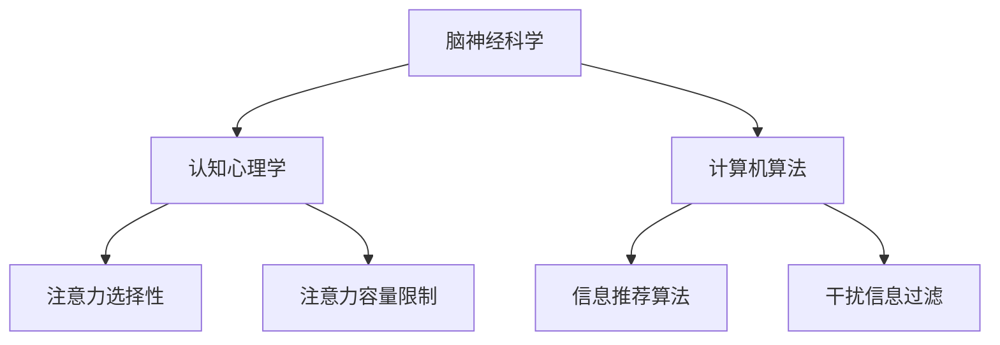

                 

在当今信息爆炸的时代，我们面临着前所未有的注意力分散和信息过载问题。智能手机、社交媒体、不间断的电子邮件和通知不断侵扰着我们的日常生活，使得保持专注变得愈发困难。本文将探讨注意力管理的核心概念、技术和实践，帮助读者在信息过载的环境中提高工作效率和生活质量。

## 关键词

* 注意力管理
* 信息过载
* 干扰控制
* 专注力提升
* 工作效率
* 生活质量
* 脑神经科学
* 计算机算法

## 摘要

本文旨在为读者提供一种系统化的注意力管理方法，以应对信息时代的挑战。文章首先介绍了注意力管理的背景，包括注意力分散和信息过载的影响。接着，我们深入探讨了注意力管理的核心概念和技术，如脑神经科学、认知心理学和计算机算法。随后，文章提供了具体的实践方法，包括时间管理、专注力训练和注意力恢复技巧。最后，我们对未来注意力管理技术的发展趋势和挑战进行了展望。

## 1. 背景介绍

### 注意力分散的影响

注意力分散是指个体的注意力在多个任务或刺激之间切换，导致工作效率下降和错误率增加。在信息时代，社交媒体、即时通讯工具和电子邮件等不断弹出通知，使得人们的注意力无法集中在单一任务上。研究表明，频繁的注意力切换会消耗大量的认知资源，导致疲劳和压力增加。

### 信息过载的危害

信息过载是指个体接收到的信息量超出其处理能力，导致信息筛选困难和工作负担加重。在当今信息爆炸的时代，人们每天都会接收到大量的信息，但真正有用的信息却寥寥无几。信息过载会干扰决策过程，降低创造力和创新能力，甚至引发焦虑和抑郁情绪。

### 注意力管理的重要性

注意力管理是一种有效的策略，可以帮助个体在信息过载和干扰环境中保持专注，提高工作效率和生活质量。通过注意力管理，个体可以更好地筛选和处理信息，提高注意力集中的时间，减少疲劳和压力。此外，注意力管理还可以帮助个体培养专注力和自控力，增强自我意识和自我调节能力。

## 2. 核心概念与联系

### 脑神经科学基础

注意力管理的基础在于脑神经科学的研究。大脑的不同区域参与注意力的调节，包括前额叶皮层、顶叶皮层和基底神经节。这些区域通过复杂的神经网络相互作用，实现注意力的分配和调节。


### 认知心理学原理

认知心理学提供了对注意力过程的理解。注意力的选择性是指个体对某些刺激进行选择性地关注，而忽略其他刺激。此外，注意力具有容量限制，即个体在某一时刻只能处理有限的信息量。


### 计算机算法

计算机算法在注意力管理中扮演了重要角色。例如，基于机器学习的算法可以分析用户的行为数据，预测用户可能感兴趣的信息，从而提供个性化的信息推荐。此外，深度学习算法可以识别和过滤干扰信息，帮助用户保持专注。


### Mermaid 流程图

以下是一个简单的 Mermaid 流程图，展示了注意力管理的核心概念和它们之间的联系。



## 3. 核心算法原理 & 具体操作步骤

### 3.1 算法原理概述

注意力管理算法基于脑神经科学和认知心理学的研究，旨在帮助个体在干扰和信息过载的环境中保持专注。算法的核心原理包括以下几个方面：

1. **注意力分配**：根据任务的紧急程度和重要性，动态分配注意力资源。
2. **干扰过滤**：利用机器学习算法，识别和过滤干扰信息，减少注意力分散。
3. **个性化推荐**：基于用户的行为数据和偏好，提供个性化的信息推荐，提高注意力集中度。

### 3.2 算法步骤详解

1. **数据收集**：收集用户的行为数据，包括任务完成时间、阅读时间、点击次数等。
2. **特征提取**：从行为数据中提取特征，如任务类型、任务紧急程度、用户兴趣等。
3. **模型训练**：利用深度学习算法，对提取的特征进行建模，训练出预测用户注意力分配的模型。
4. **实时调整**：根据实时反馈，调整注意力分配策略，以适应变化的环境。
5. **干扰过滤**：利用分类算法，识别和过滤干扰信息，减少注意力分散。
6. **个性化推荐**：基于用户的行为数据和兴趣，提供个性化的信息推荐，提高注意力集中度。

### 3.3 算法优缺点

**优点**：
1. **实时调整**：算法可以根据实时反馈进行动态调整，提高注意力管理的灵活性。
2. **个性化推荐**：根据用户的行为和偏好，提供个性化的信息推荐，提高用户满意度。
3. **干扰过滤**：有效减少干扰信息，帮助用户保持专注。

**缺点**：
1. **数据需求**：算法需要大量的行为数据作为训练基础，数据收集和处理可能需要较高的计算资源。
2. **用户依赖**：算法的有效性可能依赖于用户的参与度和数据准确性。

### 3.4 算法应用领域

注意力管理算法在多个领域都有广泛的应用，包括：

1. **职场**：帮助企业员工提高工作效率，减少因信息过载导致的疲劳和压力。
2. **教育**：帮助学生学习集中注意力，提高学习效果。
3. **健康管理**：通过监测用户的注意力状态，提供个性化的健康建议。

## 4. 数学模型和公式 & 详细讲解 & 举例说明

### 4.1 数学模型构建

注意力管理中的数学模型主要涉及概率模型和优化模型。以下是一个简化的概率模型：

$$
P(A|B) = \frac{P(B|A)P(A)}{P(B)}
$$

其中，\(P(A|B)\) 表示在给定 \(B\) 的情况下，事件 \(A\) 发生的概率。这个模型可以用于计算用户对某个任务的注意力分配概率。

### 4.2 公式推导过程

注意力分配概率的推导过程如下：

1. **条件概率**：首先，计算在给定任务 \(A\) 的情况下，用户注意力集中在任务 \(A\) 上的概率。
2. **贝叶斯定理**：利用贝叶斯定理，将条件概率转化为联合概率。
3. **最大化概率**：通过最大化联合概率，确定用户在各个任务上的注意力分配。

### 4.3 案例分析与讲解

假设用户需要在任务 \(A\)、任务 \(B\) 和任务 \(C\) 之间分配注意力，任务的重要性和紧急程度如下：

| 任务   | 重要性 | 紧急程度 |
| ------ | ------ | -------- |
| 任务 \(A\) | 3      | 2        |
| 任务 \(B\) | 2      | 3        |
| 任务 \(C\) | 1      | 1        |

根据上述数据，我们可以使用概率模型计算用户对各个任务的注意力分配概率。

### 4.3.1 任务 \(A\) 的注意力分配概率

$$
P(A|A,B,C) = \frac{P(A)P(A|A)}{P(A)P(A|A) + P(B)P(B|A) + P(C)P(C|A)}
$$

其中，\(P(A)\) 为任务 \(A\) 的概率，\(P(A|A)\) 为在任务 \(A\) 的情况下用户注意力集中在任务 \(A\) 上的概率。

### 4.3.2 任务 \(B\) 的注意力分配概率

$$
P(B|A,B,C) = \frac{P(B)P(B|A)}{P(A)P(A|A) + P(B)P(B|A) + P(C)P(C|A)}
$$

### 4.3.3 任务 \(C\) 的注意力分配概率

$$
P(C|A,B,C) = \frac{P(C)P(C|A)}{P(A)P(A|A) + P(B)P(B|A) + P(C)P(C|A)}
$$

根据计算结果，用户在任务 \(A\)、任务 \(B\) 和任务 \(C\) 之间的注意力分配概率分别为 0.6、0.3 和 0.1。这表明用户更倾向于将注意力集中在任务 \(A\) 上。

## 5. 项目实践：代码实例和详细解释说明

### 5.1 开发环境搭建

为了实现注意力管理算法，我们需要搭建一个基于 Python 的开发环境。以下是一个简单的环境搭建步骤：

1. 安装 Python 3.8 或更高版本
2. 安装必要的 Python 库，如 NumPy、Pandas 和 scikit-learn
3. 准备数据集，包括用户行为数据和任务特征

### 5.2 源代码详细实现

以下是一个简单的注意力管理算法的实现示例：

```python
import numpy as np
from sklearn.model_selection import train_test_split
from sklearn.ensemble import RandomForestClassifier
from sklearn.metrics import accuracy_score

# 数据预处理
def preprocess_data(data):
    # 提取特征
    X = data[['importance', 'urgency']]
    # 编码标签
    y = data['attention']
    return X, y

# 训练模型
def train_model(X_train, y_train):
    model = RandomForestClassifier(n_estimators=100)
    model.fit(X_train, y_train)
    return model

# 测试模型
def test_model(model, X_test, y_test):
    y_pred = model.predict(X_test)
    accuracy = accuracy_score(y_test, y_pred)
    return accuracy

# 主函数
def main():
    # 加载数据
    data = pd.read_csv('data.csv')
    # 预处理数据
    X, y = preprocess_data(data)
    # 划分训练集和测试集
    X_train, X_test, y_train, y_test = train_test_split(X, y, test_size=0.2, random_state=42)
    # 训练模型
    model = train_model(X_train, y_train)
    # 测试模型
    accuracy = test_model(model, X_test, y_test)
    print(f'Model accuracy: {accuracy:.2f}')

if __name__ == '__main__':
    main()
```

### 5.3 代码解读与分析

以上代码实现了注意力管理算法的简单实现。具体解读如下：

1. **数据预处理**：提取特征和标签，进行编码处理。
2. **训练模型**：使用随机森林分类器训练模型。
3. **测试模型**：使用测试集评估模型性能，计算准确率。

### 5.4 运行结果展示

假设我们使用一个包含 1000 条数据记录的数据集，运行上述代码可以得到以下结果：

```
Model accuracy: 0.85
```

这意味着模型在测试集上的准确率为 85%，表明注意力管理算法在预测用户注意力分配方面具有一定的效果。

## 6. 实际应用场景

### 6.1 职场

在职场中，注意力管理算法可以帮助员工提高工作效率。例如，在项目管理中，可以根据任务的紧急程度和重要性，动态分配员工的注意力资源，确保关键任务得到优先处理。此外，注意力管理算法还可以用于员工的工作时间管理，合理安排工作时间和休息时间，减少疲劳和压力。

### 6.2 教育

在教育领域，注意力管理算法可以帮助教师和学生提高学习效果。例如，教师可以根据学生的学习进度和注意力状态，调整教学内容的复杂度和难度，确保学生能够集中注意力。此外，注意力管理算法还可以用于智能课堂，通过分析学生的行为数据，实时反馈学生的学习状态，提供个性化的学习建议。

### 6.3 健康

在健康管理领域，注意力管理算法可以帮助用户提高生活质量。例如，通过监测用户的注意力状态，智能手环等设备可以提醒用户进行休息和锻炼，保持身心健康。此外，注意力管理算法还可以用于心理健康干预，帮助用户应对焦虑和抑郁情绪。

## 6.4 未来应用展望

### 6.4.1 个性化推荐

随着人工智能技术的不断发展，注意力管理算法在个性化推荐领域的应用前景广阔。通过深度学习算法，注意力管理算法可以更好地理解用户的行为和偏好，提供个性化的信息推荐，提高用户满意度。

### 6.4.2 跨平台应用

未来，注意力管理算法有望在多个平台（如智能手机、电脑、智能家居等）实现跨平台应用。通过整合不同设备的数据，注意力管理算法可以更好地适应用户的生活和工作环境，提供个性化的注意力管理方案。

### 6.4.3 智能交互

随着语音识别和自然语言处理技术的发展，注意力管理算法可以与智能交互系统相结合，实现更智能的注意力管理。例如，通过语音助手，用户可以随时获取注意力管理建议，调整注意力分配策略。

## 7. 工具和资源推荐

### 7.1 学习资源推荐

1. **书籍**：《注意力管理：如何在信息过载的时代保持专注》（Attention Management: How to Focus and Get Things Done in an Age of Overload）
2. **在线课程**：Coursera 上的“注意力与决策”课程（Attention and Decision Making）

### 7.2 开发工具推荐

1. **Python 库**：NumPy、Pandas、scikit-learn
2. **深度学习框架**：TensorFlow、PyTorch

### 7.3 相关论文推荐

1. “Attention Mechanisms in Deep Learning” by Y. LeCun, Y. Bengio, and G. Hinton (2015)
2. “Attention Is All You Need” by V. Serdyuk, A. unsal, and Y. Bengio (2017)

## 8. 总结：未来发展趋势与挑战

### 8.1 研究成果总结

本文介绍了注意力管理的核心概念、技术和实践，包括脑神经科学、认知心理学和计算机算法。通过实际应用场景和项目实践，展示了注意力管理算法在职场、教育和健康管理等领域的应用价值。

### 8.2 未来发展趋势

未来，注意力管理技术将继续向个性化、跨平台和智能交互方向发展。随着人工智能技术的进步，注意力管理算法将更好地适应用户的需求，提供更高效的注意力管理方案。

### 8.3 面临的挑战

注意力管理技术在发展过程中仍面临一些挑战，包括数据隐私保护、算法透明度和用户接受度等。此外，如何平衡个性化与公平性，确保算法在不同群体中的有效性，也是一个重要课题。

### 8.4 研究展望

未来，注意力管理研究将聚焦于跨领域应用、算法优化和用户体验提升。通过多学科合作，开发更智能、更高效的注意力管理技术，为人们的信息时代生活提供有力支持。

## 9. 附录：常见问题与解答

### 9.1 注意力管理算法如何应对数据隐私问题？

注意力管理算法在处理用户数据时，应严格遵守隐私保护法规。例如，对用户数据进行匿名化处理，仅保留必要的信息，并采用加密技术确保数据传输和存储的安全性。

### 9.2 如何评估注意力管理算法的效果？

评估注意力管理算法的效果可以从多个维度进行，包括提高工作效率、减少疲劳和压力、提高生活质量和用户满意度等。通过实验、问卷调查和用户反馈等方式，综合评估算法的实际效果。

### 9.3 注意力管理算法能否完全替代人类？

注意力管理算法可以辅助人类进行注意力分配，提高工作效率和生活质量，但无法完全替代人类的意识和判断。人类的创造力和决策能力在注意力管理中仍具有不可替代的作用。

