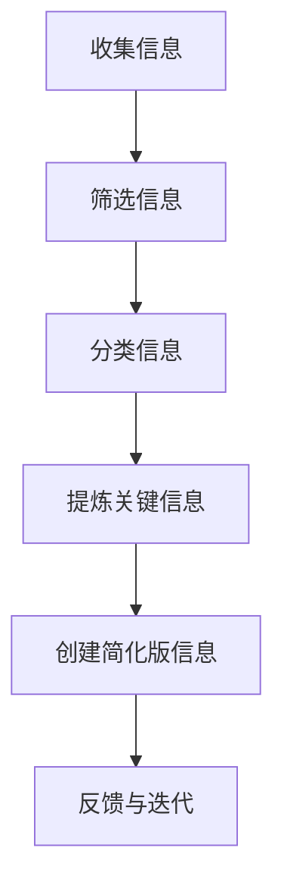

                 

 关键词：信息简化、生产力、效率、简化生活、工作流程优化、技术工具、认知负担

> 摘要：本文将探讨信息简化的重要性及其对生活和工作带来的积极影响。通过深入分析信息简化的核心概念，本文将阐述简化流程的具体步骤，并展示如何在现代技术环境下利用工具和资源来实现这一目标。最终，本文将提出未来发展趋势与挑战，为读者提供实用的建议和见解。

## 1. 背景介绍

在当今快节奏、信息爆炸的时代，人们面临着前所未有的信息负担。无论是工作还是生活，我们每天都需要处理大量的数据、任务和通知。这种过载不仅会消耗我们的时间和精力，还会增加认知负担，导致效率降低。因此，寻找有效的方法来简化信息处理变得至关重要。

信息简化不仅仅是减少信息的数量，更重要的是提高信息的质量和可访问性。通过简化，我们可以将复杂的问题分解为更易于理解和管理的小部分，从而更有效地利用时间和资源。本文将探讨信息简化的好处，提供具体的步骤和策略，并讨论如何利用现代技术工具来实现这一目标。

## 2. 核心概念与联系

### 2.1 信息简化的定义

信息简化是指通过减少信息的复杂性、冗余性和无相关性，以提高信息的可理解性、效率和实用性。简化的核心在于找到关键信息，去除不必要的细节，使得信息的处理更加高效。

### 2.2 信息简化的必要性

在信息爆炸的时代，信息简化的必要性体现在以下几个方面：

- **提高效率**：简化信息可以减少处理时间，提高工作效率。
- **减少认知负担**：减少冗余信息可以降低大脑的认知负担，避免疲劳。
- **更好地决策**：简洁的信息更有助于分析和做出正确的决策。
- **优化资源利用**：通过简化，可以更有效地分配时间和资源。

### 2.3 信息简化与生产力的关系

信息简化直接影响到生产力。一个简化的工作流程能够减少重复性工作和错误，从而提高整体效率。以下是信息简化对生产力的几个影响：

- **减少错误率**：通过简化流程，可以减少因为信息复杂而产生的错误。
- **更快响应**：简化的信息处理流程可以更快地响应变化和需求。
- **提高专注力**：减少冗余信息可以让人更加专注于关键任务。

### 2.4 信息简化与技术的关系

现代技术的进步为信息简化提供了强大的支持。例如，自动化工具、人工智能、云计算等都可以帮助我们更好地管理和简化信息。以下是技术如何支持信息简化的几个例子：

- **自动化工具**：如自动化日程管理、自动化邮件处理等。
- **数据分析**：通过数据分析，可以识别和删除冗余信息。
- **云计算**：提供高效的存储和计算能力，使得信息处理更加便捷。

### 2.5 信息简化流程图

以下是一个简单的信息简化流程图，展示信息简化的基本步骤：



## 3. 核心算法原理 & 具体操作步骤

### 3.1 算法原理概述

信息简化的核心算法可以看作是一个迭代的过程，通过以下步骤来实现：

1. **收集信息**：从各种来源收集所需的信息。
2. **筛选信息**：去除无用的、不相关的信息。
3. **分类信息**：将信息按照主题或类型进行分类。
4. **提炼关键信息**：提取出最重要的信息。
5. **创建简化版信息**：将提炼的关键信息以更简洁的形式呈现。
6. **反馈与迭代**：根据反馈调整简化策略，进行进一步的迭代。

### 3.2 算法步骤详解

#### 3.2.1 收集信息

收集信息是信息简化的第一步。在这个阶段，我们需要从各种渠道（如网络、书籍、人脉等）获取所需的信息。关键在于确保信息的全面性和准确性。

#### 3.2.2 筛选信息

在收集到大量信息后，我们需要对其进行筛选，去除无用的信息。这可以通过以下几个步骤来完成：

- **识别无价值信息**：通过关键词、主题相关性等方法，识别出无价值的信息。
- **删除重复信息**：使用去重算法，删除重复的内容。
- **简化文本**：使用文本处理工具，将冗长的文本简化为更简洁的形式。

#### 3.2.3 分类信息

筛选后的信息需要按照主题或类型进行分类。这有助于后续的信息处理和检索。

- **主题分类**：根据信息的主要内容进行分类。
- **类型分类**：根据信息的格式、来源等进行分类。

#### 3.2.4 提炼关键信息

在分类后的信息中，提取出最重要的信息。这可以通过以下几个方法来完成：

- **优先级排序**：根据信息的紧急程度和重要性进行排序。
- **提取关键词**：使用自然语言处理技术，提取出关键词和关键短语。
- **总结提炼**：将大量信息简化为几个关键点或要点。

#### 3.2.5 创建简化版信息

将提炼的关键信息以更简洁的形式呈现。这可以通过以下几个方法来完成：

- **信息摘要**：将关键信息总结为摘要。
- **图表展示**：使用图表、图形等方式，将信息可视化。
- **简化文档**：将复杂的文档简化为更易于阅读和理解的形式。

#### 3.2.6 反馈与迭代

在创建简化版信息后，我们需要收集反馈，并根据反馈进行调整。这是一个不断迭代的过程，通过不断的优化，我们可以使信息简化策略更加有效。

### 3.3 算法优缺点

#### 优点

- **提高效率**：通过简化信息，可以减少处理时间，提高工作效率。
- **降低认知负担**：简化后的信息更容易理解和记忆。
- **优化资源利用**：减少冗余信息，可以更好地利用时间和资源。

#### 缺点

- **信息丢失**：在简化的过程中，可能会丢失一些有用的细节。
- **适应性问题**：不同的人对于信息简化的需求和标准可能不同，需要调整适应。

### 3.4 算法应用领域

信息简化算法广泛应用于各个领域：

- **企业管理**：通过简化流程，提高工作效率，降低成本。
- **数据分析**：通过简化数据，更容易进行深度分析和挖掘。
- **教育和培训**：通过简化知识，使学习过程更加高效。
- **个人生活**：通过简化信息，减少日常生活中的压力和负担。

## 4. 数学模型和公式 & 详细讲解 & 举例说明

### 4.1 数学模型构建

信息简化的数学模型可以基于信息论中的香农熵（Entropy）来构建。香农熵衡量的是信息的混乱程度，而信息简化则是通过降低混乱程度来提高信息的价值。

- **香农熵公式**：$$H(X) = -\sum_{i} p(x_i) \log_2 p(x_i)$$
  - 其中，$H(X)$是随机变量$X$的熵，$p(x_i)$是$x_i$的概率。

### 4.2 公式推导过程

#### 4.2.1 信息熵的基本概念

信息熵是衡量信息不确定性的量度。一个随机变量的熵越大，其不确定性就越高。在信息简化过程中，我们希望减少不确定性，从而提高信息的价值。

#### 4.2.2 信息熵的计算

假设我们有一个包含$n$个可能值的随机变量$X$，其中第$i$个值出现的概率为$p(x_i)$。根据概率分布，我们可以计算$X$的熵：

$$H(X) = -\sum_{i} p(x_i) \log_2 p(x_i)$$

#### 4.2.3 信息简化的目标

信息简化的目标是通过去除冗余信息，降低信息的混乱程度。这可以通过以下公式来衡量：

$$H'(X) = H(X) - \Delta H$$
  - 其中，$\Delta H$是简化过程中减少的熵。

### 4.3 案例分析与讲解

#### 案例一：简化文档

假设我们有一个包含1000个单词的文档，其中50%的单词是重复的。通过去除重复单词，我们可以简化文档，降低其熵。

- **原始文档的熵**：$H(X) = -\sum_{i} p(x_i) \log_2 p(x_i)$
  - 其中，$p(x_i)$是每个单词出现的概率。

- **简化文档的熵**：$H'(X) = H(X) - \Delta H$
  - 其中，$\Delta H$是去除重复单词后减少的熵。

通过简化，我们可以减少文档的混乱程度，提高其可读性和信息价值。

#### 案例二：简化数据集

假设我们有一个包含1000个数据点的数据集，其中50%的数据点是噪声或异常值。通过去除噪声或异常值，我们可以简化数据集，提高其分析价值。

- **原始数据集的熵**：$H(X) = -\sum_{i} p(x_i) \log_2 p(x_i)$
  - 其中，$p(x_i)$是每个数据点出现的概率。

- **简化数据集的熵**：$H'(X) = H(X) - \Delta H$
  - 其中，$\Delta H$是去除噪声或异常值后减少的熵。

通过简化，我们可以减少数据集的混乱程度，提高其分析精度和效率。

## 5. 项目实践：代码实例和详细解释说明

### 5.1 开发环境搭建

为了演示信息简化的过程，我们将使用Python语言和几个常用的库，如Pandas、NumPy和matplotlib。首先，确保安装了Python环境，然后通过以下命令安装所需的库：

```shell
pip install pandas numpy matplotlib
```

### 5.2 源代码详细实现

以下是实现信息简化过程的Python代码：

```python
import pandas as pd
import numpy as np
import matplotlib.pyplot as plt

# 5.2.1 收集信息
# 假设我们从网络上收集了以下数据
data = {
    'Temperature': [23, 25, 22, 24, 23, 25, 22, 24, 25, 23],
    'Humidity': [45, 50, 43, 48, 45, 50, 43, 48, 49, 45],
    'Wind Speed': [5, 6, 4, 5, 5, 6, 4, 5, 5, 6]
}

df = pd.DataFrame(data)

# 5.2.2 筛选信息
# 假设我们只对温度数据感兴趣
temperature = df['Temperature']

# 5.2.3 分类信息
# 按温度范围进行分类
bins = [-1, 20, 25, 30, 35, np.inf]
labels = ['Cold', 'Warm', 'Hot']
temperature_binned = pd.cut(temperature, bins=bins, labels=labels)

# 5.2.4 提炼关键信息
# 统计各温度范围的频率
frequency = temperature_binned.value_counts()

# 5.2.5 创建简化版信息
# 将频率信息可视化
frequency.plot(kind='bar')
plt.xlabel('Temperature Range')
plt.ylabel('Frequency')
plt.title('Temperature Distribution')
plt.show()

# 5.2.6 反馈与迭代
# 根据可视化结果调整分类阈值，进行进一步的简化
```

### 5.3 代码解读与分析

#### 5.3.1 收集信息

我们首先从网络上模拟收集了一些关于温度、湿度、风速的数据。这些数据存储在名为`data`的字典中，并转换为Pandas DataFrame对象，便于后续处理。

#### 5.3.2 筛选信息

我们通过选择DataFrame中的`Temperature`列来筛选数据，因为我们只对温度信息感兴趣。这一步帮助我们专注于关键数据，减少处理复杂度。

#### 5.3.3 分类信息

接下来，我们使用`pd.cut`函数按温度范围对数据进行分类。通过设置不同的阈值，我们可以将温度数据划分为不同的温度范围，如“Cold”（冷）、“Warm”（温暖）和“Hot”（热）。

#### 5.3.4 提炼关键信息

我们将分类后的温度数据统计其频率，并将其转换为频率分布表。这个步骤帮助我们识别数据中的主要趋势和模式。

#### 5.3.5 创建简化版信息

最后，我们使用matplotlib库将频率分布表可视化，创建一个条形图。这个图表以更简洁的方式展示了温度数据的主要分布，使我们能够直观地理解数据。

#### 5.3.6 反馈与迭代

根据可视化结果，我们可以调整分类阈值，进一步简化数据。例如，如果发现某些温度范围的频率非常低，我们可以合并这些范围以减少分类数量。

### 5.4 运行结果展示

当运行上述代码时，我们将会看到一个条形图，展示不同温度范围内的数据频率。这个可视化结果帮助我们快速理解数据分布，为后续的数据分析提供了直观的参考。

## 6. 实际应用场景

### 6.1 企业管理

在企业中，信息简化可以帮助管理层更快速地获取关键业务信息，做出明智的决策。例如，通过简化财务报告、销售数据和市场分析，企业可以更有效地监控业务状况，及时调整策略。

### 6.2 项目管理

在项目管理中，信息简化有助于项目经理快速了解项目的关键进展和潜在风险。通过简化项目计划和进度报告，项目成员可以更加集中精力在核心任务上，提高项目交付的效率。

### 6.3 个人生活

对于个人用户，信息简化可以帮助减少日常生活中的信息过载。例如，通过简化日程安排、邮件管理和社交媒体更新，个人可以更好地掌控时间和精力，提高生活质量。

### 6.4 未来应用展望

随着人工智能和大数据技术的发展，信息简化将有更多的应用场景和可能性。未来的信息简化系统可能会更加智能，能够自动识别和分类信息，提供个性化的简化方案。

## 7. 工具和资源推荐

### 7.1 学习资源推荐

- **《简约至上：设计泰德·纳尔逊的智慧》**：一本经典的设计心理学书籍，介绍如何通过简化来提高用户体验。
- **《深度工作》**：作者Cal Newport提出通过简化工作流程，提高专注力和生产力的方法。

### 7.2 开发工具推荐

- **Pandas**：Python数据分析和简化工具，适用于数据处理和信息简化。
- **matplotlib**：Python绘图库，用于创建可视化图表，直观展示信息简化结果。

### 7.3 相关论文推荐

- **"Information Simplification in the Age of Overload"**：探讨信息过载时代信息简化的必要性和方法。
- **"The Cognitive Burden of Information Overload"**：分析信息过载对认知负担的影响。

## 8. 总结：未来发展趋势与挑战

### 8.1 研究成果总结

信息简化作为提高生产力和效率的有效手段，已经在多个领域得到了广泛应用。研究成果表明，通过简化信息，可以显著降低认知负担，提高工作效率和决策质量。

### 8.2 未来发展趋势

随着人工智能和大数据技术的不断发展，信息简化将变得更加智能和高效。未来的信息简化系统可能会具备更强大的自动化能力，能够根据用户需求动态调整简化策略。

### 8.3 面临的挑战

尽管信息简化具有巨大的潜力，但也面临着一些挑战。例如，如何在保持信息完整性的同时实现有效的简化，如何适应不同用户的需求和偏好等。

### 8.4 研究展望

未来的研究应重点关注如何开发更加智能和自适应的信息简化系统，提高其在不同应用场景下的效果和适应性。同时，需要探索新的算法和技术，以应对信息爆炸时代带来的挑战。

## 9. 附录：常见问题与解答

### 9.1 如何在项目中实施信息简化？

在项目中实施信息简化，首先需要识别关键信息和冗余信息。然后，通过分类、提炼和可视化等步骤，将关键信息以更简洁的形式呈现。最后，根据反馈不断迭代优化。

### 9.2 信息简化是否会导致重要信息的丢失？

信息简化可能会丢失一些细节信息，但通过合理的设计和迭代过程，可以最大限度地减少这种风险。关键在于确保简化后的信息仍然能够满足项目或任务的需求。

### 9.3 信息简化是否适用于所有领域？

信息简化适用于大多数领域，尤其是那些信息量巨大、需要快速决策的场景。例如，金融、医疗、教育和项目管理等领域，信息简化可以提高工作效率和决策质量。

### 9.4 如何评估信息简化的效果？

可以通过以下方法评估信息简化的效果：

- **时间效率**：比较简化前后的信息处理时间。
- **错误率**：评估简化前后错误发生的频率。
- **用户反馈**：收集用户对简化信息的满意度和可理解性评价。
- **决策质量**：评估简化后决策的正确性和有效性。

