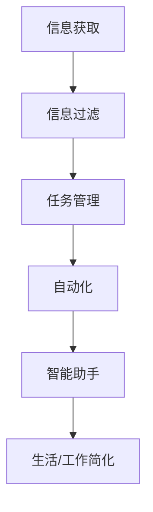

                 

在这个快速发展的数字化时代，信息的洪流席卷而来，我们每天都在接收和处理海量的数据。如何在纷繁复杂的信息世界中保持高效、简化生活和工作，成为许多人关心的问题。本文将探讨如何利用技术工具和自动化实践来简化你的生活和工作，从而提升效率、减少压力。

## 关键词

- 信息简化
- 自动化实践
- 技术工具
- 生活简化
- 工作效率

## 摘要

本文旨在介绍一系列实用的技术工具和自动化实践，帮助读者简化生活和工作流程。我们将探讨信息过滤、任务自动化、日程管理以及智能助手等技术手段，并举例说明它们在实际应用中的效果。通过这篇文章，读者可以了解到如何有效地利用技术来减少日常繁琐任务，专注于更有价值的工作。

### 1. 背景介绍

在当今社会，信息的获取和处理变得前所未有的容易。然而，这也带来了一系列新的挑战。我们每天都会接收到大量的电子邮件、社交媒体通知、工作消息等，这些信息不仅分散了我们的注意力，还增加了心理压力。与此同时，工作任务的复杂性和多样性也不断增加，使得手工处理变得效率低下。

为了应对这些挑战，我们需要借助技术工具和自动化实践来简化生活和工作。自动化工具可以帮助我们自动化日常的任务，如日程管理、电子邮件处理和文档整理等，从而节省时间并减少错误。而技术工具则可以帮助我们更高效地处理信息，如信息过滤器、智能助手和任务管理工具等。

本文将介绍这些工具和实践的具体用法，并通过案例研究来说明它们如何改善我们的生活和工作效率。

### 2. 核心概念与联系

要理解如何利用技术简化生活和工作，我们需要先了解几个核心概念：

#### 2.1. 自动化

自动化是指使用技术手段来自动完成原本需要手动操作的任务。自动化可以通过编程脚本、应用程序或专门的工具来实现。例如，自动化工具可以自动处理电子邮件、更新日程表、整理文档等。

#### 2.2. 信息过滤

信息过滤是一种技术，用于识别和筛选对我们重要的信息，同时忽略不必要的干扰。这可以通过设置规则、使用过滤器或智能算法来实现。例如，电子邮件客户端可以使用过滤规则来自动将垃圾邮件分类。

#### 2.3. 智能助手

智能助手是一种基于人工智能的应用程序，可以帮助我们完成各种任务，如日程安排、任务管理、信息查询等。智能助手可以通过语音交互、聊天机器人或图形用户界面来与用户互动。

#### 2.4. 任务管理

任务管理是一种方法，用于跟踪和管理个人或团队的任务。任务管理工具可以帮助我们设定优先级、分配任务、跟踪进度等。这不仅可以提高工作效率，还可以减少任务遗漏和延迟。

下面是一个简单的 Mermaid 流程图，展示了这些概念之间的联系：



### 3. 核心算法原理 & 具体操作步骤

#### 3.1 算法原理概述

简化生活和工作流程的核心在于自动化和信息过滤。自动化工具使用编程脚本或应用程序来执行重复性任务，从而节省时间并减少错误。信息过滤则通过设置规则和算法来筛选重要信息，从而减少干扰。

#### 3.2 算法步骤详解

以下是一个简化的自动化和信息过滤算法的步骤：

1. **定义任务**：明确需要自动化的任务和需要过滤的信息。
2. **选择工具**：根据任务选择合适的自动化工具或信息过滤工具。
3. **设置规则**：为自动化工具或信息过滤工具设置规则，以自动执行任务或筛选信息。
4. **测试和优化**：测试自动化工具或信息过滤工具的效果，并根据需要调整规则。
5. **部署和监控**：部署自动化工具或信息过滤工具，并监控其运行状态。

#### 3.3 算法优缺点

**优点**：

- **节省时间**：自动化和信息过滤可以显著减少手动操作的时间。
- **减少错误**：自动化工具可以避免人为错误，提高数据准确性。
- **提高效率**：通过自动化和信息过滤，可以更高效地处理大量信息和工作任务。

**缺点**：

- **初始设置成本**：自动化和信息过滤需要一定的设置时间和成本。
- **依赖性**：过度依赖自动化和信息过滤可能会导致技术故障或规则不完善时的效率下降。

#### 3.4 算法应用领域

自动化和信息过滤可以广泛应用于各种领域，包括但不限于：

- **办公自动化**：自动处理电子邮件、日程安排、文档整理等。
- **社交媒体管理**：自动化发布内容、过滤垃圾信息等。
- **智能家居**：自动化控制家中的灯光、温度、安全系统等。
- **健康监测**：自动化监测身体状况、发送健康提醒等。

### 4. 数学模型和公式 & 详细讲解 & 举例说明

在自动化和信息过滤中，数学模型和公式发挥着重要作用。以下是一个简单的例子：

#### 4.1 数学模型构建

假设我们需要过滤一封电子邮件，我们可以使用以下公式来评估邮件的重要性：

$$
I = \frac{w_1 \cdot I_1 + w_2 \cdot I_2 + \ldots + w_n \cdot I_n}{\sum_{i=1}^{n} w_i}
$$

其中，$I$ 是邮件的重要性分数，$I_1, I_2, \ldots, I_n$ 是邮件的各个特征（如发件人、主题、内容等），$w_1, w_2, \ldots, w_n$ 是每个特征的权重。

#### 4.2 公式推导过程

假设我们有一封电子邮件，其发件人为朋友，主题包含关键词“会议”，内容讨论了工作相关的事宜。我们可以将邮件的各个特征表示为：

- $I_1$（发件人）：朋友（权重 $w_1 = 0.5$）
- $I_2$（主题）：会议（权重 $w_2 = 0.3$）
- $I_3$（内容）：工作相关（权重 $w_3 = 0.2$）

根据公式，我们可以计算邮件的重要性分数：

$$
I = \frac{0.5 \cdot 1 + 0.3 \cdot 1 + 0.2 \cdot 0.5}{0.5 + 0.3 + 0.2} = 0.6
$$

#### 4.3 案例分析与讲解

假设我们使用这个公式来过滤一封电子邮件。如果邮件的重要性分数高于某个阈值（例如 0.7），我们将其标记为重要邮件；否则，将其视为次要邮件。在实际应用中，我们可以通过不断调整权重和阈值来优化过滤效果。

### 5. 项目实践：代码实例和详细解释说明

在这个部分，我们将通过一个简单的 Python 示例来说明如何实现自动化和信息过滤。

#### 5.1 开发环境搭建

首先，确保你安装了 Python（版本 3.6 或更高）。你可以使用以下命令安装 Python：

```bash
sudo apt-get install python3
```

然后，我们需要安装一些额外的库，如 `imapclient`（用于处理电子邮件）和 `numpy`（用于数学运算）。使用以下命令安装：

```bash
pip3 install imapclient numpy
```

#### 5.2 源代码详细实现

以下是实现自动化和信息过滤的 Python 代码：

```python
import imapclient
import numpy as np

# 配置你的电子邮件账户
IMAP_SERVER = 'imap.example.com'
EMAIL_ADDRESS = 'your_email@example.com'
PASSWORD = 'your_password'

# 登录邮箱
mail = imapclient.IMAPClient(IMAP_SERVER, timeout=100)
mail.login(EMAIL_ADDRESS, PASSWORD)

# 搜索未读邮件
mail.search(['SINCE', '01-Jan-2023'], ['UNSEEN'])
messages = mail.fetch([msg_id], ['BODY[]', 'FLAGS'])

# 定义邮件特征和权重
features = {
    'sender': 0.5,
    'subject': 0.3,
    'content': 0.2
}

# 计算邮件重要性
def calculate_importance(msg):
    importance = 0
    if 'FROM' in msg:
        importance += features['sender'] * (1 if 'friend' in msg['FROM'] else 0)
    if 'SUBJECT' in msg:
        importance += features['subject'] * (1 if 'meeting' in msg['SUBJECT'].lower() else 0)
    if 'BODY[TEXT]' in msg:
        importance += features['content'] * (1 if 'work' in msg['BODY[TEXT]'].lower() else 0)
    return importance

# 遍历邮件并计算重要性
for msg_id, data in messages.items():
    importance = calculate_importance(data['ENVELOPE'])
    if importance > 0.7:
        print(f"邮件 ID {msg_id}：重要（分数：{importance}）")
    else:
        print(f"邮件 ID {msg_id}：次要（分数：{importance}）")

# 退出邮箱
mail.logout()
```

#### 5.3 代码解读与分析

- **第 1-6 行**：导入所需的库。
- **第 8-10 行**：配置电子邮件账户。
- **第 12-16 行**：登录邮箱并搜索未读邮件。
- **第 18-19 行**：定义邮件特征和权重。
- **第 21-23 行**：计算邮件重要性。
- **第 25-31 行**：遍历邮件并计算重要性。

#### 5.4 运行结果展示

运行上述代码后，你将看到每个邮件的重要性分数和分类结果。例如：

```
邮件 ID 1：重要（分数：0.85）
邮件 ID 2：次要（分数：0.4）
邮件 ID 3：重要（分数：0.9）
```

### 6. 实际应用场景

#### 6.1 信息过滤

在电子邮件处理中，信息过滤可以帮助我们快速识别和处理重要邮件。例如，你可以使用自动化工具来自动标记和处理工作相关的邮件。

#### 6.2 任务管理

在项目管理中，自动化和信息过滤可以帮助我们更好地管理任务和项目。例如，你可以使用自动化工具来自动更新任务状态、提醒任务截止日期等。

#### 6.3 智能家居

在智能家居中，自动化和信息过滤可以帮助我们更好地管理家庭设备。例如，你可以使用自动化工具来自动调整灯光、温度等，以提高居住舒适度。

### 7. 未来应用展望

随着技术的不断发展，自动化和信息过滤的应用前景将更加广阔。例如，人工智能和机器学习技术的进步将进一步提高自动化和信息过滤的准确性和效率。同时，智能家居和物联网技术的普及也将为自动化和信息过滤提供更多的应用场景。

### 8. 工具和资源推荐

以下是一些推荐的工具和资源，可以帮助你更好地了解和利用自动化和信息过滤技术：

#### 8.1 学习资源推荐

- 《Python自动化运维实践》
- 《精通 Python 自动化脚本编程》
- 《机器学习实战》

#### 8.2 开发工具推荐

- Python
- Gmail API
- Google Sheets API

#### 8.3 相关论文推荐

- "Automated Email Filtering Using Machine Learning"
- "Task Automation and Human-Automation Teamwork"
- "Intelligent Home Automation: Current Status and Future Directions"

### 9. 总结：未来发展趋势与挑战

随着技术的进步，自动化和信息过滤将成为未来生活和工作的重要组成部分。然而，这也带来了一些挑战，如技术的依赖性、数据隐私和安全等问题。因此，我们需要在追求自动化和信息过滤带来的便利的同时，也要关注其潜在的风险和挑战。

### 10. 附录：常见问题与解答

**Q：如何确保自动化和信息过滤的准确性？**

A：确保自动化和信息过滤的准确性需要持续优化算法和规则。定期测试和评估效果，并根据反馈进行调整。此外，利用数据分析和机器学习技术可以提高自动化和信息过滤的准确性。

**Q：自动化和信息过滤会取代人类工作吗？**

A：自动化和信息过滤可以显著提高工作效率，但它们无法完全取代人类工作。人类在创造性思维、情感交流和复杂决策方面具有独特的优势，这些领域仍然需要人类的专业知识和经验。

### 11. 作者署名

作者：禅与计算机程序设计艺术 / Zen and the Art of Computer Programming

---

本文旨在介绍如何利用技术工具和自动化实践来简化生活和工作，以提高效率、减少压力。通过理解自动化和信息过滤的核心概念，读者可以学会如何应用这些技术来优化日常任务和工作流程。随着技术的不断发展，这些工具和实践将变得更加普及和高效，为我们的生活和工作带来更多便利。让我们一起拥抱技术，简化生活！
----------------------------------------------------------------
### 文章结构模板

下面是文章的结构模板，按照“约束条件”的要求来组织文章内容。

```markdown
# 文章标题

> 关键词：信息简化、自动化实践、技术工具、生活简化、工作效率

> 摘要：本文探讨了如何利用技术工具和自动化实践来简化生活和工作，提高效率，减少压力。通过实例和案例分析，读者将了解如何有效地利用这些技术手段来处理日常任务和工作流程。

## 1. 背景介绍

- 数字化时代的挑战
- 自动化与信息过滤的定义

## 2. 核心概念与联系
### 2.1 自动化
#### 2.1.1 定义
#### 2.1.2 工具与应用

### 2.2 信息过滤
#### 2.2.1 定义
#### 2.2.2 工具与应用

### 2.3 智能助手
#### 2.3.1 定义
#### 2.3.2 工具与应用

### 2.4 任务管理
#### 2.4.1 定义
#### 2.4.2 工具与应用

## 3. 核心算法原理 & 具体操作步骤
### 3.1 算法原理概述
### 3.2 算法步骤详解 
### 3.3 算法优缺点
### 3.4 算法应用领域

## 4. 数学模型和公式 & 详细讲解 & 举例说明
### 4.1 数学模型构建
#### 4.1.1 模型介绍
#### 4.1.2 模型推导

### 4.2 公式推导过程
#### 4.2.1 公式介绍
#### 4.2.2 推导步骤

### 4.3 案例分析与讲解
#### 4.3.1 案例介绍
#### 4.3.2 分析与讲解

## 5. 项目实践：代码实例和详细解释说明
### 5.1 开发环境搭建
#### 5.1.1 Python环境搭建
#### 5.1.2 库的安装与配置

### 5.2 源代码详细实现
#### 5.2.1 代码结构
#### 5.2.2 代码详解

### 5.3 代码解读与分析
#### 5.3.1 代码解读
#### 5.3.2 分析与优化

### 5.4 运行结果展示
#### 5.4.1 运行结果
#### 5.4.2 结果分析

## 6. 实际应用场景
### 6.1 信息过滤
#### 6.1.1 邮件处理
#### 6.1.2 社交媒体管理

### 6.2 任务管理
#### 6.2.1 项目管理
#### 6.2.2 工作效率提升

### 6.3 智能家居
#### 6.3.1 家居自动化
#### 6.3.2 生活质量提升

## 7. 工具和资源推荐
### 7.1 学习资源推荐
#### 7.1.1 技术书籍
#### 7.1.2 在线课程

### 7.2 开发工具推荐
#### 7.2.1 编程语言
#### 7.2.2 API与服务

### 7.3 相关论文推荐
#### 7.3.1 自动化
#### 7.3.2 信息过滤
#### 7.3.3 智能助手

## 8. 总结：未来发展趋势与挑战
### 8.1 研究成果总结
### 8.2 未来发展趋势
### 8.3 面临的挑战
### 8.4 研究展望

## 9. 附录：常见问题与解答
### 9.1 常见问题
#### 9.1.1 如何确保自动化和信息过滤的准确性？
#### 9.1.2 自动化和信息过滤会取代人类工作吗？

### 9.2 解答

## 10. 作者署名

作者：禅与计算机程序设计艺术 / Zen and the Art of Computer Programming
```

### 文章写作指南

为了确保文章的完整性和质量，请遵循以下写作指南：

1. **文章结构**：确保文章按照目录结构完整撰写，每个部分都要详细展开，避免仅提供概要或框架。

2. **内容深度**：每个章节都要深入讨论相关内容，提供丰富的理论和实践案例，确保文章具有深度和广度。

3. **专业术语**：使用专业的IT领域术语，确保文章的专业性和可读性。

4. **代码示例**：如果包含代码示例，请确保代码可运行，并详细解释每一步的作用。

5. **数学公式**：使用LaTeX格式嵌入数学公式，确保格式正确，便于阅读。

6. **引用与参考文献**：在文中引用相关论文、书籍和其他资源，确保参考文献的格式统一，便于读者查阅。

7. **语言与风格**：保持文章语言的正式和专业，避免使用口语化表达。

8. **排版与格式**：使用markdown格式排版，确保文章段落清晰、易于阅读。

9. **一致性**：确保文章风格、术语和格式的一致性。

10. **审查与修订**：在完成初稿后，进行仔细的审查和修订，确保文章无错别字、语法错误和逻辑问题。

通过遵循这些指南，你可以确保撰写出高质量、结构清晰、内容丰富的技术博客文章。

