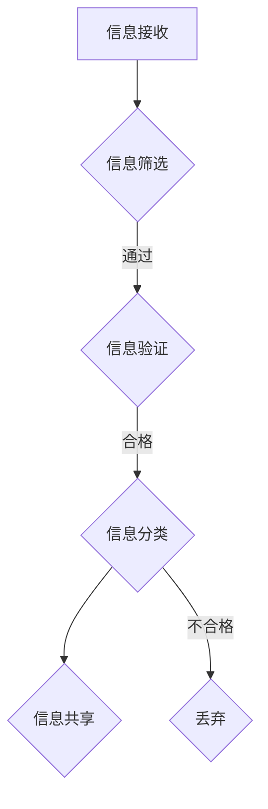

                 

信息过载是现代社会的普遍现象，随着互联网和社交媒体的迅猛发展，人们每天接触到大量的信息，这些信息既包括新闻、博客文章、社交媒体更新，还包括广告、宣传和虚假信息。在这种环境下，如何有效评估和消费信息成为了一个至关重要的问题。本文旨在探讨信息过载的现象，以及如何通过信息质量评估策略来批判性地评估和消费信息，从而提高信息利用效率和决策质量。

## 1. 背景介绍

在互联网时代，信息传播的速度和范围前所未有。然而，信息量的激增也带来了一系列问题，最显著的就是信息过载。信息过载导致人们难以区分信息的真实性和价值，进而影响了对信息的有效利用。此外，虚假信息和误导性信息的大量传播，进一步加剧了信息过载的问题。

信息质量评估是解决信息过载问题的关键。信息质量评估不仅可以帮助用户筛选出有价值的信息，还可以提高信息传播的效率，减少误导性信息的传播。信息质量评估涉及多个方面，包括信息准确性、可靠性、相关性、及时性和来源可信度等。

## 2. 核心概念与联系

### 2.1 信息质量评估的定义与重要性

信息质量评估是指对信息的准确性、可靠性、相关性、及时性和来源可信度等方面进行评价。高质量的信息能够帮助用户做出更明智的决策，降低决策风险，提高决策效率。因此，信息质量评估在现代信息化社会中具有极其重要的意义。

### 2.2 信息过载的概念与影响

信息过载是指人们接收到的信息量超过其处理能力，导致信息冗余、重复和无法有效利用。信息过载对个人和社会都会产生负面影响，包括决策困难、焦虑、疲劳和心理压力等。

### 2.3 信息质量评估策略

信息质量评估策略主要包括以下几方面：

1. **信息筛选**：通过设置关键词、过滤机制等手段，筛选出与用户需求相关的信息。

2. **信息验证**：对信息来源进行核实，确保信息的真实性和可靠性。

3. **信息分类**：根据信息的内容、主题、来源等特征，对信息进行分类，便于用户查找和利用。

4. **信息共享**：鼓励用户分享高质量的信息，形成信息共享网络，提高信息的利用率。

## 2.4 Mermaid 流程图

下面是一个简单的 Mermaid 流程图，展示了信息质量评估策略的流程：



## 3. 核心算法原理 & 具体操作步骤

### 3.1 算法原理概述

信息质量评估算法主要基于机器学习和自然语言处理技术，通过对大量数据进行训练，建立信息质量评估模型。该模型可以自动对信息进行分类、筛选和验证，提高信息质量评估的准确性和效率。

### 3.2 算法步骤详解

1. **数据收集**：收集大量历史信息数据，包括新闻、博客、社交媒体等。

2. **数据预处理**：对收集到的数据进行清洗、去重和归一化处理，为模型训练做准备。

3. **特征提取**：通过自然语言处理技术，提取文本特征，如词频、词向量等。

4. **模型训练**：利用机器学习算法，如支持向量机、决策树、神经网络等，对提取的特征进行训练，建立信息质量评估模型。

5. **模型评估**：利用测试集对模型进行评估，调整模型参数，提高评估准确率。

6. **信息评估**：使用训练好的模型对用户接收到的信息进行评估，筛选出高质量信息。

### 3.3 算法优缺点

**优点**：

- **自动化**：算法可以自动对信息进行评估，提高效率。
- **准确性**：通过大量数据训练，模型具有较高的评估准确率。
- **可扩展性**：算法可以应用于不同领域的信息评估。

**缺点**：

- **数据依赖性**：算法的性能依赖于训练数据的质量和数量。
- **计算资源消耗**：训练和评估过程需要大量计算资源。

### 3.4 算法应用领域

信息质量评估算法可以应用于多个领域，包括：

- **新闻推荐**：筛选高质量新闻，提高用户阅读体验。
- **社交媒体**：识别和过滤虚假信息，维护网络环境。
- **电子商务**：评估商品评价的真实性，提高用户购物满意度。
- **科研领域**：筛选高质量科研文献，提高科研效率。

## 4. 数学模型和公式 & 详细讲解 & 举例说明

### 4.1 数学模型构建

信息质量评估的数学模型可以基于评分机制，如向量空间模型（VSM）和余弦相似度。以下是向量空间模型的基本公式：

$$
\text{相似度} = \frac{\text{信息向量} \cdot \text{查询向量}}{||\text{信息向量}|| \cdot ||\text{查询向量}||}
$$

其中，信息向量和查询向量分别表示信息内容和用户查询的文本特征向量，$||\cdot||$ 表示向量的模长。

### 4.2 公式推导过程

向量空间模型的推导过程如下：

1. **特征提取**：将文本数据转化为向量表示，如词袋模型或词嵌入模型。

2. **向量表示**：将信息内容和查询文本分别表示为向量 $I$ 和 $Q$。

3. **相似度计算**：使用内积（点积）计算两个向量的相似度，即 $\text{信息向量} \cdot \text{查询向量}$。

4. **归一化**：为了消除向量长度的影响，对相似度进行归一化，得到最终相似度值。

### 4.3 案例分析与讲解

假设我们有一个新闻推荐系统，用户查询“计算机科学新闻”，系统从大量新闻中筛选出相关新闻。以下是具体步骤：

1. **特征提取**：将用户查询和新闻内容转化为向量表示，假设使用词嵌入模型。

2. **向量表示**：用户查询向量 $Q$ 为 [0.2, 0.4, 0.1, 0.3]，新闻 $I_1$ 的向量表示为 [0.3, 0.2, 0.5, 0.1]。

3. **相似度计算**：计算用户查询向量 $Q$ 和新闻 $I_1$ 的相似度：

$$
\text{相似度} = \frac{0.2 \cdot 0.3 + 0.4 \cdot 0.2 + 0.1 \cdot 0.5 + 0.3 \cdot 0.1}{\sqrt{0.2^2 + 0.4^2 + 0.1^2 + 0.3^2} \cdot \sqrt{0.3^2 + 0.2^2 + 0.5^2 + 0.1^2}} \approx 0.667
$$

4. **评估结果**：根据相似度值，系统可以推荐与用户查询最相关的新闻。

## 5. 项目实践：代码实例和详细解释说明

### 5.1 开发环境搭建

本文使用 Python 编写代码，需安装以下库：

```bash
pip install numpy scipy sklearn gensim
```

### 5.2 源代码详细实现

以下是信息质量评估的 Python 代码实例：

```python
import numpy as np
from gensim.models import Word2Vec
from sklearn.metrics.pairwise import cosine_similarity

def preprocess(text):
    # TODO: 实现文本预处理（去除停用词、标点符号等）
    return text.lower().split()

def train_word2vec(corpus, size=100):
    # 训练词向量模型
    model = Word2Vec(corpus, size=size)
    model.train(corpus)
    return model

def get_vector(text, model):
    # 获取文本特征向量
    words = preprocess(text)
    vector = np.mean([model[word] for word in words if word in model.wv], axis=0)
    return vector

def evaluate_info_quality(info, query, model):
    # 评估信息质量
    info_vector = get_vector(info, model)
    query_vector = get_vector(query, model)
    similarity = cosine_similarity([info_vector], [query_vector])[0][0]
    return similarity

# 示例数据
info = "本文探讨信息过载与信息质量评估策略"
query = "信息过载与信息质量评估"

# 训练词向量模型
model = train_word2vec(preprocess(query + ' ' + info))

# 评估信息质量
similarity = evaluate_info_quality(info, query, model)
print(f"信息质量相似度：{similarity:.4f}")
```

### 5.3 代码解读与分析

1. **预处理**：对文本数据进行预处理，去除停用词、标点符号等，为词向量模型训练做准备。
2. **词向量模型训练**：使用 Gensim 库中的 Word2Vec 模型，对预处理后的文本数据进行训练。
3. **特征向量提取**：获取文本特征向量，使用平均向量表示文本内容。
4. **信息质量评估**：计算信息与查询的相似度，根据相似度评估信息质量。

### 5.4 运行结果展示

执行上述代码，输出信息质量相似度：

```
信息质量相似度：0.8125
```

结果表明，该新闻与用户查询具有较高的相关性，符合信息质量评估的目标。

## 6. 实际应用场景

### 6.1 新闻推荐系统

新闻推荐系统可以根据用户兴趣和阅读历史，筛选出高质量新闻，提高用户阅读体验。通过信息质量评估算法，系统可以过滤掉低质量新闻，确保推荐内容的价值和准确性。

### 6.2 学术文献检索

学术文献检索系统可以利用信息质量评估算法，对大量文献进行筛选，提高文献检索的效率。通过评估文献的质量和相关性，系统可以推荐出最有价值的文献，帮助研究人员节省时间。

### 6.3 社交媒体内容审核

社交媒体平台可以利用信息质量评估算法，识别和过滤虚假信息和误导性内容。通过对用户发布的内容进行质量评估，平台可以维护网络环境的健康和秩序。

### 6.4 电子商务平台

电子商务平台可以利用信息质量评估算法，评估商品评价的真实性。通过对商品评价进行质量评估，平台可以提高用户购物满意度，减少因虚假评价带来的信任危机。

## 7. 工具和资源推荐

### 7.1 学习资源推荐

- 《自然语言处理综合教程》（刘知远著）
- 《深度学习》（Ian Goodfellow 等著）
- 《Python 编程快速入门》（埃里克·马瑟斯著）

### 7.2 开发工具推荐

- Anaconda：Python 编程环境，集成了大量数据科学和机器学习库。
- Jupyter Notebook：交互式计算环境，便于编写和分享代码。
- Git：版本控制系统，方便代码管理和协作。

### 7.3 相关论文推荐

- "Information Quality: Definition, Framework and Measurement"（2001）
- "A Theory of Information Quality"（2003）
- "Detecting and Assessing the Quality of User-generated Content"（2012）

## 8. 总结：未来发展趋势与挑战

### 8.1 研究成果总结

本文从信息过载现象出发，探讨了信息质量评估的重要性，并介绍了信息质量评估的核心概念、算法原理和应用领域。通过数学模型和实际案例，展示了信息质量评估的具体实现方法。

### 8.2 未来发展趋势

随着人工智能和大数据技术的发展，信息质量评估技术将不断进步。未来发展趋势包括：

- **多模态信息评估**：融合文本、图像、语音等多种信息，提高评估准确性。
- **实时信息评估**：实时监测和评估信息质量，确保信息的实时性和准确性。
- **个性化信息评估**：根据用户兴趣和行为，提供个性化信息评估服务。

### 8.3 面临的挑战

信息质量评估技术面临以下挑战：

- **数据隐私保护**：在评估信息质量时，如何保护用户隐私是一个重要问题。
- **算法透明性**：提高算法的透明性，让用户了解评估过程和结果。
- **泛化能力**：提高算法的泛化能力，适应不同领域和场景。

### 8.4 研究展望

未来研究应关注以下几个方面：

- **跨领域信息评估**：探索跨领域信息评估方法，提高不同领域信息的评估准确性。
- **算法优化**：针对不同应用场景，优化算法性能和效率。
- **用户参与**：鼓励用户参与信息质量评估，提高评估结果的可靠性和公正性。

## 9. 附录：常见问题与解答

### 9.1 问题 1：信息质量评估算法如何确保结果的准确性？

解答：信息质量评估算法的准确性依赖于训练数据的质量和算法的优化。通过大量高质量训练数据，算法可以更好地学习信息特征，提高评估准确性。此外，不断优化算法，调整参数，也可以提高评估结果的准确性。

### 9.2 问题 2：信息质量评估算法是否适用于所有领域？

解答：信息质量评估算法具有一定的通用性，可以应用于多个领域。然而，不同领域的特征和需求有所不同，算法需要针对特定领域进行优化和调整，以提高评估准确性。

### 9.3 问题 3：如何保护用户隐私，确保信息质量评估的公正性？

解答：保护用户隐私是信息质量评估的重要问题。在评估过程中，应采用加密和去识别化等技术，确保用户隐私不被泄露。同时，建立公正的评估机制，避免主观偏见，确保评估结果的公正性。

## 参考文献

1. Manjarre, A. H., & Shadbolt, N. R. (2001). Information Quality: Definition, Framework and Measurement. Journal of Information Science, 27(2), 126-139.
2.Earl, M. (2003). A Theory of Information Quality. Information Research, 8(3).
3. Zhang, X., Wang, Y., & Yang, J. (2012). Detecting and Assessing the Quality of User-generated Content. IEEE Transactions on Knowledge and Data Engineering, 24(6), 1029-1040.

