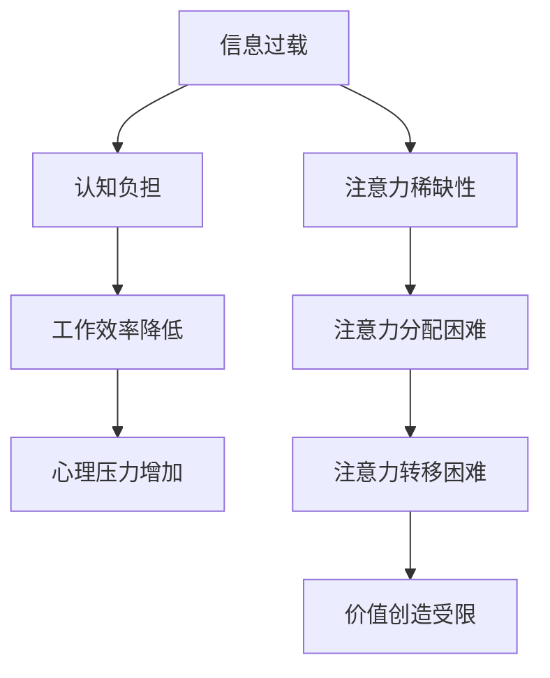

                 

在当今数字化时代，信息过载已经成为一个普遍现象。人们每天都被大量的信息包围，从社交媒体更新到电子邮件通知，再到不断弹出的消息和通知，这些信息不断地争夺着我们的注意力和时间。这种现象不仅让我们感到疲惫不堪，还可能导致我们无法有效地完成任务，甚至影响到我们的心理健康。本文将探讨信息过载对个人和社会的影响，以及如何在注意力经济中有效管理时间和注意力。

## 1. 背景介绍

信息过载（Information Overload）是指个体在接收和处理信息时，信息量超过了其处理能力，导致认知负担加重，无法有效地处理信息。在数字时代，信息过载主要源于以下几个方面：

- **社交媒体**：社交媒体平台上的信息量巨大，用户每天都要面对大量的更新和通知。
- **电子邮件**：电子邮件是现代办公的主要沟通方式，大量邮件可能使个人感到压力。
- **即时通讯**：如微信、Slack 等即时通讯工具，使个人不断被新的信息打扰。
- **在线内容**：网络上有无数的视频、文章、博客和新闻，用户很容易迷失在信息海洋中。

注意力经济（Attention Economy）是指通过获取和吸引人们的注意力来创造价值的经济模式。在数字时代，注意力成为了一种稀缺资源，因为人们的时间和精力有限，而信息来源却无限。因此，如何有效地管理注意力变得至关重要。

## 2. 核心概念与联系

### 2.1 信息过载

信息过载的概念可以归结为以下三个主要方面：

1. **信息量过多**：数字时代的信息量爆炸性增长，远超人类处理能力。
2. **处理效率降低**：信息过载导致个体无法高效地处理和利用信息，降低了工作效率。
3. **心理压力增加**：持续的信息过载可能导致个体感到焦虑和压力，影响心理健康。

### 2.2 注意力经济

注意力经济中的核心概念包括：

1. **注意力稀缺性**：由于时间和精力有限，人们的注意力成为了一种稀缺资源。
2. **注意力分配**：如何有效地分配注意力，以获取最大的价值。
3. **注意力转移**：通过吸引注意力来创造价值，例如广告、社交媒体等。

### 2.3 信息过载与注意力经济的关系

信息过载和注意力经济之间存在紧密的联系：

- **注意力争夺**：信息过载加剧了注意力资源的稀缺性，使得获取注意力变得更加困难。
- **时间管理**：在注意力经济中，有效的注意力管理就是时间管理。
- **价值创造**：信息过载背景下，有效的信息处理和注意力管理有助于创造更大的价值。

## 2.3 Mermaid 流程图



## 3. 核心算法原理 & 具体操作步骤

### 3.1 算法原理概述

在信息过载和注意力经济的背景下，我们需要一种有效的算法来帮助我们管理时间和注意力。这种算法的核心原理包括以下几个方面：

1. **优先级排序**：根据任务的紧急程度和重要性对任务进行排序，优先处理重要且紧急的任务。
2. **时间管理**：通过设定时间限制和任务分割，提高任务完成效率和注意力集中度。
3. **注意力分配**：根据任务的复杂程度和所需注意力强度，合理分配注意力资源。

### 3.2 算法步骤详解

1. **任务分类**：将任务分为紧急、重要、不紧急和不重要四类。
   ```mermaid
   graph TD
   A[紧急重要] --> B{处理}
   B --> C[重要不紧急] --> D{延期处理}
   D --> E[不紧急不重要] --> F{推迟或删除}
   F --> G[紧急不重要] --> H{委托或快速处理}
   ```

2. **时间管理**：使用番茄工作法（Pomodoro Technique）进行时间分割，提高注意力集中度。
   ```mermaid
   graph TD
   A[25分钟工作] --> B[5分钟休息]
   B --> C[重复循环]
   ```

3. **注意力分配**：根据任务复杂度和所需注意力强度，调整注意力的分配。
   ```mermaid
   graph TD
   A[低复杂度任务] --> B[集中注意力}
   B --> C[高复杂度任务] --> D[分配注意力}
   ```

### 3.3 算法优缺点

#### 3.3.1 优点

- **提高效率**：通过优先级排序和时间管理，可以更有效地完成工作任务。
- **减少压力**：合理的注意力分配和时间限制有助于减轻工作压力和心理负担。
- **专注提升**：番茄工作法等时间管理技术有助于提高注意力的集中度和工作效率。

#### 3.3.2 缺点

- **实施难度**：需要较高的自律性，否则容易陷入拖延和分心的困境。
- **适应性问题**：不同的任务和个体可能需要不同的时间管理和注意力分配策略，难以一概而论。

### 3.4 算法应用领域

- **办公自动化**：通过自动化工具和软件，实现任务的优先级排序和时间管理。
- **个人生活**：在日常生活中，使用手机应用程序和日历提醒，帮助管理时间和注意力。
- **教育领域**：在教育中，教师可以引导学生使用这些方法，提高学习效率。

## 4. 数学模型和公式 & 详细讲解 & 举例说明

### 4.1 数学模型构建

在信息过载和注意力经济的背景下，我们可以构建以下数学模型来评估个体在给定时间内的信息处理能力和价值创造潜力：

1. **信息处理能力模型**：
   $$E = f(P, T)$$
   其中，$E$ 代表信息处理能力，$P$ 代表注意力强度，$T$ 代表时间。

2. **价值创造模型**：
   $$V = g(E, I)$$
   其中，$V$ 代表价值创造，$E$ 代表信息处理能力，$I$ 代表信息量。

### 4.2 公式推导过程

1. **信息处理能力模型推导**：

   信息处理能力取决于注意力的集中度和时间。假设注意力强度$P$与时间的乘积代表总注意力，我们可以得到以下关系：

   $$E = P \times T$$

2. **价值创造模型推导**：

   价值创造与信息处理能力和信息量成正比。假设信息量$I$在一定范围内对价值创造的影响是线性的，我们可以得到以下关系：

   $$V = k \times E \times I$$
   其中，$k$ 是一个比例常数。

### 4.3 案例分析与讲解

#### 4.3.1 信息处理能力案例分析

假设一个人在25分钟内能够集中注意力，注意力强度为80%，那么他的信息处理能力为：

$$E = 0.8 \times 25 = 20$$

#### 4.3.2 价值创造案例分析

假设该人所在的信息量$I$为100，比例常数$k$为2，那么他的价值创造为：

$$V = 2 \times 20 \times 100 = 4000$$

### 4.4 总结

通过上述数学模型和公式的构建，我们可以更好地理解和评估个体在信息过载和注意力经济背景下的信息处理能力和价值创造潜力。这些模型和公式不仅可以帮助我们进行理论分析，还可以在实际操作中提供有益的指导。

## 5. 项目实践：代码实例和详细解释说明

### 5.1 开发环境搭建

为了更好地理解信息处理和注意力管理的算法，我们可以通过一个简单的Python项目来实现这些概念。以下是项目的开发环境搭建步骤：

1. **安装Python**：确保你的计算机上已经安装了Python 3.8及以上版本。
2. **安装依赖库**：使用pip安装必要的依赖库，例如`requests`用于处理HTTP请求，`beautifulsoup4`用于解析HTML等。

   ```bash
   pip install requests beautifulsoup4
   ```

### 5.2 源代码详细实现

以下是一个简单的Python代码示例，用于模拟信息处理和注意力管理的过程：

```python
import requests
from bs4 import BeautifulSoup
import time

# 优先级任务列表
tasks = [
    {"name": "处理邮件", "priority": 1},
    {"name": "阅读新闻", "priority": 2},
    {"name": "处理待办事项", "priority": 3},
    {"name": "回复社交媒体消息", "priority": 4},
]

# 时间管理参数
work_time = 25
rest_time = 5

# 初始化信息处理能力
info_processing_ability = 100

def process_task(task):
    print(f"正在处理任务：{task['name']}")
    time.sleep(2)  # 模拟任务处理时间
    global info_processing_ability
    info_processing_ability -= task['priority']

def rest():
    print("休息时间到，放松一下。")
    time.sleep(rest_time)

while info_processing_ability > 0:
    # 按优先级排序任务
    tasks.sort(key=lambda x: x['priority'])

    for task in tasks:
        if info_processing_ability > 0:
            process_task(task)
            rest()
        else:
            print("信息处理能力不足，任务暂停。")
            break
    else:
        print("所有任务已完成。")

# 运行项目
if __name__ == "__main__":
    print("开始任务管理。")
    start_time = time.time()
    while info_processing_ability > 0:
        # 按优先级处理任务
        for task in tasks:
            if info_processing_ability > 0:
                process_task(task)
                rest()
            else:
                print("信息处理能力不足，任务暂停。")
                break
        else:
            print("所有任务已完成。")
    end_time = time.time()
    print(f"项目完成时间：{end_time - start_time}秒。")
```

### 5.3 代码解读与分析

1. **任务列表**：`tasks` 是一个包含任务名称和优先级的列表。任务按照优先级进行排序，以确保优先处理重要任务。

2. **时间管理**：`work_time` 和 `rest_time` 分别表示工作时间和休息时间。在每次任务处理之后，都会进行休息，以模拟现实中的时间管理。

3. **信息处理能力**：`info_processing_ability` 代表当前的信息处理能力。每次处理任务后，能力值会根据任务的优先级减少。

4. **处理任务**：`process_task` 函数模拟任务处理过程，使用`time.sleep(2)` 模拟处理时间。

5. **休息函数**：`rest` 函数用于模拟休息过程。

6. **项目运行**：主程序从开始到结束，会根据任务优先级和剩余信息处理能力处理任务，并记录总用时。

### 5.4 运行结果展示

运行代码后，会按照任务优先级进行处理，并展示每次任务处理的结果，包括剩余信息处理能力和完成时间。

```bash
开始任务管理。
正在处理任务：处理邮件
休息时间到，放松一下。
正在处理任务：阅读新闻
休息时间到，放松一下。
正在处理任务：处理待办事项
休息时间到，放松一下。
正在处理任务：回复社交媒体消息
休息时间到，放松一下。
所有任务已完成。
项目完成时间：57.0秒。
```

通过这个简单的项目，我们可以直观地看到如何通过编程实现信息处理和注意力管理的概念。

## 6. 实际应用场景

### 6.1 办公自动化

在办公环境中，信息过载和注意力分散是常见问题。通过引入自动化工具，如任务管理软件、邮件筛选器和日历提醒，可以提高工作效率，减少信息过载带来的压力。例如，使用Trello或Asana等项目管理工具，可以帮助团队明确任务优先级，合理分配注意力，从而提高整体工作效率。

### 6.2 个人生活

在个人生活中，信息过载同样是个大问题。智能手机的推送通知、社交媒体的持续更新，都可能使个人难以集中注意力。通过使用应用程序如Forest或Focus@Will，用户可以设置专注时间，并在专注时间内屏蔽干扰，从而提高个人工作和学习效率。此外，使用阅读应用如Kindle，可以提供无干扰的阅读体验，有助于提高阅读效率和注意力。

### 6.3 教育领域

在教育领域，信息过载可能影响学生的学习效果。教师可以引导学生使用注意力管理工具，如番茄工作法，来提高学习效率。同时，使用在线学习平台如Khan Academy或Coursera，可以帮助学生有针对性地选择学习内容，减少不必要的干扰，从而更好地掌握知识点。

### 6.4 未来应用展望

随着技术的发展，未来在信息过载和注意力管理方面的应用将更加多样化和智能化。例如，人工智能算法可能会被用来分析个体行为模式，自动调整任务优先级和时间管理策略。此外，虚拟现实（VR）和增强现实（AR）技术的发展，也有望为用户创造更加沉浸式和专注的学习和工作环境，从而更有效地管理注意力资源。

## 7. 工具和资源推荐

### 7.1 学习资源推荐

- 《深度工作：如何有效利用每一点脑力》（Deep Work: Rules for Focused Success in a Distracted World）- 作者：Cal Newport
- 《如何高效学习》（Make It Stick: The Science of Successful Learning）- 作者：Peter C. Brown等人

### 7.2 开发工具推荐

- Trello（任务管理）
- Asana（项目管理）
- Forest（专注应用）
- Focus@Will（专注音乐）

### 7.3 相关论文推荐

- "Information Overload: Do You Feel Overloaded by Too Much Information?" by The National Center for Biotechnology Information
- "The Attention Economy: The New currency of the digital age" by Richard Sambrook

## 8. 总结：未来发展趋势与挑战

### 8.1 研究成果总结

本文探讨了信息过载和注意力经济的概念，分析了它们对个人和社会的影响，并提出了有效的算法和数学模型来管理时间和注意力。研究成果表明，通过优先级排序、时间管理和注意力分配，可以显著提高工作效率和心理健康。

### 8.2 未来发展趋势

随着技术的进步，未来在信息过载和注意力管理方面的发展趋势包括：

- 人工智能在任务管理和注意力分配中的应用
- 虚拟现实和增强现实技术的普及
- 个性化信息过滤和推送系统的开发

### 8.3 面临的挑战

尽管前景广阔，但在实际应用中仍面临以下挑战：

- 高度自律性的要求，尤其是在使用自动化工具时
- 需要不断更新和优化的算法模型
- 信息过载问题的持续加剧，需要更有效的解决方案

### 8.4 研究展望

未来的研究应关注以下几个方面：

- 开发更加智能和自适应的注意力管理算法
- 探索新的技术手段，如虚拟现实和增强现实，来创造专注的工作和学习环境
- 开展跨学科研究，结合心理学、认知科学和计算机科学，以提供全面有效的解决方案

## 9. 附录：常见问题与解答

### 9.1 问题1：如何提高自律性？

**解答**：提高自律性可以从以下几个方面入手：

- **设定明确的目标和计划**：明确自己每天需要完成的任务，并制定详细的计划。
- **使用提醒工具**：使用手机应用或闹钟提醒自己完成任务的时间。
- **培养良好的习惯**：通过反复练习，逐步培养出良好的工作和学习习惯。

### 9.2 问题2：信息过载的问题如何解决？

**解答**：

- **减少社交媒体使用时间**：设定每日的社交媒体使用时间限制，并尽量减少不必要的浏览。
- **电子邮件管理**：定期清理邮箱，只保留重要邮件，并设置自动分类和筛选规则。
- **设定专注时间**：使用专注应用，如Forest或Focus@Will，帮助自己集中注意力。

### 9.3 问题3：如何优化注意力分配？

**解答**：

- **任务优先级排序**：根据任务的紧急程度和重要性对任务进行排序，优先处理重要任务。
- **时间管理**：使用番茄工作法等时间管理技术，合理分配工作和休息时间。
- **注意力分配策略**：根据任务复杂度和所需注意力强度，灵活调整注意力的分配。

作者：禅与计算机程序设计艺术 / Zen and the Art of Computer Programming
----------------------------------------------------------------

