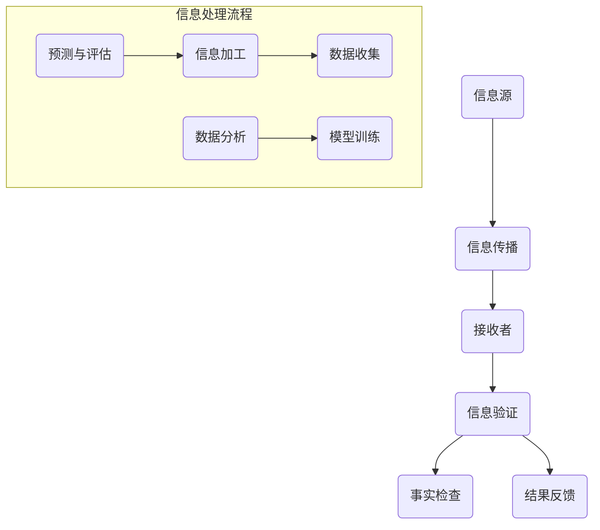

                 

 关键词：信息验证、事实检查、假新闻、错误信息、算法、机器学习、深度学习、人工智能、数据科学、网络安全、数据隐私、伦理

> 在当今信息爆炸的时代，正确识别信息来源和准确性变得前所未有的重要。本文旨在为读者提供一套详尽的信息验证和事实检查指南，帮助大家在这个充斥着错误信息和假新闻的环境中导航。作者：禅与计算机程序设计艺术 / Zen and the Art of Computer Programming。

## 1. 背景介绍

随着互联网和社交媒体的普及，信息传播的速度和范围达到了前所未有的高度。然而，这也带来了信息真伪难以辨别的问题。在2016年的美国总统选举期间，大量未经证实的消息和假新闻在社交媒体上广泛传播，对选举结果和社会稳定产生了深远影响。这种现象不仅限于政治领域，在科学、商业、医疗等多个领域，错误信息和假新闻都可能导致严重的后果。

### 1.1 错误信息和假新闻的危害

- 对个人：误导消费者、引发恐慌、损害个人名誉。
- 对企业：破坏品牌形象、误导投资者。
- 对社会：影响公共决策、加剧社会分裂。

### 1.2 信息验证和事实检查的重要性

- 提高信息准确性：确保公众接收到的信息是真实、可靠的。
- 增强社会信任：减少因假新闻和错误信息引发的社会矛盾。
- 支持科学决策：为政策制定者和商业决策者提供准确的数据支持。

## 2. 核心概念与联系

在深入探讨信息验证和事实检查之前，我们需要了解一些核心概念和它们之间的联系。以下是相关的 Mermaid 流程图，展示这些概念之间的关系：

### 2.1 核心概念

- **信息源**：信息的原始产生者，如新闻媒体、个人博客、政府公告等。
- **信息传播**：信息从信息源到接收者的传递过程，主要通过互联网和社交媒体。
- **接收者**：信息的最终消费者，包括普通用户、专家、决策者等。
- **信息验证**：对信息的真实性进行判断，包括来源验证、内容核实等。
- **事实检查**：对新闻或信息内容进行深入调查，以确认其是否真实或准确。

### 2.2 信息处理流程

在信息验证和事实检查过程中，数据科学和机器学习技术发挥着重要作用。以下流程展示了如何通过信息加工、数据收集、数据分析和模型训练来提高信息验证的准确性和效率：

- **信息加工**：对收集到的信息进行清洗、分类和结构化处理。
- **数据收集**：从各种信息源收集相关数据，包括文本、图像、音频等。
- **数据分析**：使用统计方法和机器学习算法对数据进行处理，以提取有用信息。
- **模型训练**：利用训练数据建立预测模型，用于信息验证和事实检查。

## 3. 核心算法原理 & 具体操作步骤

### 3.1 算法原理概述

信息验证和事实检查的核心算法主要包括以下几个方面：

- **自然语言处理（NLP）**：用于文本信息的抽取、语义分析和情感分析。
- **机器学习和深度学习**：用于建立预测模型，自动识别和分类信息。
- **图论和复杂网络**：用于分析信息传播网络，识别关键节点和传播路径。

### 3.2 算法步骤详解

#### 3.2.1 信息抽取

信息抽取是信息验证和事实检查的第一步，主要包括以下内容：

1. **文本预处理**：对文本进行分词、去停用词、词性标注等操作。
2. **实体识别**：识别文本中的关键实体，如人名、地名、组织名等。
3. **关系提取**：提取实体之间的语义关系，如“属于”、“位于”等。

#### 3.2.2 语义分析

语义分析是对文本的深层次理解，主要包括以下内容：

1. **情感分析**：判断文本的情感倾向，如正面、负面或中性。
2. **主题检测**：识别文本的主要内容或主题。
3. **句法分析**：分析句子的结构和成分，以理解文本的语法关系。

#### 3.2.3 模型训练与预测

模型训练与预测是基于已标注的数据集，使用机器学习和深度学习算法建立预测模型，并进行信息验证和事实检查。具体步骤如下：

1. **数据预处理**：对数据进行清洗、归一化等处理。
2. **特征提取**：从文本中提取特征，如词袋模型、TF-IDF、词嵌入等。
3. **模型选择与训练**：选择合适的模型，如支持向量机（SVM）、决策树、神经网络等，并进行训练。
4. **模型评估与优化**：使用交叉验证、ROC曲线等方法评估模型性能，并进行优化。

#### 3.2.4 结果反馈

结果反馈是信息验证和事实检查的最后一个环节，主要包括以下内容：

1. **结果展示**：将验证和检查的结果以图表、文本等形式展示给用户。
2. **错误纠正**：用户可以反馈错误的验证结果，系统会根据反馈进行修正。
3. **持续学习**：系统会根据用户的反馈和新的数据不断优化和更新模型。

### 3.3 算法优缺点

#### 优点

- **高效率**：自动化处理大量信息，提高验证和检查的效率。
- **准确性**：通过机器学习和深度学习算法，提高验证和检查的准确性。
- **可扩展性**：支持多种信息源和多种语言，具有较好的可扩展性。

#### 缺点

- **依赖数据质量**：数据质量直接影响算法性能，数据噪声和错误会影响结果。
- **算法偏见**：算法可能存在偏见，如训练数据不均衡、特征选择不当等。
- **复杂度高**：算法实现和部署相对复杂，需要较高技术门槛。

### 3.4 算法应用领域

算法在信息验证和事实检查领域有广泛的应用，主要包括以下几个方面：

- **新闻媒体**：用于检测假新闻、虚假信息，提高新闻准确性。
- **社交媒体**：用于监控恶意信息、网络谣言，维护社交平台安全。
- **政府机构**：用于核实政策决策数据、公众反馈，提高政府公信力。
- **企业**：用于验证客户信息、市场数据，提高业务决策准确性。

## 4. 数学模型和公式 & 详细讲解 & 举例说明

在信息验证和事实检查过程中，数学模型和公式起到了至关重要的作用。以下将详细介绍一些常用的数学模型和公式，并举例说明其应用。

### 4.1 数学模型构建

#### 4.1.1 贝叶斯公式

贝叶斯公式是概率论中一个非常重要的公式，用于计算在给定某些条件下某个事件发生的概率。其公式如下：

$$
P(A|B) = \frac{P(B|A) \cdot P(A)}{P(B)}
$$

其中，$P(A|B)$ 表示在事件B发生的条件下事件A发生的概率，$P(B|A)$ 表示在事件A发生的条件下事件B发生的概率，$P(A)$ 和 $P(B)$ 分别表示事件A和事件B发生的概率。

#### 4.1.2 支持向量机（SVM）

支持向量机是一种常用的机器学习算法，用于分类问题。其核心思想是找到一个最佳的超平面，将不同类别的数据点分隔开来。SVM的公式如下：

$$
\min_{\mathbf{w}, b} \frac{1}{2}||\mathbf{w}||^2 + C \sum_{i=1}^{n} \max(0, 1 - y_i (\mathbf{w} \cdot \mathbf{x_i} + b))
$$

其中，$\mathbf{w}$ 表示权重向量，$b$ 表示偏置项，$C$ 是惩罚参数，$y_i$ 和 $\mathbf{x_i}$ 分别表示第$i$个样本的标签和特征向量。

### 4.2 公式推导过程

#### 4.2.1 贝叶斯公式的推导

贝叶斯公式可以通过条件概率的定义推导出来。设事件$A$和$B$同时发生的概率为$P(A \cap B)$，则根据条件概率的定义，有：

$$
P(A|B) = \frac{P(A \cap B)}{P(B)}
$$

同理，有：

$$
P(B|A) = \frac{P(A \cap B)}{P(A)}
$$

将上述两个式子相乘，得到：

$$
P(A|B) \cdot P(B|A) = \frac{P(A \cap B)}{P(B)} \cdot \frac{P(A \cap B)}{P(A)}
$$

化简后得到：

$$
P(A|B) = \frac{P(B|A) \cdot P(A)}{P(B)}
$$

这就是贝叶斯公式。

#### 4.2.2 支持向量机的推导

支持向量机的推导主要基于最大间隔分类思想。假设我们有$n$个训练样本$(\mathbf{x_1}, y_1), (\mathbf{x_2}, y_2), ..., (\mathbf{x_n}, y_n)$，其中$y_i \in \{-1, +1\}$表示第$i$个样本的标签，$\mathbf{x_i} \in \mathbb{R}^d$表示第$i$个样本的特征向量。我们需要找到一个超平面$\mathbf{w} \cdot \mathbf{x} + b = 0$，使得不同类别的数据点被分隔开来。

最大间隔分类的核心思想是找到一个最优的超平面，使得同类别的数据点之间的距离最大，异类别的数据点之间的距离最小。具体地，我们可以定义如下目标函数：

$$
\min_{\mathbf{w}, b} \frac{1}{2}||\mathbf{w}||^2
$$

约束条件为：

$$
y_i (\mathbf{w} \cdot \mathbf{x_i} + b) \geq 1
$$

其中，$C$ 是惩罚参数，用于平衡目标函数和约束条件。

通过拉格朗日乘子法，可以将上述问题转化为对偶问题，即：

$$
\max_{\alpha_i} \sum_{i=1}^{n} \alpha_i - \frac{1}{2} \sum_{i=

