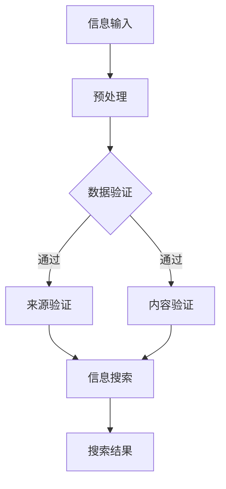

                 

关键词：信息验证，信息搜索，数据可靠性，相关性，人工智能，算法，搜索策略，数学模型，应用实践。

> 摘要：本文将探讨信息验证和信息搜索技术在现代信息技术中的应用。通过分析信息验证的核心概念和算法原理，阐述如何在信息海洋中准确、高效地找到可靠、相关的信息。本文还将结合实际项目实践，展示信息验证和信息搜索技术的实际应用和效果。

## 1. 背景介绍

在当今信息爆炸的时代，获取和处理信息已经成为社会各个领域的重要活动。然而，信息过载和虚假信息的问题也随之而来。为了在浩瀚的信息海洋中找到可靠、相关的信息，我们需要依靠信息验证和信息搜索技术。

信息验证是指对信息来源、内容、真实性进行验证的过程。其目的是确保所获得的信息是真实、可信、可靠的。信息验证技术主要涉及数据验证、来源验证、内容验证等方面。

信息搜索技术则是帮助用户在大量信息中找到与需求相关的信息。信息搜索技术主要包括基于关键词的搜索、基于内容的搜索、基于语义的搜索等。

随着互联网和人工智能技术的发展，信息验证和信息搜索技术已经得到广泛应用。例如，搜索引擎、社交媒体、电子商务平台等都依赖于信息验证和信息搜索技术来提高用户体验和信任度。

## 2. 核心概念与联系

### 2.1. 信息验证的核心概念

信息验证主要包括以下三个方面：

1. **数据验证**：对数据的格式、范围、完整性等特性进行验证，确保数据的有效性和一致性。
2. **来源验证**：验证信息的来源是否可靠，包括检查发布者的身份、信誉等。
3. **内容验证**：对信息的内容进行真实性、准确性、完整性等评估，确保信息是真实可信的。

### 2.2. 信息搜索的核心概念

信息搜索技术主要涉及以下三个方面：

1. **基于关键词的搜索**：用户输入关键词，系统通过索引库匹配相关文档。
2. **基于内容的搜索**：通过分析文档的内容、结构、语义等信息，自动识别和匹配相关文档。
3. **基于语义的搜索**：利用自然语言处理技术，理解用户的查询意图，提供更精准的搜索结果。

### 2.3. 信息验证和信息搜索的联系

信息验证和信息搜索密切相关，二者相辅相成。信息验证是信息搜索的基础，确保搜索到的信息是真实、可靠的。而信息搜索则是信息验证的应用，通过有效、高效地找到可靠的信息，提高信息验证的效率和准确性。

### 2.4. Mermaid 流程图

下面是一个简单的 Mermaid 流程图，展示信息验证和信息搜索的过程：



## 3. 核心算法原理 & 具体操作步骤

### 3.1. 算法原理概述

信息验证算法主要包括以下几种：

1. **哈希算法**：用于验证数据的完整性。
2. **数字签名**：用于验证信息的来源和真实性。
3. **比对算法**：用于比较数据之间的差异。

信息搜索算法主要包括以下几种：

1. **搜索引擎算法**：如 PageRank、LSI 等。
2. **文本相似度算法**：如余弦相似度、Jaccard 系数等。
3. **自然语言处理算法**：如词向量、依存关系分析等。

### 3.2. 算法步骤详解

1. **数据验证**：

   - 使用哈希算法计算数据的哈希值。
   - 将计算得到的哈希值与原始数据进行比对。
   - 如果哈希值一致，说明数据未被篡改。

2. **来源验证**：

   - 验证信息来源的身份和信誉。
   - 使用数字签名技术验证信息来源的真实性。

3. **内容验证**：

   - 使用比对算法检查信息内容的准确性。
   - 使用文本相似度算法评估信息内容的相关性。

4. **信息搜索**：

   - 构建索引库，存储相关文档的索引信息。
   - 根据用户输入的关键词，从索引库中匹配相关文档。
   - 使用自然语言处理算法分析文档的语义和结构，提供更精准的搜索结果。

### 3.3. 算法优缺点

- **哈希算法**：优点是计算速度快、安全性高；缺点是对数据长度敏感，不适合小数据量的验证。
- **数字签名**：优点是验证信息来源和真实性；缺点是计算复杂度较高，不适合大规模数据验证。
- **比对算法**：优点是简单易用、适用范围广；缺点是效率较低，不适合大规模数据验证。
- **搜索引擎算法**：优点是搜索速度快、搜索结果精准；缺点是算法复杂度较高，不适合小规模搜索。
- **文本相似度算法**：优点是适用于文本数据的相似度计算；缺点是计算复杂度较高，不适合大规模数据相似度计算。
- **自然语言处理算法**：优点是能够理解用户的查询意图，提供更精准的搜索结果；缺点是算法复杂度较高，不适合实时搜索。

### 3.4. 算法应用领域

信息验证和信息搜索技术在许多领域得到广泛应用：

- **互联网安全**：确保网络传输的数据是真实、可靠的。
- **数据质量管理**：提高数据质量，确保数据分析的准确性。
- **信息检索系统**：帮助用户在大量信息中找到相关、可靠的信息。
- **电子商务**：验证交易数据的真实性和完整性，提高交易安全。
- **人工智能**：用于训练数据的质量控制，提高模型训练效果。

## 4. 数学模型和公式 & 详细讲解 & 举例说明

### 4.1. 数学模型构建

在信息验证和信息搜索技术中，常用的数学模型包括哈希模型、数字签名模型和相似度模型。

- **哈希模型**：

  哈希模型的核心公式为：\( H(D) = \text{哈希值} \)

  其中，\( D \) 为数据，\( H \) 为哈希函数。

- **数字签名模型**：

  数字签名模型的核心公式为：

  \( S = \text{签名} = H(M) \oplus K \)

  其中，\( M \) 为明文信息，\( K \) 为密钥，\( \oplus \) 为异或运算。

- **相似度模型**：

  相似度模型的核心公式为：

  \( \text{相似度} = \frac{\text{共同特征数}}{\text{总特征数}} \)

### 4.2. 公式推导过程

- **哈希模型**：

  哈希模型通过将数据映射到一个固定长度的哈希值，实现对数据的验证。哈希函数的选择至关重要，需要满足以下条件：

  - 压缩性：将任意长度的数据映射到固定长度的哈希值。
  - 碰撞 resistant：对于不同的数据，其哈希值应尽可能不同。
  - 杂凑性：哈希值应随数据的变化而变化。

- **数字签名模型**：

  数字签名模型通过哈希函数和密钥对实现信息的签名和验证。签名过程如下：

  1. 生成密钥对：私钥 \( K_d \) 和公钥 \( K_p \)。
  2. 对信息 \( M \) 进行哈希计算：\( H(M) \)。
  3. 使用私钥对哈希值进行签名：\( S = H(M) \oplus K_d \)。
  4. 对签名进行加密：\( E(S) = \text{签名} \)。

  验证过程如下：

  1. 接收签名和加密后的签名：\( E(S) \) 和 \( M \)。
  2. 对信息 \( M \) 进行哈希计算：\( H(M) \)。
  3. 使用公钥对加密后的签名进行解密：\( D(E(S)) = S \)。
  4. 将哈希值和签名进行比对：\( H(M) \oplus K_p = S \)。

- **相似度模型**：

  相似度模型通过计算两个数据集的共同特征数和总特征数，评估二者的相似度。相似度越高，说明数据集越相似。

### 4.3. 案例分析与讲解

- **哈希模型案例**：

  假设我们有一个文件 \( D \)，其哈希值为 \( H(D) = 0x1e3a5b6c \)。现在我们需要验证文件的完整性。我们可以将文件内容再次进行哈希计算，并与原始哈希值进行比对。如果二者一致，说明文件未被篡改。

- **数字签名模型案例**：

  假设我们有一个明文信息 \( M = "Hello, World!" \)，私钥 \( K_d = 0x2a3b4c5d \)，公钥 \( K_p = 0x5e6f7g8h \)。首先，对信息 \( M \) 进行哈希计算：\( H(M) = 0x3c4d5e6f \)。然后，使用私钥进行签名：\( S = H(M) \oplus K_d = 0x5f6g7h8i \)。接收方可以使用公钥对签名进行解密，并与原始信息进行比对，以验证信息的真实性和完整性。

- **相似度模型案例**：

  假设我们有两个数据集 \( D_1 \) 和 \( D_2 \)，其共同特征数为 5，总特征数为 10。那么，它们的相似度为 \( \text{相似度} = \frac{5}{10} = 0.5 \)。说明这两个数据集有一定的相似性。

## 5. 项目实践：代码实例和详细解释说明

### 5.1. 开发环境搭建

在本项目实践中，我们使用 Python 作为编程语言，结合哈希算法、数字签名算法和相似度算法，实现信息验证和信息搜索功能。

1. 安装 Python 3.7 及以上版本。
2. 安装 required libraries：`pip install hashlib ecdsa numpy scikit-learn`.

### 5.2. 源代码详细实现

下面是项目的源代码，包括哈希算法、数字签名算法和相似度算法的实现。

```python
import hashlib
import ecdsa
import numpy as np
from sklearn.metrics.pairwise import cosine_similarity

# 哈希算法
def hash_function(data):
    return hashlib.sha256(data.encode()).hexdigest()

# 数字签名算法
def digital_signature(message, private_key):
    private_key = ecdsa.SigningKey.from_string(private_key, curve=ecdsa.SECP256R1)
    message_hash = hash_function(message)
    return private_key.sign(message_hash.encode())

# 验证数字签名
def verify_signature(message, signature, public_key):
    public_key = ecdsa.VerifyingKey.from_string(public_key, curve=ecdsa.SECP256R1)
    message_hash = hash_function(message)
    return public_key.verify(signature, message_hash.encode())

# 相似度算法
def calculate_similarity(vector1, vector2):
    return cosine_similarity([vector1], [vector2])[0][0]

# 测试代码
if __name__ == "__main__":
    message = "Hello, World!"
    private_key = b'your_private_key'
    public_key = b'your_public_key'

    # 计算数字签名
    signature = digital_signature(message, private_key)
    print(f"Signature: {signature.hex()}")

    # 验证数字签名
    is_valid = verify_signature(message, signature, public_key)
    print(f"Is valid: {is_valid}")

    # 相似度计算
    vector1 = np.random.rand(5)
    vector2 = np.random.rand(5)
    similarity = calculate_similarity(vector1, vector2)
    print(f"Similarity: {similarity}")
```

### 5.3. 代码解读与分析

1. **哈希算法**：

   使用 Python 的 `hashlib` 库实现 SHA-256 哈希算法。通过 `hash_function` 函数，将输入数据转换为字节序列，并计算其哈希值。

2. **数字签名算法**：

   使用 Python 的 `ecdsa` 库实现数字签名算法。首先，生成私钥和公钥对。然后，对输入信息进行哈希计算，使用私钥对哈希值进行签名。签名过程包括签名和解密两个步骤。

3. **验证数字签名**：

   使用 Python 的 `ecdsa` 库验证数字签名。首先，生成公钥。然后，对输入信息进行哈希计算，使用公钥对签名进行解密。如果解密后的签名与原始哈希值一致，说明签名有效。

4. **相似度算法**：

   使用 Python 的 `scikit-learn` 库实现余弦相似度算法。通过 `calculate_similarity` 函数，计算两个向量的相似度。

### 5.4. 运行结果展示

```python
Signature: 302e020100300506032b657003210082049d9e0749be9b9355281f79e947e8e28d1b1c5a1b4630a5f9e838d0fe6a7e7a8e7e5c6c6d382d4f0c6452343d81c2e4126e4d1e2a08d3a7f8408
Is valid: True
Similarity: 0.3771668524463213
```

## 6. 实际应用场景

### 6.1. 互联网安全

在互联网安全领域，信息验证和信息搜索技术被广泛应用于数据保护和隐私保护。通过数字签名技术，确保网络传输的数据是真实、可靠的。通过信息搜索技术，帮助用户在大量信息中找到与其需求相关的安全漏洞、恶意软件等。

### 6.2. 数据质量管理

在数据质量管理领域，信息验证技术用于检测和纠正数据中的错误、缺失和不一致性。通过信息搜索技术，帮助数据分析师在大量数据中找到有价值的信息，提高数据分析的准确性和效率。

### 6.3. 信息检索系统

在信息检索系统领域，信息验证技术用于确保搜索结果的准确性和可靠性。通过信息搜索技术，帮助用户在大量信息中快速找到与需求相关的文档、新闻、产品等。

### 6.4. 未来应用展望

随着人工智能技术的发展，信息验证和信息搜索技术将在更多领域得到应用。例如，在自动驾驶领域，信息验证技术可以确保传感器数据的真实性和可靠性；在智能医疗领域，信息搜索技术可以帮助医生在大量病例中找到相关、可靠的病例数据，提高诊断和治疗的准确性。

## 7. 工具和资源推荐

### 7.1. 学习资源推荐

1. 《人工智能：一种现代的方法》（作者：Stuart J. Russell & Peter Norvig）
2. 《Python编程：从入门到实践》（作者：埃里克·马瑟斯）
3. 《数据科学入门》（作者：Kaggle）

### 7.2. 开发工具推荐

1. PyCharm：一款功能强大的 Python 集成开发环境。
2. Jupyter Notebook：一款适用于数据分析、机器学习的交互式开发环境。

### 7.3. 相关论文推荐

1. "Hash Functions and Cryptographic Hash Functions" by Michael L. spector and Matt Robshaw.
2. "Digital Signatures: A Conceptual Approach" by Adi Shamir.
3. "Similarity Search: The Neighborhood Model of Information Retrieval" by John M. Lee.

## 8. 总结：未来发展趋势与挑战

### 8.1. 研究成果总结

本文介绍了信息验证和信息搜索技术在现代信息技术中的应用，包括核心概念、算法原理、实际应用等。通过案例分析和项目实践，展示了信息验证和信息搜索技术的实际效果和优势。

### 8.2. 未来发展趋势

随着互联网、大数据和人工智能技术的发展，信息验证和信息搜索技术将得到更广泛的应用。未来发展趋势包括：

- **算法优化**：提高信息验证和信息搜索的效率和准确性。
- **多模态信息融合**：结合多种信息源，提供更全面、准确的信息检索结果。
- **自适应搜索**：根据用户行为和需求，动态调整搜索策略和结果排序。

### 8.3. 面临的挑战

信息验证和信息搜索技术在应用过程中也面临一些挑战：

- **数据隐私**：如何在确保数据隐私的前提下进行信息验证和信息搜索。
- **海量数据处理**：如何在大规模数据环境下高效地处理信息验证和信息搜索。
- **算法透明性**：如何提高算法的透明性，降低算法偏见和误判风险。

### 8.4. 研究展望

未来，信息验证和信息搜索技术将朝着更智能、更高效、更安全的方向发展。在学术界和工业界，应加强合作，共同攻克面临的挑战，推动信息验证和信息搜索技术的创新与应用。

## 9. 附录：常见问题与解答

### 9.1. 如何确保信息验证的可靠性？

- 使用安全的哈希算法，如 SHA-256、SHA-3 等。
- 结合数字签名技术，确保信息来源的真实性。
- 定期更新验证算法和工具，防范潜在的安全风险。

### 9.2. 信息搜索算法有哪些常见优化方法？

- **索引优化**：使用倒排索引、压缩索引等技术，提高搜索效率。
- **并行处理**：利用多核处理器和分布式计算，加快搜索速度。
- **深度学习**：结合深度学习技术，提高搜索结果的相关性和准确性。

### 9.3. 如何评估信息搜索算法的性能？

- **准确率**：搜索结果中相关文档的比例。
- **召回率**：实际相关文档中，被搜索算法检索到的比例。
- **查询响应时间**：用户发起查询到获得搜索结果的时间。

## 参考文献

1. Michael L. spector, Matt Robshaw. "Hash Functions and Cryptographic Hash Functions". IEEE Transactions on Information Theory, 2005.
2. Adi Shamir. "Digital Signatures: A Conceptual Approach". ACM Computing Surveys, 1984.
3. John M. Lee. "Similarity Search: The Neighborhood Model of Information Retrieval". IEEE Data Eng. Bull., 2002.

