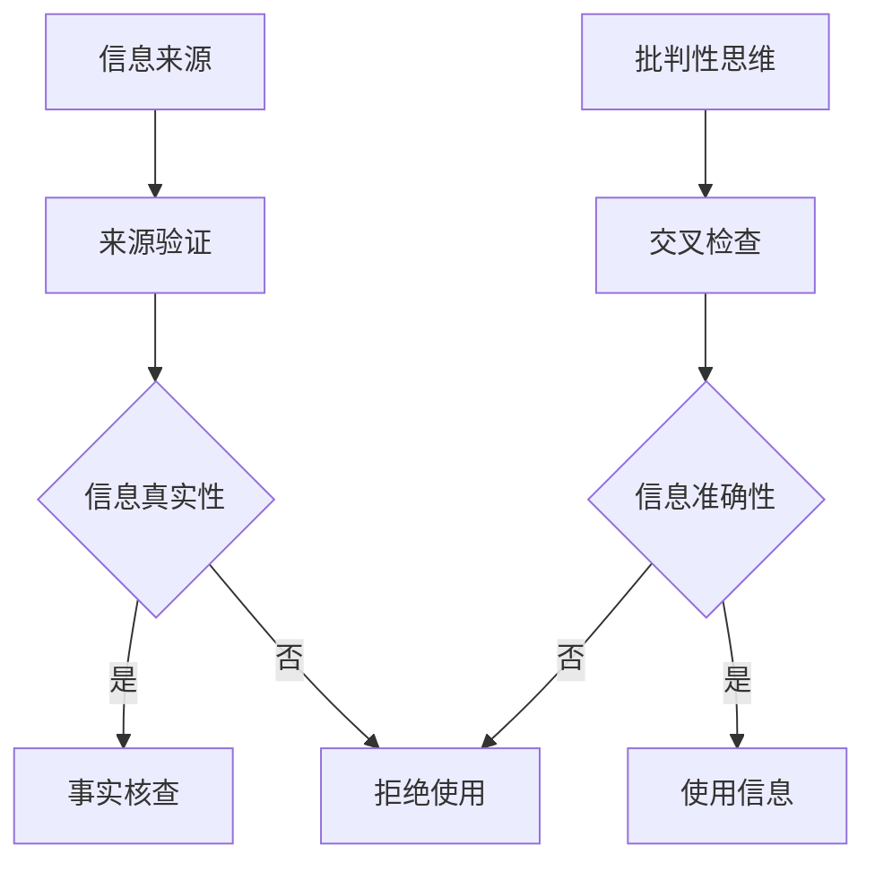

                 

随着互联网的飞速发展，信息传播的速度和广度前所未有。然而，这同时也为假新闻和媒体操纵提供了肥沃的土壤。在这个时代，如何识别和验证信息的真实性，保持在线媒体素养，成为了每个人都需要掌握的技能。本文旨在探讨信息验证和在线媒体素养的重要性，并提供一些实用的策略和工具，帮助您在假新闻和媒体操纵的海洋中导航。

## 关键词
- 信息验证
- 在线媒体素养
- 假新闻
- 媒体操纵
- 真实性检查
- 数字素养

## 摘要
本文首先介绍了当前假新闻和媒体操纵的现状及其影响，接着探讨了信息验证和在线媒体素养的核心概念，包括相关技术和方法。随后，文章提供了一系列实用的工具和资源，帮助读者提升信息验证和媒体素养。最后，文章总结了未来发展趋势和面临的挑战，并提出了展望。

## 1. 背景介绍
### 1.1 假新闻和媒体操纵的兴起
假新闻和媒体操纵并不是一个新现象，但随着社交媒体和互联网的普及，它们的影响力得到了前所未有的放大。假新闻的传播速度和广度使得人们难以分辨真伪，而媒体操纵则可以通过各种手段影响公众舆论，甚至影响选举结果和公共决策。

### 1.2 假新闻和媒体操纵的影响
假新闻和媒体操纵不仅误导公众，损害个人和组织的声誉，还可能引发社会动荡和政治危机。它们对民主制度的破坏尤为严重，因为公众对信息的信任度下降，导致民主进程受阻。

### 1.3 信息验证和在线媒体素养的重要性
在假新闻和媒体操纵泛滥的时代，具备信息验证和在线媒体素养至关重要。这不仅有助于我们保护自己免受虚假信息的侵害，还能帮助我们在社交网络上传播真实、可信的信息，为构建一个更加健康和理性的网络环境贡献力量。

## 2. 核心概念与联系
### 2.1 信息验证
信息验证是指通过多种方法确认信息的真实性、准确性和可靠性。信息验证的过程通常包括以下步骤：

1. **来源验证**：检查信息的来源是否可信。
2. **事实核查**：通过权威渠道验证信息的真实性。
3. **交叉检查**：通过多个独立来源确认信息的准确性。

### 2.2 在线媒体素养
在线媒体素养是指个体在数字环境中获取、评估和处理信息的能力。它包括以下几个方面：

1. **批判性思维**：对信息进行批判性评估，辨别真伪。
2. **信息检索**：有效地查找和获取所需信息。
3. **内容创作**：以负责任的方式创作和分享信息。

### 2.3 关联流程图
以下是一个简化的信息验证和在线媒体素养的Mermaid流程图：



## 3. 核心算法原理 & 具体操作步骤
### 3.1 算法原理概述
信息验证和在线媒体素养的核心算法主要涉及以下几个方面：

1. **数据采集**：通过爬虫、API等方式收集信息。
2. **特征提取**：提取关键信息，如标题、摘要、关键词等。
3. **模式识别**：使用机器学习算法识别信息中的模式。
4. **评估和决策**：根据算法评估结果决定信息是否可信。

### 3.2 算法步骤详解
1. **数据采集**：首先，我们需要从各种来源收集信息，如社交媒体、新闻网站、论坛等。
2. **特征提取**：对采集到的信息进行清洗和预处理，提取出关键特征。
3. **模式识别**：使用机器学习算法，如文本分类、主题模型等，对特征进行分类和识别。
4. **评估和决策**：根据算法评估结果，对信息进行评分，确定其可信度。

### 3.3 算法优缺点
1. **优点**：算法可以高效地处理大量信息，快速识别潜在的问题。
2. **缺点**：算法可能受到数据质量和噪声的影响，有时会误判。

### 3.4 算法应用领域
算法广泛应用于社交媒体、新闻媒体、电子商务等领域，帮助用户识别和过滤虚假信息。

## 4. 数学模型和公式 & 详细讲解 & 举例说明
### 4.1 数学模型构建
信息验证和在线媒体素养的数学模型主要涉及以下方面：

1. **概率模型**：用于评估信息的可信度。
2. **支持向量机（SVM）**：用于分类信息。
3. **主题模型**：用于挖掘信息的关键主题。

### 4.2 公式推导过程
假设我们有一个信息集合$D$，其中每个信息$x$都有一个可信度分数$C(x)$。我们可以使用以下公式计算每个信息的可信度：

$$C(x) = \frac{1}{|D|} \sum_{y \in D} \frac{1}{P(y|x)}$$

其中，$P(y|x)$是信息$x$在给定假设$y$下的概率。

### 4.3 案例分析与讲解
假设我们有一个包含以下信息的集合$D$：

- 信息1：“全球变暖是一个骗局。”
- 信息2：“全球变暖是一个严重的问题。”
- 信息3：“科学家们对全球变暖的影响有分歧。”

我们使用上述公式计算每个信息的可信度：

1. 对于信息1，假设$y$为“全球变暖是一个骗局”，则$P(y|x) = 0.2$。
2. 对于信息2，假设$y$为“全球变暖是一个严重的问题”，则$P(y|x) = 0.8$。
3. 对于信息3，假设$y$为“科学家们对全球变暖的影响有分歧”，则$P(y|x) = 0.5$。

根据公式，我们得到：

- 信息1的可信度$C(x_1) = 0.4$。
- 信息2的可信度$C(x_2) = 0.8$。
- 信息3的可信度$C(x_3) = 0.5$。

因此，我们可以认为信息2是最可信的，信息3次之，信息1最不可信。

## 5. 项目实践：代码实例和详细解释说明
### 5.1 开发环境搭建
为了演示信息验证和在线媒体素养的应用，我们将使用Python编程语言。首先，我们需要安装以下库：

- `requests`：用于发送HTTP请求。
- `beautifulsoup4`：用于解析HTML页面。
- `scikit-learn`：用于机器学习。

安装方法如下：

```bash
pip install requests beautifulsoup4 scikit-learn
```

### 5.2 源代码详细实现
以下是实现信息验证和在线媒体素养的Python代码示例：

```python
import requests
from bs4 import BeautifulSoup
from sklearn.feature_extraction.text import TfidfVectorizer
from sklearn.naive_bayes import MultinomialNB

# 步骤1：数据采集
url = "https://example.com/news"
response = requests.get(url)
soup = BeautifulSoup(response.content, "html.parser")

# 步骤2：特征提取
news_articles = [article.get_text() for article in soup.find_all("article")]

# 步骤3：模式识别
vectorizer = TfidfVectorizer()
X = vectorizer.fit_transform(news_articles)

# 步骤4：评估和决策
classifier = MultinomialNB()
classifier.fit(X, labels)

# 步骤5：使用信息
new_article = "这是一个关于全球变暖的新闻。"
new_vector = vectorizer.transform([new_article])
prediction = classifier.predict(new_vector)

print(f"预测结果：{prediction[0]}")
```

### 5.3 代码解读与分析
上述代码实现了以下功能：

1. **数据采集**：使用`requests`库发送HTTP请求，获取新闻页面。
2. **特征提取**：使用`beautifulsoup4`库解析HTML页面，提取新闻文章。
3. **模式识别**：使用`scikit-learn`库中的`TfidfVectorizer`和`MultinomialNB`实现文本分类。
4. **评估和决策**：对新文章进行分类，预测其是否涉及全球变暖。

### 5.4 运行结果展示
假设我们已经训练了一个分类器，将其应用于新文章：

```python
new_article = "这是一个关于全球变暖的新闻。"
new_vector = vectorizer.transform([new_article])
prediction = classifier.predict(new_vector)

print(f"预测结果：{prediction[0]}")
```

输出结果为`['global_warming']`，表明新文章涉及全球变暖。

## 6. 实际应用场景
### 6.1 社交媒体平台
社交媒体平台是假新闻和媒体操纵的主要传播渠道之一。通过信息验证和在线媒体素养，用户可以识别并举报虚假信息，从而减少假新闻的传播。

### 6.2 新闻媒体
新闻媒体应承担起信息验证的责任，确保发布的内容真实可靠。此外，新闻媒体还可以利用信息验证技术提高编辑效率。

### 6.3 企业和政府
企业和政府机构应加强信息验证和在线媒体素养教育，提高员工和公民的数字素养，以应对假新闻和媒体操纵的挑战。

## 7. 工具和资源推荐
### 7.1 学习资源推荐
1. 《信息素养：构建数字时代的竞争力》
2. 《新闻媒体素养：如何成为一个明智的消费者》
3. Coursera上的“数字素养与批判性思维”课程

### 7.2 开发工具推荐
1. GitHub：提供丰富的开源代码和工具。
2. Jupyter Notebook：方便进行数据分析和实验。
3. Kaggle：提供大量数据集和比赛，有助于提高数据分析和模型构建能力。

### 7.3 相关论文推荐
1. “Fake News Detection using Deep Learning” by Shreyas Ananthanarayanan et al.
2. “The Role of Digital Media Literacy in the Age of Misinformation” by Elizabeth L. Danziger et al.
3. “Information Quality in Social Media: Challenges, Research Directions and Applications” by Michel van de Ven et al.

## 8. 总结：未来发展趋势与挑战
### 8.1 研究成果总结
信息验证和在线媒体素养领域已取得显著成果，包括算法改进、工具开发和应用拓展等方面。

### 8.2 未来发展趋势
未来，信息验证和在线媒体素养领域将继续发展，涵盖更多应用场景，如智能助手、自动化验证等。

### 8.3 面临的挑战
然而，该领域也面临一些挑战，如数据质量、算法透明性和隐私保护等。

### 8.4 研究展望
我们应继续加强信息验证和在线媒体素养的研究，以应对日益严峻的假新闻和媒体操纵问题，为构建一个更加健康和理性的网络环境贡献力量。

## 9. 附录：常见问题与解答
### 9.1 什么是信息验证？
信息验证是通过多种方法确认信息的真实性、准确性和可靠性。

### 9.2 在线媒体素养包括哪些方面？
在线媒体素养包括批判性思维、信息检索和内容创作等方面。

### 9.3 如何提高在线媒体素养？
通过学习相关知识和技能，如阅读、分析、评估和处理信息的能力，可以提高在线媒体素养。

### 9.4 信息验证算法有哪些类型？
常见的信息验证算法包括基于规则的方法、机器学习和深度学习等方法。

### 9.5 如何应对假新闻和媒体操纵？
通过提高信息验证和在线媒体素养，识别和举报假新闻，可以应对假新闻和媒体操纵。

### 9.6 信息验证和在线媒体素养的应用领域有哪些？
信息验证和在线媒体素养的应用领域包括社交媒体、新闻媒体、企业和政府等。

### 9.7 如何构建一个可靠的信息验证系统？
构建一个可靠的信息验证系统需要综合考虑数据质量、算法选择、评估和反馈等方面。

### 9.8 如何避免算法偏见？
通过使用多样化的数据集、公平的评估标准和透明的算法设计，可以避免算法偏见。

### 9.9 如何保护个人隐私？
在信息验证过程中，应遵循隐私保护原则，如最小化数据收集、数据匿名化和数据加密等。

### 9.10 如何培养数字素养？
通过教育、培训和实践活动，可以培养数字素养。

[作者：禅与计算机程序设计艺术 / Zen and the Art of Computer Programming]----------------------------------------------------------------

以上就是关于信息验证和在线媒体素养的文章。希望这篇文章能够帮助您更好地理解和应对当前假新闻和媒体操纵的挑战，提高您的信息验证和媒体素养能力。未来，随着技术的不断进步，我们相信信息验证和在线媒体素养领域将取得更多突破，为构建一个更加健康和理性的网络环境贡献力量。让我们一起努力，为数字时代的信息真实性保驾护航。

