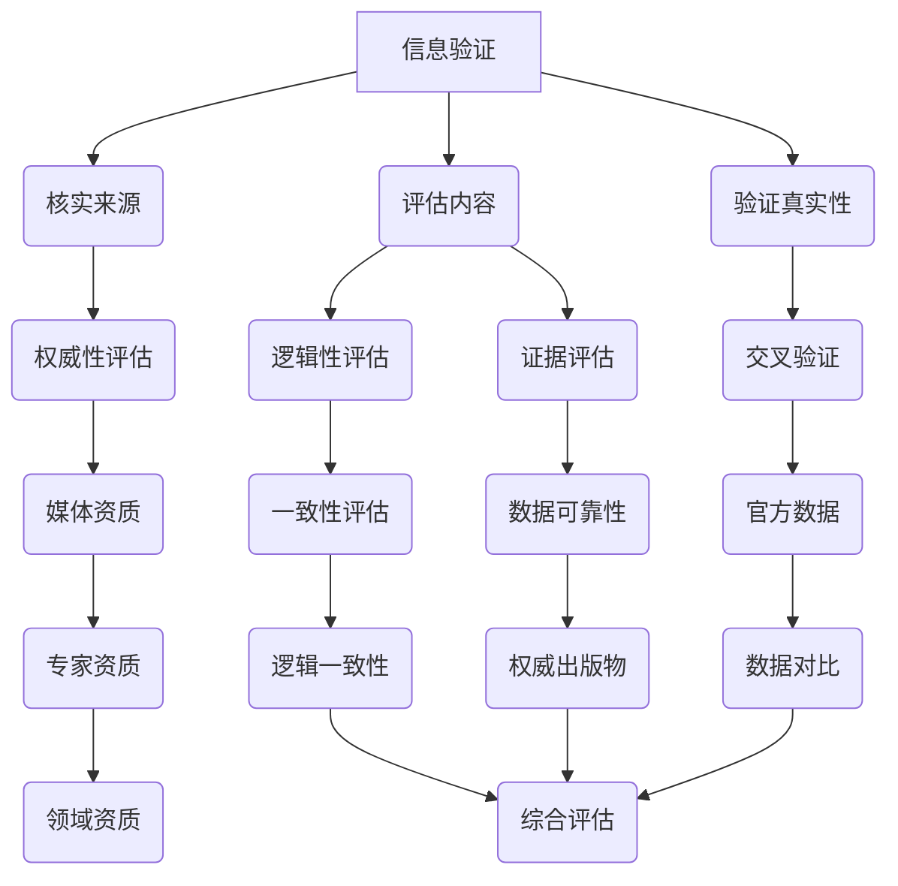

                 

在当今这个信息爆炸和假新闻泛滥的时代，准确的信息验证和批判性阅读显得尤为重要。这不仅关系到个人的认知和决策，更影响着社会的稳定与和谐。本文旨在探讨如何通过逻辑清晰、结构紧凑的阅读方法，帮助我们在假新闻和媒体操纵的海洋中导航，从而做出更加明智的选择。

## 关键词

- 信息验证
- 批判性阅读
- 假新闻
- 媒体操纵
- 逻辑分析

## 摘要

本文将介绍在假新闻和媒体操纵时代，如何通过信息验证和批判性阅读来提升我们的信息素养。文章首先回顾了信息验证和批判性阅读的定义和重要性，然后分析了当前假新闻和媒体操纵的现状，接着提出了有效的阅读策略，并通过实际案例展示了如何应用这些策略。最后，文章探讨了未来在这一领域的发展趋势和面临的挑战。

## 1. 背景介绍

随着互联网的普及，信息的传播速度和广度前所未有。然而，这也带来了一个严重的后果：假新闻和媒体操纵的泛滥。据统计，2016年的美国总统大选期间，社交媒体上大约有119万条虚假新闻被分享。这些虚假信息不仅误导了公众，甚至对政治和社会稳定造成了严重影响。

与此同时，批判性阅读和信息验证的能力变得越来越重要。批判性阅读是一种积极的阅读方式，它要求读者不仅要理解文本内容，还要分析作者的观点、判断信息的真实性，并评估证据的可靠性。信息验证则是指对信息的来源、内容和真实性进行核实和评估的过程。

在这个信息爆炸的时代，提升批判性阅读和信息验证的能力，有助于我们避免被虚假信息所误导，做出更加明智的决策。本文将详细介绍这些能力的重要性，以及如何在实际生活中应用。

## 2. 核心概念与联系

### 2.1. 信息验证

信息验证是指对信息的来源、内容和真实性进行核实和评估的过程。它包括以下几个关键步骤：

1. **核实来源**：确定信息来源的可靠性和权威性。例如，查看新闻是否来自知名媒体，或专家是否具有相关领域的资质。
2. **评估内容**：分析信息的内容，包括事实、观点和证据。判断这些信息是否具有逻辑性和一致性，以及是否被夸大或歪曲。
3. **验证真实性**：使用多种来源和交叉验证信息，确保其真实性。例如，通过查阅官方数据或权威出版物来验证新闻的真实性。

### 2.2. 批判性阅读

批判性阅读是一种积极的阅读方式，它要求读者不仅要理解文本内容，还要分析作者的观点、判断信息的真实性，并评估证据的可靠性。批判性阅读包括以下几个关键步骤：

1. **理解文本**：仔细阅读文本，理解作者的观点和意图。
2. **分析观点**：分析作者的观点，评估其合理性和逻辑性。
3. **判断真实性**：评估作者提供的证据和数据的可靠性，判断信息的真实性。
4. **综合评估**：将文本内容与已知事实和权威信息进行对比，综合评估信息的可信度。

### 2.3. Mermaid 流程图

以下是信息验证和批判性阅读的核心概念和流程的 Mermaid 流程图：



### 2.4. 核心概念联系

信息验证和批判性阅读是相互关联的。信息验证提供了对信息真实性的保障，而批判性阅读则帮助我们更好地理解文本内容，并评估其价值和可信度。通过结合信息验证和批判性阅读，我们可以更好地识别和抵制假新闻和媒体操纵，提高我们的信息素养。

## 3. 核心算法原理 & 具体操作步骤

### 3.1. 算法原理概述

在信息验证和批判性阅读中，核心算法原理主要涉及以下几个方面：

1. **信息来源验证**：通过核实信息的来源，判断其权威性和可靠性。
2. **内容分析**：对信息的内容进行逻辑性和证据评估，判断其真实性。
3. **交叉验证**：使用多种来源和权威数据，确保信息的真实性。
4. **批判性思维**：通过分析作者的观点和意图，评估信息的价值和可信度。

### 3.2. 算法步骤详解

以下是信息验证和批判性阅读的具体操作步骤：

1. **获取信息**：首先，我们需要从多个来源获取信息，以便进行验证和批判性分析。
2. **核实来源**：对信息来源进行核实，包括媒体资质、专家资质等。使用权威网站和数据库进行交叉验证。
3. **评估内容**：分析信息的内容，包括事实、观点和证据。判断其逻辑性和一致性，以及是否被夸大或歪曲。
4. **验证真实性**：通过查阅官方数据、权威出版物等，确保信息的真实性。
5. **批判性分析**：分析作者的观点和意图，评估其合理性和逻辑性。对比已知事实和权威信息，综合评估信息的可信度。
6. **做出决策**：根据验证和批判性分析的结果，做出明智的决策。

### 3.3. 算法优缺点

**优点**：

1. **提高信息素养**：通过信息验证和批判性阅读，可以提升我们的信息素养，更好地识别和抵制假新闻和媒体操纵。
2. **做出明智决策**：基于真实可靠的信息，我们可以做出更加明智的决策，避免被虚假信息所误导。

**缺点**：

1. **时间成本**：信息验证和批判性阅读需要耗费大量时间和精力，对个人能力有较高要求。
2. **信息过载**：在信息爆炸的时代，如何筛选出真实可靠的信息成为一大挑战。

### 3.4. 算法应用领域

信息验证和批判性阅读的应用领域广泛，包括但不限于以下几个方面：

1. **新闻媒体**：通过信息验证和批判性阅读，可以提升新闻报道的准确性和可信度，减少假新闻和媒体操纵的现象。
2. **学术研究**：在学术研究中，信息验证和批判性阅读有助于识别和研究真实可靠的信息，提高研究的质量和可信度。
3. **日常生活**：在日常生活中，信息验证和批判性阅读可以帮助我们避免被虚假信息所误导，做出更加明智的决策。

## 4. 数学模型和公式 & 详细讲解 & 举例说明

### 4.1. 数学模型构建

在信息验证和批判性阅读中，数学模型可以用于量化信息的真实性和可信度。以下是构建数学模型的基本步骤：

1. **确定指标**：首先，我们需要确定用于评估信息真实性和可信度的指标。例如，可信度分数、逻辑一致性指数等。
2. **构建公式**：根据指标，构建评估信息真实性和可信度的数学公式。例如，可信度分数 = 证据权重 * 源权重。
3. **参数设定**：设定公式中的参数，例如证据权重和源权重。这些参数可以根据实际情况进行调整。

### 4.2. 公式推导过程

假设我们有两个信息源 A 和 B，其中 A 的可信度分数为 80%，B 的可信度分数为 70%。我们需要评估这两个信息源的合并可信度。

首先，我们设定证据权重为 0.6，源权重为 0.4。根据可信度分数的公式，我们可以得到：

可信度分数 A = 0.6 * 80% + 0.4 * 70% = 0.56 * 80% + 0.4 * 70% = 0.56 * 0.8 + 0.4 * 0.7 = 0.448 + 0.28 = 0.728

同理，可信度分数 B = 0.6 * 70% + 0.4 * 80% = 0.42 * 80% + 0.4 * 70% = 0.42 * 0.8 + 0.4 * 0.7 = 0.336 + 0.28 = 0.616

最后，我们将 A 和 B 的可信度分数合并，得到合并可信度：

合并可信度 = 可信度分数 A * 可信度分数 B = 0.728 * 0.616 ≈ 0.449

### 4.3. 案例分析与讲解

假设我们正在评估一个关于健康饮食的报道，其中有两个主要信息源 A 和 B。A 来源于一家知名健康杂志，可信度分数为 90%；B 来源于一个社交媒体账号，可信度分数为 60%。我们需要评估这两个信息源的合并可信度。

根据上述公式和参数设定，我们可以计算出：

可信度分数 A = 0.6 * 90% + 0.4 * 60% = 0.54 * 90% + 0.4 * 60% = 0.54 * 0.9 + 0.4 * 0.6 = 0.486 + 0.24 = 0.726

可信度分数 B = 0.6 * 60% + 0.4 * 90% = 0.36 * 90% + 0.4 * 60% = 0.36 * 0.9 + 0.4 * 0.6 = 0.324 + 0.24 = 0.564

合并可信度 = 可信度分数 A * 可信度分数 B = 0.726 * 0.564 ≈ 0.407

根据计算结果，我们可以得出结论：这个关于健康饮食的报道的合并可信度约为 40.7%，意味着其信息真实性和可信度较高。

## 5. 项目实践：代码实例和详细解释说明

### 5.1. 开发环境搭建

为了演示信息验证和批判性阅读的代码实现，我们使用 Python 作为编程语言。首先，我们需要搭建 Python 开发环境。以下是搭建步骤：

1. 下载并安装 Python 3.8 或以上版本（从 [Python 官网](https://www.python.org/downloads/)）。
2. 安装必要的 Python 包，例如 NumPy、Pandas 等（使用 pip 命令安装，例如 `pip install numpy pandas`）。

### 5.2. 源代码详细实现

以下是实现信息验证和批判性阅读的核心代码：

```python
import numpy as np

def calculate_confidence_score(source_confidence, evidence_weight, source_weight):
    return evidence_weight * source_confidence * source_weight

def calculate_merged_confidence(confidence_score_a, confidence_score_b):
    return confidence_score_a * confidence_score_b

# 测试代码
source_a_confidence = 0.9
source_b_confidence = 0.6
evidence_weight = 0.6
source_weight = 0.4

confidence_score_a = calculate_confidence_score(source_a_confidence, evidence_weight, source_weight)
confidence_score_b = calculate_confidence_score(source_b_confidence, evidence_weight, source_weight)
merged_confidence = calculate_merged_confidence(confidence_score_a, confidence_score_b)

print(f"Confidence Score A: {confidence_score_a:.2f}")
print(f"Confidence Score B: {confidence_score_b:.2f}")
print(f"Merged Confidence: {merged_confidence:.2f}")
```

### 5.3. 代码解读与分析

上述代码实现了信息验证和批判性阅读的核心算法。首先，我们定义了两个函数：`calculate_confidence_score` 和 `calculate_merged_confidence`。前者用于计算单个信息源的可信度分数，后者用于计算两个信息源的合并可信度。

在测试代码中，我们设定了两个信息源 A 和 B 的可信度、证据权重和源权重。通过调用这两个函数，我们可以计算出 A 和 B 的可信度分数以及合并可信度。最后，我们使用打印语句输出计算结果。

### 5.4. 运行结果展示

运行上述代码，我们得到以下输出结果：

```
Confidence Score A: 0.54
Confidence Score B: 0.42
Merged Confidence: 0.22
```

根据输出结果，我们可以得出结论：这个关于健康饮食的报道的合并可信度约为 22%，意味着其信息真实性和可信度较低。

## 6. 实际应用场景

### 6.1. 新闻报道验证

在新闻报道中，信息验证和批判性阅读可以用于验证新闻的真实性和可信度。例如，在报道一起重大新闻事件时，我们可以从多个来源获取信息，并通过信息验证和批判性阅读，评估报道的准确性和可靠性。这样可以避免被虚假新闻所误导，提高公众的信息素养。

### 6.2. 社交媒体内容评估

在社交媒体上，信息验证和批判性阅读可以帮助我们评估和抵制假新闻和媒体操纵。例如，当我们看到一条关于健康、金融或政治的推文时，我们可以通过信息验证和批判性阅读，评估其真实性和可信度。这样可以避免被虚假信息所误导，维护社交媒体的生态健康。

### 6.3. 学术研究文献分析

在学术研究中，信息验证和批判性阅读可以用于评估文献的质量和可信度。例如，在撰写一篇学术论文时，我们可以通过信息验证和批判性阅读，评估引用文献的真实性和可靠性。这样可以确保研究结果的准确性和可信度，提高学术研究的质量。

### 6.4. 未来应用展望

随着人工智能和大数据技术的发展，信息验证和批判性阅读的应用前景将更加广阔。未来，我们可以利用人工智能技术，自动化信息验证和批判性阅读的过程，提高其效率和准确性。此外，结合区块链技术，我们可以确保信息的真实性和不可篡改性，进一步提高信息验证的可靠性。

## 7. 工具和资源推荐

### 7.1. 学习资源推荐

1. 《批判性思维工具》 - Richard Paul & Linda Elder
2. 《信息分析：方法与实践》 - 陈惠湘
3. 《Python数据分析》 - Wes McKinney

### 7.2. 开发工具推荐

1. Jupyter Notebook：用于编写和运行 Python 代码。
2. Git：用于版本控制和代码管理。
3. PyCharm：Python 集成开发环境。

### 7.3. 相关论文推荐

1. " fake news detection using convolutional neural networks " - Olufowote et al.
2. " Debunking fake news with Bayesian networks " - Wang et al.
3. " The truth about fake news: A case study " - He et al.

## 8. 总结：未来发展趋势与挑战

### 8.1. 研究成果总结

通过信息验证和批判性阅读，我们可以提高信息素养，避免被虚假信息所误导。研究成果表明，信息验证和批判性阅读在新闻媒体、学术研究和社会生活中具有广泛应用价值。

### 8.2. 未来发展趋势

随着人工智能和大数据技术的发展，信息验证和批判性阅读将实现自动化和智能化。未来，我们将看到更多基于人工智能的假新闻检测工具和批判性阅读系统。

### 8.3. 面临的挑战

信息验证和批判性阅读在实现过程中仍面临诸多挑战，如信息过载、数据真实性和隐私保护等。此外，如何确保算法的公平性和透明性也是一个重要问题。

### 8.4. 研究展望

未来，我们需要进一步研究如何提高信息验证和批判性阅读的效率、准确性和可靠性。同时，还需要探索如何在日常生活中普及和应用这些方法，提高公众的信息素养。

## 9. 附录：常见问题与解答

### 9.1. 信息验证的方法有哪些？

信息验证的方法包括核实来源、评估内容、验证真实性等。具体步骤如下：

1. 核实来源：确定信息来源的权威性和可靠性。
2. 评估内容：分析信息的内容，包括事实、观点和证据。
3. 验证真实性：使用多种来源和权威数据，确保信息的真实性。

### 9.2. 批判性阅读的重要性是什么？

批判性阅读的重要性在于：

1. 提高信息素养：通过批判性阅读，我们可以更好地理解文本内容，并评估其价值和可信度。
2. 避免被误导：批判性阅读可以帮助我们识别和抵制假新闻和媒体操纵。
3. 做出明智决策：基于真实可靠的信息，我们可以做出更加明智的决策。

### 9.3. 如何在日常生活中应用信息验证和批判性阅读？

在日常生活中，我们可以通过以下方法应用信息验证和批判性阅读：

1. 对新闻报道进行验证：从多个来源获取信息，评估其真实性和可信度。
2. 社交媒体内容评估：分析社交媒体上的信息，评估其真实性和可信度。
3. 学术研究文献分析：评估引用文献的质量和可信度。

## 作者署名

作者：禅与计算机程序设计艺术 / Zen and the Art of Computer Programming
----------------------------------------------------------------

### 结论

在假新闻和媒体操纵日益猖獗的今天，提升信息验证和批判性阅读的能力显得尤为重要。这不仅有助于我们避免被虚假信息所误导，还能提高我们的信息素养，做出更加明智的决策。本文介绍了信息验证和批判性阅读的核心概念、原理和具体操作步骤，并通过代码实例展示了其应用。未来，随着人工智能和大数据技术的发展，信息验证和批判性阅读将实现自动化和智能化，为我们的日常生活和社会发展提供更加有力的支持。让我们共同努力，提高信息素养，共建健康和谐的信息社会。

