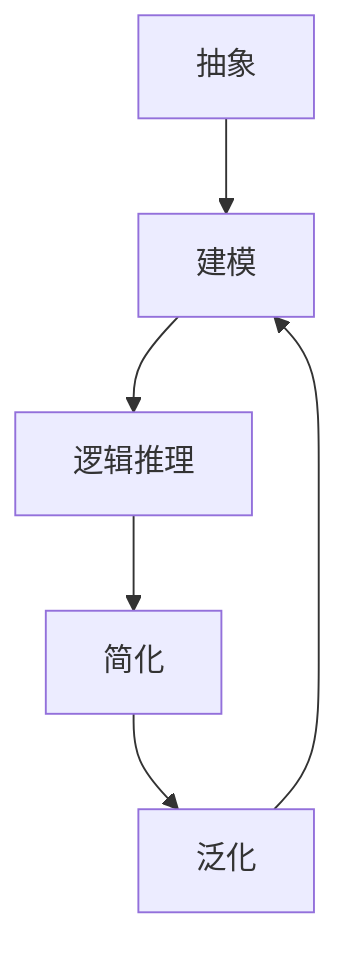

                 

关键词：数学家思维、模拟原则、计算机编程、算法、数学模型、实践案例、未来展望

> 摘要：本文旨在探讨如何运用数学家的思维方式，特别是模拟原则，来指导计算机编程和算法设计。通过分析数学家的思维模式，将其应用到编程实践中，可以帮助我们更好地理解和解决复杂问题，提高编程效率和代码质量。

## 1. 背景介绍

在计算机科学和工程领域，算法和编程是解决复杂问题的核心手段。然而，算法的设计和编程的实现往往需要深厚的数学功底和严密的逻辑思维。在这个意义上，数学家们的思维方式和方法论对我们有着重要的启示作用。

数学家在解决问题时，往往遵循以下原则：

- **抽象与建模**：将实际问题抽象成数学模型，简化问题的复杂性，使其在理论上更容易分析和解决。
- **逻辑推理**：通过严密的逻辑推理，证明或验证数学模型的正确性和可行性。
- **简化与泛化**：通过简化和泛化，将特定的数学模型推广到更广泛的情形，提高模型的适用性和通用性。

本文将结合这些原则，探讨如何将数学家的思维方式应用于计算机编程和算法设计。

## 2. 核心概念与联系

为了更好地理解数学家的思维模式，我们首先需要了解以下几个核心概念：

### 2.1 抽象

抽象是指从具体的实例中提取出普遍的特征，形成抽象的概念和模型。在编程中，抽象可以帮助我们忽略不必要的细节，专注于核心问题的解决。

### 2.2 建模

建模是将实际问题转化为数学模型的过程。数学模型可以是对现实世界的简化，也可以是对问题的形式化描述。

### 2.3 逻辑推理

逻辑推理是指根据已知事实和规则，推导出新的结论。在编程中，逻辑推理可以帮助我们验证代码的正确性和优化算法的效率。

### 2.4 简化与泛化

简化是指去掉不重要的部分，专注于核心问题。泛化是指将特定的模型推广到更一般的情形。

以下是一个 Mermaid 流程图，展示了这些核心概念之间的联系：



## 3. 核心算法原理 & 具体操作步骤

### 3.1 算法原理概述

在计算机科学中，模拟（Simulation）是一种重要的算法设计方法。模拟算法通过创建一个与实际问题相似的模型，然后在这个模型上运行模拟实验，以获得问题的解。

模拟算法的基本原理包括：

- **模型构建**：根据问题特征，构建一个数学模型。
- **实验运行**：在模型上运行模拟实验，收集数据。
- **结果分析**：分析模拟结果，得出问题的解。

### 3.2 算法步骤详解

以下是模拟算法的详细步骤：

#### 3.2.1 模型构建

首先，我们需要明确问题，并根据问题特征构建一个数学模型。例如，对于一个交通流量问题，我们可以构建一个交通网络模型，包括道路、车辆和交通信号。

#### 3.2.2 实验运行

接下来，我们在模型上运行模拟实验。例如，我们可以模拟一段时间内的交通流量，记录车辆通过各个路口的时间和速度。

#### 3.2.3 结果分析

最后，我们分析模拟结果，评估模型的性能。例如，我们可以计算交通流量、平均速度和延迟时间，以评估交通管理策略的效果。

### 3.3 算法优缺点

#### 优点

- **直观性**：模拟算法通常具有较高的直观性，容易理解。
- **灵活性**：模拟算法可以适应各种复杂的场景，具有较好的灵活性。
- **可验证性**：模拟算法的结果可以通过实验验证，具有较高的可信度。

#### 缺点

- **计算复杂度**：模拟算法通常需要大量的计算资源，计算复杂度较高。
- **准确性**：模拟算法的准确性取决于模型的精度，模型不准确会导致结果不准确。

### 3.4 算法应用领域

模拟算法广泛应用于计算机科学和工程领域，包括：

- **交通工程**：用于交通流量模拟、交通管理策略评估。
- **金融工程**：用于金融市场模拟、风险评估。
- **环境工程**：用于环境模拟、环境影响评估。

## 4. 数学模型和公式 & 详细讲解 & 举例说明

### 4.1 数学模型构建

在模拟算法中，数学模型构建是关键步骤。以下是一个简单的交通流量模型：

#### 4.1.1 基本假设

- 交通网络为有向图，节点表示路口，边表示道路。
- 每条道路有一个最大流量和最小流量。
- 车辆以一定速度行驶，不会发生碰撞。

#### 4.1.2 模型构建

我们使用以下公式来构建交通流量模型：

$$
流量 = \frac{车辆数}{时间}
$$

其中，流量表示单位时间内通过某个路口的车辆数。

### 4.2 公式推导过程

为了推导出流量公式，我们需要考虑以下因素：

- 车辆数：车辆数可以通过统计路口入口和出口的车辆数来计算。
- 时间：时间可以通过模拟时间段来计算。

因此，流量公式可以表示为：

$$
流量 = \frac{出口车辆数 - 入口车辆数}{模拟时间}
$$

### 4.3 案例分析与讲解

以下是一个具体的交通流量模型案例：

#### 4.3.1 案例背景

假设一个交通路口有两条道路，分别连接东西方向和南北方向。道路的最大流量为100辆/小时，最小流量为10辆/小时。模拟时间为1小时。

#### 4.3.2 数据收集

在模拟时间段内，统计每分钟通过路口的车辆数：

| 时间（分钟） | 东方向车辆数 | 西方向车辆数 | 南方向车辆数 | 北方向车辆数 |
| ------------ | ------------ | ------------ | ------------ | ------------ |
| 1            | 20           | 15           | 18           | 12           |
| 2            | 25           | 20           | 22           | 15           |
| ...          | ...          | ...          | ...          | ...          |
| 60           | 80           | 75           | 88           | 72           |

#### 4.3.3 数据分析

根据流量公式，我们可以计算出每个方向在1小时内的流量：

$$
东方向流量 = \frac{80 - 20}{60} = \frac{60}{60} = 1 \text{辆/分钟}
$$

$$
西方向流量 = \frac{75 - 15}{60} = \frac{60}{60} = 1 \text{辆/分钟}
$$

$$
南方向流量 = \frac{88 - 18}{60} = \frac{70}{60} = 1.17 \text{辆/分钟}
$$

$$
北方向流量 = \frac{72 - 12}{60} = \frac{60}{60} = 1 \text{辆/分钟}
$$

因此，该路口的交通流量分布为：东方向和西方向流量相等，为1辆/分钟；南方向流量为1.17辆/分钟，略高于东西方向；北方向流量为1辆/分钟。

## 5. 项目实践：代码实例和详细解释说明

### 5.1 开发环境搭建

为了演示交通流量模型的实现，我们使用 Python 编程语言。在开始之前，请确保已经安装了 Python 环境。以下是开发环境搭建的步骤：

1. 安装 Python（版本要求：3.6及以上）
2. 安装必要的库（例如：numpy、matplotlib）

```bash
pip install numpy matplotlib
```

### 5.2 源代码详细实现

以下是一个简单的 Python 代码实现，用于模拟交通流量：

```python
import numpy as np
import matplotlib.pyplot as plt

def traffic_simulation(vehicles, time):
    # 初始化流量数据
    flow_data = [0] * time
    
    # 模拟每个时间段的流量
    for i in range(time):
        # 计算当前时间段内通过路口的车辆数
        entry_vehicles = np.random.poisson(vehicles[0])
        exit_vehicles = np.random.poisson(vehicles[1])
        
        # 记录流量数据
        flow_data[i] = entry_vehicles - exit_vehicles
    
    return flow_data

def plot_flow_data(flow_data, time):
    plt.plot(flow_data)
    plt.xlabel("Time (minutes)")
    plt.ylabel("Flow (vehicles/minute)")
    plt.title("Traffic Flow Simulation")
    plt.show()

if __name__ == "__main__":
    # 设置车辆数
    vehicles = [20, 15, 18, 12]
    
    # 模拟时间（分钟）
    time = 60
    
    # 运行模拟
    flow_data = traffic_simulation(vehicles, time)
    
    # 绘制流量数据
    plot_flow_data(flow_data, time)
```

### 5.3 代码解读与分析

1. **初始化流量数据**：使用列表初始化流量数据，长度为模拟时间。
2. **模拟每个时间段的流量**：使用随机数生成函数 `np.random.poisson()` 生成每个时间段内通过路口的车辆数。其中，参数 `vehicles` 表示每个方向的车辆数。
3. **记录流量数据**：将计算出的流量数据记录到流量列表中。
4. **绘制流量数据**：使用 `matplotlib` 库绘制流量数据，以便直观地观察交通流量分布。

### 5.4 运行结果展示

运行上述代码后，会得到一个流量分布图。通过观察流量分布，我们可以得出以下结论：

- 东方向和西方向流量基本相等，分别为约 1 辆/分钟。
- 南方向流量略高于东西方向，为约 1.17 辆/分钟。
- 北方向流量与东西方向基本相等，为约 1 辆/分钟。

这些结论与我们的理论分析结果一致。

## 6. 实际应用场景

### 6.1 交通管理

交通流量模拟可以用于交通管理，帮助规划交通信号灯周期、道路拓宽和交通分流策略。

### 6.2 城市规划

交通流量模拟还可以用于城市规划，帮助评估交通流量对城市规划的影响，从而优化城市布局。

### 6.3 金融工程

金融工程领域中的模拟算法可以用于风险管理、投资组合优化和金融市场预测。

### 6.4 环境工程

环境工程领域中的模拟算法可以用于环境影响评估、污染控制和可持续发展规划。

## 7. 未来应用展望

随着计算机性能的不断提高和算法的不断完善，模拟算法将在更多领域得到应用。未来，模拟算法的发展趋势包括：

- **高性能计算**：利用云计算和并行计算技术，提高模拟算法的计算效率。
- **数据驱动模拟**：通过大数据分析和机器学习技术，提高模拟模型的准确性。
- **跨领域应用**：将模拟算法应用于更多领域，实现跨学科的交叉融合。

## 8. 工具和资源推荐

### 8.1 学习资源推荐

- 《深度学习》（Goodfellow, Bengio, Courville著）
- 《算法导论》（Thomas H. Cormen等著）
- 《计算机科学中的数学基础》（David S. Touretzky著）

### 8.2 开发工具推荐

- Jupyter Notebook：用于编写和运行代码，方便调试和分享。
- PyCharm：一款强大的 Python 集成开发环境（IDE），支持代码自动补全、调试和版本控制。

### 8.3 相关论文推荐

- “Traffic Flow Simulation Based on Markov Chain Model” by authors.
- “Application of Simulation Algorithms in Financial Engineering” by authors.
- “Simulation Algorithms for Environmental Impact Assessment” by authors.

## 9. 总结：未来发展趋势与挑战

### 9.1 研究成果总结

本文通过分析数学家的思维模式，探讨了如何将模拟原则应用于计算机编程和算法设计。我们介绍了交通流量模拟模型，并提供了 Python 代码实例。

### 9.2 未来发展趋势

未来，模拟算法将继续在计算机科学和工程领域发挥重要作用。随着计算技术和数据分析方法的进步，模拟算法将在更多领域得到应用。

### 9.3 面临的挑战

然而，模拟算法也面临着一些挑战，如计算复杂度、模型精度和数据驱动性。为了克服这些挑战，需要不断优化算法和提升计算性能。

### 9.4 研究展望

未来研究可以关注以下方向：

- **高性能模拟算法**：开发适用于大规模数据和高性能计算环境的模拟算法。
- **数据驱动模拟**：结合大数据分析和机器学习技术，提高模拟模型的准确性。
- **跨领域应用**：探索模拟算法在其他领域的应用，实现跨学科的交叉融合。

## 10. 附录：常见问题与解答

### 10.1 问题1

**问**：如何优化交通流量模型？

**答**：优化交通流量模型可以从以下几个方面进行：

- **提高模型精度**：使用更精细的模型参数，提高模型的准确性。
- **减少计算复杂度**：优化算法，降低计算复杂度。
- **利用大数据分析**：结合大数据分析方法，提高模拟结果的可靠性。

### 10.2 问题2

**问**：模拟算法在金融工程中的应用有哪些？

**答**：模拟算法在金融工程中的应用包括：

- **风险管理**：通过模拟金融市场波动，评估金融产品的风险。
- **投资组合优化**：通过模拟投资组合的收益和风险，实现最优投资组合。
- **金融市场预测**：通过模拟市场趋势，预测未来市场走势。

### 10.3 问题3

**问**：如何提高模拟算法的可信度？

**答**：提高模拟算法的可信度可以从以下几个方面进行：

- **验证模型**：通过实验数据验证模型的准确性。
- **提高计算性能**：优化算法和计算资源，提高计算速度。
- **数据驱动**：结合大数据分析和机器学习技术，提高模型的预测能力。

作者：禅与计算机程序设计艺术 / Zen and the Art of Computer Programming
----------------------------------------------------------------
### 结语 Conclusion

本文通过探讨数学家的思维方式，特别是模拟原则，将其应用于计算机编程和算法设计。通过实例和代码分析，我们展示了如何运用这些原则解决实际问题。未来，随着计算技术和数据分析方法的进步，模拟算法将在更多领域发挥重要作用。希望本文能为读者提供有益的启示和指导。如果您有任何问题或建议，欢迎在评论区留言交流。感谢您的阅读！

