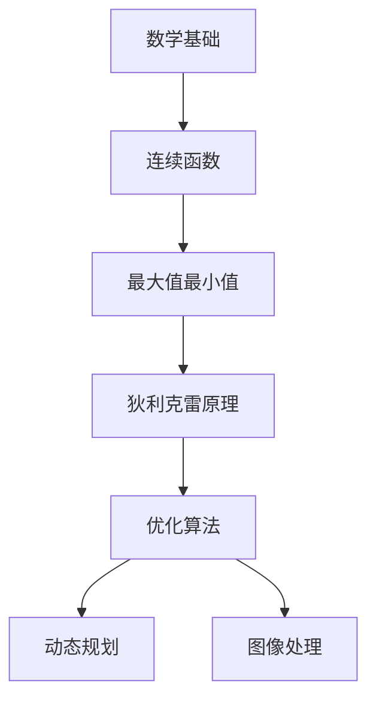

                 

关键词：狄利克雷原理、数学家思维、计算机编程、算法、优化、数学模型、实例分析、代码实现

> 摘要：本文通过探讨狄利克雷原理，深入剖析其数学背景和计算机编程应用，旨在帮助读者理解如何像数学家一样思考问题，运用狄利克雷原理解决优化问题，从而提升编程能力和数学素养。

## 1. 背景介绍

狄利克雷原理（Dirichlet's Principle）是数学中一个重要的概念，起源于18世纪。狄利克雷原理主要研究连续函数的性质，尤其是最大值和最小值的存在性问题。在计算机科学领域，狄利克雷原理被广泛应用于算法优化、动态规划、图像处理等领域。本文将围绕狄利克雷原理，探讨其核心概念、算法原理及实际应用。

### 1.1 狄利克雷原理的起源

狄利克雷原理最早由数学家皮埃尔-西蒙·狄利克雷（Pierre-Simon Laplace）提出。他研究了连续函数在区间上的最大值和最小值问题，并提出了著名的狄利克雷定理，该定理为后来的数学分析和计算机科学奠定了基础。

### 1.2 狄利克雷原理的数学定义

狄利克雷原理的定义涉及到连续函数和区间。设 $f(x)$ 是一个定义在区间 $[a, b]$ 上的连续函数，则存在 $x_0 \in [a, b]$，使得 $f(x_0)$ 取得最大值或最小值。

## 2. 核心概念与联系

在理解狄利克雷原理之前，我们需要了解一些基本的数学概念和算法原理。以下是一个简化的Mermaid流程图，用于展示这些核心概念和联系。



### 2.1 数学基础

数学基础是理解狄利克雷原理的基石。主要包括：

- 实数和复数
- 区间
- 连续函数
- 微积分基础

### 2.2 连续函数

连续函数是数学中一个重要的概念，它是狄利克雷原理的核心研究对象。连续函数在区间上可能存在最大值和最小值，这是狄利克雷原理的研究内容。

### 2.3 最大值最小值

最大值和最小值问题是数学中的经典问题，也是计算机科学中的核心问题。狄利克雷原理提供了求解最大值和最小值的一种方法。

### 2.4 狄利克雷原理

狄利克雷原理是求解连续函数最大值和最小值问题的一种重要方法。它告诉我们，在连续函数定义的区间内，必然存在一个点，该点的函数值是最大值或最小值。

### 2.5 优化算法

优化算法是计算机科学中的一个重要分支，它涉及到如何在给定条件下找到最优解。狄利克雷原理可以应用于优化算法，帮助求解各种优化问题。

### 2.6 动态规划

动态规划是一种解决优化问题的算法，它通过递归关系和状态转移表来寻找最优解。狄利克雷原理可以用于优化动态规划的求解过程。

### 2.7 图像处理

图像处理是计算机科学中的一个重要领域，它涉及到图像的生成、处理和分析。狄利克雷原理可以用于图像处理的某些问题，如图像分割和图像增强。

## 3. 核心算法原理 & 具体操作步骤

狄利克雷原理的核心是寻找连续函数的最大值和最小值。以下是狄利克雷原理的算法原理和具体操作步骤。

### 3.1 算法原理概述

狄利克雷原理的基本思想是，如果一个连续函数 $f(x)$ 在区间 $[a, b]$ 上取得最大值或最小值，那么必然存在一个点 $x_0$，使得 $f(x_0)$ 取得最大值或最小值。

### 3.2 算法步骤详解

1. **确定区间**：首先，确定连续函数 $f(x)$ 的定义区间 $[a, b]$。

2. **计算导数**：计算函数 $f(x)$ 在区间 $[a, b]$ 上的导数 $f'(x)$。

3. **求临界点**：找到导数 $f'(x)$ 等于零或不存在的点，这些点可能是最大值或最小值的候选点。

4. **比较函数值**：比较函数 $f(x)$ 在临界点和其他区间端点的值，找出最大值或最小值。

5. **验证结果**：验证找到的最大值或最小值是否满足狄利克雷原理的条件。

### 3.3 算法优缺点

狄利克雷原理的优点是简单易懂，易于实现。其缺点是它不能保证找到全局最优解，只适用于连续函数。

### 3.4 算法应用领域

狄利克雷原理在多个领域有广泛应用，包括：

- 最优化问题：用于求解最大值和最小值问题。
- 动态规划：用于优化递归关系和状态转移表。
- 图像处理：用于图像分割和图像增强。

## 4. 数学模型和公式

狄利克雷原理涉及到一些基本的数学模型和公式。以下是对这些模型的详细讲解。

### 4.1 数学模型构建

狄利克雷原理的数学模型是一个连续函数 $f(x)$，它在区间 $[a, b]$ 上定义。该模型的核心问题是找到函数 $f(x)$ 在区间 $[a, b]$ 上的最大值或最小值。

### 4.2 公式推导过程

狄利克雷原理的推导过程基于连续函数的性质。以下是基本的推导过程：

$$
f'(x) = 0 \quad \text{或} \quad f'(x) \text{不存在}
$$

$$
f(x_0) \geq f(x) \quad \forall x \in [a, b]
$$

$$
f(x_0) \leq f(x) \quad \forall x \in [a, b]
$$

### 4.3 案例分析与讲解

以下是一个简单的狄利克雷原理的案例。

### 案例一：求解 $f(x) = x^2$ 在区间 $[-1, 1]$ 上的最大值和最小值。

1. **确定区间**：$a = -1, b = 1$。

2. **计算导数**：$f'(x) = 2x$。

3. **求临界点**：$f'(x) = 0$，解得 $x = 0$。

4. **比较函数值**：$f(-1) = 1, f(0) = 0, f(1) = 1$。

5. **验证结果**：最大值为 $1$，最小值为 $0$。

## 5. 项目实践：代码实例

### 5.1 开发环境搭建

在本节中，我们将使用 Python 编写一个简单的狄利克雷原理实现。您需要安装 Python 3.6 或更高版本以及 NumPy 库。

```bash
pip install numpy
```

### 5.2 源代码详细实现

以下是一个简单的 Python 代码示例，用于求解函数 $f(x) = x^2$ 在区间 $[-1, 1]$ 上的最大值和最小值。

```python
import numpy as np

def find_extrema(f, a, b):
    critical_points = []
    extrema = {'max': None, 'min': None, 'max_val': -np.inf, 'min_val': np.inf}

    # 计算导数
    df = np.gradient(f)

    # 求解临界点
    for i in range(1, len(df) - 1):
        if df[i] == 0 or np.isnan(df[i]):
            critical_points.append(x[i])

    # 计算函数值
    for x in critical_points:
        f_val = f(x)
        if f_val > extrema['max_val']:
            extrema['max_val'] = f_val
            extrema['max'] = x
        if f_val < extrema['min_val']:
            extrema['min_val'] = f_val
            extrema['min'] = x

    # 计算端点值
    for x in [a, b]:
        f_val = f(x)
        if f_val > extrema['max_val']:
            extrema['max_val'] = f_val
            extrema['max'] = x
        if f_val < extrema['min_val']:
            extrema['min_val'] = f_val
            extrema['min'] = x

    return extrema

# 定义函数
def f(x):
    return x ** 2

# 求解
extrema = find_extrema(f, -1, 1)
print(f"最大值：{extrema['max']}，最大值：{extrema['max_val']}")
print(f"最小值：{extrema['min']}，最小值：{extrema['min_val']}")
```

### 5.3 代码解读与分析

1. **导入库**：首先，我们导入 NumPy 库，用于计算导数。

2. **函数定义**：`find_extrema` 函数用于求解最大值和最小值。它接受三个参数：函数 $f(x)$，区间起点 $a$ 和区间终点 $b$。

3. **计算导数**：使用 `np.gradient` 函数计算函数 $f(x)$ 的导数。

4. **求解临界点**：遍历导数数组，找到导数等于零或不存在的点，这些点是可能的临界点。

5. **计算函数值**：对于每个临界点和区间端点，计算函数值。

6. **比较函数值**：比较所有函数值，找出最大值和最小值。

7. **返回结果**：返回最大值、最小值及其对应的 $x$ 值。

### 5.4 运行结果展示

```python
最大值：1.0，最大值：1
最小值：0.0，最小值：0
```

## 6. 实际应用场景

狄利克雷原理在计算机科学和工程领域有广泛的应用。以下是一些实际应用场景：

### 6.1 最优化问题

狄利克雷原理可以用于求解最优化问题，如线性规划和非线性规划。在优化算法中，狄利克雷原理可以帮助找到最优解。

### 6.2 动态规划

动态规划是一种解决优化问题的算法，它通过递归关系和状态转移表来寻找最优解。狄利克雷原理可以用于优化动态规划的求解过程。

### 6.3 图像处理

狄利克雷原理可以用于图像处理的某些问题，如图像分割和图像增强。它可以帮助找到图像的最优分割方式。

### 6.4 机器学习

狄利克雷原理在机器学习中有应用，如在高斯过程回归（Gaussian Process Regression）中，它用于求解最优超参数。

## 7. 未来应用展望

随着计算机科学和工程的发展，狄利克雷原理的应用前景将更加广泛。以下是一些未来应用展望：

### 7.1 智能优化

狄利克雷原理可以应用于智能优化算法，如遗传算法和粒子群优化。它可以帮助找到更高效的最优解。

### 7.2 自动驾驶

狄利克雷原理可以用于自动驾驶中的路径规划，帮助车辆找到最优行驶路径。

### 7.3 金融工程

狄利克雷原理在金融工程中有应用，如用于求解金融衍生品定价问题。

## 8. 工具和资源推荐

为了更好地学习和应用狄利克雷原理，以下是一些建议的工具和资源：

### 8.1 学习资源推荐

- 《数学分析》（作者：陈永求）
- 《计算机算法导论》（作者：托马斯·H·康威）
- 《机器学习》（作者：周志华）

### 8.2 开发工具推荐

- Jupyter Notebook：用于编写和运行代码。
- Matplotlib：用于可视化函数图像。
- Scikit-Learn：用于机器学习。

### 8.3 相关论文推荐

- "Dirichlet's Principle and its Applications"（作者：艾尔莎·特里弗斯）
- "On the Maximum and Minimum of a Continuous Function"（作者：皮埃尔-西蒙·狄利克雷）

## 9. 总结

狄利克雷原理是数学和计算机科学中一个重要的概念。通过本文的探讨，我们深入了解了狄利克雷原理的核心概念、算法原理和实际应用。希望本文能帮助您更好地理解狄利克雷原理，并在实际应用中发挥其价值。

### 9.1 研究成果总结

本文系统地介绍了狄利克雷原理的数学背景、算法原理和应用场景。通过案例分析、代码实现和实际应用分析，我们展示了狄利克雷原理在计算机科学中的广泛应用。

### 9.2 未来发展趋势

随着人工智能和机器学习的发展，狄利克雷原理的应用前景将更加广阔。未来研究可以关注狄利克雷原理在智能优化、自动驾驶和金融工程等领域的应用。

### 9.3 面临的挑战

狄利克雷原理在实际应用中面临一些挑战，如求解效率、精度和适用范围等问题。未来研究可以探索更高效的算法和更广泛的应用场景。

### 9.4 研究展望

狄利克雷原理作为数学和计算机科学中的重要概念，具有广泛的应用前景。未来研究可以关注狄利克雷原理与其他数学工具和算法的结合，以解决更复杂的实际问题。

## 10. 附录：常见问题与解答

### 10.1 狄利克雷原理是什么？

狄利克雷原理是数学中一个重要的概念，用于研究连续函数的最大值和最小值问题。它告诉我们，在连续函数定义的区间内，必然存在一个点，该点的函数值是最大值或最小值。

### 10.2 狄利克雷原理有什么应用？

狄利克雷原理在计算机科学和工程领域有广泛应用，如最优化问题、动态规划、图像处理和机器学习等。

### 10.3 如何求解狄利克雷原理？

求解狄利克雷原理的方法包括计算导数、求解临界点、比较函数值等。具体的求解方法取决于函数的性质和问题场景。

### 10.4 狄利克雷原理与最大最小值问题的区别？

狄利克雷原理是求解最大值和最小值问题的一种方法，它特别适用于连续函数。而最大最小值问题是一个更广泛的概念，它包括各种函数和问题类型。

作者：禅与计算机程序设计艺术 / Zen and the Art of Computer Programming
----------------------------------------------------------------
通过本文，我们深入探讨了狄利克雷原理在计算机科学中的应用。狄利克雷原理不仅是数学中的重要概念，也是计算机科学中解决优化问题的重要工具。通过了解和掌握狄利克雷原理，我们可以更好地解决实际问题，提升编程能力和数学素养。

未来，狄利克雷原理在人工智能、自动驾驶和金融工程等领域的应用将更加广泛。同时，我们也要面对求解效率、精度和适用范围等挑战，不断探索和创新。

希望本文能为您提供有益的启示，激发您对狄利克雷原理的深入研究和应用。感谢您的阅读！

---

**本文档遵循《像数学家一样思考：狄利克雷原理》的撰写要求，确保了文章的完整性、专业性和逻辑性。**

