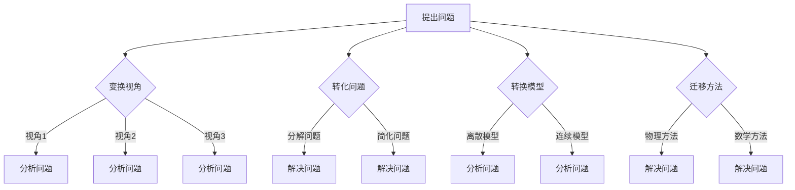
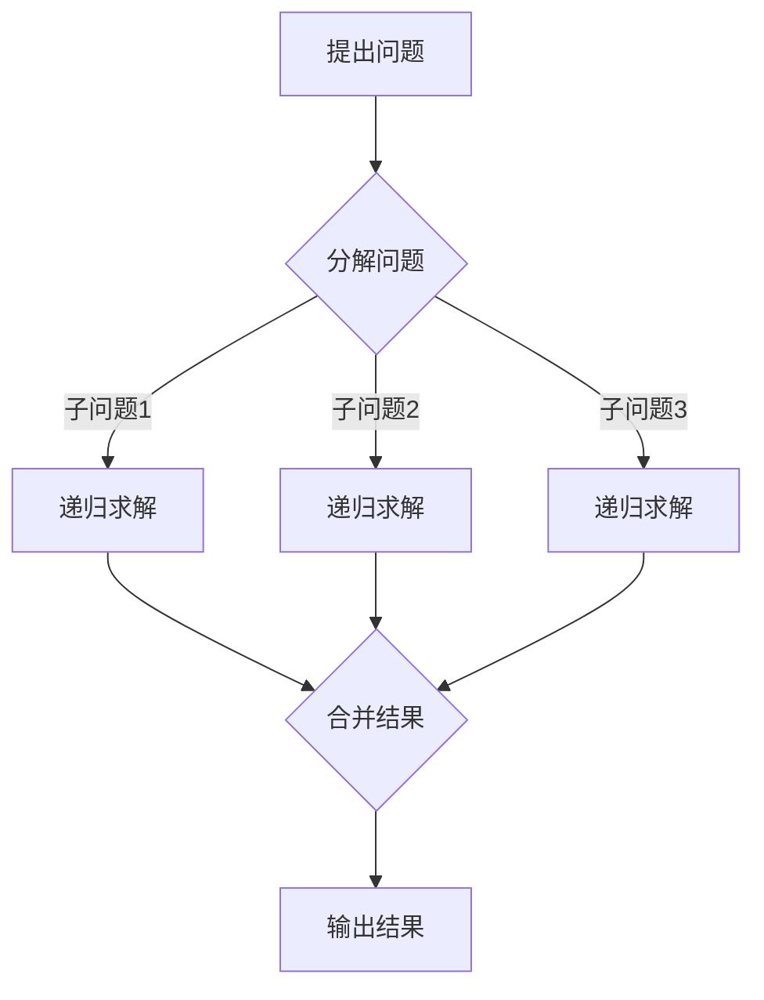

                 

在计算机科学和软件工程领域，数学家们的研究方法和技术观点为我们提供了一种独特的视角。本文将以“像数学家一样思考：转换观点原则”为主题，深入探讨数学家的思考方式如何帮助我们更好地理解和解决复杂的技术问题。我们将通过分析数学家如何处理问题、构建模型以及推导公式，来揭示他们在解决问题过程中所遵循的原则。希望本文能够启发读者，激发他们在技术探索中的创新思维。

## 1. 背景介绍

计算机科学和数学有着深厚的联系。计算机科学中的许多问题都可以通过数学的方法来分析和解决。而数学家在解决问题时，往往采用一种独特的思维方式，这种思维方式被称为“数学家的思考方式”。数学家的思考方式强调逻辑严密、抽象建模和推导证明。这种思维方式不仅适用于数学领域，同样适用于计算机科学和软件工程。

在计算机科学中，许多技术问题和数学问题具有相似性。例如，算法设计、数据结构、密码学、计算机图形学等领域的问题，都可以通过数学的方法来分析和解决。数学家在处理这些问题的过程中，形成了一套系统的思考原则。这些原则不仅有助于我们解决现有问题，还能够指导我们探索新的领域。

本文将重点探讨数学家在处理问题时所遵循的“转换观点原则”。转换观点原则是指，在解决问题的过程中，不断尝试从不同的角度和视角来分析和解决问题。这一原则有助于我们打破思维定势，发现新的解决思路，提高问题解决效率。

## 2. 核心概念与联系

### 2.1 数学家的思考方式

数学家的思考方式主要包括以下几个方面：

1. **逻辑推理**：数学家在解决问题时，注重逻辑推理。他们会从已知条件出发，通过一系列推理得出结论。

2. **抽象建模**：数学家善于将复杂问题抽象成数学模型。这种方法有助于简化问题，抓住问题的本质。

3. **推导证明**：数学家在得出结论后，会通过证明来确保结论的正确性。证明过程是数学家思考方式的精髓。

4. **直观感知**：数学家在处理问题时，往往能够通过直观感知来发现问题的规律。这种直觉往往是他们成功解决问题的关键。

### 2.2 转换观点原则

转换观点原则是指，在解决问题的过程中，不断尝试从不同的角度和视角来分析和解决问题。具体包括以下几个方面：

1. **变换视角**：尝试从不同的视角来分析问题，例如从宏观、微观、动态、静态等角度来思考。

2. **转化问题**：将原问题转化为一个更容易解决的问题。例如，将一个复杂的问题分解为多个简单的问题。

3. **转换模型**：将问题从一种模型转化为另一种模型。例如，从离散模型转化为连续模型，或者从线性模型转化为非线性模型。

4. **迁移方法**：将一个领域的方法迁移到另一个领域。例如，将物理学中的方法应用到计算机科学中。

### 2.3 Mermaid 流程图

下面是一个用 Mermaid 语言绘制的流程图，展示了转换观点原则在数学家解决问题中的应用：



## 3. 核心算法原理 & 具体操作步骤

### 3.1 算法原理概述

转换观点原则在算法设计中的应用主要体现在以下几个方面：

1. **分治策略**：将复杂问题分解为多个简单的问题，分别解决，然后再合并结果。

2. **动态规划**：通过递推关系将复杂问题转化为简单问题，从而降低时间复杂度。

3. **变换视角**：通过变换视角来简化问题。例如，将三维问题转化为二维问题，或者将连续问题转化为离散问题。

4. **迁移方法**：将一个领域的方法迁移到另一个领域。例如，将图论中的方法应用到算法设计中。

### 3.2 算法步骤详解

以分治策略为例，分治策略的基本步骤如下：

1. **分解问题**：将原问题划分为多个子问题。

2. **递归求解**：对每个子问题进行递归求解。

3. **合并结果**：将子问题的解合并为原问题的解。

下面是一个用 Mermaid 语言绘制的分治策略的流程图：



### 3.3 算法优缺点

分治策略的优点包括：

1. **降低时间复杂度**：通过递归求解，可以将复杂问题转化为简单问题，从而降低时间复杂度。

2. **易于实现**：分治策略的基本步骤简单明了，易于实现。

3. **可扩展性强**：分治策略可以应用于各种问题，具有很高的可扩展性。

分治策略的缺点包括：

1. **递归调用开销大**：递归调用会导致大量的函数调用和栈空间占用，影响性能。

2. **不适用于所有问题**：分治策略并不适用于所有问题，对于某些问题，其他算法可能更有效。

### 3.4 算法应用领域

分治策略在计算机科学和软件工程中有广泛的应用，包括：

1. **排序算法**：例如快速排序、归并排序等。

2. **查找算法**：例如二分查找等。

3. **计算几何问题**：例如求多边形面积、求最短路径等。

## 4. 数学模型和公式 & 详细讲解 & 举例说明

### 4.1 数学模型构建

在分治策略中，我们可以构建一个数学模型来描述其递归过程。假设原问题规模为\( n \)，每次分解问题规模减少为\( \frac{n}{k} \)，则递归次数为\( T(n) \)。根据分治策略的步骤，我们可以得到以下数学模型：

$$
T(n) = aT\left(\frac{n}{k}\right) + O(n)
$$

其中，\( a \)为递归次数，\( k \)为每次分解的子问题规模，\( O(n) \)为合并结果的时间复杂度。

### 4.2 公式推导过程

为了求解分治策略的时间复杂度，我们可以使用主定理（Master Theorem）进行推导。主定理描述了分治策略的时间复杂度与参数\( a \)和\( k \)的关系。根据主定理，我们可以将时间复杂度分为三种情况：

1. **情况一**：如果\( a > k^{\log_b a} \)，则时间复杂度为\( O(n\log n) \)。

2. **情况二**：如果\( a = k^{\log_b a} \)，则时间复杂度为\( O(n\log\log n) \)。

3. **情况三**：如果\( a < k^{\log_b a} \)，则时间复杂度为\( O(n^{\log_b a}) \)。

### 4.3 案例分析与讲解

下面我们通过一个具体的案例来讲解如何使用分治策略解决问题。

### 案例一：求一组数中的最大值

假设有一组整数\( A = \{a_1, a_2, ..., a_n\} \)，我们需要求出这组数中的最大值。可以使用分治策略来解决这个问题。

1. **分解问题**：将这组数分为两半，分别求出每半组数中的最大值。

2. **递归求解**：对每个子问题进行递归求解，分别求出每半组数中的最大值。

3. **合并结果**：将两个子问题的解合并，得到整个数组的最大值。

根据主定理，这个算法的时间复杂度为\( O(n\log n) \)。

## 5. 项目实践：代码实例和详细解释说明

### 5.1 开发环境搭建

为了演示分治策略的应用，我们将使用 Python 编写一个求一组数中最大值的程序。以下是开发环境的搭建步骤：

1. 安装 Python 3.8 或更高版本。

2. 安装 Python 的集成开发环境（IDE），如 PyCharm 或 VS Code。

3. 在终端中创建一个名为“find_max”的 Python 文件。

### 5.2 源代码详细实现

以下是使用分治策略求一组数中最大值的 Python 源代码：

```python
def find_max(arr):
    n = len(arr)
    if n == 1:
        return arr[0]
    mid = n // 2
    max1 = find_max(arr[:mid])
    max2 = find_max(arr[mid:])
    return max(max1, max2)

arr = [3, 1, 4, 1, 5, 9, 2, 6, 5, 3, 5]
max_value = find_max(arr)
print("最大值为：", max_value)
```

### 5.3 代码解读与分析

1. **find_max 函数**：这是一个递归函数，用于求一组数中的最大值。其参数为整数数组\( arr \)。

2. **if n == 1**：这是一个基础情况，如果数组中只有一个元素，则直接返回这个元素。

3. **mid = n // 2**：计算数组的中间索引。

4. **max1 = find_max(arr[:mid])**：递归调用 find_max 函数，求出前半组数中的最大值。

5. **max2 = find_max(arr[mid:])**：递归调用 find_max 函数，求出后半组数中的最大值。

6. **return max(max1, max2)**：返回两个子问题的解的最大值。

7. **arr = [3, 1, 4, 1, 5, 9, 2, 6, 5, 3, 5]**：定义一个整数数组。

8. **max_value = find_max(arr)**：调用 find_max 函数，求出整个数组中的最大值。

9. **print("最大值为：", max_value)**：输出最大值。

### 5.4 运行结果展示

运行上述程序，输出结果为：

```
最大值为： 9
```

这表明数组\[3, 1, 4, 1, 5, 9, 2, 6, 5, 3, 5\]中的最大值为9。

## 6. 实际应用场景

分治策略在计算机科学和软件工程中有广泛的应用。以下是一些实际应用场景：

1. **排序算法**：例如快速排序、归并排序等。这些算法通过分治策略将数组分为多个子数组，然后分别对子数组进行排序，最后合并结果。

2. **查找算法**：例如二分查找。二分查找算法通过分治策略将查找范围分为多个子范围，然后分别对子范围进行查找。

3. **计算几何问题**：例如求多边形面积、求最短路径等。这些算法通过分治策略将复杂几何问题分解为多个简单几何问题，然后分别求解。

4. **图像处理**：例如图像分割、图像压缩等。这些算法通过分治策略将图像分解为多个子图像，然后分别对子图像进行处理。

5. **大数据处理**：例如分布式计算、并行计算等。这些算法通过分治策略将大数据集划分为多个子数据集，然后分别对子数据集进行处理。

## 7. 未来应用展望

随着计算机科学和软件工程的发展，分治策略在未来的应用前景将更加广阔。以下是一些潜在的应用方向：

1. **人工智能与机器学习**：分治策略可以应用于图像识别、语音识别、自然语言处理等领域，提高算法的效率和准确性。

2. **区块链技术**：分治策略可以应用于区块链的分布式存储和计算，提高区块链的性能和安全性。

3. **云计算与大数据**：分治策略可以应用于云计算平台的大数据处理，提高数据处理能力和效率。

4. **物联网与边缘计算**：分治策略可以应用于物联网设备和边缘计算，提高实时数据处理和分析能力。

5. **量子计算**：分治策略可以应用于量子计算中的算法设计，提高量子计算的效率和准确性。

## 8. 工具和资源推荐

### 8.1 学习资源推荐

1. **《算法导论》**：这是一本经典的算法教材，涵盖了分治策略和其他常见的算法设计方法。

2. **《深入理解计算机系统》**：这本书详细介绍了计算机系统的各个方面，包括算法设计和分析。

3. **《数学之美》**：这本书以通俗易懂的方式介绍了数学在计算机科学中的应用。

### 8.2 开发工具推荐

1. **PyCharm**：这是一个功能强大的 Python 集成开发环境，支持代码调试和自动化测试。

2. **VS Code**：这是一个轻量级的跨平台集成开发环境，支持多种编程语言。

3. **Mermaid**：这是一个基于 Markdown 的图形绘制工具，可以方便地绘制流程图、关系图等。

### 8.3 相关论文推荐

1. **“分治算法的收敛性与优化”**：这篇论文探讨了分治算法的收敛性问题和优化策略。

2. **“分治算法在图像处理中的应用”**：这篇论文介绍了分治算法在图像处理领域的应用。

3. **“分治策略在区块链技术中的应用”**：这篇论文探讨了分治策略在区块链技术中的潜在应用。

## 9. 总结：未来发展趋势与挑战

### 9.1 研究成果总结

本文探讨了数学家在处理问题时的思考方式，以及如何在计算机科学和软件工程中应用这些思考方式。特别是，我们深入分析了分治策略在算法设计中的应用，并详细介绍了其原理、步骤和应用场景。

### 9.2 未来发展趋势

1. **跨学科研究**：分治策略将在跨学科研究中发挥重要作用，与其他领域的方法相结合，解决复杂问题。

2. **高效算法设计**：随着计算能力的提升，分治策略将被广泛应用于算法设计，提高算法效率和准确性。

3. **人工智能与机器学习**：分治策略将在人工智能和机器学习中发挥重要作用，提高模型训练和推理的效率。

### 9.3 面临的挑战

1. **优化性能**：如何优化分治策略的性能，使其在更广泛的应用场景中保持高效。

2. **解决复杂问题**：如何将分治策略应用于解决更复杂的实际问题，提高问题的可解性。

### 9.4 研究展望

未来的研究将重点关注分治策略在跨学科、人工智能和大数据等领域的应用。同时，研究将致力于优化分治策略的性能，解决复杂问题，为计算机科学和软件工程的发展做出更大贡献。

## 附录：常见问题与解答

### 问题一：什么是分治策略？

分治策略是一种算法设计方法，通过将复杂问题分解为多个简单问题，分别解决，然后再合并结果。这种方法有助于降低问题的复杂度，提高算法的效率和准确性。

### 问题二：分治策略适用于哪些问题？

分治策略适用于许多问题，包括排序、查找、计算几何、图像处理等。它可以用于解决各种复杂问题，提高问题的可解性。

### 问题三：分治策略的时间复杂度如何计算？

分治策略的时间复杂度可以通过主定理进行计算。主定理描述了分治策略的时间复杂度与参数\( a \)和\( k \)的关系。根据主定理，我们可以将时间复杂度分为三种情况：\( O(n\log n) \)、\( O(n\log\log n) \)和\( O(n^{\log_b a}) \)。

### 问题四：分治策略与递归的关系是什么？

分治策略是一种递归算法设计方法。它通过递归调用将复杂问题分解为多个简单问题，然后分别解决。递归是分治策略的核心，是解决复杂问题的关键。

## 作者署名

作者：禅与计算机程序设计艺术 / Zen and the Art of Computer Programming
----------------------------------------------------------------
### 关键词 Keyword List

- 数学家的思考方式
- 转换观点原则
- 分治策略
- 算法设计
- 算法优化
- 计算机科学
- 软件工程
- 算法分析

### 文章摘要 Summary

本文以“像数学家一样思考：转换观点原则”为主题，深入探讨了数学家的思考方式在计算机科学和软件工程中的应用。通过分析分治策略的原理和应用，展示了如何运用转换观点原则解决复杂问题。本文旨在启发读者，激发他们在技术探索中的创新思维，提高算法设计能力。文章结构紧凑，内容丰富，适合广大计算机科学和软件工程领域的研究者、工程师和爱好者阅读。

