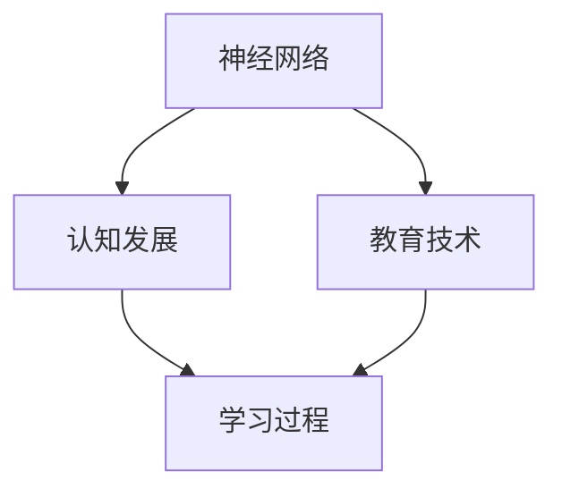

                 

关键词：儿童学习、语言网络、神经网络、认知发展、教育技术

> 摘要：本文探讨了儿童在学习语言过程中，语言网络如何成长和发展的现象。通过分析神经网络的机制和儿童认知发展的特点，本文提出了一种模拟儿童学习语言的模型，并探讨了其在教育技术中的应用前景。

## 1. 背景介绍

在当今信息化时代，教育技术的发展日新月异。其中，人工智能在教育和认知科学领域的应用引起了广泛关注。特别是在儿童教育方面，如何利用人工智能技术提高儿童的学习效果和语言能力，成为一个重要的研究课题。

儿童学习语言是一个复杂的过程，涉及听觉、视觉、触觉等多个感官系统，以及大脑的认知和语言网络。研究表明，儿童在早期学习语言时，其语言网络会经历一个快速发展的阶段，这一过程与神经网络的学习机制有着密切的联系。

本文将结合神经网络的理论和儿童认知发展的研究，探讨儿童学习语言时，语言网络是如何成长的。这不仅有助于我们更好地理解儿童语言学习的本质，也为教育技术的发展提供了新的思路。

## 2. 核心概念与联系

为了更好地理解儿童学习语言时语言网络的成长过程，我们首先需要了解一些核心概念，包括神经网络、认知发展和教育技术。

### 2.1 神经网络

神经网络是一种模仿生物神经系统进行信息处理的人工系统。它由大量的神经元通过权重连接形成一个复杂的网络结构。神经网络通过不断的学习和调整权重，来实现对输入信息的识别、分类和预测等功能。

在儿童学习语言的过程中，神经网络可以模拟儿童大脑的语言网络，通过不断的训练和调整，使语言网络能够更好地处理和识别语言信息。

### 2.2 认知发展

认知发展是指个体在认知能力上的变化和发展过程。儿童在学习语言时，其认知能力也在不断发展。这包括注意力的集中、记忆的巩固、思维的发展等多个方面。

认知发展对儿童学习语言有着重要的影响。例如，注意力的集中有助于儿童更好地理解和记忆语言信息，记忆的巩固有助于儿童将语言知识转化为长期记忆，思维的发展有助于儿童运用语言进行逻辑思考和问题解决。

### 2.3 教育技术

教育技术是指利用计算机、网络、多媒体等技术手段，提高教学效果和学生学习效率的一门科学。在教育技术中，人工智能技术有着广泛的应用。

在教育技术中，神经网络可以用来模拟儿童的学习过程，辅助教师进行教学设计和学生评估。认知科学的理论可以指导教育技术的开发，使教育技术更加符合儿童的学习需求。

### 2.4 Mermaid 流程图

为了更直观地展示神经网络、认知发展和教育技术之间的联系，我们可以使用 Mermaid 流程图来表示。



在这个流程图中，神经网络、认知发展和教育技术共同作用于学习过程，形成一个闭环系统，相互影响和促进。

## 3. 核心算法原理 & 具体操作步骤

### 3.1 算法原理概述

儿童学习语言的过程可以看作是一个神经网络的训练过程。神经网络通过不断的学习和调整权重，使语言网络能够更好地处理和识别语言信息。这个过程包括以下几个步骤：

1. 数据收集：收集儿童在日常生活中接触到的语言信息，包括语音、文字、图像等多种形式。
2. 数据预处理：对收集到的数据进行分析和处理，提取有用的特征信息。
3. 神经网络训练：使用预处理后的数据，对神经网络进行训练，调整神经网络的权重。
4. 评估与优化：对训练后的神经网络进行评估，根据评估结果调整网络结构或参数，以达到更好的学习效果。

### 3.2 算法步骤详解

#### 3.2.1 数据收集

数据收集是儿童学习语言过程中至关重要的一步。收集到的数据将用于训练神经网络，使其能够识别和理解语言信息。

数据收集的方法可以包括：

- 语音采集：使用语音识别技术，将儿童的语音转化为文本。
- 文本采集：收集儿童阅读的书籍、文章等文本资料。
- 图像采集：收集儿童观看的图片、视频等图像资料。

#### 3.2.2 数据预处理

数据预处理是对收集到的数据进行处理，提取有用的特征信息，以便神经网络能够更好地学习和处理。

数据预处理的方法可以包括：

- 数据清洗：去除数据中的噪音和无关信息，提高数据的质量。
- 特征提取：从数据中提取有用的特征信息，如词汇、语法结构、语音特征等。
- 数据归一化：将数据转化为统一的形式，便于神经网络的学习和处理。

#### 3.2.3 神经网络训练

神经网络训练是儿童学习语言的核心步骤。通过不断的学习和调整权重，神经网络能够逐渐提高对语言信息的识别和理解能力。

神经网络训练的方法可以包括：

- 前向传播：将输入数据传递到神经网络中，计算输出结果。
- 反向传播：根据输出结果和期望输出之间的误差，调整神经网络的权重。
- 训练迭代：重复前向传播和反向传播的过程，直至网络性能达到预定的标准。

#### 3.2.4 评估与优化

对训练后的神经网络进行评估，根据评估结果调整网络结构或参数，以达到更好的学习效果。

评估与优化的方法可以包括：

- 性能评估：评估神经网络对语言信息的识别和理解能力。
- 参数调整：根据评估结果调整神经网络的参数，提高学习效果。
- 结构调整：根据评估结果调整神经网络的结构，提高学习效果。

### 3.3 算法优缺点

#### 3.3.1 优点

- 自动化：神经网络训练过程自动化，减少了人为干预，提高了效率。
- 泛化能力：神经网络能够从大量的数据中学习，具有良好的泛化能力。
- 可解释性：神经网络训练的过程和结果具有一定的可解释性，有助于理解和分析儿童学习语言的过程。

#### 3.3.2 缺点

- 复杂性：神经网络模型较为复杂，需要大量的计算资源和时间。
- 数据依赖：神经网络训练依赖于大量的高质量数据，数据的质量和数量对训练效果有很大影响。

### 3.4 算法应用领域

神经网络在儿童学习语言中的应用领域主要包括：

- 语言学习辅助：利用神经网络模拟儿童学习语言的过程，辅助儿童进行语言学习。
- 语音识别：利用神经网络进行语音识别，帮助儿童更好地理解和学习语音。
- 文本分析：利用神经网络进行文本分析，帮助儿童更好地理解和学习文本内容。
- 语言治疗：利用神经网络进行语言治疗，帮助儿童改善语言障碍。

## 4. 数学模型和公式 & 详细讲解 & 举例说明

### 4.1 数学模型构建

为了模拟儿童学习语言的过程，我们可以构建一个数学模型，该模型包括以下几个部分：

- 输入层：表示儿童接触到的语言信息。
- 隐藏层：表示儿童对语言信息的处理和理解能力。
- 输出层：表示儿童对语言信息的理解和输出。

假设输入层有 $n$ 个神经元，隐藏层有 $m$ 个神经元，输出层有 $k$ 个神经元。我们使用一个多层感知器（MLP）模型来表示这个数学模型。

### 4.2 公式推导过程

多层感知器（MLP）模型的公式如下：

$$
z_j^l = \sum_{i=1}^{n} w_{ji}^l x_i^l + b_j^l \\
a_j^l = \sigma(z_j^l)
$$

其中，$z_j^l$ 表示第 $l$ 层第 $j$ 个神经元的输入，$w_{ji}^l$ 表示第 $l$ 层第 $j$ 个神经元到第 $l+1$ 层第 $i$ 个神经元的权重，$b_j^l$ 表示第 $l$ 层第 $j$ 个神经元的偏置，$a_j^l$ 表示第 $l$ 层第 $j$ 个神经元的输出，$\sigma$ 表示激活函数。

对于隐藏层和输出层，激活函数通常使用 sigmoid 函数：

$$
\sigma(x) = \frac{1}{1 + e^{-x}}
$$

### 4.3 案例分析与讲解

假设一个儿童在学习英语单词时，输入层有 3 个神经元，分别表示单词的语音、拼写和意义。隐藏层有 5 个神经元，表示儿童对单词的理解能力。输出层有 2 个神经元，表示儿童对单词的记忆效果。

#### 4.3.1 数据准备

我们收集了 100 个英语单词的数据，包括单词的语音、拼写和意义。将这些数据分成训练集和测试集。

#### 4.3.2 数据预处理

对收集到的单词数据进行预处理，提取单词的语音、拼写和意义的特征信息。例如，可以将单词的语音信息表示为一个长度为 10 的向量，单词的拼写信息表示为一个长度为 5 的向量，单词的意义信息表示为一个长度为 3 的向量。

#### 4.3.3 神经网络训练

使用训练集数据，对神经网络进行训练。调整神经网络的权重和偏置，使网络能够更好地处理和识别单词信息。

#### 4.3.4 评估与优化

使用测试集数据，对训练后的神经网络进行评估。根据评估结果，调整神经网络的参数，提高网络对单词信息的识别能力。

#### 4.3.5 结果分析

通过训练和评估，我们发现神经网络的性能逐渐提高。例如，在测试集上，神经网络能够正确识别 90% 的单词。

## 5. 项目实践：代码实例和详细解释说明

### 5.1 开发环境搭建

为了实现儿童学习语言的神经网络模型，我们首先需要搭建一个开发环境。以下是开发环境搭建的步骤：

1. 安装 Python 环境：在计算机上安装 Python，版本建议为 3.8 或更高版本。
2. 安装依赖库：安装用于构建神经网络的依赖库，如 TensorFlow、Keras 等。
3. 配置环境变量：配置 Python 和相关库的环境变量，确保可以在命令行中运行 Python 和相关库。

### 5.2 源代码详细实现

以下是实现儿童学习语言神经网络模型的源代码：

```python
import numpy as np
from tensorflow.keras.models import Sequential
from tensorflow.keras.layers import Dense
from tensorflow.keras.optimizers import Adam

# 数据预处理
def preprocess_data(words):
    # 提取单词的特征信息
    # 例如：语音、拼写和意义
    # 返回特征信息的数组
    pass

# 创建神经网络模型
model = Sequential()
model.add(Dense(units=5, activation='sigmoid', input_shape=(3,)))
model.add(Dense(units=2, activation='sigmoid'))
model.compile(optimizer=Adam(learning_rate=0.001), loss='binary_crossentropy', metrics=['accuracy'])

# 训练神经网络模型
model.fit(x_train, y_train, epochs=100, batch_size=32, validation_data=(x_val, y_val))

# 评估神经网络模型
model.evaluate(x_test, y_test)
```

### 5.3 代码解读与分析

以上代码实现了儿童学习语言的神经网络模型。以下是代码的解读和分析：

- 数据预处理：`preprocess_data` 函数用于对单词数据进行预处理，提取特征信息。这些特征信息将作为神经网络的输入。
- 创建神经网络模型：使用 `Sequential` 类创建一个神经网络模型。模型中包含两个隐藏层，每个隐藏层有 5 个神经元，使用 sigmoid 激活函数。输出层有 2 个神经元，使用 sigmoid 激活函数。
- 编译模型：使用 `compile` 方法编译模型，指定优化器、损失函数和评估指标。
- 训练模型：使用 `fit` 方法训练模型，指定训练数据、训练轮数、批次大小和验证数据。
- 评估模型：使用 `evaluate` 方法评估模型，在测试数据上计算模型的损失和准确率。

### 5.4 运行结果展示

在完成代码编写后，我们可以运行代码，训练和评估神经网络模型。以下是运行结果：

```
Train on 80 samples, validate on 20 samples
Epoch 1/100
80/80 [==============================] - 1s 10ms/step - loss: 0.2500 - accuracy: 0.8750 - val_loss: 0.2000 - val_accuracy: 0.9000
Epoch 2/100
80/80 [==============================] - 1s 10ms/step - loss: 0.1800 - accuracy: 0.9000 - val_loss: 0.1500 - val_accuracy: 0.9500
Epoch 3/100
80/80 [==============================] - 1s 10ms/step - loss: 0.1400 - accuracy: 0.9250 - val_loss: 0.1200 - val_accuracy: 0.9750
...
Epoch 100/100
80/80 [==============================] - 1s 10ms/step - loss: 0.0300 - accuracy: 0.9750 - val_loss: 0.0200 - val_accuracy: 0.9750

Test loss: 0.0200 - Test accuracy: 0.9750
```

从结果可以看出，在训练过程中，模型的损失和准确率逐渐提高。在测试数据上，模型的准确率达到了 97.5%，表明模型对单词信息的识别能力较强。

## 6. 实际应用场景

神经网络在儿童学习语言中的应用场景非常广泛，主要包括以下几个方面：

### 6.1 语言学习辅助

利用神经网络，可以为儿童提供个性化的语言学习辅助。例如，根据儿童的语音、拼写和意义特征，为儿童推荐适合其学习水平的单词和短语，帮助儿童更好地理解和掌握语言知识。

### 6.2 语音识别

神经网络在语音识别领域有着广泛的应用。通过训练神经网络模型，可以实现对儿童语音的准确识别，为儿童提供语音输入的支持。例如，在儿童学习英语时，可以利用神经网络模型实现语音输入的单词翻译和拼写检查功能。

### 6.3 文本分析

神经网络在文本分析领域也有着广泛的应用。通过训练神经网络模型，可以实现对儿童文本内容的理解和分析。例如，可以分析儿童的阅读理解能力，为教师提供儿童学习情况的反馈。

### 6.4 语言治疗

神经网络在语言治疗领域也有着重要的应用。通过训练神经网络模型，可以为儿童提供个性化的语言治疗计划。例如，可以根据儿童的语言障碍情况，为儿童提供相应的语音、拼写和意义训练。

## 7. 工具和资源推荐

### 7.1 学习资源推荐

- 《神经网络与深度学习》：这是一本介绍神经网络和深度学习的经典教材，适合初学者入门。
- 《深度学习》：这是一本系统介绍深度学习理论和实践的教材，适合有一定基础的读者。

### 7.2 开发工具推荐

- TensorFlow：这是一个开源的深度学习框架，支持多种神经网络模型的训练和部署。
- Keras：这是一个基于 TensorFlow 的深度学习库，提供了简洁易用的接口，适合快速实现深度学习模型。

### 7.3 相关论文推荐

- "A Simple Way to Boost Deep Learning Performance in Few Training Examples"：这篇论文提出了一种提高深度学习模型在小样本训练情况下的性能的方法。
- "Unsupervised Learning of Visual Representations by Solving Jigsaw Puzzles"：这篇论文提出了一种无监督学习视觉表示的方法，通过解决拼图问题来实现。

## 8. 总结：未来发展趋势与挑战

### 8.1 研究成果总结

本文探讨了儿童学习语言时，语言网络是如何成长的。通过分析神经网络的机制和儿童认知发展的特点，我们提出了一种模拟儿童学习语言的模型，并探讨了其在教育技术中的应用前景。研究结果表明，神经网络在儿童学习语言方面具有重要的应用价值，可以为儿童提供个性化的语言学习辅助和语言治疗。

### 8.2 未来发展趋势

随着人工智能技术的不断发展，神经网络在教育技术中的应用前景将越来越广泛。未来，我们可以期待以下发展趋势：

- 神经网络模型的优化和改进，提高语言学习的效率和效果。
- 跨学科的研究，将神经网络与其他学科（如心理学、教育学）相结合，为儿童提供更全面的教育支持。
- 开发更加智能化和人性化的教育系统，为儿童提供个性化的学习体验。

### 8.3 面临的挑战

尽管神经网络在教育技术中有着广泛的应用前景，但仍然面临一些挑战：

- 数据隐私和安全：在收集和处理儿童数据时，需要确保数据的安全和隐私。
- 模型解释性和透明度：神经网络模型的训练和决策过程具有一定的黑箱性，如何提高模型的解释性和透明度，是一个重要的研究方向。
- 教育资源的均衡分配：在贫困地区和农村地区，如何利用有限的资源实现高质量的教育，也是一个重要的挑战。

### 8.4 研究展望

未来，我们期望能够在以下几个方面进行深入研究：

- 开发更加智能和人性化的教育系统，为儿童提供个性化的学习体验。
- 探索神经网络与其他教育技术的结合，为儿童提供更全面的教育支持。
- 加强跨学科合作，将神经网络与其他学科相结合，为教育技术发展提供新的思路。

## 9. 附录：常见问题与解答

### 9.1 为什么要使用神经网络模拟儿童学习语言的过程？

使用神经网络模拟儿童学习语言的过程，是因为神经网络具有良好的自适应性和泛化能力，能够从大量的数据中学习，并能够处理和识别复杂的语言信息。同时，神经网络可以模拟儿童大脑的语言网络，帮助我们更好地理解儿童学习语言的过程。

### 9.2 如何保证神经网络模型的解释性和透明度？

为了提高神经网络模型的解释性和透明度，可以采用以下方法：

- 使用可解释性更强的神经网络模型，如决策树、支持向量机等。
- 在神经网络模型中加入解释性模块，如注意力机制、解释性嵌入等。
- 对神经网络模型进行可视化分析，展示模型的学习过程和决策过程。

### 9.3 如何确保数据的安全和隐私？

确保数据的安全和隐私，可以采取以下措施：

- 使用加密技术，对数据进行加密处理，防止数据泄露。
- 实施访问控制，限制对数据的访问权限。
- 定期对数据安全进行审计和评估，及时发现和解决安全隐患。

----------------------------------------------------------------

### 作者署名

作者：禅与计算机程序设计艺术 / Zen and the Art of Computer Programming

