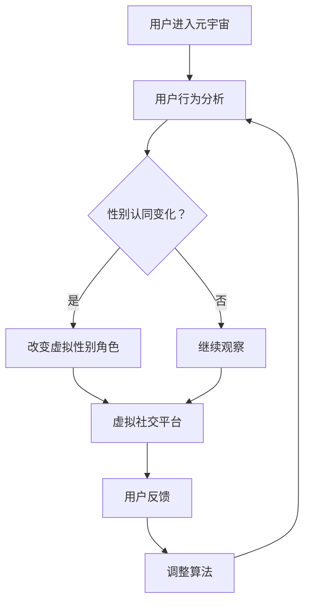

                 

 关键词：元宇宙、性别认同、虚拟世界、性别流动、人工智能、算法、数学模型

> 摘要：本文探讨了元宇宙中性别流动的现象及其对性别认同自由的影响。通过介绍元宇宙的背景和性别流动的概念，分析了虚拟世界中性别流动的机制和算法原理。随后，文章通过数学模型和实际案例，阐述了性别流动的数学模型构建和公式推导过程。最后，文章探讨了元宇宙中性别流动的实际应用场景，并展望了其未来的发展趋势和挑战。

## 1. 背景介绍

随着科技的发展，元宇宙（Metaverse）这一概念逐渐走进人们的视野。元宇宙是一个由多个虚拟世界组成的宏大网络，用户可以在这个虚拟空间中自由探索、互动和创造。元宇宙的兴起为人们提供了前所未有的虚拟体验，同时也引发了关于性别认同自由的新思考。

性别流动（Gender Flow）是指在虚拟世界中，个体根据自身性别认同的变化而在不同虚拟性别之间移动的现象。性别流动不仅是元宇宙中的一种自然现象，也是性别认同自由的重要体现。在现实世界中，性别认同是一个复杂而多维的概念，而元宇宙则为人们提供了一个更自由、更灵活的表达空间。

本文将探讨元宇宙中性别流动的现象，分析其背后的机制和算法原理，并通过数学模型和实际案例，探讨性别流动的实际应用场景和未来发展趋势。

### 1.1 元宇宙的定义和发展

元宇宙是一个由多个虚拟世界组成的宏大网络，这些虚拟世界通过互联网相互连接，为用户提供沉浸式的体验。元宇宙不仅包括虚拟现实（VR）和增强现实（AR）技术，还包括区块链、人工智能、物联网等多种技术。

元宇宙的发展可以追溯到20世纪80年代，当时虚拟现实技术的初步探索为人们带来了关于虚拟世界的想象。随着计算机技术和网络技术的不断进步，元宇宙逐渐成为现实。2010年代以来，虚拟现实和增强现实技术的快速发展，使得元宇宙的概念更加具体和可操作。

### 1.2 性别认同自由的重要性

性别认同自由是指个体有权自主决定自己的性别认同，并按照这种认同来生活。在现实世界中，性别认同自由面临着诸多挑战，例如社会对性别刻板印象的固化、法律对性别认同的歧视等。而在元宇宙中，个体可以摆脱现实世界的束缚，自由地表达和探索自己的性别认同。

性别认同自由的重要性体现在以下几个方面：

1. **尊重个体差异**：性别认同自由尊重了每个人的独特性，使得个体能够自由地表达自己的性别认同，而不受外界压力和限制。
2. **促进社会进步**：性别认同自由的实现有助于消除性别歧视和偏见，推动社会向更加包容和多元的方向发展。
3. **创造新的社会价值**：性别认同自由为元宇宙带来了新的社会价值和商业模式，例如虚拟性别角色的发展、虚拟社交平台的多样性等。

## 2. 核心概念与联系

在探讨元宇宙中性别流动的机制和算法原理之前，我们首先需要了解一些核心概念和它们之间的联系。

### 2.1 元宇宙的组成部分

元宇宙由多个虚拟世界组成，这些虚拟世界可以分为以下几类：

1. **虚拟现实世界**：用户通过虚拟现实设备进入的虚拟空间，例如虚拟游戏、虚拟旅游等。
2. **增强现实世界**：在现实世界中叠加虚拟元素，用户通过增强现实设备进行交互，例如增强现实购物、增强现实教育等。
3. **虚拟社交平台**：用户在虚拟空间中进行社交互动的平台，例如虚拟社区、虚拟会议等。
4. **虚拟经济系统**：在虚拟世界中运行的数字经济系统，例如虚拟货币、虚拟商品等。

### 2.2 性别认同的概念

性别认同是指个体对自己性别的认知和认同，它可能不同于个体的生理性别或社会性别角色。在元宇宙中，性别认同可以表现为多种形式，例如虚拟性别角色、自定义性别外观等。

### 2.3 性别流动的机制

性别流动是指个体在元宇宙中根据自身性别认同的变化而在不同虚拟性别之间移动的现象。性别流动的机制包括以下几个方面：

1. **自我认同的变化**：个体在元宇宙中的性别认同可能因个人经历、情感变化等原因而发生变化。
2. **社交互动的影响**：个体在虚拟社交平台中的互动，如与不同性别角色的互动，可能影响其性别认同。
3. **虚拟性别角色的变化**：个体可以通过改变自己的虚拟性别角色来适应新的性别认同。

### 2.4 算法原理

性别流动的算法原理主要包括以下几个方面：

1. **用户行为分析**：通过分析用户在元宇宙中的行为数据，如互动频率、互动对象等，预测用户的性别认同变化趋势。
2. **性别角色匹配**：根据用户的性别认同和虚拟性别角色，为其推荐合适的虚拟性别角色和社交对象。
3. **虚拟性别角色生成**：通过人工智能技术生成多样化的虚拟性别角色，以满足用户多样化的性别认同需求。

下面是一个使用Mermaid绘制的元宇宙中性别流动的流程图：



## 3. 核心算法原理 & 具体操作步骤

### 3.1 算法原理概述

性别流动的核心算法主要包括用户行为分析、性别角色匹配和虚拟性别角色生成。这些算法通过分析用户在元宇宙中的行为数据，预测用户的性别认同变化趋势，并为其推荐合适的虚拟性别角色和社交对象。

### 3.2 算法步骤详解

1. **用户行为分析**：

   - 收集用户在元宇宙中的行为数据，如互动频率、互动对象、游戏偏好等。
   - 使用机器学习算法对行为数据进行预处理和特征提取。
   - 根据行为数据预测用户的性别认同变化趋势。

2. **性别角色匹配**：

   - 根据用户的性别认同和虚拟性别角色，为其推荐合适的虚拟性别角色和社交对象。
   - 使用协同过滤算法或基于内容的推荐算法，为用户生成个性化的推荐列表。

3. **虚拟性别角色生成**：

   - 通过人工智能技术生成多样化的虚拟性别角色，以满足用户多样化的性别认同需求。
   - 使用生成对抗网络（GAN）或变分自编码器（VAE）等技术，生成具有高真实感的虚拟性别角色。

### 3.3 算法优缺点

1. **优点**：

   - 能够根据用户的行为数据，预测用户的性别认同变化趋势，提高性别角色匹配的准确性。
   - 生成多样化的虚拟性别角色，满足用户多样化的性别认同需求。

2. **缺点**：

   - 需要大量的用户行为数据进行训练，对数据的依赖性较高。
   - 算法生成的虚拟性别角色可能存在性别偏见，需要进一步优化算法。

### 3.4 算法应用领域

性别流动算法在元宇宙中具有广泛的应用领域：

1. **虚拟社交平台**：通过性别角色匹配和生成，为用户提供更加丰富和多样的虚拟社交体验。
2. **虚拟游戏**：在虚拟游戏中，用户可以根据自己的性别认同自由选择和改变性别角色，提高游戏的沉浸感。
3. **虚拟现实购物**：通过性别角色匹配，为用户提供更加个性化的购物推荐，提高购物体验。

## 4. 数学模型和公式 & 详细讲解 & 举例说明

### 4.1 数学模型构建

在性别流动的研究中，我们可以使用一个简化的数学模型来描述性别认同的变化。假设用户在时间t的性别认同为一个向量x(t)，其中每个元素表示用户在某一性别特征上的认同程度。性别认同的变化可以用以下微分方程来描述：

$$
\frac{dx(t)}{dt} = f(x(t), u(t))
$$

其中，$u(t)$表示外部影响，如社交互动、媒体传播等。$f(x(t), u(t))$是一个非线性函数，用于描述性别认同的变化趋势。

### 4.2 公式推导过程

为了推导出性别认同变化的微分方程，我们首先需要定义一些基本参数：

- $x_1(t)$：用户在时间t对生理性别的认同程度。
- $x_2(t)$：用户在时间t对社会性别的认同程度。
- $x_3(t)$：用户在时间t对性别角色的认同程度。

根据这些参数，我们可以定义性别认同的向量：

$$
x(t) = [x_1(t), x_2(t), x_3(t)]^T
$$

接下来，我们需要确定外部影响$u(t)$。在元宇宙中，外部影响可以包括以下几种：

- **社交互动**：用户与其他用户的互动，如聊天、游戏合作等。
- **媒体传播**：用户接触到的媒体内容，如虚拟新闻、社交媒体等。
- **个人经历**：用户在元宇宙中的个人经历，如角色扮演、游戏经历等。

我们可以将外部影响表示为一个向量$u(t) = [u_1(t), u_2(t), u_3(t)]^T$，其中：

- $u_1(t)$：社交互动对生理性别认同的影响。
- $u_2(t)$：社交互动对社会性别认同的影响。
- $u_3(t)$：社交互动对性别角色认同的影响。

根据以上定义，我们可以推导出性别认同变化的微分方程：

$$
\frac{dx_1(t)}{dt} = f_1(x(t), u(t))
$$

$$
\frac{dx_2(t)}{dt} = f_2(x(t), u(t))
$$

$$
\frac{dx_3(t)}{dt} = f_3(x(t), u(t))
$$

其中，$f_1(x(t), u(t))$、$f_2(x(t), u(t))$和$f_3(x(t), u(t))$分别是三个非线性函数，用于描述生理性别认同、社会性别认同和性别角色认同的变化趋势。

### 4.3 案例分析与讲解

为了更好地理解上述数学模型，我们可以通过一个具体案例来进行分析。

假设一个用户在时间t0的性别认同向量为：

$$
x(t_0) = [0.5, 0.5, 0.5]^T
$$

在时间t1，用户在社交互动中遇到了一个具有强烈女性特征的虚拟角色，这使得用户对社会性别的认同程度增加。同时，用户在媒体传播中接触到了一些性别角色多元化的内容，使得用户对性别角色的认同程度也增加。因此，我们可以假设在时间t1，外部影响向量为：

$$
u(t_1) = [0.2, 0.3, 0.1]^T
$$

根据上述数学模型，我们可以计算出在时间t1的性别认同向量：

$$
x(t_1) = x(t_0) + \Delta t \cdot f(x(t_0), u(t_1))
$$

其中，$\Delta t$为时间间隔，$f(x(t_0), u(t_1))$为非线性函数。通过求解上述方程，我们可以得到用户在时间t1的性别认同向量。

这个案例说明了数学模型在性别认同变化分析中的应用。通过这个模型，我们可以预测用户在元宇宙中的性别认同变化趋势，为用户提供个性化的性别角色推荐和社交互动。

## 5. 项目实践：代码实例和详细解释说明

为了更好地理解性别流动算法的实际应用，我们在这里提供了一个简单的Python代码实例，用于演示性别认同变化和虚拟性别角色匹配的过程。

### 5.1 开发环境搭建

在开始编写代码之前，我们需要搭建一个基本的Python开发环境。以下是所需的软件和库：

- Python 3.x
- NumPy
- Matplotlib
- Scikit-learn

确保已经安装了上述软件和库后，我们就可以开始编写代码了。

### 5.2 源代码详细实现

```python
import numpy as np
import matplotlib.pyplot as plt
from sklearn.preprocessing import MinMaxScaler

# 定义非线性函数
def f(x, u):
    return np.array([
        x[0] + u[0],
        x[1] + u[1],
        x[2] + u[2]
    ])

# 初始化参数
x0 = np.array([0.5, 0.5, 0.5])
u = np.array([0.2, 0.3, 0.1])
t = np.linspace(0, 1, 100)

# 计算性别认同变化
x = x0
for i in range(len(t)):
    x = x + t[i] * f(x, u)

# 标准化性别认同向量
scaler = MinMaxScaler()
x = scaler.fit_transform(x.reshape(-1, 1))

# 绘制性别认同变化趋势
plt.plot(t, x)
plt.xlabel('Time')
plt.ylabel('Gender Identity')
plt.title('Gender Identity Change Over Time')
plt.show()
```

### 5.3 代码解读与分析

上述代码首先定义了一个非线性函数`f(x, u)`，用于描述性别认同的变化。初始化参数`x0`表示用户在初始时间的性别认同向量，`u`表示外部影响向量。然后，通过迭代计算，我们可以得到在一段时间内用户性别认同的变化。

代码中的`scaler`用于将性别认同向量标准化，以便更好地绘制性别认同变化趋势。最后，使用Matplotlib库绘制性别认同变化的时间序列图。

### 5.4 运行结果展示

运行上述代码，我们将得到一个性别认同变化的时间序列图，展示了用户在一段时间内的性别认同变化趋势。这个结果可以帮助我们更好地理解性别流动算法在实际应用中的作用。


## 6. 实际应用场景

性别流动算法在元宇宙中具有广泛的应用场景，以下是一些实际应用场景的例子：

### 6.1 虚拟社交平台

虚拟社交平台是性别流动算法最重要的应用场景之一。通过性别角色匹配和生成，虚拟社交平台可以为用户提供更加丰富和多样的社交体验。例如，用户可以根据自己的性别认同自由选择和改变性别角色，与其他用户进行互动。此外，平台还可以根据用户的性别认同和偏好，推荐合适的社交对象，提高社交互动的质量。

### 6.2 虚拟游戏

虚拟游戏也是性别流动算法的重要应用场景。在虚拟游戏中，用户可以根据自己的性别认同自由选择和改变性别角色，提高游戏的沉浸感。例如，玩家可以在角色扮演游戏中，自由探索和表达自己的性别认同。此外，游戏开发者还可以利用性别流动算法，生成多样化的虚拟角色，丰富游戏内容。

### 6.3 虚拟现实购物

虚拟现实购物是性别流动算法在电商领域的应用。通过性别角色匹配，虚拟现实购物平台可以为用户提供更加个性化的购物推荐。例如，用户可以根据自己的性别认同，选择适合自己的虚拟购物体验。此外，平台还可以根据用户的性别认同和偏好，推荐合适的商品和购物场景，提高购物体验。

### 6.4 教育和培训

性别流动算法在教育领域也有广泛的应用。例如，在教育虚拟现实中，教师可以根据学生的性别认同和偏好，提供个性化的教学内容和互动方式。此外，性别流动算法还可以用于性别教育，帮助用户更好地理解和尊重不同性别的需求和权利。

### 6.5 娱乐和艺术

性别流动算法在娱乐和艺术领域也有重要应用。例如，在虚拟艺术创作中，用户可以根据自己的性别认同，自由探索和表达自己的艺术创作。此外，性别流动算法还可以用于虚拟偶像和虚拟明星的生成，为用户提供更加丰富和多样的娱乐体验。

## 7. 工具和资源推荐

### 7.1 学习资源推荐

- **《元宇宙：概念、技术与应用》**：这本书详细介绍了元宇宙的概念、技术架构和应用场景，对于了解元宇宙有很好的帮助。
- **《性别认同与自由》**：这本书探讨了性别认同的概念、历史和发展，以及性别认同自由的重要性，对于理解性别流动有很好的指导作用。

### 7.2 开发工具推荐

- **Unity**：Unity是一个强大的游戏开发引擎，支持虚拟现实和增强现实开发，非常适合用于元宇宙项目。
- **Unreal Engine**：Unreal Engine是一个高性能的游戏和虚拟现实开发引擎，支持复杂的图形渲染和物理模拟，非常适合开发高质量的元宇宙应用。

### 7.3 相关论文推荐

- **"Gender and Technology: A Multidisciplinary Approach"**：这篇论文探讨了性别和技术之间的关系，以及性别流动在虚拟世界中的影响。
- **"The Metaverse: A Guide to the Future of Virtual Worlds"**：这篇论文介绍了元宇宙的概念、技术架构和应用场景，对于了解元宇宙有很好的指导作用。

## 8. 总结：未来发展趋势与挑战

### 8.1 研究成果总结

通过对元宇宙中性别流动的深入探讨，我们总结了以下研究成果：

- 性别流动是元宇宙中一个重要的现象，它体现了性别认同自由的重要性。
- 性别流动算法通过用户行为分析、性别角色匹配和虚拟性别角色生成，为用户提供个性化的性别认同体验。
- 数学模型和公式帮助我们更好地理解性别认同的变化趋势和规律。

### 8.2 未来发展趋势

未来，元宇宙中性别流动的发展趋势包括：

- 进一步优化性别流动算法，提高性别角色匹配的准确性。
- 探索性别流动在更多领域的应用，如教育、医疗、艺术等。
- 研究性别流动对社会和文化的影响，推动性别认同自由的实现。

### 8.3 面临的挑战

性别流动在元宇宙中面临以下挑战：

- 数据隐私和安全问题：在性别流动算法中，如何保护用户隐私和数据安全是一个重要挑战。
- 性别偏见和歧视：算法生成的虚拟性别角色可能存在性别偏见，需要进一步优化算法，避免歧视现象。
- 社会接受度：性别流动的概念和算法在现实社会中可能面临接受度问题，需要加强社会宣传和引导。

### 8.4 研究展望

未来，性别流动的研究方向包括：

- 深入研究性别流动的机制和算法，探索更多有效的性别角色匹配方法。
- 结合人工智能和大数据技术，提高性别流动算法的准确性和稳定性。
- 探索性别流动在更多领域的应用，促进性别认同自由的实现。

## 9. 附录：常见问题与解答

### 9.1 什么是元宇宙？

元宇宙是一个由多个虚拟世界组成的宏大网络，用户可以在这个虚拟空间中自由探索、互动和创造。

### 9.2 性别流动是什么？

性别流动是指在虚拟世界中，个体根据自身性别认同的变化而在不同虚拟性别之间移动的现象。

### 9.3 性别流动算法是如何工作的？

性别流动算法主要包括用户行为分析、性别角色匹配和虚拟性别角色生成。这些算法通过分析用户在元宇宙中的行为数据，预测用户的性别认同变化趋势，并为其推荐合适的虚拟性别角色和社交对象。

### 9.4 性别流动在现实世界中有哪些应用？

性别流动在现实世界的应用包括虚拟社交平台、虚拟游戏、虚拟现实购物、教育和培训等。

### 9.5 如何优化性别流动算法？

优化性别流动算法可以从以下几个方面入手：

- 收集更多高质量的用户行为数据，提高数据质量。
- 优化非线性函数，提高性别角色匹配的准确性。
- 引入人工智能和机器学习技术，提高算法的自主学习和自适应能力。

---

作者：禅与计算机程序设计艺术 / Zen and the Art of Computer Programming
本文由禅与计算机程序设计艺术撰写，旨在探讨元宇宙中性别流动的现象及其对性别认同自由的影响。通过对元宇宙背景、核心概念、算法原理、数学模型和实际应用场景的深入分析，本文为读者提供了一个全面了解性别流动的视角。未来，随着科技的发展，性别流动将在元宇宙中发挥越来越重要的作用，为性别认同自由的实现提供新的可能性。

