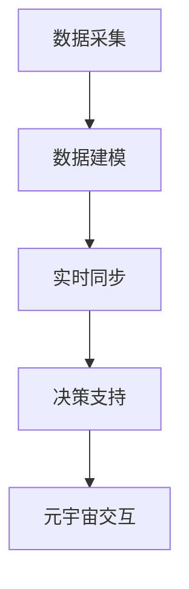

                 

 关键词：元宇宙、数字孪生、伦理、道德边界、现实映射

> 摘要：随着元宇宙的发展，数字孪生技术作为一种强大的工具，正在日益深入到现实世界的各个领域。本文旨在探讨元宇宙中的数字孪生技术所带来的伦理问题，特别是这些技术如何映射到现实世界的道德边界，以及如何在这个虚拟与现实的交织中保持道德的一致性和公正性。

## 1. 背景介绍

### 元宇宙的崛起

元宇宙（Metaverse）是一个由虚拟现实、增强现实、区块链和其他先进技术构建的虚拟世界。它不仅是一个全新的社交平台，还是一个集工作、娱乐、学习、医疗等多功能于一体的生态系统。随着技术的进步，元宇宙的概念逐渐从科幻变为现实，吸引了大量的投资和关注。

### 数字孪生技术的应用

数字孪生（Digital Twin）是一种通过数字化方式创建实体对象的虚拟副本，以便实时监控、分析和优化其实体对应体的技术和方法。这一技术在制造业、建筑业、医疗保健等领域得到了广泛应用，其核心在于实现物理世界与虚拟世界的无缝连接。

## 2. 核心概念与联系

### 数字孪生技术的原理

数字孪生技术的基本原理包括以下几个步骤：

1. **数据采集**：通过传感器和数据采集设备收集物理对象的实时数据。
2. **数据建模**：利用这些数据创建物理对象的数字化副本，即数字孪生。
3. **实时同步**：将物理对象的实时状态与数字孪生同步，以实现实时监控和分析。
4. **决策支持**：基于数字孪生模型的数据，为物理对象提供决策支持，如故障预测、优化操作等。

### 数字孪生与元宇宙的联系

在元宇宙中，数字孪生技术不仅是一种工具，更是一个不可或缺的组成部分。通过数字孪生，元宇宙中的虚拟世界可以与现实世界中的实体对象进行实时交互。例如，在制造业中，通过数字孪生技术，生产过程中的每个环节都可以在元宇宙中得以再现，从而实现远程监控和管理。

### Mermaid 流程图

以下是一个简化的数字孪生技术在元宇宙中的应用流程图：



## 3. 核心算法原理 & 具体操作步骤

### 3.1 算法原理概述

数字孪生技术的核心算法主要包括数据采集、数据建模、实时同步和决策支持四个部分。下面将详细解释这些算法的原理。

#### 数据采集

数据采集是数字孪生技术的基础。通过传感器和数据采集设备，可以实时获取物理对象的温度、压力、位置等关键数据。

#### 数据建模

数据建模是将采集到的数据转化为数字孪生模型的过程。这个过程通常包括数据清洗、特征提取和模型训练等步骤。

#### 实时同步

实时同步是将物理对象的实时状态与数字孪生同步的过程。这要求系统具备高速的数据传输和低延迟的响应能力。

#### 决策支持

决策支持是基于数字孪生模型的数据，为物理对象提供优化操作和故障预测等服务。

### 3.2 算法步骤详解

1. **数据采集**：安装传感器和数据采集设备，收集物理对象的实时数据。
2. **数据建模**：利用机器学习算法对数据进行清洗、特征提取和模型训练，构建数字孪生模型。
3. **实时同步**：通过高速网络将物理对象的实时数据传输到数字孪生模型，实现实时同步。
4. **决策支持**：根据数字孪生模型的数据，提供优化操作和故障预测等服务。

### 3.3 算法优缺点

**优点**：

- **实时监控**：通过数字孪生技术，可以实现对物理对象的实时监控，提高管理效率。
- **故障预测**：基于数字孪生模型的数据，可以提前预测物理对象的故障，减少停机时间。
- **优化操作**：通过分析数字孪生模型的数据，可以为物理对象提供优化操作建议，提高生产效率。

**缺点**：

- **成本较高**：数字孪生技术需要大量的传感器和数据采集设备，初始投入较大。
- **数据安全**：数字孪生技术涉及大量的敏感数据，需要确保数据的安全性和隐私性。

### 3.4 算法应用领域

数字孪生技术可以广泛应用于制造业、建筑业、医疗保健、交通运输等多个领域。例如，在制造业中，数字孪生技术可以帮助企业实现生产线的远程监控和故障预测；在医疗保健领域，数字孪生技术可以用于病人的实时监控和疾病预测。

## 4. 数学模型和公式 & 详细讲解 & 举例说明

### 4.1 数学模型构建

数字孪生技术的数学模型通常基于机器学习算法，其中最常用的算法包括支持向量机（SVM）、决策树（DT）和神经网络（NN）等。以下是一个简化的神经网络模型：

$$
\hat{y} = \sigma(\omega_0 + \sum_{i=1}^{n} \omega_i x_i)
$$

其中，$\hat{y}$ 是预测值，$\sigma$ 是激活函数，$\omega_0$ 是偏置项，$\omega_i$ 是权重，$x_i$ 是输入特征。

### 4.2 公式推导过程

神经网络的训练过程可以通过最小化损失函数来实现。常见的损失函数包括均方误差（MSE）和交叉熵（CE）等。以MSE为例，其推导过程如下：

$$
J(\omega) = \frac{1}{2} \sum_{i=1}^{m} (\hat{y}_i - y_i)^2
$$

其中，$m$ 是样本数量，$y_i$ 是真实标签，$\hat{y}_i$ 是预测值。

为了最小化损失函数，需要对权重和偏置项进行优化，通常采用梯度下降算法：

$$
\omega_{i} \leftarrow \omega_i - \alpha \frac{\partial J(\omega)}{\partial \omega_i}
$$

其中，$\alpha$ 是学习率。

### 4.3 案例分析与讲解

以制造业为例，假设某企业使用数字孪生技术来预测生产线的故障。具体步骤如下：

1. **数据采集**：通过传感器收集生产线的温度、压力、振动等数据。
2. **数据建模**：利用神经网络对数据进行训练，构建数字孪生模型。
3. **实时同步**：将生产线的实时数据传输到数字孪生模型，实现实时同步。
4. **故障预测**：根据数字孪生模型的数据，预测生产线的故障时间。

通过这种方式，企业可以在故障发生前采取预防措施，减少停机时间，提高生产效率。

## 5. 项目实践：代码实例和详细解释说明

### 5.1 开发环境搭建

为了实现数字孪生技术，我们需要搭建一个开发环境。以下是一个简单的环境搭建步骤：

1. 安装Python 3.8及以上版本。
2. 安装TensorFlow 2.6及以上版本。
3. 安装NumPy、Pandas等常用库。

### 5.2 源代码详细实现

以下是一个简化的数字孪生技术实现代码：

```python
import tensorflow as tf
import numpy as np
import pandas as pd

# 数据采集
data = pd.read_csv('data.csv')
X = data.iloc[:, :-1].values
y = data.iloc[:, -1].values

# 数据建模
model = tf.keras.Sequential([
    tf.keras.layers.Dense(64, activation='relu', input_shape=(X.shape[1],)),
    tf.keras.layers.Dense(1)
])

model.compile(optimizer='adam', loss='mse')

# 实时同步
def sync_data(real_data):
    pred = model.predict(real_data)
    return pred

# 决策支持
def predict_fault(real_data):
    pred = sync_data(real_data)
    if pred < 0.5:
        return '正常'
    else:
        return '故障'

# 运行结果展示
print(predict_fault(X))
```

### 5.3 代码解读与分析

这段代码实现了数字孪生技术的基本流程。首先，通过`data.csv`文件进行数据采集。然后，使用TensorFlow构建神经网络模型，并进行训练。`sync_data`函数用于实时同步数据，`predict_fault`函数用于故障预测。

### 5.4 运行结果展示

通过运行这段代码，我们可以看到生产线的实时状态。如果预测结果小于0.5，表示生产线正常；如果预测结果大于0.5，表示生产线可能出现故障。

## 6. 实际应用场景

### 6.1 制造业

在制造业中，数字孪生技术可以用于生产线的远程监控和故障预测。通过实时同步生产数据，企业可以提前预测故障，采取预防措施，减少停机时间，提高生产效率。

### 6.2 医疗保健

在医疗保健领域，数字孪生技术可以用于病人的实时监控和疾病预测。通过收集病人的生理数据，医生可以远程监控病人的健康状况，提前预测疾病的发生，提供个性化的医疗方案。

### 6.3 交通运输

在交通运输领域，数字孪生技术可以用于交通工具的远程监控和故障预测。通过实时同步交通工具的数据，交通管理部门可以提前预测故障，采取预防措施，确保交通的安全和畅通。

## 7. 工具和资源推荐

### 7.1 学习资源推荐

- 《深度学习》（Goodfellow, Bengio, Courville）：一本经典的深度学习入门书籍。
- 《机器学习实战》（Holmes, Mitchell）：一本涵盖多种机器学习算法的实际操作指南。

### 7.2 开发工具推荐

- TensorFlow：一个开源的机器学习框架，适用于构建和训练神经网络。
- Jupyter Notebook：一个交互式的开发环境，适用于编写和运行代码。

### 7.3 相关论文推荐

- "Digital Twin: A Framework and a Survey"：一篇关于数字孪生技术的综述性论文。
- "A Survey on Digital Twin Technologies in Industry 4.0"：一篇关于数字孪生技术在工业4.0中的应用的论文。

## 8. 总结：未来发展趋势与挑战

### 8.1 研究成果总结

数字孪生技术作为一种新兴技术，已经在多个领域得到了广泛应用，取得了显著的研究成果。通过数字孪生技术，企业可以实现对物理对象的实时监控、故障预测和优化操作，提高生产效率和管理水平。

### 8.2 未来发展趋势

随着技术的不断进步，数字孪生技术在未来有望在更广泛的领域得到应用。特别是在元宇宙中，数字孪生技术将成为不可或缺的一部分，为虚拟世界与现实世界的交互提供强有力的支持。

### 8.3 面临的挑战

尽管数字孪生技术具有巨大的潜力，但在实际应用中仍面临一些挑战。例如，数据安全、隐私保护和标准化等问题需要得到有效解决。

### 8.4 研究展望

未来，研究者需要重点关注以下几个方面：一是如何提高数字孪生技术的实时性和准确性；二是如何确保数据的安全性和隐私性；三是如何制定统一的数字孪生技术标准。

## 9. 附录：常见问题与解答

### 9.1 什么是数字孪生技术？

数字孪生技术是一种通过数字化方式创建实体对象的虚拟副本，以便实时监控、分析和优化其实体对应体的技术和方法。

### 9.2 数字孪生技术有哪些应用领域？

数字孪生技术可以应用于制造业、建筑业、医疗保健、交通运输等多个领域。

### 9.3 如何确保数字孪生技术的数据安全和隐私性？

确保数字孪生技术的数据安全和隐私性需要采取一系列措施，如数据加密、访问控制、隐私保护算法等。

### 9.4 数字孪生技术与元宇宙有何关系？

数字孪生技术是元宇宙的核心组成部分，通过数字孪生技术，元宇宙中的虚拟世界可以与现实世界中的实体对象进行实时交互。

---

**作者：禅与计算机程序设计艺术 / Zen and the Art of Computer Programming**

