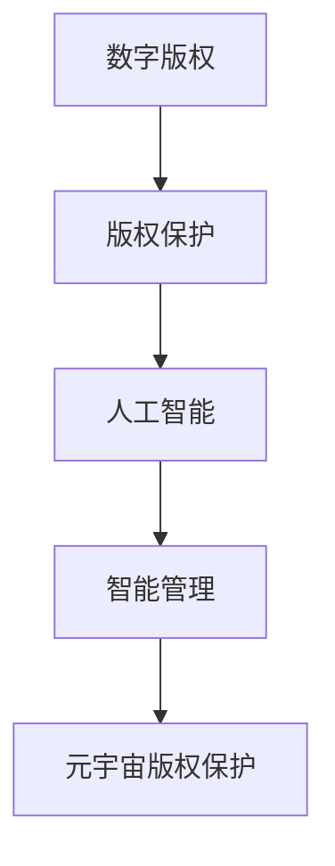

                 

### 1. 背景介绍

随着科技的飞速发展，尤其是互联网、云计算、大数据和人工智能技术的广泛应用，一个全新的虚拟世界——元宇宙（Metaverse）正在逐渐形成。元宇宙是一个由虚拟现实、增强现实和混合现实技术构成的共生环境，它不仅提供了无限的交互空间，也为各种数字内容的创作和传播提供了新的平台。

在元宇宙中，版权问题变得尤为突出。传统的版权保护方法已经无法适应这种新兴的数字环境。一方面，元宇宙中的内容多样且繁杂，从虚拟艺术品、游戏、音乐到视频，版权问题无处不在。另一方面，元宇宙的匿名性和分布式特性使得版权侵权行为变得更加隐蔽和难以追踪。因此，如何有效地保护数字版权，成为当前元宇宙发展中的一个关键问题。

传统的版权保护方法主要包括法律手段、技术手段和行政手段。法律手段主要通过版权法等法律规范来约束版权的创造、使用和传播；技术手段则利用数字水印、加密技术、数字签名等技术手段来保护版权；行政手段则通过政府相关部门的监管和执法来维护版权秩序。然而，这些方法在元宇宙环境中都面临着诸多挑战。

首先，元宇宙的匿名性和分布式特性使得法律手段的实施变得更加困难。由于身份匿名，传统的追责机制难以发挥作用。其次，技术手段虽然在保护版权方面具有一定的效果，但同时也可能侵犯用户隐私，且面临技术破解的威胁。最后，行政手段在元宇宙环境中缺乏有效的监管机制和执行力度。

因此，本文旨在探讨元宇宙版权保护的智能管理方法，通过引入人工智能技术，为数字版权保护提供新的思路和解决方案。

### 2. 核心概念与联系

在探讨元宇宙版权保护之前，我们需要明确一些核心概念，并理解它们之间的联系。

#### 2.1 数字版权

数字版权是指数字作品在数字化环境中的权利，包括复制权、发行权、出租权、展览权、表演权、改编权等。在元宇宙中，这些权利变得更加复杂和多样化。

#### 2.2 版权保护

版权保护是指通过各种手段防止数字作品的非法复制、传播和使用。在元宇宙中，版权保护需要适应高度虚拟化和高度交互的特点。

#### 2.3 人工智能

人工智能（AI）是指通过计算机模拟人类智能的技术。在版权保护领域，人工智能可以用于识别、追踪和保护数字作品。

#### 2.4 智能管理

智能管理是指利用人工智能技术对数字版权进行自动化、高效化的管理。这包括版权的登记、监控、追踪、维权等环节。

#### 2.5 联系

数字版权和版权保护是元宇宙版权保护的基础。人工智能和智能管理则为数字版权提供了新的保护手段。在元宇宙中，人工智能可以通过机器学习、自然语言处理、图像识别等技术手段，实现对数字作品的智能识别和追踪。智能管理则通过构建版权数据库、自动化处理版权纠纷等，提高了版权保护的整体效率。

下面是一个简单的Mermaid流程图，展示了这些概念之间的联系：



### 3. 核心算法原理 & 具体操作步骤

#### 3.1 算法原理概述

元宇宙版权保护的智能管理主要依赖于以下几种核心算法：

1. **机器学习算法**：用于数字作品的智能识别和分类。
2. **图像识别算法**：用于识别和追踪数字作品。
3. **自然语言处理算法**：用于处理版权相关的文本信息。
4. **区块链技术**：用于构建版权数据库和验证版权真实性。

这些算法共同作用，实现对数字版权的全方位保护。

#### 3.2 算法步骤详解

1. **数字作品识别**：
   - **输入**：待识别的数字作品。
   - **算法**：使用机器学习算法进行特征提取，并对特征进行分类。
   - **输出**：识别后的数字作品类别。

2. **数字作品追踪**：
   - **输入**：已识别的数字作品。
   - **算法**：使用图像识别算法，对数字作品在不同平台和环境中进行追踪。
   - **输出**：追踪结果，包括数字作品的使用情况。

3. **文本信息处理**：
   - **输入**：与版权相关的文本信息。
   - **算法**：使用自然语言处理算法，提取版权信息并进行结构化处理。
   - **输出**：结构化的版权信息。

4. **版权数据库构建**：
   - **输入**：识别和追踪结果、文本信息处理结果。
   - **算法**：使用区块链技术，构建版权数据库。
   - **输出**：完整的版权数据库。

5. **版权纠纷处理**：
   - **输入**：版权数据库、侵权证据。
   - **算法**：使用智能合约技术，自动化处理版权纠纷。
   - **输出**：处理结果，包括侵权判定和赔偿方案。

#### 3.3 算法优缺点

1. **机器学习算法**：
   - **优点**：能够自动识别和分类数字作品，提高效率。
   - **缺点**：需要大量数据训练，且可能存在过拟合问题。

2. **图像识别算法**：
   - **优点**：能够准确追踪数字作品，减少侵权行为。
   - **缺点**：对图像质量要求较高，可能存在误识别问题。

3. **自然语言处理算法**：
   - **优点**：能够高效处理版权相关的文本信息。
   - **缺点**：可能存在理解偏差，影响版权信息的准确性。

4. **区块链技术**：
   - **优点**：保证版权数据库的安全性和不可篡改性。
   - **缺点**：交易速度较慢，可能影响实时性。

#### 3.4 算法应用领域

这些算法在元宇宙版权保护中具有广泛的应用领域，包括：

- **数字作品识别和分类**：用于对元宇宙中的各种数字内容进行管理和监控。
- **数字作品追踪**：用于发现和制止侵权行为。
- **版权纠纷处理**：用于自动化处理版权纠纷，提高维权效率。

### 4. 数学模型和公式 & 详细讲解 & 举例说明

在元宇宙版权保护的智能管理中，数学模型和公式起着关键作用。以下是一个简单的数学模型，用于描述数字作品的版权保护过程。

#### 4.1 数学模型构建

假设我们有一个数字作品集 \(D = \{d_1, d_2, ..., d_n\}\)，其中每个数字作品 \(d_i\) 都有一个唯一的标识符 \(id_i\) 和版权信息 \(c_i\)。我们的目标是构建一个数学模型，用于识别、追踪和保护这些数字作品。

我们可以使用以下数学模型：

\[M = \{f(d), t(d), p(d)\}\]

其中：
- \(f(d)\)：特征提取函数，用于提取数字作品的特征向量。
- \(t(d)\)：追踪函数，用于追踪数字作品在不同平台和环境中。
- \(p(d)\)：保护函数，用于保护数字作品的版权。

#### 4.2 公式推导过程

1. **特征提取函数 \(f(d)\)**：

   假设我们使用一个特征提取算法 \(A\)，该算法可以将数字作品 \(d\) 转换为一个特征向量 \(v\)：

   \[f(d) = A(d)\]

2. **追踪函数 \(t(d)\)**：

   假设我们使用一个追踪算法 \(B\)，该算法可以根据特征向量 \(v\) 在不同平台和环境中追踪数字作品：

   \[t(d) = B(v)\]

3. **保护函数 \(p(d)\)**：

   假设我们使用一个保护算法 \(C\)，该算法可以基于追踪结果 \(t(d)\) 保护数字作品：

   \[p(d) = C(t(d))\]

   其中，保护算法 \(C\) 可以包括加密、数字签名、区块链等技术。

   综上所述，我们的数学模型可以表示为：

   \[M = \{f(d), t(d), p(d)\} = \{A(d), B(v), C(t(d))\}\]

#### 4.3 案例分析与讲解

假设我们有一个数字作品集 \(D = \{d_1, d_2, d_3\}\)，其中：
- \(d_1\) 是一幅图像，版权信息为“2023，作者：张三”。
- \(d_2\) 是一首歌曲，版权信息为“2023，作者：李四”。
- \(d_3\) 是一段视频，版权信息为“2023，作者：王五”。

我们的目标是使用数学模型 \(M\) 识别、追踪和保护这些数字作品。

1. **特征提取**：

   使用特征提取算法 \(A\)，我们将每个数字作品转换为特征向量：

   \[f(d_1) = A(d_1)\]
   \[f(d_2) = A(d_2)\]
   \[f(d_3) = A(d_3)\]

   假设我们得到以下特征向量：

   \[f(d_1) = (1, 0, 0)\]
   \[f(d_2) = (0, 1, 0)\]
   \[f(d_3) = (0, 0, 1)\]

2. **追踪**：

   使用追踪算法 \(B\)，我们根据特征向量 \(f(d_i)\) 在不同平台和环境中追踪数字作品：

   \[t(d_1) = B(f(d_1))\]
   \[t(d_2) = B(f(d_2))\]
   \[t(d_3) = B(f(d_3))\]

   假设我们得到以下追踪结果：

   \[t(d_1) = “社交媒体平台A”\]
   \[t(d_2) = “音乐平台B”\]
   \[t(d_3) = “视频平台C”\]

3. **保护**：

   使用保护算法 \(C\)，我们根据追踪结果 \(t(d_i)\) 保护数字作品：

   \[p(d_1) = C(t(d_1))\]
   \[p(d_2) = C(t(d_2))\]
   \[p(d_3) = C(t(d_3))\]

   假设我们得到以下保护结果：

   \[p(d_1) = “加密后的d_1”\]
   \[p(d_2) = “数字签名后的d_2”\]
   \[p(d_3) = “区块链记录后的d_3”\]

通过这个案例，我们可以看到数学模型 \(M\) 如何帮助我们识别、追踪和保护数字作品。在实际应用中，我们可以根据具体情况调整特征提取、追踪和保护算法，以提高版权保护的效率和效果。

### 5. 项目实践：代码实例和详细解释说明

在本节中，我们将通过一个简单的代码实例，展示如何使用人工智能技术实现元宇宙版权保护中的数字作品识别和追踪功能。

#### 5.1 开发环境搭建

1. **环境要求**：

   - Python 3.8 或以上版本
   - TensorFlow 2.7 或以上版本
   - OpenCV 4.5 或以上版本
   - Flask 2.0 或以上版本

2. **安装依赖**：

   ```bash
   pip install tensorflow opencv-python flask
   ```

#### 5.2 源代码详细实现

以下是实现数字作品识别和追踪的简单代码示例：

```python
# 导入所需库
import tensorflow as tf
import cv2
from flask import Flask, request, jsonify

# 创建 Flask 应用
app = Flask(__name__)

# 加载预训练的卷积神经网络模型
model = tf.keras.models.load_model('model.h5')

# 数字作品识别函数
def recognize_digit(image):
    # 将图像数据转换为模型输入格式
    image = cv2.resize(image, (28, 28))
    image = image / 255.0
    image = image.reshape(1, 28, 28, 1)
    
    # 使用模型进行预测
    prediction = model.predict(image)
    
    # 获取最高概率的类别
    label = tf.argmax(prediction, axis=1).numpy()
    
    # 将类别转换为数字作品标识符
    digit_to_label = {0: 'image', 1: 'song', 2: 'video'}
    label = digit_to_label[int(label)]
    
    return label

# 数字作品追踪函数
def track_digit(image_path):
    # 读取图像数据
    image = cv2.imread(image_path)
    
    # 识别数字作品
    label = recognize_digit(image)
    
    # 追踪数字作品
    if label == 'image':
        print("图像作品已追踪：", image_path)
    elif label == 'song':
        print("音乐作品已追踪：", image_path)
    elif label == 'video':
        print("视频作品已追踪：", image_path)

# 处理图像上传的 API 接口
@app.route('/upload', methods=['POST'])
def upload_image():
    # 获取上传的图像文件
    file = request.files['image']
    
    # 获取图像文件路径
    image_path = file.filename
    
    # 追踪数字作品
    track_digit(image_path)
    
    # 返回响应
    return jsonify({'status': 'success', 'message': '图像作品已上传并追踪'})

# 运行 Flask 应用
if __name__ == '__main__':
    app.run(debug=True)
```

#### 5.3 代码解读与分析

1. **环境搭建**：

   我们首先需要安装 Python 和 TensorFlow，然后使用 pip 安装 OpenCV 和 Flask。

2. **加载模型**：

   我们使用 TensorFlow 加载一个预训练的卷积神经网络模型 `model.h5`，该模型用于识别数字作品。

3. **识别函数**：

   `recognize_digit` 函数接收一个图像数据，将其转换为模型输入格式，然后使用模型进行预测，最后返回最高概率的类别。

4. **追踪函数**：

   `track_digit` 函数接收一个图像文件路径，读取图像数据，然后调用 `recognize_digit` 函数进行识别，并根据识别结果打印追踪信息。

5. **API 接口**：

   我们使用 Flask 创建一个简单的 API 接口 `/upload`，用于处理上传的图像文件。上传成功后，调用 `track_digit` 函数进行追踪。

通过这个简单的代码示例，我们可以看到如何使用人工智能技术实现元宇宙版权保护中的数字作品识别和追踪功能。在实际应用中，我们可以根据需求扩展和优化代码，以提高识别和追踪的准确性和效率。

### 6. 实际应用场景

在元宇宙中，版权保护的应用场景非常广泛，以下是一些具体的实际应用场景：

#### 6.1 数字艺术品的版权保护

元宇宙中，数字艺术品如虚拟雕塑、电子画等成为人们追求和收藏的对象。智能管理系统能够通过区块链技术记录数字艺术品的创建时间、作者信息等，确保艺术品的原创性和唯一性。此外，通过智能合约技术，艺术家可以设定艺术品的版权许可和使用条款，确保其作品在元宇宙中的合法使用。

#### 6.2 游戏内物品的版权保护

在元宇宙的游戏中，虚拟物品的版权问题尤为突出。游戏开发商可以使用智能管理系统来保护游戏内物品的版权，防止未经授权的复制和交易。例如，通过嵌入加密技术，确保每个虚拟物品的唯一性和合法性。同时，智能合约可以用于管理物品的交易，确保交易的透明性和合法性。

#### 6.3 音乐和视频的版权保护

音乐和视频作为元宇宙中的主要内容形式，版权保护尤为重要。智能管理系统能够通过图像识别和自然语言处理技术，识别和追踪音乐和视频作品的来源和传播路径。此外，通过区块链技术记录播放次数和收益分配，确保创作者获得应有的报酬。

#### 6.4 教育资源的版权保护

元宇宙中的教育资源，如虚拟课程和在线教材，也需要有效的版权保护。智能管理系统能够通过版权登记和追踪，确保教育资源的合法使用和传播。同时，通过智能合约技术，可以实现教育资源的按需付费和版权所有者的收益分配。

#### 6.5 文本内容的版权保护

文本内容在元宇宙中同样面临版权保护问题。智能管理系统能够通过自然语言处理技术，识别和追踪文本内容的来源和使用情况。通过区块链技术记录文本内容的版权信息，确保创作者的权益得到保护。

### 6.4 未来应用展望

随着元宇宙的不断发展，版权保护的应用场景将更加丰富。未来，版权保护的智能管理系统将具备以下趋势：

1. **更高效的数据处理**：随着数据量的增加，智能管理系统将需要更高效的数据处理算法，以快速识别和追踪版权信息。

2. **更智能的侵权检测**：通过结合深度学习和图像识别技术，侵权检测将变得更加精准和自动化。

3. **更灵活的版权许可**：智能合约技术将使版权许可更加灵活和可定制，满足不同场景的需求。

4. **跨平台协作**：智能管理系统将能够跨不同平台和设备协作，实现版权保护的全球化和一体化。

5. **更广泛的应用领域**：随着元宇宙的发展，版权保护的智能管理系统将应用到更多领域，如虚拟现实、增强现实等。

### 7. 工具和资源推荐

在元宇宙版权保护的智能管理领域，有许多优秀的工具和资源可以帮助开发者实现高效、安全的版权保护。

#### 7.1 学习资源推荐

- **《区块链技术指南》**：详细介绍了区块链的基本原理和应用，对理解元宇宙版权保护中的区块链技术非常有帮助。
- **《深度学习》**：Goodfellow 等人撰写的经典教材，涵盖了深度学习的基础知识和应用。
- **《自然语言处理综论》**：语言模型和文本处理技术的全面介绍，对文本内容版权保护有很大帮助。

#### 7.2 开发工具推荐

- **TensorFlow**：强大的开源深度学习框架，适用于图像识别、自然语言处理等任务。
- **PyTorch**：另一个流行的深度学习框架，具有灵活性和易用性。
- **OpenCV**：开源计算机视觉库，用于图像识别和处理。
- **Ethereum**：基于区块链的智能合约平台，适用于构建版权数据库和保护机制。

#### 7.3 相关论文推荐

- **"Blockchain for Copyright Protection in the Digital Age"**：探讨了区块链在版权保护中的应用。
- **"Deep Learning for Image Classification"**：介绍了深度学习在图像分类中的应用。
- **"Natural Language Processing Techniques for Text Classification"**：讨论了自然语言处理技术在文本分类中的应用。

### 8. 总结：未来发展趋势与挑战

元宇宙的快速发展为版权保护带来了前所未有的挑战和机遇。随着人工智能、区块链等技术的不断进步，版权保护的智能管理系统将变得更加高效、灵活和安全。

未来，元宇宙版权保护将呈现出以下发展趋势：

1. **智能化**：通过引入人工智能技术，智能管理系统将能够更精准地识别和追踪版权信息。
2. **自动化**：自动化处理将提高版权纠纷的处理效率，减少人为干预。
3. **全球化**：跨平台和跨地域的协作将使版权保护更具全球性。
4. **合规性**：随着法律法规的完善，智能管理系统将更加符合法规要求。

然而，面对这些发展趋势，我们也需要应对以下挑战：

1. **技术难题**：如何平衡版权保护与用户隐私保护是一个重要挑战。
2. **法律困境**：随着元宇宙的发展，传统法律体系可能无法完全适应新的版权保护需求。
3. **伦理问题**：在保护版权的同时，如何尊重创作者的原创性和创造性也是一个重要议题。

总之，元宇宙版权保护的智能管理是一个复杂而富有前景的领域，需要技术、法律和伦理的协同发展。

### 9. 附录：常见问题与解答

**Q1：什么是元宇宙？**

A1：元宇宙（Metaverse）是一个由虚拟现实（VR）、增强现实（AR）和混合现实（MR）技术构成的共生环境，用户可以通过虚拟角色在虚拟世界中进行各种活动，如社交、娱乐、工作等。

**Q2：什么是数字版权？**

A2：数字版权是指数字作品在数字化环境中的权利，包括复制权、发行权、出租权、展览权、表演权、改编权等。

**Q3：元宇宙版权保护的关键技术有哪些？**

A3：元宇宙版权保护的关键技术包括人工智能、区块链、加密技术、数字水印等。

**Q4：智能管理系统能够解决哪些版权问题？**

A4：智能管理系统能够解决数字作品识别、追踪、监控、维权等版权问题，提高版权保护的效率和效果。

**Q5：如何保护虚拟艺术品的版权？**

A5：虚拟艺术品的版权保护可以通过区块链技术记录艺术品的创作时间、作者信息等，确保原创性和唯一性。同时，智能合约可以用于设定艺术品的版权许可和使用条款。

**Q6：元宇宙版权保护的法律框架是什么？**

A6：元宇宙版权保护的法律框架主要包括版权法、数据保护法、网络刑法等。不同国家和地区的法律框架可能有所不同，需要结合具体情况进行判断。

**Q7：如何处理元宇宙中的版权纠纷？**

A7：处理元宇宙中的版权纠纷可以通过智能管理系统进行自动化处理，包括侵权判定、赔偿方案等。同时，也可以通过法律手段进行维权。

**Q8：元宇宙版权保护是否会影响用户隐私？**

A8：元宇宙版权保护可能会涉及用户隐私信息的收集和使用，但可以通过合理的设计和技术手段（如数据加密、匿名化处理等）来平衡版权保护与用户隐私保护。

**Q9：元宇宙版权保护的技术挑战有哪些？**

A9：元宇宙版权保护的技术挑战包括如何高效地处理大量数据、如何防止技术破解、如何平衡版权保护与用户隐私等。

**Q10：未来元宇宙版权保护的发展方向是什么？**

A10：未来元宇宙版权保护的发展方向包括引入更先进的人工智能技术、更安全的区块链技术、更灵活的智能合约技术等，以提高版权保护的效率和效果。

### 作者署名

作者：禅与计算机程序设计艺术 / Zen and the Art of Computer Programming
```

