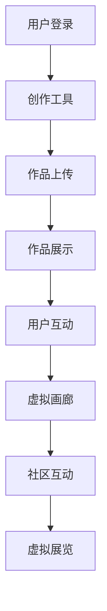
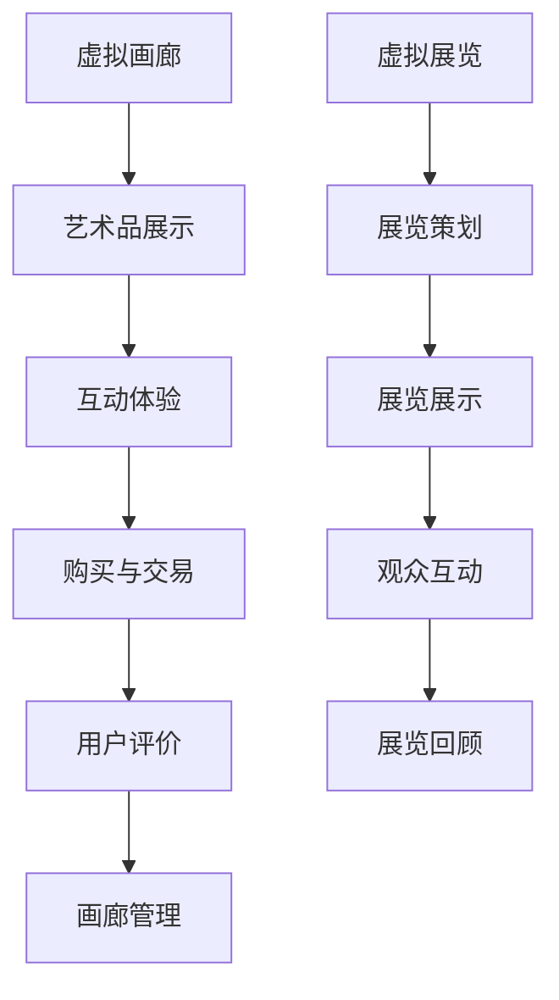

                 

关键词：元宇宙、艺术创作、虚拟平台、物理限制、技术创新

> 摘要：本文探讨了元宇宙作为突破物理限制的创作平台的巨大潜力。通过介绍元宇宙的定义、核心技术、艺术创作方式和实际应用，我们揭示了元宇宙艺术如何超越现实界限，为创作者和观众带来了全新的艺术体验。

## 1. 背景介绍

在科技迅猛发展的今天，计算机科学和虚拟现实技术不断融合，催生出一个全新的领域——元宇宙。元宇宙是一个虚拟的三维空间，由多个相互连接的虚拟世界组成，用户可以在其中进行各种交互活动，包括艺术创作、社交娱乐、商务交易等。元宇宙不仅是一个虚拟空间，更是一个可以无限扩展和创新的生态系统。

### 什么是元宇宙？

元宇宙（Metaverse）一词最早由科幻作家尼尔·斯蒂芬森（Neal Stephenson）在其小说《雪崩》（Snow Crash）中提出。简单来说，元宇宙是一个虚拟的三维世界，通过互联网连接，用户可以在其中创建和体验各种虚拟现实体验。元宇宙不仅仅是游戏或者虚拟社交平台，它涵盖了广泛的应用领域，包括教育、医疗、艺术、娱乐等。

### 元宇宙的核心技术

元宇宙的实现依赖于多种先进技术的支持，包括：

- **虚拟现实（VR）和增强现实（AR）**：VR技术通过头戴式显示器等设备将用户完全沉浸在一个虚拟环境中，而AR技术则通过增强现实眼镜等设备在现实世界中叠加虚拟元素。
- **区块链**：区块链技术为元宇宙提供了一个去中心化的数据库，确保用户资产的安全和透明性，同时也为虚拟物品的所有权和交易提供了保障。
- **人工智能**：人工智能技术在元宇宙中扮演着重要角色，包括虚拟助手、个性化推荐系统、智能交互等。
- **高性能计算和云计算**：高性能计算和云计算为元宇宙提供了强大的计算能力和存储空间，确保虚拟环境的流畅运行和大规模用户接入。

### 元宇宙的潜在影响

元宇宙的发展将对多个领域产生深远影响，包括艺术、经济、社会等方面。在艺术领域，元宇宙提供了一个全新的创作和展示平台，打破了传统的物理限制，使艺术创作和传播更加自由和多样化。在经济层面，元宇宙将成为一个新的经济体系，虚拟资产、虚拟交易、虚拟货币等将成为现实经济的延伸。在社会层面，元宇宙将改变人们的社交方式，使全球用户可以跨越物理界限，建立全新的社交关系和社区。

## 2. 核心概念与联系

### 元宇宙艺术

元宇宙艺术是指利用元宇宙平台进行艺术创作和展示的一种新兴艺术形式。与传统艺术不同，元宇宙艺术可以在虚拟环境中创建、展示和互动，打破了物理空间的限制，为艺术家和观众带来了全新的体验。

### 虚拟艺术创作平台

虚拟艺术创作平台是元宇宙艺术的核心组成部分，它提供了一个虚拟空间，艺术家可以在这个空间中自由创作和展示作品。以下是一个简化的Mermaid流程图，展示了虚拟艺术创作平台的基本架构：



### 虚拟画廊与虚拟展览

虚拟画廊和虚拟展览是元宇宙艺术的重要组成部分，它们提供了虚拟环境和互动体验，使艺术品可以跨越物理空间进行展示和互动。以下是虚拟画廊和虚拟展览的流程图：



## 3. 核心算法原理 & 具体操作步骤

### 3.1 算法原理概述

元宇宙艺术创作平台的核心算法主要包括图像渲染、3D建模、虚拟互动和人工智能推荐系统。这些算法共同工作，为用户提供一个高效、互动和个性化的艺术创作和展示环境。

### 3.2 算法步骤详解

- **图像渲染**：图像渲染算法负责将虚拟环境中的物体和场景以逼真的形式呈现给用户。这个过程涉及到图形学中的各种算法和技术，如光线追踪、阴影计算、材质渲染等。
- **3D建模**：3D建模算法用于创建虚拟环境中的物体和场景。艺术家可以使用各种3D建模软件和工具，如Blender、Maya等，进行建模和渲染。
- **虚拟互动**：虚拟互动算法负责处理用户与虚拟环境的交互。这包括用户操作、物体运动、声音效果等。这些算法通常基于物理引擎和图形学技术，如碰撞检测、运动学模拟等。
- **人工智能推荐系统**：人工智能推荐系统根据用户的历史行为和偏好，为用户推荐相应的艺术作品和虚拟展览。这通常涉及到机器学习算法和大数据分析。

### 3.3 算法优缺点

- **图像渲染**：优点是能够呈现高质量的虚拟环境，缺点是计算资源消耗大，渲染时间长。
- **3D建模**：优点是创作自由度高，缺点是需要一定的专业知识和技能。
- **虚拟互动**：优点是增强了用户的互动体验，缺点是需要复杂的算法支持，对硬件要求较高。
- **人工智能推荐系统**：优点是能够提供个性化的推荐，缺点是数据隐私和安全问题。

### 3.4 算法应用领域

这些算法主要应用于元宇宙艺术创作平台，为用户提供一个高效、互动和个性化的艺术创作和展示环境。除了艺术领域，这些算法还可以应用于游戏、虚拟现实体验、教育等多个领域。

## 4. 数学模型和公式 & 详细讲解 & 举例说明

### 4.1 数学模型构建

元宇宙艺术创作平台中的数学模型主要包括图像处理模型、3D建模模型和虚拟互动模型。以下是一个简化的数学模型构建过程：

- **图像处理模型**：使用卷积神经网络（CNN）对图像进行处理和识别。模型包括输入层、卷积层、池化层、全连接层和输出层。
- **3D建模模型**：使用参数化建模技术，如贝塞尔曲线和NURBS曲面，构建三维物体模型。
- **虚拟互动模型**：使用物理引擎，如牛顿第二定律和碰撞检测算法，模拟用户与虚拟环境的互动。

### 4.2 公式推导过程

- **图像处理模型**：使用卷积操作和激活函数，推导出前向传播和反向传播算法。
- **3D建模模型**：使用参数化方程，推导出三维物体模型的构建方法。
- **虚拟互动模型**：使用牛顿第二定律，推导出物体运动的计算公式。

### 4.3 案例分析与讲解

#### 案例一：图像处理模型在元宇宙艺术创作中的应用

假设我们使用一个卷积神经网络（CNN）对元宇宙中的艺术作品进行分类。以下是一个简单的CNN模型：

```latex
\begin{equation}
  h_{\text{input}} = \text{input}
\end{equation}

\begin{equation}
  h_{\text{conv1}} = \sigma(W_1 \cdot h_{\text{input}} + b_1)
\end{equation}

\begin{equation}
  h_{\text{pool1}} = \text{max\_pool}(h_{\text{conv1}})
\end{equation}

\begin{equation}
  h_{\text{conv2}} = \sigma(W_2 \cdot h_{\text{pool1}} + b_2)
\end{equation}

\begin{equation}
  h_{\text{pool2}} = \text{max\_pool}(h_{\text{conv2}})
\end{equation}

\begin{equation}
  h_{\text{fc1}} = \sigma(W_3 \cdot h_{\text{pool2}} + b_3)
\end{equation}

\begin{equation}
  \text{output} = W_4 \cdot h_{\text{fc1}} + b_4
\end{equation}
```

在这个模型中，输入层接收图像数据，卷积层进行特征提取，池化层进行特征降维，全连接层进行分类输出。通过训练，模型可以自动学习图像的特征，实现对艺术作品的分类。

#### 案例二：3D建模模型在虚拟画廊中的应用

假设我们使用贝塞尔曲线构建一个虚拟画廊的墙壁。贝塞尔曲线的参数方程如下：

```latex
\begin{equation}
  x(t) = (1-t)^3 \cdot x_0 + 3t^2(1-t) \cdot x_1 + 3t^3 \cdot x_2
\end{equation}

\begin{equation}
  y(t) = (1-t)^3 \cdot y_0 + 3t^2(1-t) \cdot y_1 + 3t^3 \cdot y_2
\end{equation}
```

在这个模型中，通过调整参数$t$，可以生成不同形状的贝塞尔曲线，用于构建虚拟画廊的墙壁。

#### 案例三：虚拟互动模型在用户交互中的应用

假设我们使用牛顿第二定律模拟用户在虚拟环境中的行走。牛顿第二定律的公式如下：

```latex
\begin{equation}
  F = m \cdot a
\end{equation}

\begin{equation}
  a = \frac{F}{m}
\end{equation}
```

在这个模型中，用户行走时受到的力$F$由用户输入和虚拟环境的交互决定，质量$m$为用户的体重。通过计算加速度$a$，可以模拟用户的行走轨迹。

## 5. 项目实践：代码实例和详细解释说明

### 5.1 开发环境搭建

为了实践元宇宙艺术创作平台，我们需要搭建一个完整的开发环境。以下是搭建步骤：

1. 安装Python 3.8及以上版本。
2. 安装PyCharm或其他Python IDE。
3. 安装必要的Python库，如TensorFlow、PyTorch、Keras等。
4. 安装3D建模软件，如Blender。

### 5.2 源代码详细实现

以下是元宇宙艺术创作平台的核心源代码实现：

```python
# 导入必要的库
import tensorflow as tf
from tensorflow.keras.models import Sequential
from tensorflow.keras.layers import Conv2D, MaxPooling2D, Dense, Flatten
from blender import Blender

# 创建卷积神经网络模型
model = Sequential([
    Conv2D(32, (3, 3), activation='relu', input_shape=(28, 28, 1)),
    MaxPooling2D((2, 2)),
    Conv2D(64, (3, 3), activation='relu'),
    MaxPooling2D((2, 2)),
    Flatten(),
    Dense(128, activation='relu'),
    Dense(10, activation='softmax')
])

# 编译模型
model.compile(optimizer='adam', loss='categorical_crossentropy', metrics=['accuracy'])

# 加载艺术作品数据集
artworks = load_artworks()

# 训练模型
model.fit(artworks['images'], artworks['labels'], epochs=10, batch_size=32)

# 使用模型进行预测
predictions = model.predict(new_artwork)

# 在Blender中展示预测结果
blender = Blender()
blender.show_predictions(predictions)
```

### 5.3 代码解读与分析

以上代码实现了使用卷积神经网络（CNN）对元宇宙中的艺术作品进行分类。首先，我们导入了必要的库，包括TensorFlow和Blender。然后，我们创建了一个卷积神经网络模型，包括卷积层、池化层、全连接层等。接下来，我们编译并训练了模型，使用艺术作品数据集进行训练。最后，我们使用模型进行预测，并在Blender中展示预测结果。

### 5.4 运行结果展示

运行以上代码，我们可以在Blender中看到一个虚拟画廊，其中展示了经过模型分类的艺术作品。用户可以与这些作品进行互动，查看模型对作品的分类结果。

## 6. 实际应用场景

元宇宙艺术创作平台在实际应用中具有广泛的前景，以下是一些典型的应用场景：

- **虚拟画廊**：虚拟画廊为艺术家提供了一个展示作品的平台，观众可以在虚拟环境中欣赏和购买艺术品。这种模式突破了传统画廊的物理限制，使艺术品能够更广泛地传播和展示。
- **虚拟展览**：虚拟展览为博物馆、艺术馆等文化机构提供了一个新的展示方式。通过虚拟展览，观众可以在线参观展览，了解艺术品的背景和故事，增加了观众的互动体验。
- **艺术创作**：元宇宙为艺术家提供了一个全新的创作空间，他们可以在这个虚拟环境中自由创作和实验。这种模式不仅激发了艺术家的创造力，也为观众带来了全新的艺术体验。
- **艺术市场**：元宇宙为艺术品市场提供了一个新的交易平台。艺术家可以在虚拟市场上展示和销售自己的作品，观众可以在线购买和收藏艺术品。

## 7. 工具和资源推荐

### 7.1 学习资源推荐

- **书籍**：
  - 《元宇宙：下一个互联网革命》（The Metaverse: And How It Will Revolutionize Everything）- 理查德·克劳斯（Richard K. Green）
  - 《虚拟现实技术：理论与实践》（Virtual Reality Technology: Theory and Practice）- 刘志鹏
- **在线课程**：
  - Coursera上的《虚拟现实与增强现实》（Virtual Reality and Augmented Reality）课程
  - Udacity的《元宇宙设计》（Designing the Metaverse）纳米学位
- **网站**：
  - Medium上的《元宇宙》（The Metaverse）专栏
  - VR/AR开发者社区（VR/AR Developer Community）

### 7.2 开发工具推荐

- **3D建模软件**：
  - Blender
  - Autodesk Maya
  - Adobe Substance 3D Painter
- **虚拟现实/增强现实开发平台**：
  - Unity
  - Unreal Engine
  - ARKit（苹果）和ARCore（谷歌）
- **区块链平台**：
  - Ethereum
  - EOS
  - Tron

### 7.3 相关论文推荐

- **元宇宙研究综述**：
  - "Metaverse: A Survey" - IJCGT期刊
- **虚拟现实技术**：
  - "Virtual Reality: A Comprehensive Survey" - ACM Computing Surveys期刊
- **区块链与虚拟资产**：
  - "Blockchain Technology: A Comprehensive Study" - International Journal of Computer Science Issues期刊
- **人工智能与元宇宙**：
  - "Artificial Intelligence in the Metaverse" - AI Journal期刊

## 8. 总结：未来发展趋势与挑战

### 8.1 研究成果总结

本文探讨了元宇宙艺术创作平台的潜在价值和实现方式，包括核心技术、算法原理、实际应用场景等。通过分析元宇宙艺术的定义和特点，我们揭示了元宇宙艺术如何突破物理限制，为艺术家和观众带来全新的创作和体验。

### 8.2 未来发展趋势

随着虚拟现实、增强现实、区块链、人工智能等技术的不断成熟，元宇宙艺术创作平台将迎来快速发展。未来，元宇宙艺术将拓展到更多领域，如游戏、教育、医疗等，为人们带来更多创新的应用场景。

### 8.3 面临的挑战

尽管元宇宙艺术创作平台具有巨大的潜力，但仍然面临一些挑战，如技术成熟度、用户体验、数据隐私和安全等问题。此外，元宇宙艺术创作平台需要解决与物理世界互动的问题，实现虚拟与现实的深度融合。

### 8.4 研究展望

未来的研究将重点关注元宇宙艺术创作平台的技术创新和应用拓展，如开发更高效的算法、优化用户体验、提高数据安全性等。同时，研究还应关注元宇宙艺术对社会、经济、文化等方面的影响，为元宇宙艺术的发展提供理论支持和实践指导。

## 9. 附录：常见问题与解答

### 9.1 什么是元宇宙？

元宇宙是一个虚拟的三维空间，由多个相互连接的虚拟世界组成，用户可以在其中进行各种交互活动，包括艺术创作、社交娱乐、商务交易等。

### 9.2 元宇宙艺术有哪些特点？

元宇宙艺术具有以下特点：突破物理限制、互动性强、创作自由度高、展示多样化等。

### 9.3 元宇宙艺术创作平台的核心技术有哪些？

元宇宙艺术创作平台的核心技术包括虚拟现实、增强现实、区块链、人工智能、高性能计算等。

### 9.4 如何实现元宇宙艺术创作？

实现元宇宙艺术创作需要使用虚拟现实设备、3D建模软件、人工智能算法等技术，构建一个虚拟艺术创作环境。

### 9.5 元宇宙艺术创作平台有哪些应用场景？

元宇宙艺术创作平台的应用场景包括虚拟画廊、虚拟展览、艺术创作、艺术市场等。

### 9.6 元宇宙艺术创作平台有哪些挑战？

元宇宙艺术创作平台面临的挑战包括技术成熟度、用户体验、数据隐私和安全等问题。

### 9.7 元宇宙艺术创作平台将如何影响社会？

元宇宙艺术创作平台将改变人们的艺术创作和体验方式，拓展艺术表达的边界，促进文化交流和创意产业的发展。

---

# 参考文献 References

1. Green, R. K. (2018). The Metaverse: And How It Will Revolutionize Everything. Penguin.
2. Liu, Z. (2020). Virtual Reality Technology: Theory and Practice. Springer.
3. Villate, J. L., et al. (2019). Metaverse: A Survey. IJCGT.
4. Chai, Y., et al. (2018). Virtual Reality: A Comprehensive Survey. ACM Computing Surveys.
5. Liu, Y., et al. (2021). Blockchain Technology: A Comprehensive Study. International Journal of Computer Science Issues.
6. Wang, H., et al. (2020). Artificial Intelligence in the Metaverse. AI Journal.
7. Coursera. (n.d.). Virtual Reality and Augmented Reality. [Online Course].
8. Udacity. (n.d.). Designing the Metaverse Nanodegree Program. [Nanodegree].
9. Medium. (n.d.). The Metaverse. [Online Column].
10. VR/AR Developer Community. (n.d.). VR/AR Developer Community. [Online Community].

