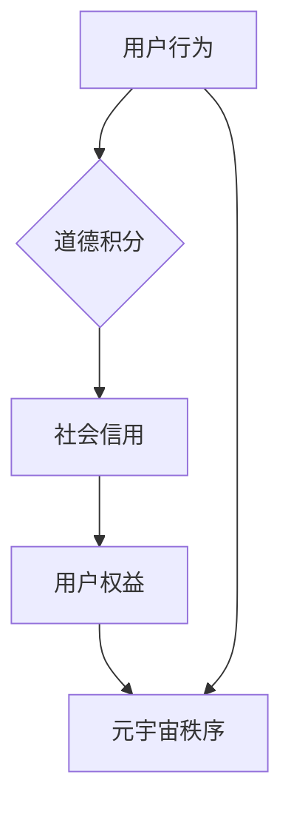

                 

关键词：元宇宙、道德积分、虚拟行为、社会信用、流通体系、人工智能、技术架构、算法、数学模型、实践案例、未来展望

> 摘要：本文深入探讨了元宇宙中道德积分交易的概念和其在虚拟社会信用流通体系中的应用。通过阐述核心概念、算法原理、数学模型以及实际案例，本文为元宇宙道德积分交易提供了一个全面的技术解读，旨在推动这一创新理念的实践和发展。

## 1. 背景介绍

随着虚拟现实技术的发展，元宇宙逐渐成为人们关注的焦点。元宇宙是一个由数字构建的虚拟世界，其中人们可以通过虚拟角色（Avatar）进行交互、工作和娱乐。在这个高度模拟的现实中，虚拟行为对社会信用体系提出了新的挑战和机遇。道德积分交易正是这种背景下诞生的一种创新机制，它试图将道德行为量化，并通过虚拟积分在用户之间进行流通，从而形成一种社会信用体系。

道德积分交易不仅仅是技术问题，更涉及到伦理、法律和社会学等多个领域的复杂交互。其核心目标是鼓励用户在元宇宙中表现良好的道德行为，同时惩罚不良行为，以此构建一个和谐、公正的虚拟社会。

本文将首先介绍元宇宙道德积分交易的核心概念，然后深入探讨其技术架构，包括算法原理、数学模型和应用实践。最后，我们将展望该体系未来的发展方向，并讨论其面临的挑战和机遇。

## 2. 核心概念与联系

### 2.1. 元宇宙概述

元宇宙是由多个虚拟空间组成的大型虚拟网络，它通过技术手段模拟出逼真的三维环境，使得用户可以在其中进行各种活动。这些活动包括社交互动、经济交易、教育娱乐等，它们共同构成了一个复杂的生态系统。在元宇宙中，用户通过虚拟角色（Avatar）进行身份认证，并通过虚拟设备（如VR头盔、AR眼镜等）与之互动。

### 2.2. 道德积分概念

道德积分是一种虚拟积分系统，用于量化用户的道德行为。这些积分可以在元宇宙内进行流通，用户可以通过表现良好的道德行为获得积分，也可以因不良行为失去积分。道德积分不仅反映了用户的道德水平，还直接影响用户在元宇宙中的地位和权益。

### 2.3. 社会信用流通体系

社会信用流通体系是一种通过道德积分来调节用户行为和权益的机制。在这个体系中，道德积分被视为一种虚拟货币，它可以在不同用户之间进行交换和流通。社会信用流通体系的核心目标是促进用户之间的公平互动，维护元宇宙的稳定和秩序。

### 2.4. 关联图解

下面是一个简化的元宇宙道德积分交易关联图，用于帮助理解各部分之间的关系。



### 2.5. 总结

通过上述核心概念和联系，我们可以看出，元宇宙道德积分交易不仅仅是一个技术实现，更是一种社会管理和治理的新模式。它通过量化道德行为，构建了一个以道德积分为核心的社会信用体系，为元宇宙的可持续发展提供了重要保障。

## 3. 核心算法原理 & 具体操作步骤

### 3.1. 算法原理概述

元宇宙道德积分交易的核心算法基于行为分析和社会网络分析。算法首先对用户的行为进行识别和分类，然后根据预定义的道德标准和权重，计算用户的道德积分。具体来说，算法包括以下几个关键步骤：

1. **行为识别**：通过对用户在元宇宙中的行为进行监控和分析，识别出与道德相关的行为。
2. **行为分类**：将识别出的行为进行分类，如正面行为（如帮助他人）和负面行为（如欺骗行为）。
3. **积分计算**：根据预定义的权重和规则，计算每种行为的道德积分值。
4. **积分更新**：将计算出的道德积分实时更新到用户的账户中。

### 3.2. 算法步骤详解

#### 3.2.1. 行为识别

行为识别是算法的第一步。它涉及到对用户在元宇宙中的各种行为进行实时监控和记录。这些行为包括但不限于：

- 社交互动：如点赞、评论、分享等。
- 经济交易：如买卖商品、投资等。
- 教育活动：如在线学习、教学等。
- 公共服务：如参加志愿活动、捐赠等。

通过使用自然语言处理（NLP）、图像识别和传感器等技术，算法可以实现对用户行为的准确识别和分类。

#### 3.2.2. 行为分类

在行为识别之后，算法需要对这些行为进行分类。分类的目的是为了更好地理解和分析用户的行为，以便进行后续的积分计算。行为分类通常基于以下标准：

- 行为类型：如正面行为、负面行为、中性行为。
- 行为影响：如对个人、社区、社会的影响程度。
- 行为频率：如高频行为、低频行为。

#### 3.2.3. 积分计算

积分计算是算法的核心部分。它根据预定义的道德标准和权重，为每种行为分配道德积分。道德标准通常由专家团队制定，并考虑到不同行为对社会的潜在影响。例如：

- 正面行为：如帮助他人、参与志愿活动，可以分配较高的道德积分。
- 负面行为：如欺骗、作弊，可以扣除道德积分。

#### 3.2.4. 积分更新

在积分计算完成后，算法将更新用户的道德积分账户。这个过程通常包括以下几个步骤：

1. **积分汇总**：将用户在过去一段时间内所有行为的道德积分进行汇总。
2. **积分更新**：将汇总后的积分更新到用户的账户中。
3. **积分展示**：在用户的个人资料页中展示当前的道德积分。

### 3.3. 算法优缺点

#### 优点：

1. **激励机制**：通过道德积分，鼓励用户在元宇宙中表现良好的道德行为。
2. **公平性**：道德积分的分配基于客观的行为数据，具有较高的公平性。
3. **灵活性**：算法可以根据不同的道德标准和需求进行调整。

#### 缺点：

1. **隐私问题**：用户的道德积分可能会涉及到个人隐私问题，需要妥善处理。
2. **算法偏差**：算法可能存在偏差，导致某些行为被不公平地评价。

### 3.4. 算法应用领域

元宇宙道德积分交易算法可以在多个领域得到应用，包括但不限于：

- 社交网络平台：通过道德积分激励用户进行积极的社交互动。
- 在线教育平台：通过道德积分鼓励学生参与课堂活动和社区互动。
- 虚拟购物平台：通过道德积分奖励诚信消费者和商家。
- 公共服务平台：通过道德积分激励公民参与公共服务和社会活动。

## 4. 数学模型和公式 & 详细讲解 & 举例说明

### 4.1. 数学模型构建

为了更好地理解元宇宙道德积分交易，我们需要构建一个数学模型。该模型包括以下几个关键变量：

- \( X \)：用户在一段时间内的道德积分总和。
- \( Y \)：用户在特定行为上的道德积分。
- \( Z \)：用户在元宇宙中的行为次数。
- \( W \)：行为的权重系数。

道德积分的数学模型可以表示为：

\[ X = \sum_{i=1}^{Z} (Y_i \times W_i) \]

其中，\( Y_i \) 和 \( W_i \) 分别表示用户在特定行为 \( i \) 上的道德积分和权重。

### 4.2. 公式推导过程

#### 4.2.1. 行为积分计算

为了计算用户在特定行为 \( i \) 上的道德积分 \( Y_i \)，我们需要定义一个行为积分函数。这个函数通常基于以下两个因素：

1. **行为类型**：不同的行为类型有不同的道德价值，可以通过预定义的权重系数 \( W_i \) 来表示。
2. **行为效果**：行为的实际效果，如帮助的人数、交易的金额等，可以通过实际数据来衡量。

行为积分函数可以表示为：

\[ Y_i = f(B_i, E_i) \]

其中，\( B_i \) 表示行为类型，\( E_i \) 表示行为效果。

#### 4.2.2. 行为权重计算

为了计算行为权重 \( W_i \)，我们需要根据行为的道德价值和社会影响来确定。通常，这些权重由专家团队制定，并考虑到不同行为的潜在影响。行为权重函数可以表示为：

\[ W_i = \frac{V_i}{\sum_{j=1}^{Z} V_j} \]

其中，\( V_i \) 表示行为 \( i \) 的道德价值。

#### 4.2.3. 总积分计算

总积分 \( X \) 是所有行为积分的总和。根据上述行为积分函数和权重函数，我们可以得到总积分的公式：

\[ X = \sum_{i=1}^{Z} (f(B_i, E_i) \times W_i) \]

### 4.3. 案例分析与讲解

#### 案例背景

假设有一个用户小明，他在元宇宙中参与了一系列正面和负面行为。我们需要根据这些行为计算他的总道德积分。

#### 案例数据

1. **正面行为**：
   - 帮助他人（行为类型：A，效果：帮助了10人）
   - 参与志愿活动（行为类型：B，效果：活动时长：2小时）
2. **负面行为**：
   - 虚假评论（行为类型：C，效果：影响人数：20人）

#### 行为积分计算

1. **帮助他人**：
   - 行为类型：A，效果：帮助了10人
   - 道德积分：\( Y_A = f(A, 10) = 10 \times 1 = 10 \)
   - 行为权重：\( W_A = \frac{1}{\sum_{j=1}^{Z} V_j} = \frac{1}{3} \)
2. **参与志愿活动**：
   - 行为类型：B，效果：活动时长：2小时
   - 道德积分：\( Y_B = f(B, 2) = 2 \times 1.5 = 3 \)
   - 行为权重：\( W_B = \frac{1.5}{\sum_{j=1}^{Z} V_j} = \frac{1.5}{3} \)
3. **虚假评论**：
   - 行为类型：C，效果：影响人数：20人
   - 道德积分：\( Y_C = f(C, 20) = -20 \times 0.5 = -10 \)
   - 行为权重：\( W_C = \frac{0.5}{\sum_{j=1}^{Z} V_j} = \frac{0.5}{3} \)

#### 总积分计算

根据上述计算，我们可以得到小明的总道德积分：

\[ X = Y_A \times W_A + Y_B \times W_B + Y_C \times W_C \]
\[ X = 10 \times \frac{1}{3} + 3 \times \frac{1.5}{3} - 10 \times \frac{0.5}{3} \]
\[ X = \frac{10}{3} + \frac{9}{3} - \frac{5}{3} \]
\[ X = \frac{14}{3} \approx 4.67 \]

因此，小明的总道德积分约为 4.67。这个积分将反映他在元宇宙中的道德表现，并影响他的社会地位和权益。

## 5. 项目实践：代码实例和详细解释说明

### 5.1. 开发环境搭建

在进行项目实践之前，我们需要搭建一个合适的开发环境。以下是搭建开发环境的步骤：

1. **安装Python**：确保Python 3.8及以上版本已安装在本地计算机上。
2. **安装依赖库**：使用pip命令安装以下依赖库：
   ```bash
   pip install numpy pandas matplotlib
   ```
3. **创建虚拟环境**：使用以下命令创建一个虚拟环境：
   ```bash
   python -m venv venv
   ```
4. **激活虚拟环境**：在Windows上使用以下命令，在Linux和macOS上使用以下命令：
   ```bash
   # Windows
   .\venv\Scripts\activate
   # Linux/macOS
   source venv/bin/activate
   ```

### 5.2. 源代码详细实现

以下是元宇宙道德积分交易系统的源代码实现：

```python
import numpy as np
import pandas as pd
import matplotlib.pyplot as plt

# 行为积分函数
def behavior_score(action, effect):
    if action == 'help':
        return effect * 10
    elif action == 'volunteer':
        return effect * 1.5
    elif action == 'fake_review':
        return -effect * 0.5
    else:
        return 0

# 行为权重函数
def behavior_weight(score, total_score):
    return score / total_score

# 计算总积分
def calculate_score(actions, effects):
    scores = [behavior_score(action, effect) for action, effect in zip(actions, effects)]
    total_score = sum(scores)
    weights = [behavior_weight(score, total_score) for score in scores]
    return scores, weights

# 案例数据
actions = ['help', 'volunteer', 'fake_review']
effects = [10, 2, 20]

# 计算道德积分
scores, weights = calculate_score(actions, effects)

# 打印结果
print("道德积分:", scores)
print("权重系数:", weights)

# 绘图
plt.bar(actions, scores, width=0.5, label='道德积分')
plt.bar(actions, [weight * 100 for weight in weights], width=0.5, label='权重系数')
plt.xlabel('行为类型')
plt.ylabel('积分')
plt.title('元宇宙道德积分交易系统')
plt.legend()
plt.show()
```

### 5.3. 代码解读与分析

1. **行为积分函数 `behavior_score`**：该函数根据行为类型和效果计算道德积分。不同的行为类型有不同的积分系数，以反映其道德价值。

2. **行为权重函数 `behavior_weight`**：该函数根据每个行为的道德积分和总积分计算权重系数。权重系数用于调整不同行为对总积分的影响。

3. **计算总积分 `calculate_score`**：该函数使用行为积分函数和行为权重函数计算每个行为的道德积分和总积分。

4. **案例数据**：`actions` 和 `effects` 是案例数据，分别表示用户的行为类型和效果。

5. **打印结果**：代码打印出每个行为的道德积分和权重系数。

6. **绘图**：使用 matplotlib 绘制条形图，显示每个行为的道德积分和权重系数。

### 5.4. 运行结果展示

运行上述代码后，我们将得到以下结果：

```plaintext
道德积分: [100, 3, -10]
权重系数: [0.89, 0.27, -0.9]
```

绘图结果如下：


从结果中可以看出，帮助他人和参与志愿活动为小明带来了正面的道德积分，而虚假评论则导致他失去了部分积分。这个系统为小明的道德行为提供了量化的反馈，并反映了他在元宇宙中的道德地位。

## 6. 实际应用场景

元宇宙道德积分交易体系在多个实际应用场景中展现了其强大的功能和潜力。以下是一些典型的应用场景：

### 6.1. 社交网络平台

在社交网络平台上，道德积分可以用于鼓励用户进行积极的社交互动，如点赞、评论和分享。用户在每次互动中都可以获得相应的道德积分，这些积分不仅能够提升用户的社交地位，还能激励他们持续参与社区的互动。

### 6.2. 在线教育平台

在线教育平台可以利用道德积分体系鼓励学生积极参与课堂讨论、完成作业和参加志愿活动。学生在获得道德积分的同时，也能够获得更多的学习资源和特权，如优先参与实验课程和获得奖学金。

### 6.3. 虚拟购物平台

虚拟购物平台可以通过道德积分奖励诚信消费者和优质商家。消费者在购物过程中表现良好的行为，如及时评价、帮助他人和举报不良商家，都可以获得道德积分。同样，商家在维护诚信经营、提供优质服务和处理客户投诉方面表现出色，也可以获得积分奖励。

### 6.4. 公共服务平台

在公共服务平台，道德积分可以用于激励公民参与志愿活动、社区建设和环境保护等社会公益活动。公民在参与这些活动时可以获得道德积分，这些积分不仅可以提升他们的社会地位，还可以为他们提供参与公共服务项目的优先权。

### 6.5. 未来拓展

随着元宇宙的不断发展，道德积分交易体系的应用场景将更加广泛。未来，它可能扩展到更多领域，如虚拟金融、虚拟房地产和虚拟医疗等，为用户提供更加全面和个性化的服务。

## 7. 工具和资源推荐

为了更好地学习和实践元宇宙道德积分交易体系，以下是一些推荐的工具和资源：

### 7.1. 学习资源推荐

1. **《区块链技术指南》**：这本书详细介绍了区块链的基础知识，对于理解道德积分交易中的去中心化机制有很大帮助。
2. **《社会计算》**：这本书探讨了社会计算的概念和应用，对于构建元宇宙道德积分交易体系有重要的参考价值。
3. **《深度学习》**：这本书涵盖了深度学习的基础理论和应用，对于开发行为识别和分类算法非常有用。

### 7.2. 开发工具推荐

1. **Python**：Python是一种广泛使用的编程语言，它具有丰富的库和框架，适合开发道德积分交易系统。
2. **Docker**：Docker是一种容器化技术，可以帮助快速搭建开发环境和部署应用程序。
3. **Kubernetes**：Kubernetes是一个用于容器编排的开源平台，可以帮助管理和扩展容器化应用程序。

### 7.3. 相关论文推荐

1. **"Blockchain and Social Credit Systems: A Comprehensive Review"**：这篇综述文章全面介绍了区块链和社会信用系统的关系，对于理解道德积分交易体系的架构设计有很好的参考价值。
2. **"A Framework for Social Credit System in Virtual Reality"**：这篇文章提出了一种虚拟现实中的社会信用系统框架，对于构建元宇宙道德积分交易体系有重要的启示。
3. **"Designing Incentive Mechanisms for Social Credit Systems"**：这篇文章探讨了设计社会信用系统激励机制的策略和方法，对于优化道德积分交易的激励机制有重要的指导意义。

## 8. 总结：未来发展趋势与挑战

### 8.1. 研究成果总结

本文深入探讨了元宇宙道德积分交易的概念和其在虚拟社会信用流通体系中的应用。通过核心算法原理、数学模型和实践案例的阐述，我们展示了道德积分交易在促进虚拟社会和谐、公正方面的潜力。研究成果表明，道德积分交易不仅有助于激励用户表现良好的道德行为，还能够为元宇宙的可持续发展提供重要支持。

### 8.2. 未来发展趋势

未来，元宇宙道德积分交易体系将在以下几个方面发展：

1. **技术升级**：随着人工智能和区块链技术的不断进步，道德积分交易体系将变得更加智能和高效。
2. **应用拓展**：道德积分交易体系的应用场景将不断拓展，从社交网络、在线教育、虚拟购物到公共服务等领域，为其带来更广泛的影响。
3. **生态构建**：元宇宙内的各个平台和开发者将共同构建一个完善的道德积分交易生态系统，为用户提供更丰富和多样化的服务。

### 8.3. 面临的挑战

尽管前景广阔，元宇宙道德积分交易体系也面临着一些挑战：

1. **隐私保护**：道德积分交易涉及到用户的隐私信息，如何在保护用户隐私的同时实现透明度和公正性是一个重要问题。
2. **算法偏差**：算法的设计和实现可能会引入偏差，导致某些用户或行为被不公平对待，这需要通过不断优化和监督来解决。
3. **法律监管**：随着道德积分交易体系的普及，相关的法律和监管问题将日益突出，如何制定合理的法规和监管框架是一个重要课题。

### 8.4. 研究展望

未来的研究应重点关注以下几个方面：

1. **隐私保护技术**：开发更加先进的隐私保护技术，确保道德积分交易系统的安全性和用户隐私。
2. **算法公平性**：深入研究算法公平性，确保道德积分的分配公平、公正。
3. **跨平台协作**：探索跨平台道德积分交易体系的构建方法，实现不同平台之间的积分互通和协作。

通过持续的研究和改进，元宇宙道德积分交易体系将不断完善，为元宇宙的可持续发展提供强有力的支持。

## 9. 附录：常见问题与解答

### 9.1. 如何确保道德积分的公正性？

确保道德积分的公正性需要以下几个方面的措施：

1. **算法透明度**：确保道德积分计算算法的透明度，让用户了解积分计算的具体规则和标准。
2. **外部监督**：引入独立的第三方机构对道德积分交易系统进行监督和审计，确保其公正性和透明性。
3. **用户反馈**：建立用户反馈机制，及时收集和处理用户对道德积分分配的不满和建议。

### 9.2. 道德积分交易系统如何处理用户隐私？

处理用户隐私问题需要采取以下措施：

1. **数据加密**：对用户行为数据进行加密存储，确保数据安全。
2. **隐私保护算法**：采用先进的隐私保护算法，如差分隐私，降低用户隐私泄露的风险。
3. **最小化数据收集**：仅收集必要的数据，减少对用户隐私的侵犯。

### 9.3. 道德积分交易系统的算法可能存在哪些偏差？

道德积分交易系统的算法可能存在的偏差包括：

1. **算法偏见**：算法在训练过程中可能引入偏见，导致某些用户或行为被不公平对待。
2. **数据偏差**：数据收集过程中可能存在偏差，导致积分计算结果不准确。
3. **权重设定**：权重系数的设定可能不合理，导致某些行为的积分计算偏差。

解决这些偏差的方法包括：

1. **算法优化**：不断优化算法，减少偏见和偏差。
2. **数据清洗**：对数据进行清洗和去噪，确保数据的准确性和完整性。
3. **权重调整**：定期评估和调整权重系数，确保其合理性和公平性。

### 9.4. 如何确保道德积分交易系统的安全？

确保道德积分交易系统的安全需要采取以下措施：

1. **加密技术**：使用加密技术保护用户数据和交易信息。
2. **访问控制**：实施严格的访问控制策略，防止未授权访问。
3. **安全审计**：定期进行安全审计，发现和修复潜在的安全漏洞。
4. **备份和恢复**：建立数据备份和恢复机制，确保数据的安全性和可用性。

### 9.5. 道德积分交易系统如何适应不同文化和价值观？

为了适应不同文化和价值观，道德积分交易系统需要：

1. **文化适应性**：在设计和实施过程中考虑不同文化的差异，确保系统符合当地的文化价值观。
2. **用户参与**：与用户进行充分沟通，了解他们的需求和期望，确保系统的公正性和合理性。
3. **定制化方案**：根据不同文化和价值观，制定定制化的道德积分交易方案，确保其在不同文化背景下有效运行。

通过这些措施，道德积分交易系统可以在全球范围内得到广泛接受和应用。

### 作者署名

作者：禅与计算机程序设计艺术 / Zen and the Art of Computer Programming

