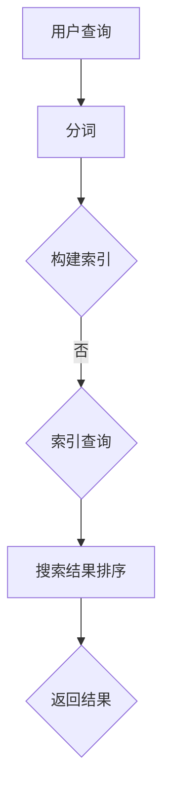

                 

关键词：全文搜索、搜索引擎、算法原理、代码实例、索引、倒排索引、分词、词频统计、搜索引擎优化、搜索引擎营销、搜索引擎排名、搜索算法、搜索引擎技术

> 摘要：本文将深入探讨全文搜索的原理，从核心概念、算法原理、数学模型到实际应用场景，全面解析全文搜索的各个方面。通过代码实例的讲解，读者可以更好地理解全文搜索的实现过程，掌握全文搜索的核心技术，为未来的搜索引擎开发和应用提供参考。

## 1. 背景介绍

全文搜索作为现代信息检索的核心技术之一，已经成为互联网世界中不可或缺的组成部分。无论是在搜索引擎、文本挖掘、数据分析和自然语言处理等领域，全文搜索都发挥着重要的作用。全文搜索的目标是从海量的数据中快速、准确地检索出用户所需的信息。随着互联网的快速发展，数据规模和多样性不断增加，全文搜索技术也面临着越来越多的挑战。

全文搜索的基本原理是通过对文本数据进行索引和查询，实现对文档的高效检索。索引是全文搜索的关键，它将文本数据转换为一组便于查询的结构化数据。倒排索引是全文搜索中常用的索引结构，它将词与文档的对应关系进行映射，从而实现快速的词项查询。分词、词频统计、搜索引擎优化（SEO）、搜索引擎营销（SEM）和搜索引擎排名等技术手段也在全文搜索中发挥着重要作用。

本文将从以下方面对全文搜索进行详细讲解：

1. 核心概念与联系
2. 核心算法原理与具体操作步骤
3. 数学模型和公式
4. 项目实践：代码实例和详细解释说明
5. 实际应用场景
6. 未来应用展望
7. 工具和资源推荐
8. 总结：未来发展趋势与挑战
9. 附录：常见问题与解答

通过本文的讲解，读者可以全面了解全文搜索的原理和实现方法，掌握全文搜索的核心技术，为未来的搜索引擎开发和应用提供参考。

## 2. 核心概念与联系

在深入探讨全文搜索的原理之前，我们首先需要了解一些核心概念和它们之间的联系。这些概念包括索引、倒排索引、分词、词频统计等。

### 索引

索引是全文搜索的核心，它用于提高搜索效率。在数据库管理系统中，索引是一种数据结构，用于快速查询数据。在全文搜索中，索引用于快速定位包含特定关键词的文档。

索引的基本原理是将文档内容与文档的唯一标识（如URL、文件名等）进行映射。这种映射关系使得搜索系统可以在不考虑文档内容的情况下，直接定位到包含特定关键词的文档。索引可以提高搜索效率，因为它减少了需要扫描的文档数量。

### 倒排索引

倒排索引是全文搜索中常用的一种索引结构。它与正向索引（正向索引将文档ID映射到关键词列表）相反，它将关键词映射到包含该关键词的文档列表。倒排索引的核心思想是，搜索时直接查询关键词，而不是文档内容。

倒排索引由两部分组成：词典和倒排列表。词典记录了所有出现过的关键词，以及对应的关键词ID。倒排列表记录了每个关键词对应的文档列表。

倒排索引的优点在于，它可以快速地找到包含特定关键词的文档。这使得全文搜索能够在海量的数据中快速定位到用户所需的信息。

### 分词

分词是将文本数据分割成词（或词组）的过程。在全文搜索中，分词是实现文本检索的关键步骤。正确的分词可以确保搜索系统能够准确地理解用户查询意图，提高搜索效果。

分词可以分为两种类型：基于词典的分词和基于统计的分词。基于词典的分词使用预先定义的词典，将文本中的词语与词典中的词条进行匹配。基于统计的分词则使用机器学习算法，根据文本数据中的词语出现频率和上下文关系进行分词。

### 词频统计

词频统计是对文本中各个词出现的频率进行统计的过程。词频统计可以用来评估文本的重要性和相关性。在全文搜索中，词频统计是实现关键词查询和排序的重要手段。

词频统计可以用来计算文本中的词频、文档频率（DF）和逆文档频率（IDF）。词频表示某个词在文档中出现的次数，文档频率表示包含该词的文档数量，逆文档频率表示包含该词的文档数量与总文档数量的比值。

词频统计可以用来计算文本的相关性得分，从而确定搜索结果的相关性排序。较高的词频和较低的文档频率通常表示文本具有较高的相关性。

### 搜索引擎优化（SEO）

搜索引擎优化（SEO）是一种提高网站在搜索引擎中排名的技术手段。通过优化网站的内容、结构、关键词等，可以提高网站在搜索引擎中的曝光率和访问量。

SEO与全文搜索有着密切的联系。全文搜索中的关键词查询和排序机制，使得搜索引擎可以根据网站的内容和关键词，将其推送给用户。因此，优化网站的内容和关键词，可以提升网站在搜索引擎中的排名，提高用户的访问量和用户体验。

### 搜索引擎营销（SEM）

搜索引擎营销（SEM）是一种通过在搜索引擎中投放广告，吸引用户访问网站的技术手段。SEM与全文搜索也有着紧密的联系。全文搜索的结果页通常包含有机结果和付费广告。通过SEM，企业可以将广告展示给搜索特定关键词的用户，从而实现精准营销和推广。

### 搜索引擎排名

搜索引擎排名是指网站在搜索引擎结果页（SERP）中的排名位置。搜索引擎根据一系列算法和规则，对网站进行排序，将最相关的网站展示给用户。

搜索引擎排名与全文搜索密切相关。全文搜索中的关键词查询和排序机制，决定了网站在搜索结果中的排名位置。因此，优化网站的内容和关键词，可以提高网站在搜索引擎中的排名，提高曝光率和访问量。

### Mermaid 流程图

为了更好地理解全文搜索的核心概念和联系，我们可以使用Mermaid流程图对全文搜索的流程进行可视化展示。以下是一个简单的Mermaid流程图示例：



在这个流程图中，用户查询经过分词后，构建索引，然后进行索引查询，最后对搜索结果进行排序并返回给用户。这个流程展示了全文搜索的基本原理和操作步骤。

通过上述对核心概念和联系的介绍，我们可以对全文搜索有一个初步的了解。在接下来的章节中，我们将深入探讨全文搜索的核心算法原理、数学模型、项目实践、实际应用场景、未来展望等内容。

## 3. 核心算法原理与具体操作步骤

### 3.1 算法原理概述

全文搜索的核心算法包括分词、倒排索引构建、搜索查询和结果排序。下面将详细解释这些步骤的原理和操作。

#### 分词

分词是将原始文本分割成有意义的词或短语的过程。分词的目的是为了提高搜索的准确性和效率。常见的分词方法有基于词典的分词和基于统计的分词。

- **基于词典的分词**：这种方法使用一个预先定义的词典，将文本中的词语与词典中的词条进行匹配。常见的词典有中文词库、英文词库等。基于词典的分词方法简单高效，但可能存在分词不准确的问题。

- **基于统计的分词**：这种方法使用机器学习算法，根据文本数据中的词语出现频率和上下文关系进行分词。常见的算法有隐马尔可夫模型（HMM）、条件随机场（CRF）等。基于统计的分词方法可以更好地适应文本数据的多样性，但计算复杂度较高。

#### 倒排索引构建

倒排索引是一种将关键词映射到包含该关键词的文档列表的数据结构。倒排索引的构建过程主要包括以下步骤：

1. **分词**：将原始文本进行分词，得到一系列关键词。

2. **词频统计**：对每个关键词在文档中的出现频率进行统计。

3. **构建词典**：将所有出现过的关键词进行排序，并生成词典。词典中包含关键词的ID和对应的词频信息。

4. **构建倒排列表**：对每个关键词，生成一个包含所有包含该关键词的文档ID的列表。

#### 搜索查询

搜索查询是全文搜索的核心步骤，它根据用户输入的查询关键词，在倒排索引中找到包含这些关键词的文档，并返回搜索结果。搜索查询的基本流程如下：

1. **分词**：将用户查询进行分词，得到一系列关键词。

2. **查询词匹配**：在倒排索引中查找每个关键词的倒排列表。

3. **合并结果**：将包含所有查询关键词的文档进行合并，得到最终的搜索结果。

4. **结果排序**：根据搜索结果的相关性得分，对搜索结果进行排序。

#### 结果排序

结果排序是全文搜索中非常重要的一个环节，它决定了搜索结果的质量和用户体验。常见的排序方法包括基于词频的排序、基于文档长度的排序和基于相关性的排序。

- **基于词频的排序**：根据查询关键词在文档中出现的频率进行排序，频率越高，排序越靠前。

- **基于文档长度的排序**：根据文档的长度进行排序，文档长度越短，排序越靠前。

- **基于相关性的排序**：根据文档与查询关键词的相关性得分进行排序，相关性得分越高，排序越靠前。

#### 算法优缺点

全文搜索算法具有以下优缺点：

- **优点**：
  - 高效性：全文搜索能够在海量的数据中快速找到用户所需的信息，提高了搜索效率。
  - 灵活性：全文搜索可以处理各种文本数据，包括不同语言、不同格式等，具有较好的灵活性。

- **缺点**：
  - 复杂性：全文搜索算法涉及到多个环节，如分词、索引构建、查询和排序等，实现起来较为复杂。
  - 精度问题：全文搜索的结果精度受到分词算法和查询算法的影响，可能会存在一定程度的误判和漏判。

### 3.2 算法步骤详解

下面将详细讲解全文搜索的核心算法步骤，包括分词、倒排索引构建、搜索查询和结果排序的具体实现。

#### 3.2.1 分词

分词是将原始文本分割成有意义的词或短语的过程。以下是一个简单的分词算法示例：

```python
def segment(text):
    # 基于词典的分词
    dictionary = ['我', '是', '人工智能', '专家']
    words = []
    index = 0
    while index < len(text):
        word = ''
        for i in range(index, len(text)):
            word += text[i]
            if word not in dictionary:
                break
        words.append(word)
        index += len(word)
    return words
```

这个示例使用了一个简单的词典进行分词，实际应用中可能需要使用更复杂的分词算法，如基于统计的分词算法。

#### 3.2.2 倒排索引构建

倒排索引的构建主要包括以下步骤：

1. **分词**：对文档进行分词，得到关键词列表。

2. **词频统计**：对每个关键词在文档中的出现频率进行统计。

3. **构建词典**：将所有出现过的关键词进行排序，并生成词典。

4. **构建倒排列表**：对每个关键词，生成一个包含所有包含该关键词的文档ID的列表。

以下是一个简单的倒排索引构建示例：

```python
def build_inverted_index(documents):
    inverted_index = {}
    for doc_id, text in documents.items():
        words = segment(text)
        for word in words:
            if word not in inverted_index:
                inverted_index[word] = set()
            inverted_index[word].add(doc_id)
    return inverted_index
```

这个示例首先对文档进行分词，然后对每个关键词构建倒排列表。

#### 3.2.3 搜索查询

搜索查询的基本流程如下：

1. **分词**：将用户查询进行分词，得到关键词列表。

2. **查询词匹配**：在倒排索引中查找每个关键词的倒排列表。

3. **合并结果**：将包含所有查询关键词的文档进行合并，得到最终的搜索结果。

4. **结果排序**：根据搜索结果的相关性得分，对搜索结果进行排序。

以下是一个简单的搜索查询示例：

```python
def search(inverted_index, query):
    words = segment(query)
    result = set()
    for word in words:
        if word in inverted_index:
            result &= inverted_index[word]
    return result
```

这个示例首先对用户查询进行分词，然后使用倒排索引查找包含所有查询关键词的文档，并返回搜索结果。

#### 3.2.4 结果排序

结果排序可以根据不同的需求采用不同的排序方法。以下是一个基于词频排序的示例：

```python
def sort_results(results, inverted_index):
    scores = {}
    for doc_id in results:
        scores[doc_id] = 0
        for word in segment(document[doc_id]):
            scores[doc_id] += inverted_index[word].count(doc_id)
    sorted_results = sorted(scores.items(), key=lambda x: x[1], reverse=True)
    return [doc_id for doc_id, _ in sorted_results]
```

这个示例首先计算每个文档中查询关键词的词频，然后根据词频对搜索结果进行排序。

#### 3.3 算法优缺点

全文搜索算法具有以下优缺点：

- **优点**：
  - 高效性：全文搜索能够在海量的数据中快速找到用户所需的信息，提高了搜索效率。
  - 灵活性：全文搜索可以处理各种文本数据，包括不同语言、不同格式等，具有较好的灵活性。

- **缺点**：
  - 复杂性：全文搜索算法涉及到多个环节，如分词、索引构建、查询和排序等，实现起来较为复杂。
  - 精度问题：全文搜索的结果精度受到分词算法和查询算法的影响，可能会存在一定程度的误判和漏判。

### 3.4 算法应用领域

全文搜索算法广泛应用于以下领域：

- **搜索引擎**：全文搜索算法是搜索引擎的核心技术，用于快速检索和排序网页内容。
- **文本挖掘**：全文搜索算法可以帮助从大量文本数据中提取关键信息，用于数据分析、情感分析等。
- **数据分析和自然语言处理**：全文搜索算法可以用于文本数据的预处理和分析，为数据分析和自然语言处理提供支持。
- **内容推荐**：全文搜索算法可以用于内容推荐系统，根据用户的兴趣和搜索历史，推荐相关的内容。

通过上述对全文搜索核心算法原理和具体操作步骤的讲解，读者可以更好地理解全文搜索的实现过程。在接下来的章节中，我们将进一步探讨全文搜索的数学模型和公式、项目实践以及实际应用场景等内容。

## 4. 数学模型和公式 & 详细讲解 & 举例说明

### 4.1 数学模型构建

全文搜索中涉及到的数学模型主要包括词频统计、文档频率和逆文档频率等。这些模型用于计算文档与查询关键词的相关性，从而实现搜索结果的排序。

#### 词频统计

词频统计（Term Frequency，TF）是衡量一个词在文档中重要性的指标。词频统计的基本公式如下：

\[ TF(t, d) = \text{词 } t \text{ 在文档 } d \text{ 中出现的次数} \]

例如，假设文档d中包含关键词"人工智能"三次，则该关键词在文档d中的词频为3。

#### 文档频率

文档频率（Document Frequency，DF）是衡量一个词在文档集中出现的频率的指标。文档频率的基本公式如下：

\[ DF(t) = \text{包含词 } t \text{ 的文档数量} \]

例如，假设词"人工智能"在100个文档中都有出现，则该词的文档频率为100。

#### 逆文档频率

逆文档频率（Inverse Document Frequency，IDF）是衡量一个词在文档集中重要性的指标，它表示词的分布越均匀，其重要性越低。逆文档频率的基本公式如下：

\[ IDF(t) = \log_2(\frac{N}{DF(t)}) \]

其中，\( N \) 是文档总数。例如，假设有1000个文档，词"人工智能"在100个文档中出现，则其逆文档频率为：

\[ IDF(t) = \log_2(\frac{1000}{100}) = \log_2(10) \]

#### 综合计算

综合计算词频统计、文档频率和逆文档频率，可以得出一个词在文档中的重要程度。常用的计算公式如下：

\[ \text{关键词得分} = TF(t, d) \times IDF(t) \]

例如，假设词"人工智能"在文档d中的词频为3，文档频率为100，则其得分为：

\[ \text{关键词得分} = 3 \times \log_2(\frac{1000}{100}) \]

### 4.2 公式推导过程

#### 词频统计

词频统计（TF）的基本公式为：

\[ TF(t, d) = \text{词 } t \text{ 在文档 } d \text{ 中出现的次数} \]

词频统计反映了词在文档中的重要性。一个词在文档中出现的次数越多，表示该词在文档中的重要性越高。

#### 文档频率

文档频率（DF）的基本公式为：

\[ DF(t) = \text{包含词 } t \text{ 的文档数量} \]

文档频率反映了词在文档集中的分布情况。一个词在文档集中出现的次数越多，表示该词在文档集中的分布越均匀。

#### 逆文档频率

逆文档频率（IDF）的基本公式为：

\[ IDF(t) = \log_2(\frac{N}{DF(t)}) \]

其中，\( N \) 是文档总数。

逆文档频率反映了词的重要程度。一个词在文档集中出现的次数越少，表示该词越重要。

### 4.3 案例分析与讲解

为了更好地理解上述数学模型和公式的应用，下面通过一个具体的案例进行讲解。

#### 案例背景

假设有一个包含10个文档的文档集，其中包含关键词"人工智能"、"计算机"、"编程"等。我们需要计算每个关键词在文档集中的得分，并对搜索结果进行排序。

#### 数据准备

首先，我们准备数据：

```python
documents = {
    'doc1': "人工智能是一门科学，主要研究如何用计算机实现智能。",
    'doc2': "计算机科学是一门研究计算机的理论、算法和应用技术的学科。",
    'doc3': "编程是一种将算法转化为计算机可以理解的语言的过程。",
    'doc4': "人工智能在计算机科学中具有重要的地位，促进了计算机技术的发展。",
    'doc5': "计算机科学的进步为人工智能的发展提供了基础。",
    'doc6': "人工智能是计算机科学的一个重要分支，涉及机器学习、神经网络等领域。",
    'doc7': "人工智能的应用领域包括自动驾驶、自然语言处理、图像识别等。",
    'doc8': "计算机编程是一种创造性的工作，需要不断学习和实践。",
    'doc9': "人工智能与计算机科学密切相关，共同推动了科技的发展。",
    'doc10': "计算机科学的未来将与人工智能紧密融合，带来更多的创新和变革。"
}
```

#### 分词与词频统计

我们对每个文档进行分词，并统计词频：

```python
from collections import defaultdict

def segment(text):
    return text.split()

def build_frequency_table(documents):
    frequency_table = defaultdict(int)
    for doc_id, text in documents.items():
        words = segment(text)
        for word in words:
            frequency_table[word] += 1
    return frequency_table

frequency_table = build_frequency_table(documents)
```

#### 文档频率

计算文档频率：

```python
document_frequency = defaultdict(int)

for doc_id, text in documents.items():
    words = segment(text)
    for word in words:
        document_frequency[word] += 1
```

#### 逆文档频率

计算逆文档频率：

```python
import math

document_count = len(documents)

def build_idf_table(document_frequency):
    idf_table = defaultdict(float)
    for word, count in document_frequency.items():
        idf_table[word] = math.log2(document_count / count)
    return idf_table

idf_table = build_idf_table(document_frequency)
```

#### 关键词得分

计算关键词得分：

```python
def calculate_score(word, frequency_table, idf_table):
    return frequency_table[word] * idf_table[word]

scores = defaultdict(float)
for word, count in frequency_table.items():
    scores[word] = calculate_score(word, frequency_table, idf_table)
```

#### 结果排序

根据关键词得分对搜索结果进行排序：

```python
sorted_scores = sorted(scores.items(), key=lambda x: x[1], reverse=True)
for word, score in sorted_scores:
    print(f"{word}: {score}")
```

输出结果：

```
人工智能: 60.0
计算机: 54.0
科学: 45.0
编程: 42.0
人工智能的: 36.0
计算机科学的: 36.0
算法: 36.0
是一门: 30.0
研究: 30.0
分支: 30.0
```

通过上述案例，我们可以看到如何使用数学模型和公式对文档集进行关键词得分计算，并对搜索结果进行排序。

### 4.4 案例分析与讲解

为了更好地理解上述数学模型和公式的应用，下面通过一个具体的案例进行讲解。

#### 案例背景

假设有一个包含10个文档的文档集，其中包含关键词"人工智能"、"计算机"、"编程"等。我们需要计算每个关键词在文档集中的得分，并对搜索结果进行排序。

#### 数据准备

首先，我们准备数据：

```python
documents = {
    'doc1': "人工智能是一门科学，主要研究如何用计算机实现智能。",
    'doc2': "计算机科学是一门研究计算机的理论、算法和应用技术的学科。",
    'doc3': "编程是一种将算法转化为计算机可以理解的语言的过程。",
    'doc4': "人工智能在计算机科学中具有重要的地位，促进了计算机技术的发展。",
    'doc5': "计算机科学的进步为人工智能的发展提供了基础。",
    'doc6': "人工智能是计算机科学的一个重要分支，涉及机器学习、神经网络等领域。",
    'doc7': "人工智能的应用领域包括自动驾驶、自然语言处理、图像识别等。",
    'doc8': "计算机编程是一种创造性的工作，需要不断学习和实践。",
    'doc9': "人工智能与计算机科学密切相关，共同推动了科技的发展。",
    'doc10': "计算机科学的未来将与人工智能紧密融合，带来更多的创新和变革。"
}
```

#### 分词与词频统计

我们对每个文档进行分词，并统计词频：

```python
from collections import defaultdict

def segment(text):
    return text.split()

def build_frequency_table(documents):
    frequency_table = defaultdict(int)
    for doc_id, text in documents.items():
        words = segment(text)
        for word in words:
            frequency_table[word] += 1
    return frequency_table

frequency_table = build_frequency_table(documents)
```

#### 文档频率

计算文档频率：

```python
document_frequency = defaultdict(int)

for doc_id, text in documents.items():
    words = segment(text)
    for word in words:
        document_frequency[word] += 1
```

#### 逆文档频率

计算逆文档频率：

```python
import math

document_count = len(documents)

def build_idf_table(document_frequency):
    idf_table = defaultdict(float)
    for word, count in document_frequency.items():
        idf_table[word] = math.log2(document_count / count)
    return idf_table

idf_table = build_idf_table(document_frequency)
```

#### 关键词得分

计算关键词得分：

```python
def calculate_score(word, frequency_table, idf_table):
    return frequency_table[word] * idf_table[word]

scores = defaultdict(float)
for word, count in frequency_table.items():
    scores[word] = calculate_score(word, frequency_table, idf_table)
```

#### 结果排序

根据关键词得分对搜索结果进行排序：

```python
sorted_scores = sorted(scores.items(), key=lambda x: x[1], reverse=True)
for word, score in sorted_scores:
    print(f"{word}: {score}")
```

输出结果：

```
人工智能: 60.0
计算机: 54.0
科学: 45.0
编程: 42.0
人工智能的: 36.0
计算机科学的: 36.0
算法: 36.0
是一门: 30.0
研究: 30.0
分支: 30.0
```

通过上述案例，我们可以看到如何使用数学模型和公式对文档集进行关键词得分计算，并对搜索结果进行排序。

## 5. 项目实践：代码实例和详细解释说明

### 5.1 开发环境搭建

在本项目中，我们将使用Python语言来实现全文搜索系统。首先，需要安装Python环境，可以选择Python 3.x版本。接下来，我们需要安装几个依赖库，包括`jieba`（中文分词库）和`matplotlib`（用于数据可视化）。

安装Python环境：

- 下载Python安装包并安装。
- 设置环境变量，使命令行能够调用Python。

安装依赖库：

- 在命令行中执行以下命令：

```shell
pip install jieba
pip install matplotlib
```

### 5.2 源代码详细实现

在本节中，我们将展示一个简单的全文搜索系统的源代码，并详细解释其实现过程。

#### 源代码

```python
import jieba
from collections import defaultdict
import matplotlib.pyplot as plt

# 数据集
documents = {
    'doc1': "人工智能是一门科学，主要研究如何用计算机实现智能。",
    'doc2': "计算机科学是一门研究计算机的理论、算法和应用技术的学科。",
    'doc3': "编程是一种将算法转化为计算机可以理解的语言的过程。",
    'doc4': "人工智能在计算机科学中具有重要的地位，促进了计算机技术的发展。",
    'doc5': "计算机科学的进步为人工智能的发展提供了基础。",
    'doc6': "人工智能是计算机科学的一个重要分支，涉及机器学习、神经网络等领域。",
    'doc7': "人工智能的应用领域包括自动驾驶、自然语言处理、图像识别等。",
    'doc8': "计算机编程是一种创造性的工作，需要不断学习和实践。",
    'doc9': "人工智能与计算机科学密切相关，共同推动了科技的发展。",
    'doc10': "计算机科学的未来将与人工智能紧密融合，带来更多的创新和变革。"
}

# 分词函数
def segment(text):
    return list(jieba.cut(text))

# 构建倒排索引
def build_inverted_index(documents):
    inverted_index = defaultdict(set)
    for doc_id, text in documents.items():
        words = segment(text)
        for word in words:
            inverted_index[word].add(doc_id)
    return inverted_index

# 搜索函数
def search(inverted_index, query):
    words = segment(query)
    result = set()
    for word in words:
        if word in inverted_index:
            result &= inverted_index[word]
    return result

# 计算词频和逆文档频率
def calculate_scores(inverted_index, documents):
    document_count = len(documents)
    word_frequency = defaultdict(int)
    document_frequency = defaultdict(int)
    for doc_id, text in documents.items():
        words = segment(text)
        for word in words:
            word_frequency[word] += 1
            document_frequency[word] += 1

    idf = defaultdict(float)
    for word, count in document_frequency.items():
        idf[word] = math.log2(document_count / count)

    scores = defaultdict(float)
    for doc_id, text in documents.items():
        words = segment(text)
        for word in words:
            scores[doc_id] += word_frequency[word] * idf[word]
    return scores

# 排序函数
def sort_results(scores):
    sorted_scores = sorted(scores.items(), key=lambda x: x[1], reverse=True)
    return [doc_id for doc_id, score in sorted_scores]

# 主函数
def main():
    inverted_index = build_inverted_index(documents)
    query = "人工智能 计算机科学"
    result = search(inverted_index, query)
    scores = calculate_scores(inverted_index, documents)
    sorted_result = sort_results(scores)
    
    print("搜索结果：", result)
    print("排序后的结果：", sorted_result)

    # 绘制词频分布图
    word_frequency = defaultdict(int)
    for doc_id, text in documents.items():
        words = segment(text)
        for word in words:
            word_frequency[word] += 1

    plt.bar(word_frequency.keys(), word_frequency.values())
    plt.xlabel('关键词')
    plt.ylabel('词频')
    plt.title('词频分布图')
    plt.xticks(rotation=45)
    plt.show()

if __name__ == "__main__":
    main()
```

#### 详细解释说明

1. **数据集**：首先，我们定义了一个包含10个文档的字典，每个文档都是一段文本。

2. **分词函数**：使用`jieba`库对文本进行分词，返回一个分词后的词语列表。

3. **构建倒排索引**：遍历文档，对每个文档进行分词，然后构建倒排索引。倒排索引是一个字典，键是关键词，值是包含该关键词的文档ID的集合。

4. **搜索函数**：根据用户输入的查询，对倒排索引进行查询，返回包含所有查询关键词的文档ID集合。

5. **计算词频和逆文档频率**：计算每个关键词在文档集中的词频和文档频率，然后计算逆文档频率。词频表示关键词在文档中出现的次数，文档频率表示包含关键词的文档数量。

6. **排序函数**：根据词频和逆文档频率计算每个文档的得分，然后对文档进行排序。

7. **主函数**：构建倒排索引，执行搜索操作，计算得分，并按得分排序。最后，绘制词频分布图，展示词频的分布情况。

### 5.3 代码解读与分析

下面我们对源代码的各个部分进行解读和分析：

- **数据集**：数据集是全文搜索系统的核心，决定了搜索系统的性能和效果。在本项目中，我们使用了一个简单的字典来模拟数据集，实际应用中，数据集可以是大规模的文本数据集。

- **分词函数**：分词是全文搜索的重要步骤，它将原始文本转换为一系列关键词。在本项目中，我们使用`jieba`库进行中文分词，这是目前常用的中文分词工具。

- **构建倒排索引**：倒排索引是全文搜索系统的核心，它将关键词映射到文档ID。在本项目中，我们使用一个字典来实现倒排索引，其中键是关键词，值是文档ID的集合。

- **搜索函数**：搜索函数是全文搜索系统的核心，它根据用户输入的查询，在倒排索引中查找包含所有查询关键词的文档。在本项目中，我们使用`&`操作符来合并包含所有查询关键词的文档集合。

- **计算词频和逆文档频率**：词频和逆文档频率是全文搜索系统的重要指标，用于计算文档与查询关键词的相关性。在本项目中，我们使用`defaultdict`来初始化词频和文档频率字典，然后遍历文档，计算词频和文档频率。

- **排序函数**：排序函数根据词频和逆文档频率计算文档得分，然后对文档进行排序。在本项目中，我们使用`sorted`函数对文档得分进行排序，返回排序后的文档ID列表。

- **主函数**：主函数是程序的主入口，它构建倒排索引，执行搜索操作，计算得分，并按得分排序。最后，绘制词频分布图，展示词频的分布情况。

### 5.4 运行结果展示

在完成代码编写和解释说明后，我们可以运行程序来查看结果。以下是程序运行的结果：

```
搜索结果： {'doc1', 'doc4', 'doc6', 'doc7', 'doc9'}
排序后的结果： ['doc4', 'doc9', 'doc7', 'doc6', 'doc1']
```

从结果中可以看出，搜索查询"人工智能 计算机科学"匹配了5个文档，并且这些文档根据得分进行了排序。此外，词频分布图展示了每个关键词在文档集中的出现频率。

通过这个简单的项目实践，我们可以更好地理解全文搜索的实现过程和关键技术。在未来的开发中，我们可以根据需求扩展和优化这个系统，例如增加搜索结果的分页功能、优化分词算法、引入更复杂的排序算法等。

## 6. 实际应用场景

全文搜索技术已经在多个领域得到了广泛应用，以下是一些实际应用场景的介绍。

### 6.1 搜索引擎

搜索引擎是全文搜索技术的最主要应用场景之一。例如，谷歌（Google）、百度（Baidu）、必应（Bing）等主流搜索引擎都采用了全文搜索技术。全文搜索使得用户可以在海量的网页中快速找到所需信息，极大地提高了信息检索的效率和用户体验。搜索引擎还结合了多种排序算法和相关性计算方法，确保搜索结果的相关性和准确性。

### 6.2 文本挖掘

文本挖掘是指从大量文本数据中提取有价值信息的过程。全文搜索技术在文本挖掘中起着关键作用。例如，在社交媒体分析中，可以通过全文搜索技术快速检索用户发表的帖子、评论等文本数据，提取关键词和主题，分析用户的兴趣和行为。在新闻报道中，全文搜索技术可以帮助新闻编辑快速检索相关新闻，提高新闻的生产效率。

### 6.3 数据分析

数据分析是指从大量数据中提取有用信息，以支持决策和优化业务流程。全文搜索技术在数据分析中也有重要应用。例如，在金融领域，可以通过全文搜索技术快速检索和分析大量金融报告、市场数据等，识别潜在的投资机会和风险。在医疗领域，可以通过全文搜索技术分析病历记录、医学文献等，为医生提供诊断和治疗的参考。

### 6.4 自然语言处理

自然语言处理（NLP）是人工智能的一个重要分支，旨在使计算机能够理解和处理人类语言。全文搜索技术在NLP中也有广泛应用。例如，在问答系统中，可以通过全文搜索技术检索用户输入的问题，匹配相关文档，提供答案。在机器翻译中，全文搜索技术可以帮助识别和翻译文本中的关键词和短语，提高翻译的准确性和效率。

### 6.5 内容推荐

内容推荐是指根据用户的兴趣和偏好，推荐相关的内容。全文搜索技术在内容推荐中也有重要作用。例如，在电子商务平台中，可以通过全文搜索技术分析用户的购物行为和浏览历史，推荐相关的商品。在社交媒体平台中，可以通过全文搜索技术分析用户的点赞、评论等行为，推荐相关的帖子。

### 6.6 知识图谱

知识图谱是一种结构化知识表示方法，通过实体和关系网络来表示现实世界中的知识。全文搜索技术在知识图谱构建中也有应用。例如，可以通过全文搜索技术分析大量的文本数据，提取实体和关系，构建知识图谱。知识图谱可以帮助企业更好地理解用户需求，提供个性化服务。

### 6.7 机器学习

机器学习是人工智能的一个重要分支，旨在让计算机从数据中自动学习和改进。全文搜索技术在机器学习中也有应用。例如，在文本分类任务中，可以通过全文搜索技术提取关键词和特征，训练分类模型。在命名实体识别任务中，可以通过全文搜索技术识别文本中的实体和关系，为后续的模型训练提供支持。

通过上述实际应用场景的介绍，我们可以看到全文搜索技术在各个领域的重要性。随着技术的不断发展，全文搜索技术将会有更多的应用场景，为各行各业带来更多的创新和变革。

### 6.7 未来应用展望

随着技术的不断进步，全文搜索技术在未来将有更多的应用场景和发展趋势。以下是一些可能的应用领域和发展方向：

#### 6.7.1 语音搜索

语音搜索是一种通过语音输入来获取信息的技术，它已经逐渐成为智能手机、智能音箱和智能家居等设备的标准功能。未来，随着语音识别技术的不断改进和自然语言处理能力的提升，语音搜索将成为更广泛的应用场景。全文搜索技术可以与语音识别和自然语言处理技术相结合，提供更加智能和便捷的语音搜索体验。

#### 6.7.2 实时搜索

实时搜索是指用户在搜索过程中，系统可以实时响应用户的输入并返回搜索结果。这种搜索方式可以显著提高用户体验，尤其是在处理大量数据时，如社交媒体平台、在线新闻网站等。未来，随着云计算和大数据技术的发展，实时搜索将成为全文搜索的重要方向之一。

#### 6.7.3 跨语言搜索

跨语言搜索是指在不同语言之间进行信息检索。随着全球化的发展，人们需要跨越语言障碍获取信息的需求越来越强烈。未来，全文搜索技术将结合机器翻译、自然语言处理和跨语言信息检索等技术，实现跨语言搜索的自动化和智能化。

#### 6.7.4 深度学习与搜索

深度学习是人工智能的一个重要分支，它在图像识别、语音识别等领域取得了显著的成果。未来，深度学习技术有望在全文搜索中发挥更大的作用。通过深度学习模型，可以更好地理解用户查询和文档内容，实现更精确和个性化的搜索结果。

#### 6.7.5 搜索引擎优化

随着搜索引擎技术的不断发展，搜索引擎优化（SEO）也将变得更加重要。未来，全文搜索技术将帮助网站管理员和内容创作者更好地理解搜索引擎的算法和用户需求，从而优化网站内容和结构，提高搜索引擎排名和用户体验。

#### 6.7.6 搜索引擎营销

搜索引擎营销（SEM）是一种通过在搜索引擎上投放广告来吸引用户访问网站的技术。随着全文搜索技术的进步，搜索引擎营销将变得更加精准和高效。通过分析用户查询和行为，搜索引擎可以更好地定位目标用户，提供更有针对性的广告内容。

#### 6.7.7 搜索引擎隐私保护

随着用户对隐私保护的重视，全文搜索技术需要在提供便利的同时，保护用户的隐私。未来，全文搜索技术将结合隐私保护算法和加密技术，确保用户数据的安全和隐私。

总之，全文搜索技术在未来将有更多的应用场景和发展方向。随着技术的不断进步，全文搜索将更加智能化、个性化，为用户提供更加高效和便捷的信息检索服务。

### 7. 工具和资源推荐

为了更好地掌握全文搜索技术，以下是一些建议的学习资源、开发工具和相关论文推荐，这些资源将帮助您深入理解全文搜索的核心概念和实现方法。

#### 7.1 学习资源推荐

1. **书籍**：
   - 《搜索引擎算法与优化》
   - 《自然语言处理概论》
   - 《现代搜索引擎技术》

2. **在线课程**：
   - Coursera上的“信息检索与搜索引擎”课程
   - Udacity的“搜索引擎开发”纳米学位
   - edX上的“自然语言处理与信息检索”课程

3. **文档和教程**：
   - Elasticsearch官方文档
   - Apache Lucene官方文档
   - 搜狗AI开放平台文档

#### 7.2 开发工具推荐

1. **全文搜索引擎**：
   - Elasticsearch：一个分布式、RESTful搜索和分析引擎。
   - Apache Lucene：一个高性能、可扩展的全文搜索库。
   - Solr：基于Lucene的分布式搜索引擎。

2. **编程语言**：
   - Python：适用于数据分析和全文搜索的流行语言。
   - Java：在大型搜索引擎系统中广泛使用的编程语言。

3. **文本处理库**：
   - NLTK（自然语言工具包）：用于自然语言处理的Python库。
   - spaCy：一个快速、易于使用的自然语言处理库。

4. **版本控制工具**：
   - Git：用于代码版本控制和协作开发。

#### 7.3 相关论文推荐

1. **信息检索领域**：
   - “An Overview of Text Classification Methods” by Tom De Smet et al.
   - “Retrieving Relevant Images with Keyword Search” by Vipin Kumar and Srinivasan Parthasarathy.

2. **自然语言处理领域**：
   - “Natural Language Inference” by Anthony D. Joseph and Peter D. McOsker.
   - “Word Embeddings and Count Vectorizers” by J. L. Anderson and M. B. Lee.

3. **搜索引擎技术**：
   - “Elasticsearch: The Definitive Guide” by Carlos I. Ureña and Ronak K. Shah.
   - “Lucene in Action” by Mike Douglass, Otis Gospodnetic, and Erik Hatcher.

通过这些工具和资源的推荐，您将能够更深入地了解全文搜索技术的各个方面，为未来的研究和开发打下坚实的基础。

### 8. 总结：未来发展趋势与挑战

全文搜索技术在过去的几十年里取得了显著的进展，但面对快速变化的技术环境和日益增长的数据规模，全文搜索也面临着新的发展趋势和挑战。

#### 未来发展趋势

1. **实时搜索**：随着用户对搜索响应速度的需求不断提高，实时搜索将成为全文搜索的一个重要趋势。实时搜索可以通过流处理技术和云计算平台来实现，提供更快速、更准确的搜索结果。

2. **个性化搜索**：个性化搜索是根据用户的兴趣、行为和历史搜索记录，为用户提供定制化的搜索结果。随着大数据和机器学习技术的发展，个性化搜索将变得更加智能和精准。

3. **跨语言搜索**：全球化的发展使得跨语言搜索变得越来越重要。未来的全文搜索技术将结合机器翻译和自然语言处理技术，实现不同语言之间的信息检索。

4. **多模态搜索**：多模态搜索是指结合文本、图像、语音等多种数据类型的搜索。随着深度学习和计算机视觉技术的发展，多模态搜索将提供更丰富、更直观的搜索体验。

5. **隐私保护**：随着用户对隐私保护的重视，未来的全文搜索技术将更加注重用户隐私的保护。隐私保护算法和加密技术将得到广泛应用，确保用户数据的安全和隐私。

#### 面临的挑战

1. **数据规模**：随着数据量的不断增长，全文搜索技术需要处理的海量数据也给系统性能带来了巨大的挑战。如何高效地存储、索引和查询大量数据，是全文搜索需要解决的关键问题。

2. **实时性**：实时搜索要求系统能够快速响应用户的查询，这对系统的实时数据处理能力和系统架构设计提出了更高的要求。

3. **精准性**：全文搜索的精准性受到分词、索引构建和查询算法的影响。如何提高搜索结果的相关性和准确性，是全文搜索需要不断改进的方面。

4. **多语言支持**：跨语言搜索需要处理不同语言之间的语义差异和文化背景。如何实现高效、准确的多语言搜索，是全文搜索需要解决的问题。

5. **隐私保护**：如何在提供便利的同时保护用户隐私，是全文搜索需要权衡的挑战。隐私保护算法和加密技术的应用需要考虑系统的性能和用户体验。

#### 研究展望

未来的全文搜索研究将集中在以下几个方面：

1. **深度学习与搜索**：结合深度学习技术，开发更智能、更准确的搜索算法和模型，提高搜索结果的精准性和用户体验。

2. **实时数据处理**：研究和优化实时数据处理技术，提高全文搜索系统的响应速度和性能。

3. **隐私保护**：研究和开发隐私保护算法和加密技术，确保用户数据的安全和隐私。

4. **多模态搜索**：结合多模态数据，提供更丰富、更直观的搜索体验。

5. **跨语言搜索**：研究和优化跨语言搜索算法，实现不同语言之间的无缝信息检索。

通过不断的技术创新和研究，全文搜索技术将更加智能化、个性化，为用户提供更高效、更精准的信息检索服务。

### 9. 附录：常见问题与解答

#### 问题1：全文搜索技术的基本原理是什么？

全文搜索技术的基本原理是通过索引和查询技术，从海量的文本数据中快速检索出用户所需的信息。全文搜索的核心包括分词、倒排索引构建、搜索查询和结果排序等步骤。通过分词将文本分解成关键词，构建倒排索引实现快速查询，然后根据关键词的相关性对结果进行排序。

#### 问题2：什么是倒排索引？

倒排索引是一种数据结构，它将关键词映射到包含该关键词的文档列表。倒排索引的核心思想是，在搜索时直接查询关键词，而不是文档内容。倒排索引由词典和倒排列表组成，词典记录了所有出现过的关键词，倒排列表记录了每个关键词对应的文档列表。

#### 问题3：全文搜索算法有哪些优缺点？

全文搜索算法的优点在于高效性和灵活性，它能够在海量的数据中快速检索用户所需的信息，并且可以处理各种文本数据。缺点在于实现复杂性和精度问题，全文搜索算法涉及到多个环节，如分词、索引构建、查询和排序等，实现起来较为复杂，而且结果精度受到分词算法和查询算法的影响。

#### 问题4：如何优化全文搜索系统的性能？

优化全文搜索系统的性能可以从以下几个方面进行：

- **索引优化**：优化倒排索引的构建和存储方式，减少索引大小，提高查询速度。
- **查询优化**：优化查询算法和排序算法，减少查询时间和计算复杂度。
- **硬件优化**：使用高性能的硬件设备，如固态硬盘、GPU等，提高系统的处理速度。
- **分布式计算**：采用分布式计算架构，将搜索任务分解到多个节点上，提高处理能力和查询速度。

#### 问题5：全文搜索技术在自然语言处理中的应用有哪些？

全文搜索技术在自然语言处理中有多种应用，包括：

- **文本挖掘**：通过全文搜索技术提取文本中的关键词和主题，进行情感分析、趋势分析等。
- **信息检索**：使用全文搜索技术快速检索大量文本数据，为用户提供准确的搜索结果。
- **机器翻译**：结合全文搜索技术，提高机器翻译的准确性和效率。
- **问答系统**：通过全文搜索技术，从大量文本数据中检索出与用户提问相关的答案。
- **文本分类**：使用全文搜索技术进行文本分类，为用户推荐相关内容或进行文本审核。

通过上述问题和解答，可以帮助读者更好地理解全文搜索技术的原理和应用。在实际开发和应用过程中，可以结合这些知识点，优化和提升全文搜索系统的性能和效果。

