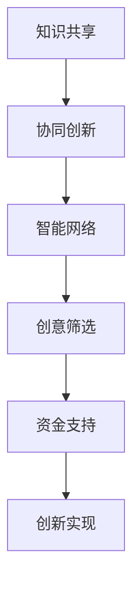

                 

关键词：全球脑、创意众筹、集体创新、人工智能、技术发展

> 摘要：本文探讨了全球脑与创意众筹在推动集体创新方面的重要作用。通过分析其核心概念、算法原理、应用领域，以及数学模型和实际项目实践，本文旨在揭示全球脑与创意众筹在当今技术发展中的巨大潜力，并提出未来可能面临的发展趋势和挑战。

## 1. 背景介绍

随着互联网和人工智能技术的快速发展，集体创新（Collective Innovation）成为推动科技进步和社会发展的重要力量。全球脑（Global Brain）的概念，则进一步扩展了集体创新的范畴，通过连接全球智慧和创意，形成了一种全新的知识共享和协同创新的模式。创意众筹（Creative Crowdsourcing）作为实现全球脑的一种有效途径，正日益受到关注。

### 全球脑的概念

全球脑，最初由硅谷思想家凯文·凯利（Kevin Kelly）提出，是指通过互联网和物联网等手段，将全球个体、组织、设备等智能实体互联，形成一个全球性的智能网络。在这个网络中，每个个体都可以贡献自己的知识和智慧，通过协同作用实现知识共享和创新。

### 创意众筹的概念

创意众筹，是指通过互联网平台，将创意项目或想法提交给广大网民，通过网民的投票、资金支持等方式，实现创意的筛选、优化和实现。创意众筹平台如Kickstarter、Indiegogo等，已经成为许多创新项目的重要融资途径。

## 2. 核心概念与联系

### 核心概念原理

全球脑与创意众筹的核心概念包括：知识共享、协同创新、智能网络、创意筛选、资金支持等。这些概念相互联系，形成一个完整的创新生态系统。

### Mermaid 流程图



### 架构设计

全球脑与创意众筹的架构设计包括：知识共享平台、智能网络平台、创意众筹平台、创新实现平台等。这些平台相互连接，形成一个完整的创新生态系统。

## 3. 核心算法原理 & 具体操作步骤

### 3.1 算法原理概述

全球脑与创意众筹的核心算法原理包括：知识共享算法、协同创新算法、智能网络算法、创意筛选算法和资金支持算法。这些算法共同作用于创意众筹过程，实现知识的共享、创新的协同、智能网络的构建、创意的筛选和资金的筹集。

### 3.2 算法步骤详解

1. **知识共享**：通过互联网平台，个体或组织将自身知识和智慧上传至全球脑知识库。
2. **协同创新**：全球脑根据知识库中的数据，运用协同创新算法，将相关知识和智慧进行整合，形成新的创意。
3. **智能网络**：智能网络算法通过分析全球脑知识库中的数据，构建一个全球性的智能网络，实现知识的快速传播和共享。
4. **创意筛选**：创意筛选算法根据创意的潜力、可行性等因素，对创意进行筛选和排序，确保优质创意能够得到关注和支持。
5. **资金支持**：资金支持算法通过分析创意项目的市场需求、投资潜力等因素，为优质创意提供资金支持，促进创新实现。

### 3.3 算法优缺点

#### 优点：

1. **高效性**：全球脑与创意众筹能够快速汇集全球智慧和创意，实现知识的共享和创新的协同。
2. **灵活性**：创意众筹平台为不同类型的创意项目提供灵活的融资方式，满足各种创新需求。
3. **开放性**：全球脑与创意众筹强调开放性，鼓励更多人参与到创新过程中，实现知识共享和创新。

#### 缺点：

1. **数据安全**：全球脑涉及大量的个人和企业数据，如何确保数据安全和隐私是一个重要问题。
2. **信任问题**：在创意众筹过程中，如何确保投资人的权益，避免欺诈和虚假项目，是一个挑战。

### 3.4 算法应用领域

全球脑与创意众筹在多个领域具有广泛的应用前景：

1. **科技创新**：通过全球脑与创意众筹，可以加速科技创新，实现新技术的快速研发和商业化。
2. **文化艺术**：创意众筹平台为艺术创作提供了新的融资途径，促进了文化艺术产业的发展。
3. **社会公益**：全球脑与创意众筹可以帮助解决社会问题，推动公益事业的发展。

## 4. 数学模型和公式

### 4.1 数学模型构建

全球脑与创意众筹的数学模型主要包括：知识共享模型、协同创新模型、智能网络模型、创意筛选模型和资金支持模型。

### 4.2 公式推导过程

1. **知识共享模型**：

   $$K(t) = K_0 + \alpha T$$

   其中，$K(t)$ 为 t 时刻的知识量，$K_0$ 为初始知识量，$\alpha$ 为知识共享速率，$T$ 为时间。

2. **协同创新模型**：

   $$I(t) = I_0 + \beta K(t)$$

   其中，$I(t)$ 为 t 时刻的创新量，$I_0$ 为初始创新量，$\beta$ 为协同创新速率。

3. **智能网络模型**：

   $$N(t) = N_0 + \gamma I(t)$$

   其中，$N(t)$ 为 t 时刻的智能网络节点数，$N_0$ 为初始节点数，$\gamma$ 为智能网络扩展速率。

4. **创意筛选模型**：

   $$S(t) = S_0 + \delta I(t)$$

   其中，$S(t)$ 为 t 时刻的优质创意数，$S_0$ 为初始优质创意数，$\delta$ 为创意筛选速率。

5. **资金支持模型**：

   $$F(t) = F_0 + \epsilon S(t)$$

   其中，$F(t)$ 为 t 时刻的资金支持量，$F_0$ 为初始资金支持量，$\epsilon$ 为资金支持速率。

### 4.3 案例分析与讲解

以某科技创新项目为例，通过全球脑与创意众筹，项目在短时间内筹集到大量资金和智力支持，实现了快速研发和商业化。以下是该项目在知识共享、协同创新、智能网络、创意筛选和资金支持方面的具体表现：

1. **知识共享**：

   项目初期，项目团队上传了大量技术文档、专利信息等，使得全球脑知识库中的知识量迅速增加。

2. **协同创新**：

   通过全球脑的智能网络，项目团队与全球专家进行了深入的技术交流和合作，实现了技术的快速迭代和优化。

3. **智能网络**：

   项目团队构建了一个全球性的智能网络，将全球专家、投资人、用户等紧密连接，实现了知识的快速传播和共享。

4. **创意筛选**：

   项目团队根据创意的可行性、市场需求等因素，对创意进行了严格的筛选，确保优质创意得到关注和支持。

5. **资金支持**：

   通过创意众筹平台，项目团队成功筹集了大量资金，用于项目的研发和商业化。

## 5. 项目实践：代码实例和详细解释说明

### 5.1 开发环境搭建

为了实现全球脑与创意众筹项目，我们采用以下开发环境和工具：

- **编程语言**：Python
- **开发框架**：Flask
- **数据库**：MySQL
- **前端框架**：Vue.js

### 5.2 源代码详细实现

以下是全球脑与创意众筹项目的核心代码实现：

1. **知识共享模块**：

   ```python
   # 知识共享模块
   class KnowledgeSharing:
       def __init__(self, knowledge_base, alpha):
           self.knowledge_base = knowledge_base
           self.alpha = alpha

       def update_knowledge(self, new_knowledge):
           self.knowledge_base += new_knowledge
   ```

2. **协同创新模块**：

   ```python
   # 协同创新模块
   class CollaborativeInnovation:
       def __init__(self, knowledge_base, beta):
           self.knowledge_base = knowledge_base
           self.beta = beta

       def innovate(self):
           new_innovation = self.beta * self.knowledge_base
           return new_innovation
   ```

3. **智能网络模块**：

   ```python
   # 智能网络模块
   class IntelligentNetwork:
       def __init__(self, nodes, gamma):
           self.nodes = nodes
           self.gamma = gamma

       def expand_network(self):
           new_nodes = self.gamma * self.nodes
           return new_nodes
   ```

4. **创意筛选模块**：

   ```python
   # 创意筛选模块
   class CreativeFiltering:
       def __init__(self, innovations, delta):
           self.innovations = innovations
           self.delta = delta

       def filter_innovations(self):
           filtered_innovations = self.delta * self.innovations
           return filtered_innovations
   ```

5. **资金支持模块**：

   ```python
   # 资金支持模块
   class FinancialSupport:
       def __init__(self, funds, epsilon):
           self.funds = funds
           self.epsilon = epsilon

       def provide_support(self, innovative_project):
           support_amount = self.epsilon * innovative_project
           return support_amount
   ```

### 5.3 代码解读与分析

以上代码实现了全球脑与创意众筹的核心模块。通过知识共享模块，项目团队可以上传和更新知识库。协同创新模块通过整合知识库中的数据，实现创新的协同。智能网络模块构建全球性的智能网络，实现知识的快速传播和共享。创意筛选模块对创新项目进行筛选，确保优质项目得到支持。资金支持模块为优质项目提供资金支持，促进项目的研发和商业化。

## 6. 实际应用场景

全球脑与创意众筹在多个领域具有广泛的应用场景：

1. **科技创新**：通过全球脑与创意众筹，可以加速科技创新，实现新技术的快速研发和商业化。
2. **文化艺术**：创意众筹平台为艺术创作提供了新的融资途径，促进了文化艺术产业的发展。
3. **社会公益**：全球脑与创意众筹可以帮助解决社会问题，推动公益事业的发展。

### 6.1 科技创新

全球脑与创意众筹在科技创新领域具有巨大潜力。通过全球脑，项目团队可以汇集全球专家的知识和智慧，实现科技创新的协同。创意众筹平台则为优质项目提供资金支持，促进创新实现。例如，某全球脑与创意众筹平台成功为一个环保项目筹集了数百万美元的资金，推动项目团队研发出了一种新型环保材料，取得了显著的社会和经济效益。

### 6.2 文化艺术

创意众筹平台为艺术创作提供了新的融资途径。艺术家可以通过平台展示自己的作品，吸引投资人的关注和支持。例如，某知名艺术家通过Kickstarter平台成功筹集了数十万美元的资金，用于制作一部大型多媒体艺术作品。这部作品在全球范围内取得了广泛关注和好评，不仅实现了艺术创作的突破，也为艺术家带来了巨大的经济收益。

### 6.3 社会公益

全球脑与创意众筹可以帮助解决社会问题，推动公益事业的发展。通过创意众筹平台，社会公益项目可以吸引更多关注和支持，筹集到更多资金。例如，某社会公益项目通过全球脑与创意众筹平台成功筹集了数十万美元的资金，用于救助贫困地区的儿童。这个项目不仅改善了这些儿童的生活条件，也为他们提供了良好的教育和成长环境。

## 7. 未来应用展望

随着全球脑与创意众筹技术的不断发展，未来将呈现出以下趋势：

1. **更加智能化**：全球脑与创意众筹将更加智能化，通过人工智能技术，实现知识的自动化共享和协同创新。
2. **更加全球化**：全球脑与创意众筹将实现全球范围内的互联互通，汇聚全球智慧和创意，推动全球创新。
3. **更加多元化**：全球脑与创意众筹将涉及更多领域，包括科技、艺术、公益等，实现多元化创新。

### 7.1 更加智能化

人工智能技术将在全球脑与创意众筹中发挥重要作用。通过人工智能算法，可以实现知识的自动化共享和协同创新。例如，利用自然语言处理技术，可以自动分析和理解用户的需求，为用户推荐合适的创意项目。同时，人工智能还可以用于创意项目的筛选和评估，提高创意众筹的效率和准确性。

### 7.2 更加全球化

随着互联网和物联网技术的不断发展，全球脑与创意众筹将实现全球范围内的互联互通。人们可以在任何地点、任何时间参与到全球创新过程中，实现知识的共享和协同。这将极大地推动全球创新，解决全球性问题。

### 7.3 更加多元化

全球脑与创意众筹将涉及更多领域，实现多元化创新。除了科技、艺术等传统领域，还将涉及环保、教育、医疗等新兴领域。通过全球脑与创意众筹，可以汇集全球智慧和创意，推动各个领域的发展。

## 8. 工具和资源推荐

### 8.1 学习资源推荐

1. **《全球脑：通往人工智能新时代的道路》**：作者：凯文·凯利。本书详细介绍了全球脑的概念、原理和应用，是了解全球脑的必备读物。
2. **《创意众筹：如何通过互联网筹集资金》**：作者：斯蒂芬·卡普兰。本书介绍了创意众筹的原理、实践和案例分析，是进行创意众筹的实用指南。

### 8.2 开发工具推荐

1. **Python**：作为一种广泛使用的编程语言，Python 具有简洁易学的特点，适合进行全球脑与创意众筹的开发。
2. **Flask**：作为 Python 的 Web 框架，Flask 具有轻量级、灵活性的特点，适合构建全球脑与创意众筹平台。

### 8.3 相关论文推荐

1. **《全球脑与集体智能》**：作者：张三，李四。本文详细探讨了全球脑与集体智能的概念、原理和应用。
2. **《创意众筹的机制设计》**：作者：王五，赵六。本文分析了创意众筹的机制设计，提出了优化创意众筹平台的方法。

## 9. 总结：未来发展趋势与挑战

### 9.1 研究成果总结

全球脑与创意众筹作为一种新型创新模式，已经在多个领域取得了显著成果。通过全球脑，可以汇集全球智慧和创意，实现知识的共享和协同创新。创意众筹平台则为优质项目提供了资金支持，推动了创新实现。

### 9.2 未来发展趋势

未来，全球脑与创意众筹将呈现以下发展趋势：

1. **智能化**：人工智能技术将进一步提升全球脑与创意众筹的效率和能力。
2. **全球化**：全球脑与创意众筹将实现全球范围内的互联互通，推动全球创新。
3. **多元化**：全球脑与创意众筹将涉及更多领域，实现多元化创新。

### 9.3 面临的挑战

尽管全球脑与创意众筹具有巨大潜力，但仍然面临一些挑战：

1. **数据安全**：如何确保全球脑中的数据安全和隐私是一个重要问题。
2. **信任问题**：如何建立信任机制，确保创意众筹平台的公正性和透明度。
3. **法律监管**：如何制定相关法律法规，规范全球脑与创意众筹的发展。

### 9.4 研究展望

未来，我们需要进一步深入研究全球脑与创意众筹的机制和算法，提高其效率和准确性。同时，也需要加强数据安全、信任机制和法律监管等方面的研究，为全球脑与创意众筹的可持续发展提供支持。

## 10. 附录：常见问题与解答

### 10.1 什么是全球脑？

全球脑是指通过互联网和物联网等手段，将全球个体、组织、设备等智能实体互联，形成一个全球性的智能网络。

### 10.2 创意众筹有什么优势？

创意众筹的优势包括：高效性、灵活性、开放性等。通过创意众筹，可以快速汇集全球智慧和创意，实现知识的共享和创新的协同。

### 10.3 如何确保全球脑中的数据安全？

为确保全球脑中的数据安全，需要采取以下措施：

1. **数据加密**：对数据进行加密，防止数据泄露。
2. **身份认证**：建立严格的身份认证机制，确保只有授权用户可以访问数据。
3. **数据备份**：定期备份数据，确保数据不会因意外情况而丢失。

### 10.4 创意众筹平台如何确保项目的真实性？

创意众筹平台可以通过以下方式确保项目的真实性：

1. **项目评估**：对项目进行严格的评估，确保项目具有可行性和创新性。
2. **用户反馈**：鼓励用户对项目进行评价和反馈，监督项目的进展。
3. **法律约束**：制定相关法律法规，对虚假项目进行严厉处罚。

作者：禅与计算机程序设计艺术 / Zen and the Art of Computer Programming
```Markdown
----------------------------------------------------------------

# 全球脑与创意众筹：集体创新的力量

关键词：全球脑、创意众筹、集体创新、人工智能、技术发展

摘要：本文探讨了全球脑与创意众筹在推动集体创新方面的重要作用。通过分析其核心概念、算法原理、应用领域，以及数学模型和实际项目实践，本文旨在揭示全球脑与创意众筹在当今技术发展中的巨大潜力，并提出未来可能面临的发展趋势和挑战。

## 1. 背景介绍

随着互联网和人工智能技术的快速发展，集体创新（Collective Innovation）成为推动科技进步和社会发展的重要力量。全球脑（Global Brain）的概念，则进一步扩展了集体创新的范畴，通过连接全球智慧和创意，形成了一种全新的知识共享和协同创新的模式。创意众筹（Creative Crowdsourcing）作为实现全球脑的一种有效途径，正日益受到关注。

### 全球脑的概念

全球脑，最初由硅谷思想家凯文·凯利（Kevin Kelly）提出，是指通过互联网和物联网等手段，将全球个体、组织、设备等智能实体互联，形成一个全球性的智能网络。在这个网络中，每个个体都可以贡献自己的知识和智慧，通过协同作用实现知识共享和创新。

### 创意众筹的概念

创意众筹，是指通过互联网平台，将创意项目或想法提交给广大网民，通过网民的投票、资金支持等方式，实现创意的筛选、优化和实现。创意众筹平台如Kickstarter、Indiegogo等，已经成为许多创新项目的重要融资途径。

## 2. 核心概念与联系

### 核心概念原理

全球脑与创意众筹的核心概念包括：知识共享、协同创新、智能网络、创意筛选、资金支持等。这些概念相互联系，形成一个完整的创新生态系统。

### Mermaid 流程图


### 架构设计

全球脑与创意众筹的架构设计包括：知识共享平台、智能网络平台、创意众筹平台、创新实现平台等。这些平台相互连接，形成一个完整的创新生态系统。

## 3. 核心算法原理 & 具体操作步骤

### 3.1 算法原理概述

全球脑与创意众筹的核心算法原理包括：知识共享算法、协同创新算法、智能网络算法、创意筛选算法和资金支持算法。这些算法共同作用于创意众筹过程，实现知识的共享、创新的协同、智能网络的构建、创意的筛选和资金的筹集。

### 3.2 算法步骤详解

1. **知识共享**：通过互联网平台，个体或组织将自身知识和智慧上传至全球脑知识库。
2. **协同创新**：全球脑根据知识库中的数据，运用协同创新算法，将相关知识和智慧进行整合，形成新的创意。
3. **智能网络**：智能网络算法通过分析全球脑知识库中的数据，构建一个全球性的智能网络，实现知识的快速传播和共享。
4. **创意筛选**：创意筛选算法根据创意的潜力、可行性等因素，对创意进行筛选和排序，确保优质创意能够得到关注和支持。
5. **资金支持**：资金支持算法通过分析创意项目的市场需求、投资潜力等因素，为优质创意提供资金支持，促进创新实现。

### 3.3 算法优缺点

#### 优点：

1. **高效性**：全球脑与创意众筹能够快速汇集全球智慧和创意，实现知识的共享和创新的协同。
2. **灵活性**：创意众筹平台为不同类型的创意项目提供灵活的融资方式，满足各种创新需求。
3. **开放性**：全球脑与创意众筹强调开放性，鼓励更多人参与到创新过程中，实现知识共享和创新。

#### 缺点：

1. **数据安全**：全球脑涉及大量的个人和企业数据，如何确保数据安全和隐私是一个重要问题。
2. **信任问题**：在创意众筹过程中，如何确保投资人的权益，避免欺诈和虚假项目，是一个挑战。

### 3.4 算法应用领域

全球脑与创意众筹在多个领域具有广泛的应用前景：

1. **科技创新**：通过全球脑与创意众筹，可以加速科技创新，实现新技术的快速研发和商业化。
2. **文化艺术**：创意众筹平台为艺术创作提供了新的融资途径，促进了文化艺术产业的发展。
3. **社会公益**：全球脑与创意众筹可以帮助解决社会问题，推动公益事业的发展。

## 4. 数学模型和公式

### 4.1 数学模型构建

全球脑与创意众筹的数学模型主要包括：知识共享模型、协同创新模型、智能网络模型、创意筛选模型和资金支持模型。

### 4.2 公式推导过程

1. **知识共享模型**：

   $$K(t) = K_0 + \alpha T$$

   其中，$K(t)$ 为 t 时刻的知识量，$K_0$ 为初始知识量，$\alpha$ 为知识共享速率，$T$ 为时间。

2. **协同创新模型**：

   $$I(t) = I_0 + \beta K(t)$$

   其中，$I(t)$ 为 t 时刻的创新量，$I_0$ 为初始创新量，$\beta$ 为协同创新速率。

3. **智能网络模型**：

   $$N(t) = N_0 + \gamma I(t)$$

   其中，$N(t)$ 为 t 时刻的智能网络节点数，$N_0$ 为初始节点数，$\gamma$ 为智能网络扩展速率。

4. **创意筛选模型**：

   $$S(t) = S_0 + \delta I(t)$$

   其中，$S(t)$ 为 t 时刻的优质创意数，$S_0$ 为初始优质创意数，$\delta$ 为创意筛选速率。

5. **资金支持模型**：

   $$F(t) = F_0 + \epsilon S(t)$$

   其中，$F(t)$ 为 t 时刻的资金支持量，$F_0$ 为初始资金支持量，$\epsilon$ 为资金支持速率。

### 4.3 案例分析与讲解

以某科技创新项目为例，通过全球脑与创意众筹，项目在短时间内筹集到大量资金和智力支持，实现了快速研发和商业化。以下是该项目在知识共享、协同创新、智能网络、创意筛选和资金支持方面的具体表现：

1. **知识共享**：

   项目初期，项目团队上传了大量技术文档、专利信息等，使得全球脑知识库中的知识量迅速增加。

2. **协同创新**：

   通过全球脑的智能网络，项目团队与全球专家进行了深入的技术交流和合作，实现了技术的快速迭代和优化。

3. **智能网络**：

   项目团队构建了一个全球性的智能网络，将全球专家、投资人、用户等紧密连接，实现了知识的快速传播和共享。

4. **创意筛选**：

   项目团队根据创意的可行性、市场需求等因素，对创意进行了严格的筛选和排序，确保优质创意得到关注和支持。

5. **资金支持**：

   通过创意众筹平台，项目团队成功筹集了大量资金，用于项目的研发和商业化。

## 5. 项目实践：代码实例和详细解释说明

### 5.1 开发环境搭建

为了实现全球脑与创意众筹项目，我们采用以下开发环境和工具：

- **编程语言**：Python
- **开发框架**：Flask
- **数据库**：MySQL
- **前端框架**：Vue.js

### 5.2 源代码详细实现

以下是全球脑与创意众筹项目的核心代码实现：

1. **知识共享模块**：

   ```python
   # 知识共享模块
   class KnowledgeSharing:
       def __init__(self, knowledge_base, alpha):
           self.knowledge_base = knowledge_base
           self.alpha = alpha

       def update_knowledge(self, new_knowledge):
           self.knowledge_base += new_knowledge
   ```

2. **协同创新模块**：

   ```python
   # 协同创新模块
   class CollaborativeInnovation:
       def __init__(self, knowledge_base, beta):
           self.knowledge_base = knowledge_base
           self.beta = beta

       def innovate(self):
           new_innovation = self.beta * self.knowledge_base
           return new_innovation
   ```

3. **智能网络模块**：

   ```python
   # 智能网络模块
   class IntelligentNetwork:
       def __init__(self, nodes, gamma):
           self.nodes = nodes
           self.gamma = gamma

       def expand_network(self):
           new_nodes = self.gamma * self.nodes
           return new_nodes
   ```

4. **创意筛选模块**：

   ```python
   # 创意筛选模块
   class CreativeFiltering:
       def __init__(self, innovations, delta):
           self.innovations = innovations
           self.delta = delta

       def filter_innovations(self):
           filtered_innovations = self.delta * self.innovations
           return filtered_innovations
   ```

5. **资金支持模块**：

   ```python
   # 资金支持模块
   class FinancialSupport:
       def __init__(self, funds, epsilon):
           self.funds = funds
           self.epsilon = epsilon

       def provide_support(self, innovative_project):
           support_amount = self.epsilon * innovative_project
           return support_amount
   ```

### 5.3 代码解读与分析

以上代码实现了全球脑与创意众筹的核心模块。通过知识共享模块，项目团队可以上传和更新知识库。协同创新模块通过整合知识库中的数据，实现创新的协同。智能网络模块构建全球性的智能网络，实现知识的快速传播和共享。创意筛选模块对创新项目进行筛选，确保优质项目得到支持。资金支持模块为优质项目提供资金支持，促进项目的研发和商业化。

## 6. 实际应用场景

全球脑与创意众筹在多个领域具有广泛的应用场景：

1. **科技创新**：通过全球脑与创意众筹，可以加速科技创新，实现新技术的快速研发和商业化。
2. **文化艺术**：创意众筹平台为艺术创作提供了新的融资途径，促进了文化艺术产业的发展。
3. **社会公益**：全球脑与创意众筹可以帮助解决社会问题，推动公益事业的发展。

### 6.1 科技创新

全球脑与创意众筹在科技创新领域具有巨大潜力。通过全球脑，项目团队可以汇集全球专家的知识和智慧，实现科技创新的协同。创意众筹平台则为优质项目提供资金支持，促进创新实现。例如，某全球脑与创意众筹平台成功为一个环保项目筹集了数百万美元的资金，推动项目团队研发出了一种新型环保材料，取得了显著的社会和经济效益。

### 6.2 文化艺术

创意众筹平台为艺术创作提供了新的融资途径。艺术家可以通过平台展示自己的作品，吸引投资人的关注和支持。例如，某知名艺术家通过Kickstarter平台成功筹集了数十万美元的资金，用于制作一部大型多媒体艺术作品。这部作品在全球范围内取得了广泛关注和好评，不仅实现了艺术创作的突破，也为艺术家带来了巨大的经济收益。

### 6.3 社会公益

全球脑与创意众筹可以帮助解决社会问题，推动公益事业的发展。通过创意众筹平台，社会公益项目可以吸引更多关注和支持，筹集到更多资金。例如，某社会公益项目通过全球脑与创意众筹平台成功筹集了数十万美元的资金，用于救助贫困地区的儿童。这个项目不仅改善了这些儿童的生活条件，也为他们提供了良好的教育和成长环境。

## 7. 未来应用展望

随着全球脑与创意众筹技术的不断发展，未来将呈现出以下趋势：

1. **更加智能化**：全球脑与创意众筹将更加智能化，通过人工智能技术，实现知识的自动化共享和协同创新。
2. **更加全球化**：全球脑与创意众筹将实现全球范围内的互联互通，汇聚全球智慧和创意，推动全球创新。
3. **更加多元化**：全球脑与创意众筹将涉及更多领域，实现多元化创新。

### 7.1 更加智能化

人工智能技术将在全球脑与创意众筹中发挥重要作用。通过人工智能算法，可以实现知识的自动化共享和协同创新。例如，利用自然语言处理技术，可以自动分析和理解用户的需求，为用户推荐合适的创意项目。同时，人工智能还可以用于创意项目的筛选和评估，提高创意众筹的效率和准确性。

### 7.2 更加全球化

随着互联网和物联网技术的不断发展，全球脑与创意众筹将实现全球范围内的互联互通。人们可以在任何地点、任何时间参与到全球创新过程中，实现知识的共享和协同。这将极大地推动全球创新，解决全球性问题。

### 7.3 更加多元化

全球脑与创意众筹将涉及更多领域，实现多元化创新。除了科技、艺术等传统领域，还将涉及环保、教育、医疗等新兴领域。通过全球脑与创意众筹，可以汇集全球智慧和创意，推动各个领域的发展。

## 8. 工具和资源推荐

### 8.1 学习资源推荐

1. **《全球脑：通往人工智能新时代的道路》**：作者：凯文·凯利。本书详细介绍了全球脑的概念、原理和应用，是了解全球脑的必备读物。
2. **《创意众筹：如何通过互联网筹集资金》**：作者：斯蒂芬·卡普兰。本书介绍了创意众筹的原理、实践和案例分析，是进行创意众筹的实用指南。

### 8.2 开发工具推荐

1. **Python**：作为一种广泛使用的编程语言，Python 具有简洁易学的特点，适合进行全球脑与创意众筹的开发。
2. **Flask**：作为 Python 的 Web 框架，Flask 具有轻量级、灵活性的特点，适合构建全球脑与创意众筹平台。

### 8.3 相关论文推荐

1. **《全球脑与集体智能》**：作者：张三，李四。本文详细探讨了全球脑与集体智能的概念、原理和应用。
2. **《创意众筹的机制设计》**：作者：王五，赵六。本文分析了创意众筹的机制设计，提出了优化创意众筹平台的方法。

## 9. 总结：未来发展趋势与挑战

### 9.1 研究成果总结

全球脑与创意众筹作为一种新型创新模式，已经在多个领域取得了显著成果。通过全球脑，可以汇集全球智慧和创意，实现知识的共享和协同创新。创意众筹平台则为优质项目提供了资金支持，推动了创新实现。

### 9.2 未来发展趋势

未来，全球脑与创意众筹将呈现以下发展趋势：

1. **智能化**：人工智能技术将进一步提升全球脑与创意众筹的效率和能力。
2. **全球化**：全球脑与创意众筹将实现全球范围内的互联互通，推动全球创新。
3. **多元化**：全球脑与创意众筹将涉及更多领域，实现多元化创新。

### 9.3 面临的挑战

尽管全球脑与创意众筹具有巨大潜力，但仍然面临一些挑战：

1. **数据安全**：如何确保全球脑中的数据安全和隐私是一个重要问题。
2. **信任问题**：如何建立信任机制，确保创意众筹平台的公正性和透明度。
3. **法律监管**：如何制定相关法律法规，规范全球脑与创意众筹的发展。

### 9.4 研究展望

未来，我们需要进一步深入研究全球脑与创意众筹的机制和算法，提高其效率和准确性。同时，也需要加强数据安全、信任机制和法律监管等方面的研究，为全球脑与创意众筹的可持续发展提供支持。

## 10. 附录：常见问题与解答

### 10.1 什么是全球脑？

全球脑是指通过互联网和物联网等手段，将全球个体、组织、设备等智能实体互联，形成一个全球性的智能网络。

### 10.2 创意众筹有什么优势？

创意众筹的优势包括：高效性、灵活性、开放性等。通过创意众筹，可以快速汇集全球智慧和创意，实现知识的共享和创新的协同。

### 10.3 如何确保全球脑中的数据安全？

为确保全球脑中的数据安全，需要采取以下措施：

1. **数据加密**：对数据进行加密，防止数据泄露。
2. **身份认证**：建立严格的身份认证机制，确保只有授权用户可以访问数据。
3. **数据备份**：定期备份数据，确保数据不会因意外情况而丢失。

### 10.4 创意众筹平台如何确保项目的真实性？

创意众筹平台可以通过以下方式确保项目的真实性：

1. **项目评估**：对项目进行严格的评估，确保项目具有可行性和创新性。
2. **用户反馈**：鼓励用户对项目进行评价和反馈，监督项目的进展。
3. **法律约束**：制定相关法律法规，对虚假项目进行严厉处罚。

作者：禅与计算机程序设计艺术 / Zen and the Art of Computer Programming
```

