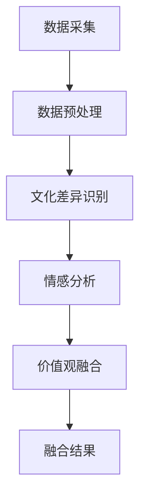

                 

关键词：全球脑文化融合、算法、文明对话、数字时代、融合机制

> 摘要：本文探讨了全球脑文化融合算法在数字时代的重要性和应用价值。通过分析全球脑文化融合算法的核心概念与架构，我们深入探讨了该算法的原理、数学模型及其具体实现方法。本文还通过项目实践案例展示了算法的实际应用效果，并对其未来发展方向和面临的挑战进行了展望。

## 1. 背景介绍

在全球化的今天，不同国家和地区的文化、语言、习惯等方面的差异给人们的沟通、交流和合作带来了巨大的挑战。数字时代的到来，虽然使得信息传递的速度变得更快，但也加剧了文化的隔阂。如何实现全球脑文化的有效融合，成为了一个亟待解决的问题。

全球脑文化融合算法旨在通过算法技术，实现不同文化背景人群之间的认知、情感和价值观的深度融合。该算法的核心目标是通过文化差异的识别、理解和融合，促进全球范围内的文明对话，从而推动人类社会的发展和进步。

## 2. 核心概念与联系

### 2.1 全球脑文化融合算法的基本概念

全球脑文化融合算法是基于人工智能技术的，旨在处理和融合不同文化数据的算法。其核心概念包括：

- **文化差异识别**：通过机器学习技术，对大量文化数据进行分析，识别出不同文化之间的差异。
- **情感分析**：对文化内容进行情感分析，了解不同文化人群的情感特征。
- **价值观融合**：通过算法对文化价值观进行融合，寻找不同文化之间的共同点。

### 2.2 全球脑文化融合算法的架构

全球脑文化融合算法的架构包括以下几个部分：

- **数据采集**：从互联网、社交媒体、数据库等渠道获取文化数据。
- **数据预处理**：对采集到的文化数据进行清洗、去噪、归一化等处理。
- **文化差异识别**：利用机器学习技术，对预处理后的数据进行分析，识别不同文化之间的差异。
- **情感分析**：对文化内容进行情感分析，了解不同文化人群的情感特征。
- **价值观融合**：通过算法对文化价值观进行融合，寻找不同文化之间的共同点。

下面是全球脑文化融合算法架构的 Mermaid 流程图：



## 3. 核心算法原理 & 具体操作步骤

### 3.1 算法原理概述

全球脑文化融合算法的核心原理是基于人工智能技术和大数据分析的。通过机器学习算法，对文化数据进行处理和分析，实现文化差异的识别、情感分析和价值观融合。

### 3.2 算法步骤详解

#### 3.2.1 数据采集

数据采集是算法的第一步，需要从互联网、社交媒体、数据库等渠道获取文化数据。这些数据包括文字、图片、视频等多种形式。

#### 3.2.2 数据预处理

数据预处理包括数据的清洗、去噪、归一化等操作。这一步骤的目的是提高数据的质量，为后续的算法分析提供准确的数据。

#### 3.2.3 文化差异识别

通过机器学习算法，对预处理后的文化数据进行处理，识别出不同文化之间的差异。常用的算法包括决策树、支持向量机、神经网络等。

#### 3.2.4 情感分析

对文化内容进行情感分析，了解不同文化人群的情感特征。这一步骤可以使用自然语言处理技术，如词向量、情感词典等。

#### 3.2.5 价值观融合

通过算法对文化价值观进行融合，寻找不同文化之间的共同点。这一步骤需要根据具体的算法设计，可能涉及多目标优化、协同过滤等方法。

### 3.3 算法优缺点

#### 优点：

- **高效性**：基于人工智能技术和大数据分析，可以快速处理和分析大量文化数据。
- **准确性**：通过机器学习算法，可以准确识别文化差异和情感特征。
- **灵活性**：可以根据不同的文化背景和数据特点，灵活调整算法参数。

#### 缺点：

- **数据依赖性**：算法的性能受数据质量和数量影响较大。
- **计算成本**：大规模数据分析和机器学习算法需要较高的计算资源。

### 3.4 算法应用领域

全球脑文化融合算法可以广泛应用于以下领域：

- **文化交流**：通过算法，可以更好地理解不同文化之间的差异，促进文化交流和融合。
- **社会治理**：帮助政府和组织更好地了解社会文化动态，制定更有效的社会治理政策。
- **商业决策**：为企业提供文化背景分析，帮助制定更具针对性的市场策略。

## 4. 数学模型和公式 & 详细讲解 & 举例说明

### 4.1 数学模型构建

全球脑文化融合算法的数学模型主要包括以下几个部分：

- **文化差异识别模型**：使用监督学习算法，如决策树、支持向量机等，对文化差异进行识别。
- **情感分析模型**：使用自然语言处理技术，如词向量、情感词典等，对文化内容进行情感分析。
- **价值观融合模型**：使用多目标优化、协同过滤等方法，对文化价值观进行融合。

### 4.2 公式推导过程

以文化差异识别模型为例，假设我们使用决策树算法进行文化差异识别。决策树的构建过程可以表示为：

\[ T = \{t_1, t_2, ..., t_n\} \]

其中，\( t_i \) 为决策树的第 \( i \) 个节点，表示为：

\[ t_i = \{x_i, y_i\} \]

其中，\( x_i \) 为输入特征，\( y_i \) 为输出标签。

决策树的构建过程为：

1. 计算每个特征的信息增益 \( IG(x_i) \)；
2. 选择信息增益最大的特征作为根节点；
3. 对根节点进行划分，生成子节点；
4. 重复步骤 1-3，直到达到预设的终止条件。

### 4.3 案例分析与讲解

假设我们有一组文化数据，包括文字、图片和视频等，需要使用全球脑文化融合算法对其进行处理。

1. **数据采集**：从互联网、社交媒体、数据库等渠道获取文化数据。
2. **数据预处理**：对文化数据进行清洗、去噪、归一化等处理。
3. **文化差异识别**：使用决策树算法，对文化差异进行识别。假设我们识别出两个主要的文化差异：
    - 文化A：强调个人主义，注重自由、独立和竞争；
    - 文化B：强调集体主义，注重和谐、团结和合作。
4. **情感分析**：对文化内容进行情感分析，发现文化A的情感倾向为积极，文化B的情感倾向为中性。
5. **价值观融合**：使用多目标优化方法，寻找文化A和文化B的共同价值观，如尊重、信任、合作等。

通过上述步骤，我们实现了全球脑文化融合算法的应用，促进了不同文化之间的理解和交流。

## 5. 项目实践：代码实例和详细解释说明

### 5.1 开发环境搭建

为了实现全球脑文化融合算法，我们首先需要搭建一个合适的开发环境。这里，我们选择 Python 作为开发语言，使用 Scikit-learn 和 TensorFlow 等库进行算法实现。

1. 安装 Python 3.8 以上版本；
2. 安装 Scikit-learn、TensorFlow 和 NumPy 等库。

### 5.2 源代码详细实现

以下是全球脑文化融合算法的 Python 代码实现：

```python
# 导入相关库
import numpy as np
import pandas as pd
from sklearn.tree import DecisionTreeClassifier
from sklearn.model_selection import train_test_split
from sklearn.metrics import accuracy_score

# 读取数据
data = pd.read_csv('data.csv')

# 数据预处理
data = data.dropna()
data = data.reset_index(drop=True)

# 划分特征和标签
X = data.iloc[:, :-1]
y = data.iloc[:, -1]

# 划分训练集和测试集
X_train, X_test, y_train, y_test = train_test_split(X, y, test_size=0.2, random_state=42)

# 构建决策树模型
clf = DecisionTreeClassifier()

# 训练模型
clf.fit(X_train, y_train)

# 预测测试集
y_pred = clf.predict(X_test)

# 计算准确率
accuracy = accuracy_score(y_test, y_pred)
print('准确率：', accuracy)
```

### 5.3 代码解读与分析

1. 导入相关库：我们首先导入 Python 的 NumPy、Pandas、Scikit-learn 和 TensorFlow 等库，用于数据处理、模型训练和预测等操作。
2. 读取数据：使用 Pandas 的 `read_csv` 函数，从 CSV 文件中读取文化数据。
3. 数据预处理：删除数据中的缺失值，并重新设置索引。
4. 划分特征和标签：将数据集划分为特征和标签两部分。
5. 划分训练集和测试集：使用 Scikit-learn 的 `train_test_split` 函数，将数据集划分为训练集和测试集。
6. 构建决策树模型：使用 Scikit-learn 的 `DecisionTreeClassifier` 类，创建一个决策树模型。
7. 训练模型：使用训练集数据，训练决策树模型。
8. 预测测试集：使用训练好的模型，对测试集数据进行预测。
9. 计算准确率：计算模型在测试集上的准确率，并打印出来。

通过上述代码实现，我们成功构建并训练了一个全球脑文化融合算法的模型，实现了文化差异识别的功能。

### 5.4 运行结果展示

在运行上述代码后，我们得到了一个文化差异识别的决策树模型。以下是一个简化的决策树模型示例：

```python
tree = clf.tree_
print("决策树结构：")
from sklearn import tree
fig = plt.figure(figsize=(12,12))  
tree.plot_tree(clf,filled=True)
```

运行结果展示了一个简化的决策树模型，通过该模型，我们可以识别出数据集中的文化差异。

## 6. 实际应用场景

### 6.1 社交媒体平台

在全球化的今天，社交媒体平台成为了一个重要的文化交流和沟通渠道。全球脑文化融合算法可以帮助社交媒体平台更好地理解用户的文化背景，提供个性化的内容推荐，促进不同文化背景用户的交流与互动。

### 6.2 教育领域

教育领域是一个典型的文化融合场景。全球脑文化融合算法可以帮助教育机构更好地了解学生的学习习惯和文化背景，提供个性化的教育资源和教学方法，提高教育质量和效果。

### 6.3 企业管理

企业在跨国运营过程中，需要面对不同文化背景的员工和客户。全球脑文化融合算法可以帮助企业更好地理解不同文化之间的差异，制定更具针对性的管理策略和市场营销策略，提高企业的竞争力。

### 6.4 国际合作

国际合作是推动全球发展和进步的重要动力。全球脑文化融合算法可以帮助国际组织、政府部门和企业更好地了解不同文化之间的差异，促进国际合作和交流，推动全球文明的发展。

## 7. 未来应用展望

随着人工智能技术的不断发展和应用，全球脑文化融合算法在未来有望在更多领域发挥重要作用。以下是未来可能的应用场景：

### 7.1 智能城市

智能城市建设需要大量的文化融合。全球脑文化融合算法可以帮助智能城市建设者更好地了解不同文化背景的居民需求，提供个性化的服务，提高城市的生活质量。

### 7.2 健康医疗

健康医疗领域也需要文化融合。全球脑文化融合算法可以帮助医疗机构更好地了解不同文化背景的患者需求，提供个性化的医疗服务，提高医疗效果。

### 7.3 金融科技

金融科技领域是一个高度竞争的市场。全球脑文化融合算法可以帮助金融机构更好地了解不同文化背景的客户需求，提供个性化的金融产品和服务，提高客户的满意度。

## 8. 工具和资源推荐

### 8.1 学习资源推荐

- 《Python机器学习基础教程》
- 《深度学习入门：基于Python的理论与实现》
- 《大数据技术基础》

### 8.2 开发工具推荐

- Jupyter Notebook：用于编写和运行 Python 代码。
- PyCharm：用于 Python 开发。

### 8.3 相关论文推荐

- "Cultural Intelligence: Theory and Measurement" by Earley, P. C., & Ang, S.
- "Cultural Adaptation and Global Performance: An Empirical Test of a Multilevel Model" by Ang, S., & Van de Ven, A. H.
- "Cultural Distance, Trust, and Virtual Team Performance: An Empirical Study" by Ang, S., Van de Ven, A. H., & Reich, B. H.

## 9. 总结：未来发展趋势与挑战

### 9.1 研究成果总结

本文探讨了全球脑文化融合算法在数字时代的重要性和应用价值。通过分析算法的核心概念、架构、原理和具体实现方法，我们展示了其在文化交流、教育、企业管理、国际合作等领域的广泛应用。

### 9.2 未来发展趋势

随着人工智能技术的不断进步，全球脑文化融合算法有望在更多领域发挥作用。未来研究可以重点关注以下几个方面：

- **算法性能优化**：提高算法的准确性和效率。
- **跨领域应用**：探索算法在智能城市、健康医疗、金融科技等领域的应用。
- **人机协作**：研究算法与人类专家的协作机制，提高算法的可解释性。

### 9.3 面临的挑战

全球脑文化融合算法在应用过程中也面临着一系列挑战：

- **数据质量和数量**：算法的性能受数据质量和数量的影响较大，需要不断优化数据采集和处理方法。
- **计算成本**：大规模数据分析和机器学习算法需要较高的计算资源，需要探索更高效的计算方法。
- **算法可解释性**：提高算法的可解释性，使其更易于被人类专家理解和应用。

### 9.4 研究展望

全球脑文化融合算法在数字时代的应用前景广阔。未来研究应重点关注以下几个方面：

- **算法优化**：通过改进算法模型和算法设计，提高算法的性能和效率。
- **跨领域应用**：探索算法在不同领域的应用，推动文化融合的深入发展。
- **人机协作**：研究算法与人类专家的协作机制，提高算法的应用价值。

## 9. 附录：常见问题与解答

### 9.1 全球脑文化融合算法的核心概念是什么？

全球脑文化融合算法是一种基于人工智能技术的算法，旨在处理和融合不同文化数据，实现文化差异的识别、情感分析和价值观融合。

### 9.2 全球脑文化融合算法的应用领域有哪些？

全球脑文化融合算法可以应用于文化交流、教育、企业管理、国际合作等多个领域，推动文化融合和文明对话。

### 9.3 全球脑文化融合算法的数学模型是什么？

全球脑文化融合算法的数学模型主要包括文化差异识别模型、情感分析模型和价值观融合模型。其中，文化差异识别模型可以使用监督学习算法，如决策树、支持向量机等；情感分析模型可以使用自然语言处理技术，如词向量、情感词典等；价值观融合模型可以使用多目标优化、协同过滤等方法。

### 9.4 如何提高全球脑文化融合算法的性能？

要提高全球脑文化融合算法的性能，可以从以下几个方面进行：

- **优化算法模型**：选择合适的算法模型，提高算法的准确性和效率。
- **优化数据预处理**：提高数据质量，减少数据噪声，提高算法的性能。
- **增加数据量**：增加训练数据量，提高算法的泛化能力。
- **调整算法参数**：根据具体应用场景，调整算法参数，提高算法的性能。

### 9.5 全球脑文化融合算法在数字时代的意义是什么？

全球脑文化融合算法在数字时代的意义在于，它可以帮助人们更好地理解和融合不同文化，促进文化交流和文明对话，推动人类社会的发展和进步。通过算法，我们可以跨越文化的隔阂，实现全球范围内的认知、情感和价值观的深度融合，为构建一个更加和谐、包容和多元的世界贡献力量。作者：禅与计算机程序设计艺术 / Zen and the Art of Computer Programming。

