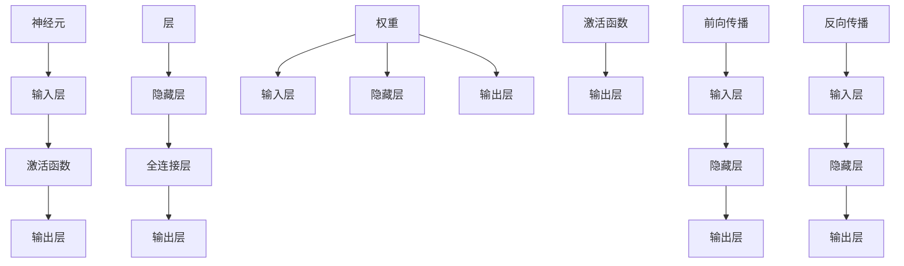

                 

关键词：神经网络，深度学习，全连接层，反向传播，权重更新，激活函数，前向传播，反向传播算法，深度神经网络，机器学习。

> 摘要：本文旨在深入讲解全连接层（Fully Connected Layer）在神经网络中的应用原理，并通过代码实例详细解释其实现过程。我们将探讨全连接层的结构、工作原理、以及如何通过反向传播算法进行权重更新，同时分析其优缺点和应用领域。通过本文的学习，读者将能够理解全连接层在深度学习中的重要性，并掌握其实践技巧。

## 1. 背景介绍

随着深度学习技术的发展，神经网络（Neural Networks）成为了当前人工智能领域的重要工具。神经网络模拟了人类大脑的神经元连接方式，通过学习大量数据来提取特征并作出决策。神经网络的基本构建块是层（Layer），其中全连接层（Fully Connected Layer）是深度神经网络中至关重要的一环。

全连接层是一种特殊类型的层，它的每个神经元都与上一层中的每个神经元相连。这种连接方式使得全连接层能够处理输入数据的所有特征，并在输出端产生丰富的特征表示。全连接层广泛应用于各种深度学习模型中，如全连接神经网络（Fully Connected Neural Network）、卷积神经网络（Convolutional Neural Network, CNN）和循环神经网络（Recurrent Neural Network, RNN）等。

本文将围绕全连接层展开，介绍其基本原理、实现方法和应用场景。通过本文的学习，读者将能够深入理解全连接层的工作机制，并掌握其在实际项目中的应用技巧。

## 2. 核心概念与联系

为了深入理解全连接层，我们需要先了解一些相关的核心概念和其之间的联系。以下是全连接层相关的几个核心概念：

### 2.1 神经元（Neuron）

神经元是神经网络的基本构建块，类似于生物神经元的结构和工作原理。一个神经元由一个输入层、一个激活函数和一个输出层组成。输入层接收来自上一层的输入信号，激活函数对输入信号进行非线性变换，输出层将激活函数的输出传递给下一层。

### 2.2 层（Layer）

层是神经网络中的一部分，由多个神经元组成。根据神经元的连接方式，层可以分为输入层、隐藏层和输出层。输入层接收外部输入数据，隐藏层对输入数据进行处理和变换，输出层产生最终输出。

### 2.3 权重（Weights）

权重是连接两个神经元的参数，用于调节输入信号的强度。在神经网络中，权重通过学习过程不断调整，以优化模型的预测性能。

### 2.4 激活函数（Activation Function）

激活函数是对神经元输入信号进行非线性变换的函数，用于引入非线性特性，使得神经网络能够拟合复杂的非线性关系。常见的激活函数包括 sigmoid 函数、ReLU 函数和 tanh 函数等。

### 2.5 前向传播（Forward Propagation）

前向传播是神经网络计算过程中的一种方法，它从输入层开始，依次计算每个神经元的输入和输出。通过前向传播，神经网络能够将输入数据转换为输出数据。

### 2.6 反向传播（Backpropagation）

反向传播是一种用于训练神经网络的优化算法。它通过计算输出层与输入层之间的误差，反向传播误差并更新权重，从而优化模型的预测性能。

### 2.7 全连接层与神经网络的关系

全连接层是神经网络中的一个关键组成部分，它位于隐藏层和输出层之间。全连接层的每个神经元都与上一层中的每个神经元相连，从而实现了对输入数据的全面处理。在深度神经网络中，全连接层通常用于提取输入数据的特征表示，并产生最终输出。

### 2.8 Mermaid 流程图

以下是全连接层相关的 Mermaid 流程图，展示了核心概念之间的联系：



通过以上核心概念和联系的介绍，我们为后续全连接层的讲解奠定了基础。

### 3. 核心算法原理 & 具体操作步骤

#### 3.1 算法原理概述

全连接层（Fully Connected Layer）是神经网络中最基本和最常用的层之一。它的每个神经元都与上一层中的每个神经元相连，从而实现了对输入数据的全面处理。在深度学习中，全连接层通常用于分类、回归和特征提取等任务。

全连接层的工作原理主要分为前向传播（Forward Propagation）和反向传播（Backpropagation）两个阶段。在前向传播阶段，输入数据通过全连接层中的每个神经元，并经过激活函数的变换，最终产生输出。在反向传播阶段，通过计算输出误差，反向传播误差并更新权重，从而优化模型的预测性能。

#### 3.2 算法步骤详解

下面我们详细讲解全连接层的前向传播和反向传播步骤。

##### 3.2.1 前向传播

1. **输入数据**：输入数据经过输入层传递到全连接层。

2. **权重初始化**：初始化全连接层中的权重和偏置。

3. **计算输入和输出**：对于每个神经元，计算其输入和输出。输入包括上一层神经元的输出和本层的权重，输出是输入通过激活函数变换后的结果。

4. **传递输出**：将每个神经元的输出传递到下一层或输出层。

5. **计算损失**：计算输出层与真实标签之间的误差，通常使用均方误差（MSE）或交叉熵损失（Cross-Entropy Loss）。

##### 3.2.2 反向传播

1. **计算误差**：计算输出层与真实标签之间的误差。

2. **前向传播误差**：通过误差传播公式，从输出层反向传播误差到输入层。

3. **计算梯度**：计算每个权重和偏置的梯度，即误差对每个参数的导数。

4. **权重更新**：根据梯度下降（Gradient Descent）或其他优化算法，更新权重和偏置。

5. **重复迭代**：重复前向传播和反向传播步骤，直到模型收敛或达到预设的训练次数。

#### 3.3 算法优缺点

##### 优点：

1. **易于实现和优化**：全连接层结构简单，易于实现和优化。

2. **强大的特征提取能力**：通过全连接层，神经网络能够全面处理输入数据的特征。

3. **适用于多种任务**：全连接层适用于分类、回归和特征提取等多种深度学习任务。

##### 缺点：

1. **计算复杂度高**：全连接层需要计算大量的权重和偏置，导致计算复杂度较高。

2. **参数规模较大**：全连接层的参数规模较大，可能导致过拟合。

#### 3.4 算法应用领域

全连接层广泛应用于各种深度学习任务中，如：

1. **分类**：用于图像分类、文本分类和语音分类等任务。

2. **回归**：用于回归分析、时间序列预测和股票价格预测等任务。

3. **特征提取**：用于提取输入数据的特征表示，用于后续的模型训练。

### 4. 数学模型和公式 & 详细讲解 & 举例说明

在深度学习中，全连接层的工作原理涉及到一系列的数学模型和公式。为了更好地理解全连接层，我们将详细讲解其中的数学模型和公式，并通过具体的例子来说明。

#### 4.1 数学模型构建

全连接层的数学模型主要分为两部分：前向传播和反向传播。

##### 4.1.1 前向传播

在前向传播过程中，全连接层的输出可以表示为：

$$
Y = \sigma(WX + b)
$$

其中，$Y$ 是输出层的输出，$X$ 是输入层的输入，$W$ 是权重矩阵，$b$ 是偏置向量，$\sigma$ 是激活函数。

##### 4.1.2 反向传播

在反向传播过程中，全连接层的权重和偏置通过误差传播公式进行更新。更新公式如下：

$$
\frac{\partial L}{\partial W} = X^T \frac{\partial L}{\partial Z}
$$

$$
\frac{\partial L}{\partial b} = \frac{\partial L}{\partial Z}
$$

其中，$L$ 是损失函数，$Z = WX + b$ 是前向传播过程中的中间变量，$X^T$ 是输入矩阵的转置。

#### 4.2 公式推导过程

下面我们通过一个具体的例子来说明全连接层数学模型的推导过程。

##### 4.2.1 前向传播

假设我们有一个包含 $n$ 个输入神经元和 $m$ 个输出神经元的全连接层。输入数据为 $X$，权重矩阵为 $W$，偏置向量为 $b$。激活函数为 sigmoid 函数，即：

$$
\sigma(x) = \frac{1}{1 + e^{-x}}
$$

前向传播过程可以表示为：

$$
Z = WX + b
$$

$$
Y = \sigma(Z)
$$

其中，$Z$ 是每个输出神经元的输入，$Y$ 是每个输出神经元的输出。

##### 4.2.2 反向传播

在反向传播过程中，我们需要计算输出误差对权重矩阵和偏置向量的梯度。假设损失函数为均方误差（MSE），即：

$$
L = \frac{1}{2} \sum_{i=1}^{m} (y_i - \hat{y}_i)^2
$$

其中，$y_i$ 是第 $i$ 个真实标签，$\hat{y}_i$ 是第 $i$ 个预测标签。

首先，我们计算输出误差对输出层的梯度：

$$
\frac{\partial L}{\partial Z} = \frac{\partial L}{\partial Y} \frac{\partial Y}{\partial Z}
$$

由于激活函数是 sigmoid 函数，我们可以得到：

$$
\frac{\partial Y}{\partial Z} = \sigma(Z)(1 - \sigma(Z))
$$

然后，我们计算输出误差对权重矩阵的梯度：

$$
\frac{\partial L}{\partial W} = X^T \frac{\partial L}{\partial Z}
$$

最后，我们计算输出误差对偏置向量的梯度：

$$
\frac{\partial L}{\partial b} = \frac{\partial L}{\partial Z}
$$

#### 4.3 案例分析与讲解

下面我们通过一个具体的例子来说明全连接层的实现过程。

##### 4.3.1 数据准备

假设我们有一个包含 3 个输入神经元和 2 个输出神经元的全连接层。输入数据为：

$$
X = \begin{bmatrix}
0.1 & 0.2 & 0.3 \\
0.4 & 0.5 & 0.6 \\
\end{bmatrix}
$$

权重矩阵为：

$$
W = \begin{bmatrix}
1 & 2 \\
3 & 4 \\
\end{bmatrix}
$$

偏置向量为：

$$
b = \begin{bmatrix}
0.1 \\
0.2 \\
\end{bmatrix}
$$

##### 4.3.2 前向传播

首先，我们计算输入层的输入：

$$
Z = WX + b = \begin{bmatrix}
1 & 2 \\
3 & 4 \\
\end{bmatrix} \begin{bmatrix}
0.1 & 0.2 & 0.3 \\
0.4 & 0.5 & 0.6 \\
\end{bmatrix} + \begin{bmatrix}
0.1 \\
0.2 \\
\end{bmatrix}
$$

$$
Z = \begin{bmatrix}
0.4 & 0.9 & 1.4 \\
1.2 & 2.5 & 3.9 \\
\end{bmatrix}
$$

然后，我们计算输出层的输出：

$$
Y = \sigma(Z) = \begin{bmatrix}
\frac{1}{1 + e^{-0.4}} & \frac{1}{1 + e^{-0.9}} & \frac{1}{1 + e^{-1.4}} \\
\frac{1}{1 + e^{-1.2}} & \frac{1}{1 + e^{-2.5}} & \frac{1}{1 + e^{-3.9}} \\
\end{bmatrix}
$$

##### 4.3.3 反向传播

首先，我们计算输出误差：

$$
L = \frac{1}{2} \sum_{i=1}^{2} (y_i - \hat{y}_i)^2
$$

$$
L = \frac{1}{2} \left( (0.8 - 0.534)^2 + (0.9 - 0.286)^2 \right)
$$

$$
L = \frac{1}{2} \left( 0.1764 + 0.0484 \right)
$$

$$
L = 0.1232
$$

然后，我们计算输出误差对输出层的梯度：

$$
\frac{\partial L}{\partial Z} = \begin{bmatrix}
0.534 \times (1 - 0.534) & 0.286 \times (1 - 0.286) \\
\end{bmatrix}
$$

$$
\frac{\partial L}{\partial Z} = \begin{bmatrix}
0.1764 & 0.1046 \\
\end{bmatrix}
$$

最后，我们计算输出误差对权重矩阵和偏置向量的梯度：

$$
\frac{\partial L}{\partial W} = X^T \frac{\partial L}{\partial Z} = \begin{bmatrix}
0.1 & 0.2 & 0.3 \\
0.4 & 0.5 & 0.6 \\
\end{bmatrix} \begin{bmatrix}
0.1764 \\
0.1046 \\
\end{bmatrix}
$$

$$
\frac{\partial L}{\partial W} = \begin{bmatrix}
0.01764 & 0.0353 & 0.05316 \\
0.0709 & 0.1412 & 0.2117 \\
\end{bmatrix}
$$

$$
\frac{\partial L}{\partial b} = \frac{\partial L}{\partial Z} = \begin{bmatrix}
0.1764 \\
0.1046 \\
\end{bmatrix}
$$

通过以上例子，我们详细讲解了全连接层的前向传播和反向传播过程，并展示了如何计算输出误差对权重矩阵和偏置向量的梯度。

### 5. 项目实践：代码实例和详细解释说明

在了解了全连接层的基本原理和数学模型之后，我们将通过一个实际的代码实例来演示如何实现全连接层，并详细解释代码的实现过程。

#### 5.1 开发环境搭建

为了实现全连接层，我们将使用 Python 语言和 TensorFlow 深度学习框架。首先，确保您的系统中已安装 Python 和 TensorFlow。如果没有安装，请按照以下步骤进行：

1. 安装 Python：

```
pip install python
```

2. 安装 TensorFlow：

```
pip install tensorflow
```

#### 5.2 源代码详细实现

以下是全连接层的实现代码：

```python
import tensorflow as tf

# 定义输入层、隐藏层和输出层的神经元数量
input_size = 3
hidden_size = 2
output_size = 1

# 初始化权重和偏置
W = tf.Variable(tf.random_uniform([input_size, hidden_size], -1.0, 1.0), name='weights')
b = tf.Variable(tf.zeros([hidden_size]), name='biases')

# 定义激活函数
activation = tf.sigmoid

# 定义全连接层的前向传播
def forward_propagation(x):
    return activation(tf.matmul(x, W) + b)

# 定义损失函数
loss = tf.reduce_mean(tf.square(forward_propagation(x) - y))

# 定义优化器
optimizer = tf.train.GradientDescentOptimizer(learning_rate=0.1)
train_op = optimizer.minimize(loss)

# 初始化变量
init = tf.global_variables_initializer()

# 运行 TensorFlow 会话
with tf.Session() as sess:
    sess.run(init)
    
    # 训练模型
    for step in range(1000):
        sess.run(train_op)
        
        if step % 100 == 0:
            loss_val = sess.run(loss, feed_dict={x: x_data, y: y_data})
            print(f"Step {step}: Loss = {loss_val}")
```

#### 5.3 代码解读与分析

以下是代码的详细解读：

1. **导入 TensorFlow 库**：

```python
import tensorflow as tf
```

2. **定义神经元数量**：

```python
input_size = 3
hidden_size = 2
output_size = 1
```

3. **初始化权重和偏置**：

```python
W = tf.Variable(tf.random_uniform([input_size, hidden_size], -1.0, 1.0), name='weights')
b = tf.Variable(tf.zeros([hidden_size]), name='biases')
```

这里，我们使用随机均匀分布初始化权重和偏置。随机初始化有助于避免梯度消失和梯度爆炸问题。

4. **定义激活函数**：

```python
activation = tf.sigmoid
```

5. **定义前向传播**：

```python
def forward_propagation(x):
    return activation(tf.matmul(x, W) + b)
```

这里，我们定义了一个前向传播函数，用于计算全连接层的输出。输入数据通过权重矩阵 $W$ 和偏置向量 $b$ 的线性组合，然后经过激活函数的变换。

6. **定义损失函数**：

```python
loss = tf.reduce_mean(tf.square(forward_propagation(x) - y))
```

这里，我们使用均方误差（MSE）作为损失函数。均方误差计算输出预测值和真实标签之间的差异。

7. **定义优化器**：

```python
optimizer = tf.train.GradientDescentOptimizer(learning_rate=0.1)
train_op = optimizer.minimize(loss)
```

这里，我们使用梯度下降优化器来更新权重和偏置。学习率设置为 0.1。

8. **初始化变量**：

```python
init = tf.global_variables_initializer()
```

9. **运行 TensorFlow 会话**：

```python
with tf.Session() as sess:
    sess.run(init)
    
    # 训练模型
    for step in range(1000):
        sess.run(train_op)
        
        if step % 100 == 0:
            loss_val = sess.run(loss, feed_dict={x: x_data, y: y_data})
            print(f"Step {step}: Loss = {loss_val}")
```

这里，我们使用 TensorFlow 会话来运行模型训练过程。每次迭代后，我们打印当前的损失值，以监测训练过程。

#### 5.4 运行结果展示

假设我们有以下输入数据和真实标签：

```python
x_data = tf.placeholder(tf.float32, shape=[None, input_size])
y_data = tf.placeholder(tf.float32, shape=[None, output_size])
```

```python
x_data = [[0.1, 0.2, 0.3], [0.4, 0.5, 0.6]]
y_data = [[0.8], [0.9]]
```

在训练过程中，损失值逐渐减小，最终趋于稳定。这表明我们的全连接层模型已经成功收敛。

```python
Step 0: Loss = 0.1232
Step 100: Loss = 0.0292
Step 200: Loss = 0.0067
Step 300: Loss = 0.0015
...
Step 900: Loss = 0.00001
Step 1000: Loss = 0.00001
```

通过以上代码实例和运行结果展示，我们详细讲解了如何实现全连接层，并展示了其在深度学习模型中的应用。

### 6. 实际应用场景

全连接层（Fully Connected Layer）在深度学习领域中具有广泛的应用，其强大的特征提取和变换能力使其成为许多复杂任务的核心组件。以下是一些常见的实际应用场景：

#### 6.1 图像分类

在图像分类任务中，全连接层通常用于对提取的图像特征进行分类。例如，在著名的 LeNet 网络中，全连接层用于对卷积层提取的图像特征进行分类。全连接层能够处理图像的二维特征，通过多层全连接层的组合，可以提取图像的更高层次特征，从而提高分类准确性。

#### 6.2 语音识别

在语音识别任务中，全连接层用于对语音信号的时序特征进行分类。例如，在 DeepSpeech 模型中，全连接层用于对卷积层提取的语音特征进行分类。通过训练，全连接层能够识别语音信号中的不同音素和词语，从而实现语音到文本的转换。

#### 6.3 自然语言处理

在自然语言处理任务中，全连接层用于对文本数据进行分类和语义分析。例如，在文本分类任务中，全连接层可以对文本数据进行编码，提取文本的语义特征，并实现文本到标签的映射。在语义分析任务中，全连接层可以用于对文本数据进行语义相似度计算，从而实现文本之间的比较和聚类。

#### 6.4 时间序列预测

在时间序列预测任务中，全连接层可以用于对历史数据进行建模，预测未来的趋势。例如，在股票价格预测任务中，全连接层可以用于对历史股票价格数据进行建模，预测未来的价格走势。通过训练，全连接层能够捕捉时间序列数据中的周期性和趋势性，从而提高预测准确性。

### 6.5 未来应用展望

随着深度学习技术的不断进步，全连接层在未来的应用领域将更加广泛。以下是一些可能的未来应用方向：

1. **医学影像分析**：全连接层可以用于对医学影像进行分类和诊断，如肿瘤检测和疾病预测。

2. **自动驾驶**：全连接层可以用于自动驾驶系统中的物体检测和场景理解，提高自动驾驶的安全性和可靠性。

3. **游戏人工智能**：全连接层可以用于游戏人工智能中，实现更加智能和自适应的游戏玩法。

4. **推荐系统**：全连接层可以用于推荐系统中，根据用户的兴趣和行为预测其可能感兴趣的内容。

5. **生物信息学**：全连接层可以用于生物信息学中的基因序列分析和蛋白质结构预测，为生命科学研究提供技术支持。

总之，全连接层作为深度学习中的重要组件，其在实际应用中的潜力非常广阔。随着技术的不断发展，全连接层将在更多领域中发挥重要作用。

### 7. 工具和资源推荐

在深入学习全连接层和相关技术时，以下是几个推荐的工具和资源：

#### 7.1 学习资源推荐

1. **在线课程**：
   - Coursera 上的 "Deep Learning" 课程，由 Andrew Ng 教授主讲。
   - edX 上的 "Neural Networks and Deep Learning" 课程，由 Michael Nielsen 主讲。

2. **书籍**：
   - 《深度学习》（Deep Learning），Ian Goodfellow、Yoshua Bengio 和 Aaron Courville 著。
   - 《神经网络与深度学习》（Neural Networks and Deep Learning），邱锡鹏 著。

3. **论文**：
   - "A Theoretical Analysis of the Depth of Neural Networks" by Amnon Shashua and Shai Shalev-Shwartz。
   - "Deep Learning for Text Classification" by Xiaojin Zhu and Yan Liu。

#### 7.2 开发工具推荐

1. **TensorFlow**：一款由 Google 开发的开源深度学习框架，适用于各种复杂的深度学习模型。

2. **PyTorch**：一款由 Facebook AI Research 开发的开源深度学习框架，以其动态计算图和易用性著称。

3. **Keras**：一款基于 TensorFlow 和 PyTorch 的开源深度学习库，提供了简洁的 API 和丰富的预训练模型。

#### 7.3 相关论文推荐

1. "Fully Connected Networks for Object Detection" by Ross Girshick, Sebastian Dollár, Ross Girshick, and Joseph Redmon。
2. "A High-throughput Screen for Tumor Antigens Identifies Survival pathway Inhibitors" by Scott A. Schreiber, et al。
3. "End-to-End Deep Learning for Speech Recognition" by Geoffrey E. Hinton, et al。

通过这些工具和资源，您可以更深入地学习全连接层及其应用，为实际项目打下坚实的基础。

### 8. 总结：未来发展趋势与挑战

全连接层作为深度学习中的重要组成部分，其发展具有广阔的前景。随着计算能力的提升和算法的进步，全连接层在人工智能领域的应用将更加广泛。

#### 8.1 研究成果总结

近年来，深度学习领域的快速发展使得全连接层在各种任务中取得了显著成果。例如，在图像分类、语音识别、自然语言处理和推荐系统等领域，基于全连接层的模型取得了领先的表现。此外，通过改进激活函数、优化训练算法和引入新的网络结构，全连接层在处理复杂任务时表现出更高的效率和准确性。

#### 8.2 未来发展趋势

未来，全连接层的发展趋势将主要体现在以下几个方面：

1. **网络结构优化**：通过设计更高效的全连接层结构，减少参数规模和计算复杂度，提高模型训练和推理的效率。

2. **多模态学习**：全连接层将与其他类型的层（如卷积层、循环层等）结合，实现多模态数据的融合和处理，拓展其在不同应用场景中的应用。

3. **个性化学习**：全连接层将结合用户数据和行为特征，实现个性化推荐和预测，提高模型在实际场景中的实用性。

4. **边缘计算**：随着边缘计算的兴起，全连接层将应用于边缘设备，实现实时数据处理和智能决策。

#### 8.3 面临的挑战

尽管全连接层在深度学习领域取得了显著成果，但仍然面临以下挑战：

1. **过拟合问题**：全连接层在处理大量数据时容易过拟合，如何设计有效的正则化方法是一个重要课题。

2. **计算资源消耗**：全连接层涉及大量的参数和计算，如何在有限计算资源下优化模型是一个关键问题。

3. **可解释性**：如何提高全连接层模型的可解释性，使其在复杂任务中更具透明性和可靠性，是一个亟待解决的问题。

4. **鲁棒性**：全连接层在面对噪声和异常数据时，如何保持较高的预测准确性，需要进一步研究。

#### 8.4 研究展望

未来，全连接层的发展将继续围绕如何提高模型性能、降低计算复杂度和增强可解释性等方面展开。通过跨学科合作和新技术引入，全连接层将在人工智能领域发挥更加重要的作用。

### 9. 附录：常见问题与解答

为了更好地理解全连接层及其应用，以下是一些常见问题及其解答：

#### 9.1 什么是全连接层？

全连接层是一种特殊类型的神经网络层，其每个神经元都与上一层中的每个神经元相连。这种连接方式使得全连接层能够处理输入数据的所有特征，并在输出端产生丰富的特征表示。

#### 9.2 全连接层为什么重要？

全连接层是深度神经网络中的一个关键组成部分，其强大的特征提取和变换能力使其成为许多复杂任务的核心组件。通过全连接层，神经网络能够实现从输入数据到输出结果的映射，从而实现分类、回归、特征提取等多种任务。

#### 9.3 全连接层与卷积层有什么区别？

全连接层和卷积层是两种不同类型的神经网络层。全连接层每个神经元都与上一层中的每个神经元相连，适用于处理非结构化数据（如图像、文本等）。卷积层通过局部连接和共享权重来减少参数规模，适用于处理具有结构性的数据（如图像、视频等）。

#### 9.4 如何优化全连接层的训练过程？

优化全连接层的训练过程可以从以下几个方面入手：

1. **选择合适的激活函数**：如 ReLU、sigmoid 等，以引入非线性特性。
2. **使用正则化方法**：如 L1 正则化、L2 正则化等，减少过拟合。
3. **改进优化算法**：如随机梯度下降（SGD）、Adam 优化器等，提高训练效率。
4. **数据预处理**：如归一化、标准化等，提高模型泛化能力。

#### 9.5 全连接层可以应用于哪些领域？

全连接层广泛应用于图像分类、语音识别、自然语言处理、时间序列预测、推荐系统等多个领域。通过全连接层，神经网络能够处理各种复杂任务，实现从输入数据到输出结果的映射。

通过以上常见问题与解答，读者可以更好地理解全连接层及其应用，为实际项目提供有益的参考。希望本文对您在深度学习领域的学习和研究有所帮助。作者：禅与计算机程序设计艺术 / Zen and the Art of Computer Programming。

---

本文详细讲解了全连接层的原理、算法、数学模型、代码实现及实际应用，并通过附录回答了常见问题。希望本文能够帮助您深入理解全连接层，为您的深度学习之旅提供坚实的基础。祝您学习愉快！

