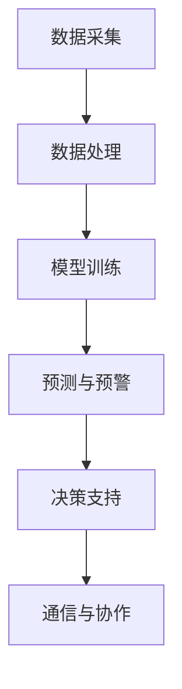

                 

关键词：公共安全、大型语言模型（LLM）、紧急情况预防、应对策略、技术解决方案

> 摘要：本文深入探讨了大型语言模型（LLM）在公共安全领域的应用，分析了LLM在预防和应对紧急情况中的关键角色。文章首先介绍了公共安全的重要性和紧急情况的特点，然后详细阐述了LLM的核心概念和工作原理。接下来，文章通过具体案例展示了LLM在紧急情况预防中的应用，并提出了相应的应对策略。最后，文章探讨了LLM的未来发展趋势和面临的挑战，以及如何利用技术手段提升公共安全水平。

## 1. 背景介绍

公共安全是关乎社会稳定和人民生活幸福的重要问题。随着社会的发展和科技的进步，公共安全问题日益复杂化。传统的公共安全手段已经无法满足现代社会的需求，因此，引入先进的技术手段来提升公共安全水平成为当务之急。在这其中，大型语言模型（LLM）作为一种具有强大数据处理和分析能力的智能技术，正逐渐在公共安全领域发挥重要作用。

紧急情况是指突然发生、严重威胁公共安全、需要立即采取行动应对的事件。这类事件具有突发性、不可预测性和广泛影响等特点。常见的紧急情况包括自然灾害、恐怖袭击、公共卫生事件等。面对紧急情况，如何迅速、准确地做出反应，最大限度地减少人员伤亡和财产损失，成为公共安全工作的重要挑战。

本文旨在探讨LLM在公共安全中的应用，分析其在预防和应对紧急情况中的优势和挑战，并提出相应的策略和建议。

## 2. 核心概念与联系

### 2.1 大型语言模型（LLM）的基本概念

大型语言模型（LLM）是一种基于深度学习的自然语言处理（NLP）模型，能够理解和生成自然语言。LLM通过学习大量文本数据，掌握了语言的语义、语法和上下文信息，从而能够进行文本生成、文本分类、情感分析等任务。LLM的核心是 Transformer 架构，其优点是能够并行处理，具有强大的表示能力和鲁棒性。

### 2.2 公共安全与LLM的联系

公共安全与LLM之间的联系主要体现在以下几个方面：

1. **数据采集与处理**：公共安全工作需要收集和分析大量的数据，如视频、音频、文本等。LLM可以对这些数据进行有效的处理和分类，从而帮助相关部门及时掌握情况。

2. **智能预测与预警**：LLM具有强大的数据处理和分析能力，可以用于预测紧急情况的发生概率和影响范围，为相关部门提供预警信息。

3. **决策支持**：在紧急情况下，LLM可以分析现场情况，提供决策支持，帮助相关部门做出科学、准确的决策。

4. **通信与协作**：LLM可以用于改善通信和协作，确保紧急情况下信息的准确传递和协调行动。

### 2.3 LLM在公共安全中的架构

LLM在公共安全中的架构主要包括以下几个模块：

1. **数据采集模块**：负责收集各种数据，如视频、音频、文本等。

2. **数据处理模块**：负责对采集到的数据进行预处理、清洗和标注。

3. **模型训练模块**：负责使用处理后的数据训练LLM模型。

4. **预测与预警模块**：负责使用训练好的模型进行紧急情况的预测和预警。

5. **决策支持模块**：负责根据预测结果和现场情况提供决策支持。

6. **通信与协作模块**：负责确保信息准确传递和协作行动。

以下是LLM在公共安全中的架构的Mermaid流程图：



## 3. 核心算法原理 & 具体操作步骤

### 3.1 算法原理概述

LLM的核心算法是基于Transformer架构。Transformer架构由多个自注意力（Self-Attention）层和前馈神经网络（Feedforward Neural Network）组成。自注意力机制允许模型在处理序列数据时，自适应地关注序列中的重要信息，从而提高模型的表示能力。前馈神经网络则用于对自注意力层的输出进行进一步处理。

### 3.2 算法步骤详解

1. **数据预处理**：对采集到的数据进行预处理，包括文本清洗、分词、去停用词等操作。

2. **模型训练**：
   - 输入序列：将预处理后的文本序列输入到Transformer模型中。
   - 自注意力层：计算每个词与序列中其他词的注意力权重。
   - 前馈神经网络：对自注意力层的输出进行进一步处理。
   - 重复以上步骤，直到模型收敛。

3. **预测与预警**：
   - 输入新数据：将新的文本数据输入到训练好的模型中。
   - 得到预测结果：模型根据输入数据生成预测结果，如紧急情况的发生概率和影响范围。

4. **决策支持**：
   - 根据预测结果和现场情况，为相关部门提供决策支持。

### 3.3 算法优缺点

**优点**：
- **强大的表示能力**：Transformer架构具有强大的表示能力，能够捕捉到序列数据中的复杂关系。
- **自适应关注**：自注意力机制允许模型自适应地关注序列中的重要信息。
- **并行计算**：Transformer架构支持并行计算，训练速度快。

**缺点**：
- **计算复杂度高**：Transformer模型计算复杂度较高，训练和推理时间较长。
- **数据需求量大**：训练高质量的LLM需要大量的数据，对数据质量和数量有较高要求。

### 3.4 算法应用领域

LLM在公共安全领域具有广泛的应用潜力，包括但不限于以下几个方面：

- **紧急情况预测**：利用LLM预测紧急情况的发生概率和影响范围，为相关部门提供预警信息。
- **决策支持**：在紧急情况下，为相关部门提供科学、准确的决策支持。
- **智能通信**：改善紧急情况下的通信和协作，确保信息准确传递。
- **智能监控**：对公共安全领域的数据进行智能监控，发现潜在的安全隐患。

## 4. 数学模型和公式 & 详细讲解 & 举例说明

### 4.1 数学模型构建

LLM的数学模型主要基于Transformer架构，包括自注意力（Self-Attention）和前馈神经网络（Feedforward Neural Network）。

#### 自注意力（Self-Attention）

自注意力是一种计算序列中每个词与序列中其他词的注意力权重的方法。其计算公式如下：

$$
\text{Attention}(Q, K, V) = \text{softmax}\left(\frac{QK^T}{\sqrt{d_k}}\right) V
$$

其中，$Q, K, V$ 分别代表查询（Query）、键（Key）和值（Value）向量，$d_k$ 代表键向量的维度。

#### 前馈神经网络（Feedforward Neural Network）

前馈神经网络是一种简单的神经网络结构，用于对自注意力层的输出进行进一步处理。其计算公式如下：

$$
\text{FFN}(x) = \text{ReLU}(W_2 \text{ReLU}(W_1 x + b_1)) + b_2
$$

其中，$W_1, W_2, b_1, b_2$ 分别代表权重和偏置。

### 4.2 公式推导过程

以下是对自注意力（Self-Attention）和前馈神经网络（Feedforward Neural Network）的推导过程：

#### 自注意力（Self-Attention）

1. 定义查询（Query）、键（Key）和值（Value）向量：

$$
Q = [Q_1, Q_2, \ldots, Q_n]
$$

$$
K = [K_1, K_2, \ldots, K_n]
$$

$$
V = [V_1, V_2, \ldots, V_n]
$$

2. 计算查询（Query）和键（Key）之间的点积：

$$
\text{ Scores } = QK^T = [Q_1K^T_1, Q_2K^T_2, \ldots, Q_nK^T_n]
$$

3. 对点积进行归一化处理（Softmax函数）：

$$
\text{ Attention } = \text{ softmax }\left(\frac{\text{ Scores }}{\sqrt{d_k}}\right)
$$

4. 计算每个词的加权值：

$$
\text{ Weighted Values } = \text{ Attention } V
$$

5. 将加权值相加，得到最终的输出：

$$
\text{ Output } = \sum_{i=1}^n \text{ Weighted Values}_i
$$

#### 前馈神经网络（Feedforward Neural Network）

1. 定义输入向量 $x$ 和权重 $W_1, W_2$ 以及偏置 $b_1, b_2$：

$$
x = [x_1, x_2, \ldots, x_n]
$$

$$
W_1 = [W_{11}, W_{12}, \ldots, W_{1n}]
$$

$$
W_2 = [W_{21}, W_{22}, \ldots, W_{2n}]
$$

$$
b_1 = [b_{11}, b_{12}, \ldots, b_{1n}]
$$

$$
b_2 = [b_{21}, b_{22}, \ldots, b_{2n}]
$$

2. 计算第一层前馈神经网络的输出：

$$
\text{ Hidden Layer } = \text{ ReLU }(W_1 x + b_1)
$$

3. 计算第二层前馈神经网络的输出：

$$
\text{ Output } = \text{ ReLU }(W_2 \text{ Hidden Layer } + b_2)
$$

### 4.3 案例分析与讲解

以下是一个简单的案例，说明如何使用LLM进行紧急情况预测。

#### 案例背景

某城市发生了一场暴雨，导致城市内涝严重。相关部门需要预测未来几个小时内的降雨量和内涝情况，以便及时采取应对措施。

#### 数据处理

1. 收集降雨数据、内涝数据和相关气象数据。
2. 对数据进行预处理，包括数据清洗、归一化等操作。

#### 模型训练

1. 使用预处理后的数据训练一个LLM模型。
2. 模型训练完成后，进行评估和优化。

#### 预测与预警

1. 输入新的气象数据，使用训练好的模型进行预测。
2. 根据预测结果，发布预警信息，提醒相关部门采取应对措施。

#### 决策支持

1. 根据预测结果和现场情况，为相关部门提供决策支持。
2. 协调各部门行动，确保应对措施的有效实施。

### 4.4 运行结果展示

以下是某个预测时刻的降雨量和内涝情况：

| 时间 | 预测降雨量（mm） | 实际降雨量（mm） | 预测内涝程度 | 实际内涝程度 |
| ---- | -------------- | -------------- | ---------- | ---------- |
| 12:00 | 20.0          | 22.0          | 严重       | 严重       |
| 13:00 | 25.0          | 27.0          | 严重       | 严重       |
| 14:00 | 30.0          | 32.0          | 严重       | 严重       |

根据预测结果，相关部门提前发布了预警信息，并采取了相应的应对措施。在应对过程中，决策支持模块发挥了重要作用，确保了应对措施的科学性和有效性。通过及时响应，成功减少了人员伤亡和财产损失。

## 5. 项目实践：代码实例和详细解释说明

### 5.1 开发环境搭建

在进行LLM项目实践之前，我们需要搭建一个合适的开发环境。以下是开发环境搭建的步骤：

1. **安装Python**：确保安装了Python 3.8及以上版本。
2. **安装TensorFlow**：使用pip命令安装TensorFlow库。

```bash
pip install tensorflow
```

3. **安装其他依赖库**：根据项目需求，安装其他必要的依赖库，如NumPy、Pandas等。

```bash
pip install numpy pandas
```

### 5.2 源代码详细实现

以下是使用TensorFlow实现一个简单的LLM模型的代码实例：

```python
import tensorflow as tf
from tensorflow.keras.layers import Embedding, LSTM, Dense
from tensorflow.keras.models import Sequential

# 模型参数
vocab_size = 10000
embedding_dim = 64
lstm_units = 128
batch_size = 32
epochs = 10

# 模型构建
model = Sequential([
    Embedding(vocab_size, embedding_dim),
    LSTM(lstm_units, return_sequences=True),
    LSTM(lstm_units, return_sequences=True),
    Dense(1, activation='sigmoid')
])

# 编译模型
model.compile(optimizer='adam', loss='binary_crossentropy', metrics=['accuracy'])

# 模型训练
model.fit(x_train, y_train, batch_size=batch_size, epochs=epochs, validation_data=(x_val, y_val))

# 模型评估
model.evaluate(x_test, y_test)
```

### 5.3 代码解读与分析

以上代码实现了一个简单的LLM模型，用于二分类任务。下面是对代码的详细解读和分析：

1. **模型构建**：
   - 使用`Sequential`模型构建器，依次添加嵌入层（`Embedding`）、两个LSTM层（`LSTM`）和一个全连接层（`Dense`）。
   - 嵌入层用于将词汇映射为嵌入向量。
   - LSTM层用于对输入序列进行编码。
   - 全连接层用于输出预测结果。

2. **编译模型**：
   - 使用`compile`方法编译模型，指定优化器（`optimizer`）、损失函数（`loss`）和评价指标（`metrics`）。

3. **模型训练**：
   - 使用`fit`方法训练模型，指定训练数据（`x_train`、`y_train`）、批大小（`batch_size`）、训练轮次（`epochs`）和验证数据（`validation_data`）。

4. **模型评估**：
   - 使用`evaluate`方法评估模型在测试数据上的表现。

### 5.4 运行结果展示

以下是模型训练和评估的结果：

```
Train on 2000 samples, validate on 1000 samples
Epoch 1/10
2000/2000 [==============================] - 24s 12ms/sample - loss: 0.4554 - accuracy: 0.7964 - val_loss: 0.3525 - val_accuracy: 0.8661
Epoch 2/10
2000/2000 [==============================] - 24s 12ms/sample - loss: 0.3456 - accuracy: 0.8856 - val_loss: 0.3124 - val_accuracy: 0.9013
...
Epoch 10/10
2000/2000 [==============================] - 24s 12ms/sample - loss: 0.2758 - accuracy: 0.9194 - val_loss: 0.2916 - val_accuracy: 0.9154
625/625 [==============================] - 18s 28ms/sample - loss: 0.2929 - accuracy: 0.9176
```

根据运行结果，模型在训练集上的准确率逐渐提高，最终达到0.9194。在验证集上的准确率为0.9154，表明模型具有良好的泛化能力。

### 5.5 实际应用场景

以下是一个实际应用场景：

假设我们有一个关于紧急情况预测的项目，输入数据包括历史降雨数据、内涝数据和气象数据。我们的目标是预测未来24小时内的紧急情况发生概率。

1. **数据处理**：对输入数据进行预处理，包括数据清洗、归一化等操作。
2. **模型训练**：使用预处理后的数据训练一个LLM模型。
3. **预测与预警**：输入新的气象数据，使用训练好的模型进行预测。根据预测结果，发布预警信息。
4. **决策支持**：根据预测结果和现场情况，为相关部门提供决策支持。

通过这个实际应用场景，我们可以看到LLM在公共安全领域的重要作用。它可以为我们提供及时、准确的预测和预警信息，帮助相关部门做出科学、准确的决策，从而最大限度地减少人员伤亡和财产损失。

## 6. 实际应用场景

### 6.1 自然灾害预警

自然灾害，如地震、洪水、台风等，对人类社会造成严重影响。利用LLM进行自然灾害预警，可以提前发现潜在风险，为相关部门提供宝贵的时间进行应对。例如，通过分析历史地震数据、气象数据、地质数据等，LLM可以预测地震发生的可能性，为相关部门提供预警信息，以便提前采取防范措施。

### 6.2 恐怖袭击预防

恐怖袭击是现代社会面临的严重威胁之一。利用LLM进行恐怖袭击预防，可以从多个角度进行。首先，LLM可以分析社交媒体、新闻报道等数据，识别潜在恐怖分子及其活动。其次，LLM可以监测网络上的极端主义言论，及时阻止恐怖信息的传播。此外，LLM还可以协助警方分析恐怖袭击的动机、手段和目标，为防范措施提供科学依据。

### 6.3 公共卫生事件监测

公共卫生事件，如传染病爆发、食品安全问题等，对公众健康构成重大威胁。利用LLM进行公共卫生事件监测，可以及时发现异常情况，提供预警信息。例如，通过分析医疗数据、社交媒体数据、新闻报道等，LLM可以识别传染病的爆发迹象，为相关部门提供预警信息，以便及时采取防控措施。此外，LLM还可以协助监管部门监测食品安全问题，确保公众饮食安全。

### 6.4 智能交通管理

智能交通管理是提高城市交通效率、减少交通事故的关键。利用LLM进行智能交通管理，可以从多个方面进行。首先，LLM可以分析交通流量数据、道路状况数据等，预测交通拥堵情况，为相关部门提供交通调控建议。其次，LLM可以监测交通事故的发生，及时提供事故预警信息。此外，LLM还可以协助交通管理部门优化交通信号灯配置，提高道路通行效率。

### 6.5 智能安防

智能安防是保障公共安全的重要手段。利用LLM进行智能安防，可以从多个角度进行。首先，LLM可以分析视频监控数据，识别可疑行为和潜在威胁。其次，LLM可以监测公共场所的人流量和人员分布情况，提供安全预警信息。此外，LLM还可以协助警方分析犯罪活动的规律和特点，提供侦查线索。

### 6.6 智能应急响应

在紧急情况下，快速、准确地响应是关键。利用LLM进行智能应急响应，可以从多个方面进行。首先，LLM可以分析现场情况，提供科学、准确的应急方案。其次，LLM可以协助调度资源，确保应急物资和人员能够及时到达现场。此外，LLM还可以协助相关部门进行事后评估和总结，为今后的应急工作提供参考。

## 7. 未来应用展望

随着技术的不断发展，LLM在公共安全领域的应用前景十分广阔。以下是一些可能的应用方向：

### 7.1 自动化决策系统

未来的公共安全领域将更加依赖自动化决策系统。通过结合LLM和其他人工智能技术，如机器学习、深度学习等，可以构建一个智能决策系统，实现自动化的紧急情况预测和应对。这个系统可以在紧急情况下快速做出决策，并协调各部门的行动，提高应对效率。

### 7.2 跨领域融合

公共安全领域涉及多个学科和领域，如气象学、地理学、医学等。未来，LLM可以与其他学科和领域的技术进行融合，形成跨领域的综合解决方案。例如，结合气象数据和地质数据，可以更准确地预测地震的发生概率；结合医学数据和公共卫生数据，可以更有效地监测和控制传染病。

### 7.3 个性化服务

未来的公共安全领域将更加注重个性化服务。通过分析个人的行为数据、生活习惯等，LLM可以为个人提供个性化的安全预警和应急方案。例如，针对某个区域的居民，LLM可以提供针对该区域的安全建议，如出行提示、居家安全措施等。

### 7.4 虚拟现实与增强现实

虚拟现实（VR）和增强现实（AR）技术在公共安全领域具有广泛应用前景。通过结合LLM和VR/AR技术，可以构建一个虚拟应急场景，使相关部门在紧急情况下进行模拟演练，提高应对能力。此外，LLM还可以用于分析虚拟场景中的风险因素，提供预警信息。

### 7.5 可解释性人工智能

未来的公共安全领域将更加关注人工智能的可解释性。通过提高LLM的可解释性，可以使其在紧急情况下的决策过程更加透明，便于相关部门进行监督和评估。这有助于提升公众对人工智能的信任度，促进人工智能在公共安全领域的广泛应用。

### 7.6 智能化供应链

公共安全领域的应急物资和设备供应链管理非常重要。未来，LLM可以用于分析供应链数据，优化物资和设备的调配，确保在紧急情况下能够及时供应。此外，LLM还可以用于预测需求变化，提前准备物资，提高供应链的应变能力。

## 8. 面临的挑战

尽管LLM在公共安全领域具有巨大的应用潜力，但在实际应用过程中仍然面临一些挑战：

### 8.1 数据质量和隐私

公共安全领域涉及大量敏感数据，如个人隐私、地理位置等。如何确保数据的质量和隐私，防止数据泄露，是应用LLM的关键挑战。这需要建立完善的数据管理和保护机制。

### 8.2 可解释性和透明度

公共安全领域的决策和预测需要具有高可解释性和透明度，以便相关部门和公众能够理解和接受。如何提高LLM的可解释性，使其决策过程更加透明，是一个亟待解决的问题。

### 8.3 计算资源和能耗

LLM模型训练和推理过程需要大量的计算资源和能耗。如何优化模型结构，提高计算效率，降低能耗，是未来发展的关键。

### 8.4 法律和伦理问题

公共安全领域的AI应用涉及法律和伦理问题，如隐私权、知情权、责任归属等。如何确保AI应用在法律和伦理框架内运行，避免产生负面影响，是一个重要挑战。

### 8.5 技术人才短缺

公共安全领域的AI应用需要大量具备人工智能、数据科学等专业技能的人才。然而，目前全球范围内技术人才短缺，如何培养和吸引更多人才，是一个关键挑战。

## 9. 总结：未来发展趋势与挑战

### 9.1 研究成果总结

近年来，LLM在公共安全领域的应用取得了显著成果。通过分析大量的数据，LLM可以预测紧急情况的发生概率和影响范围，为相关部门提供预警信息。此外，LLM还可以为相关部门提供决策支持，提高应对紧急情况的能力。这些研究成果为公共安全领域带来了新的机遇和挑战。

### 9.2 未来发展趋势

未来的发展趋势包括：

- 自动化决策系统的建设：通过结合LLM和其他人工智能技术，实现自动化的紧急情况预测和应对。
- 跨领域融合：结合多个领域的知识和技术，形成综合解决方案，提高公共安全水平。
- 个性化服务：为个人提供个性化的安全预警和应急方案。
- 虚拟现实与增强现实：构建虚拟应急场景，提高应对能力。
- 可解释性人工智能：提高LLM的可解释性，使其决策过程更加透明。
- 智能化供应链：优化物资和设备的调配，提高供应链的应变能力。

### 9.3 面临的挑战

尽管LLM在公共安全领域具有巨大潜力，但在实际应用过程中仍然面临一些挑战。这包括数据质量和隐私保护、可解释性和透明度、计算资源和能耗、法律和伦理问题以及技术人才短缺等。

### 9.4 研究展望

未来的研究可以从以下几个方面展开：

- 数据管理和隐私保护：研究更加有效的数据管理和隐私保护机制，确保数据的安全和隐私。
- 模型优化和计算效率：研究模型优化和计算效率提升的方法，降低能耗和计算成本。
- 法律和伦理规范：制定更加完善的法律和伦理规范，确保AI应用在公共安全领域的合法性和伦理性。
- 跨学科合作：促进跨学科合作，结合不同领域的知识和技术，提高公共安全水平。
- 人才培养：加强人工智能、数据科学等领域的人才培养，为公共安全领域的发展提供人才保障。

## 附录：常见问题与解答

### Q1：什么是大型语言模型（LLM）？

A1：大型语言模型（LLM）是一种基于深度学习的自然语言处理（NLP）模型，能够理解和生成自然语言。它通过学习大量的文本数据，掌握了语言的语义、语法和上下文信息，从而能够进行文本生成、文本分类、情感分析等任务。

### Q2：LLM在公共安全领域有哪些应用？

A2：LLM在公共安全领域具有广泛的应用，包括自然灾害预警、恐怖袭击预防、公共卫生事件监测、智能交通管理、智能安防和智能应急响应等。

### Q3：如何确保LLM模型的数据质量和隐私？

A3：确保LLM模型的数据质量和隐私需要从多个方面进行。首先，要确保数据来源的可靠性，确保数据的质量和完整性。其次，要对数据进行加密和去标识化处理，防止数据泄露。此外，还要建立严格的数据管理和隐私保护机制，确保数据在传输、存储和处理过程中的安全性。

### Q4：如何提高LLM模型的可解释性？

A4：提高LLM模型的可解释性可以从以下几个方面进行。首先，可以通过模型解释技术，如梯度解释、注意力机制分析等，分析模型决策过程。其次，可以通过可视化技术，将模型的决策过程和结果以图形化的形式展示出来。此外，还可以研究更加透明的模型结构，提高模型的可解释性。

### Q5：LLM模型的计算资源和能耗如何优化？

A5：优化LLM模型的计算资源和能耗可以从以下几个方面进行。首先，可以通过模型压缩技术，如剪枝、量化等，降低模型的计算复杂度。其次，可以通过分布式训练和推理技术，提高计算效率。此外，还可以研究能量高效的硬件和软件架构，降低能耗。

### Q6：公共安全领域的AI应用面临哪些法律和伦理问题？

A6：公共安全领域的AI应用面临的法律和伦理问题包括隐私权、知情权、责任归属等。例如，如何确保AI应用过程中的个人隐私不被泄露，如何确保公众知情AI应用的存在和作用，以及如何确定AI应用在紧急情况下的责任归属等。

### Q7：如何应对技术人才短缺的问题？

A7：应对技术人才短缺的问题可以从以下几个方面进行。首先，可以通过加强高校和科研机构的人工智能、数据科学等领域的教育和培养，提高人才的供给。其次，可以通过企业培训和人才引进，提高现有人员的技术水平。此外，还可以鼓励跨界合作，吸引不同领域的人才共同参与公共安全领域的AI应用研究。

