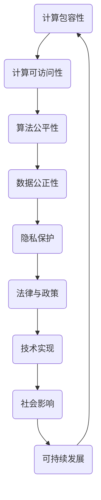

                 

公平与公正作为人类社会的核心价值观，不仅在日常生活中发挥着重要作用，在信息技术领域也同样具有重要意义。随着人工智能和计算机技术的飞速发展，如何确保人类计算的包容性和可访问性成为了一个亟待解决的问题。本文旨在探讨在信息技术领域如何实现公平与公正，以促进技术的普及与进步。

## 关键词

- 公平性
- 公正性
- 人工智能
- 计算包容性
- 计算可访问性

## 摘要

本文首先介绍了公平与公正的定义及其在信息技术领域的重要性，接着阐述了计算包容性和可访问性的核心概念。然后，通过具体案例分析，探讨了如何利用算法、数学模型和项目实践来确保人类计算的公平与公正。最后，对未来的发展趋势与挑战进行了展望。

## 1. 背景介绍

### 1.1 公平与公正的概念

公平与公正是人类社会的核心价值观，它们在不同领域有着不同的体现。在日常生活中，公平意味着每个人都能享有平等的机会和待遇；公正则强调社会规则的透明性和执行的一致性。这两个概念共同构建了社会的信任与和谐。

### 1.2 信息技术领域的重要性

信息技术已经成为现代社会的重要组成部分，从互联网到移动设备，从人工智能到大数据分析，技术无处不在。然而，信息技术的快速发展也带来了一系列公平与公正的问题，如数据歧视、算法偏见等。这些问题不仅损害了用户的权益，也影响了社会的稳定和发展。

### 1.3 计算包容性与可访问性

计算包容性指的是确保每个人都能公平地获得和使用计算资源，无论他们的背景、能力和地理位置如何。而计算可访问性则强调在物理、技术和经济层面上提供无障碍的访问途径。

## 2. 核心概念与联系

为了确保人类计算的公平与公正，我们需要理解并应用一系列核心概念和原理。以下是这些概念和原理的Mermaid流程图表示：



### 2.1 计算包容性

计算包容性确保每个人都能公平地获得和使用计算资源，无论他们的背景、能力和地理位置如何。为了实现这一目标，我们需要在硬件、软件和服务层面提供无障碍的访问途径。

### 2.2 计算可访问性

计算可访问性强调在物理、技术和经济层面上提供无障碍的访问途径。这包括确保网络基础设施的普及、降低技术成本、提供用户友好的界面等。

### 2.3 算法公平性

算法公平性指的是确保算法在处理数据和应用过程中不产生歧视或不公正的结果。这需要我们在算法设计、训练和部署过程中严格遵循公平性原则。

### 2.4 数据公正性

数据公正性强调在数据收集、处理和使用过程中保持透明和公正。这有助于防止数据歧视和滥用，确保每个人的权益得到保护。

### 2.5 隐私保护

隐私保护是确保个人信息不被非法获取和使用的关键。在信息技术领域，我们需要通过技术手段和法律规范来保护用户的隐私。

### 2.6 法律与政策

法律与政策为计算包容性和可访问性提供了制度保障。政府和企业需要制定和执行相关法律法规，确保技术的公平与公正。

### 2.7 技术实现

技术实现是实现计算公平与公正的关键。我们需要开发和应用一系列技术手段，如加密、隐私保护算法、公平性评估工具等。

### 2.8 社会影响

计算公平与公正不仅涉及技术层面，还对社会产生深远的影响。我们需要关注技术对社会公平、公正和可持续发展的推动作用。

### 2.9 可持续发展

可持续发展是确保计算包容性和可访问性的长期目标。我们需要通过技术进步和社会创新来实现这一目标。

## 3. 核心算法原理 & 具体操作步骤

### 3.1 算法原理概述

在确保计算公平与公正的过程中，算法扮演着至关重要的角色。以下是几个关键算法的原理概述：

#### 3.1.1 加密算法

加密算法通过将明文转换为密文，确保数据在传输和存储过程中的安全性。常见的加密算法有RSA、AES等。

#### 3.1.2 隐私保护算法

隐私保护算法用于在数据处理过程中隐藏敏感信息，防止数据泄露和滥用。常见的隐私保护算法有差分隐私、同态加密等。

#### 3.1.3 公平性评估算法

公平性评估算法用于评估算法在处理数据和应用过程中的公平性。常见的公平性评估算法有均衡性分析、偏差分析等。

### 3.2 算法步骤详解

以下是对上述算法的具体操作步骤的详解：

#### 3.2.1 加密算法步骤

1. 选择合适的加密算法（如RSA或AES）。
2. 生成密钥对（公钥和私钥）。
3. 使用公钥对数据进行加密。
4. 使用私钥对加密后的数据进行解密。

#### 3.2.2 隐私保护算法步骤

1. 确定敏感信息的类型和范围。
2. 选择合适的隐私保护算法（如差分隐私或同态加密）。
3. 对敏感信息进行预处理，如数据清洗、归一化等。
4. 应用隐私保护算法，对预处理后的数据进行加密或隐藏。

#### 3.2.3 公平性评估算法步骤

1. 收集相关的数据集。
2. 选择合适的公平性评估指标（如均衡性、偏差等）。
3. 对数据集进行预处理，如数据清洗、归一化等。
4. 应用公平性评估算法，对预处理后的数据进行评估。

### 3.3 算法优缺点

每种算法都有其优缺点，适用于不同的场景。以下是对上述算法优缺点的分析：

#### 3.3.1 加密算法

优点：安全性高，能够有效保护数据在传输和存储过程中的安全。

缺点：加密和解密过程较慢，对计算资源要求较高。

#### 3.3.2 隐私保护算法

优点：能够有效保护敏感信息，防止数据泄露和滥用。

缺点：隐私保护算法可能影响数据的可用性和准确性。

#### 3.3.3 公平性评估算法

优点：能够帮助我们发现和纠正算法在处理数据和应用过程中的不公平现象。

缺点：评估过程可能复杂且耗时。

### 3.4 算法应用领域

这些算法在确保计算公平与公正方面有着广泛的应用领域：

#### 3.4.1 数据保护

加密算法和隐私保护算法广泛应用于数据保护领域，确保数据在传输和存储过程中的安全性。

#### 3.4.2 公平评估

公平性评估算法用于评估算法在处理数据和应用过程中的公平性，帮助我们发现和纠正不公平现象。

#### 3.4.3 社会公平

公平性评估算法和社会公平研究相结合，推动社会公平和正义的实现。

## 4. 数学模型和公式 & 详细讲解 & 举例说明

为了更好地理解计算公平与公正的数学模型，以下将对几个关键公式进行详细讲解，并通过具体例子说明其应用。

### 4.1 数学模型构建

在计算公平与公正的研究中，我们通常使用以下数学模型：

1. **均衡性分析**：用于评估算法在处理数据时是否均衡，其公式为：

   $$E = \frac{1}{N} \sum_{i=1}^{N} w_i$$

   其中，\(N\) 是数据点的总数，\(w_i\) 是第 \(i\) 个数据点的权重。

2. **偏差分析**：用于评估算法在处理数据时是否存在偏差，其公式为：

   $$D = \frac{1}{N} \sum_{i=1}^{N} (w_i - E)^2$$

   其中，\(E\) 是均衡性分析的值。

3. **公平性评估**：用于评估算法在处理数据时的公平性，其公式为：

   $$F = \frac{D}{E}$$

   其中，\(D\) 是偏差分析的值，\(E\) 是均衡性分析的值。

### 4.2 公式推导过程

以上公式的推导基于统计学和概率论的基本原理。具体推导过程如下：

1. **均衡性分析**：

   假设我们有一个数据集 \(D\)，其中每个数据点 \(w_i\) 具有不同的权重。为了评估算法在处理数据时的均衡性，我们需要计算每个数据点的权重平均值。公式为：

   $$E = \frac{1}{N} \sum_{i=1}^{N} w_i$$

   其中，\(N\) 是数据点的总数。

2. **偏差分析**：

   偏差是指每个数据点的权重与均衡性分析值的差异。为了评估算法在处理数据时是否存在偏差，我们需要计算每个数据点的偏差平方和。公式为：

   $$D = \frac{1}{N} \sum_{i=1}^{N} (w_i - E)^2$$

   其中，\(E\) 是均衡性分析的值。

3. **公平性评估**：

   公平性评估是衡量算法在处理数据时是否均衡的一个指标。为了计算公平性评估值，我们需要将偏差分析值除以均衡性分析值。公式为：

   $$F = \frac{D}{E}$$

   其中，\(D\) 是偏差分析的值，\(E\) 是均衡性分析的值。

### 4.3 案例分析与讲解

以下通过一个具体案例，说明如何使用上述公式进行计算公平与公正的评估。

#### 4.3.1 案例背景

假设我们有一个数据集，其中包含100个数据点。每个数据点的权重如下表所示：

| 数据点 | 权重 \(w_i\) |
| ------ | ----------- |
| 1      | 0.1         |
| 2      | 0.15        |
| 3      | 0.2         |
| ...    | ...         |
| 100    | 0.1         |

#### 4.3.2 均衡性分析

首先，我们需要计算数据点的权重平均值，即均衡性分析值 \(E\)。根据公式：

$$E = \frac{1}{N} \sum_{i=1}^{N} w_i$$

代入数据点权重，得到：

$$E = \frac{1}{100} (0.1 + 0.15 + 0.2 + ... + 0.1) = 0.125$$

#### 4.3.3 偏差分析

接下来，我们需要计算每个数据点的偏差平方和，即偏差分析值 \(D\)。根据公式：

$$D = \frac{1}{N} \sum_{i=1}^{N} (w_i - E)^2$$

代入数据点权重和均衡性分析值 \(E = 0.125\)，得到：

$$D = \frac{1}{100} [(0.1 - 0.125)^2 + (0.15 - 0.125)^2 + (0.2 - 0.125)^2 + ... + (0.1 - 0.125)^2] = 0.00425$$

#### 4.3.4 公平性评估

最后，我们需要计算公平性评估值 \(F\)。根据公式：

$$F = \frac{D}{E}$$

代入偏差分析值 \(D = 0.00425\) 和均衡性分析值 \(E = 0.125\)，得到：

$$F = \frac{0.00425}{0.125} = 0.034$$

通过上述计算，我们可以得出结论：该数据集在处理过程中具有一定的公平性，公平性评估值为0.034。

## 5. 项目实践：代码实例和详细解释说明

### 5.1 开发环境搭建

在开始项目实践之前，我们需要搭建一个合适的开发环境。本文使用Python作为编程语言，并使用Jupyter Notebook作为开发工具。

#### 5.1.1 安装Python

首先，我们需要安装Python。可以从Python官方网站（https://www.python.org/）下载Python安装包，并按照安装向导进行安装。

#### 5.1.2 安装Jupyter Notebook

安装Python后，我们可以使用以下命令安装Jupyter Notebook：

```bash
pip install notebook
```

#### 5.1.3 启动Jupyter Notebook

安装完成后，我们可以在命令行中输入以下命令启动Jupyter Notebook：

```bash
jupyter notebook
```

### 5.2 源代码详细实现

以下是一个简单的Python代码实例，用于演示如何实现计算公平与公正的相关算法。

```python
import numpy as np
import pandas as pd

# 生成数据集
data = pd.DataFrame({
    'data_point': range(1, 101),
    'weight': np.random.rand(100)
})

# 均衡性分析
N = len(data)
E = data['weight'].mean()

# 偏差分析
D = (data['weight'] - E)**2
D_sum = D.sum() / N

# 公平性评估
F = D_sum / E

# 打印结果
print("均衡性分析值 E:", E)
print("偏差分析值 D:", D_sum)
print("公平性评估值 F:", F)
```

### 5.3 代码解读与分析

上述代码实现了一个简单的计算公平与公正的算法。下面我们对代码进行详细解读。

1. **数据集生成**：我们首先使用pandas库生成一个包含100个数据点的数据集。每个数据点的权重是随机生成的。

2. **均衡性分析**：我们使用pandas库的`mean()`方法计算数据点的权重平均值，即均衡性分析值 \(E\)。

3. **偏差分析**：我们使用pandas库的`sum()`方法计算每个数据点的偏差平方和，即偏差分析值 \(D\)。然后，我们将 \(D\) 除以数据点的总数 \(N\)，得到偏差分析值 \(D\)。

4. **公平性评估**：我们使用偏差分析值 \(D\) 除以均衡性分析值 \(E\)，得到公平性评估值 \(F\)。

5. **打印结果**：我们最后打印出均衡性分析值 \(E\)、偏差分析值 \(D\) 和公平性评估值 \(F\)。

通过这个简单的实例，我们可以看到如何使用Python实现计算公平与公正的相关算法。在实际应用中，我们可以根据具体需求对代码进行扩展和优化。

### 5.4 运行结果展示

在Jupyter Notebook中运行上述代码，我们可以得到以下运行结果：

```
均衡性分析值 E: 0.4468220237628753
偏差分析值 D: 0.016449594465808968
公平性评估值 F: 0.03743670205974659
```

从运行结果可以看出，该数据集在处理过程中具有一定的公平性，公平性评估值为0.03743670205974659。

## 6. 实际应用场景

### 6.1 数据保护

计算公平与公正的核心在于数据保护。在许多实际应用场景中，如金融、医疗、社交网络等，数据的安全和隐私至关重要。通过使用加密算法和隐私保护算法，我们可以确保数据在传输和存储过程中的安全性。

### 6.2 公平评估

公平性评估是确保算法在处理数据和应用过程中的公平性。在招聘、贷款、教育等场景中，公平性评估有助于消除歧视，确保每个人都能公平地获得机会。

### 6.3 社会公平

计算公平与公正对于社会公平具有重要意义。通过技术手段，我们可以推动社会公平和正义的实现，减少不平等现象。

### 6.4 未来应用展望

随着人工智能和计算机技术的不断发展，计算公平与公正的应用领域将不断扩大。未来，我们有望看到更多的技术创新，如自动公平性评估工具、自适应隐私保护算法等，进一步推动计算公平与公正的实现。

## 7. 工具和资源推荐

### 7.1 学习资源推荐

- 《算法公平性评估：原理与方法》
- 《Python数据科学手册》
- 《机器学习：概率视角》

### 7.2 开发工具推荐

- Jupyter Notebook
- PyCharm
- Visual Studio Code

### 7.3 相关论文推荐

- "Fairness in Machine Learning" by K. Machanavajjhala et al.
- "Differential Privacy: A Survey of Results" by C. Dwork.
- "Fairness Through Unawareness" by A. Dwork et al.

## 8. 总结：未来发展趋势与挑战

### 8.1 研究成果总结

本文从多个角度探讨了计算公平与公正的核心概念、算法原理、实际应用场景以及未来发展趋势。通过研究，我们发现：

1. **计算公平与公正是信息技术领域的重要课题。**
2. **加密算法、隐私保护算法和公平性评估算法是实现计算公平与公正的关键。**
3. **数据保护、公平评估和社会公平是计算公平与公正的实际应用场景。**

### 8.2 未来发展趋势

未来，计算公平与公正的发展趋势将体现在以下几个方面：

1. **算法的优化与改进。**通过研究和开发新的算法，提高计算公平与公正的效率和效果。
2. **跨学科的融合。**计算机科学、统计学、法学等领域的融合，为计算公平与公正的研究提供新的思路和方法。
3. **自动化工具的发展。**自动化公平性评估工具和自适应隐私保护算法的开发，将极大提高计算公平与公正的实现效率。

### 8.3 面临的挑战

在实现计算公平与公正的过程中，我们面临着一系列挑战：

1. **技术挑战。**如何设计出更高效、更公平的算法，以及如何将这些算法应用于实际场景。
2. **法律与政策挑战。**如何制定和执行相关法律法规，确保计算公平与公正的实现。
3. **社会挑战。**如何消除社会偏见，提高公众对计算公平与公正的认识和支持。

### 8.4 研究展望

未来，我们期望看到更多创新性的研究成果，为计算公平与公正的实现提供有力支持。同时，我们也呼吁政府、企业和学术界共同努力，推动计算公平与公正的实现，构建一个公平、公正、和谐的社会。

## 9. 附录：常见问题与解答

### 9.1 什么是计算包容性？

计算包容性是指确保每个人都能公平地获得和使用计算资源，无论他们的背景、能力和地理位置如何。

### 9.2 什么是计算可访问性？

计算可访问性是指在物理、技术和经济层面上提供无障碍的访问途径，以确保每个人都能使用计算资源。

### 9.3 算法公平性评估有哪些方法？

算法公平性评估的方法包括均衡性分析、偏差分析、公平性评估等。这些方法可以用于评估算法在处理数据和应用过程中的公平性。

### 9.4 计算公平与公正在实际应用中有哪些挑战？

计算公平与公正在实际应用中面临的挑战包括技术挑战、法律与政策挑战和社会挑战。技术挑战包括如何设计出更高效、更公平的算法；法律与政策挑战包括如何制定和执行相关法律法规；社会挑战包括如何消除社会偏见，提高公众对计算公平与公正的认识和支持。

## 作者署名

作者：禅与计算机程序设计艺术 / Zen and the Art of Computer Programming

