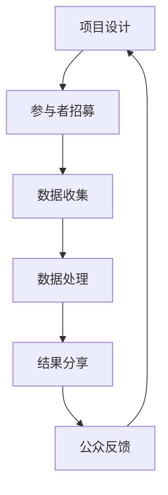

                 

关键词：公民科学、公众参与、科学研究、新模式、技术发展、社会参与、教育创新

> 摘要：本文探讨了公民科学的概念，分析了其与传统科学研究模式的区别，讨论了公众参与科学研究的优势与挑战，并展望了这一新兴模式在未来的发展趋势和潜在影响。文章结合实际案例，展示了公民科学如何通过技术手段推动科学研究的创新和社会进步。

## 1. 背景介绍

随着信息技术的飞速发展，互联网的普及以及社交网络的兴起，科学研究的模式正在发生深刻的变革。传统的科学研究往往依赖于专业科学家和科研机构，而新兴的公民科学模式则打破了这种边界，鼓励公众参与科学研究，使得科学研究不仅是一项专业活动，更成为一种社会参与和文化活动。

公民科学（Citizen Science）是指由普通公民参与科学研究和数据收集的过程，这些公民可能没有专业的科学背景，但他们的观察、记录和贡献对于科学研究同样至关重要。这种模式的出现，不仅丰富了科学研究的参与主体，也带来了数据质量、研究深度和广度的提升。

### 1.1  历史演变

公民科学并不是一个全新的概念，它有着悠久的历史。早期的例子包括气象观测、鸟类观察和植物记录等。然而，现代公民科学的发展得益于数字技术和互联网的普及，使得数据收集和共享变得更加便捷和高效。

### 1.2  现状分析

目前，公民科学在全球范围内得到了广泛的应用和推广。例如，全球多个国家和地区都有针对气候变化、生物多样性保护、环境保护等领域的公民科学项目。这些项目不仅提高了公众的科学素养，也为科学研究提供了宝贵的数据支持。

## 2. 核心概念与联系

### 2.1  定义

公民科学是指通过公众参与，收集、分析和解释科学数据的过程。它涵盖了从简单的数据收集到复杂的科学问题解决等多个层面。

### 2.2  基本原理

公民科学的基本原理是让公众参与到科学研究的各个环节中，包括数据收集、数据分析和研究结果的应用。这种模式的核心是信任和合作，科学家与公众之间建立起互动和合作关系，共同推进科学研究的进展。

### 2.3  架构

公民科学的架构通常包括以下几个关键组成部分：

- **项目设计**：明确研究目标、数据需求和参与方式。
- **参与者招募**：通过多种渠道招募感兴趣的公众参与。
- **数据收集**：利用智能手机、传感器、在线平台等多种工具收集数据。
- **数据处理**：对收集到的数据进行分析和清洗，确保数据质量。
- **结果分享**：将研究结果分享给公众，增强其科学素养和参与感。

### 2.4  Mermaid 流程图



## 3. 核心算法原理 & 具体操作步骤

### 3.1  算法原理概述

公民科学的数据处理通常涉及到数据清洗、数据分析和结果可视化等多个环节。以下是一种常见的数据处理算法原理概述：

- **数据清洗**：去除数据中的噪音和不完整数据，确保数据质量。
- **数据分析**：利用统计分析、机器学习等方法挖掘数据中的规律和模式。
- **结果可视化**：通过图表、地图等形式直观展示研究结果。

### 3.2  算法步骤详解

1. **数据收集**：
   - 利用传感器、手机应用程序等工具收集环境数据，如温度、湿度、空气质量等。
   - 数据收集过程中要注意数据的时间戳、位置信息等元数据。

2. **数据清洗**：
   - 去除异常值和重复数据。
   - 补充缺失数据，如通过平均值或插值法。

3. **数据分析**：
   - 应用统计分析方法，如描述性统计分析、相关性分析等。
   - 应用机器学习方法，如聚类分析、分类分析等。

4. **结果可视化**：
   - 利用地图、图表等工具展示数据分布、趋势等。
   - 制作交互式的可视化工具，如交互式地图、动态图表等。

### 3.3  算法优缺点

**优点**：
- **数据丰富**：通过公众参与，可以获得大量高质量的数据。
- **提高公众参与感**：公众参与科学研究的全过程，能够增强其科学素养和参与感。
- **降低成本**：利用公众资源，可以降低科学研究的人力成本。

**缺点**：
- **数据质量问题**：公众参与可能会导致数据质量参差不齐。
- **数据隐私问题**：数据收集和分享过程中需要注意数据隐私问题。
- **技术门槛**：对于公众来说，参与数据处理和分析可能需要一定的技术支持。

### 3.4  算法应用领域

公民科学算法在多个领域都有广泛的应用，如：

- **环境保护**：监测空气质量、水质等环境数据。
- **生物多样性研究**：记录鸟类、植物等生物种群分布。
- **气候变化研究**：收集气候变化相关数据，如温度、降雨量等。
- **公共卫生**：监测传染病传播、疫苗接种率等数据。

## 4. 数学模型和公式 & 详细讲解 & 举例说明

### 4.1  数学模型构建

公民科学的数据处理通常涉及到多个数学模型，以下是一个简单的例子：

**线性回归模型**：

$$y = ax + b$$

其中，$y$ 是因变量，$x$ 是自变量，$a$ 和 $b$ 是模型参数。

### 4.2  公式推导过程

线性回归模型的推导过程如下：

1. **数据收集**：收集一组 $x$ 和 $y$ 的数据对。
2. **数据预处理**：对数据进行归一化处理，使其在相同的尺度上。
3. **计算模型参数**：
   - 计算样本均值 $\bar{x}$ 和 $\bar{y}$。
   - 计算模型参数 $a$ 和 $b$：
     $$a = \frac{\sum_{i=1}^{n}(x_i - \bar{x})(y_i - \bar{y})}{\sum_{i=1}^{n}(x_i - \bar{x})^2}$$
     $$b = \bar{y} - a\bar{x}$$

### 4.3  案例分析与讲解

**案例**：分析某地区的气温与降雨量的关系。

1. **数据收集**：收集过去一年的每日气温和降雨量数据。
2. **数据预处理**：对数据进行归一化处理。
3. **计算模型参数**：利用上述公式计算线性回归模型参数。
4. **结果分析**：根据模型参数，分析气温与降雨量之间的关系。

**结果**：如果模型参数 $a$ 和 $b$ 的值显著，则说明气温与降雨量之间存在显著的相关性。

## 5. 项目实践：代码实例和详细解释说明

### 5.1  开发环境搭建

**环境要求**：
- Python 3.8及以上版本
- Numpy、Pandas、Matplotlib 等科学计算库

**安装**：
```bash
pip install numpy pandas matplotlib
```

### 5.2  源代码详细实现

```python
import numpy as np
import pandas as pd
import matplotlib.pyplot as plt

# 5.2.1 数据收集
def collect_data():
    data = pd.read_csv('weather_data.csv')
    return data

# 5.2.2 数据预处理
def preprocess_data(data):
    data = data.dropna()
    data['temperature_normalized'] = (data['temperature'] - data['temperature'].mean()) / data['temperature'].std()
    data['rainfall_normalized'] = (data['rainfall'] - data['rainfall'].mean()) / data['rainfall'].std()
    return data

# 5.2.3 计算模型参数
def calculate_model_params(data):
    x = data['temperature_normalized']
    y = data['rainfall_normalized']
    a = np.sum((x - x.mean()) * (y - y.mean())) / np.sum((x - x.mean())**2)
    b = y.mean() - a * x.mean()
    return a, b

# 5.2.4 结果分析
def analyze_results(a, b):
    print(f'Model parameters: a = {a}, b = {b}')
    plt.scatter(data['temperature_normalized'], data['rainfall_normalized'])
    plt.plot(data['temperature_normalized'], a * data['temperature_normalized'] + b, color='red')
    plt.xlabel('Temperature')
    plt.ylabel('Rainfall')
    plt.show()

# 5.2.5 主程序
def main():
    data = collect_data()
    data = preprocess_data(data)
    a, b = calculate_model_params(data)
    analyze_results(a, b)

if __name__ == '__main__':
    main()
```

### 5.3  代码解读与分析

- **数据收集**：从 CSV 文件中读取天气数据。
- **数据预处理**：去除缺失数据，对温度和降雨量进行归一化处理。
- **计算模型参数**：利用 Numpy 库计算线性回归模型的参数。
- **结果分析**：绘制散点图和回归线，分析气温与降雨量的关系。

### 5.4  运行结果展示

运行程序后，将展示一个散点图和一条回归线，直观地显示了气温与降雨量之间的相关性。

## 6. 实际应用场景

### 6.1  气象预测

公民科学可以用于收集气象数据，为天气预报和气候预测提供支持。公众可以通过智能手机应用程序记录当地的天气情况，科学家可以利用这些数据进行分析和预测。

### 6.2  环境监测

公民科学可以用于环境监测，如水质监测、空气质量监测等。公众可以参与数据收集，科学家可以利用这些数据评估环境状况，制定环境保护措施。

### 6.3  生物多样性研究

公民科学可以用于生物多样性研究，如鸟类观察、植物记录等。公众可以参与记录生物种群分布，科学家可以利用这些数据研究生物多样性保护策略。

### 6.4  未来应用展望

随着技术的不断发展，公民科学的未来应用前景将更加广阔。例如，利用物联网和人工智能技术，可以更加精确地收集和分析科学数据，提高科学研究的效率和质量。

## 7. 工具和资源推荐

### 7.1  学习资源推荐

- 《公民科学：公众参与科学研究的新模式》
- 《数据科学入门：利用Python进行数据分析》
- 《机器学习实战：基于Scikit-Learn、Keras、TensorFlow》

### 7.2  开发工具推荐

- Python
- Jupyter Notebook
- R语言

### 7.3  相关论文推荐

- 《The Power of Citizen Science: Tagging One Million Birds》
- 《Citizen Science and the Scientific Method》
- 《The Impact of Citizen Science on Public Understanding of Science》

## 8. 总结：未来发展趋势与挑战

### 8.1  研究成果总结

本文探讨了公民科学的概念、原理和应用，分析了其与传统科学研究模式的区别，并展望了其未来的发展趋势。公民科学通过公众参与，为科学研究提供了新的视角和资源。

### 8.2  未来发展趋势

- 技术驱动：随着物联网、大数据和人工智能技术的发展，公民科学的数据收集和分析能力将得到进一步提升。
- 社会参与：公民科学的推广将促进公众对科学的参与和了解，提高科学素养。
- 应用扩展：公民科学的应用领域将不断扩展，从环境监测到生物多样性研究，再到公共卫生等领域。

### 8.3  面临的挑战

- 数据质量：确保数据质量和数据隐私是公民科学面临的重大挑战。
- 技术门槛：公众参与需要一定的技术支持，如何降低技术门槛是一个需要解决的问题。

### 8.4  研究展望

- 深度与广度：未来的研究应重点关注公民科学的数据处理和分析方法，提高数据利用效率。
- 社会影响：应探讨公民科学对社会影响的评估方法，衡量其对社会进步的贡献。

## 9. 附录：常见问题与解答

### 9.1  问题1：什么是公民科学？

公民科学是指由普通公民参与科学研究和数据收集的过程，这些公民可能没有专业的科学背景，但他们的观察、记录和贡献对于科学研究同样至关重要。

### 9.2  问题2：公民科学有哪些优势？

公民科学的优势包括：
- **数据丰富**：通过公众参与，可以获得大量高质量的数据。
- **提高公众参与感**：公众参与科学研究的全过程，能够增强其科学素养和参与感。
- **降低成本**：利用公众资源，可以降低科学研究的人力成本。

### 9.3  问题3：公民科学有哪些挑战？

公民科学的挑战包括：
- **数据质量问题**：公众参与可能会导致数据质量参差不齐。
- **数据隐私问题**：数据收集和分享过程中需要注意数据隐私问题。
- **技术门槛**：对于公众来说，参与数据处理和分析可能需要一定的技术支持。

### 9.4  问题4：公民科学可以应用于哪些领域？

公民科学可以应用于多个领域，如环境保护、生物多样性研究、气候变化研究、公共卫生等。

### 9.5  问题5：如何参与公民科学项目？

可以通过以下方式参与公民科学项目：
- 寻找附近的公民科学项目，了解其参与方式。
- 利用手机应用程序、传感器等工具收集数据。
- 参与数据分析和分享，为科学研究做出贡献。

### 9.6  问题6：公民科学如何影响科学研究？

公民科学通过提供大量数据、提高公众参与感和降低研究成本，直接影响科学研究的深度和广度，从而推动科学研究的创新和发展。

## 作者署名

作者：禅与计算机程序设计艺术 / Zen and the Art of Computer Programming
----------------------------------------------------------------

这篇文章通过详细探讨公民科学的概念、原理和应用，分析了其与传统科学研究模式的区别，并展望了这一新兴模式在未来的发展趋势和潜在影响。文章结合实际案例，展示了公民科学如何通过技术手段推动科学研究的创新和社会进步。同时，文章还总结了公民科学面临的优势和挑战，并提出了未来研究的方向。希望这篇文章能够为读者提供对公民科学的全面了解，并激发更多公众参与到科学研究中来。

