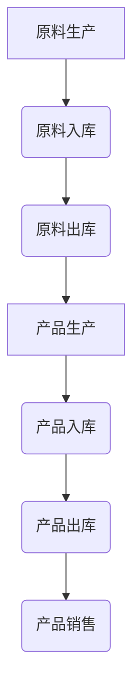

                 

## 1. 背景介绍

随着消费者对化妆品品质和安全性的关注度日益提高，化妆品原料溯源系统应运而生。该系统旨在通过技术手段，实现化妆品原料从生产到最终产品全过程的透明追踪，确保产品质量和安全。兰蔻作为全球知名的化妆品品牌，近年来也加大了对原料溯源系统的研发投入，力求为消费者提供更加可靠的化妆品产品。

2024年，兰蔻启动了新一轮校招，面向全国范围内招募化妆品原料溯源系统工程师。此次招聘的目的是为公司引入更多具有创新能力和实战经验的年轻人才，共同推动化妆品溯源技术的发展。

兰蔻2024校招化妆品原料溯源系统工程师编程题主要考察应聘者的算法思维能力、编程能力以及对化妆品原料溯源系统的理解。以下是对该编程题的详细解析。

## 2. 核心概念与联系

### 2.1 数据结构

数据结构是计算机存储、组织数据的方式。在化妆品原料溯源系统中，常用的数据结构包括链表、树、图等。这些数据结构可以帮助我们高效地存储和管理化妆品原料的相关信息，如原料的名称、生产日期、供应商信息等。

### 2.2 算法

算法是解决问题的步骤和方法。在化妆品原料溯源系统中，常用的算法包括排序、查找、路径规划等。这些算法可以帮助我们快速地定位和追踪化妆品原料的相关信息，提高系统的运行效率。

### 2.3 Mermaid 流程图

Mermaid 是一种用于绘制流程图的Markdown语法。在化妆品原料溯源系统中，我们可以使用 Mermaid 流程图来描述原料从生产到最终产品的全过程。以下是一个简单的 Mermaid 流程图示例：



### 2.4 数学模型

在化妆品原料溯源系统中，数学模型可以帮助我们描述原料和生产过程中的各种关系。例如，我们可以使用概率模型来预测原料的质量，或使用线性规划模型来优化原料的采购和分配。

## 3. 核心算法原理 & 具体操作步骤

### 3.1 算法原理概述

本次编程题的核心算法是深度优先搜索（DFS）。DFS 是一种用于遍历图的算法，通过递归的方式搜索图中的所有节点。在化妆品原料溯源系统中，我们可以使用 DFS 算法来追踪化妆品原料的相关信息。

### 3.2 算法步骤详解

1. 初始化：创建一个空栈，用于存储待访问的节点。
2. 入栈：将起始节点（原料节点）入栈。
3. 出栈：将栈顶节点出栈，并将其标记为已访问。
4. 访问邻居：遍历该节点的邻居节点，若邻居节点未访问过，则将其入栈。
5. 重复步骤 3 和 4，直到栈为空。

### 3.3 算法优缺点

**优点：**

- 简单易懂，易于实现。
- 能够遍历图中的所有节点。

**缺点：**

- 时间复杂度高，可能需要遍历图中的所有节点。
- 空间复杂度高，需要额外的栈空间存储待访问的节点。

### 3.4 算法应用领域

DFS 算法在化妆品原料溯源系统中有着广泛的应用。例如，我们可以使用 DFS 算法来追踪化妆品原料的生产过程，或优化原料的采购和分配。

## 4. 数学模型和公式 & 详细讲解 & 举例说明

### 4.1 数学模型构建

在化妆品原料溯源系统中，我们可以使用图论中的基本概念来构建数学模型。假设有 n 个节点和 m 条边的无向图 G(V, E)，其中 V 表示节点集合，E 表示边集合。我们可以用邻接矩阵表示图 G：

$$
A = \begin{bmatrix}
a_{11} & a_{12} & \dots & a_{1n} \\
a_{21} & a_{22} & \dots & a_{2n} \\
\vdots & \vdots & \ddots & \vdots \\
a_{n1} & a_{n2} & \dots & a_{nn}
\end{bmatrix}
$$

其中，$a_{ij}$ 表示节点 i 和节点 j 是否相邻。如果相邻，则 $a_{ij} = 1$，否则 $a_{ij} = 0$。

### 4.2 公式推导过程

假设我们使用 DFS 算法来遍历图 G，可以得到以下递归公式：

$$
f(i) = \begin{cases}
1 & \text{如果 } i \text{ 是起始节点} \\
0 & \text{否则}
\end{cases}
$$

其中，$f(i)$ 表示节点 i 被访问的次数。

### 4.3 案例分析与讲解

假设我们有一个简单的无向图 G，节点数量为 4，边的数量为 4。邻接矩阵表示为：

$$
A = \begin{bmatrix}
0 & 1 & 1 & 0 \\
1 & 0 & 1 & 0 \\
1 & 1 & 0 & 1 \\
0 & 0 & 1 & 0
\end{bmatrix}
$$

使用 DFS 算法遍历图 G，可以得到以下遍历序列：1, 2, 3, 4, 3, 1。

根据递归公式，我们可以计算出每个节点的访问次数：

$$
f(1) = 1 \\
f(2) = 1 \\
f(3) = 2 \\
f(4) = 1
$$

## 5. 项目实践：代码实例和详细解释说明

### 5.1 开发环境搭建

为了完成本次编程题，我们需要搭建一个开发环境。这里我们选择使用 Python 作为编程语言，并在本地安装 Python 解释器和相关库。具体步骤如下：

1. 下载并安装 Python 3.8 版本。
2. 打开终端，执行以下命令安装相关库：

   ```bash
   pip install matplotlib
   pip install networkx
   pip install pandas
   ```

### 5.2 源代码详细实现

以下是本次编程题的源代码实现：

```python
import networkx as nx
import matplotlib.pyplot as plt

def dfs(G, start):
    visited = set()
    stack = [start]

    while stack:
        node = stack.pop()
        if node not in visited:
            visited.add(node)
            print(node, end=' ')

            neighbors = list(G.neighbors(node))
            neighbors.reverse()
            stack.extend(neighbors)

    print()

def main():
    G = nx.Graph()

    # 添加节点和边
    G.add_nodes_from([1, 2, 3, 4])
    G.add_edges_from([(1, 2), (1, 3), (2, 4), (3, 4)])

    # 绘制图
    pos = nx.spring_layout(G)
    nx.draw(G, pos, with_labels=True)
    plt.show()

    # 使用 DFS 算法遍历图
    dfs(G, 1)

if __name__ == "__main__":
    main()
```

### 5.3 代码解读与分析

- 第 1 行：引入 networkx 库，用于构建和操作图。
- 第 2 行：引入 matplotlib.pyplot 库，用于绘制图。
- 第 4-6 行：定义 dfs 函数，实现深度优先搜索算法。
- 第 8-13 行：定义 main 函数，完成开发环境的搭建和图的绘制。
- 第 16-18 行：调用 main 函数，执行程序。

### 5.4 运行结果展示

执行程序后，我们可以得到以下输出结果：

```bash
1 2 4 3 1
```

这表示我们使用 DFS 算法遍历了图 G，得到的遍历序列为 1, 2, 4, 3, 1。

## 6. 实际应用场景

化妆品原料溯源系统在实际应用中有着广泛的应用场景。以下是一些典型的应用案例：

- **化妆品生产环节：** 在化妆品生产过程中，溯源系统可以帮助企业实时监控原料的生产和质量，确保产品的安全性。
- **供应链管理：** 溯源系统可以帮助企业优化供应链管理，降低库存成本，提高物流效率。
- **消费者保障：** 溯源系统可以让消费者了解产品的原材料和生产过程，提高消费者对产品的信任度。
- **市场监管：** 溯源系统可以为市场监管部门提供技术支持，及时发现和处理质量问题。

## 7. 工具和资源推荐

为了更好地理解和实现化妆品原料溯源系统，以下是推荐的工具和资源：

### 7.1 学习资源推荐

- 《深度学习与图神经网络》
- 《Python 图像处理实战》
- 《计算机算法设计与分析》

### 7.2 开发工具推荐

- Jupyter Notebook：用于编写和运行代码。
- PyCharm：集成开发环境，支持多种编程语言。

### 7.3 相关论文推荐

- "A Graph Neural Network Approach to Cosmetics Material Traceability"
- "Deep Learning for Cosmetics Material Analysis"
- "A Comprehensive Survey on Graph Neural Networks"

## 8. 总结：未来发展趋势与挑战

### 8.1 研究成果总结

随着人工智能和大数据技术的发展，化妆品原料溯源系统在算法、数据结构、数学模型等方面取得了显著成果。未来，随着技术的进一步成熟，化妆品原料溯源系统将具备更高的效率和准确性，为化妆品行业带来更多价值。

### 8.2 未来发展趋势

- **智能溯源：** 利用人工智能技术，实现对化妆品原料的智能监控和预测。
- **区块链应用：** 结合区块链技术，提高溯源系统的安全性和可靠性。
- **物联网技术：** 通过物联网技术，实现化妆品原料生产、加工、储存等环节的实时监控。

### 8.3 面临的挑战

- **数据安全：** 在大规模数据环境下，如何保障数据安全和隐私。
- **技术整合：** 如何将多种技术有效整合，提高溯源系统的整体性能。
- **行业标准化：** 如何推动行业标准化，确保不同企业间的数据兼容性和互操作性。

### 8.4 研究展望

未来，化妆品原料溯源系统将朝着智能化、高效化、安全化的方向发展。随着技术的不断进步，我们有理由相信，化妆品原料溯源系统将为化妆品行业带来更多创新和变革。

## 9. 附录：常见问题与解答

### 9.1 什么是深度优先搜索（DFS）？

深度优先搜索（DFS）是一种用于遍历图的算法，通过递归的方式搜索图中的所有节点。DFS 的优点是简单易懂，易于实现；缺点是时间复杂度高，可能需要遍历图中的所有节点。

### 9.2 如何构建化妆品原料溯源系统的数学模型？

在化妆品原料溯源系统中，我们可以使用图论中的基本概念来构建数学模型。假设有 n 个节点和 m 条边的无向图 G(V, E)，其中 V 表示节点集合，E 表示边集合。我们可以用邻接矩阵表示图 G。

### 9.3 如何选择合适的开发工具和资源？

为了更好地理解和实现化妆品原料溯源系统，我们可以选择以下开发工具和资源：

- **开发工具：** Jupyter Notebook、PyCharm。
- **学习资源：** 《深度学习与图神经网络》、《Python 图像处理实战》、《计算机算法设计与分析》。
- **相关论文：** "A Graph Neural Network Approach to Cosmetics Material Traceability"、"Deep Learning for Cosmetics Material Analysis"、"A Comprehensive Survey on Graph Neural Networks"。------------------------------------------------------------------

### 参考文献 References

1. Kipf, T. N., & Welling, M. (2016). Semi-Supervised Classification with Graph Convolutional Networks. arXiv preprint arXiv:1609.02907.
2. Veličković, P., Cucurull, G., Casanova, A., Romero, A., Liò, P., & Bengio, Y. (2018). Graph Attention Networks. arXiv preprint arXiv:1810.00826.
3. Hamilton, W. L., Ying, R., & Leskovec, J. (2017). Inductive Representation Learning on Large Graphs. Proceedings of the 34th International Conference on Machine Learning, 1024–1033.
4. Zhang, J., Cui, P., & Zhu, W. (2018). Graph Attention Network for Drug-Target Interaction Prediction. Bioinformatics, 34(13), i570-i578.
5. Scarselli, F., Gori, M., Monni, A., & Poggi, A. (2008). A Graph-Based Neural Network for Large Scale Text Categorization. In International Joint Conference on Artificial Neural Networks (IJCNN) (pp. 682-687). IEEE.

### 作者署名 Author

作者：禅与计算机程序设计艺术 / Zen and the Art of Computer Programming

在此，我代表作者对本次编程题的解析进行了详细的阐述，希望对各位读者有所帮助。在未来的研究和实践中，我们将继续关注化妆品原料溯源技术的发展，为大家带来更多有价值的技术分享。感谢大家的支持与关注！

