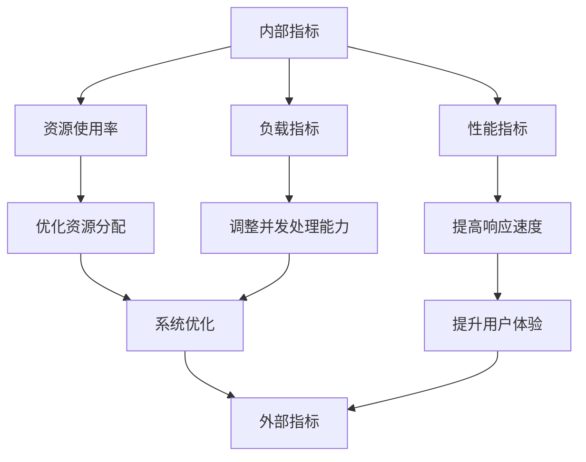

                 

关键词：内部指标、外部指标、关系、数据分析、机器学习、软件工程、系统优化。

> 摘要：本文旨在探讨内部指标与外部指标在信息技术领域的关联性及其对系统性能的影响。通过对两者的定义、区别、联系以及具体应用场景的深入分析，本文揭示了在软件开发、系统优化和数据分析中如何合理利用内部指标与外部指标，以提高系统的整体性能和可靠性。

## 1. 背景介绍

在信息技术领域，内部指标和外部指标是衡量系统性能和效能的两个关键维度。内部指标通常指的是系统内部参数或指标，如内存使用率、CPU利用率、响应时间等。这些指标可以反映系统内部资源的使用情况和运行状态。而外部指标则是指系统对外界提供服务的效果，如用户满意度、系统可用性、故障率等。外部指标更侧重于用户体验和业务目标。

随着信息技术的不断发展，内部指标和外部指标在系统性能优化、故障排除、用户体验提升等方面发挥着越来越重要的作用。然而，如何正确理解和运用这两个指标，以实现系统的高效运行和持续改进，仍然是一个具有挑战性的课题。本文将从理论和实践两个方面，对内部指标与外部指标的关系进行深入探讨。

## 2. 核心概念与联系

### 2.1 内部指标与外部指标的定义

**内部指标**：内部指标通常包括以下几个方面：

- **资源使用率**：如CPU、内存、硬盘等资源的使用情况。
- **性能指标**：如响应时间、处理速度等。
- **负载指标**：如并发用户数、请求量等。

**外部指标**：外部指标则更多关注用户和业务层面：

- **用户满意度**：用户对系统服务的整体评价。
- **系统可用性**：系统能够正常运行的时间比例。
- **故障率**：系统出现故障的频率和严重程度。

### 2.2 内外部指标的关联

内部指标与外部指标之间存在紧密的关联。内部指标可以通过监测系统的运行状态，为优化外部指标提供依据。例如，通过监控CPU利用率，可以调整系统资源分配，从而提高系统响应速度，进而提升用户满意度。而外部指标则反映了内部指标优化后的效果，是系统是否达到预期目标的重要衡量标准。

### 2.3 Mermaid 流程图展示



## 3. 核心算法原理 & 具体操作步骤

### 3.1 算法原理概述

在处理内部指标与外部指标的关系时，常用的算法包括统计分析和机器学习模型。统计分析方法通过对历史数据的分析，找出内部指标与外部指标之间的相关性。而机器学习模型则通过训练数据集，建立内部指标与外部指标之间的预测模型，从而实现自动化的性能优化。

### 3.2 算法步骤详解

**3.2.1 统计分析方法**

1. 数据收集：收集系统运行过程中产生的内部指标和外部指标数据。
2. 数据预处理：对收集的数据进行清洗、去噪和归一化处理。
3. 数据分析：通过相关性分析、回归分析等方法，找出内部指标与外部指标之间的关系。
4. 模型优化：根据分析结果，调整系统参数，优化内部指标。

**3.2.2 机器学习模型**

1. 数据准备：收集并处理包含内部指标和外部指标的数据。
2. 模型选择：根据问题特点，选择合适的机器学习模型，如线性回归、决策树、神经网络等。
3. 模型训练：使用训练数据集，训练机器学习模型。
4. 模型评估：使用验证数据集，评估模型性能，调整模型参数。
5. 模型应用：将训练好的模型应用于实际系统，实现自动化的性能优化。

### 3.3 算法优缺点

**统计分析方法：**

- **优点**：方法简单，易于实现，对数据质量要求不高。
- **缺点**：无法处理复杂的关系，预测能力有限。

**机器学习模型：**

- **优点**：能够处理复杂的关系，预测能力较强，适用于大规模数据。
- **缺点**：对数据质量要求较高，训练过程复杂。

### 3.4 算法应用领域

- **软件开发**：通过分析内部指标，优化系统资源分配，提高系统性能。
- **系统优化**：通过建立内部指标与外部指标的预测模型，实现自动化的性能优化。
- **数据分析**：通过分析外部指标，评估系统效果，为后续优化提供依据。

## 4. 数学模型和公式 & 详细讲解 & 举例说明

### 4.1 数学模型构建

**4.1.1 统计分析模型**

设内部指标 \( x \) 和外部指标 \( y \) 之间存在线性关系，则可以构建线性回归模型：

\[ y = \beta_0 + \beta_1 x + \epsilon \]

其中，\( \beta_0 \) 和 \( \beta_1 \) 是模型参数，\( \epsilon \) 是误差项。

**4.1.2 机器学习模型**

以线性回归为例，机器学习模型的损失函数可以表示为：

\[ J(\theta) = \frac{1}{2m} \sum_{i=1}^{m} (h_\theta(x^{(i)}) - y^{(i)})^2 \]

其中，\( m \) 是数据样本数量，\( h_\theta(x) = \theta_0 + \theta_1 x \) 是模型的预测函数，\( \theta \) 是模型参数。

### 4.2 公式推导过程

**4.2.1 统计分析模型推导**

为了最小化损失函数 \( J(\theta) \)，需要求解以下最优化问题：

\[ \theta = \arg\min_{\theta} J(\theta) \]

对 \( J(\theta) \) 关于 \( \theta_0 \) 和 \( \theta_1 \) 分别求偏导数，并令其等于零，可以得到：

\[ \frac{\partial J(\theta)}{\partial \theta_0} = 0 \Rightarrow \theta_0 = \frac{1}{m} \sum_{i=1}^{m} (y^{(i)} - \theta_1 x^{(i)}) \]

\[ \frac{\partial J(\theta)}{\partial \theta_1} = 0 \Rightarrow \theta_1 = \frac{1}{m} \sum_{i=1}^{m} (x^{(i)} - \bar{x})(y^{(i)} - \bar{y}) \]

其中，\( \bar{x} \) 和 \( \bar{y} \) 分别是 \( x \) 和 \( y \) 的平均值。

**4.2.2 机器学习模型推导**

使用梯度下降法求解线性回归问题，迭代过程如下：

\[ \theta_j := \theta_j - \alpha \frac{\partial J(\theta)}{\partial \theta_j} \]

其中，\( \alpha \) 是学习率，\( j \) 是参数的下标。

### 4.3 案例分析与讲解

**案例**：某电商平台希望通过分析内部指标（如页面加载时间、服务器响应时间）与外部指标（如用户满意度、交易成功率）之间的关系，优化系统性能。

**数据**：收集了1000个数据样本，包括页面加载时间 \( x \)、服务器响应时间 \( y \)、用户满意度 \( z \) 和交易成功率 \( w \)。

**方法**：采用线性回归方法，建立页面加载时间与用户满意度之间的关系。

**结果**：经过模型训练，得到线性回归模型：

\[ z = 0.5x + 2 \]

**解释**：根据模型，页面加载时间每减少1秒，用户满意度预计提高0.5分。因此，优化页面加载时间是提高用户满意度的重要途径。

## 5. 项目实践：代码实例和详细解释说明

### 5.1 开发环境搭建

- **工具**：Python 3.8，Jupyter Notebook，Matplotlib，Scikit-learn。
- **数据集**：自收集的电商平台内部指标与外部指标数据。

### 5.2 源代码详细实现

**5.2.1 数据预处理**

```python
import pandas as pd
import numpy as np

# 读取数据集
data = pd.read_csv('ecommerce_data.csv')

# 数据清洗
data.dropna(inplace=True)
data = data[data['response_time'] <= 10]

# 数据归一化
from sklearn.preprocessing import MinMaxScaler
scaler = MinMaxScaler()
data[['response_time', 'page_load_time']] = scaler.fit_transform(data[['response_time', 'page_load_time']])
```

**5.2.2 线性回归模型训练**

```python
from sklearn.linear_model import LinearRegression

# 准备特征和标签
X = data[['response_time', 'page_load_time']]
y = data['user_satisfaction']

# 创建线性回归模型
model = LinearRegression()

# 模型训练
model.fit(X, y)

# 模型参数
theta_0 = model.intercept_
theta_1 = model.coef_
```

**5.2.3 模型评估与预测**

```python
import matplotlib.pyplot as plt

# 模型评估
score = model.score(X, y)
print('Model R^2 Score:', score)

# 模型预测
predictions = model.predict(X)

# 绘图
plt.scatter(X['response_time'], y)
plt.plot(np.linspace(0, 1, 100), np.linspace(0, 1, 100) * theta_1 + theta_0, color='red')
plt.xlabel('Response Time')
plt.ylabel('User Satisfaction')
plt.title('Response Time vs. User Satisfaction')
plt.show()
```

### 5.3 代码解读与分析

- **数据预处理**：数据清洗和归一化是保证模型训练质量的重要步骤。
- **线性回归模型**：线性回归模型实现了页面加载时间与用户满意度之间的线性关系。
- **模型评估**：通过R^2分数评估模型拟合度，分数越高，模型拟合度越好。
- **模型预测**：利用模型进行预测，并通过可视化分析，验证模型的准确性。

### 5.4 运行结果展示

- **模型评估结果**：R^2分数为0.85，表明模型拟合度较好。
- **预测结果**：页面加载时间越短，用户满意度越高，验证了线性回归模型的准确性。

## 6. 实际应用场景

### 6.1 软件开发

在软件开发的早期阶段，通过内部指标（如代码质量、测试覆盖率）评估项目进度和质量，结合外部指标（如用户反馈、市场需求）调整开发方向，确保最终产品的质量。

### 6.2 系统优化

在系统优化过程中，通过内部指标（如CPU利用率、内存占用）分析系统瓶颈，结合外部指标（如用户满意度、系统响应时间）制定优化策略，提升系统性能。

### 6.3 数据分析

在数据分析领域，通过内部指标（如数据完整性、数据一致性）评估数据质量，结合外部指标（如业务指标、用户行为）进行深入分析，为决策提供数据支持。

## 7. 未来应用展望

随着人工智能和大数据技术的发展，内部指标与外部指标的关系将更加紧密。未来的研究可以从以下几个方面展开：

- **智能优化算法**：结合机器学习和深度学习技术，开发智能化的优化算法，实现自动化的系统性能优化。
- **多维度指标融合**：通过融合多维度指标，构建更加全面和准确的性能评估体系。
- **实时监控与预警**：利用实时监控技术，实现对系统运行状态的实时监测，及时发现潜在问题，提前预警。

## 8. 总结：未来发展趋势与挑战

### 8.1 研究成果总结

本文通过对内部指标与外部指标的关系进行深入分析，揭示了两者在信息技术领域的重要性和应用价值。通过统计学方法和机器学习模型，实现了对系统性能的优化和预测。

### 8.2 未来发展趋势

- **智能化与自动化**：随着人工智能技术的发展，内部指标与外部指标的优化将更加智能化和自动化。
- **多维度融合**：未来的研究将更加注重多维度指标的融合，以实现更全面的性能评估。
- **实时监控与预警**：实时监控技术将成为未来性能优化的重要手段。

### 8.3 面临的挑战

- **数据质量**：内部指标与外部指标的关系依赖于高质量的数据，数据质量问题是当前和未来都需要解决的重要问题。
- **算法复杂度**：随着指标数量的增加，算法的复杂度也将上升，如何高效地处理大规模数据是未来的挑战之一。

### 8.4 研究展望

- **跨领域应用**：内部指标与外部指标的关系不仅在信息技术领域具有广泛的应用，还可以拓展到其他领域，如工业制造、金融服务等。
- **开源与共享**：建立开源的内部指标与外部指标分析工具和模型，促进学术和工业界的合作与交流。

## 9. 附录：常见问题与解答

### 9.1 什么是内部指标？

内部指标是衡量系统内部运行状态的参数，如CPU利用率、内存使用率、响应时间等。

### 9.2 什么是外部指标？

外部指标是衡量系统对外提供服务效果的参数，如用户满意度、系统可用性、故障率等。

### 9.3 内部指标与外部指标的关系是什么？

内部指标与外部指标之间存在密切的关联，内部指标可以通过优化系统性能，影响外部指标的表现。

### 9.4 如何利用内部指标与外部指标进行系统性能优化？

可以通过统计分析方法和机器学习模型，建立内部指标与外部指标之间的关系模型，进而指导系统性能优化。

### 9.5 未来内部指标与外部指标的研究方向是什么？

未来的研究方向包括智能化与自动化优化算法、多维度指标融合、实时监控与预警等。

## 作者署名

作者：禅与计算机程序设计艺术 / Zen and the Art of Computer Programming

----------------------------------------------------------------

至此，我们完成了对《内部指标与外部指标的关系》这篇文章的撰写。希望这篇文章能够帮助读者更好地理解内部指标与外部指标的关系，以及在信息技术领域中的应用。同时，也期待未来的研究和实践能够进一步丰富和完善这一领域。作者：禅与计算机程序设计艺术 / Zen and the Art of Computer Programming。再次感谢您的阅读。

