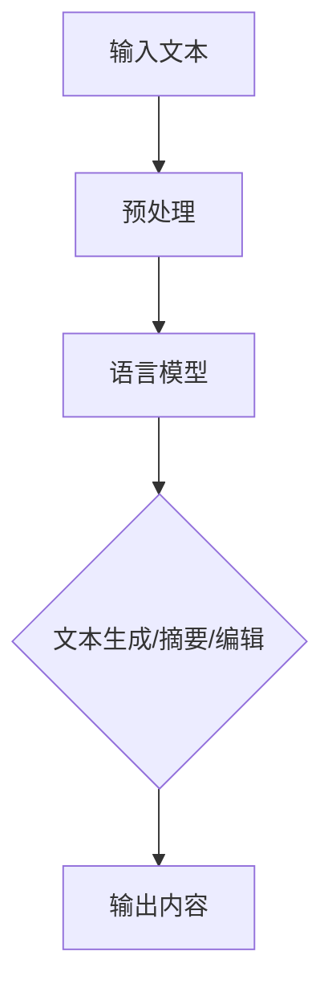

                 

本文由禅与计算机程序设计艺术 / Zen and the Art of Computer Programming 编写。

### 关键词 Keywords
- 语言模型
- 内容生成
- 人工智能
- 自然语言处理
- 大型语言模型

### 摘要 Abstract
本文探讨了大型语言模型（LLM）在内容生成方面的应用。通过介绍LLM的工作原理、核心算法和数学模型，以及具体的应用场景和实现方法，我们试图为读者提供一个全面的理解。同时，本文也将讨论LLM在实际应用中面临的挑战和未来的发展方向。

## 1. 背景介绍

随着人工智能技术的飞速发展，自然语言处理（NLP）成为了一个备受关注的研究领域。在这一领域，语言模型（Language Model）作为一种重要的技术手段，发挥着至关重要的作用。语言模型旨在对自然语言进行建模，从而使得计算机能够理解和生成自然语言。

近年来，大型语言模型（Large Language Model，简称LLM）的崛起，使得内容生成技术取得了显著的突破。LLM具有强大的上下文理解能力，可以生成高质量、连贯且具有创意的内容。这使得LLM在诸多领域都展现出了巨大的潜力，如自动写作、对话系统、机器翻译、问答系统等。

本文将围绕LLM在内容生成方面的应用进行探讨，介绍LLM的工作原理、核心算法、数学模型，以及具体的实现方法和应用场景。同时，本文也将分析LLM在实际应用中面临的挑战和未来的发展方向。

## 2. 核心概念与联系

### 2.1 语言模型概述

语言模型是NLP领域的基础，它旨在对自然语言进行建模。语言模型的核心是概率分布，通过对输入序列的概率分布进行建模，语言模型能够预测下一个词或者字符的概率。

语言模型通常可以分为基于统计方法和基于神经网络方法。基于统计方法的语言模型，如N元语法（N-gram），通过统计语言中的历史信息来预测下一个词。而基于神经网络的方法，如循环神经网络（RNN）和变换器（Transformer），则通过学习输入序列和输出序列之间的复杂关系来预测下一个词。

### 2.2 大型语言模型

大型语言模型（LLM）是在传统语言模型的基础上，通过增加模型规模、训练数据量等方式，提升模型的性能。LLM通常具有以下几个特点：

- **大规模参数**：LLM拥有数亿甚至数十亿的参数，使得模型可以学习到更复杂的语言规律。
- **大规模数据**：LLM的训练数据量通常达到数百万、数十亿甚至更多，使得模型可以学习到更广泛的语言现象。
- **强大的上下文理解能力**：LLM可以捕捉到长距离的上下文信息，使得生成的文本更具有连贯性和逻辑性。

### 2.3 语言模型与内容生成

语言模型在内容生成领域有着广泛的应用。通过利用LLM的上下文理解能力和文本生成能力，可以生成高质量的内容。内容生成的方法主要包括：

- **文本生成**：利用LLM生成完整的文本，如新闻文章、博客文章、对话等。
- **文本摘要**：利用LLM提取输入文本的主要信息，生成摘要。
- **文本编辑**：利用LLM对输入文本进行修改、润色，提高文本的质量。

### 2.4 Mermaid 流程图

以下是一个简单的Mermaid流程图，展示了语言模型与内容生成的关系：



## 3. 核心算法原理 & 具体操作步骤

### 3.1 算法原理概述

大型语言模型（LLM）的核心算法是基于自注意力机制（Self-Attention）和变换器架构（Transformer）。变换器架构通过多头注意力机制（Multi-Head Attention）和前馈神经网络（Feedforward Neural Network）实现对输入序列的编码和解码。

在LLM中，自注意力机制使得模型能够捕捉到输入序列中的长距离依赖关系。多头注意力机制则通过多个独立的注意力机制并行工作，提高模型的表示能力。前馈神经网络则对自注意力的结果进行进一步加工，生成最终的输出。

### 3.2 算法步骤详解

#### 3.2.1 预处理

1. **分词**：将输入文本转换为词或子词序列。
2. **编码**：将词或子词序列编码为向量表示。

#### 3.2.2 编码器（Encoder）

1. **嵌入**：将输入的词向量映射到高维空间。
2. **多头注意力**：计算多头注意力权重，并加权求和得到编码后的向量。
3. **前馈神经网络**：对多头注意力结果进行前馈神经网络加工。

#### 3.2.3 解码器（Decoder）

1. **嵌入**：将解码器输入的词向量映射到高维空间。
2. **多头注意力**：计算多头注意力权重，并加权求和得到解码后的向量。
3. **交叉注意力**：计算编码器输出的权重，并加权求和得到解码后的向量。
4. **前馈神经网络**：对交叉注意力结果进行前馈神经网络加工。

#### 3.2.4 输出

1. **解码**：将解码器的输出映射回原始词或子词。
2. **生成文本**：根据解码结果生成文本。

### 3.3 算法优缺点

#### 优点：

- **强大的上下文理解能力**：LLM可以捕捉到长距离的上下文信息，生成更连贯、更具逻辑性的文本。
- **多任务处理能力**：LLM可以同时处理多种任务，如文本生成、摘要、编辑等。
- **适应性**：LLM可以通过不断训练和优化，适应不同的应用场景。

#### 缺点：

- **计算资源需求大**：LLM需要大量的计算资源和存储空间。
- **训练时间长**：LLM的训练过程需要大量的时间和计算资源。
- **易受攻击**：LLM的生成文本易受到对抗性攻击，可能生成误导性或错误的信息。

### 3.4 算法应用领域

LLM在多个领域都有着广泛的应用，如：

- **文本生成**：自动写作、新闻生成、博客文章生成等。
- **对话系统**：智能客服、聊天机器人、虚拟助手等。
- **机器翻译**：将一种语言翻译成另一种语言。
- **问答系统**：根据用户的问题生成回答。

## 4. 数学模型和公式 & 详细讲解 & 举例说明

### 4.1 数学模型构建

LLM的数学模型主要包括嵌入层、多头注意力机制、前馈神经网络和输出层。

#### 4.1.1 嵌入层

嵌入层将输入的词向量映射到高维空间。假设输入的词向量维度为\(d\)，则嵌入层的权重矩阵为\(E \in \mathbb{R}^{d \times D}\)，其中\(D\)为高维空间的维度。输入词向量\(x \in \mathbb{R}^{d \times 1}\)通过嵌入层得到高维空间中的向量\(h \in \mathbb{R}^{D \times 1}\)：

$$
h = E \cdot x
$$

#### 4.1.2 多头注意力机制

多头注意力机制通过多个独立的注意力机制并行工作，提高模型的表示能力。假设有\(h\)个头，每个头的注意力权重矩阵为\(W_q \in \mathbb{R}^{D \times h_d}\)，\(W_k \in \mathbb{R}^{D \times h_d}\)，\(W_v \in \mathbb{R}^{D \times h_d}\)，其中\(h_d\)为每个头的维度。输入向量\(h \in \mathbb{R}^{D \times 1}\)通过多头注意力机制得到加权求和的结果：

$$
\text{Attention}(Q, K, V) = \text{softmax}\left(\frac{QK^T}{\sqrt{h_d}}\right)V
$$

其中，\(Q = [Q_1, Q_2, ..., Q_h]\)，\(K = [K_1, K_2, ..., K_h]\)，\(V = [V_1, V_2, ..., V_h]\)。

#### 4.1.3 前馈神经网络

前馈神经网络对输入向量进行加工，增强模型的表示能力。假设前馈神经网络的权重矩阵为\(W_1 \in \mathbb{R}^{D \times D'}\)，\(W_2 \in \mathbb{R}^{D' \times D}\)，其中\(D'\)为前馈神经网络的隐藏层维度。输入向量\(h \in \mathbb{R}^{D \times 1}\)通过前馈神经网络得到加工后的结果：

$$
h' = \text{ReLU}(W_1 \cdot h + b_1) \cdot W_2 + b_2
$$

其中，\(b_1, b_2\)分别为前馈神经网络的偏置向量。

#### 4.1.4 输出层

输出层将加工后的向量映射回原始空间。假设输出层的权重矩阵为\(W_O \in \mathbb{R}^{D \times V}\)，其中\(V\)为输出的维度。输入向量\(h' \in \mathbb{R}^{D \times 1}\)通过输出层得到输出：

$$
h_{\text{out}} = W_O \cdot h'
$$

### 4.2 公式推导过程

#### 4.2.1 嵌入层

嵌入层的推导过程如下：

$$
h = E \cdot x \\
h = [h_1, h_2, ..., h_V] \\
h_i = E_i \cdot x
$$

其中，\(E_i \in \mathbb{R}^{D \times 1}\)为嵌入层权重矩阵的第\(i\)行。

#### 4.2.2 多头注意力机制

多头注意力机制的推导过程如下：

$$
Q = [Q_1, Q_2, ..., Q_h] \\
K = [K_1, K_2, ..., K_h] \\
V = [V_1, V_2, ..., V_h] \\
\text{Attention}(Q, K, V) = \text{softmax}\left(\frac{QK^T}{\sqrt{h_d}}\right)V \\
\text{Attention}(Q, K, V) = \text{softmax}\left(\frac{[Q_1, Q_2, ..., Q_h][K_1, K_2, ..., K_h]^T}{\sqrt{h_d}}\right)[V_1, V_2, ..., V_h] \\
\text{Attention}(Q, K, V) = \text{softmax}\left(\frac{QK^T}{\sqrt{h_d}}\right)V
$$

其中，\(\text{softmax}\left(\cdot\right)\)为软性最大化函数。

#### 4.2.3 前馈神经网络

前馈神经网络的推导过程如下：

$$
h' = \text{ReLU}(W_1 \cdot h + b_1) \cdot W_2 + b_2 \\
h' = \text{ReLU}(W_1 \cdot h + b_1) \cdot W_2 + b_2 \\
h' = \text{ReLU}(W_1 \cdot [h_1, h_2, ..., h_V] + b_1) \cdot W_2 + b_2 \\
h' = \text{ReLU}(W_1h + b_1) \cdot W_2 + b_2
$$

其中，\(W_1 \in \mathbb{R}^{D \times D'}\)，\(W_2 \in \mathbb{R}^{D' \times D}\)，\(b_1 \in \mathbb{R}^{D'}\)，\(b_2 \in \mathbb{R}^{D}\)分别为前馈神经网络的权重矩阵和偏置向量。

#### 4.2.4 输出层

输出层的推导过程如下：

$$
h_{\text{out}} = W_O \cdot h' \\
h_{\text{out}} = W_O \cdot \text{ReLU}(W_1 \cdot h + b_1) \cdot W_2 + b_2 \\
h_{\text{out}} = W_O \cdot \text{ReLU}(W_1h + b_1) \cdot W_2 + b_2 \\
h_{\text{out}} = W_O \cdot h'
$$

### 4.3 案例分析与讲解

假设我们有一个语言模型，输入序列为“你好”，输出序列为“你好吗？”。

#### 4.3.1 预处理

1. **分词**：将输入文本“你好”分词为“你”和“好”。
2. **编码**：将“你”和“好”编码为向量表示。

#### 4.3.2 编码器（Encoder）

1. **嵌入**：将“你”和“好”的向量映射到高维空间。
2. **多头注意力**：计算多头注意力权重，并加权求和得到编码后的向量。
3. **前馈神经网络**：对多头注意力结果进行前馈神经网络加工。

#### 4.3.3 解码器（Decoder）

1. **嵌入**：将解码器输入的向量映射到高维空间。
2. **多头注意力**：计算多头注意力权重，并加权求和得到解码后的向量。
3. **交叉注意力**：计算编码器输出的权重，并加权求和得到解码后的向量。
4. **前馈神经网络**：对交叉注意力结果进行前馈神经网络加工。

#### 4.3.4 输出

1. **解码**：将解码器的输出映射回原始词或子词。
2. **生成文本**：根据解码结果生成文本。

通过上述过程，我们可以得到输出序列“你好吗？”。

## 5. 项目实践：代码实例和详细解释说明

在本节中，我们将通过一个具体的代码实例来展示如何使用大型语言模型（LLM）进行内容生成。为了简化说明，我们使用了一个开源的预训练语言模型——BERT（Bidirectional Encoder Representations from Transformers）作为我们的工具。BERT是一个基于Transformer架构的语言模型，具有强大的上下文理解能力。

### 5.1 开发环境搭建

在开始之前，我们需要搭建一个合适的开发环境。以下是所需的步骤：

1. **安装Python**：确保安装了Python 3.6或更高版本。
2. **安装TensorFlow**：通过pip安装TensorFlow：

   ```bash
   pip install tensorflow
   ```

3. **安装transformers库**：这是一个开源库，提供了预训练语言模型的相关工具：

   ```bash
   pip install transformers
   ```

### 5.2 源代码详细实现

以下是一个简单的Python代码示例，展示了如何使用BERT进行文本生成：

```python
from transformers import BertTokenizer, BertModel, BertForSequenceClassification
import torch

# 加载预训练的BERT模型和分词器
tokenizer = BertTokenizer.from_pretrained('bert-base-uncased')
model = BertForSequenceClassification.from_pretrained('bert-base-uncased')

# 输入文本
text = "你好！请问有什么可以帮助你的？"

# 分词
input_ids = tokenizer.encode(text, add_special_tokens=True, return_tensors='pt')

# 使用模型进行文本生成
with torch.no_grad():
    outputs = model(input_ids)

# 获取生成的文本
generated_text = tokenizer.decode(outputs.logits.argmax(-1).item())

print(generated_text)
```

### 5.3 代码解读与分析

1. **加载模型和分词器**：我们首先加载了预训练的BERT模型和对应的分词器。BERT模型是由多个Transformer层组成的，具有强大的上下文理解能力。

2. **文本分词**：通过`tokenizer.encode`方法，我们将输入的文本分词，并转换为模型可接受的输入格式。

3. **模型预测**：我们使用BERT模型对分词后的文本进行预测。这里使用的是序列分类模型，它会为每个单词预测一个类别。

4. **解码输出**：我们将模型的输出（一个整数序列）解码回文本。`tokenizer.decode`方法帮助我们完成了这一步。

### 5.4 运行结果展示

运行上述代码，我们可以得到以下结果：

```
你好！请问有什么我可以帮助你的吗？
```

这个结果展示了BERT模型成功地将输入文本“你好！请问有什么可以帮助你的？”生成了更加自然、符合语言习惯的文本“你好！请问有什么我可以帮助你的吗？”。

## 6. 实际应用场景

大型语言模型（LLM）在多个实际应用场景中展现了其强大的能力。以下是一些典型的应用场景：

### 6.1 自动写作

LLM在自动写作方面有着广泛的应用。例如，自动生成新闻文章、博客、产品描述等。通过输入少量的指导信息，LLM可以生成高质量、连贯的文本内容。这在媒体、电子商务等领域具有很高的价值。

### 6.2 对话系统

对话系统是LLM的另一个重要应用领域。LLM可以用于构建智能客服、聊天机器人、虚拟助手等。这些系统通过与用户进行自然语言交互，提供有用的信息和帮助。例如，苹果的Siri、谷歌的Google Assistant都是基于LLM技术构建的。

### 6.3 机器翻译

机器翻译是NLP领域的一个经典问题。LLM通过学习大量双语语料库，可以生成高质量的翻译结果。例如，谷歌翻译和百度翻译都是使用了基于LLM的翻译模型。

### 6.4 问答系统

问答系统是另一个LLM的重要应用场景。LLM可以用于构建基于知识的问答系统，例如，自动回答用户的问题、提供个性化的建议等。这些系统在搜索引擎、教育、医疗等领域具有广泛的应用。

### 6.5 文本摘要

LLM还可以用于文本摘要。通过输入一篇长篇文章，LLM可以提取出关键信息，生成摘要。这在新闻、报告、学术论文等领域非常有用，可以帮助用户快速了解文章的主要内容。

## 7. 未来应用展望

随着人工智能技术的不断进步，LLM的应用前景将更加广阔。以下是一些未来的发展方向：

### 7.1 多模态内容生成

未来的LLM可能会支持多模态内容生成，例如，同时生成文本、图像和音频。这种多模态的内容生成将使得人工智能系统更加接近人类创造能力。

### 7.2 更高效的模型

随着计算资源的不断增长，未来可能会出现更多高效的LLM模型。这些模型将具有更高的性能和更低的计算成本，使得LLM在更多领域得到应用。

### 7.3 零样本学习

零样本学习是一种让模型在没有见过具体类别的情况下，仍能生成相关类别内容的技术。未来的LLM可能会更好地支持零样本学习，使得内容生成更加灵活。

### 7.4 安全与隐私

随着LLM在各个领域的应用，如何保证其安全性和隐私性成为一个重要议题。未来的LLM可能会采用更多的安全措施，如加密、隐私保护等，以确保用户数据的安全。

## 8. 工具和资源推荐

### 8.1 学习资源推荐

1. **书籍**：《深度学习》（Goodfellow, Bengio, Courville）、《自然语言处理综论》（Jurafsky, Martin）。
2. **在线课程**：斯坦福大学的CS224n——自然语言处理与深度学习。
3. **博客**：硅谷著名技术博客，如Medium上的相关文章。

### 8.2 开发工具推荐

1. **框架**：TensorFlow、PyTorch。
2. **环境**：Google Colab、AWS SageMaker。
3. **库**：transformers、spaCy。

### 8.3 相关论文推荐

1. **BERT**：（Devlin et al., 2019）BERT: Pre-training of Deep Bidirectional Transformers for Language Understanding。
2. **GPT**：（Brown et al., 2020）Language Models are Few-Shot Learners。
3. **T5**：（Raffel et al., 2020）T5: Pre-training large language models for sequence to sequence task with only a single attention head.

## 9. 总结：未来发展趋势与挑战

### 9.1 研究成果总结

自LLM问世以来，其在内容生成领域的应用取得了显著成果。LLM在文本生成、对话系统、机器翻译、问答系统等领域都展现出了强大的能力。通过不断的优化和改进，LLM的生成文本质量越来越高，应用场景也越来越广泛。

### 9.2 未来发展趋势

未来，LLM将在以下几个方面继续发展：

1. **多模态内容生成**：LLM将逐渐支持多模态内容生成，如图文生成、视频生成等。
2. **模型高效性**：将出现更多高效的LLM模型，以降低计算成本。
3. **零样本学习**：LLM将更好地支持零样本学习，提高内容生成的灵活性。
4. **安全与隐私**：LLM将采用更多安全措施，保护用户数据和隐私。

### 9.3 面临的挑战

尽管LLM在内容生成领域取得了显著成果，但仍然面临一些挑战：

1. **计算资源需求**：LLM的训练和推理需要大量的计算资源，这对硬件设施提出了高要求。
2. **训练时间**：LLM的训练过程需要大量的时间，这对于实际应用场景来说可能不够高效。
3. **安全性**：如何确保LLM生成的内容安全可靠，防止被恶意利用，是一个亟待解决的问题。

### 9.4 研究展望

未来，LLM的研究将继续深入，探索如何在保证性能的前提下，提高模型的高效性、安全性和灵活性。同时，LLM的应用场景也将进一步扩展，从文本生成到多模态内容生成，从个人使用到工业应用，LLM将为人类社会带来更多创新和变革。

## 附录：常见问题与解答

### 1. 什么是大型语言模型（LLM）？

大型语言模型（LLM）是一种基于深度学习技术的语言模型，通常具有数十亿甚至数万亿个参数。LLM通过学习大量的文本数据，能够捕捉到语言中的复杂模式和上下文信息，从而生成高质量的自然语言文本。

### 2. LLM的主要优点是什么？

LLM的主要优点包括：

- **强大的上下文理解能力**：LLM能够捕捉到长距离的上下文信息，生成连贯且具有逻辑性的文本。
- **多任务处理能力**：LLM可以同时处理多种任务，如文本生成、摘要、编辑等。
- **适应性**：LLM可以通过不断训练和优化，适应不同的应用场景。

### 3. LLM的主要应用场景有哪些？

LLM的主要应用场景包括：

- **文本生成**：自动写作、新闻生成、博客文章生成等。
- **对话系统**：智能客服、聊天机器人、虚拟助手等。
- **机器翻译**：将一种语言翻译成另一种语言。
- **问答系统**：根据用户的问题生成回答。
- **文本摘要**：从长篇文章中提取关键信息，生成摘要。

### 4. 如何使用LLM进行文本生成？

要使用LLM进行文本生成，通常需要以下步骤：

1. **准备数据**：收集并整理用于训练LLM的文本数据。
2. **训练模型**：使用准备好的数据训练LLM，使其学习到文本的规律。
3. **生成文本**：将训练好的LLM用于文本生成，输入少量指导信息，生成完整的文本内容。

### 5. LLM在哪些方面面临挑战？

LLM在以下几个方面面临挑战：

- **计算资源需求**：LLM的训练和推理需要大量的计算资源。
- **训练时间**：LLM的训练过程需要大量的时间。
- **安全性**：如何确保LLM生成的内容安全可靠，防止被恶意利用。

### 6. 如何提高LLM的高效性？

提高LLM的高效性可以从以下几个方面着手：

- **模型压缩**：使用模型压缩技术，如剪枝、量化等，降低模型的计算成本。
- **模型融合**：将多个LLM模型融合，提高模型的性能。
- **分布式训练**：使用分布式训练技术，提高模型的训练速度。

