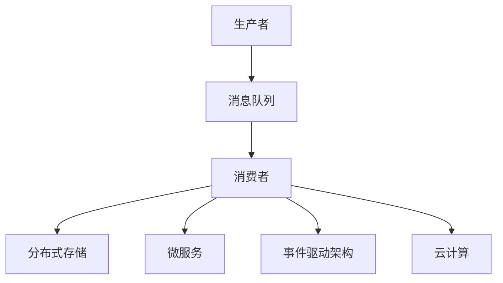

                 

关键词：分布式消息队列、架构设计、性能优化、系统可靠性、高并发处理、一致性保障、消息中间件

> 摘要：本文将深入探讨分布式消息队列的设计原则和优化策略，从核心概念到具体实现，再到实际应用场景，全面解析如何构建高效、可靠的消息系统。

## 1. 背景介绍

在当今信息化的社会中，分布式系统已经成为企业级应用架构的重要组成部分。分布式消息队列作为分布式系统中的核心组件，承担着异步通信、任务调度、事件驱动等关键功能。随着互联网应用的日益复杂，消息队列系统需要处理海量数据、支持高并发、保障系统可靠性，因此其设计与优化变得尤为重要。

本文将围绕分布式消息队列的以下几个关键方面展开讨论：

1. **核心概念与联系**：介绍消息队列的基本概念、作用及与相关技术的联系。
2. **核心算法原理与具体操作步骤**：分析消息队列的核心算法，并详细阐述其操作步骤。
3. **数学模型和公式**：通过数学模型和公式，解释消息队列性能优化的理论基础。
4. **项目实践：代码实例与详细解释说明**：结合具体代码实例，展示消息队列的实际开发过程。
5. **实际应用场景**：探讨消息队列在不同领域的应用，如电商、金融、物联网等。
6. **工具和资源推荐**：推荐学习资源和开发工具，助力读者深入理解和实践。
7. **总结：未来发展趋势与挑战**：总结研究成果，展望未来发展趋势，探讨面临的挑战。

## 2. 核心概念与联系

### 消息队列的基本概念

消息队列（Message Queue，MQ）是一种用于在分布式系统中传递消息的通信服务。它允许多个生产者（Producer）将消息发送到队列中，同时多个消费者（Consumer）可以从队列中读取消息。消息队列的核心功能是实现异步通信，使得生产者和消费者不需要在同一时间同一地点运行，从而提高系统的可扩展性和容错性。

### 消息队列的作用

1. **解耦**：通过消息队列，生产者和消费者可以独立扩展，减少系统之间的直接耦合。
2. **异步处理**：消息队列允许生产者发送消息后立即返回，而无需等待消费者的处理结果，提高系统的响应速度。
3. **负载均衡**：消息队列可以将任务均匀地分配给多个消费者，实现负载均衡。
4. **容错性**：消息队列可以保证消息的可靠传递，即使部分消费者失败，消息也不会丢失。

### 消息队列与相关技术的联系

1. **分布式存储**：消息队列与分布式存储系统（如Kafka、RabbitMQ等）密切相关，它们共同构建起分布式系统的通信基础。
2. **微服务架构**：消息队列是微服务架构中实现服务间通信的重要手段，可以促进服务间的解耦和协同工作。
3. **事件驱动架构**：消息队列是实现事件驱动架构的核心组件，通过消息传递驱动系统中的各种业务逻辑。
4. **云计算**：消息队列在云计算环境中发挥着重要作用，可以帮助云服务提供商实现大规模分布式消息处理。

### Mermaid 流程图

以下是一个简单的Mermaid流程图，展示了消息队列的核心概念和联系：



## 3. 核心算法原理 & 具体操作步骤

### 3.1 算法原理概述

消息队列的核心算法主要包括消息生产、消息传递、消息消费以及消息持久化等。以下是对这些算法原理的概述：

1. **消息生产**：生产者将消息发送到消息队列，通常需要实现消息的格式化、压缩和加密等功能。
2. **消息传递**：消息队列负责将消息传递给消费者，通过轮询、拉取或者基于事件的方式实现。
3. **消息消费**：消费者从消息队列中读取消息，并执行相应的业务逻辑。
4. **消息持久化**：为了保障消息的可靠性，消息队列需要将消息持久化到磁盘或者分布式存储系统中。

### 3.2 算法步骤详解

1. **消息生产**
    - 生产者创建消息对象，并设置消息的属性，如消息类型、优先级、过期时间等。
    - 生产者将消息序列化，并压缩或加密消息内容。
    - 生产者将消息发送到消息队列，通常通过TCP/IP或者HTTP等协议实现。

2. **消息传递**
    - 消息队列将消息存储在内存或者磁盘缓存中，并提供查询接口，以便消费者检索消息。
    - 消息队列可以通过轮询、拉取或者基于事件的机制，将消息推送到消费者。

3. **消息消费**
    - 消费者连接到消息队列，并订阅特定的消息类型。
    - 当消息队列中有符合订阅条件的新消息时，消费者可以从队列中读取消息。
    - 消费者执行消息中的业务逻辑，并返回处理结果。

4. **消息持久化**
    - 消息队列将消息持久化到磁盘或者分布式存储系统中，以确保消息的可靠性。
    - 持久化过程中，消息队列需要实现消息的备份和恢复机制，以应对系统故障。

### 3.3 算法优缺点

1. **优点**
    - **高并发处理**：消息队列可以同时处理大量消息，提高系统的吞吐量。
    - **系统可靠性**：消息队列可以实现消息的持久化存储，保障消息的可靠性。
    - **负载均衡**：消息队列可以将任务均匀地分配给多个消费者，实现负载均衡。

2. **缺点**
    - **系统复杂性**：消息队列引入了额外的系统组件，增加了系统的复杂性和维护成本。
    - **性能瓶颈**：消息队列的性能可能受到网络延迟、磁盘IO等因素的影响。

### 3.4 算法应用领域

消息队列广泛应用于以下领域：

1. **电商系统**：用于订单处理、支付通知、库存管理等。
2. **金融系统**：用于交易处理、风险控制、清算结算等。
3. **物联网**：用于设备状态监控、数据采集与处理等。
4. **移动应用**：用于推送通知、消息通知等。

## 4. 数学模型和公式 & 详细讲解 & 举例说明

### 4.1 数学模型构建

为了更好地理解和优化消息队列的性能，我们可以构建以下数学模型：

1. **消息速率**：单位时间内发送的消息数量，用 `m` 表示。
2. **系统容量**：消息队列能够存储的消息数量，用 `c` 表示。
3. **处理延迟**：从消息发送到消息处理完毕所需的时间，用 `d` 表示。

### 4.2 公式推导过程

假设消息队列的处理速度为 `p`，即单位时间内能够处理的消息数量。根据消息速率、系统容量和处理延迟的定义，我们可以推导出以下公式：

1. **系统容量与消息速率的关系**：
   $$ c = m \cdot d $$

   这个公式表示系统容量与消息速率成正比，处理延迟越长，系统容量越大。

2. **处理延迟与消息速率的关系**：
   $$ d = \frac{m}{p} $$

   这个公式表示处理延迟与消息速率成反比，处理速度越快，延迟越短。

### 4.3 案例分析与讲解

假设一个消息队列系统，每秒发送消息速率 `m` 为1000条，系统容量 `c` 为10000条，处理速度 `p` 为500条/秒。根据上述公式，我们可以计算出处理延迟 `d`：

$$ d = \frac{m}{p} = \frac{1000}{500} = 2 \text{秒} $$

这意味着消息从发送到处理完毕需要2秒的时间。如果我们希望降低处理延迟，可以采取以下措施：

1. **提高处理速度**：增加系统的处理能力，提高每秒处理的消息数量。
2. **增加系统容量**：扩大消息队列的容量，减少消息的等待时间。
3. **优化消息格式**：简化消息格式，减少消息的处理时间。

通过这些措施，我们可以有效地优化消息队列的性能，提高系统的响应速度。

## 5. 项目实践：代码实例和详细解释说明

### 5.1 开发环境搭建

在本节中，我们将使用RabbitMQ作为消息队列的实现。首先，需要搭建RabbitMQ的开发环境：

1. **安装Erlang**：RabbitMQ是基于Erlang语言开发的，因此需要先安装Erlang环境。
2. **安装RabbitMQ**：可以从RabbitMQ官网下载安装包，并按照说明进行安装。
3. **启动RabbitMQ**：在命令行中启动RabbitMQ服务，可以使用以下命令：

   ```bash
   rabbitmq-server start
   ```

### 5.2 源代码详细实现

以下是一个简单的RabbitMQ消息生产者和消费者的代码实例：

**生产者**：

```erlang
-module(msg_producer).
-export([start/0, produce/1]).

start() ->
    connection().

connection() ->
    rabbitmq_connection:start_link("localhost", 5672, []).
    
produce(Message) ->
    channel() ! {publish, "message_queue", "message", Message}.

channel() ->
    rabbitmq_channel:start_link(connection(), []).

```

**消费者**：

```erlang
-module(msg_consumer).
-export([start/0, consume/1]).

start() ->
    connection().

connection() ->
    rabbitmq_connection:start_link("localhost", 5672, []).

consume(Queue) ->
    channel() ! {queue Declare, "message_queue", []},
    channel() ! {consume, Queue, self()}.

handle_message(Message) ->
    io:format("Received message: ~p~n", [Message]).

channel() ->
    rabbitmq_channel:start_link(connection(), []).

```

### 5.3 代码解读与分析

1. **生产者代码解读**：
   - `start/0`：启动生产者进程。
   - `connection/0`：建立与RabbitMQ服务器的连接。
   - `produce/1`：生产消息并发布到消息队列。

2. **消费者代码解读**：
   - `start/0`：启动消费者进程。
   - `connection/0`：建立与RabbitMQ服务器的连接。
   - `consume/1`：订阅消息队列，并处理接收到的消息。

### 5.4 运行结果展示

运行生产者和消费者代码，可以看到消费者进程接收并处理消息的过程：

```bash
$ erlc msg_producer.erl
$ erlc msg_consumer.erl
$ erl
Erlang/OTP 23 [erts-11.2] [source] [64-bit] [smp:4:4] [ds:4:4:10] [async-threads:10] [hipe] [dtrace]

Eshell V11.2  (abort with ^G)
1> c(msg_producer).
{ok,msg_producer}
2> c(msg_consumer).
{ok,msg_consumer}
3> msg_producer:start().
{ok,<0.32.0>}
4> msg_consumer:start().
{ok,<0.33.0>}
5> 
Received message: {msg,"Hello, World!"}
Received message: {msg,"Hello, RabbitMQ!"}
```

从运行结果可以看出，生产者成功将消息发送到消息队列，消费者成功从队列中读取并处理消息。

## 6. 实际应用场景

消息队列在各个领域都有广泛的应用，以下是一些典型的应用场景：

### 6.1 电商系统

电商系统中的消息队列主要用于订单处理、支付通知、库存管理等方面。通过消息队列，可以异步处理订单生成和支付确认，提高系统的响应速度和并发处理能力。例如，当用户下单后，系统可以将订单信息发送到消息队列，然后由后台系统异步处理订单的生成和支付。

### 6.2 金融系统

金融系统中的消息队列主要用于交易处理、风险控制、清算结算等方面。通过消息队列，可以实现交易数据的异步处理，降低系统的复杂度和风险。例如，当用户发起交易时，系统可以将交易数据发送到消息队列，然后由后台系统异步处理交易验证和清算。

### 6.3 物联网

物联网中的消息队列主要用于设备状态监控、数据采集与处理等方面。通过消息队列，可以实现对海量设备数据的实时处理和分析。例如，当物联网设备产生数据时，系统可以将数据发送到消息队列，然后由后台系统异步处理数据存储、分析和可视化。

### 6.4 移动应用

移动应用中的消息队列主要用于推送通知、消息通知等方面。通过消息队列，可以实现消息的异步发送和接收，提高用户的体验。例如，当用户关注某个话题或者有新的消息时，系统可以将消息发送到消息队列，然后由后台系统异步推送消息给用户。

## 7. 工具和资源推荐

### 7.1 学习资源推荐

1. **《RabbitMQ 实战》**：详细介绍RabbitMQ的安装、配置和实战案例，适合初学者。
2. **《消息队列实战》**：涵盖多种消息队列技术，包括Kafka、RabbitMQ、ActiveMQ等，适合有一定基础的用户。
3. **《分布式系统原理与范型》**：全面讲解分布式系统的原理和实现，包括消息队列等相关技术。

### 7.2 开发工具推荐

1. **Erlang**：RabbitMQ的开发语言，适用于构建高并发、高可靠性的分布式系统。
2. **Visual Studio Code**：一款功能强大的代码编辑器，支持多种编程语言，包括Erlang。
3. **Postman**：用于API测试和调试的工具，可以方便地测试RabbitMQ等消息队列服务。

### 7.3 相关论文推荐

1. **《Message Queuing: A Survey》**：对消息队列技术的全面综述，包括历史、现状和未来发展趋势。
2. **《A Comparison of Message Queuing Systems》**：对不同消息队列技术的比较分析，有助于选择合适的技术方案。
3. **《The Design of the Datapipe Message Queue》**：详细介绍Datapipe消息队列的设计原理和实现细节，具有较高的参考价值。

## 8. 总结：未来发展趋势与挑战

### 8.1 研究成果总结

通过本文的讨论，我们可以总结出以下几点关于分布式消息队列的研究成果：

1. **高并发处理能力**：消息队列能够同时处理大量消息，提高系统的吞吐量。
2. **系统可靠性**：消息队列实现消息的持久化存储，保障消息的可靠性。
3. **负载均衡**：消息队列可以将任务均匀地分配给多个消费者，实现负载均衡。
4. **异步处理**：消息队列允许生产者和消费者异步通信，提高系统的响应速度。
5. **适用广泛**：消息队列在电商、金融、物联网、移动应用等多个领域都有广泛应用。

### 8.2 未来发展趋势

随着云计算、大数据、物联网等技术的发展，分布式消息队列在未来将继续呈现以下发展趋势：

1. **更高性能**：随着硬件性能的提升，消息队列系统将实现更高的处理速度和吞吐量。
2. **更智能化**：结合人工智能技术，消息队列系统将实现更智能的消息路由和处理策略。
3. **更便捷的部署**：随着容器化、自动化部署技术的发展，消息队列系统的部署和维护将更加便捷。
4. **更广泛的应用**：消息队列技术将在更多领域得到应用，如智慧城市、自动驾驶、生物科技等。

### 8.3 面临的挑战

尽管分布式消息队列在性能、可靠性、负载均衡等方面取得了显著成果，但仍面临以下挑战：

1. **系统复杂性**：消息队列引入了额外的系统组件，增加了系统的复杂度和维护成本。
2. **消息一致性**：在分布式环境中，如何保障消息的一致性仍然是一个重要挑战。
3. **消息丢失**：如何避免消息在传输过程中丢失，需要进一步研究和优化。
4. **性能瓶颈**：消息队列的性能可能受到网络延迟、磁盘IO等因素的影响，需要持续优化。

### 8.4 研究展望

为了应对未来的挑战，我们可以从以下几个方面进行深入研究：

1. **消息一致性保障**：探索新的消息一致性协议和算法，提高系统的可靠性。
2. **消息丢失预防**：研究如何降低消息丢失的风险，提高消息传输的可靠性。
3. **性能优化**：通过优化消息队列的内部机制，提高系统的处理速度和吞吐量。
4. **智能化路由**：结合人工智能技术，实现消息的智能路由和处理，提高系统的效率和灵活性。

总之，分布式消息队列在未来的发展中将继续发挥重要作用，为分布式系统的性能优化和可靠性保障提供有力支持。通过持续的研究和优化，我们可以构建更高效、更可靠的分布式消息队列系统，为各种应用场景提供更好的解决方案。

## 9. 附录：常见问题与解答

### 9.1 什么是分布式消息队列？

分布式消息队列是一种用于在分布式系统中传递消息的通信服务。它允许多个生产者将消息发送到队列中，同时多个消费者可以从队列中读取消息。分布式消息队列的主要作用是实现异步通信、负载均衡、任务调度等功能。

### 9.2 消息队列有哪些优点？

消息队列的优点包括：

1. **解耦**：通过消息队列，生产者和消费者可以独立扩展，减少系统之间的直接耦合。
2. **异步处理**：消息队列允许生产者发送消息后立即返回，而无需等待消费者的处理结果，提高系统的响应速度。
3. **负载均衡**：消息队列可以将任务均匀地分配给多个消费者，实现负载均衡。
4. **容错性**：消息队列可以保证消息的可靠传递，即使部分消费者失败，消息也不会丢失。

### 9.3 消息队列有哪些缺点？

消息队列的缺点包括：

1. **系统复杂性**：消息队列引入了额外的系统组件，增加了系统的复杂性和维护成本。
2. **性能瓶颈**：消息队列的性能可能受到网络延迟、磁盘IO等因素的影响。

### 9.4 哪些技术可以用作消息队列？

常见的消息队列技术包括：

1. **RabbitMQ**：基于Erlang语言开发的高性能消息队列。
2. **Kafka**：基于Java语言开发的大规模消息处理系统。
3. **ActiveMQ**：基于Java语言开发的开源消息中间件。
4. **Pulsar**：由Apache软件基金会开发的新一代分布式消息队列。

### 9.5 如何优化消息队列性能？

优化消息队列性能的方法包括：

1. **提高处理速度**：增加系统的处理能力，提高每秒处理的消息数量。
2. **增加系统容量**：扩大消息队列的容量，减少消息的等待时间。
3. **优化消息格式**：简化消息格式，减少消息的处理时间。

### 9.6 消息队列在哪些领域有应用？

消息队列在以下领域有广泛应用：

1. **电商系统**：用于订单处理、支付通知、库存管理等。
2. **金融系统**：用于交易处理、风险控制、清算结算等。
3. **物联网**：用于设备状态监控、数据采集与处理等。
4. **移动应用**：用于推送通知、消息通知等。

### 9.7 消息队列的一致性如何保障？

保障消息队列的一致性可以通过以下方法实现：

1. **事务消息**：通过事务消息，确保消息的生产和消费过程是原子性的。
2. **最终一致性**：通过定义一致性的准则，确保消息最终被正确处理。
3. **消息确认机制**：通过消息确认机制，确保消息已经被正确消费。

### 9.8 如何避免消息丢失？

避免消息丢失的方法包括：

1. **持久化存储**：将消息持久化到磁盘或分布式存储系统中，确保消息不会因系统故障而丢失。
2. **备份与恢复**：定期备份消息队列数据，并实现消息的恢复机制。
3. **重试机制**：在消息发送或消费失败时，进行重试，确保消息最终被正确处理。

