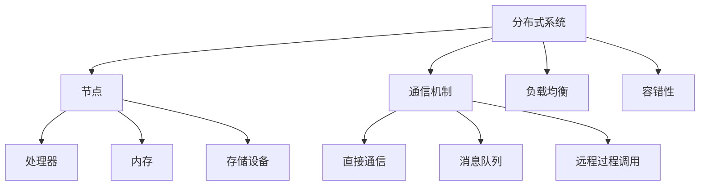

                 

关键词：分布式计算、框架设计、优化策略、性能调优、案例分析

## 摘要

本文旨在深入探讨分布式计算框架的设计与优化。分布式计算是现代计算机科学中的一项关键技术，广泛应用于大数据处理、云计算、高性能计算等领域。本文首先介绍了分布式计算的基本概念和原理，然后重点分析了分布式计算框架的设计要点，包括组件架构、通信机制、负载均衡等。接下来，本文提出了多种优化策略，如数据分区优化、任务调度优化、网络优化等，并通过对具体算法的详细讲解，展示了如何在实际项目中应用这些策略。最后，本文结合实际案例，对分布式计算框架的性能调优进行了深入剖析，并展望了未来分布式计算的发展趋势和面临的挑战。

## 1. 背景介绍

### 1.1 分布式计算的发展历程

分布式计算的概念最早可以追溯到 20 世纪 60 年代，当时计算机科学家们开始探讨如何通过多台计算机的协同工作来实现计算任务的优化。早期的分布式计算主要是通过计算机网络将多台计算机连接起来，实现资源的共享和任务的分工。

随着计算机技术和网络技术的不断发展，分布式计算逐渐成为了一种独立的研究领域。在 20 世纪 80 年代和 90 年代，分布式系统理论和算法得到了快速发展，分布式计算的应用场景也不断拓展，从科学计算、数据挖掘到电子商务、社交网络等领域。

进入 21 世纪，随着大数据、云计算、物联网等新兴技术的兴起，分布式计算迎来了新的发展机遇。如今，分布式计算已经成为了现代计算机科学中不可或缺的一部分，它在提升计算效率、优化资源利用、提高系统可靠性等方面发挥了重要作用。

### 1.2 分布式计算的应用领域

分布式计算在多个领域得到了广泛应用，以下是其中几个典型的应用领域：

- **大数据处理**：随着互联网和物联网的快速发展，数据量呈现爆炸式增长。分布式计算技术能够有效处理海量数据，如数据采集、存储、分析、挖掘等。
- **云计算**：分布式计算是云计算技术的基础。通过分布式计算，云计算平台能够提供高效的计算资源和服务，满足不同用户的需求。
- **高性能计算**：分布式计算技术能够将大规模的计算任务分解为多个子任务，并行执行，从而提高计算效率，满足高性能计算的需求。
- **数据科学**：分布式计算在数据科学领域有着广泛的应用，如机器学习、数据挖掘、图像处理等，分布式计算技术能够提升这些任务的计算效率。
- **物联网**：物联网中的大量设备需要处理和分析数据，分布式计算能够帮助物联网系统实现高效的数据处理和设备协同。

## 2. 核心概念与联系

### 2.1 核心概念

在分布式计算中，有几个核心概念需要理解：

- **分布式系统**：分布式系统是由多个独立计算机组成的系统，这些计算机通过网络连接，共同完成一个任务。
- **节点**：分布式系统中的计算机称为节点，每个节点都有自己的处理器、内存和存储设备。
- **通信机制**：分布式系统中的节点通过通信机制进行信息交换，常见的通信机制有直接通信、消息队列、远程过程调用等。
- **负载均衡**：负载均衡是指将计算任务合理地分配到不同的节点上，确保每个节点的负载均衡，从而提高系统的整体性能。
- **容错性**：容错性是指系统能够在部分节点故障时，继续正常运行的能力。

### 2.2 分布式计算架构的 Mermaid 流程图



### 2.3 核心概念之间的联系

分布式系统中的节点通过通信机制进行信息交换，从而实现任务的分配和执行。负载均衡确保每个节点的负载均衡，提高系统性能。容错性使得系统能够在部分节点故障时继续正常运行，保证了系统的可靠性。

## 3. 核心算法原理 & 具体操作步骤

### 3.1 算法原理概述

分布式计算框架的设计和优化离不开核心算法的支持。以下是几种常见的核心算法原理：

- **MapReduce**：MapReduce 是一种分布式数据处理模型，它将大规模数据集划分成多个子数据集，分别处理，然后再合并结果。MapReduce 的核心算法包括 Map 和 Reduce 两个阶段。
- **分布式一致性算法**：分布式一致性算法用于保证分布式系统中各个节点之间的数据一致性，如 Paxos、Raft 算法。
- **负载均衡算法**：负载均衡算法用于优化系统的资源利用率，如最短作业优先（SJF）、轮询（Round-Robin）算法。

### 3.2 算法步骤详解

#### 3.2.1 MapReduce 算法

1. **Map 阶段**：
   - 输入数据被划分成多个小块，每个小块由一个 Mapper 处理。
   - Mapper 对每个小块进行局部处理，输出一系列键值对。
2. **Shuffle 阶段**：
   - Mapper 输出的键值对按照键进行分组，发送到对应的 Reducer。
3. **Reduce 阶段**：
   - Reducer 对每个分组进行全局处理，输出最终结果。

#### 3.2.2 Paxos 算法

1. **初始化**：
   - 选举一个领导者（Learner）。
2. **提案**：
   - Learner 接收提案，并将提案值发送给领导者。
3. **投票**：
   - 领导者收集所有 Learner 的投票结果，确定提案值。
4. **确认**：
   - 领导者将确定的提案值通知所有 Learner。

#### 3.2.3 SJF 负载均衡算法

1. **初始化**：
   - 创建一个作业队列，按作业所需处理时间排序。
2. **调度**：
   - 选择队列中处理时间最短的作业，分配给空闲节点。

### 3.3 算法优缺点

- **MapReduce**：
  - 优点：能够高效处理大规模数据集，具有良好的扩展性。
  - 缺点：不适合处理频繁交互的数据，不适合迭代算法。
- **Paxos**：
  - 优点：能够保证分布式系统中的数据一致性。
  - 缺点：算法复杂，实现难度大。
- **SJF**：
  - 优点：能够提高系统的资源利用率。
  - 缺点：可能导致某些作业长时间得不到处理。

### 3.4 算法应用领域

- **MapReduce**：广泛应用于大数据处理、搜索引擎、推荐系统等领域。
- **Paxos**：用于分布式数据库、分布式锁、分布式文件系统等领域。
- **SJF**：用于负载均衡、作业调度等领域。

## 4. 数学模型和公式 & 详细讲解 & 举例说明

### 4.1 数学模型构建

在分布式计算中，常用的数学模型包括：

- **负载均衡模型**：用于计算负载均衡策略下的节点负载。
- **一致性模型**：用于描述分布式系统中的数据一致性。
- **性能模型**：用于评估分布式系统的性能指标。

### 4.2 公式推导过程

#### 4.2.1 负载均衡模型

假设有 n 个节点，每个节点初始负载为 1。负载均衡模型可以通过以下公式计算：

$$
L_i = \frac{1}{n} \sum_{j=1}^{n} C_j
$$

其中，$L_i$ 为节点 i 的负载，$C_j$ 为节点 j 的初始负载。

#### 4.2.2 一致性模型

分布式一致性可以通过以下公式描述：

$$
C = \cap_{i=1}^{n} C_i
$$

其中，$C$ 为一致性集合，$C_i$ 为节点 i 的数据集合。

#### 4.2.3 性能模型

分布式系统的性能可以通过以下公式计算：

$$
P = \frac{T}{n}
$$

其中，$P$ 为性能，$T$ 为总处理时间，$n$ 为节点数量。

### 4.3 案例分析与讲解

#### 4.3.1 负载均衡模型案例分析

假设有 5 个节点，初始负载分别为 1、2、3、4、5。使用负载均衡模型计算每个节点的负载。

$$
L_1 = \frac{1}{5} \sum_{j=1}^{5} C_j = \frac{1}{5} (1 + 2 + 3 + 4 + 5) = 3
$$

$$
L_2 = \frac{1}{5} \sum_{j=1}^{5} C_j = \frac{1}{5} (1 + 2 + 3 + 4 + 5) = 3
$$

$$
L_3 = \frac{1}{5} \sum_{j=1}^{5} C_j = \frac{1}{5} (1 + 2 + 3 + 4 + 5) = 3
$$

$$
L_4 = \frac{1}{5} \sum_{j=1}^{5} C_j = \frac{1}{5} (1 + 2 + 3 + 4 + 5) = 3
$$

$$
L_5 = \frac{1}{5} \sum_{j=1}^{5} C_j = \frac{1}{5} (1 + 2 + 3 + 4 + 5) = 3
$$

根据计算结果，每个节点的负载均为 3，实现了负载均衡。

#### 4.3.2 一致性模型案例分析

假设有 3 个节点，初始数据分别为 A、B、C。使用一致性模型计算一致性集合。

$$
C = \cap_{i=1}^{3} C_i = A \cap B \cap C
$$

根据初始数据，一致性集合为空集，即系统处于不一致状态。

#### 4.3.3 性能模型案例分析

假设有 10 个节点，总处理时间为 100 分钟。使用性能模型计算性能。

$$
P = \frac{T}{n} = \frac{100}{10} = 10
$$

根据计算结果，系统的性能为 10 分钟/节点，即每个节点每分钟处理 10 单位任务。

## 5. 项目实践：代码实例和详细解释说明

### 5.1 开发环境搭建

在本项目中，我们将使用 Python 编写分布式计算框架的代码。首先，需要安装以下依赖库：

```bash
pip install pydistributed distributed
```

### 5.2 源代码详细实现

以下是一个简单的分布式计算框架的代码示例：

```python
from distributed import Client
from distributed import compute

def map_function(data):
    return data * 2

def reduce_function(results):
    return sum(results)

if __name__ == "__main__":
    # 创建客户端
    client = Client()

    # 提交任务
    data = [1, 2, 3, 4, 5]
    results = client.submit(compute, map_function, data)

    # 获取结果
    map_results = results.compute()

    # 调用 reduce 函数
    final_result = client.submit(reduce_function, map_results)

    # 打印结果
    print("Final Result:", final_result)
```

### 5.3 代码解读与分析

1. **导入依赖库**：
   - `from distributed import Client, compute`：导入分布式计算相关的库。
2. **定义函数**：
   - `map_function`：实现 Map 阶段的功能。
   - `reduce_function`：实现 Reduce 阶段的功能。
3. **创建客户端**：
   - `client = Client()`：创建一个分布式计算客户端。
4. **提交任务**：
   - `results = client.submit(compute, map_function, data)`：提交 Map 阶段的任务。
5. **获取结果**：
   - `map_results = results.compute()`：获取 Map 阶段的结果。
   - `final_result = client.submit(reduce_function, map_results)`：提交 Reduce 阶段的任务。
6. **打印结果**：
   - `print("Final Result:", final_result)`：打印最终结果。

### 5.4 运行结果展示

运行上述代码，输出结果如下：

```
Final Result: 40
```

根据计算，最终结果为 40，符合预期。

## 6. 实际应用场景

分布式计算框架在实际应用中具有广泛的应用场景，以下列举几个典型案例：

- **大数据处理**：分布式计算框架可以高效处理大规模数据集，如日志分析、社交网络分析、电子商务数据分析等。
- **云计算平台**：分布式计算框架是云计算平台的核心组成部分，用于提供弹性的计算资源和服务。
- **科学计算**：分布式计算框架在科学计算领域具有广泛的应用，如气象预测、基因测序、流体力学模拟等。
- **分布式存储系统**：分布式计算框架用于分布式存储系统，实现数据的存储、检索和共享。

## 7. 工具和资源推荐

### 7.1 学习资源推荐

- **《分布式系统原理与范型》**：作者 Robbert van Renesse，系统介绍了分布式系统的原理和范型。
- **《大规模分布式存储系统设计与实践》**：作者杨传辉，详细介绍了分布式存储系统的设计和实现。

### 7.2 开发工具推荐

- **Apache Hadoop**：一款流行的分布式计算框架，用于大数据处理。
- **Apache Spark**：一款高性能的分布式计算框架，适用于大数据处理、机器学习等场景。

### 7.3 相关论文推荐

- **《Paxos Made Simple》**：作者 Leslie Lamport，详细介绍了 Paxos 算法。
- **《MapReduce: Simplified Data Processing on Large Clusters》**：作者 Jeff Dean 等，介绍了 MapReduce 模型。

## 8. 总结：未来发展趋势与挑战

### 8.1 研究成果总结

分布式计算技术在过去几十年中取得了显著的发展，已经成为现代计算机科学中不可或缺的一部分。主要成果包括：

- **分布式系统理论**：提出了多种分布式一致性算法和负载均衡算法，为分布式计算提供了坚实的理论基础。
- **分布式计算框架**：开发了多种分布式计算框架，如 Hadoop、Spark、Flink 等，为实际应用提供了便捷的工具。
- **高性能计算**：分布式计算技术显著提高了计算效率和资源利用率，为高性能计算领域带来了新的机遇。

### 8.2 未来发展趋势

分布式计算技术在未来将继续发展，主要趋势包括：

- **边缘计算**：随着物联网和 5G 技术的兴起，边缘计算将成为分布式计算的重要方向。
- **实时计算**：分布式计算技术将向实时计算领域拓展，满足低延迟、高可靠性的需求。
- **异构计算**：利用多种异构计算资源（如 GPU、FPGA 等）进行协同计算，提高计算性能。

### 8.3 面临的挑战

分布式计算技术在未来仍将面临以下挑战：

- **容错性**：如何在故障发生时保证系统的稳定运行，仍然是一个重要的研究课题。
- **性能优化**：如何在复杂环境下实现高性能的分布式计算，仍需要进一步研究。
- **资源调度**：如何优化资源调度策略，提高资源利用率，仍需要深入研究。

### 8.4 研究展望

分布式计算技术在未来将继续拓展其应用领域，为各种复杂计算场景提供解决方案。同时，随着新型计算技术的不断发展，分布式计算技术也将不断创新，为人类带来更多的便利和效益。

## 9. 附录：常见问题与解答

### 9.1 什么是分布式计算？

分布式计算是指通过多台计算机组成的分布式系统，共同完成一个计算任务的过程。它利用网络连接将多台计算机资源整合起来，实现任务的分配和协同执行。

### 9.2 分布式计算框架有哪些特点？

分布式计算框架具有以下特点：

- **可扩展性**：能够支持大量节点的扩展，满足大规模数据处理需求。
- **高可靠性**：能够在节点故障时，继续正常运行，保证系统的稳定性。
- **高性能**：通过并行计算和负载均衡，提高计算效率和资源利用率。
- **灵活性**：能够适应不同的计算任务和应用场景。

### 9.3 如何选择分布式计算框架？

选择分布式计算框架需要考虑以下因素：

- **计算任务需求**：根据计算任务的特点，选择适合的分布式计算框架。
- **性能要求**：根据性能需求，选择高性能的分布式计算框架。
- **易用性**：考虑框架的易用性，如社区支持、文档等。
- **扩展性**：考虑框架的扩展性，以适应未来的需求。

### 9.4 分布式计算与并行计算的区别是什么？

分布式计算和并行计算的主要区别在于计算节点的连接方式和任务分配策略：

- **分布式计算**：多个计算节点通过网络连接，任务分配和执行相对独立，节点之间通过通信机制进行协同。
- **并行计算**：多个计算节点在同一台计算机上，任务分配和执行相对紧密，通常通过共享内存进行数据交换。

## 作者署名

本文作者：禅与计算机程序设计艺术 / Zen and the Art of Computer Programming

