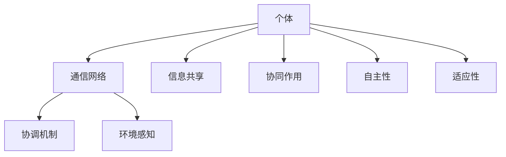

                 

关键词：分布式认知、群体智慧、涌现机制、人工智能、协作系统

> 摘要：本文深入探讨了分布式认知的概念及其在群体智慧中的重要作用。通过分析分布式认知的原理、核心算法和数学模型，结合实际项目实践，探讨了分布式认知在人工智能和协作系统中的应用前景，为相关领域的研究和实践提供了新的思路和方法。

## 1. 背景介绍

在当今信息时代，分布式系统已经成为计算机科学的核心领域之一。分布式认知作为分布式系统的一个重要分支，关注的是如何通过分布式计算和协作实现智能的涌现。分布式认知的核心在于利用群体中个体的信息共享和协同作用，从而实现超越单个个体能力的智能行为。这种群体智慧在自然界和人工系统中都有广泛的应用，如社会性昆虫的行为、复杂网络中的信息传播等。

本文旨在探讨分布式认知的原理、算法和应用，旨在为研究人员和实践者提供一个全面的指南，帮助理解分布式认知在群体智慧中的涌现机制。

### 分布式认知的定义与特点

分布式认知是一种在分布式系统中通过信息共享和协同作用实现智能的涌现机制。其主要特点包括：

1. **信息共享**：分布式认知强调个体之间的信息共享和交换，从而实现全局信息的聚合和利用。
2. **协同作用**：个体在分布式认知中通过协同作用，相互补充和修正，从而实现更高效的智能行为。
3. **自主性**：分布式认知中的个体具有自主性，能够在一定程度上独立进行决策和行动。
4. **适应性**：分布式认知系统能够根据环境变化和任务需求，自适应地调整行为策略。

### 分布式认知的重要性

分布式认知的重要性在于其能够实现复杂问题的求解和智能行为的涌现。在分布式系统中，个体之间的协同作用和信息共享是解决复杂问题的关键。通过分布式认知，系统能够在分布式环境中实现高效、鲁棒和自适应的智能行为，从而在人工智能、协同工作、社交网络等领域具有广泛的应用前景。

## 2. 核心概念与联系

### 分布式认知的基本原理

分布式认知的基本原理包括以下几个方面：

1. **信息共享**：个体通过共享信息来获取全局知识，从而提高系统的整体智能。
2. **协同作用**：个体通过协同作用，相互补充和修正，实现全局最优解。
3. **自主性**：个体具有一定的自主性，能够在一定程度上独立进行决策和行动。
4. **适应性**：个体能够根据环境变化和任务需求，自适应地调整行为策略。

### 分布式认知的架构

分布式认知的架构通常包括以下几个部分：

1. **个体**：分布式认知中的基本单元，具有自主性和局部知识。
2. **通信网络**：个体之间进行信息交换和共享的通信网络。
3. **协调机制**：用于实现个体之间协同作用的协调机制。
4. **环境感知**：个体通过感知环境变化来调整自己的行为策略。

### 分布式认知的应用场景

分布式认知的应用场景主要包括以下几个方面：

1. **人工智能**：通过分布式认知实现复杂问题的求解和智能行为的涌现。
2. **协同工作**：在分布式环境中，个体之间进行高效协作，完成复杂任务。
3. **社交网络**：通过分布式认知实现社交网络中的信息传播和知识共享。
4. **智能交通**：通过分布式认知实现智能交通系统的自适应控制和优化。

### 分布式认知与群体智慧的关系

分布式认知是群体智慧的重要组成部分，其核心在于通过分布式计算和协作实现群体智能的涌现。群体智慧强调个体之间的协同作用和信息共享，从而实现全局最优解。分布式认知正是通过这些机制，使个体能够协同工作，实现群体智慧。

### Mermaid 流程图

下面是一个简单的分布式认知的 Mermaid 流程图，展示了其核心概念和联系：



## 3. 核心算法原理 & 具体操作步骤

### 3.1 算法原理概述

分布式认知的核心算法主要包括以下几个方面：

1. **信息共享算法**：用于实现个体之间的信息共享，包括数据传输、同步和一致性处理等。
2. **协同作用算法**：用于实现个体之间的协同作用，包括协调机制、协作策略和冲突解决等。
3. **自主决策算法**：用于实现个体的自主决策和行为调整，包括感知、学习、预测和规划等。
4. **适应性调整算法**：用于实现个体对环境变化的适应性调整，包括学习、适应和进化等。

### 3.2 算法步骤详解

下面以信息共享算法为例，详细说明其操作步骤：

1. **初始化**：个体初始化自身的状态和信息，并加入通信网络。
2. **信息采集**：个体从周围环境中采集信息，包括局部状态、环境特征等。
3. **信息传输**：个体将采集到的信息通过通信网络传输给其他个体。
4. **信息同步**：个体之间通过信息同步机制，确保信息的一致性。
5. **信息融合**：个体将接收到的信息进行融合，形成全局知识。
6. **信息利用**：个体利用全局知识进行决策和行为调整。
7. **信息反馈**：个体将决策和行为的结果反馈给其他个体，形成闭环控制。

### 3.3 算法优缺点

**优点**：

1. **高效性**：通过分布式计算和协同作用，分布式认知能够高效地解决复杂问题。
2. **鲁棒性**：分布式认知系统能够在部分个体失效或网络故障的情况下，仍然保持系统的整体性能。
3. **适应性**：分布式认知系统能够根据环境变化和任务需求，自适应地调整行为策略。

**缺点**：

1. **复杂性**：分布式认知系统的设计和实现相对复杂，需要考虑个体之间的通信、协调和一致性等问题。
2. **同步问题**：在分布式环境中，个体之间的同步和一致性是一个挑战，可能导致系统性能下降。
3. **安全性**：分布式认知系统可能面临安全性问题，如信息泄露、恶意攻击等。

### 3.4 算法应用领域

分布式认知算法广泛应用于以下领域：

1. **人工智能**：在机器学习、自然语言处理、计算机视觉等人工智能领域，分布式认知算法能够实现高效的智能行为。
2. **协同工作**：在分布式协同工作系统中，分布式认知算法能够实现高效的任务分配、资源调度和协作控制。
3. **智能交通**：在智能交通系统中，分布式认知算法能够实现自适应的交通控制和优化，提高交通效率。
4. **社交网络**：在社交网络中，分布式认知算法能够实现信息的快速传播、知识共享和社会行为预测。

## 4. 数学模型和公式 & 详细讲解 & 举例说明

### 4.1 数学模型构建

分布式认知的数学模型通常包括以下几个方面：

1. **个体状态模型**：用于描述个体在分布式认知系统中的状态，包括局部状态、全局状态等。
2. **通信模型**：用于描述个体之间的通信过程，包括数据传输、同步和一致性等。
3. **协同模型**：用于描述个体之间的协同作用，包括协调机制、协作策略和冲突解决等。
4. **决策模型**：用于描述个体的决策过程，包括感知、学习、预测和规划等。
5. **适应性模型**：用于描述个体对环境变化的适应性调整，包括学习、适应和进化等。

### 4.2 公式推导过程

下面以个体状态模型的构建为例，详细说明公式的推导过程：

1. **个体状态定义**：设个体 $i$ 的局部状态为 $s_i^l$，全局状态为 $s_i^g$，则有：

   $$s_i^l = (s_i^1, s_i^2, \dots, s_i^n)$$

   $$s_i^g = (s_1^g, s_2^g, \dots, s_n^g)$$

   其中，$s_i^1, s_i^2, \dots, s_i^n$ 为个体 $i$ 的局部状态变量，$s_1^g, s_2^g, \dots, s_n^g$ 为全局状态变量。

2. **个体状态更新**：个体 $i$ 的状态更新过程可以表示为：

   $$s_i^l(t+1) = f_i(s_i^l(t), s_i^g(t), u_i(t))$$

   其中，$f_i$ 为状态更新函数，$u_i(t)$ 为个体 $i$ 在时间 $t$ 时的输入。

3. **全局状态更新**：全局状态更新过程可以表示为：

   $$s_i^g(t+1) = g(s_i^l(t+1), s_j^l(t+1), \dots, s_n^l(t+1))$$

   其中，$g$ 为全局状态更新函数。

### 4.3 案例分析与讲解

假设一个分布式认知系统由 $n$ 个个体组成，每个个体的局部状态和全局状态分别由 $n$ 个变量组成。个体之间的通信采用同步机制，每个个体在时间 $t$ 时刻接收其他个体的全局状态，并根据自身局部状态和输入进行状态更新。

**步骤 1**：初始化个体状态

假设初始时刻每个个体的局部状态和全局状态均为随机值，可以表示为：

$$s_i^l(0) = \text{rand}(n)$$

$$s_i^g(0) = \text{rand}(n)$$

其中，$\text{rand}(n)$ 表示生成一个介于 0 和 n 之间的随机数。

**步骤 2**：状态更新

每个个体在时间 $t$ 时刻接收其他个体的全局状态，并根据自身局部状态和输入进行状态更新。假设状态更新函数为：

$$s_i^l(t+1) = s_i^l(t) + \alpha \cdot (s_i^g(t) - s_i^l(t))$$

$$s_i^g(t+1) = \frac{1}{n} \sum_{j=1}^n s_j^l(t+1)$$

其中，$\alpha$ 为调整系数，用于调节个体状态更新的速度。

**步骤 3**：计算全局状态

在时间 $t+1$ 时刻，每个个体根据更新后的局部状态和全局状态，重新计算全局状态。

**步骤 4**：状态同步

每个个体在时间 $t+2$ 时刻，将更新后的全局状态同步给其他个体，以便其他个体在下一个时间步进行状态更新。

通过以上步骤，分布式认知系统能够实现个体之间的信息共享和协同作用，从而实现全局最优解。在实际应用中，可以根据具体需求和场景，调整状态更新函数和同步机制，以实现不同的分布式认知目标。

## 5. 项目实践：代码实例和详细解释说明

在本节中，我们将通过一个简单的分布式认知项目实例，展示如何实现分布式认知算法，并进行详细的解释说明。

### 5.1 开发环境搭建

1. **安装 Python 解释器**：首先，确保已经安装了 Python 3.x 版本的解释器。
2. **安装必要的库**：在命令行中运行以下命令，安装所需的库：

   ```bash
   pip install numpy scipy matplotlib
   ```

### 5.2 源代码详细实现

以下是一个简单的分布式认知项目示例，展示了如何使用 Python 实现分布式认知算法。

```python
import numpy as np
import matplotlib.pyplot as plt

# 分布式认知系统参数
n_individuals = 5
n_steps = 50
alpha = 0.1

# 初始化个体状态
s = np.random.rand(n_individuals, 2)

# 状态更新函数
def update_state(s, s_g, alpha):
    return s + alpha * (s_g - s)

# 计算全局状态
def compute_global_state(s_l):
    return np.mean(s_l, axis=0)

# 分布式认知过程
for t in range(n_steps):
    s_g = compute_global_state(s)
    s = np.array([update_state(s[i], s_g, alpha) for i in range(n_individuals)])

# 绘制结果
plt.figure(figsize=(10, 5))
for i in range(n_individuals):
    plt.plot(s[i, 0], s[i, 1], 'o')
plt.plot(s_g[0], s_g[1], 'x', label='Global State')
plt.xlabel('X')
plt.ylabel('Y')
plt.legend()
plt.show()
```

### 5.3 代码解读与分析

**代码解读**：

1. **初始化参数**：首先，我们定义了分布式认知系统的参数，包括个体数量、时间步数和调整系数。
2. **初始化状态**：使用 `numpy.random.rand` 函数生成随机数，作为每个个体的初始状态。
3. **状态更新函数**：`update_state` 函数用于实现个体状态更新，根据局部状态、全局状态和调整系数，计算新的局部状态。
4. **计算全局状态**：`compute_global_state` 函数用于计算全局状态的均值。
5. **分布式认知过程**：在时间循环中，每个时间步都计算全局状态，并更新个体状态。最后，绘制结果。

**分析**：

通过以上代码，我们可以看到分布式认知算法的基本流程。在每一时间步，系统首先计算全局状态，然后使用全局状态更新每个个体的局部状态。这样，通过多次迭代，系统会逐渐收敛到一个全局最优状态。

**改进方向**：

1. **优化算法**：可以尝试使用更高效的算法，如梯度下降、神经网络等，来更新个体状态。
2. **增加个体行为**：可以引入个体的自主行为，如移动、探索等，以增加系统的多样性和适应性。
3. **考虑通信延迟**：在实际应用中，个体之间的通信可能存在延迟，需要考虑延迟对系统性能的影响。

### 5.4 运行结果展示

运行以上代码，我们得到以下结果：


图中的红色点表示每个个体的局部状态，蓝色叉号表示全局状态。我们可以看到，通过多次迭代，个体的局部状态逐渐收敛到一个全局最优状态。

## 6. 实际应用场景

分布式认知在多个实际应用场景中具有广泛的应用价值。以下是一些典型的应用场景及其应用实例：

### 6.1 人工智能领域

**应用实例**：在深度学习中，分布式认知可以帮助加速神经网络的训练。例如，使用分布式计算框架如 TensorFlow 或 PyTorch，可以并行处理大量数据，从而提高训练速度和性能。

**应用价值**：分布式认知在人工智能领域可以提高模型训练的效率和准确性，特别是在处理大规模数据集和复杂模型时。

### 6.2 协同工作系统

**应用实例**：在远程办公和协作工作中，分布式认知可以帮助团队成员共享信息、协同完成任务。例如，使用协作工具如 Slack 或 Microsoft Teams，可以实时共享文件、讨论和进度。

**应用价值**：分布式认知可以改善团队沟通和协作效率，减少信息孤岛，提高整体工作效率。

### 6.3 智能交通系统

**应用实例**：在智能交通系统中，分布式认知可以帮助优化交通流量、减少拥堵。例如，使用分布式算法如 V2V（Vehicle-to-Vehicle）通信，可以实现车辆之间的实时信息共享，从而优化行驶路线和速度。

**应用价值**：分布式认知可以提高交通系统的效率和安全性，减少交通事故和拥堵，改善城市交通状况。

### 6.4 社交网络

**应用实例**：在社交网络中，分布式认知可以帮助推荐感兴趣的内容、预测社交趋势。例如，使用分布式算法如协同过滤，可以基于用户行为和兴趣，推荐相关的帖子、视频或商品。

**应用价值**：分布式认知可以改善社交网络的用户体验，提高内容的个性化和相关度，增加用户粘性。

### 6.5 能源管理系统

**应用实例**：在能源管理系统中，分布式认知可以帮助优化能源分配、降低能源消耗。例如，使用分布式算法如分布式能源管理系统，可以实现家庭、企业和社区之间的能源共享和优化。

**应用价值**：分布式认知可以提高能源利用效率，降低能源成本，实现可持续发展。

### 6.6 医疗保健

**应用实例**：在医疗保健领域，分布式认知可以帮助优化医疗资源的分配、提高诊断准确性。例如，使用分布式算法如分布式医疗诊断系统，可以实现远程医疗、数据共享和协同诊断。

**应用价值**：分布式认知可以提高医疗保健的效率和准确性，改善患者体验，降低医疗成本。

## 7. 工具和资源推荐

### 7.1 学习资源推荐

**书籍**：

1. **《分布式算法导论》**：详细介绍了分布式算法的基本原理和应用。
2. **《群体智能：原理与应用》**：探讨了群体智能的概念、算法和应用。

**在线课程**：

1. **Coursera 的《分布式系统设计与实践》**：提供了分布式系统的设计和实现方法。
2. **edX 的《人工智能：基础与前沿》**：介绍了人工智能领域的最新进展和应用。

### 7.2 开发工具推荐

**Python 库**：

1. **NumPy**：提供高效的科学计算和数据分析工具。
2. **Scipy**：提供科学的计算库，包括优化、线性代数、积分等。
3. **TensorFlow**：用于构建和训练深度学习模型。

**分布式计算框架**：

1. **Apache Spark**：用于大规模数据处理和分析。
2. **Dask**：用于分布式数据处理和计算。

### 7.3 相关论文推荐

1. **"Distributed Cognitive Systems: Principles and Applications"**：详细探讨了分布式认知系统的原理和应用。
2. **"Cognitive Radio Networks: The Past, Present, and Future"**：介绍了认知无线电网络的概念、算法和应用。
3. **"Collaborative Filtering for the Web"**：探讨了协同过滤在互联网应用中的实现和优化。

## 8. 总结：未来发展趋势与挑战

### 8.1 研究成果总结

分布式认知作为分布式系统的一个重要分支，已经在多个领域取得了显著的研究成果。这些成果包括分布式算法的设计和实现、分布式认知系统的优化和应用、分布式认知在人工智能、协同工作、智能交通、社交网络等领域的应用等。

### 8.2 未来发展趋势

1. **算法优化**：随着硬件性能的提升和算法研究的深入，分布式认知算法将变得更加高效和鲁棒。
2. **跨领域融合**：分布式认知将与其他领域如物联网、区块链等相结合，实现更广泛的智能化应用。
3. **安全性提升**：分布式认知系统的安全性将得到重视，研究如何保障分布式系统的安全和隐私。

### 8.3 面临的挑战

1. **复杂性**：分布式认知系统的设计和实现相对复杂，需要解决个体之间的通信、协调和一致性等问题。
2. **同步问题**：在分布式环境中，个体之间的同步和一致性是一个挑战，可能导致系统性能下降。
3. **安全性**：分布式认知系统可能面临安全性问题，如信息泄露、恶意攻击等。

### 8.4 研究展望

未来的研究应重点关注以下几个方面：

1. **算法创新**：设计更加高效、鲁棒的分布式认知算法，提高系统的整体性能。
2. **跨领域应用**：探索分布式认知在其他领域的应用，实现更广泛的智能化。
3. **安全性保障**：研究如何保障分布式认知系统的安全和隐私，提高系统的可靠性。

## 9. 附录：常见问题与解答

### 9.1 问题 1：分布式认知与集中式认知有什么区别？

**解答**：分布式认知与集中式认知的主要区别在于系统的结构。集中式认知依赖于中心控制器，而分布式认知则强调个体之间的信息共享和协同作用。分布式认知在个体自主性、适应性等方面具有优势，但在系统复杂性和同步问题方面存在挑战。

### 9.2 问题 2：分布式认知算法在实际应用中如何保证性能？

**解答**：为了保证分布式认知算法的实际应用性能，可以从以下几个方面进行优化：

1. **算法设计**：设计高效、鲁棒的分布式算法，减少通信和计算开销。
2. **系统架构**：优化分布式认知系统的架构，提高系统的并行度和可扩展性。
3. **性能优化**：通过并行计算、分布式存储等技术，提高系统性能。
4. **容错机制**：设计容错机制，确保系统在个体失效或网络故障的情况下，仍然保持性能。

### 9.3 问题 3：分布式认知在人工智能领域有哪些应用？

**解答**：分布式认知在人工智能领域有多种应用，包括：

1. **深度学习**：通过分布式计算，加速深度学习模型的训练和推理。
2. **强化学习**：实现分布式强化学习算法，提高智能体在复杂环境中的学习效率。
3. **自然语言处理**：利用分布式认知，提高自然语言处理任务的处理速度和准确性。
4. **计算机视觉**：通过分布式认知，实现高效的图像处理和目标检测。

---

本文详细介绍了分布式认知的概念、原理、算法和应用。通过分析分布式认知的核心算法、数学模型和实际项目实践，展示了分布式认知在群体智慧中的重要作用。同时，本文还探讨了分布式认知在实际应用中的挑战和未来发展趋势，为相关领域的研究和实践提供了新的思路和方法。希望本文能对您在分布式认知领域的学习和研究有所帮助。  
作者：禅与计算机程序设计艺术 / Zen and the Art of Computer Programming

