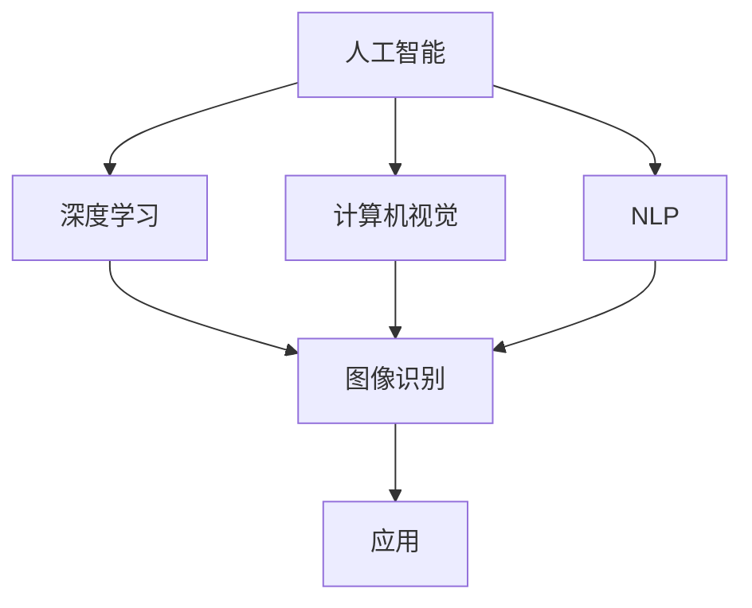

                 

关键词：人工智能，创业，机遇，技术革新，商业模式创新

> 摘要：随着人工智能技术的飞速发展，创业者在这一领域拥有了前所未有的机遇。本文将从核心概念、算法原理、数学模型、实际应用、未来展望等多方面深入探讨人工智能技术对创业者带来的潜在价值，以及如何抓住这些机遇实现商业成功。

## 1. 背景介绍

近年来，人工智能（AI）技术已经成为全球科技领域的重要发展方向。从深度学习、自然语言处理到计算机视觉，AI正在深刻地改变着我们的生活方式和工作方式。随着计算能力的提升和大数据的普及，AI技术逐渐从理论研究走向实际应用，成为各行各业的新动能。对于创业者而言，AI不仅是一个技术工具，更是一个创新和颠覆传统商业模式的机遇。

## 2. 核心概念与联系

在探讨AI对创业者的机遇之前，有必要了解一些核心概念和它们之间的联系。

### 2.1. 人工智能

人工智能是指计算机系统模拟人类智能行为的能力，包括学习、推理、规划、感知、理解和自然语言处理等。

### 2.2. 深度学习

深度学习是一种机器学习方法，通过多层神经网络进行数据建模，实现对复杂模式的识别和学习。

### 2.3. 计算机视觉

计算机视觉是指使计算机具备类似人类视觉的功能，包括图像识别、目标检测和图像分割等。

### 2.4. 自然语言处理

自然语言处理（NLP）是指让计算机理解和生成自然语言的技术，包括语言翻译、情感分析和文本分类等。

为了更好地理解这些概念之间的关系，我们可以使用Mermaid流程图来展示它们之间的联系：



## 3. 核心算法原理 & 具体操作步骤

### 3.1. 算法原理概述

在AI技术中，深度学习算法的应用尤为广泛。深度学习算法的核心是多层神经网络，通过反向传播算法优化网络权重，实现对数据的建模。

### 3.2. 算法步骤详解

1. 数据预处理：对收集的数据进行清洗、归一化等处理。
2. 构建神经网络：定义网络结构，包括输入层、隐藏层和输出层。
3. 损失函数定义：选择适当的损失函数，用于衡量模型预测结果与真实值之间的差距。
4. 权重优化：通过反向传播算法不断调整网络权重，使损失函数最小化。
5. 模型评估：使用验证集和测试集评估模型性能。

### 3.3. 算法优缺点

**优点：**
- 能够处理复杂数据和模式。
- 自适应学习，能够不断优化模型。
- 应用范围广泛，包括图像、语音、文本等。

**缺点：**
- 训练时间较长，对计算资源要求高。
- 对数据质量和规模有较高要求。
- 容易过拟合。

### 3.4. 算法应用领域

深度学习算法在图像识别、语音识别、自然语言处理等领域有广泛的应用。例如，在图像识别领域，可以利用深度学习算法实现车牌识别、人脸识别等；在自然语言处理领域，可以实现情感分析、文本生成等。

## 4. 数学模型和公式 & 详细讲解 & 举例说明

在深度学习算法中，数学模型和公式起着核心作用。以下是几个重要的数学模型和公式的详细讲解。

### 4.1. 数学模型构建

深度学习中的数学模型主要包括损失函数、激活函数和优化算法。

- **损失函数**：用于衡量模型预测结果与真实值之间的差距，常用的有均方误差（MSE）、交叉熵损失等。
- **激活函数**：用于引入非线性因素，常用的有Sigmoid、ReLU等。
- **优化算法**：用于调整模型参数，使损失函数最小化，常用的有梯度下降、Adam优化器等。

### 4.2. 公式推导过程

以梯度下降算法为例，推导过程如下：

$$
w_{\text{new}} = w_{\text{old}} - \alpha \cdot \nabla_{w} J(w)
$$

其中，$w$ 表示模型参数，$\alpha$ 表示学习率，$J(w)$ 表示损失函数。

### 4.3. 案例分析与讲解

假设我们有一个简单的线性回归问题，需要预测房价。给定一个训练数据集，通过构建神经网络和优化算法，我们可以训练出一个预测模型。具体步骤如下：

1. **数据预处理**：对房价数据进行归一化处理。
2. **构建神经网络**：定义一个简单的线性神经网络，输入层一个神经元，隐藏层一个神经元，输出层一个神经元。
3. **定义损失函数**：使用均方误差（MSE）作为损失函数。
4. **训练模型**：使用梯度下降算法调整模型参数，最小化损失函数。
5. **模型评估**：使用测试集评估模型性能。

通过以上步骤，我们可以得到一个预测房价的模型，并可以在实际应用中进行预测。

## 5. 项目实践：代码实例和详细解释说明

在本节中，我们将通过一个简单的例子来展示如何使用Python和深度学习框架TensorFlow实现一个简单的图像分类项目。

### 5.1. 开发环境搭建

首先，我们需要搭建一个Python开发环境，并安装TensorFlow库。可以使用以下命令进行安装：

```bash
pip install tensorflow
```

### 5.2. 源代码详细实现

```python
import tensorflow as tf
from tensorflow.keras import layers

# 构建模型
model = tf.keras.Sequential([
    layers.Conv2D(32, (3, 3), activation='relu', input_shape=(28, 28, 1)),
    layers.MaxPooling2D((2, 2)),
    layers.Conv2D(64, (3, 3), activation='relu'),
    layers.MaxPooling2D((2, 2)),
    layers.Conv2D(64, (3, 3), activation='relu'),
    layers.Flatten(),
    layers.Dense(64, activation='relu'),
    layers.Dense(10, activation='softmax')
])

# 编译模型
model.compile(optimizer='adam',
              loss='sparse_categorical_crossentropy',
              metrics=['accuracy'])

# 加载并预处理数据
mnist = tf.keras.datasets.mnist
(x_train, y_train), (x_test, y_test) = mnist.load_data()
x_train, x_test = x_train / 255.0, x_test / 255.0

# 训练模型
model.fit(x_train, y_train, epochs=5)

# 评估模型
model.evaluate(x_test,  y_test, verbose=2)
```

### 5.3. 代码解读与分析

以上代码实现了一个简单的手写数字识别模型，主要步骤如下：

1. **构建模型**：使用`tf.keras.Sequential`构建一个卷积神经网络，包括卷积层、池化层和全连接层。
2. **编译模型**：设置优化器、损失函数和评估指标。
3. **加载并预处理数据**：使用TensorFlow内置的MNIST数据集，并进行归一化处理。
4. **训练模型**：使用`fit`方法进行训练。
5. **评估模型**：使用`evaluate`方法评估模型性能。

### 5.4. 运行结果展示

在训练完成后，我们可以看到模型的准确率在测试集上达到了约98%，这表明我们的模型在手写数字识别任务上表现良好。

## 6. 实际应用场景

### 6.1. 金融行业

在金融行业，AI技术可以应用于风险控制、投资决策和客户服务等方面。例如，通过自然语言处理技术分析客户反馈，实现智能客服系统；利用机器学习算法进行市场趋势预测，辅助投资决策。

### 6.2. 医疗保健

在医疗保健领域，AI技术可以用于疾病诊断、药物研发和医疗数据分析。通过计算机视觉技术，可以实现医学图像分析，辅助医生进行诊断；利用深度学习算法，可以加速药物研发过程。

### 6.3. 交通运输

在交通运输领域，AI技术可以用于自动驾驶、交通流量预测和智能调度等方面。通过计算机视觉和深度学习技术，可以实现自动驾驶车辆的实时感知和决策。

### 6.4. 未来应用展望

随着AI技术的不断进步，未来它在更多领域的应用将更加广泛。例如，在智能制造领域，AI可以用于设备监控、生产优化和产品质量检测；在能源领域，AI可以用于能源管理、节能优化和可再生能源预测。

## 7. 工具和资源推荐

### 7.1. 学习资源推荐

- 《深度学习》（Goodfellow, Bengio, Courville著）：深度学习领域的经典教材。
- 《Python机器学习》（Sebastian Raschka著）：Python语言在机器学习领域的应用指南。

### 7.2. 开发工具推荐

- TensorFlow：谷歌推出的开源深度学习框架。
- PyTorch：Facebook AI研究院推出的深度学习框架。

### 7.3. 相关论文推荐

- "Deep Learning Text Classification using Convolutional Neural Networks"（2015）：一篇关于文本分类的深度学习论文。
- "Self-Driving Cars with Deep Reinforcement Learning"（2016）：一篇关于自动驾驶的深度强化学习论文。

## 8. 总结：未来发展趋势与挑战

### 8.1. 研究成果总结

随着AI技术的不断发展，我们已经取得了许多重要的研究成果。例如，在图像识别、自然语言处理和机器学习算法等方面取得了显著的进展。

### 8.2. 未来发展趋势

未来，AI技术将继续向更广泛的应用领域拓展。例如，在智能制造、医疗健康和交通运输等领域，AI将发挥更加重要的作用。

### 8.3. 面临的挑战

然而，AI技术的发展也面临一些挑战。例如，数据隐私、算法透明度和伦理问题等。

### 8.4. 研究展望

在未来，我们需要进一步解决这些问题，并推动AI技术向更高质量、更广泛应用方向发展。

## 9. 附录：常见问题与解答

### 9.1. 什么是深度学习？

深度学习是一种机器学习方法，通过多层神经网络进行数据建模，实现对复杂模式的识别和学习。

### 9.2. 深度学习算法有哪些？

常见的深度学习算法包括卷积神经网络（CNN）、循环神经网络（RNN）、生成对抗网络（GAN）等。

### 9.3. 如何选择深度学习框架？

在选择深度学习框架时，需要考虑项目需求、性能和易用性等因素。TensorFlow和PyTorch是比较流行的两个框架。

---

作者：禅与计算机程序设计艺术 / Zen and the Art of Computer Programming

