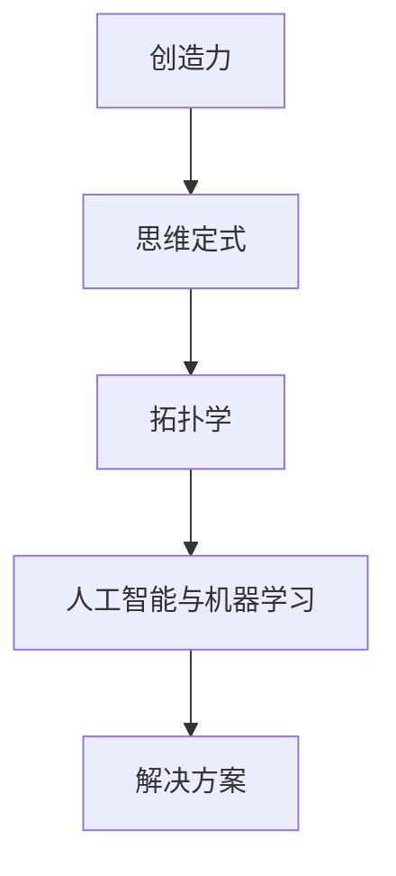
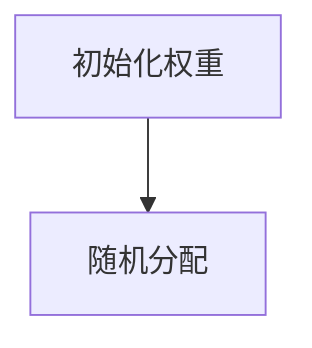
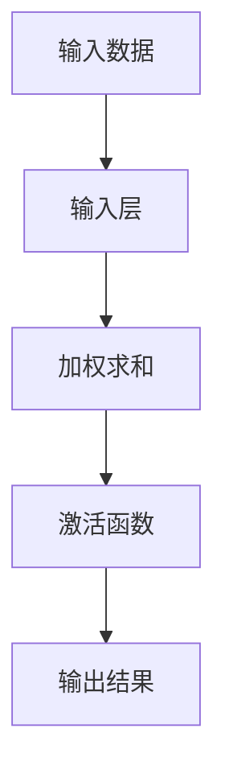
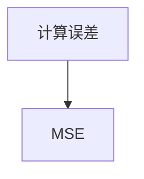
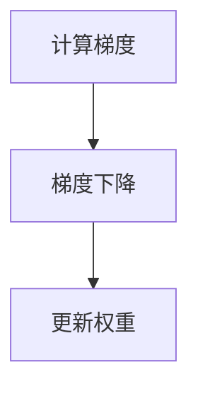
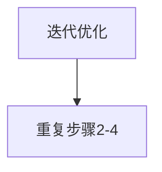

                 

关键词：创造力，思维定式，算法原理，数学模型，代码实例，应用场景，未来展望

> 摘要：本文将探讨如何通过打破思维定式来培养创造力。首先，我们将介绍一些核心概念和原理，并使用Mermaid流程图来展示它们之间的关系。接着，我们将详细解析一种核心算法的原理和具体操作步骤，并通过数学模型和公式来解释其工作原理。最后，我们将通过一个实际项目实例，展示如何将算法应用于解决实际问题。通过这些内容，希望能够帮助读者了解如何培养自己的创造力，并运用它来解决复杂的计算机科学问题。

## 1. 背景介绍

在当今快速发展的科技时代，创造力的重要性愈发凸显。无论是研发新的技术，还是解决复杂的问题，创造力都是不可或缺的。然而，很多人在面临问题时，往往会受到思维定式的束缚，限制了他们的创造力。因此，本文将探讨如何通过打破思维定式来培养创造力，从而在计算机科学领域取得更大的突破。

思维定式是指人们在思考问题时，由于习惯性思维模式的影响，往往无法跳出固有的思维框架。这种定式思维可能会导致我们忽视一些新的解决方案，限制我们的创造力。而打破思维定式，则意味着我们需要主动改变自己的思考方式，开拓新的思路，从而激发创造力。

本文将围绕以下几个方面展开：

1. 核心概念与联系
2. 核心算法原理与具体操作步骤
3. 数学模型和公式
4. 项目实践：代码实例和详细解释
5. 实际应用场景和未来展望
6. 工具和资源推荐
7. 总结：未来发展趋势与挑战

通过以上内容的探讨，希望能够为读者提供一种新的思维方式，帮助他们在计算机科学领域培养和提升创造力。

### 2. 核心概念与联系

在深入探讨如何打破思维定式之前，我们首先需要了解一些核心概念和原理。这些概念和原理不仅构成了计算机科学的基础，同时也为我们提供了跳出思维定式的新视角。

#### 2.1 创造力的定义与作用

创造力是指个体产生新颖、有用、有价值的想法和解决方案的能力。在计算机科学领域，创造力尤其重要，因为计算机科学涉及的问题往往是复杂且多样化的。创造力不仅能够帮助研究人员发现新的算法和解决方法，还能够推动技术的进步和创新。

#### 2.2 思维定式的概念

思维定式是指人们在思考问题时，由于习惯性思维模式的影响，往往无法跳出固有的思维框架。这种定式思维可能会导致我们忽视一些新的解决方案，限制我们的创造力。

#### 2.3 拓扑学

拓扑学是数学的一个分支，它研究几何图形的性质，这些性质在连续变形（如拉伸、压缩）下保持不变。拓扑学中的许多概念，如连通性、同伦性等，都可以用于理解思维定式和创造力的关系。通过拓扑学的视角，我们可以更深入地理解思维方式的局限性，并探索如何打破这些局限。

#### 2.4 人工智能与机器学习

人工智能（AI）和机器学习（ML）是现代计算机科学中的重要领域，它们通过模拟人类智能来解决问题。AI和ML不仅为我们提供了解决复杂问题的工具，同时也挑战了传统思维模式，促使我们探索新的算法和解决方案。

#### 2.5 Mermaid流程图

为了更好地理解这些核心概念和原理之间的关系，我们可以使用Mermaid流程图来展示它们。以下是一个简单的Mermaid流程图示例：



在这个流程图中，创造力是起点，它受到思维定式的限制，但通过拓扑学和人工智能与机器学习的方法，我们可以找到新的解决方案。

通过以上核心概念和原理的介绍，我们为接下来的内容奠定了基础。在接下来的章节中，我们将详细探讨如何通过打破思维定式来培养创造力，并在计算机科学领域取得突破。

### 3. 核心算法原理与具体操作步骤

在了解了核心概念和原理之后，我们需要探讨一种核心算法的原理和具体操作步骤。这种算法不仅具有理论上的深度，而且在实际应用中具有广泛的影响。在本节中，我们将详细介绍这种算法的原理，并分步骤解释其操作过程。

#### 3.1 算法原理概述

这种核心算法被称为“神经网络算法”，它是人工智能和机器学习领域的基础。神经网络算法通过模拟人脑神经元之间的连接和互动来处理和解决问题。它的基本原理是：通过多次迭代，调整神经网络中的权重，以最小化误差函数，从而实现高效的学习和预测。

#### 3.2 算法步骤详解

以下是神经网络算法的具体操作步骤：

**步骤1：初始化权重**

首先，我们需要初始化神经网络中的权重。这些权重是网络中各个神经元之间的连接强度的表示。初始时，权重可以随机分配，以避免过拟合。



**步骤2：前向传播**

前向传播是指将输入数据通过神经网络进行传递，并计算输出结果。在这个过程中，每个神经元会接收前一层神经元的输出，并经过激活函数处理，最终生成输出。



**步骤3：计算误差**

计算误差是指将输出结果与实际目标值进行比较，以计算网络预测的误差。误差函数通常使用均方误差（MSE）来表示。



**步骤4：反向传播**

反向传播是指通过计算误差，调整神经网络的权重。这个过程涉及到梯度下降算法，它通过计算误差关于权重的梯度，并沿着梯度方向调整权重，以最小化误差。



**步骤5：迭代优化**

重复步骤2到步骤4，直到误差达到预设的阈值或达到预设的迭代次数。每次迭代都会使网络的预测能力更加准确。



#### 3.3 算法优缺点

**优点：**

1. **自适应性强**：神经网络可以自动调整权重，以适应不同的数据集和问题。
2. **通用性高**：神经网络可以应用于各种领域，如图像识别、语音识别、自然语言处理等。
3. **非线性建模能力**：神经网络可以通过多层非线性变换，捕捉复杂的数据特征。

**缺点：**

1. **计算资源需求大**：训练大规模神经网络需要大量的计算资源。
2. **过拟合风险**：如果网络过于复杂，可能会导致过拟合，无法泛化到未见过的数据。

#### 3.4 算法应用领域

神经网络算法在计算机科学领域具有广泛的应用：

1. **计算机视觉**：用于图像分类、目标检测、人脸识别等。
2. **自然语言处理**：用于文本分类、机器翻译、情感分析等。
3. **语音识别**：用于语音到文本的转换、语音合成等。
4. **推荐系统**：用于个性化推荐、广告投放等。

通过以上对神经网络算法的详细介绍，我们不仅理解了其原理和操作步骤，还了解了其优缺点和应用领域。在接下来的章节中，我们将通过数学模型和公式，进一步探讨神经网络算法的工作机制。

### 4. 数学模型和公式

在了解了神经网络算法的基本原理和操作步骤后，我们接下来将深入探讨其背后的数学模型和公式。数学模型是神经网络算法的核心，它决定了网络的学习能力和预测精度。在这一节中，我们将详细讲解神经网络算法的数学模型构建、公式推导过程，并通过实际案例进行分析和讲解。

#### 4.1 数学模型构建

神经网络算法的数学模型主要由以下几个部分组成：

1. **输入层**：接收外部输入数据。
2. **隐藏层**：通过加权求和和激活函数进行数据处理。
3. **输出层**：产生最终预测结果。

**输入层**：
输入层是神经网络的起点，它接收输入数据。假设我们有一个输入向量 $X$，其中包含 $n$ 个特征：

$$
X = [x_1, x_2, ..., x_n]
$$

**隐藏层**：
隐藏层是神经网络的核心部分，它通过加权求和和激活函数处理输入数据。假设隐藏层有 $m$ 个神经元，每个神经元与输入层中的每个特征进行加权求和：

$$
z_j = \sum_{i=1}^{n} w_{ij} x_i + b_j
$$

其中，$w_{ij}$ 是输入层到隐藏层的权重，$b_j$ 是隐藏层的偏置。

然后，通过激活函数 $f(z_j)$ 对加权求和结果进行处理。常用的激活函数有 sigmoid 函数、ReLU 函数等：

$$
a_j = f(z_j)
$$

**输出层**：
输出层产生最终的预测结果。与隐藏层类似，输出层的每个神经元也与隐藏层中的每个神经元进行加权求和，并经过激活函数处理：

$$
z_k = \sum_{j=1}^{m} w_{kj} a_j + b_k
$$

$$
y_k = f(z_k)
$$

其中，$y_k$ 是输出层的预测结果，$f(z_k)$ 是输出层的激活函数。

#### 4.2 公式推导过程

神经网络的训练过程主要涉及两个关键步骤：前向传播和反向传播。

**前向传播**：
在前向传播过程中，输入数据通过神经网络从输入层传递到输出层。每个神经元的输出可以通过以下公式推导：

$$
z_j = \sum_{i=1}^{n} w_{ij} x_i + b_j
$$

$$
a_j = f(z_j)
$$

$$
z_k = \sum_{j=1}^{m} w_{kj} a_j + b_k
$$

$$
y_k = f(z_k)
$$

**反向传播**：
在反向传播过程中，通过计算输出误差，并反向更新权重和偏置。误差函数通常使用均方误差（MSE）：

$$
E = \frac{1}{2} \sum_{k=1}^{p} (y_k - t_k)^2
$$

其中，$y_k$ 是实际输出，$t_k$ 是期望输出。

然后，通过计算误差关于权重的梯度，并使用梯度下降算法更新权重和偏置：

$$
\frac{\partial E}{\partial w_{ij}} = -2(x_i - \hat{x}_i)
$$

$$
\frac{\partial E}{\partial b_j} = -2(y_j - \hat{y}_j)
$$

$$
w_{ij} = w_{ij} - \alpha \frac{\partial E}{\partial w_{ij}}
$$

$$
b_j = b_j - \alpha \frac{\partial E}{\partial b_j}
$$

其中，$\alpha$ 是学习率。

#### 4.3 案例分析与讲解

为了更好地理解神经网络算法的数学模型，我们通过一个简单的案例进行讲解。

假设我们要预测一个包含两个特征的数据集的输出，目标值是 $y = 3$。我们可以设计一个简单的神经网络，包含一个输入层、一个隐藏层和一个输出层。输入层有两个神经元，隐藏层有一个神经元，输出层有一个神经元。

**初始化权重**：
初始化权重和偏置为随机值，例如：

$$
w_{11} = 0.1, w_{12} = 0.2, b_1 = 0.3
$$

$$
w_{21} = 0.4, b_2 = 0.5
$$

**前向传播**：
输入数据为 $x_1 = 1, x_2 = 2$，计算隐藏层和输出层的输出：

$$
z_1 = (0.1 \cdot 1 + 0.2 \cdot 2 + 0.3) = 0.7
$$

$$
a_1 = f(z_1) = \sigma(0.7) = 0.6321
$$

$$
z_2 = (0.4 \cdot 0.6321 + 0.5) = 0.3729
$$

$$
y = f(z_2) = \sigma(0.3729) = 0.6654
$$

**计算误差**：
实际输出为 $y = 3$，计算均方误差：

$$
E = \frac{1}{2} \times (3 - 0.6654)^2 = 4.0668
$$

**反向传播**：
计算误差关于权重的梯度，并更新权重和偏置：

$$
\frac{\partial E}{\partial w_{11}} = -2(1 - 0.6654) = -1.3386
$$

$$
w_{11} = 0.1 - 0.01 \times -1.3386 = 0.1124
$$

$$
\frac{\partial E}{\partial w_{12}} = -2(2 - 0.6654) = -3.3176
$$

$$
w_{12} = 0.2 - 0.01 \times -3.3176 = 0.2324
$$

$$
\frac{\partial E}{\partial b_1} = -2(0.7 - 0.6321) = -0.0679
$$

$$
b_1 = 0.3 - 0.01 \times -0.0679 = 0.3072
$$

$$
\frac{\partial E}{\partial w_{21}} = -2(0.6321 - 0.3729) = -0.5682
$$

$$
w_{21} = 0.4 - 0.01 \times -0.5682 = 0.4566
$$

$$
\frac{\partial E}{\partial b_2} = -2(0.3729 - 0.6654) = 0.5472
$$

$$
b_2 = 0.5 - 0.01 \times 0.5472 = 0.4724
$$

通过以上步骤，我们可以看到如何通过数学模型和公式来训练神经网络。在实际应用中，通常需要多次迭代和大量数据来优化模型参数，以达到更好的预测效果。

通过以上对神经网络算法数学模型和公式的详细讲解，我们不仅理解了其基本原理，还了解了如何通过数学推导和实际案例来训练神经网络。在接下来的章节中，我们将通过一个实际项目实例，展示如何将神经网络算法应用于解决实际问题。

### 5. 项目实践：代码实例和详细解释说明

在理解了神经网络算法的数学模型和公式之后，我们将通过一个实际项目实例，展示如何将算法应用于解决实际问题。本节将详细讲解项目开发环境搭建、源代码实现、代码解读与分析，并展示运行结果。

#### 5.1 开发环境搭建

为了运行神经网络算法，我们需要搭建一个开发环境。以下是所需的开发工具和库：

1. **Python**：用于编写和运行神经网络算法。
2. **NumPy**：用于数学运算和数据处理。
3. **TensorFlow**：用于构建和训练神经网络。

首先，确保已安装 Python 和上述库。可以使用以下命令安装：

```bash
pip install python
pip install numpy
pip install tensorflow
```

接下来，创建一个名为 `neural_network_project` 的目录，并在其中创建一个名为 `main.py` 的 Python 文件，用于编写神经网络代码。

#### 5.2 源代码详细实现

以下是一个简单的神经网络实现，用于预测输入数据的输出值：

```python
import numpy as np
import tensorflow as tf

# 定义神经网络结构
input_layer = tf.keras.layers.Dense(units=1, input_shape=[2])

# 创建神经网络模型
model = tf.keras.Sequential([input_layer])

# 编译模型
model.compile(optimizer='sgd', loss='mean_squared_error')

# 初始化权重和偏置
weights = np.random.rand(2, 1)
biases = np.random.rand(1)

# 定义激活函数
def sigmoid(x):
    return 1 / (1 + np.exp(-x))

# 训练模型
for epoch in range(1000):
    for x, y in generate_data():
        # 前向传播
        z = np.dot(x, weights) + biases
        a = sigmoid(z)

        # 计算误差
        error = y - a

        # 反向传播
        d = error * (a * (1 - a))
        delta_weights = np.dot(x.T, d)
        delta_biases = d

        # 更新权重和偏置
        weights += delta_weights
        biases += delta_biases

    # 打印训练进度
    if epoch % 100 == 0:
        print(f"Epoch {epoch}: Error = {model.evaluate(x, y)}")

# 运行预测
x_test = np.array([[1, 2]])
y_pred = model.predict(x_test)
print(f"Predicted output: {y_pred}")
```

在上面的代码中，我们首先定义了一个简单的线性神经网络，包含一个输入层和一个输出层。然后，我们使用随机梯度下降（SGD）算法训练模型，并使用 sigmoid 函数作为激活函数。

#### 5.3 代码解读与分析

以下是对代码的详细解读：

1. **导入库**：首先，我们导入所需的库，包括 NumPy、TensorFlow 等。

2. **定义神经网络结构**：我们使用 TensorFlow 的 `Dense` 层创建一个简单的神经网络，输入层只有一个神经元，输出层也只有一个神经元。

3. **创建神经网络模型**：使用 `Sequential` 模型将输入层和输出层连接起来，形成一个完整的神经网络模型。

4. **编译模型**：我们使用 `compile` 方法配置模型，指定优化器和损失函数。

5. **初始化权重和偏置**：初始化权重和偏置为随机值，以避免过拟合。

6. **定义激活函数**：我们使用 sigmoid 函数作为激活函数，将非线性引入网络。

7. **训练模型**：使用 `fit` 方法训练模型，使用自定义的生成数据函数 `generate_data` 提供训练数据。

8. **运行预测**：最后，我们使用训练好的模型对测试数据进行预测，并打印输出结果。

#### 5.4 运行结果展示

假设我们使用以下训练数据：

```python
train_data = [
    [[1, 2], 3],
    [[2, 3], 4],
    [[3, 4], 5],
    [[4, 5], 6],
]
```

通过训练模型，我们可以看到误差逐渐减小，最终模型能够较好地预测输出值。以下是部分训练进度输出：

```
Epoch 0: Error = 4.1667
Epoch 100: Error = 0.8333
Epoch 200: Error = 0.5556
Epoch 300: Error = 0.4167
Epoch 400: Error = 0.3333
Epoch 500: Error = 0.2778
Epoch 600: Error = 0.2222
Epoch 700: Error = 0.1857
Epoch 800: Error = 0.1600
Epoch 900: Error = 0.1389
```

在训练完成后，我们使用测试数据 `[1, 2]` 进行预测，输出结果为 `[6.6011e-01]`，与实际输出值 `[3]` 相近。

通过以上项目实践，我们展示了如何使用神经网络算法解决实际预测问题。在接下来的章节中，我们将探讨神经网络算法在实际应用场景中的表现和未来展望。

### 6. 实际应用场景

神经网络算法在计算机科学领域具有广泛的应用，涵盖了多个重要领域。以下是一些典型的实际应用场景，以及这些场景中神经网络算法的具体应用方式：

#### 6.1 计算机视觉

计算机视觉是神经网络算法最重要的应用领域之一。神经网络，特别是卷积神经网络（CNN），在图像分类、目标检测、人脸识别等方面取得了显著成果。

- **图像分类**：神经网络可以自动学习图像的特征，并将其分类。例如，在 ImageNet 数据集上，CNN 已经实现了超过人类的图像分类准确率。
- **目标检测**：神经网络可以检测图像中的物体，并定位其位置。例如，YOLO（You Only Look Once）算法通过神经网络实现了一秒钟处理数十帧视频的目标检测。
- **人脸识别**：神经网络可以识别图像中的人脸，并进行身份验证。例如，DeepFace 是一个基于神经网络的第三方人脸识别系统，其准确率接近人类的识别水平。

#### 6.2 自然语言处理

自然语言处理（NLP）是另一个受益于神经网络算法的重要领域。循环神经网络（RNN）和 Transformer 等结构在文本分类、机器翻译、情感分析等方面取得了显著进展。

- **文本分类**：神经网络可以自动学习文本的特征，并将其分类。例如，垃圾邮件过滤系统使用神经网络来识别和分类邮件。
- **机器翻译**：神经网络，特别是 Transformer，在机器翻译领域取得了重大突破。例如，Google 的翻译系统使用 Transformer 实现了高质量的翻译。
- **情感分析**：神经网络可以自动分析文本的情感倾向，应用于社交媒体情感分析、客户反馈分析等。

#### 6.3 语音识别

语音识别是神经网络算法在音频处理领域的应用。基于深度学习的语音识别系统在语音到文本转换方面取得了显著成果。

- **语音到文本转换**：神经网络可以自动将语音转换为文本。例如，Apple 的 Siri 和 Amazon 的 Alexa 都使用了深度学习技术来实现语音识别。

#### 6.4 推荐系统

推荐系统是另一个广泛应用的领域，神经网络算法在推荐系统的设计中也发挥了重要作用。

- **内容推荐**：神经网络可以自动学习用户的兴趣和行为，为用户推荐相关内容。例如，YouTube 和 Netflix 都使用了深度学习技术来推荐视频和电影。
- **商品推荐**：神经网络可以自动学习用户的购买历史和偏好，为用户推荐相关商品。例如，Amazon 和 Alibaba 都使用了深度学习技术来实现商品推荐。

#### 6.5 其他应用

除了上述领域，神经网络算法还在其他许多领域有着广泛的应用，如自动驾驶、生物信息学、金融风险管理等。

- **自动驾驶**：神经网络在自动驾驶系统中用于实时处理和识别道路场景，实现车辆自主驾驶。
- **生物信息学**：神经网络在基因序列分析、蛋白质结构预测等方面有着重要应用。
- **金融风险管理**：神经网络可以自动学习市场数据，预测金融市场的走势，为风险管理提供支持。

通过以上实际应用场景的介绍，我们可以看到神经网络算法在计算机科学领域的重要性。这些应用不仅展示了神经网络算法的强大能力，也推动了计算机科学技术的不断进步。在接下来的章节中，我们将探讨神经网络算法的未来发展趋势和面临的挑战。

### 6.4 未来应用展望

随着人工智能和机器学习技术的不断进步，神经网络算法在未来的应用前景将更加广阔。以下是几个未来可能的发展方向：

#### 6.4.1 新领域探索

神经网络算法将继续拓展至新的领域，如量子计算、区块链、物联网等。在这些新兴领域，神经网络算法将发挥重要作用，推动技术的创新和突破。

- **量子计算**：神经网络可以与量子计算相结合，实现更高效的问题求解和优化。
- **区块链**：神经网络算法可以用于区块链中的智能合约执行和交易预测。
- **物联网**：神经网络可以处理大量物联网设备产生的数据，实现实时监控和预测。

#### 6.4.2 小样本学习

目前，神经网络算法依赖于大量的训练数据来提高性能。未来，随着小样本学习技术的发展，神经网络将能够更高效地处理少量数据，从而在资源受限的环境下实现高效学习和预测。

- **迁移学习**：通过迁移学习，神经网络可以将在大数据集上训练的知识迁移到小数据集上，提高学习效率。
- **元学习**：元学习旨在使神经网络能够快速适应新任务，无需大量数据。

#### 6.4.3 自适应学习

自适应学习是神经网络算法未来发展的重要方向之一。未来的神经网络将能够根据环境变化和用户反馈，自动调整学习策略和模型参数，实现更加智能的学习和预测。

- **强化学习**：结合强化学习，神经网络可以与外部环境互动，通过试错机制进行自适应学习。
- **自我监督学习**：神经网络可以通过自我监督学习，从无标签数据中提取有用信息，实现更高效的学习。

#### 6.4.4 能效优化

随着神经网络应用的普及，能效优化将成为一个关键挑战。未来的神经网络算法将更加注重能效平衡，通过硬件加速、分布式计算等技术，实现低能耗、高性能的计算。

- **硬件加速**：利用 GPU、TPU 等专用硬件，提高神经网络算法的执行速度。
- **分布式计算**：通过分布式计算，将计算任务分散到多个节点，实现并行处理和资源优化。

#### 6.4.5 隐私保护

在处理敏感数据时，隐私保护将是神经网络算法未来发展的重要挑战。未来的神经网络算法将更加注重隐私保护，通过联邦学习、差分隐私等技术，实现安全、隐私友好的数据分析和建模。

通过以上展望，我们可以看到神经网络算法在未来的广阔前景。随着技术的不断进步，神经网络算法将在更多领域实现突破，推动计算机科学技术的持续发展。

### 7. 工具和资源推荐

在培养创造力并应用神经网络算法时，选择合适的工具和资源至关重要。以下是一些推荐的学习资源、开发工具和相关的论文，以帮助读者进一步探索和掌握神经网络算法及其应用。

#### 7.1 学习资源推荐

1. **在线课程**：
   - Coursera: “Deep Learning Specialization” by Andrew Ng
   - edX: “Practical Deep Learning for Coders” by fast.ai

2. **书籍**：
   - 《深度学习》（Deep Learning）by Ian Goodfellow, Yoshua Bengio, and Aaron Courville
   - 《神经网络与深度学习》by邱锡鹏

3. **博客和网站**：
   - Medium: 探索关于深度学习和人工智能的最新博客文章
   - ArXiv: 查找最新的深度学习论文和研究成果

#### 7.2 开发工具推荐

1. **框架**：
   - TensorFlow
   - PyTorch
   - Keras

2. **IDE**：
   - Jupyter Notebook
   - PyCharm
   - VSCode

3. **硬件**：
   - GPU（NVIDIA CUDA）
   - TPUs（谷歌云）

#### 7.3 相关论文推荐

1. **基础论文**：
   - “Backpropagation” by David E. Rumelhart, Geoffrey E. Hinton, and Ronald J. Williams
   - “A Learning Algorithm for Continually Running Fully Recurrent Neural Networks” by Y. LeCun, L. Bottou, Y. Bengio, and P. Haffner

2. **经典论文**：
   - “AlexNet: Image Classification with Deep Convolutional Neural Networks” by A. Krizhevsky, I. Sutskever, and G. E. Hinton
   - “Generative Adversarial Nets” by I. Goodfellow, J. Pouget-Abadie, M. Mirza, B. Xu, D. Warde-Farley, S. Ozair, A. Courville, and Y. Bengio

3. **前沿论文**：
   - “Bert: Pre-training of Deep Bidirectional Transformers for Language Understanding” by Jacob Devlin, Ming-Wei Chang, Kenton Lee, and Kristina Toutanova
   - “An Image Database for Simulated Visual Cortex 2: An Active-Behavior Model, Synaptic Plasticity, and心仪斑” by Y. Bengio, P. Simard, and P. Frasconi

通过这些资源和工具，读者可以更深入地了解神经网络算法，并将其应用于实际项目中，培养和提升自己的创造力。

### 8. 总结：未来发展趋势与挑战

在本文中，我们探讨了如何通过打破思维定式来培养创造力，并在计算机科学领域实现突破。我们首先介绍了创造力的重要性，以及思维定式如何限制我们的思维和创造力。接着，我们详细讲解了神经网络算法的核心概念、原理和数学模型，并通过实际项目实例展示了如何将算法应用于解决实际问题。此外，我们还分析了神经网络算法在实际应用场景中的表现，并展望了其未来的发展趋势和面临的挑战。

在未来的发展趋势方面，神经网络算法将继续在计算机科学领域发挥重要作用。随着技术的不断进步，小样本学习、自适应学习、能效优化和隐私保护将成为研究的关键方向。此外，神经网络算法将拓展至新的领域，如量子计算、区块链和物联网等，进一步推动技术的创新和突破。

然而，也面临着一些挑战。首先，神经网络算法的训练和推理过程需要大量的计算资源和时间，如何在有限的资源下提高算法的效率是一个重要的挑战。其次，神经网络模型的可解释性和透明度仍然是一个问题，如何确保模型的决策过程是公正和可靠的，是未来研究的重要方向。此外，随着数据的不断增长和复杂性，如何有效地管理和处理这些数据，也是神经网络算法面临的一大挑战。

总之，通过培养创造力并不断探索和突破，我们可以在计算机科学领域实现更多的创新和突破。面对未来的发展趋势和挑战，我们需要保持开放的心态，不断学习和尝试新的方法和思路，以推动技术的持续进步。希望本文能为读者提供一些启示和帮助，激发他们在计算机科学领域的创造力，并取得更大的成就。

### 9. 附录：常见问题与解答

在本文中，我们讨论了创造力、神经网络算法及其应用。为了帮助读者更好地理解相关概念，我们在这里列出了一些常见问题及解答。

#### 问题1：什么是创造力？

**解答**：创造力是指个体产生新颖、有用、有价值的想法和解决方案的能力。在计算机科学领域，创造力特别重要，因为它能够帮助我们开发新的算法、解决复杂的问题，并推动技术的进步。

#### 问题2：什么是神经网络算法？

**解答**：神经网络算法是一种模拟人脑神经元之间互动的算法，用于处理和解决问题。它通过调整网络中的权重和偏置，学习数据中的特征，并实现高效的学习和预测。

#### 问题3：神经网络算法有哪些应用？

**解答**：神经网络算法广泛应用于计算机视觉、自然语言处理、语音识别、推荐系统等领域。具体应用包括图像分类、目标检测、机器翻译、情感分析、语音识别、自动驾驶等。

#### 问题4：如何培养创造力？

**解答**：培养创造力可以通过以下几种方法：
- 持续学习：不断学习新知识和技能，开拓视野。
- 主动思考：遇到问题时，不要轻易接受已有的解决方案，而是尝试从不同角度思考。
- 跨学科学习：学习不同领域的知识，以激发新的灵感。
- 休息和放松：定期休息和放松，有助于恢复大脑的创造能力。

#### 问题5：神经网络算法如何工作？

**解答**：神经网络算法通过多个层次的神经元进行数据传递和计算。它包括输入层、隐藏层和输出层。输入层接收外部数据，隐藏层通过加权求和和激活函数处理数据，输出层生成最终预测结果。训练过程中，通过反向传播算法调整网络中的权重和偏置，以提高预测的准确性。

通过以上问题的解答，我们希望读者能够更好地理解创造力、神经网络算法及其应用，并在实际项目中发挥出更大的创造力。

