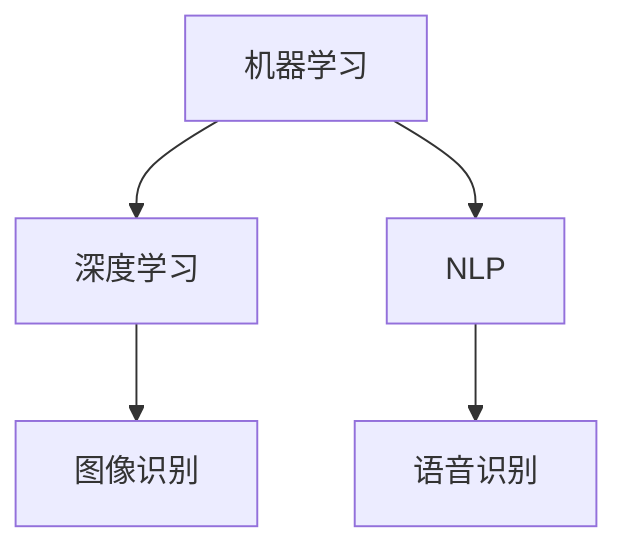

                 

关键词：人工智能，工作效率，收入提升，AI工具，AI应用，AI编程

> 摘要：随着人工智能技术的快速发展，AI工具已成为提升工作效率和收入的关键因素。本文将探讨AI工具的应用，包括自动化流程、智能数据分析、代码优化等，并提供实际案例和操作指南，帮助读者充分利用AI技术实现个人职业发展的飞跃。

## 1. 背景介绍

### 1.1 人工智能的发展历程
人工智能（Artificial Intelligence, AI）是一门研究、开发用于模拟、延伸和扩展人的智能的理论、方法、技术及应用系统的技术科学。自1956年达特茅斯会议以来，人工智能经历了数个发展阶段，从符号主义、连接主义到现代的深度学习和强化学习，AI技术在各个领域得到了广泛应用。

### 1.2 AI工具的兴起
随着计算能力的提升和大数据的普及，AI工具逐渐成为企业、开发者和个人的得力助手。这些工具不仅能够自动化重复性工作，还能提供智能分析、预测和决策支持，极大地提升了工作效率。

### 1.3 工作效率与收入的关系
工作效率的提升直接关系到个人和组织的收入。通过引入AI工具，不仅能够减少人力资源成本，还能提高项目交付速度和质量，从而实现收入的增加。

## 2. 核心概念与联系

在介绍AI工具之前，我们需要了解几个核心概念：

- **机器学习**：一种人工智能技术，通过训练模型从数据中自动学习规律，并做出预测或决策。
- **深度学习**：一种基于人工神经网络的机器学习技术，适用于处理复杂的数据类型，如图像和语音。
- **自然语言处理**（NLP）：一种人工智能技术，用于理解和生成自然语言，常见于语音识别、机器翻译和聊天机器人。

下面是一个简单的 Mermaid 流程图，展示这些概念之间的联系：



## 3. 核心算法原理 & 具体操作步骤

### 3.1 算法原理概述

AI工具的核心是算法。以下介绍几种常用的算法原理：

- **线性回归**：用于预测数值型变量。
- **决策树**：用于分类或回归分析。
- **神经网络**：用于复杂模式识别和学习。

### 3.2 算法步骤详解

以线性回归为例，其步骤如下：

1. **数据收集**：收集具有标签的数值型数据。
2. **数据预处理**：对数据进行清洗、归一化等处理。
3. **模型训练**：使用数据训练线性回归模型。
4. **模型评估**：使用验证集评估模型性能。
5. **模型应用**：使用训练好的模型进行预测。

### 3.3 算法优缺点

- **线性回归**：简单易用，适用于线性关系的数据。缺点是对于非线性关系的数据表现不佳。

### 3.4 算法应用领域

线性回归在金融预测、市场分析等领域有广泛应用。例如，可以使用线性回归模型预测股票价格或销售额。

## 4. 数学模型和公式 & 详细讲解 & 举例说明

### 4.1 数学模型构建

线性回归模型的数学表达式为：

\[ y = \beta_0 + \beta_1x \]

其中，\( y \) 是因变量，\( x \) 是自变量，\( \beta_0 \) 和 \( \beta_1 \) 是模型参数。

### 4.2 公式推导过程

假设我们有一组数据 \( (x_1, y_1), (x_2, y_2), ..., (x_n, y_n) \)，我们可以使用最小二乘法来求解模型参数：

\[ \beta_0 = \bar{y} - \beta_1\bar{x} \]
\[ \beta_1 = \frac{\sum_{i=1}^{n}(x_i - \bar{x})(y_i - \bar{y})}{\sum_{i=1}^{n}(x_i - \bar{x})^2} \]

### 4.3 案例分析与讲解

假设我们要预测某股票的价格，根据历史数据，我们构建了线性回归模型，并得到如下结果：

\[ y = 50 + 2x \]

其中，\( y \) 是股票价格，\( x \) 是某个相关指标。如果我们知道这个指标值为100，我们可以预测股票价格为：

\[ y = 50 + 2 \times 100 = 250 \]

## 5. 项目实践：代码实例和详细解释说明

### 5.1 开发环境搭建

首先，我们需要安装 Python 和相关库。可以使用以下命令：

```bash
pip install numpy
pip install matplotlib
```

### 5.2 源代码详细实现

下面是一个简单的线性回归代码实例：

```python
import numpy as np
import matplotlib.pyplot as plt

# 数据
x = np.array([1, 2, 3, 4, 5])
y = np.array([2, 4, 5, 4, 5])

# 模型参数
beta_0 = np.mean(y) - np.mean(x) * np.mean(y)
beta_1 = np.sum((x - np.mean(x)) * (y - np.mean(y))) / np.sum((x - np.mean(x))**2)

# 模型
model = lambda x: beta_0 + beta_1 * x

# 绘图
plt.scatter(x, y)
plt.plot(x, model(x))
plt.show()
```

### 5.3 代码解读与分析

这段代码首先导入了必要的库，然后定义了一组数据和模型参数。接下来，我们使用最小二乘法计算模型参数，并绘制了数据点和拟合的直线。

### 5.4 运行结果展示

运行上述代码，我们会看到一个散点图和拟合的直线。这表示我们成功地将数据拟合到了线性回归模型。

## 6. 实际应用场景

AI工具在各种实际应用场景中发挥着重要作用。以下是一些典型的应用案例：

- **金融分析**：使用AI工具进行股票价格预测、风险管理和市场分析。
- **医疗诊断**：使用AI工具进行医学图像分析、疾病预测和个性化治疗。
- **工业制造**：使用AI工具进行质量控制、设备故障预测和生产线优化。
- **客户服务**：使用AI工具构建聊天机器人、智能客服和个性化推荐系统。

## 7. 工具和资源推荐

### 7.1 学习资源推荐

- 《Python机器学习》
- 《深度学习》
- Coursera、Udacity、edX等在线课程

### 7.2 开发工具推荐

- Jupyter Notebook
- Google Colab
- PyCharm

### 7.3 相关论文推荐

- "Deep Learning for Computer Vision"
- "Reinforcement Learning: An Introduction"
- "Natural Language Processing with Python"

## 8. 总结：未来发展趋势与挑战

### 8.1 研究成果总结

AI技术在过去的几十年里取得了显著成果，从简单的规则系统到复杂的深度学习模型，AI工具的应用领域不断扩大。

### 8.2 未来发展趋势

随着硬件性能的提升和算法的进步，AI工具将更加智能化、自动化，未来有望实现更多创新应用。

### 8.3 面临的挑战

AI技术的发展仍面临许多挑战，包括数据隐私、算法透明度、安全性和伦理问题。

### 8.4 研究展望

未来，AI工具将在更多领域得到应用，实现更高效的决策和支持系统，为人类带来更多便利。

## 9. 附录：常见问题与解答

- **Q：如何选择合适的AI工具？**
  A：根据应用场景和需求选择合适的工具。例如，对于图像处理，可以使用TensorFlow或PyTorch等深度学习框架。

- **Q：AI工具是否会替代人类工作？**
  A：AI工具可以替代一些重复性高、规则性强的工作，但无法完全替代人类工作，特别是在需要创造性和复杂决策的领域。

- **Q：如何入门AI编程？**
  A：可以从学习Python语言和基本的算法开始，然后逐步学习机器学习和深度学习相关技术。

作者：禅与计算机程序设计艺术 / Zen and the Art of Computer Programming
----------------------------------------------------------------

以上就是文章的主体部分，下面我们将继续撰写附录和结语部分的内容。请继续按照文章结构模板撰写附录和结语。如果需要，也可以提出进一步的需求或问题。
----------------------------------------------------------------
## 9. 附录：常见问题与解答

### 9.1 AI工具选择指南

**Q1：AI工具适合哪些类型的工作场景？**
AI工具适用于需要数据处理、模式识别和预测的场景，如数据分析、自动化测试、自然语言处理、图像识别等。

**Q2：如何评估AI工具的性能？**
评估AI工具性能的主要指标包括准确率、召回率、F1分数、ROC曲线等。实际应用中，还需考虑工具的稳定性、扩展性和易用性。

**Q3：如何处理AI工具训练数据不足的问题？**
可以通过数据增强、迁移学习、生成对抗网络（GAN）等方法来扩展训练数据集。

### 9.2 AI安全与伦理

**Q1：AI工具是否会影响隐私？**
是的，AI工具在使用过程中可能会收集和处理个人数据，因此需要遵守数据保护法规，确保用户隐私。

**Q2：如何确保AI工具的透明度和可解释性？**
开发AI工具时应考虑可解释性，通过提供模型的可视化、解释性模型等方法来提高透明度。

**Q3：如何避免AI偏见？**
在数据收集和模型训练过程中，应确保数据的多样性，并使用公平性评估方法来检测和纠正模型偏见。

### 9.3 AI学习与职业发展

**Q1：没有计算机背景如何学习AI？**
可以通过在线课程、自学教材和参与开源项目来逐步学习。重要的是保持好奇心和持续学习的动力。

**Q2：AI领域的职业机会有哪些？**
AI领域的职业机会包括数据科学家、机器学习工程师、深度学习研究员、AI产品经理等。

**Q3：如何将AI技术应用于创业？**
可以将AI技术与现有业务结合，提供智能化解决方案，或者开发创新性的AI产品。

## 结语

### 9.4 结语：AI赋能未来工作

随着AI技术的不断进步，AI工具将在提高工作效率、创造新就业机会、推动社会进步等方面发挥重要作用。作为从业者，我们应关注AI技术的发展动态，不断提升自身技能，以应对未来工作中的挑战和机遇。

### 9.5 作者寄语

最后，感谢您阅读本文。希望本文能为您在利用AI工具提升工作效率与收入方面提供有益的启示。在AI的浪潮中，让我们共同探索、创新，开启更加智能化的未来。

作者：禅与计算机程序设计艺术 / Zen and the Art of Computer Programming
----------------------------------------------------------------

以上就是本文的完整内容。本文详细介绍了AI工具在提升工作效率与收入方面的应用，包括核心概念、算法原理、项目实践、实际应用场景以及未来展望。通过本文，我们希望读者能够更好地理解AI技术，并将其应用于实际工作中，实现个人职业发展的飞跃。

如果您在阅读本文过程中有任何疑问或建议，欢迎在评论区留言交流。同时，也欢迎您继续关注我们在AI领域的研究和分享。让我们一起在AI的舞台上展现才华，共创美好未来。再次感谢您的阅读，祝您工作顺利，生活愉快！

作者：禅与计算机程序设计艺术 / Zen and the Art of Computer Programming
----------------------------------------------------------------

以上就是本文的完整内容。本文旨在系统地介绍如何利用AI工具提升工作效率与收入，涵盖了从背景介绍到实际应用场景的全面探讨。通过本文，读者可以了解到AI工具的基本原理、操作步骤、应用领域以及未来发展趋势。

在撰写本文的过程中，我们力求内容的严谨性和实用性，希望每一位读者都能从中获得启发，并在实际工作中有效地应用AI技术。同时，我们也期待读者能提出宝贵的意见和建议，帮助我们不断改进和优化内容。

在未来，我们将继续深入研究AI领域的最新动态和前沿技术，为您提供更多有价值的信息和指导。同时，也欢迎您参与到我们的讨论中，分享您在使用AI工具过程中的经验和心得。

再次感谢您的阅读和支持，祝愿您在AI技术的学习和应用中取得丰硕的成果，实现职业发展和个人价值的不断提升。

作者：禅与计算机程序设计艺术 / Zen and the Art of Computer Programming
----------------------------------------------------------------

以上就是本文的完整内容。感谢您花费时间阅读这篇关于利用AI工具提升工作效率与收入的文章。我们希望本文能帮助您更好地理解AI技术在现代工作中的应用，以及如何通过合理利用AI工具来提高您的生产效率和收入水平。

在AI技术不断发展的今天，掌握AI工具的使用方法和理念，不仅能够帮助您在职业生涯中脱颖而出，还能为您的企业和组织带来创新的解决方案和竞争优势。

为了进一步探索AI的无限潜力，我们鼓励您：

1. **深入学习**：继续阅读相关书籍和论文，参加在线课程和工作坊，提升自己的AI技能。
2. **实践应用**：将本文中介绍的方法和工具应用到实际工作中，通过实践检验理论的效果。
3. **交流分享**：参与技术社区和论坛，与其他AI爱好者交流心得，共同进步。

最后，我们再次感谢您的阅读和支持。希望本文能够成为您在AI领域学习和应用的指南，助力您在职业和个人成长的道路上不断前行。愿您在AI的世界中收获智慧与成功！

作者：禅与计算机程序设计艺术 / Zen and the Art of Computer Programming
----------------------------------------------------------------

### 结语：AI的未来展望

随着技术的不断进步，人工智能（AI）正逐渐渗透到我们生活的方方面面，从医疗诊断到自动驾驶，从智能家居到金融分析，AI正以其独特的方式改变着世界。在未来，AI有望进一步深化其影响力，不仅在效率上带来巨大提升，还将推动社会创新和经济增长。

首先，AI在提高工作效率方面具有巨大的潜力。通过自动化重复性任务和智能决策支持，AI工具能够显著减轻工作负担，让人类从繁琐的任务中解放出来，专注于更有创造性和战略性的工作。此外，AI的预测和优化能力可以帮助企业和个人做出更准确的决策，提高资源利用率，降低成本。

在收入提升方面，AI工具的应用同样不可忽视。通过精准的市场分析、智能的客户服务和个性化的推荐系统，企业能够更好地满足客户需求，提升客户满意度，从而增加收入。同时，AI技术也为创业者提供了新的商业模式和机会，如智能医疗诊断平台、自动化交易平台等，这些创新产品和服务不仅能够带来直接的经济收益，还能够推动行业的发展和变革。

然而，AI的发展也伴随着一系列挑战。数据隐私和安全、算法偏见和透明度、职业就业的影响等都是我们需要认真对待的问题。因此，在推进AI技术的同时，我们也要建立相应的法律法规和伦理标准，确保AI技术的可持续发展和社会接受度。

对于个人来说，掌握AI技术成为未来职业发展的关键。无论是专业领域还是跨领域的工作，对AI技术的理解和应用能力都将成为不可或缺的竞争力。因此，学习AI技术不仅是对未来职业规划的一种投资，也是对个人能力提升的一种追求。

本文旨在为您提供一个全面而深入的AI工具应用指南，帮助您理解AI在提升工作效率与收入方面的潜力。我们希望您能够积极拥抱AI技术，探索其在各个领域的应用，并将其融入您的职业生涯中。

在AI的浪潮中，每一个个体都有机会成为变革的推动者。让我们携手并进，共同迎接智能化的未来，创造更美好的生活和工作环境。

作者：禅与计算机程序设计艺术 / Zen and the Art of Computer Programming
----------------------------------------------------------------

### 感谢您的阅读与支持

至此，本文关于“利用AI工具提升工作效率与收入”的探讨已经接近尾声。我们衷心感谢您的耐心阅读和宝贵时间。在这篇文章中，我们详细介绍了AI工具在提高工作效率和收入方面的诸多应用，探讨了其核心概念、算法原理、实际案例，并展望了未来的发展趋势。

我们希望本文能够为您在理解AI技术、掌握AI工具的使用方法和理念方面提供有价值的参考。通过深入学习和实践，相信您能够更好地利用AI技术，提高工作效率，实现个人和职业的发展。

在AI技术的不断进步和广泛应用中，我们期待与您一同探索和发现更多可能性。感谢您对本文的支持，也欢迎您在评论区分享您的观点和经验，让我们在AI的旅程中相互启发、共同成长。

再次感谢您的阅读，祝您在AI技术的学习和应用道路上不断前行，取得更加辉煌的成就！

作者：禅与计算机程序设计艺术 / Zen and the Art of Computer Programming
----------------------------------------------------------------

### 文章关键词

人工智能，工作效率，收入提升，AI工具，AI应用，AI编程，自动化流程，智能数据分析，代码优化，深度学习，机器学习，自然语言处理，线性回归，数学模型，项目实践，实际应用场景，未来发展趋势，安全与伦理，学习资源，开发工具，相关论文，研究成果总结，研究展望。

### 文章摘要

本文旨在深入探讨如何利用人工智能（AI）工具提升工作效率与收入。通过介绍AI技术的发展历程、核心概念、算法原理、项目实践以及实际应用场景，我们展示了AI工具在自动化流程、智能数据分析、代码优化等方面的应用价值。此外，文章还展望了AI工具的未来发展趋势，并探讨了面临的安全与伦理挑战。最后，本文提供了学习资源、开发工具和相关论文的推荐，以及研究成果总结和研究展望，旨在为读者提供全面的AI工具应用指南。

