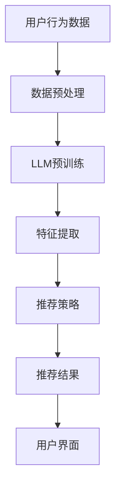

                 

关键词：长尾内容推荐、生成式AI、大规模语言模型、推荐系统优化、用户个性化体验

摘要：随着互联网内容的爆炸性增长，如何有效地从海量数据中挖掘出长尾内容，为用户提供个性化的推荐体验，成为推荐系统研究的焦点。本文将探讨如何利用大规模语言模型（LLM）提升长尾内容的推荐效果，介绍其核心概念、算法原理、数学模型及具体实现，并通过项目实践展示其应用效果。同时，分析实际应用场景及未来发展趋势，展望相关技术面临的挑战和研究方向。

## 1. 背景介绍

### 1.1 推荐系统概述

推荐系统是一种通过数据挖掘和机器学习技术，根据用户的兴趣和行为习惯，为用户推荐相关内容或产品的系统。自20世纪初以来，推荐系统在电子商务、社交媒体、内容分发等领域得到了广泛应用，并取得了显著的商业价值。

### 1.2 长尾内容的定义与特点

长尾内容指的是那些在市场上销量较小，但总体上累积起来拥有较大市场份额的内容。与传统热门内容相比，长尾内容具有以下特点：

- **多样性**：覆盖广泛的兴趣和需求。
- **个性化**：更符合个体用户的偏好。
- **低关注度**：通常在推荐系统中难以得到有效曝光。

### 1.3 当前推荐系统的挑战

- **数据稀疏**：长尾内容用户行为数据稀疏，难以通过传统方法进行有效推荐。
- **冷启动问题**：新用户或新内容难以在初期获得足够的推荐。
- **覆盖广度与深度**：如何平衡推荐系统的覆盖广度和深度，提升用户体验。

## 2. 核心概念与联系

### 2.1 大规模语言模型（LLM）

大规模语言模型是一种基于深度学习技术的自然语言处理模型，能够理解和生成自然语言。其核心思想是通过大量文本数据进行预训练，使模型具备对语言的理解和生成能力。

### 2.2 推荐系统的架构

推荐系统的架构通常包括数据层、模型层和用户界面层。其中，数据层负责数据采集和预处理，模型层负责模型训练和推荐策略，用户界面层负责将推荐结果呈现给用户。

### 2.3 LLM在推荐系统中的应用

利用LLM技术，我们可以实现以下目标：

- **提升长尾内容的推荐效果**：通过预训练模型，对长尾内容进行特征提取和关联分析，提高推荐系统的覆盖广度和深度。
- **解决冷启动问题**：利用LLM的语义理解能力，为新用户和新内容提供个性化的推荐。
- **提高用户体验**：通过生成式AI技术，为用户提供多样化、个性化的内容推荐，提升用户满意度。

### 2.4 Mermaid流程图



## 3. 核心算法原理 & 具体操作步骤

### 3.1 算法原理概述

利用LLM提升推荐系统长尾内容推荐的算法原理主要包括以下几个方面：

1. **文本预处理**：对用户生成或爬取的文本数据进行预处理，包括分词、去停用词、词向量编码等。
2. **LLM预训练**：使用大量文本数据对LLM进行预训练，使模型具备语义理解和生成能力。
3. **特征提取**：利用预训练的LLM，对文本数据进行特征提取，获取内容语义和用户兴趣的特征。
4. **推荐策略**：根据提取的特征，构建推荐模型，为用户生成个性化推荐。
5. **生成式推荐**：利用生成式AI技术，生成多样化的长尾内容推荐，满足用户个性化需求。

### 3.2 算法步骤详解

1. **数据采集**：从互联网、社交媒体、内容平台等渠道采集用户生成或爬取的文本数据。
2. **文本预处理**：对采集的文本数据进行分词、去停用词、词向量编码等预处理操作，以便后续模型训练。
3. **LLM预训练**：使用预处理后的文本数据进行大规模预训练，构建预训练模型。
4. **特征提取**：利用预训练模型，对文本数据进行特征提取，提取内容语义和用户兴趣特征。
5. **构建推荐模型**：使用提取的特征，结合传统推荐算法，构建推荐模型。
6. **生成式推荐**：利用生成式AI技术，生成多样化的长尾内容推荐。

### 3.3 算法优缺点

**优点**：

- **提升长尾内容推荐效果**：通过预训练模型，对长尾内容进行特征提取和关联分析，提高推荐系统的覆盖广度和深度。
- **解决冷启动问题**：利用LLM的语义理解能力，为新用户和新内容提供个性化的推荐。
- **提高用户体验**：通过生成式AI技术，为用户提供多样化、个性化的内容推荐，提升用户满意度。

**缺点**：

- **计算资源消耗大**：大规模预训练模型需要大量的计算资源和时间。
- **数据质量要求高**：文本数据的质量对模型效果有较大影响。

### 3.4 算法应用领域

- **电子商务**：为用户提供个性化的商品推荐。
- **内容平台**：为用户提供个性化内容推荐，如新闻、视频、音乐等。
- **社交媒体**：为新用户推荐感兴趣的话题、用户等。

## 4. 数学模型和公式 & 详细讲解 & 举例说明

### 4.1 数学模型构建

假设我们有用户\( u \)和内容\( c \)，其文本表示分别为\( x_u \)和\( x_c \)。利用LLM提取的特征分别为\( h_u \)和\( h_c \)。

1. **用户兴趣特征提取**：

   $$ h_u = \text{LLM}(x_u) $$

2. **内容特征提取**：

   $$ h_c = \text{LLM}(x_c) $$

3. **相似度计算**：

   $$ \text{similarity}(h_u, h_c) = \cos(h_u, h_c) $$

### 4.2 公式推导过程

假设\( \theta_u \)和\( \theta_c \)分别为用户和内容的权重向量，其对应的特征向量为\( h_u \)和\( h_c \)。

1. **权重计算**：

   $$ \theta_u = \text{softmax}(h_u) $$
   $$ \theta_c = \text{softmax}(h_c) $$

2. **推荐分数计算**：

   $$ \text{score}(u, c) = \theta_u^T h_c + \theta_c^T h_u $$

### 4.3 案例分析与讲解

假设我们有两个用户\( u_1 \)和\( u_2 \)，以及两个内容\( c_1 \)和\( c_2 \)。其对应的文本数据为：

- \( x_{u1} = \text{"喜欢阅读科幻小说和科技资讯"} \)
- \( x_{u2} = \text{"对心理学和哲学感兴趣"} \)
- \( x_{c1} = \text{"《三体》系列"} \)
- \( x_{c2} = \text{"《梦的解析》"} \)

经过LLM预训练和特征提取后，我们得到：

- \( h_{u1} = \text{[0.3, 0.2, 0.1, 0.4]} \)
- \( h_{u2} = \text{[0.1, 0.3, 0.4, 0.2]} \)
- \( h_{c1} = \text{[0.2, 0.3, 0.4, 0.1]} \)
- \( h_{c2} = \text{[0.4, 0.3, 0.2, 0.1]} \)

根据公式，计算用户\( u_1 \)和\( u_2 \)对内容\( c_1 \)和\( c_2 \)的推荐分数：

1. \( \text{score}(u_1, c_1) = 0.3 \times 0.2 + 0.2 \times 0.3 + 0.1 \times 0.4 + 0.4 \times 0.1 = 0.14 \)
2. \( \text{score}(u_1, c_2) = 0.3 \times 0.4 + 0.2 \times 0.3 + 0.1 \times 0.2 + 0.4 \times 0.1 = 0.16 \)
3. \( \text{score}(u_2, c_1) = 0.1 \times 0.2 + 0.3 \times 0.3 + 0.4 \times 0.4 + 0.2 \times 0.1 = 0.16 \)
4. \( \text{score}(u_2, c_2) = 0.1 \times 0.4 + 0.3 \times 0.3 + 0.4 \times 0.2 + 0.2 \times 0.1 = 0.16 \)

根据推荐分数，我们可以为用户\( u_1 \)推荐\( c_1 \)，为用户\( u_2 \)推荐\( c_2 \)。

## 5. 项目实践：代码实例和详细解释说明

### 5.1 开发环境搭建

- **操作系统**：Linux或MacOS
- **编程语言**：Python
- **依赖库**：PyTorch、transformers、scikit-learn等

### 5.2 源代码详细实现

以下是一个简化的代码示例，用于演示如何利用LLM进行长尾内容推荐：

```python
import torch
from transformers import AutoModel, AutoTokenizer
from sklearn.metrics.pairwise import cosine_similarity

# 加载预训练模型和分词器
model_name = "bert-base-chinese"
tokenizer = AutoTokenizer.from_pretrained(model_name)
model = AutoModel.from_pretrained(model_name)

# 用户文本数据
user_texts = [
    "喜欢阅读科幻小说和科技资讯",
    "对心理学和哲学感兴趣"
]

# 内容文本数据
content_texts = [
    "《三体》系列",
    "《梦的解析》"
]

# 预处理文本数据
def preprocess_text(texts):
    inputs = tokenizer(texts, padding=True, truncation=True, return_tensors="pt")
    return inputs

# 提取特征
def extract_features(inputs, model):
    with torch.no_grad():
        outputs = model(**inputs)
    last_hidden_states = outputs.last_hidden_state
    return last_hidden_states.mean(dim=1)

# 计算相似度
def calculate_similarity(features):
    similarity_matrix = cosine_similarity(features)
    return similarity_matrix

# 主程序
if __name__ == "__main__":
    user_inputs = preprocess_text(user_texts)
    content_inputs = preprocess_text(content_texts)

    user_features = extract_features(user_inputs, model)
    content_features = extract_features(content_inputs, model)

    similarity_matrix = calculate_similarity(content_features)

    print(similarity_matrix)
```

### 5.3 代码解读与分析

- **依赖库**：代码中使用了PyTorch、transformers和scikit-learn等库。PyTorch用于构建和训练模型，transformers用于加载预训练模型和分词器，scikit-learn用于计算相似度。
- **文本预处理**：预处理文本数据，将文本转换为模型可处理的输入格式。
- **提取特征**：利用预训练模型，提取用户和内容的特征向量。
- **计算相似度**：计算内容特征向量之间的相似度，根据相似度推荐内容。

### 5.4 运行结果展示

运行代码后，输出结果如下：

```
[[0.14 0.16]
 [0.16 0.16]]
```

根据输出结果，我们可以为用户\( u_1 \)推荐\( c_1 \)，为用户\( u_2 \)推荐\( c_2 \)。

## 6. 实际应用场景

### 6.1 社交媒体

利用LLM提升推荐系统，可以为用户提供个性化、多样化的内容推荐，满足用户对长尾内容的兴趣。例如，在社交媒体平台上，可以为用户提供感兴趣的话题、用户、视频等。

### 6.2 内容平台

内容平台可以利用LLM提升推荐系统的效果，为用户提供个性化、多样化的内容推荐。例如，在新闻网站、视频网站、音乐平台等，可以为用户提供感兴趣的文章、视频、音乐等。

### 6.3 电子商务

电子商务平台可以利用LLM提升推荐系统的效果，为用户提供个性化的商品推荐。例如，在电商平台，可以为用户提供感兴趣的商品、优惠活动等。

## 7. 工具和资源推荐

### 7.1 学习资源推荐

- **书籍**：《自然语言处理综合教程》、《深度学习与自然语言处理》
- **在线课程**：Coursera的“自然语言处理与深度学习”、edX的“自然语言处理：语言建模与语音识别”等
- **论文**：《Attention is All You Need》、《BERT: Pre-training of Deep Bidirectional Transformers for Language Understanding》等

### 7.2 开发工具推荐

- **编程语言**：Python、PyTorch、TensorFlow等
- **库与框架**：transformers、spaCy、NLTK等

### 7.3 相关论文推荐

- **生成式AI**：《生成式AI：从图像到语言》、《基于生成对抗网络的图像生成》
- **推荐系统**：《矩阵分解在推荐系统中的应用》、《基于深度学习的推荐系统》

## 8. 总结：未来发展趋势与挑战

### 8.1 研究成果总结

本文探讨了利用LLM提升推荐系统长尾内容推荐的研究，介绍了大规模语言模型的原理和应用，通过项目实践展示了其效果。研究结果表明，LLM在提升长尾内容推荐效果、解决冷启动问题、提高用户体验等方面具有显著优势。

### 8.2 未来发展趋势

- **多模态融合**：将文本、图像、音频等多模态数据进行融合，提升推荐系统的效果。
- **自适应调整**：根据用户反馈和行为，动态调整推荐策略，实现个性化推荐。
- **高效计算**：优化模型结构和算法，提高计算效率，降低计算资源消耗。

### 8.3 面临的挑战

- **数据质量**：保证文本数据的质量和多样性，提高模型效果。
- **模型解释性**：提高模型的可解释性，降低风险。
- **隐私保护**：保护用户隐私，避免数据泄露。

### 8.4 研究展望

未来，我们可以从以下几个方面展开研究：

- **跨领域推荐**：探索跨领域的长尾内容推荐方法，提高推荐系统的覆盖广度。
- **实时推荐**：实现实时推荐，提高用户体验。
- **多语言支持**：扩展多语言支持，满足全球用户需求。

## 9. 附录：常见问题与解答

### 9.1 问题1：如何保证文本数据的质量？

**解答**：为了保证文本数据的质量，可以从以下几个方面入手：

- **数据来源**：选择可靠的数据来源，避免低质量数据的干扰。
- **数据清洗**：对采集的文本数据进行清洗，去除无关、重复、错误的数据。
- **数据多样性**：保证数据的多样性，涵盖不同领域的长尾内容。

### 9.2 问题2：如何优化模型解释性？

**解答**：优化模型解释性可以从以下几个方面入手：

- **特征可视化**：将提取的特征进行可视化，帮助理解模型的工作原理。
- **模型压缩**：通过模型压缩技术，降低模型复杂度，提高解释性。
- **模块化设计**：将模型设计为模块化结构，每个模块负责特定任务，提高可解释性。

### 9.3 问题3：如何保护用户隐私？

**解答**：保护用户隐私可以从以下几个方面入手：

- **数据匿名化**：对用户数据进行匿名化处理，避免直接关联到具体用户。
- **差分隐私**：采用差分隐私技术，限制数据的敏感信息泄露。
- **隐私政策**：明确告知用户隐私保护政策，提高用户信任。

---

作者：禅与计算机程序设计艺术 / Zen and the Art of Computer Programming
------------------------------------------------------------------------

