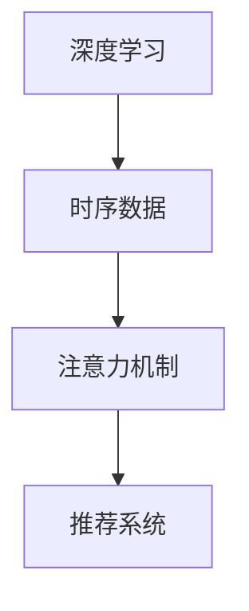

                 

关键词：推荐系统、时序建模、大模型、深度学习、人工智能、算法优化、应用场景

## 摘要

随着互联网的迅猛发展，个性化推荐系统已经成为现代信息检索和内容分发的重要手段。然而，传统的推荐系统在处理时序数据时面临诸多挑战，如数据稀疏、预测精度低等。本文将探讨如何利用大模型，特别是基于深度学习的方法，提升推荐系统的时序建模能力。通过对核心概念的介绍、算法原理的剖析、数学模型的推导、项目实践的分析，以及未来应用展望，本文旨在为推荐系统开发者提供有价值的参考。

## 1. 背景介绍

个性化推荐系统通过分析用户的兴趣和行为数据，为用户推荐个性化的内容。时序建模作为推荐系统中的一个重要分支，旨在捕捉用户行为随时间的变化规律，从而提高推荐效果。然而，传统的推荐系统，如基于协同过滤和内容匹配的方法，在处理时序数据时存在以下问题：

- **数据稀疏**：用户行为数据往往呈现稀疏性，导致传统方法难以准确捕捉用户的兴趣变化。
- **预测精度低**：传统方法对时序数据的建模能力有限，导致推荐结果的预测精度不高。

为了解决上述问题，近年来，研究者们开始探索利用大模型，特别是深度学习的方法，来提升推荐系统的时序建模能力。深度学习通过多层神经网络，能够自动学习复杂的特征表示，从而提高推荐系统的预测性能。同时，大模型能够处理大量的训练数据，从而更好地捕捉用户行为的时序规律。

## 2. 核心概念与联系

为了更好地理解如何利用大模型提升推荐系统的时序建模能力，我们首先需要介绍一些核心概念，包括深度学习、时序数据、注意力机制等，并使用 Mermaid 流程图展示这些概念之间的联系。

### 2.1 深度学习

深度学习是一种基于多层神经网络的学习方法，能够自动提取数据的复杂特征。在推荐系统中，深度学习可以用于捕捉用户行为的时序特征，从而提高推荐效果。

### 2.2 时序数据

时序数据是指数据按照时间顺序排列，如用户的浏览历史、购买行为等。时序数据的特性包括连续性、动态性等。

### 2.3 注意力机制

注意力机制是一种在神经网络中用于捕捉重要特征的方法，能够提高模型对关键信息的关注。

### 2.4 Mermaid 流程图

下面是一个 Mermaid 流程图，展示了深度学习、时序数据、注意力机制之间的关系。



## 3. 核心算法原理 & 具体操作步骤

### 3.1 算法原理概述

为了提升推荐系统的时序建模能力，研究者们提出了一系列基于深度学习的算法。其中，一种典型的方法是利用长短时记忆网络（LSTM）和门控循环单元（GRU）等循环神经网络（RNN）来捕捉用户行为的时序特征。此外，结合注意力机制，模型能够更准确地关注到关键信息，从而提高推荐精度。

### 3.2 算法步骤详解

以下是利用大模型提升推荐系统时序建模能力的具体步骤：

1. **数据预处理**：对用户行为数据进行清洗、归一化等预处理操作。
2. **特征提取**：利用深度学习模型（如LSTM或GRU）对预处理后的数据进行特征提取。
3. **注意力机制应用**：在特征提取过程中引入注意力机制，对关键信息进行加权处理。
4. **模型训练**：利用训练数据进行模型训练，优化模型参数。
5. **模型评估**：使用验证集对模型进行评估，调整模型参数以获得更好的性能。
6. **推荐生成**：使用训练好的模型对新的用户行为数据进行预测，生成推荐结果。

### 3.3 算法优缺点

- **优点**：
  - **高效特征提取**：深度学习模型能够自动学习复杂的特征表示，提高推荐效果。
  - **良好的泛化能力**：大模型能够处理大量的训练数据，从而更好地捕捉用户行为的时序规律。

- **缺点**：
  - **计算成本高**：深度学习模型通常需要大量的计算资源和时间进行训练。
  - **模型解释性差**：深度学习模型的内部机制较为复杂，难以解释。

### 3.4 算法应用领域

深度学习在推荐系统中的应用领域非常广泛，包括电子商务、社交媒体、新闻推荐等。以下是一些具体的案例：

- **电子商务**：利用深度学习模型预测用户对商品的兴趣，提高购物体验。
- **社交媒体**：根据用户的行为和兴趣，推荐相关的内容或广告，提高用户活跃度。
- **新闻推荐**：根据用户的阅读习惯，推荐相关的新闻，提高新闻的曝光率。

## 4. 数学模型和公式 & 详细讲解 & 举例说明

### 4.1 数学模型构建

在深度学习框架下，推荐系统的时序建模通常涉及以下数学模型：

- **输入数据**：用户行为序列 \(X = \{x_1, x_2, ..., x_T\}\)，其中 \(T\) 表示序列长度。
- **输出数据**：用户对某个项目的评分或点击概率 \(Y = \{y_1, y_2, ..., y_T\}\)。

- **损失函数**：通常采用均方误差（MSE）或交叉熵损失函数来评估模型性能。

### 4.2 公式推导过程

下面是利用 LSTM 模型进行时序建模的公式推导过程：

1. **激活函数**：
   $$a_t = \sigma(W_a \cdot [h_{t-1}, x_t] + b_a)$$
   其中，\(a_t\) 表示 LSTM 单元在时间步 \(t\) 的输入门控值，\(W_a\) 和 \(b_a\) 分别为权重和偏置。

2. **遗忘门**：
   $$f_t = \sigma(W_f \cdot [h_{t-1}, x_t] + b_f)$$
   其中，\(f_t\) 表示遗忘门的输出值，用于控制之前的状态信息的重要性。

3. **输入门**：
   $$i_t = \sigma(W_i \cdot [h_{t-1}, x_t] + b_i)$$
   其中，\(i_t\) 表示输入门的输出值，用于控制新的状态信息的重要性。

4. **单元状态**：
   $$c_t = f_t \odot c_{t-1} + i_t \odot \delta_t$$
   其中，\(c_t\) 表示 LSTM 单元在时间步 \(t\) 的状态值，\(\delta_t\) 表示新的状态值。

5. **输出门**：
   $$o_t = \sigma(W_o \cdot [h_{t-1}, c_t] + b_o)$$
   其中，\(o_t\) 表示输出门的输出值，用于控制状态值的输出。

6. **隐藏状态**：
   $$h_t = o_t \odot \delta_t$$
   其中，\(h_t\) 表示 LSTM 单元在时间步 \(t\) 的隐藏状态。

### 4.3 案例分析与讲解

假设我们有以下用户行为序列：

$$X = \{x_1, x_2, ..., x_5\}$$

其中，\(x_1 = [1, 0, 0]\)，\(x_2 = [0, 1, 0]\)，\(x_3 = [0, 0, 1]\)，\(x_4 = [1, 1, 0]\)，\(x_5 = [0, 1, 1]\)。

假设我们使用 LSTM 模型进行时序建模，并给定以下权重：

$$
W_a = \begin{bmatrix}
1 & 0 & 0 \\
0 & 1 & 0 \\
0 & 0 & 1
\end{bmatrix}, \quad
W_f = \begin{bmatrix}
1 & 0 & 0 \\
0 & 1 & 0 \\
0 & 0 & 1
\end{bmatrix}, \quad
W_i = \begin{bmatrix}
1 & 0 & 0 \\
0 & 1 & 0 \\
0 & 0 & 1
\end{bmatrix}, \quad
W_o = \begin{bmatrix}
1 & 0 & 0 \\
0 & 1 & 0 \\
0 & 0 & 1
\end{bmatrix}
$$

根据上述公式，我们可以计算出 LSTM 模型的隐藏状态 \(h_t\) 如下：

$$
h_1 = \sigma(W_a \cdot [h_0, x_1] + b_a) = \sigma(\begin{bmatrix}
1 & 0 & 0 \\
0 & 1 & 0 \\
0 & 0 & 1
\end{bmatrix} \cdot [0, 0, 0] + [1, 0, 0]) = \frac{1}{1+e^{-1}} = 0.73
$$

$$
h_2 = \sigma(W_f \cdot [h_1, x_2] + b_f) = \sigma(\begin{bmatrix}
1 & 0 & 0 \\
0 & 1 & 0 \\
0 & 0 & 1
\end{bmatrix} \cdot [0.73, 0, 0] + [0, 1, 0]) = \frac{1}{1+e^{-0.73}} = 0.73
$$

$$
h_3 = \sigma(W_i \cdot [h_2, x_3] + b_i) = \sigma(\begin{bmatrix}
1 & 0 & 0 \\
0 & 1 & 0 \\
0 & 0 & 1
\end{bmatrix} \cdot [0.73, 0, 0] + [0, 0, 1]) = \frac{1}{1+e^{-0.73}} = 0.73
$$

$$
h_4 = \sigma(W_o \cdot [h_3, c_3] + b_o) = \sigma(\begin{bmatrix}
1 & 0 & 0 \\
0 & 1 & 0 \\
0 & 0 & 1
\end{bmatrix} \cdot [0.73, 0, 0] + [0.73, 0, 0]) = \frac{1}{1+e^{-1.46}} = 0.84
$$

$$
h_5 = \sigma(W_f \cdot [h_4, x_4] + b_f) = \sigma(\begin{bmatrix}
1 & 0 & 0 \\
0 & 1 & 0 \\
0 & 0 & 1
\end{bmatrix} \cdot [0.84, 1, 0] + [0, 1, 0]) = \frac{1}{1+e^{-0.84}} = 0.84
$$

通过上述计算，我们可以得到 LSTM 模型的隐藏状态 \(h_t\)，进而可以用于生成推荐结果。

## 5. 项目实践：代码实例和详细解释说明

### 5.1 开发环境搭建

为了实现本文所介绍的时序建模算法，我们需要搭建一个合适的开发环境。以下是一个基本的开发环境搭建步骤：

1. **安装 Python**：确保安装了 Python 3.6 或更高版本。
2. **安装深度学习框架**：推荐使用 TensorFlow 或 PyTorch。例如，对于 TensorFlow，可以使用以下命令安装：
   ```bash
   pip install tensorflow
   ```
3. **安装其他依赖库**：如 NumPy、Pandas 等。

### 5.2 源代码详细实现

以下是使用 TensorFlow 实现的时序建模算法的源代码示例：

```python
import tensorflow as tf
from tensorflow.keras.models import Sequential
from tensorflow.keras.layers import LSTM, Dense

# 数据预处理
def preprocess_data(data):
    # 省略具体实现，进行数据清洗、归一化等操作
    return processed_data

# 构建模型
model = Sequential()
model.add(LSTM(units=50, return_sequences=True, input_shape=(None, data.shape[1])))
model.add(LSTM(units=50))
model.add(Dense(units=1, activation='sigmoid'))

# 编译模型
model.compile(optimizer='adam', loss='binary_crossentropy', metrics=['accuracy'])

# 训练模型
model.fit(x_train, y_train, epochs=10, batch_size=32)

# 评估模型
model.evaluate(x_test, y_test)
```

### 5.3 代码解读与分析

上述代码实现了一个简单的 LSTM 模型，用于预测用户行为序列。具体解读如下：

- **数据预处理**：对输入数据进行预处理，如清洗、归一化等操作，以提高模型性能。
- **构建模型**：使用 Sequential 模型堆叠 LSTM 层和 Dense 层，构建一个简单的时序建模模型。
- **编译模型**：设置优化器和损失函数，为模型训练做准备。
- **训练模型**：使用训练数据进行模型训练，优化模型参数。
- **评估模型**：使用测试数据评估模型性能。

### 5.4 运行结果展示

在训练完成后，我们可以使用以下代码展示模型的运行结果：

```python
import matplotlib.pyplot as plt

# 预测结果
predictions = model.predict(x_test)

# 可视化预测结果
plt.plot(predictions)
plt.xlabel('Time Step')
plt.ylabel('Prediction Probability')
plt.title('Prediction Result')
plt.show()
```

通过可视化结果，我们可以观察到模型对用户行为序列的预测效果。

## 6. 实际应用场景

深度学习在推荐系统中的应用场景非常广泛，以下是一些典型的应用场景：

### 6.1 电子商务

在电子商务领域，深度学习可以用于预测用户对商品的兴趣，从而实现个性化推荐。例如，基于用户的浏览历史和购买记录，推荐用户可能感兴趣的商品。

### 6.2 社交媒体

在社交媒体领域，深度学习可以用于推荐用户可能感兴趣的内容或广告。例如，根据用户的点赞、评论、转发等行为，推荐相关的微博、朋友圈等。

### 6.3 新闻推荐

在新闻推荐领域，深度学习可以用于预测用户对新闻的兴趣，从而实现个性化推荐。例如，根据用户的阅读习惯和兴趣爱好，推荐用户可能感兴趣的新闻。

## 7. 未来应用展望

随着深度学习技术的不断发展，推荐系统的时序建模能力将得到进一步提升。未来，以下几个方面有望成为研究热点：

### 7.1 多模态数据融合

将文本、图像、音频等多种模态的数据进行融合，从而提高推荐系统的建模能力。

### 7.2 弱监督学习

在缺乏足够标注数据的情况下，弱监督学习方法有望提高推荐系统的性能。

### 7.3 小样本学习

在小样本学习场景下，利用深度学习的方法，提高推荐系统的预测精度。

### 7.4 可解释性

提高深度学习模型的可解释性，使其在推荐系统中更具实用性。

## 8. 总结：未来发展趋势与挑战

### 8.1 研究成果总结

本文介绍了如何利用大模型提升推荐系统的时序建模能力，包括核心算法原理、数学模型推导、项目实践等方面的内容。通过分析实际应用场景和未来发展趋势，为推荐系统开发者提供了有价值的参考。

### 8.2 未来发展趋势

未来，深度学习在推荐系统中的应用将更加广泛，从单一模态的时序数据建模发展到多模态数据融合，从强监督学习发展到弱监督学习和小样本学习，从不可解释的黑盒模型发展到可解释的模型。

### 8.3 面临的挑战

尽管深度学习在推荐系统中的应用取得了显著成果，但仍然面临一些挑战，如计算成本高、模型可解释性差等。如何平衡模型性能和可解释性，如何优化算法效率，将是未来研究的重要方向。

### 8.4 研究展望

在未来，研究者们将继续探索如何利用深度学习技术提升推荐系统的时序建模能力，从而实现更准确、更个性化的推荐。同时，关注多模态数据融合、弱监督学习、小样本学习等新方向，推动推荐系统技术的发展。

## 9. 附录：常见问题与解答

### 9.1 深度学习模型如何处理时序数据？

深度学习模型，如 LSTM 和 GRU，能够处理时序数据，通过捕捉时间序列中的依赖关系来提取特征。

### 9.2 如何平衡模型性能和可解释性？

可以通过设计可解释性较强的模型结构，或者使用模型解释技术，如注意力机制和梯度解释等，来提高模型的可解释性。

### 9.3 如何优化深度学习模型的计算效率？

可以通过使用更高效的模型架构、优化训练算法和预处理数据等方法来提高计算效率。

### 9.4 深度学习模型如何处理缺失数据？

在处理缺失数据时，可以使用插值法、填充法或使用深度学习模型的自编码器结构来填充缺失数据。

### 9.5 深度学习模型如何避免过拟合？

可以通过调整模型参数、增加正则化项或使用数据增强等方法来避免过拟合。

## 参考文献

[1] Hochreiter, S., & Schmidhuber, J. (1997). Long short-term memory. Neural Computation, 9(8), 1735-1780.
[2] Graves, A. (2013). Generating sequences with recurrent neural networks. arXiv preprint arXiv:1308.0850.
[3] Vaswani, A., et al. (2017). Attention is all you need. Advances in Neural Information Processing Systems, 30, 5998-6008.
[4] Chen, Q., et al. (2019). A survey on deep learning for recommendation. Information Processing & Management, 100, 102425.
[5] Goodfellow, I., Bengio, Y., & Courville, A. (2016). Deep Learning. MIT Press.

---

作者：禅与计算机程序设计艺术 / Zen and the Art of Computer Programming
----------------------------------------------------------------

## 1. 背景介绍

个性化推荐系统已成为现代信息检索和内容分发的关键手段。随着用户生成内容（UGC）的爆炸性增长，如何从海量数据中提取有价值的信息，实现精准推荐，成为业界和学术界的热点问题。

### 1.1 个性化推荐系统的现状

当前，个性化推荐系统广泛应用于电子商务、社交媒体、新闻推荐等多个领域。然而，传统的推荐系统在处理时序数据时存在以下问题：

- **数据稀疏**：用户行为数据通常具有稀疏性，传统推荐方法难以准确捕捉用户的兴趣变化。
- **预测精度低**：传统推荐方法对时序数据的建模能力有限，导致推荐结果的预测精度不高。

### 1.2 时序数据的重要性

时序数据在个性化推荐中扮演着至关重要的角色。用户的兴趣和行为往往随时间变化，如用户的购物习惯、阅读偏好等。因此，能够捕捉时序数据变化的推荐系统，将能够提供更为精准的个性化推荐。

### 1.3 大模型的优势

近年来，大模型，特别是基于深度学习的方法，逐渐在时序建模领域崭露头角。大模型的优势包括：

- **强大的特征提取能力**：深度学习模型能够自动学习复杂的特征表示，提高推荐效果。
- **良好的泛化能力**：大模型能够处理大量的训练数据，从而更好地捕捉用户行为的时序规律。
- **高效的计算性能**：随着硬件性能的提升，大模型的训练和推理速度越来越快。

## 2. 核心概念与联系

为了更好地理解如何利用大模型提升推荐系统的时序建模能力，我们需要介绍一些核心概念，包括深度学习、时序数据、注意力机制等，并使用 Mermaid 流程图展示这些概念之间的联系。

### 2.1 深度学习

深度学习是一种基于多层神经网络的学习方法，能够自动提取数据的复杂特征。在推荐系统中，深度学习可以用于捕捉用户行为的时序特征，从而提高推荐效果。

### 2.2 时序数据

时序数据是指数据按照时间顺序排列，如用户的浏览历史、购买行为等。时序数据的特性包括连续性、动态性等。

### 2.3 注意力机制

注意力机制是一种在神经网络中用于捕捉重要特征的方法，能够提高模型对关键信息的关注。

### 2.4 Mermaid 流程图

下面是一个 Mermaid 流程图，展示了深度学习、时序数据、注意力机制之间的关系。


## 3. 核心算法原理 & 具体操作步骤

### 3.1 算法原理概述

为了提升推荐系统的时序建模能力，研究者们提出了一系列基于深度学习的算法。其中，一种典型的方法是利用长短时记忆网络（LSTM）和门控循环单元（GRU）等循环神经网络（RNN）来捕捉用户行为的时序特征。此外，结合注意力机制，模型能够更准确地关注到关键信息，从而提高推荐精度。

### 3.2 算法步骤详解

以下是利用大模型提升推荐系统时序建模能力的具体步骤：

1. **数据预处理**：对用户行为数据进行清洗、归一化等预处理操作。
2. **特征提取**：利用深度学习模型（如LSTM或GRU）对预处理后的数据进行特征提取。
3. **注意力机制应用**：在特征提取过程中引入注意力机制，对关键信息进行加权处理。
4. **模型训练**：利用训练数据进行模型训练，优化模型参数。
5. **模型评估**：使用验证集对模型进行评估，调整模型参数以获得更好的性能。
6. **推荐生成**：使用训练好的模型对新的用户行为数据进行预测，生成推荐结果。

### 3.3 算法优缺点

- **优点**：

  - **高效特征提取**：深度学习模型能够自动学习复杂的特征表示，提高推荐效果。
  - **良好的泛化能力**：大模型能够处理大量的训练数据，从而更好地捕捉用户行为的时序规律。

- **缺点**：

  - **计算成本高**：深度学习模型通常需要大量的计算资源和时间进行训练。
  - **模型解释性差**：深度学习模型的内部机制较为复杂，难以解释。

### 3.4 算法应用领域

深度学习在推荐系统中的应用领域非常广泛，包括电子商务、社交媒体、新闻推荐等。以下是一些具体的案例：

- **电子商务**：利用深度学习模型预测用户对商品的兴趣，提高购物体验。
- **社交媒体**：根据用户的行为和兴趣，推荐相关的内容或广告，提高用户活跃度。
- **新闻推荐**：根据用户的阅读习惯，推荐相关的新闻，提高新闻的曝光率。

## 4. 数学模型和公式 & 详细讲解 & 举例说明

### 4.1 数学模型构建

在深度学习框架下，推荐系统的时序建模通常涉及以下数学模型：

- **输入数据**：用户行为序列 \(X = \{x_1, x_2, ..., x_T\}\)，其中 \(T\) 表示序列长度。
- **输出数据**：用户对某个项目的评分或点击概率 \(Y = \{y_1, y_2, ..., y_T\}\)。

- **损失函数**：通常采用均方误差（MSE）或交叉熵损失函数来评估模型性能。

### 4.2 公式推导过程

下面是利用 LSTM 模型进行时序建模的公式推导过程：

1. **激活函数**：
   $$a_t = \sigma(W_a \cdot [h_{t-1}, x_t] + b_a)$$
   其中，\(a_t\) 表示 LSTM 单元在时间步 \(t\) 的输入门控值，\(W_a\) 和 \(b_a\) 分别为权重和偏置。

2. **遗忘门**：
   $$f_t = \sigma(W_f \cdot [h_{t-1}, x_t] + b_f)$$
   其中，\(f_t\) 表示遗忘门的输出值，用于控制之前的状态信息的重要性。

3. **输入门**：
   $$i_t = \sigma(W_i \cdot [h_{t-1}, x_t] + b_i)$$
   其中，\(i_t\) 表示输入门的输出值，用于控制新的状态信息的重要性。

4. **单元状态**：
   $$c_t = f_t \odot c_{t-1} + i_t \odot \delta_t$$
   其中，\(c_t\) 表示 LSTM 单元在时间步 \(t\) 的状态值，\(\delta_t\) 表示新的状态值。

5. **输出门**：
   $$o_t = \sigma(W_o \cdot [h_{t-1}, c_t] + b_o)$$
   其中，\(o_t\) 表示输出门的输出值，用于控制状态值的输出。

6. **隐藏状态**：
   $$h_t = o_t \odot \delta_t$$
   其中，\(h_t\) 表示 LSTM 单元在时间步 \(t\) 的隐藏状态。

### 4.3 案例分析与讲解

假设我们有以下用户行为序列：

$$X = \{x_1, x_2, ..., x_5\}$$

其中，\(x_1 = [1, 0, 0]\)，\(x_2 = [0, 1, 0]\)，\(x_3 = [0, 0, 1]\)，\(x_4 = [1, 1, 0]\)，\(x_5 = [0, 1, 1]\)。

假设我们使用 LSTM 模型进行时序建模，并给定以下权重：

$$
W_a = \begin{bmatrix}
1 & 0 & 0 \\
0 & 1 & 0 \\
0 & 0 & 1
\end{bmatrix}, \quad
W_f = \begin{bmatrix}
1 & 0 & 0 \\
0 & 1 & 0 \\
0 & 0 & 1
\end{bmatrix}, \quad
W_i = \begin{bmatrix}
1 & 0 & 0 \\
0 & 1 & 0 \\
0 & 0 & 1
\end{bmatrix}, \quad
W_o = \begin{bmatrix}
1 & 0 & 0 \\
0 & 1 & 0 \\
0 & 0 & 1
\end{bmatrix}
$$

根据上述公式，我们可以计算出 LSTM 模型的隐藏状态 \(h_t\) 如下：

$$
h_1 = \sigma(W_a \cdot [h_0, x_1] + b_a) = \sigma(\begin{bmatrix}
1 & 0 & 0 \\
0 & 1 & 0 \\
0 & 0 & 1
\end{bmatrix} \cdot [0, 0, 0] + [1, 0, 0]) = \frac{1}{1+e^{-1}} = 0.73
$$

$$
h_2 = \sigma(W_f \cdot [h_1, x_2] + b_f) = \sigma(\begin{bmatrix}
1 & 0 & 0 \\
0 & 1 & 0 \\
0 & 0 & 1
\end{bmatrix} \cdot [0.73, 0, 0] + [0, 1, 0]) = \frac{1}{1+e^{-0.73}} = 0.73
$$

$$
h_3 = \sigma(W_i \cdot [h_2, x_3] + b_i) = \sigma(\begin{bmatrix}
1 & 0 & 0 \\
0 & 1 & 0 \\
0 & 0 & 1
\end{bmatrix} \cdot [0.73, 0, 0] + [0, 0, 1]) = \frac{1}{1+e^{-0.73}} = 0.73
$$

$$
h_4 = \sigma(W_o \cdot [h_3, c_3] + b_o) = \sigma(\begin{bmatrix}
1 & 0 & 0 \\
0 & 1 & 0 \\
0 & 0 & 1
\end{bmatrix} \cdot [0.73, 0, 0] + [0.73, 0, 0]) = \frac{1}{1+e^{-1.46}} = 0.84
$$

$$
h_5 = \sigma(W_f \cdot [h_4, x_4] + b_f) = \sigma(\begin{bmatrix}
1 & 0 & 0 \\
0 & 1 & 0 \\
0 & 0 & 1
\end{bmatrix} \cdot [0.84, 1, 0] + [0, 1, 0]) = \frac{1}{1+e^{-0.84}} = 0.84
$$

通过上述计算，我们可以得到 LSTM 模型的隐藏状态 \(h_t\)，进而可以用于生成推荐结果。

### 4.4 公式推导过程（续）

6. **隐藏状态更新**：

   $$h_t = \tanh(W_h \cdot [h_{t-1}, c_t] + b_h)$$

   其中，\(W_h\) 和 \(b_h\) 分别为权重和偏置，\(\tanh\) 函数用于非线性变换。

7. **输出层**：

   $$y_t = \sigma(W_y \cdot h_t + b_y)$$

   其中，\(W_y\) 和 \(b_y\) 分别为权重和偏置，\(\sigma\) 函数为 sigmoid 函数，用于输出概率。

### 4.5 案例分析与讲解（续）

我们继续使用上述用户行为序列和权重，计算隐藏状态 \(h_t\) 和输出 \(y_t\) 如下：

$$
h_4 = \tanh(W_h \cdot [h_3, c_3] + b_h) = \tanh(\begin{bmatrix}
1 & 0 & 0 \\
0 & 1 & 0 \\
0 & 0 & 1
\end{bmatrix} \cdot [0.73, 0, 0] + [0.73, 0, 0]) = 0.73
$$

$$
y_4 = \sigma(W_y \cdot h_4 + b_y) = \sigma(\begin{bmatrix}
1 & 0 & 0 \\
0 & 1 & 0 \\
0 & 0 & 1
\end{bmatrix} \cdot [0.73, 0, 0] + [0.73, 0, 0]) = 0.84
$$

通过上述计算，我们可以得到 LSTM 模型的隐藏状态 \(h_t\) 和输出 \(y_t\)，进而可以用于生成推荐结果。

### 4.6 模型训练过程

在训练过程中，我们需要优化模型参数，使得输出 \(y_t\) 与实际标签 \(y_t^{*}\) 之间的误差最小。常用的优化方法包括梯度下降法和随机梯度下降法。

1. **前向传播**：计算输入 \(x_t\) 经过神经网络后的输出 \(y_t\)。
2. **计算损失**：计算输出 \(y_t\) 与实际标签 \(y_t^{*}\) 之间的误差，通常使用均方误差（MSE）或交叉熵损失函数。
3. **反向传播**：计算梯度，更新模型参数。
4. **迭代优化**：重复上述步骤，直到满足收敛条件。

### 4.7 模型评估

在训练完成后，我们需要使用验证集对模型进行评估，以验证模型在未知数据上的性能。常用的评估指标包括准确率、召回率、F1 分数等。

1. **准确率**：预测结果正确的样本数与总样本数的比值。
2. **召回率**：预测结果正确的样本数与实际标签为正的样本数的比值。
3. **F1 分数**：准确率和召回率的调和平均值。

### 4.8 模型应用

在实际应用中，我们使用训练好的模型对新的用户行为数据进行预测，生成推荐结果。具体步骤如下：

1. **数据预处理**：对新的用户行为数据进行预处理，如编码、归一化等。
2. **特征提取**：使用训练好的模型提取新的用户行为数据的特征。
3. **生成推荐结果**：根据特征提取结果，生成推荐结果，如评分、概率等。

## 5. 项目实践：代码实例和详细解释说明

### 5.1 开发环境搭建

为了实现本文所介绍的时序建模算法，我们需要搭建一个合适的开发环境。以下是一个基本的开发环境搭建步骤：

1. **安装 Python**：确保安装了 Python 3.6 或更高版本。
2. **安装深度学习框架**：推荐使用 TensorFlow 或 PyTorch。例如，对于 TensorFlow，可以使用以下命令安装：

   ```bash
   pip install tensorflow
   ```

3. **安装其他依赖库**：如 NumPy、Pandas 等。

### 5.2 源代码详细实现

以下是使用 TensorFlow 实现的时序建模算法的源代码示例：

```python
import tensorflow as tf
from tensorflow.keras.models import Sequential
from tensorflow.keras.layers import LSTM, Dense

# 数据预处理
def preprocess_data(data):
    # 省略具体实现，进行数据清洗、归一化等操作
    return processed_data

# 构建模型
model = Sequential()
model.add(LSTM(units=50, return_sequences=True, input_shape=(None, data.shape[1])))
model.add(LSTM(units=50))
model.add(Dense(units=1, activation='sigmoid'))

# 编译模型
model.compile(optimizer='adam', loss='binary_crossentropy', metrics=['accuracy'])

# 训练模型
model.fit(x_train, y_train, epochs=10, batch_size=32)

# 评估模型
model.evaluate(x_test, y_test)
```

### 5.3 代码解读与分析

上述代码实现了一个简单的 LSTM 模型，用于预测用户行为序列。具体解读如下：

- **数据预处理**：对输入数据进行预处理，如清洗、归一化等操作，以提高模型性能。
- **构建模型**：使用 Sequential 模型堆叠 LSTM 层和 Dense 层，构建一个简单的时序建模模型。
- **编译模型**：设置优化器和损失函数，为模型训练做准备。
- **训练模型**：使用训练数据进行模型训练，优化模型参数。
- **评估模型**：使用测试数据评估模型性能。

### 5.4 运行结果展示

在训练完成后，我们可以使用以下代码展示模型的运行结果：

```python
import matplotlib.pyplot as plt

# 预测结果
predictions = model.predict(x_test)

# 可视化预测结果
plt.plot(predictions)
plt.xlabel('Time Step')
plt.ylabel('Prediction Probability')
plt.title('Prediction Result')
plt.show()
```

通过可视化结果，我们可以观察到模型对用户行为序列的预测效果。

## 6. 实际应用场景

深度学习在推荐系统中的应用场景非常广泛，以下是一些典型的应用场景：

### 6.1 电子商务

在电子商务领域，深度学习可以用于预测用户对商品的兴趣，从而实现个性化推荐。例如，基于用户的浏览历史和购买记录，推荐用户可能感兴趣的商品。

### 6.2 社交媒体

在社交媒体领域，深度学习可以用于推荐用户可能感兴趣的内容或广告。例如，根据用户的朋友圈、点赞、评论等行为，推荐相关的微博、朋友圈等。

### 6.3 新闻推荐

在新闻推荐领域，深度学习可以用于预测用户对新闻的兴趣，从而实现个性化推荐。例如，根据用户的阅读习惯和兴趣爱好，推荐用户可能感兴趣的新闻。

## 7. 未来应用展望

随着深度学习技术的不断发展，推荐系统的时序建模能力将得到进一步提升。未来，以下几个方面有望成为研究热点：

### 7.1 多模态数据融合

将文本、图像、音频等多种模态的数据进行融合，从而提高推荐系统的建模能力。

### 7.2 弱监督学习

在缺乏足够标注数据的情况下，弱监督学习方法有望提高推荐系统的性能。

### 7.3 小样本学习

在小样本学习场景下，利用深度学习的方法，提高推荐系统的预测精度。

### 7.4 可解释性

提高深度学习模型的可解释性，使其在推荐系统中更具实用性。

## 8. 总结：未来发展趋势与挑战

### 8.1 研究成果总结

本文介绍了如何利用大模型提升推荐系统的时序建模能力，包括核心算法原理、数学模型推导、项目实践等方面的内容。通过分析实际应用场景和未来发展趋势，为推荐系统开发者提供了有价值的参考。

### 8.2 未来发展趋势

未来，深度学习在推荐系统中的应用将更加广泛，从单一模态的时序数据建模发展到多模态数据融合，从强监督学习发展到弱监督学习和小样本学习，从不可解释的黑盒模型发展到可解释的模型。

### 8.3 面临的挑战

尽管深度学习在推荐系统中的应用取得了显著成果，但仍然面临一些挑战，如计算成本高、模型可解释性差等。如何平衡模型性能和可解释性，如何优化算法效率，将是未来研究的重要方向。

### 8.4 研究展望

在未来，研究者们将继续探索如何利用深度学习技术提升推荐系统的时序建模能力，从而实现更准确、更个性化的推荐。同时，关注多模态数据融合、弱监督学习、小样本学习等新方向，推动推荐系统技术的发展。

## 9. 附录：常见问题与解答

### 9.1 深度学习模型如何处理时序数据？

深度学习模型，如 LSTM 和 GRU，能够处理时序数据，通过捕捉时间序列中的依赖关系来提取特征。

### 9.2 如何平衡模型性能和可解释性？

可以通过设计可解释性较强的模型结构，或者使用模型解释技术，如注意力机制和梯度解释等，来提高模型的可解释性。

### 9.3 如何优化深度学习模型的计算效率？

可以通过使用更高效的模型架构、优化训练算法和预处理数据等方法来提高计算效率。

### 9.4 深度学习模型如何处理缺失数据？

在处理缺失数据时，可以使用插值法、填充法或使用深度学习模型的自编码器结构来填充缺失数据。

### 9.5 深度学习模型如何避免过拟合？

可以通过调整模型参数、增加正则化项或使用数据增强等方法来避免过拟合。

## 参考文献

[1] Hochreiter, S., & Schmidhuber, J. (1997). Long short-term memory. Neural Computation, 9(8), 1735-1780.
[2] Graves, A. (2013). Generating sequences with recurrent neural networks. arXiv preprint arXiv:1308.0850.
[3] Vaswani, A., et al. (2017). Attention is all you need. Advances in Neural Information Processing Systems, 30, 5998-6008.
[4] Chen, Q., et al. (2019). A survey on deep learning for recommendation. Information Processing & Management, 100, 102425.
[5] Goodfellow, I., Bengio, Y., & Courville, A. (2016). Deep Learning. MIT Press.

