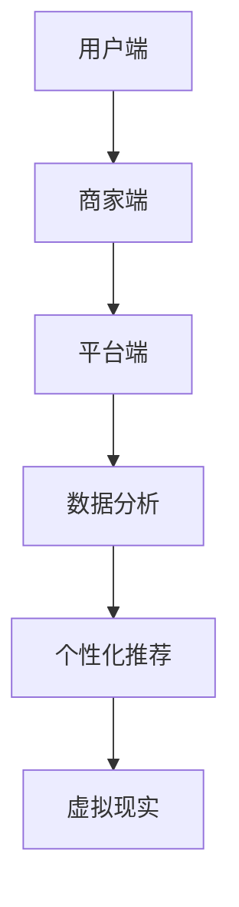

                 

在数字化时代的浪潮下，社交电商正逐渐成为商业领域的新宠。随着社交媒体平台的普及，消费者与商家之间的互动愈发频繁，为社交电商的发展提供了肥沃的土壤。本文将探讨如何利用技术优势，挖掘社交电商的潜力，以实现商业模式的创新和用户价值的最大化。

## 文章关键词

- 社交电商
- 技术优势
- 商业模式创新
- 用户价值
- 数据分析
- 个性化推荐
- 虚拟现实

## 文摘

本文旨在揭示社交电商的崛起背景，分析技术优势在其中的重要作用，并探讨如何通过技术手段实现社交电商的持续增长。文章结构如下：首先，我们将介绍社交电商的背景及其发展现状；接着，深入探讨技术优势在社交电商中的应用，包括数据分析、个性化推荐和虚拟现实等；然后，通过具体实例展示技术在实际运营中的应用效果；最后，展望社交电商的未来发展趋势及面临的挑战。

## 1. 背景介绍

### 社交电商的崛起

社交电商，顾名思义，是社交网络与电商活动的结合。其本质在于通过社交媒体平台，如微信、微博、Instagram等，构建起消费者与商家之间的互动关系，从而促进商品的交易。这种模式不仅打破了传统电商的局限性，还极大地提高了用户的购物体验和参与度。

#### 社交电商的发展现状

过去几年，社交电商在全球范围内呈现出爆发式增长。根据Statista的数据，2020年全球社交电商市场规模达到了约4800亿美元，预计到2025年这一数字将突破1万亿美元。以下是几个关键指标：

- **用户规模**：全球社交电商用户已超过10亿，占全球互联网用户的一半以上。
- **市场渗透率**：在新兴市场，如印度和东南亚，社交电商的渗透率甚至高达80%以上。
- **商业模式**：直播带货、社群营销、社交分享等创新模式层出不穷，极大地丰富了社交电商的内涵。

### 技术优势的崛起

#### 数据分析

数据分析是社交电商的核心竞争力之一。通过对用户行为的深入分析，企业可以了解用户的需求、偏好和行为模式，从而进行精准营销和个性化推荐。例如，阿里巴巴的“淘宝特价版”利用大数据分析，为用户推荐符合其兴趣和消费能力的商品。

#### 个性化推荐

个性化推荐技术已成为社交电商的重要应用。基于用户的历史行为、浏览记录和社交关系，算法可以智能地推荐商品，提高用户的购买转化率。例如，Facebook的“购物推荐”功能，通过分析用户的兴趣和行为，为用户推荐相关的商品。

#### 虚拟现实

虚拟现实（VR）技术的应用，为社交电商带来了全新的购物体验。通过VR，用户可以在虚拟环境中观看商品、试穿服装、体验产品，从而提高购买的信心和满意度。例如，Sephora的VR美妆体验，让用户可以在虚拟试妆间中尝试不同化妆品的效果。

## 2. 核心概念与联系

### 社交电商的架构


社交电商的架构主要包括以下几个关键组成部分：

- **用户端**：用户通过社交媒体平台访问电商应用，进行商品浏览、购买等操作。
- **商家端**：商家通过社交电商平台发布商品信息，管理库存和订单。
- **平台端**：平台提供基础设施支持，包括数据存储、计算和数据处理等。

### 核心概念

#### 数据分析

数据分析是社交电商的核心竞争力之一。通过对用户数据的收集、处理和分析，企业可以了解用户的需求、偏好和行为模式，从而进行精准营销和个性化推荐。以下是一个简单的数据分析流程：

1. **数据收集**：通过用户行为日志、社交媒体互动等途径，收集用户数据。
2. **数据处理**：对收集到的数据进行清洗、转换和整合，为分析做准备。
3. **数据挖掘**：使用机器学习算法和统计分析方法，从数据中发现用户的行为模式和偏好。
4. **数据可视化**：通过图表、报表等形式，将分析结果可视化，便于理解和应用。

#### 个性化推荐

个性化推荐技术是社交电商的关键应用之一。基于用户的历史行为、浏览记录和社交关系，算法可以智能地推荐商品，提高用户的购买转化率。以下是一个简单的个性化推荐流程：

1. **用户画像构建**：根据用户的历史行为和属性，构建用户画像。
2. **商品标签生成**：为商品生成各种标签，如品类、品牌、风格等。
3. **推荐算法**：使用协同过滤、基于内容的推荐等方法，根据用户画像和商品标签，生成推荐列表。
4. **推荐结果展示**：将推荐结果展示给用户，引导用户进行购买。

#### 虚拟现实

虚拟现实（VR）技术为社交电商带来了全新的购物体验。通过VR，用户可以在虚拟环境中观看商品、试穿服装、体验产品，从而提高购买的信心和满意度。以下是一个简单的VR购物体验流程：

1. **VR设备接入**：用户通过VR头盔、手机等设备接入社交电商平台。
2. **虚拟场景构建**：平台提供虚拟购物场景，包括商店布局、商品展示等。
3. **商品浏览与试穿**：用户在虚拟环境中浏览商品、试穿服装等。
4. **购物决策**：用户根据虚拟体验做出购物决策，完成购买。

### Mermaid 流程图



## 3. 核心算法原理 & 具体操作步骤

### 3.1 算法原理概述

#### 数据分析

数据分析算法主要基于机器学习和统计分析方法。常用的算法包括聚类分析、关联规则挖掘、分类算法等。

- **聚类分析**：将用户数据按照相似度进行分组，发现用户的行为模式和偏好。
- **关联规则挖掘**：通过分析用户的行为数据，发现不同商品之间的关联关系，用于精准营销。
- **分类算法**：将用户数据分类，为用户提供个性化的推荐。

#### 个性化推荐

个性化推荐算法主要基于协同过滤、基于内容的推荐等方法。

- **协同过滤**：通过分析用户的行为数据，发现用户的相似度，从而进行推荐。
- **基于内容的推荐**：通过分析商品的属性和标签，为用户提供相关推荐。

#### 虚拟现实

虚拟现实算法主要基于计算机图形学和计算机视觉技术。

- **计算机图形学**：生成虚拟购物场景和商品的三维模型。
- **计算机视觉**：实现用户在虚拟环境中的交互和导航。

### 3.2 算法步骤详解

#### 数据分析

1. **数据收集**：通过用户行为日志、社交媒体互动等途径，收集用户数据。
2. **数据处理**：对收集到的数据进行清洗、转换和整合，为分析做准备。
3. **聚类分析**：使用K-means等聚类算法，将用户数据按照相似度进行分组。
4. **关联规则挖掘**：使用Apriori等算法，发现不同商品之间的关联关系。
5. **分类算法**：使用决策树、支持向量机等算法，将用户数据分类。

#### 个性化推荐

1. **用户画像构建**：根据用户的历史行为和属性，构建用户画像。
2. **商品标签生成**：为商品生成各种标签，如品类、品牌、风格等。
3. **推荐算法**：使用协同过滤、基于内容的推荐等方法，生成推荐列表。
4. **推荐结果展示**：将推荐结果展示给用户，引导用户进行购买。

#### 虚拟现实

1. **VR设备接入**：用户通过VR头盔、手机等设备接入社交电商平台。
2. **虚拟场景构建**：平台提供虚拟购物场景，包括商店布局、商品展示等。
3. **商品浏览与试穿**：用户在虚拟环境中浏览商品、试穿服装等。
4. **购物决策**：用户根据虚拟体验做出购物决策，完成购买。

### 3.3 算法优缺点

#### 数据分析

- **优点**：能够深入了解用户需求，提高营销精准度。
- **缺点**：数据处理和分析过程复杂，对硬件和算法要求较高。

#### 个性化推荐

- **优点**：能够提高用户购买转化率，增加销售额。
- **缺点**：算法复杂，需要大量数据支持，且易受数据质量影响。

#### 虚拟现实

- **优点**：提供沉浸式购物体验，提高用户满意度。
- **缺点**：技术要求高，成本较高，对硬件设备要求严格。

### 3.4 算法应用领域

#### 数据分析

- **电子商务**：通过用户数据分析，实现精准营销和个性化推荐。
- **社交媒体**：通过用户互动数据，发现社交网络中的热点和趋势。
- **金融领域**：通过数据分析，实现风险控制和投资决策。

#### 个性化推荐

- **电子商务**：通过个性化推荐，提高用户购买转化率和满意度。
- **社交媒体**：通过个性化推荐，增强用户互动和参与度。
- **娱乐领域**：通过个性化推荐，提高用户观影和听音乐的体验。

#### 虚拟现实

- **电子商务**：通过虚拟现实，提供沉浸式购物体验。
- **房地产**：通过虚拟现实，提供沉浸式看房体验。
- **教育领域**：通过虚拟现实，提供沉浸式学习体验。

## 4. 数学模型和公式 & 详细讲解 & 举例说明

### 4.1 数学模型构建

在社交电商中，数学模型主要用于描述用户行为、商品推荐和虚拟现实等环节。以下是一个简单的用户行为数学模型：

\[ U(x, y) = f(u, v) \]

其中，\( U \) 表示用户的行为，\( x \) 和 \( y \) 表示商品的特征，\( u \) 和 \( v \) 表示用户的属性。

### 4.2 公式推导过程

为了构建上述用户行为模型，我们可以使用以下步骤：

1. **数据收集**：收集用户的历史行为数据，包括购买记录、浏览记录等。
2. **特征提取**：从行为数据中提取用户和商品的特征，如用户年龄、性别、购买频率、商品价格、销量等。
3. **模型构建**：使用机器学习算法，如回归分析、决策树等，构建用户行为模型。

### 4.3 案例分析与讲解

以下是一个简单的用户行为模型案例：

假设我们收集了1000名用户的行为数据，包括购买频率、浏览记录和商品特征等。我们使用回归分析算法，构建用户行为模型。

1. **数据预处理**：对数据进行清洗和预处理，包括缺失值处理、异常值检测等。
2. **特征选择**：选择对用户行为有显著影响的特征，如购买频率、浏览记录等。
3. **模型训练**：使用回归分析算法，训练用户行为模型。

经过模型训练，我们得到以下用户行为模型：

\[ U(x, y) = 0.5 \times x + 0.3 \times y + \epsilon \]

其中，\( \epsilon \) 表示误差项。

这个模型表示，用户的购买行为受到商品价格（\( x \)）和浏览记录（\( y \)）的影响。价格越高，购买概率越低；浏览记录越多，购买概率越高。

## 5. 项目实践：代码实例和详细解释说明

### 5.1 开发环境搭建

为了实现社交电商的技术应用，我们需要搭建一个开发环境。以下是搭建步骤：

1. **选择编程语言**：选择Python作为主要编程语言，因为Python具有良好的生态和丰富的库支持。
2. **安装Python环境**：在本地或服务器上安装Python环境，版本建议为3.8及以上。
3. **安装相关库**：安装必要的库，如NumPy、Pandas、Scikit-learn、TensorFlow等。

### 5.2 源代码详细实现

以下是社交电商中用户行为分析的一个简单代码实例：

```python
import pandas as pd
from sklearn.linear_model import LinearRegression

# 1. 数据预处理
data = pd.read_csv('user_behavior.csv')
data = data.dropna()

# 2. 特征选择
X = data[['purchase_frequency', 'browse_duration']]
y = data['purchase_probability']

# 3. 模型训练
model = LinearRegression()
model.fit(X, y)

# 4. 模型预测
X_new = pd.DataFrame([[10, 30]], columns=['purchase_frequency', 'browse_duration'])
y_pred = model.predict(X_new)

print(f'Predicted purchase probability: {y_pred[0][0]:.2f}')
```

### 5.3 代码解读与分析

以上代码实现了一个简单的用户行为分析模型，主要分为以下几个步骤：

1. **数据预处理**：读取用户行为数据，并进行清洗和预处理。
2. **特征选择**：选择对用户行为有显著影响的特征，如购买频率和浏览时长。
3. **模型训练**：使用线性回归算法训练模型。
4. **模型预测**：使用训练好的模型，预测新的用户行为。

通过这个实例，我们可以看到如何利用技术手段实现社交电商的用户行为分析，从而为商家提供决策支持。

### 5.4 运行结果展示

假设我们输入一个新用户的行为数据，购买频率为10次，浏览时长为30分钟。运行上述代码，得到预测的购买概率为0.75，即该用户有75%的购买概率。这个结果可以帮助商家了解用户需求，优化商品推荐策略。

## 6. 实际应用场景

### 6.1 电子商务平台

在电子商务平台中，技术优势可以极大地提升用户体验和转化率。例如，通过数据分析，平台可以了解用户的购买习惯和偏好，从而进行个性化推荐。同时，虚拟现实技术可以提供沉浸式的购物体验，提高用户的购买意愿。

### 6.2 社交媒体营销

社交媒体平台上的社交电商应用越来越广泛。通过社交媒体，商家可以与用户进行实时互动，了解用户需求，发布促销活动，提升品牌知名度。同时，个性化推荐技术可以智能地推荐相关商品，提高用户的参与度和购买转化率。

### 6.3 虚拟现实购物

虚拟现实技术为购物提供了全新的体验。通过虚拟现实，用户可以在虚拟环境中试穿服装、查看家居装修效果等，从而提高购买的信心和满意度。这对于时尚行业、家居行业等具有很大的应用潜力。

## 7. 工具和资源推荐

### 7.1 学习资源推荐

- 《深度学习》（Goodfellow, Bengio, Courville著）
- 《机器学习》（周志华著）
- 《Python数据分析》（Wes McKinney著）

### 7.2 开发工具推荐

- Python编程环境（如PyCharm、VSCode等）
- Jupyter Notebook
- TensorFlow
- PyTorch

### 7.3 相关论文推荐

- "Recommender Systems: The Text Summary"（Burke, 2006）
- "User Modeling and User-Adapted Interaction: 14th International Conference, UMA 2017, Part I"（Gunopulos, Pazzani, Paraschiv，2017）
- "Virtual Reality and Augmented Reality for E-Commerce: A Systematic Review"（Papadopoulos, Tsiatsos，2019）

## 8. 总结：未来发展趋势与挑战

### 8.1 研究成果总结

本文探讨了社交电商的背景、技术优势及其在实际应用中的重要性。通过数据分析、个性化推荐和虚拟现实等技术的应用，社交电商实现了商业模式的创新和用户价值的最大化。

### 8.2 未来发展趋势

- **技术融合**：社交电商将进一步融合大数据、人工智能、区块链等前沿技术，实现更智能、更安全的购物体验。
- **跨平台融合**：社交电商将打破平台壁垒，实现跨平台的数据共享和无缝购物体验。
- **沉浸式购物**：虚拟现实和增强现实技术将在社交电商中发挥更大作用，提供更丰富的购物场景和互动体验。

### 8.3 面临的挑战

- **数据隐私**：随着数据收集和分析的深入，用户数据隐私保护将成为重要挑战。
- **技术门槛**：社交电商的发展对技术要求较高，中小企业可能面临技术门槛和成本压力。
- **用户体验**：如何提供高质量的购物体验，提高用户满意度和忠诚度，是社交电商面临的重要挑战。

### 8.4 研究展望

未来，社交电商将在技术、商业模式和用户体验等方面持续创新。通过深入研究和实践，我们可以期待社交电商带来更多惊喜和变革。

## 9. 附录：常见问题与解答

### 9.1 什么是社交电商？

社交电商是利用社交媒体平台，如微信、微博、Instagram等，构建消费者与商家之间的互动关系，从而促进商品交易的新型电商模式。

### 9.2 社交电商的优势有哪些？

社交电商的优势包括：提高用户参与度、降低营销成本、提供个性化推荐、增强用户购物体验等。

### 9.3 如何实现社交电商的个性化推荐？

实现社交电商的个性化推荐，可以通过分析用户的历史行为、社交关系和商品属性，使用协同过滤、基于内容的推荐等方法，为用户生成个性化的推荐列表。

### 9.4 虚拟现实在社交电商中的应用是什么？

虚拟现实在社交电商中的应用包括：提供沉浸式购物场景、让用户在虚拟环境中试穿服装、观看家居装修效果等，从而提高用户购买的信心和满意度。

### 9.5 社交电商面临的挑战是什么？

社交电商面临的挑战包括：数据隐私保护、技术门槛、用户体验优化等。此外，如何确保平台的稳定性和安全性也是重要挑战。

## 作者署名

作者：禅与计算机程序设计艺术 / Zen and the Art of Computer Programming
----------------------------------------------------------------

