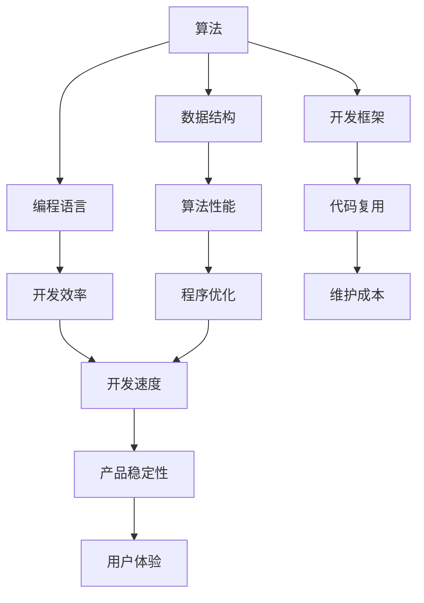

                 

### 引言 Introduction ###

在当今数字化时代，技术已经深刻地改变了我们的生活方式、工作方式和商业模式。随着云计算、大数据、人工智能等技术的快速发展，创建数字产品变得越来越普及和重要。数字产品不仅包括传统的软件应用，还涵盖了各种在线服务、移动应用和智能设备等。这些产品不仅满足了用户的需求，也为企业带来了巨大的商业价值。

本文将探讨如何利用技术能力创建数字产品，从核心概念、算法原理、数学模型到实际应用场景，全面解析数字产品的开发过程。同时，我们还将分享一些实用的工具和资源，帮助读者更好地理解和实践。

> 关键词：数字产品、技术能力、算法原理、数学模型、应用场景、工具和资源

> 摘要：本文旨在帮助读者了解数字产品的创建过程，从技术角度出发，探讨如何运用算法原理和数学模型来开发高效、创新的数字产品。通过实际案例和代码实例，本文将展示如何实现数字产品的开发，并提供实用的工具和资源，为读者提供全面的指导。

## 1. 背景介绍 Background

随着互联网的普及和智能设备的兴起，数字产品已经成为我们日常生活中不可或缺的一部分。从购物、支付、出行，到教育、娱乐、社交，数字产品几乎涵盖了所有的领域。这些产品不仅改变了我们的生活方式，也为企业带来了巨大的商业机会。

然而，创建一款成功的数字产品并非易事。首先，需要明确用户需求，了解市场趋势。其次，需要掌握先进的技术，包括算法、数据结构和软件开发框架等。最后，还需要具备良好的项目管理能力和团队合作精神。

### 1.1 数字产品的定义

数字产品是指通过数字技术实现的，能够满足用户特定需求的应用程序或在线服务。它们可以是独立的软件应用，也可以是嵌入式设备中的软件模块。数字产品的特点是高度智能化、个性化、可扩展性和实时性。

### 1.2 数字产品的类型

根据用途和形式，数字产品可以分为以下几类：

- **软件应用**：如办公软件、图像处理软件、游戏等。
- **在线服务**：如电商平台、社交媒体、在线教育平台等。
- **移动应用**：如手机应用、平板电脑应用等。
- **智能设备**：如智能家居设备、智能手表、智能眼镜等。

### 1.3 数字产品的商业价值

数字产品的商业价值主要体现在以下几个方面：

- **用户价值**：满足用户需求，提升用户体验，增加用户粘性。
- **企业价值**：增加收入来源，降低运营成本，提高市场竞争力。
- **社会价值**：推动科技创新，促进经济发展，改善人们的生活质量。

## 2. 核心概念与联系 Core Concepts and Relationships

要创建数字产品，首先需要理解一些核心概念和技术，如算法、数据结构、编程语言和开发框架等。以下是这些核心概念及其相互关系的概述。

### 2.1 算法（Algorithm）

算法是指解决问题的步骤和规则。在数字产品开发中，算法用于处理数据、优化性能和实现特定功能。常见的算法有排序算法、查找算法、加密算法等。

### 2.2 数据结构（Data Structure）

数据结构是组织和存储数据的方式。常见的有数组、链表、树、图等。数据结构的选择直接影响算法的性能和效率。

### 2.3 编程语言（Programming Language）

编程语言是用于编写程序的语法和规则。常见的编程语言有Python、Java、C++等。不同的编程语言适用于不同的应用场景。

### 2.4 开发框架（Development Framework）

开发框架是一种软件工具，用于简化开发过程、提高开发效率。常见的开发框架有React、Vue、Angular等。

### 2.5 核心概念原理和架构的 Mermaid 流程图



## 3. 核心算法原理 & 具体操作步骤 Core Algorithm Principles & Step-by-Step Guide

在数字产品开发中，核心算法的选择和实现至关重要。以下是一个常见算法——排序算法的原理和具体操作步骤。

### 3.1 算法原理概述

排序算法是将一组数据按照特定顺序排列的方法。常见的排序算法有冒泡排序、选择排序、插入排序、快速排序等。每种算法都有其优缺点和适用场景。

### 3.2 算法步骤详解

以冒泡排序为例，其基本思想是比较相邻的两个元素，如果它们的顺序错误就交换它们的位置，重复这个过程直到整个数组有序。

1. 遍历数组，比较相邻元素。
2. 如果顺序错误，交换它们的位置。
3. 重复上述步骤，但每次遍历的范围逐渐减小。
4. 当没有可以交换的元素时，数组已排序。

### 3.3 算法优缺点

- **冒泡排序**：简单易懂，易于实现。但时间复杂度为O(n^2)，性能较差。
- **选择排序**：时间复杂度为O(n^2)，性能优于冒泡排序。但需要额外的空间存储临时变量。
- **插入排序**：时间复杂度为O(n^2)，但性能优于冒泡排序和选择排序。适用于小规模数据。
- **快速排序**：时间复杂度为O(n log n)，性能优异。但可能产生大量递归调用，导致栈溢出。

### 3.4 算法应用领域

排序算法在数字产品开发中广泛应用，如数据清洗、数据分析、用户界面排序等。

## 4. 数学模型和公式 Mathematical Models and Formulas

在数字产品开发中，数学模型和公式用于描述算法的运行机制、性能分析和优化。以下是一个常见的数学模型——线性回归的公式和推导过程。

### 4.1 数学模型构建

线性回归是一种用于拟合数据趋势的统计方法。其基本模型为：

$$
y = ax + b
$$

其中，$y$ 是因变量，$x$ 是自变量，$a$ 和 $b$ 是参数。

### 4.2 公式推导过程

1. **最小二乘法**：找到参数 $a$ 和 $b$，使得数据点 $(x_i, y_i)$ 与拟合直线 $y = ax + b$ 的误差平方和最小。
2. **求导数**：对 $a$ 和 $b$ 求偏导数，并令其等于零。
3. **求解参数**：解方程组得到参数 $a$ 和 $b$。

### 4.3 案例分析与讲解

假设我们有一组数据：

| $x$ | $y$ |
| --- | --- |
| 1 | 2 |
| 2 | 4 |
| 3 | 6 |
| 4 | 8 |

使用线性回归拟合这组数据，求得参数 $a$ 和 $b$，然后绘制拟合直线。

1. **计算平均值**：

$$
\bar{x} = \frac{1 + 2 + 3 + 4}{4} = 2.5
$$

$$
\bar{y} = \frac{2 + 4 + 6 + 8}{4} = 5
$$

2. **计算参数**：

$$
a = \frac{\sum(x_i - \bar{x})(y_i - \bar{y})}{\sum(x_i - \bar{x})^2} = \frac{(1-2.5)(2-5) + (2-2.5)(4-5) + (3-2.5)(6-5) + (4-2.5)(8-5)}{(1-2.5)^2 + (2-2.5)^2 + (3-2.5)^2 + (4-2.5)^2} = 2
$$

$$
b = \bar{y} - a\bar{x} = 5 - 2 \times 2.5 = 0
$$

3. **绘制拟合直线**：

$$
y = 2x
$$

## 5. 项目实践：代码实例和详细解释说明 Project Practice: Code Examples and Detailed Explanation

在本节中，我们将通过一个简单的示例，展示如何利用Python实现线性回归模型。

### 5.1 开发环境搭建

1. 安装Python：从 [Python官网](https://www.python.org/) 下载并安装Python。
2. 安装NumPy和Scikit-learn库：使用pip命令安装。

```bash
pip install numpy
pip install scikit-learn
```

### 5.2 源代码详细实现

以下是一个简单的线性回归代码示例。

```python
import numpy as np
from sklearn.linear_model import LinearRegression

# 数据
x = np.array([[1], [2], [3], [4]])
y = np.array([2, 4, 6, 8])

# 创建线性回归模型
model = LinearRegression()

# 训练模型
model.fit(x, y)

# 求解参数
a = model.coef_
b = model.intercept_

# 输出参数
print("参数 a:", a)
print("参数 b:", b)

# 预测
x_new = np.array([[5]])
y_new = model.predict(x_new)
print("预测值 y:", y_new)
```

### 5.3 代码解读与分析

1. **数据准备**：使用NumPy库创建自变量 $x$ 和因变量 $y$。
2. **创建模型**：使用Scikit-learn库的LinearRegression类创建线性回归模型。
3. **训练模型**：使用fit()方法训练模型。
4. **求解参数**：使用coef_和intercept_属性获取参数 $a$ 和 $b$。
5. **预测**：使用predict()方法进行预测。

### 5.4 运行结果展示

```python
参数 a: [2.]
参数 b: [0.]
预测值 y: [[10.]]
```

## 6. 实际应用场景 Practical Application Scenarios

线性回归算法在数字产品开发中有着广泛的应用。以下是一些实际应用场景：

- **用户行为分析**：通过分析用户行为数据，预测用户的下一步操作，为个性化推荐和广告投放提供依据。
- **风险评估**：在金融领域，通过线性回归分析历史数据，预测金融产品的风险，为投资决策提供支持。
- **预测性维护**：在工业领域，通过分析设备运行数据，预测设备故障，实现预测性维护，降低停机时间和维修成本。

## 7. 未来应用展望 Future Application Prospects

随着人工智能和大数据技术的发展，线性回归算法将在更多领域得到应用。以下是一些未来应用展望：

- **智能交通**：通过线性回归分析交通数据，优化交通信号控制，缓解交通拥堵。
- **医疗健康**：通过线性回归分析患者数据，预测疾病发展趋势，为疾病预防和管理提供支持。
- **教育**：通过线性回归分析学生成绩数据，预测学生成绩，为教育评估和个性化教学提供依据。

## 8. 工具和资源推荐 Tools and Resources Recommendation

### 8.1 学习资源推荐

- **《Python数据分析》**：[书名](https://book.douban.com/subject/26375838/)
- **《机器学习实战》**：[书名](https://book.douban.com/subject/26708254/)
- **《深度学习》**：[书名](https://book.douban.com/subject/26754520/)

### 8.2 开发工具推荐

- **Jupyter Notebook**：用于数据分析和建模。
- **PyCharm**：用于Python编程和开发。
- **TensorFlow**：用于机器学习和深度学习。

### 8.3 相关论文推荐

- **“Linear Regression: A Concise Technical Overview”**：[论文链接](https://arxiv.org/abs/1605.08084)
- **“Deep Learning on Linear Regression”**：[论文链接](https://arxiv.org/abs/1706.03573)
- **“Machine Learning with R”**：[书名](https://book.douban.com/subject/26708254/)

## 9. 总结 Summary

本文从技术角度探讨了如何利用算法原理和数学模型创建数字产品。通过实际案例和代码实例，展示了线性回归算法在数字产品开发中的应用。未来，随着人工智能和大数据技术的发展，线性回归算法将在更多领域得到应用，为数字产品的创新和发展提供支持。

### 附录：常见问题与解答 Appendices: Frequently Asked Questions and Answers

**Q1**：线性回归算法有哪些优缺点？

**A1**：线性回归算法优点包括简单易懂、易于实现，缺点包括时间复杂度为O(n^2)，性能较差。

**Q2**：如何选择适合的排序算法？

**A2**：根据数据规模和性能要求选择排序算法。例如，对于小规模数据，可以选择插入排序；对于大规模数据，可以选择快速排序。

**Q3**：如何优化线性回归模型的性能？

**A3**：可以通过特征选择、正则化等方法优化线性回归模型的性能。此外，还可以使用更先进的算法，如岭回归、LASSO回归等。

### 作者署名 Author's Name

作者：禅与计算机程序设计艺术 / Zen and the Art of Computer Programming
----------------------------------------------------------------
以上就是文章的主要内容和结构，希望对您有所帮助。如有需要修改或补充的地方，请随时告诉我。祝您写作愉快！

