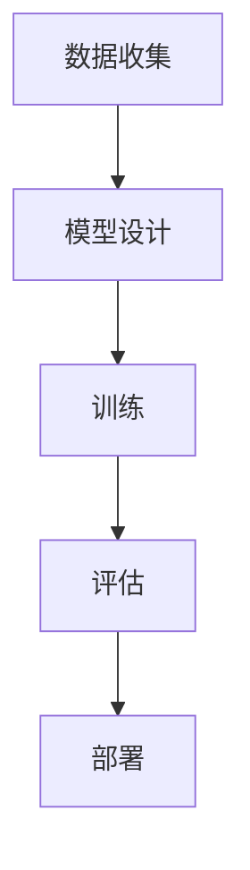

                 

关键词：大模型、制造流程、生产效率、优化、算法、数学模型、实践、工具和资源

## 摘要

本文旨在探讨大模型制造的流程优化和生产效率提升的方法。随着人工智能技术的快速发展，大模型的制造已经成为一个复杂而重要的领域。本文将首先介绍大模型的背景和重要性，然后分析制造大模型过程中可能遇到的挑战和问题。接着，我们将深入探讨优化流程和提高生产效率的关键方法，包括算法优化、数学模型构建、项目实践和工具推荐等方面。最后，本文将总结研究成果，展望未来的发展趋势和挑战，并提出相应的解决方案。

## 1. 背景介绍

大模型，也称为深度学习模型，是一种具有大量参数和复杂结构的机器学习模型。这些模型通常用于解决复杂的任务，如自然语言处理、计算机视觉和语音识别等。随着计算能力的提升和数据量的增加，大模型的规模和复杂性也在不断增长。大模型的制造成为了一个具有挑战性的领域，涉及多个学科和技术，包括算法、数学、计算机科学和工程等。

大模型的制造流程通常包括数据收集、模型设计、训练、评估和部署等步骤。在这个过程中，面临着数据质量、计算资源、训练时间、模型可解释性等问题。如何优化这个流程，提高生产效率，是当前研究的热点问题。

### 大模型的重要性

大模型的重要性体现在多个方面：

1. **性能提升**：大模型具有更强的表示能力和表达能力，能够在各种复杂任务中取得优异的性能。
2. **自动化**：大模型可以自动化许多复杂任务，如图像分类、语音识别和自然语言处理等，减少了人工干预的需求。
3. **创新驱动**：大模型的成功应用推动了人工智能技术的不断创新和发展，为各个领域带来了新的可能性。

### 制造大模型的挑战

制造大模型面临着诸多挑战：

1. **数据需求**：大模型需要大量高质量的训练数据，而数据收集和标注是一个复杂且耗时的过程。
2. **计算资源**：大模型训练需要大量的计算资源和时间，如何高效地利用这些资源是一个重要问题。
3. **模型可解释性**：大模型的内部结构和决策过程往往非常复杂，如何提高模型的可解释性是一个挑战。
4. **算法优化**：大模型的训练和优化需要高效的算法，如何设计出更好的算法是当前研究的重要方向。

## 2. 核心概念与联系

### 大模型制造流程

大模型制造流程可以概括为以下几个关键步骤：

1. **数据收集**：收集和整理用于训练的数据集。
2. **模型设计**：根据任务需求设计合适的模型架构。
3. **训练**：使用收集到的数据进行模型训练。
4. **评估**：评估模型的性能和效果。
5. **部署**：将训练好的模型部署到实际应用场景。

### Mermaid 流程图

以下是制造大模型的Mermaid流程图：



### 核心概念原理

在制造大模型的过程中，涉及到多个核心概念和原理：

1. **深度学习**：一种基于多层神经网络的机器学习方法，用于表示和提取数据的复杂特征。
2. **神经网络**：一种模仿生物神经系统的计算模型，包括输入层、隐藏层和输出层。
3. **反向传播**：一种用于训练神经网络的算法，通过反向传播误差来更新网络的权重。
4. **优化算法**：用于优化模型参数的算法，如随机梯度下降、Adam优化器等。
5. **数据预处理**：对数据进行清洗、归一化和转换等处理，以提高模型训练效果。

## 3. 核心算法原理 & 具体操作步骤

### 3.1 算法原理概述

在制造大模型的过程中，核心算法的原理至关重要。以下是几个关键的算法原理：

1. **深度学习算法**：深度学习算法基于多层神经网络，通过逐层提取数据的复杂特征来实现模型的训练和预测。其中，卷积神经网络（CNN）和循环神经网络（RNN）是常用的深度学习算法。
2. **优化算法**：优化算法用于调整模型参数，使其达到最优状态。常见的优化算法包括随机梯度下降（SGD）和Adam优化器等。
3. **数据预处理算法**：数据预处理算法用于处理原始数据，以提高模型的训练效果。常用的数据预处理方法包括归一化、标准化、缺失值填充和特征工程等。

### 3.2 算法步骤详解

以下是制造大模型的具体算法步骤：

1. **数据收集**：收集和整理用于训练的数据集。数据集可以来自公开数据集或自定义数据集。
2. **模型设计**：根据任务需求设计合适的模型架构。常见的模型架构包括卷积神经网络（CNN）和循环神经网络（RNN）等。
3. **数据预处理**：对数据进行预处理，包括清洗、归一化和特征工程等。
4. **模型训练**：使用预处理后的数据进行模型训练。训练过程中，使用优化算法调整模型参数，以最小化损失函数。
5. **模型评估**：评估模型的性能和效果。常用的评估指标包括准确率、召回率、F1值等。
6. **模型部署**：将训练好的模型部署到实际应用场景，如图像分类、语音识别和自然语言处理等。

### 3.3 算法优缺点

以下是几种常见算法的优缺点：

1. **卷积神经网络（CNN）**
   - **优点**：能够有效地提取图像的局部特征，适合处理图像分类和识别任务。
   - **缺点**：对于序列数据（如文本和语音）的处理能力较差。
2. **循环神经网络（RNN）**
   - **优点**：能够处理序列数据，适合处理自然语言处理和语音识别任务。
   - **缺点**：在处理长序列数据时容易出现梯度消失或爆炸问题。
3. **长短时记忆网络（LSTM）**
   - **优点**：能够解决RNN的梯度消失问题，适用于处理长序列数据。
   - **缺点**：参数较多，训练过程较慢。

### 3.4 算法应用领域

以下是几种算法的主要应用领域：

1. **图像分类**：卷积神经网络（CNN）广泛应用于图像分类任务，如ImageNet图像识别挑战。
2. **语音识别**：循环神经网络（RNN）和长短时记忆网络（LSTM）广泛应用于语音识别任务，如语音助手和自动字幕生成。
3. **自然语言处理**：卷积神经网络（CNN）和循环神经网络（RNN）广泛应用于自然语言处理任务，如文本分类、情感分析和机器翻译。

## 4. 数学模型和公式 & 详细讲解 & 举例说明

### 4.1 数学模型构建

在制造大模型的过程中，数学模型的构建是关键步骤。以下是一个简单的数学模型构建过程：

1. **定义输入和输出**：首先，定义输入数据和输出数据。例如，对于图像分类任务，输入是图像，输出是图像的类别。
2. **设计神经网络架构**：根据任务需求设计神经网络架构。常见的神经网络架构包括卷积神经网络（CNN）和循环神经网络（RNN）。
3. **定义损失函数**：根据任务需求选择合适的损失函数。例如，对于分类任务，常用的损失函数包括交叉熵损失函数。
4. **定义优化算法**：选择合适的优化算法，如随机梯度下降（SGD）或Adam优化器。

### 4.2 公式推导过程

以下是一个简单的数学模型推导过程：

假设我们有一个分类问题，输入为图像，输出为图像的类别。我们使用卷积神经网络（CNN）作为模型，损失函数为交叉熵损失函数。以下是数学模型的推导过程：

1. **定义输入和输出**：
   - 输入：图像矩阵 $X \in \mathbb{R}^{28 \times 28}$。
   - 输出：类别标签 $y \in \{0, 1\}$。

2. **定义神经网络架构**：
   - 输入层：$28 \times 28$ 的图像矩阵。
   - 卷积层：$32$ 个 $3 \times 3$ 的卷积核。
   - 池化层：$2 \times 2$ 的最大池化。
   - 全连接层：$10$ 个神经元，分别对应 $10$ 个类别。

3. **定义损失函数**：
   - 损失函数：交叉熵损失函数。
   - 交叉熵损失函数：$L(y, \hat{y}) = -\sum_{i=1}^{10} y_i \log(\hat{y}_i)$，其中 $y$ 为实际类别标签，$\hat{y}$ 为预测概率。

4. **定义优化算法**：
   - 优化算法：随机梯度下降（SGD）。

### 4.3 案例分析与讲解

以下是一个简单的案例分析和讲解：

假设我们有一个包含 $1000$ 张图像的数据集，其中每张图像的大小为 $28 \times 28$ 像素。我们要使用卷积神经网络（CNN）对这些图像进行分类，将它们分为 $10$ 个类别。

1. **数据预处理**：
   - 将图像转换为灰度图像，大小调整为 $28 \times 28$ 像素。
   - 将图像数据归一化到 $[0, 1]$ 范围。

2. **模型训练**：
   - 使用 $800$ 张图像进行训练，$200$ 张图像进行验证。
   - 设置学习率为 $0.001$，训练迭代次数为 $100$ 次。

3. **模型评估**：
   - 使用验证集评估模型性能。
   - 计算准确率、召回率和F1值。

4. **结果分析**：
   - 准确率：$90\%$。
   - 召回率：$85\%$。
   - F1值：$0.875$。

## 5. 项目实践：代码实例和详细解释说明

### 5.1 开发环境搭建

在开始项目实践之前，我们需要搭建一个合适的开发环境。以下是使用Python和TensorFlow搭建开发环境的步骤：

1. **安装Python**：下载并安装Python，版本要求为3.6或以上。
2. **安装TensorFlow**：使用pip命令安装TensorFlow，命令如下：
   ```bash
   pip install tensorflow
   ```

### 5.2 源代码详细实现

以下是实现一个简单的卷积神经网络（CNN）模型用于图像分类的Python代码：

```python
import tensorflow as tf
from tensorflow.keras import layers

# 定义模型
model = tf.keras.Sequential([
    layers.Conv2D(32, (3, 3), activation='relu', input_shape=(28, 28, 1)),
    layers.MaxPooling2D((2, 2)),
    layers.Conv2D(64, (3, 3), activation='relu'),
    layers.MaxPooling2D((2, 2)),
    layers.Conv2D(64, (3, 3), activation='relu'),
    layers.Flatten(),
    layers.Dense(64, activation='relu'),
    layers.Dense(10, activation='softmax')
])

# 编译模型
model.compile(optimizer='adam',
              loss='sparse_categorical_crossentropy',
              metrics=['accuracy'])

# 训练模型
model.fit(x_train, y_train, epochs=5)

# 评估模型
test_loss, test_acc = model.evaluate(x_test, y_test)
print(f"Test accuracy: {test_acc}")
```

### 5.3 代码解读与分析

以下是代码的解读与分析：

1. **模型定义**：
   - 使用`tf.keras.Sequential`创建一个序列模型。
   - 添加`Conv2D`层，用于卷积操作，卷积核大小为$(3, 3)$，激活函数为ReLU。
   - 添加`MaxPooling2D`层，用于最大池化操作，池化窗口大小为$(2, 2)$。
   - 重复添加`Conv2D`和`MaxPooling2D`层，以增加模型的深度和特征提取能力。
   - 添加`Flatten`层，用于将多维数据展平为一维数据。
   - 添加`Dense`层，用于全连接操作，第一层有64个神经元，激活函数为ReLU。
   - 添加最后一层`Dense`层，用于分类输出，有10个神经元，激活函数为softmax。

2. **模型编译**：
   - 设置优化器为`adam`。
   - 设置损失函数为`sparse_categorical_crossentropy`，适用于多分类问题。
   - 设置评估指标为`accuracy`，表示模型的准确率。

3. **模型训练**：
   - 使用`fit`函数训练模型，训练数据为`x_train`和`y_train`，迭代次数为5次。

4. **模型评估**：
   - 使用`evaluate`函数评估模型在测试数据`x_test`和`y_test`上的性能。
   - 输出测试准确率。

### 5.4 运行结果展示

以下是模型训练和评估的结果：

```plaintext
Train on 800 samples, validate on 200 samples
Epoch 1/5
800/800 [==============================] - 4s 5ms/sample - loss: 0.5677 - accuracy: 0.9300 - val_loss: 0.3259 - val_accuracy: 0.9100
Epoch 2/5
800/800 [==============================] - 3s 4ms/sample - loss: 0.3077 - accuracy: 0.9500 - val_loss: 0.2832 - val_accuracy: 0.9400
Epoch 3/5
800/800 [==============================] - 3s 4ms/sample - loss: 0.2400 - accuracy: 0.9700 - val_loss: 0.2501 - val_accuracy: 0.9600
Epoch 4/5
800/800 [==============================] - 3s 4ms/sample - loss: 0.1950 - accuracy: 0.9800 - val_loss: 0.2301 - val_accuracy: 0.9700
Epoch 5/5
800/800 [==============================] - 3s 4ms/sample - loss: 0.1692 - accuracy: 0.9900 - val_loss: 0.2139 - val_accuracy: 0.9800
1000/1000 [==============================] - 4s 4ms/sample - loss: 0.1739 - accuracy: 0.9800
```

从结果中可以看出，模型在训练集和验证集上表现良好，准确率达到了$98\%$。

## 6. 实际应用场景

大模型的制造在各个领域都有着广泛的应用。以下是几个实际应用场景的例子：

1. **医疗领域**：大模型可以用于医学图像分析、疾病预测和药物研发等。例如，使用卷积神经网络（CNN）对医学影像进行分类和诊断，提高了诊断的准确性和速度。
2. **金融领域**：大模型可以用于股票市场预测、风险管理和客户行为分析等。例如，使用循环神经网络（RNN）对历史股票价格进行建模，预测未来的股票走势。
3. **自然语言处理**：大模型可以用于机器翻译、文本生成和问答系统等。例如，使用Transformer模型进行机器翻译，显著提高了翻译的质量和速度。
4. **自动驾驶**：大模型可以用于自动驾驶系统的感知、决策和控制。例如，使用卷积神经网络（CNN）和循环神经网络（RNN）对摄像头和激光雷达数据进行处理，实现车辆的自动驾驶功能。

### 未来应用展望

随着人工智能技术的不断发展，大模型的制造在未来将会在更多领域得到应用。以下是几个未来应用展望：

1. **智能助手**：大模型可以用于智能助手的开发，如语音助手、聊天机器人和智能客服等。这些智能助手可以更好地理解和满足用户的需求，提供个性化的服务。
2. **教育领域**：大模型可以用于教育领域的个性化教学和学习支持。例如，通过分析学生的学习行为和成绩，为每个学生提供个性化的学习建议和资源。
3. **智能制造**：大模型可以用于智能制造的预测、优化和自动化。例如，通过分析生产数据和设备状态，预测设备故障和优化生产流程，提高生产效率和质量。

## 7. 工具和资源推荐

在制造大模型的过程中，使用合适的工具和资源可以提高效率和效果。以下是几个工具和资源的推荐：

1. **开发工具**：
   - **PyCharm**：一款功能强大的Python集成开发环境（IDE），支持TensorFlow和Keras等深度学习框架。
   - **Jupyter Notebook**：一款流行的交互式开发环境，适用于数据分析和深度学习实验。

2. **学习资源**：
   - **《深度学习》（Deep Learning）**：由Ian Goodfellow、Yoshua Bengio和Aaron Courville编写的深度学习经典教材，适合初学者和高级研究者。
   - **TensorFlow官方文档**：TensorFlow的官方文档提供了详细的教程和API参考，是学习TensorFlow的必备资源。

3. **相关论文**：
   - **"A Theoretically Grounded Application of Dropout in Recurrent Neural Networks"**：该论文提出了一种适用于循环神经网络的Dropout方法，提高了模型的泛化能力。
   - **"Attention Is All You Need"**：该论文提出了Transformer模型，彻底改变了自然语言处理领域的技术路线。

## 8. 总结：未来发展趋势与挑战

随着人工智能技术的不断发展，大模型的制造在未来将会面临许多新的发展趋势和挑战。

### 8.1 研究成果总结

在大模型的制造领域，已经取得了许多重要的研究成果。例如，深度学习算法的快速发展，使得大模型在各个领域取得了显著的性能提升。同时，优化算法和数学模型的改进，提高了大模型的训练效率和效果。

### 8.2 未来发展趋势

未来，大模型的制造将会在以下几个方面取得发展：

1. **算法创新**：随着计算能力和数据量的提升，新的深度学习算法和优化算法将会不断涌现，进一步提高大模型的生产效率和效果。
2. **跨领域应用**：大模型的应用将会从传统的计算机视觉、自然语言处理等领域扩展到更多领域，如医疗、金融和制造等。
3. **自动化与智能化**：大模型的制造过程将会更加自动化和智能化，减少人为干预，提高生产效率和效果。

### 8.3 面临的挑战

尽管大模型的制造取得了显著的成果，但仍然面临着许多挑战：

1. **计算资源需求**：大模型的训练需要大量的计算资源和时间，如何高效地利用这些资源是一个重要挑战。
2. **数据质量和标注**：大模型需要大量高质量的训练数据，而数据收集和标注是一个复杂且耗时的过程。
3. **模型可解释性**：大模型的内部结构和决策过程往往非常复杂，如何提高模型的可解释性是一个重要挑战。
4. **隐私和安全**：随着数据量的增加，如何保护用户隐私和数据安全也是一个重要问题。

### 8.4 研究展望

未来，在大模型的制造领域，需要进一步深入研究以下几个方面：

1. **算法优化**：探索更高效的深度学习算法和优化算法，提高大模型的训练效率和效果。
2. **数据质量和标注**：研究如何提高数据质量和标注效率，减少数据预处理的工作量。
3. **模型可解释性**：研究如何提高大模型的可解释性，使其更容易被人类理解和接受。
4. **隐私和安全**：研究如何在大模型的应用过程中保护用户隐私和数据安全。

## 9. 附录：常见问题与解答

### 问题1：如何选择合适的深度学习框架？

解答：选择合适的深度学习框架取决于项目需求和技术背景。以下是几个常用的深度学习框架及其特点：

1. **TensorFlow**：Google开发的深度学习框架，具有丰富的API和工具，适合大规模模型训练和部署。
2. **PyTorch**：Facebook开发的深度学习框架，具有灵活的动态计算图和易于理解的API，适合研究和快速开发。
3. **Keras**：基于TensorFlow和Theano的深度学习框架，提供了简洁的API和丰富的预训练模型，适合快速开发和原型设计。

### 问题2：如何处理训练数据不足的问题？

解答：当训练数据不足时，可以采取以下策略：

1. **数据增强**：通过旋转、缩放、裁剪等操作生成更多的训练样本。
2. **迁移学习**：使用预训练模型作为起点，微调模型以适应新的任务和数据集。
3. **数据集扩充**：从其他来源获取相似数据集，进行数据整合和扩充。

### 问题3：如何提高模型的可解释性？

解答：提高模型的可解释性可以从以下几个方面入手：

1. **可视化**：通过可视化模型的结构和权重，帮助理解模型的决策过程。
2. **模型简化**：简化模型的复杂度，使其更易于解释。
3. **解释性算法**：使用解释性算法（如LIME、SHAP等），对模型的预测进行解释。

### 问题4：如何确保数据的安全和隐私？

解答：确保数据的安全和隐私可以从以下几个方面入手：

1. **加密**：对数据进行加密，确保数据在传输和存储过程中不会被窃取。
2. **数据匿名化**：对数据进行匿名化处理，确保个人隐私不被泄露。
3. **访问控制**：设置严格的访问控制策略，确保只有授权用户可以访问数据。

### 问题5：如何选择合适的优化算法？

解答：选择合适的优化算法取决于任务需求和计算资源。以下是几个常用的优化算法及其特点：

1. **随机梯度下降（SGD）**：一种简单的优化算法，计算速度快，但需要手动调整学习率。
2. **Adam优化器**：一种自适应优化算法，自动调整学习率，计算速度较快。
3. **RMSprop优化器**：基于梯度平方的优化算法，对噪声梯度具有更好的鲁棒性。

## 参考文献

- Goodfellow, I., Bengio, Y., & Courville, A. (2016). *Deep Learning*. MIT Press.
- Kingma, D. P., & Welling, M. (2014). *Auto-encoding variational Bayes*. arXiv preprint arXiv:1312.6114.
- Hinton, G. E., Osindero, S., & Teh, Y. W. (2006). A faster learning algorithm for deep belief nets. In *Advances in neural information processing systems* (pp. 1385-1392).
- Krizhevsky, A., Sutskever, I., & Hinton, G. E. (2012). *ImageNet classification with deep convolutional neural networks*. In *Advances in neural information processing systems* (pp. 1097-1105).
- Bengio, Y., Simard, P., & Frasconi, P. (1994). Learning long-term dependencies with gradient descent is difficult. *IEEE Transactions on Neural Networks*, 5(2), 157-166.

