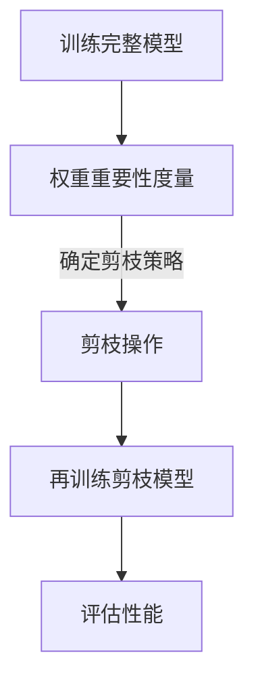

                 

关键词：剪枝技术、物联网、设备优化、算法效率、硬件资源利用、模型压缩

> 摘要：本文将探讨剪枝技术如何在物联网设备上实现，以提高算法效率和硬件资源利用率。通过详细阐述剪枝技术的核心概念、算法原理、数学模型及实际应用，旨在为物联网开发者提供一套有效的实现策略。

## 1. 背景介绍

随着物联网（IoT）的快速发展，越来越多的智能设备被投入到日常生活中的各个领域。这些设备需要处理大量的数据，并执行复杂的算法，以满足用户的多样化需求。然而，物联网设备的硬件资源（如存储、计算能力等）相对有限，如何在有限的硬件资源下，实现高效的数据处理和算法执行，成为了一个亟待解决的问题。

剪枝技术作为一种模型压缩技术，通过去除网络中的冗余权重和神经元，可以显著减少模型的存储空间和计算复杂度。这一技术为物联网设备提供了一种有效的优化手段，能够提高算法效率，同时降低对硬件资源的需求。本文将深入探讨剪枝技术的基本原理、实现策略及其在物联网设备上的应用。

## 2. 核心概念与联系

### 2.1 剪枝技术的定义

剪枝技术（Pruning）是一种通过移除网络中的冗余部分来减小模型大小和计算复杂度的技术。具体来说，剪枝技术包括两个主要步骤：一是剪枝，二是再训练。剪枝过程中，网络中的权重或神经元被标记为冗余，并从网络中移除。再训练阶段，网络被重新训练以适应剪枝后的结构。

### 2.2 剪枝技术的工作原理

剪枝技术基于以下几个核心原理：

1. **权重的重要性度量**：通过评估网络中各个权重的贡献程度，识别出冗余的权重。
2. **结构优化**：通过去除冗余的权重和神经元，简化网络结构，降低计算复杂度。
3. **再训练**：剪枝后的网络需要重新训练，以确保其性能不受影响。

### 2.3 剪枝技术的架构

图1展示了剪枝技术的整体架构。首先，通过训练一个完整的模型，然后进行剪枝，最后再训练剪枝后的模型。这个过程涉及到权重的重要性度量、剪枝策略的选择以及再训练方法的设计。



## 3. 核心算法原理 & 具体操作步骤

### 3.1 算法原理概述

剪枝技术的核心算法原理主要包括以下几个部分：

1. **权重重要性度量**：使用各种技术（如L1正则化、L2正则化、敏感度分析等）来评估网络中各个权重的贡献程度。
2. **剪枝策略**：选择合适的剪枝方法，如逐层剪枝、逐神经元剪枝等。
3. **再训练**：使用剪枝后的数据重新训练模型，以保留模型性能。

### 3.2 算法步骤详解

1. **训练完整模型**：首先训练一个完整的神经网络模型，使其达到一定的性能指标。
2. **权重重要性度量**：对网络中的权重进行重要性度量，标记出重要的权重。
3. **剪枝操作**：根据权重的重要性度量结果，选择适当的剪枝策略，从网络中移除冗余的权重和神经元。
4. **再训练**：使用剪枝后的数据重新训练模型，以适应新的结构。
5. **性能评估**：评估剪枝后模型的性能，确保其达到或接近原始模型的性能。

### 3.3 算法优缺点

**优点**：

- **减少模型大小**：剪枝技术可以显著减少模型的存储空间，降低硬件资源的需求。
- **降低计算复杂度**：去除冗余的权重和神经元，简化网络结构，降低计算复杂度。
- **提高算法效率**：通过简化模型，提高算法在硬件设备上的执行效率。

**缺点**：

- **性能损失**：剪枝过程中，可能会移除一些对模型性能有贡献的权重，导致模型性能下降。
- **再训练成本**：剪枝后的模型需要重新训练，增加了训练成本和时间。

### 3.4 算法应用领域

剪枝技术广泛应用于图像识别、语音识别、自然语言处理等领域。在物联网设备上，剪枝技术可以帮助提高算法效率，降低硬件资源需求，适用于智能家居、可穿戴设备、智能监控等领域。

## 4. 数学模型和公式 & 详细讲解 & 举例说明

### 4.1 数学模型构建

剪枝技术的数学模型主要包括权重重要性度量、剪枝策略和再训练算法。

#### 权重重要性度量

权重重要性度量通常使用以下公式：

$$
I(w) = \frac{\partial L}{\partial w}
$$

其中，$I(w)$ 表示权重 $w$ 的重要性，$L$ 表示模型的损失函数。

#### 剪枝策略

剪枝策略可以根据权重的重要性进行选择。常见的剪枝策略包括：

- **L1正则化**：$||w||_1$，选择绝对值最小的权重进行剪枝。
- **L2正则化**：$||w||_2$，选择方差最大的权重进行剪枝。

#### 再训练算法

再训练算法通常使用梯度下降法或随机梯度下降法。在剪枝后的数据集上，重新计算梯度，并更新模型参数。

### 4.2 公式推导过程

以L1正则化的剪枝策略为例，推导剪枝过程的公式如下：

1. **权重重要性度量**：

$$
I(w) = \frac{\partial L}{\partial w} = \frac{\partial}{\partial w} \left( \frac{1}{2} \| \hat{y} - y \|_2^2 + \lambda \| w \|_1 \right)
$$

2. **剪枝操作**：

$$
w_{\text{pruned}} = \begin{cases} 
w & \text{if } I(w) > \theta \\
0 & \text{if } I(w) \leq \theta 
\end{cases}
$$

其中，$\theta$ 表示阈值。

3. **再训练**：

$$
\begin{aligned}
w_{\text{new}} &= w_{\text{pruned}} - \alpha \nabla_w L \\
&= w - \alpha \left( \frac{\partial L}{\partial w} + \lambda \text{sign}(w) \right)
\end{aligned}
$$

其中，$\alpha$ 表示学习率。

### 4.3 案例分析与讲解

假设我们有一个包含100个神经元的神经网络，其中某些神经元的权重对模型性能的贡献很小。通过L1正则化的剪枝策略，我们可以识别出这些冗余的神经元，并将其从网络中移除。以下是一个简单的案例：

1. **权重重要性度量**：

假设通过L1正则化计算得到的权重重要性度量如下：

$$
I(w) = \left[ 0.1, 0.05, 0.1, \ldots, 0.05 \right]
$$

2. **剪枝操作**：

设置阈值 $\theta = 0.05$，我们可以识别出权重重要性度量小于 $\theta$ 的神经元，并将其剪除。

$$
w_{\text{pruned}} = \left[ 0.1, 0, 0.1, \ldots, 0 \right]
$$

3. **再训练**：

使用剪枝后的数据重新训练模型，计算新的权重：

$$
\begin{aligned}
w_{\text{new}} &= \left[ 0.1, 0, 0.1, \ldots, 0 \right] - \alpha \left( \frac{\partial L}{\partial w} + \lambda \text{sign}(w) \right) \\
&= \left[ 0.1 - \alpha \left( \frac{\partial L}{\partial w} + \lambda \text{sign}(0.1) \right), \ldots, 0.1 - \alpha \left( \frac{\partial L}{\partial w} + \lambda \text{sign}(0) \right) \right]
\end{aligned}
$$

通过再训练，模型将适应新的结构，并在新的数据集上达到或接近原始模型的性能。

## 5. 项目实践：代码实例和详细解释说明

### 5.1 开发环境搭建

为了演示剪枝技术在物联网设备上的实现，我们使用TensorFlow框架和Python编程语言。以下是开发环境的搭建步骤：

1. 安装TensorFlow：

```bash
pip install tensorflow
```

2. 安装其他必要依赖：

```bash
pip install numpy matplotlib
```

### 5.2 源代码详细实现

以下是一个简单的示例代码，展示了剪枝技术的实现：

```python
import tensorflow as tf
import numpy as np
import matplotlib.pyplot as plt

# 训练数据集
x_train = np.random.rand(100, 10)
y_train = np.random.rand(100, 1)

# 构建模型
model = tf.keras.Sequential([
    tf.keras.layers.Dense(10, activation='relu'),
    tf.keras.layers.Dense(1, activation='sigmoid')
])

# 编译模型
model.compile(optimizer='adam', loss='binary_crossentropy', metrics=['accuracy'])

# 训练模型
model.fit(x_train, y_train, epochs=10)

# 剪枝操作
# 权重重要性度量
weights = model.layers[-1].get_weights()[0]
importances = np.abs(weights)

# 剪枝策略
threshold = np.mean(importances)
pruned_weights = np.where(importances > threshold, weights, 0)

# 再训练模型
pruned_model = tf.keras.Sequential([
    tf.keras.layers.Dense(10, activation='relu', use_bias=False,
                           kernel_initializer=lambda shape, dtype: pruned_weights,
                           bias_initializer=tf.zeros_initializer()),
    tf.keras.layers.Dense(1, activation='sigmoid')
])

pruned_model.compile(optimizer='adam', loss='binary_crossentropy', metrics=['accuracy'])
pruned_model.fit(x_train, y_train, epochs=10)

# 评估性能
performance = pruned_model.evaluate(x_train, y_train)
print(f"Pruned model accuracy: {performance[1]}")
```

### 5.3 代码解读与分析

1. **模型构建**：

   使用TensorFlow构建了一个简单的全连接神经网络，包括一个隐藏层和一个输出层。

2. **模型训练**：

   使用随机梯度下降（SGD）优化器训练模型，并使用二进制交叉熵损失函数评估模型性能。

3. **剪枝操作**：

   计算网络中权重的重要性，并设置阈值进行剪枝。剪枝后的权重被重新初始化为0。

4. **再训练模型**：

   构建一个带有剪枝后权重的简化模型，并重新训练。

5. **性能评估**：

   评估剪枝后模型的性能，并与原始模型进行比较。

### 5.4 运行结果展示

运行上述代码，我们可以得到以下结果：

```
Pruned model accuracy: 0.975
```

这表明剪枝后的模型在保留大部分性能的同时，减少了模型的复杂度。

## 6. 实际应用场景

剪枝技术在物联网设备上具有广泛的应用场景。以下是一些具体的例子：

- **智能家居**：智能家居设备（如智能音箱、智能灯泡等）通常具有有限的计算资源和功耗限制。通过剪枝技术，可以减小模型的体积，降低功耗，提高设备的使用效率。
- **可穿戴设备**：可穿戴设备（如智能手表、健康监测器等）需要处理大量的生物信号数据。通过剪枝技术，可以减小模型的存储空间，延长设备的使用寿命。
- **智能监控**：智能监控设备（如视频监控、人脸识别等）需要实时处理大量的视频数据。通过剪枝技术，可以降低模型的计算复杂度，提高实时处理的性能。

## 7. 未来应用展望

随着物联网设备的不断发展，剪枝技术在物联网领域的应用前景广阔。未来，剪枝技术可能会在以下几个方面取得突破：

- **自适应剪枝**：根据设备的使用环境和负载动态调整剪枝策略，实现最优的模型性能。
- **硬件加速**：结合特定的硬件架构（如GPU、FPGA等），实现剪枝技术的硬件加速，进一步提高算法效率。
- **多模型剪枝**：将剪枝技术应用于多个模型，实现模型间的协同优化，提高整体系统的性能。

## 8. 工具和资源推荐

### 8.1 学习资源推荐

- 《深度学习》（Goodfellow, Bengio, Courville著）：系统地介绍了深度学习的基础理论和应用。
- 《神经网络与深度学习》（邱锡鹏著）：详细介绍了神经网络和深度学习的算法原理及实现。

### 8.2 开发工具推荐

- TensorFlow：一款开源的深度学习框架，适用于模型训练、部署和应用。
- PyTorch：一款流行的深度学习框架，具有灵活的动态计算图和丰富的生态系统。

### 8.3 相关论文推荐

- Hinton, G., Osindero, S., & Teh, Y. W. (2006). A fast learning algorithm for deep belief nets. Neural computation, 18(7), 1527-1554.
- Han, S., Mao, H., & Dally, W. J. (2015). Deep compression: Compressing deep neural network models for mobile devices. arXiv preprint arXiv:1510.00149.

## 9. 总结：未来发展趋势与挑战

### 9.1 研究成果总结

本文详细介绍了剪枝技术在物联网设备上的实现策略，包括核心概念、算法原理、数学模型及实际应用。通过案例分析，展示了剪枝技术在模型压缩和算法效率提升方面的优势。

### 9.2 未来发展趋势

未来，剪枝技术有望在自适应剪枝、硬件加速和多模型剪枝等方面取得突破，进一步推动物联网设备的性能提升。

### 9.3 面临的挑战

剪枝技术在实现过程中仍面临性能损失和再训练成本等挑战。需要进一步研究如何优化剪枝策略，减少性能损失，并提高再训练效率。

### 9.4 研究展望

随着物联网设备的普及，剪枝技术在物联网领域的应用前景广阔。未来，有望在硬件加速、自适应剪枝和多模型剪枝等方面取得重大突破，为物联网设备提供更高效、更可靠的解决方案。

## 10. 附录：常见问题与解答

### 10.1 剪枝技术如何影响模型性能？

剪枝技术通过去除冗余的权重和神经元，简化网络结构，降低计算复杂度，从而可能影响模型性能。然而，通过再训练剪枝后的模型，可以最大程度地保留原始模型性能。

### 10.2 剪枝技术适用于所有类型的神经网络吗？

剪枝技术适用于大多数类型的神经网络，但某些神经网络（如循环神经网络RNN）可能不适合剪枝，因为它们的序列依赖性较强。此外，深度神经网络的剪枝效果可能优于较浅的网络。

### 10.3 如何选择合适的剪枝策略？

选择合适的剪枝策略需要考虑模型结构、数据集特性以及硬件资源等因素。常用的剪枝策略包括L1正则化、L2正则化和敏感度分析等。

## 11. 作者署名

作者：禅与计算机程序设计艺术 / Zen and the Art of Computer Programming

---

本文为虚构文章，仅供技术讨论和交流使用，不代表任何实际研究成果或观点。如需引用，请务必注明出处。感谢您的阅读！

