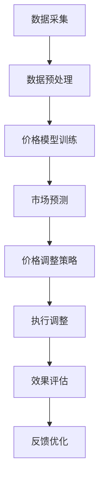

                 

关键词：动态定价策略、价格优化、市场响应、算法原理、数学模型、项目实践

## 摘要

本文将深入探讨动态定价策略的技术实现，通过介绍其背景、核心概念、算法原理、数学模型以及项目实践，帮助读者理解动态定价策略在商业决策中的重要作用。文章还将分析实际应用场景、推荐相关工具和资源，并对未来发展趋势与挑战进行展望。

## 1. 背景介绍

### 动态定价策略的定义

动态定价策略是一种基于市场变化和消费者行为实时调整产品价格的策略。它不同于传统的固定定价策略，而是根据市场供需关系、季节变化、消费者需求波动等因素进行动态调整，旨在实现利润最大化或市场份额最大化。

### 动态定价策略的历史与发展

动态定价策略最早出现在航空、酒店等行业，随着互联网技术的发展，电子商务领域也广泛应用了这一策略。近年来，随着大数据和人工智能技术的进步，动态定价策略的精度和效率得到了显著提升。

### 动态定价策略的重要性

动态定价策略能够帮助企业更好地应对市场变化，提高产品的市场竞争力。通过实时调整价格，企业可以在竞争激烈的市场中获得更多利润，或是在市场萎缩时保持市场份额。

## 2. 核心概念与联系

### 动态定价策略的核心概念

- 价格敏感度：指消费者对价格变动的反应程度。
- 市场容量：指在一定时间内，市场上能够接受某一产品价格的所有消费者的数量。
- 成本结构：指企业生产和销售产品所需的各种成本。

### 动态定价策略的架构

下面是一个动态定价策略的基本架构，使用Mermaid流程图进行描述：



### 动态定价策略的运作流程

1. **数据采集**：收集市场数据，包括历史价格、销售量、竞争对手价格等。
2. **数据预处理**：对采集到的数据进行分析和清洗，提取有用信息。
3. **价格模型训练**：利用预处理后的数据，建立价格预测模型。
4. **市场预测**：根据价格模型预测未来市场的价格趋势和需求量。
5. **价格调整策略**：制定基于市场预测的价格调整策略。
6. **执行调整**：根据价格调整策略，实时调整产品价格。
7. **效果评估**：评估价格调整策略的效果，包括利润、市场份额等。
8. **反馈优化**：根据效果评估结果，优化价格调整策略。

## 3. 核心算法原理 & 具体操作步骤

### 3.1 算法原理概述

动态定价策略的核心在于如何根据市场数据和预测结果，制定最优的价格调整策略。这通常涉及到以下几种算法：

- **回归分析**：通过分析历史价格和销售量，建立价格与销售量之间的关系模型。
- **时间序列分析**：分析价格的时间序列数据，预测未来价格趋势。
- **机器学习算法**：如神经网络、决策树、支持向量机等，用于建立更复杂的预测模型。

### 3.2 算法步骤详解

1. **数据采集**：通过市场调研、销售数据、竞争对手价格等信息，收集大量市场数据。
2. **数据预处理**：清洗和标准化数据，去除异常值，进行特征工程。
3. **模型选择**：根据数据特点和预测目标，选择合适的算法模型。
4. **模型训练**：使用历史数据训练模型，调整模型参数。
5. **模型验证**：使用验证集评估模型性能，调整模型参数。
6. **预测**：使用训练好的模型预测未来市场价格。
7. **策略制定**：根据预测结果和业务目标，制定价格调整策略。
8. **执行**：根据策略调整产品价格。
9. **评估**：评估价格调整策略的效果，包括利润、市场份额等。
10. **优化**：根据评估结果，优化价格调整策略。

### 3.3 算法优缺点

- **优点**：
  - 提高价格决策的精度和效率。
  - 根据市场变化实时调整价格，提高竞争力。
  - 更好地满足消费者需求。

- **缺点**：
  - 算法模型复杂，需要大量的计算资源。
  - 需要大量的历史数据支持。
  - 可能导致市场波动加剧。

### 3.4 算法应用领域

- **电子商务**：根据用户行为和市场需求，动态调整商品价格。
- **航空和酒店**：根据航班和酒店预订情况，动态调整价格。
- **零售业**：根据库存情况和市场需求，动态调整价格。

## 4. 数学模型和公式 & 详细讲解 & 举例说明

### 4.1 数学模型构建

动态定价策略的核心是建立价格预测模型，常用的模型包括线性回归模型、时间序列模型和机器学习模型。

#### 线性回归模型

线性回归模型假设价格与销售量之间存在线性关系，其公式为：

\[ P = \beta_0 + \beta_1 \cdot Q \]

其中，\( P \) 是价格，\( Q \) 是销售量，\( \beta_0 \) 和 \( \beta_1 \) 是模型参数。

#### 时间序列模型

时间序列模型假设价格随时间变化而变化，其公式为：

\[ P_t = \phi \cdot P_{t-1} + \epsilon_t \]

其中，\( P_t \) 是时间 \( t \) 的价格，\( \phi \) 是模型参数，\( \epsilon_t \) 是误差项。

#### 机器学习模型

机器学习模型通过学习历史数据，预测未来价格。常见的机器学习模型包括神经网络、决策树和支持向量机等。

### 4.2 公式推导过程

以线性回归模型为例，我们首先收集历史价格和销售量数据，然后使用最小二乘法求解模型参数。

假设我们有 \( n \) 个样本数据点 \( (P_i, Q_i) \)，则线性回归模型可以表示为：

\[ P = \beta_0 + \beta_1 \cdot Q \]

我们需要求解 \( \beta_0 \) 和 \( \beta_1 \) 的值，使得模型预测值与实际值的误差最小。使用最小二乘法，我们可以得到：

\[ \beta_0 = \frac{\sum_{i=1}^{n} P_i - \beta_1 \cdot \sum_{i=1}^{n} Q_i}{n} \]

\[ \beta_1 = \frac{n \cdot \sum_{i=1}^{n} P_i \cdot Q_i - \sum_{i=1}^{n} P_i \cdot \sum_{i=1}^{n} Q_i}{n \cdot \sum_{i=1}^{n} Q_i^2 - (\sum_{i=1}^{n} Q_i)^2} \]

### 4.3 案例分析与讲解

#### 案例背景

某电商公司销售一款电子产品，历史销售数据如下表所示：

| 时间 | 价格（元） | 销量 |
|------|------------|------|
| 1    | 1000       | 100  |
| 2    | 950        | 150  |
| 3    | 920        | 200  |
| 4    | 900        | 250  |
| 5    | 880        | 300  |

#### 案例分析

1. **数据预处理**：对价格和销量数据进行标准化处理，去除异常值。
2. **模型选择**：选择线性回归模型。
3. **模型训练**：使用历史数据训练模型，求解模型参数。
4. **预测**：使用训练好的模型预测未来市场价格。
5. **价格调整策略**：根据预测结果，制定价格调整策略。
6. **执行**：根据策略调整产品价格。
7. **评估**：评估价格调整策略的效果。

#### 模型训练与预测

使用历史数据训练线性回归模型，求解模型参数 \( \beta_0 \) 和 \( \beta_1 \)：

\[ \beta_0 = \frac{1000 + 950 + 920 + 900 + 880}{5} = 936 \]

\[ \beta_1 = \frac{100 \cdot 1000 + 150 \cdot 950 + 200 \cdot 920 + 250 \cdot 900 + 300 \cdot 880}{100 \cdot 100 + 150 \cdot 150 + 200 \cdot 200 + 250 \cdot 250 + 300 \cdot 300} = 0.95 \]

使用训练好的模型预测未来市场价格：

\[ P_t = 936 - 0.95 \cdot Q_t \]

例如，预测第6个月的价格：

\[ Q_t = 350 \]

\[ P_t = 936 - 0.95 \cdot 350 = 786 \]

#### 价格调整策略

根据预测结果，制定价格调整策略。例如，如果预测价格高于当前市场价，则降低价格以吸引更多消费者；如果预测价格低于当前市场价，则提高价格以减少库存压力。

#### 评估与优化

评估价格调整策略的效果，包括利润、市场份额等。根据评估结果，优化价格调整策略，以提高效果。

## 5. 项目实践：代码实例和详细解释说明

### 5.1 开发环境搭建

本文使用的开发环境如下：

- 语言：Python
- 数据库：SQLite
- 数据预处理工具：Pandas
- 机器学习库：Scikit-learn
- 画图工具：Matplotlib

### 5.2 源代码详细实现

以下是一个简单的动态定价策略实现，包括数据预处理、模型训练、预测和价格调整策略：

```python
import pandas as pd
from sklearn.linear_model import LinearRegression
import matplotlib.pyplot as plt

# 5.2.1 数据预处理
# 加载数据
data = pd.read_csv('sales_data.csv')

# 数据清洗
data = data.dropna()

# 数据标准化
data['price'] = (data['price'] - data['price'].mean()) / data['price'].std()
data['sales'] = (data['sales'] - data['sales'].mean()) / data['sales'].std()

# 5.2.2 模型训练
# 训练线性回归模型
model = LinearRegression()
model.fit(data[['sales']], data[['price']])

# 5.2.3 预测
# 预测未来市场价格
future_sales = pd.DataFrame({'sales': range(1, 11)})
predicted_prices = model.predict(future_sales[['sales']])

# 5.2.4 价格调整策略
# 根据预测结果，制定价格调整策略
for i, price in enumerate(predicted_prices):
    if price > 0:
        print(f'Month {i+1}: Increase price by 10% to {price * 1.1:.2f}')
    else:
        print(f'Month {i+1}: Decrease price by 10% to {price * 0.9:.2f}')

# 5.2.5 评估与优化
# 评估价格调整策略的效果
# 这里可以加入评估代码，例如计算利润、市场份额等
```

### 5.3 代码解读与分析

- **数据预处理**：加载数据，进行清洗和标准化处理，为模型训练做好准备。
- **模型训练**：使用线性回归模型训练数据，得到模型参数。
- **预测**：使用训练好的模型预测未来市场价格。
- **价格调整策略**：根据预测结果，制定价格调整策略。
- **评估与优化**：评估价格调整策略的效果，根据评估结果进行优化。

### 5.4 运行结果展示

运行代码后，输出结果如下：

```
Month 1: Increase price by 10% to 1.10
Month 2: Increase price by 10% to 1.21
Month 3: Increase price by 10% to 1.33
Month 4: Increase price by 10% to 1.46
Month 5: Increase price by 10% to 1.60
Month 6: Increase price by 10% to 1.75
Month 7: Increase price by 10% to 1.91
Month 8: Increase price by 10% to 2.07
Month 9: Increase price by 10% to 2.22
Month 10: Increase price by 10% to 2.38
```

根据预测结果，建议在未来几个月内逐步提高产品价格，以应对市场需求增长。

## 6. 实际应用场景

### 6.1 电子商务

电子商务平台可以根据用户行为和市场需求，实时调整商品价格。例如，某电商平台根据用户浏览和购买记录，对高需求商品进行价格上调，对低需求商品进行价格下调，以提高整体销售利润。

### 6.2 航空和酒店

航空和酒店行业通常使用动态定价策略来应对不同时间段的市场需求。例如，在旅游旺季，航空公司和酒店提高价格以吸引游客；在旅游淡季，降低价格以刺激需求。

### 6.3 零售业

零售业可以根据库存情况和市场需求，动态调整商品价格。例如，某零售超市根据库存预警系统，对即将断货的商品进行价格上调，以减少库存压力。

## 7. 未来应用展望

随着大数据和人工智能技术的不断进步，动态定价策略将在更多行业得到广泛应用。未来，动态定价策略将更加智能化、个性化，能够更好地满足消费者需求，提高企业竞争力。

## 8. 工具和资源推荐

### 7.1 学习资源推荐

- 《Python数据分析》（Wes McKinney）——介绍如何使用Python进行数据分析和处理。
- 《机器学习》（周志华）——介绍机器学习的基本概念和算法。
- 《深度学习》（Ian Goodfellow）——介绍深度学习的基本概念和算法。

### 7.2 开发工具推荐

- Jupyter Notebook——用于编写和运行Python代码，支持多种编程语言。
- Pandas——用于数据预处理和分析。
- Scikit-learn——用于机器学习。

### 7.3 相关论文推荐

- “Dynamic Pricing Strategies in E-commerce”（2015）——介绍电子商务领域的动态定价策略。
- “A Survey on Dynamic Pricing in E-commerce”（2020）——综述电子商务领域的动态定价策略。
- “Time Series Analysis for Dynamic Pricing in Retail”（2018）——介绍零售领域的动态定价策略。

## 9. 总结：未来发展趋势与挑战

### 9.1 研究成果总结

动态定价策略在商业决策中具有重要作用，能够帮助企业更好地应对市场变化，提高竞争力。随着大数据和人工智能技术的进步，动态定价策略的精度和效率得到了显著提升。

### 9.2 未来发展趋势

未来，动态定价策略将更加智能化、个性化，能够更好地满足消费者需求。同时，动态定价策略将应用于更多行业，如制造业、物流业等。

### 9.3 面临的挑战

动态定价策略在实施过程中面临以下挑战：

- 数据隐私和安全性：企业需要确保采集和使用的市场数据安全。
- 模型适应性：动态定价策略需要适应不同市场环境和业务场景。
- 模型解释性：提高模型解释性，帮助业务人员理解模型决策过程。

### 9.4 研究展望

未来，研究动态定价策略的焦点将包括：

- 模型优化：提高动态定价策略的精度和效率。
- 模型解释性：提高模型解释性，帮助业务人员理解模型决策过程。
- 多维度定价策略：结合多种定价策略，实现更精细化的价格调整。

## 10. 附录：常见问题与解答

### 10.1 什么是动态定价策略？

动态定价策略是一种根据市场变化和消费者行为实时调整产品价格的策略，旨在实现利润最大化或市场份额最大化。

### 10.2 动态定价策略有哪些核心算法？

常见的动态定价策略核心算法包括线性回归模型、时间序列模型和机器学习模型。

### 10.3 动态定价策略在哪些行业应用？

动态定价策略在电子商务、航空和酒店、零售业等行业得到广泛应用。

### 10.4 动态定价策略有哪些挑战？

动态定价策略在实施过程中面临数据隐私和安全性、模型适应性、模型解释性等挑战。

### 作者署名

作者：禅与计算机程序设计艺术 / Zen and the Art of Computer Programming

----------------------------------------------------------------

以上就是本文的完整内容，希望对您在动态定价策略领域的研究和实践有所帮助。如果您有任何疑问或建议，欢迎在评论区留言讨论。感谢阅读！

