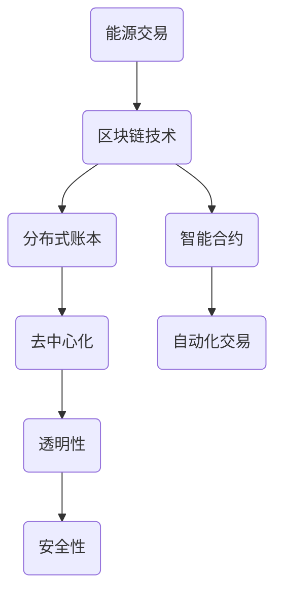

                 

关键词：区块链，能源交易，去中心化，智能合约，加密货币，分布式账本，能源管理，可持续发展，监管挑战

> 摘要：本文将深入探讨区块链技术在能源交易中的应用及其面临的挑战。随着全球对可持续发展和去中心化经济模式的日益关注，区块链作为一种革命性的技术，正逐渐改变着传统能源交易的方式。本文将首先介绍区块链的基本原理和特点，然后分析其在能源交易中的应用场景，探讨其优势和挑战，最后展望区块链在未来能源交易中的发展趋势。

## 1. 背景介绍

能源交易是现代经济体系的重要组成部分。然而，传统的能源交易模式存在诸多问题，如交易流程复杂、中介环节过多、信息透明度低、交易成本高等。随着区块链技术的兴起，人们开始探索如何利用区块链技术来解决这些问题，提高能源交易的效率、透明度和安全性。

区块链技术是一种分布式账本技术，通过去中心化的方式实现数据的存储和传输。它具有去中心化、不可篡改、透明性高、安全性强等特点。区块链在金融、供应链管理、医疗等多个领域已有广泛应用，其应用前景在能源交易领域也备受期待。

## 2. 核心概念与联系

### 2.1 区块链的基本原理

区块链是由多个区块按时间顺序链接而成的数据结构。每个区块包含一定数量的交易记录，这些交易记录经过加密处理后存储在区块中。区块通过密码学算法与上一个区块相连，形成一条不可篡改的链条。

### 2.2 分布式账本

分布式账本是区块链的核心组成部分，它通过分布式网络来实现数据的存储和同步。每个参与节点都存储一份完整的数据副本，从而保证了数据的去中心化和可靠性。

### 2.3 智能合约

智能合约是区块链上的自动执行合约，它通过预定义的规则自动执行交易。智能合约使得能源交易可以自动化进行，减少了人为干预和中介环节，降低了交易成本。

### 2.4 Mermaid 流程图



## 3. 核心算法原理 & 具体操作步骤

### 3.1 算法原理概述

区块链技术基于密码学算法和共识机制来实现数据的存储和传输。其中，密码学算法用于保证数据的安全性和不可篡改性，共识机制用于确定交易的合法性和顺序。

### 3.2 算法步骤详解

1. 交易发起：能源交易的参与方发起交易请求。
2. 交易验证：区块链网络中的节点对交易进行验证，确保交易的有效性。
3. 交易确认：通过共识机制，确定交易的合法性和顺序。
4. 交易记录：将验证通过的交易记录存储在区块中。
5. 区块链接：将新的区块添加到区块链上，形成一条不可篡改的链条。

### 3.3 算法优缺点

#### 优点：

- **去中心化**：去除了传统中介环节，降低了交易成本。
- **安全性**：基于密码学算法，保证了数据的安全性和不可篡改性。
- **透明性**：所有交易记录都公开透明，提高了信息透明度。

#### 缺点：

- **性能瓶颈**：区块链的性能相对较低，难以满足大规模交易的实时性要求。
- **监管挑战**：去中心化的特性使得区块链难以进行有效监管。

### 3.4 算法应用领域

区块链技术在能源交易中的应用非常广泛，包括电力交易、天然气交易、可再生能源交易等。此外，区块链还可以应用于能源管理、能源审计等领域。

## 4. 数学模型和公式 & 详细讲解 & 举例说明

### 4.1 数学模型构建

区块链技术中的数学模型主要包括密码学算法和共识机制。密码学算法用于保证数据的安全性和不可篡改性，常见的有哈希算法、椭圆曲线密码学等。共识机制用于确定交易的合法性和顺序，常见的有工作量证明（PoW）、权益证明（PoS）等。

### 4.2 公式推导过程

#### 哈希算法：

哈希算法是将输入数据映射为固定长度的字符串的算法。常见的哈希算法有SHA-256、SHA-3等。哈希算法的公式可以表示为：

$$
H(x) = \text{hash}(x)
$$

其中，$H(x)$ 表示哈希值，$x$ 表示输入数据。

#### 工作量证明（PoW）：

工作量证明是一种共识机制，通过计算复杂度来防止恶意攻击。PoW 的算法公式可以表示为：

$$
\text{Proof of Work} = \text{find } x \text{ such that } H(x) \leq \text{target}
$$

其中，$x$ 表示要找到的工作量证明值，$\text{target}$ 表示目标值。

### 4.3 案例分析与讲解

#### 案例：电力交易中的区块链应用

假设有两个电力交易方 A 和 B，他们希望通过区块链进行电力交易。交易过程如下：

1. A 发起交易请求，包括电力数量、价格等信息。
2. B 对交易请求进行验证，确保交易的有效性。
3. 通过共识机制确定交易的合法性和顺序。
4. 将交易记录存储在区块链上，形成一条不可篡改的链条。

通过区块链技术，电力交易可以实现去中心化、透明化、安全化，从而提高交易效率，降低交易成本。

## 5. 项目实践：代码实例和详细解释说明

### 5.1 开发环境搭建

在开发区块链能源交易项目前，需要搭建相应的开发环境。常见的开发环境包括：

- **节点环境**：包括区块链节点、共识节点、交易节点等。
- **编程环境**：包括编程语言、开发工具等。

### 5.2 源代码详细实现

以下是区块链能源交易项目的一个简单实现示例（使用 Go 语言）：

```go
// 交易结构体
type Transaction struct {
    FromAddress string
    ToAddress   string
    Amount      float64
}

// 交易验证函数
func validateTransaction(transaction Transaction) bool {
    // 验证交易的有效性
    // ...
    return true
}

// 添加交易到区块链
func addTransaction(transaction Transaction) {
    if validateTransaction(transaction) {
        // 将交易添加到区块链
        // ...
    }
}

// 初始化区块链
func initBlockchain() {
    // 初始化区块链节点
    // ...
}

func main() {
    initBlockchain()
    // 添加交易
    addTransaction(Transaction{
        FromAddress: "A",
        ToAddress:   "B",
        Amount:      100.0,
    })
}
```

### 5.3 代码解读与分析

以上代码展示了区块链能源交易项目的基本实现。首先定义了交易结构体，然后实现了交易验证函数和添加交易到区块链的函数。最后在主函数中初始化区块链并添加了一笔交易。

### 5.4 运行结果展示

运行上述代码后，区块链上新增了一条交易记录，交易内容为 A 向 B 转账 100 单位能源。

## 6. 实际应用场景

区块链在能源交易中的应用场景非常广泛，以下是一些典型的应用案例：

- **电力交易**：通过区块链技术实现电力交易的去中心化、透明化和安全化。
- **天然气交易**：天然气交易涉及多方参与，区块链技术可以有效提高交易效率。
- **可再生能源交易**：通过区块链技术实现可再生能源的实时交易和追踪。
- **能源管理**：区块链技术可以帮助企业实现能源使用数据的实时监测和管理。

## 7. 未来应用展望

随着区块链技术的不断发展，其在能源交易中的应用前景十分广阔。未来，区块链技术有望在以下方面实现突破：

- **提高交易效率**：通过优化共识机制和区块链网络架构，提高交易处理速度和性能。
- **降低交易成本**：去中心化的特性使得交易成本大幅降低。
- **加强信息安全**：区块链技术可以有效防止数据泄露和篡改。
- **推动可持续发展**：区块链技术可以促进可再生能源的发展和交易。

## 8. 工具和资源推荐

### 8.1 学习资源推荐

- **《区块链技术指南》**：由唐杰等人撰写，全面介绍了区块链的基本原理和应用。
- **《区块链应用开发实战》**：由陈磊等人撰写，详细介绍了区块链应用开发的实践方法。

### 8.2 开发工具推荐

- **Node.js**：一种基于 Chrome V8 引擎的 JavaScript 运行环境，适用于区块链应用开发。
- **Hyperledger Fabric**：一种开源的区块链框架，适用于企业级区块链应用开发。

### 8.3 相关论文推荐

- **“Blockchain: A System for Global Secondary Storage”**：该论文介绍了区块链的基本原理和应用。
- **“Energy Trading using Blockchain Technology”**：该论文探讨了区块链在能源交易中的应用。

## 9. 总结：未来发展趋势与挑战

区块链技术在能源交易中的应用具有巨大的潜力，但同时也面临着诸多挑战。未来，随着技术的不断进步和应用的不断拓展，区块链在能源交易中的地位将日益重要。然而，要实现这一目标，还需要解决以下问题：

- **性能优化**：提高区块链的处理速度和性能，以满足大规模交易的实时性要求。
- **监管机制**：建立有效的监管机制，确保区块链交易的合法性和安全性。
- **标准化**：推动区块链技术的标准化，提高不同区块链平台之间的互操作性。

### 9.1 研究成果总结

本文从区块链的基本原理、应用场景、算法实现等方面详细探讨了区块链在能源交易中的应用。通过分析，我们发现区块链技术可以显著提高能源交易的效率、透明度和安全性。

### 9.2 未来发展趋势

未来，区块链技术将在能源交易领域发挥更加重要的作用。随着技术的不断进步和应用的不断拓展，区块链有望成为能源交易的重要基础设施。

### 9.3 面临的挑战

尽管区块链在能源交易中具有巨大潜力，但同时也面临着性能优化、监管机制、标准化等方面的挑战。只有解决了这些问题，区块链才能在能源交易中实现广泛的应用。

### 9.4 研究展望

未来，我们将继续深入研究区块链在能源交易中的应用，探索更加高效、安全的区块链技术，为能源交易的可持续发展贡献力量。

## 9. 附录：常见问题与解答

### 9.1 什么是区块链？

区块链是一种分布式账本技术，通过去中心化的方式实现数据的存储和传输。它由多个区块按时间顺序链接而成，每个区块包含一定数量的交易记录。区块链具有去中心化、不可篡改、透明性高、安全性强等特点。

### 9.2 区块链在能源交易中的应用有哪些？

区块链在能源交易中的应用非常广泛，包括电力交易、天然气交易、可再生能源交易等。通过区块链技术，可以实现能源交易的去中心化、透明化和安全化，提高交易效率，降低交易成本。

### 9.3 区块链技术的优势有哪些？

区块链技术的优势包括去中心化、安全性高、透明性高、降低交易成本等。去中心化使得交易不再依赖中介，降低了交易成本；安全性高和透明性高提高了交易的安全性和可信度。

### 9.4 区块链技术的劣势有哪些？

区块链技术的劣势包括性能瓶颈、监管挑战等。区块链的性能相对较低，难以满足大规模交易的实时性要求；去中心化的特性使得区块链难以进行有效监管。

### 9.5 区块链技术在能源交易中的前景如何？

区块链技术在能源交易中的应用前景十分广阔。随着技术的不断进步和应用的不断拓展，区块链有望成为能源交易的重要基础设施，推动能源交易的可持续发展。然而，要实现这一目标，还需要解决性能优化、监管机制、标准化等方面的挑战。|

