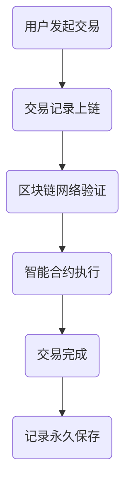

                 

关键词：区块链、金融科技、加密货币、智能合约、去中心化、交易记录、透明性、安全性、监管合规、支付系统、跨境交易

## 摘要

本文旨在探讨区块链技术在金融科技（FinTech）领域的创新应用。区块链作为一种去中心化的分布式账本技术，具备高度透明、安全、不可篡改的特点，正逐渐改变传统金融行业的运作模式。本文将分析区块链在加密货币、智能合约、支付系统、跨境交易等方面的具体应用，并探讨其在金融科技领域的发展趋势和面临的挑战。

## 1. 背景介绍

区块链起源于比特币的发明，自2008年由中本聪（Satoshi Nakamoto）提出以来，经过近15年的发展，已逐渐成为全球关注的热点技术。区块链技术通过去中心化的方式实现了数据的分布式存储和验证，使信息的传输更加安全、高效、透明。随着区块链技术的不断成熟，其在金融科技领域中的应用也越来越广泛。

金融科技（FinTech）是指利用技术革新传统金融业务，提高金融服务的效率、降低成本、改善用户体验。区块链作为一种创新的技术手段，在金融科技领域具有巨大的潜力。从加密货币到智能合约，再到支付系统和跨境交易，区块链正在重新定义金融行业的发展方向。

## 2. 核心概念与联系

### 2.1 区块链基本原理

区块链是一种分布式数据库技术，通过加密算法确保数据的安全性和不可篡改性。区块链由多个区块组成，每个区块包含一定数量的交易记录。这些区块通过加密算法和时间戳进行连接，形成一个不可篡改的链式结构。

### 2.2 加密货币

加密货币是一种基于区块链技术的数字货币，如比特币、以太坊等。加密货币的去中心化特性使其不受任何政府或金融机构的控制，具有匿名性、安全性等特点。

### 2.3 智能合约

智能合约是一种基于区块链的自动执行合约，通过编写在区块链上的代码实现。智能合约在满足特定条件时自动执行，无需人工干预，提高了交易效率和安全性。

### 2.4 去中心化金融（DeFi）

去中心化金融（DeFi）是一种基于区块链的金融应用，通过智能合约实现传统金融功能，如贷款、交易、理财等。DeFi的去中心化特性使其不受任何金融机构的控制，降低了交易成本。

### 2.5 跨境交易

跨境交易是指不同国家或地区之间的货币交换。区块链技术的分布式账本特性使其在跨境交易中具有巨大潜力，能够实现实时、高效、低成本的跨境支付。

### 2.6 Mermaid 流程图

下面是一个简化的区块链在金融科技中的应用流程图：



## 3. 核心算法原理 & 具体操作步骤

### 3.1 算法原理概述

区块链的核心算法包括加密算法、共识算法和智能合约算法。加密算法用于保护数据的安全性和隐私性，共识算法用于确保区块链网络中的数据一致性，智能合约算法用于实现自动化交易。

### 3.2 算法步骤详解

#### 3.2.1 加密算法

加密算法包括哈希算法和椭圆曲线加密算法。哈希算法用于将交易数据生成一个固定长度的哈希值，确保数据的唯一性和不可篡改性。椭圆曲线加密算法用于实现安全的密钥交换和数字签名。

#### 3.2.2 共识算法

共识算法包括工作量证明（PoW）、权益证明（PoS）和委托权益证明（DPoS）等。这些算法用于确保区块链网络中的节点达成共识，实现数据的分布式存储和验证。

#### 3.2.3 智能合约算法

智能合约算法基于编程语言实现，如Solidity、Vyper等。智能合约算法通过预定义的条件和逻辑，实现自动执行和记录交易。

### 3.3 算法优缺点

#### 3.3.1 加密算法

优点：保证数据的安全性和隐私性。

缺点：加密和解密过程需要消耗一定的计算资源和时间。

#### 3.3.2 共识算法

优点：确保区块链网络中的数据一致性。

缺点：部分共识算法（如PoW）可能导致资源浪费和环境污染。

#### 3.3.3 智能合约算法

优点：实现自动化交易，提高效率。

缺点：编写和调试智能合约具有一定难度，存在潜在的安全风险。

### 3.4 算法应用领域

区块链算法在金融科技领域具有广泛的应用，如加密货币、智能合约、去中心化金融（DeFi）、跨境交易等。这些应用通过区块链技术实现了去中心化、透明、高效、安全的金融服务。

## 4. 数学模型和公式 & 详细讲解 & 举例说明

### 4.1 数学模型构建

区块链中的数学模型主要包括加密算法模型、共识算法模型和智能合约模型。

#### 4.1.1 加密算法模型

加密算法模型主要包括哈希函数和椭圆曲线加密算法。

哈希函数模型：

$$ H(x) = \text{SHA-256}(x) $$

其中，$H(x)$为哈希值，$x$为输入数据，$\text{SHA-256}$为SHA-256哈希函数。

椭圆曲线加密算法模型：

$$ y^2 = x^3 + ax + b $$

其中，$y^2$为椭圆曲线上的点，$x$为椭圆曲线上的点，$a$和$b$为椭圆曲线参数。

#### 4.1.2 共识算法模型

共识算法模型主要包括工作量证明（PoW）和权益证明（PoS）。

工作量证明（PoW）模型：

$$ \text{PoW}(n) = \text{找到满足} \quad H(n) < t \quad \text{的} \quad n $$

其中，$\text{PoW}(n)$为工作量证明，$n$为尝试次数，$t$为阈值。

权益证明（PoS）模型：

$$ \text{PoS}(n) = \text{找到满足} \quad \text{Proof of Stake} \quad n $$

其中，$\text{PoS}(n)$为权益证明，$n$为持有代币数量。

#### 4.1.3 智能合约模型

智能合约模型基于Solidity编程语言，具体实现取决于具体的业务场景。

### 4.2 公式推导过程

#### 4.2.1 哈希函数推导

哈希函数的推导主要涉及SHA-256算法。SHA-256算法通过对输入数据进行分组处理，最终生成一个32位的哈希值。

具体推导过程如下：

1. 初始化128位哈希值。
2. 对输入数据进行分组处理，每组64位。
3. 对每个分组进行一系列变换，包括压缩函数、压缩值的更新等。
4. 输出32位的哈希值。

#### 4.2.2 椭圆曲线加密算法推导

椭圆曲线加密算法的推导主要涉及椭圆曲线方程和点乘运算。

椭圆曲线方程：

$$ y^2 = x^3 + ax + b $$

点乘运算：

$$ P \cdot k = \begin{cases} 
\text{倍加法} & \text{如果} \quad k \quad \text{为奇数} \\
\text{倍加倍法} & \text{如果} \quad k \quad \text{为偶数}
\end{cases} $$

#### 4.2.3 工作量证明推导

工作量证明的推导主要涉及寻找满足特定条件的哈希值。

具体推导过程如下：

1. 初始化尝试次数$n$。
2. 对$n$进行哈希运算，得到哈希值。
3. 判断哈希值是否小于阈值$t$。
4. 如果小于阈值$t$，则返回$n$；否则，重复步骤2和3。

#### 4.2.4 权益证明推导

权益证明的推导主要涉及持有代币数量和验证过程。

具体推导过程如下：

1. 初始化持有代币数量$n$。
2. 对$n$进行权益证明运算，得到证明值。
3. 判断证明值是否满足特定条件。
4. 如果满足条件，则返回验证结果；否则，重复步骤2和3。

### 4.3 案例分析与讲解

#### 4.3.1 加密货币案例分析

以比特币为例，比特币的加密算法采用SHA-256哈希函数。比特币的挖矿过程实质上是一个寻找满足特定条件的哈希值的过程。

具体步骤如下：

1. 初始化尝试次数$n$。
2. 对$n$进行哈希运算，得到哈希值。
3. 判断哈希值是否小于阈值$2^{16}$。
4. 如果小于阈值$2^{16}$，则返回$n$作为有效哈希值；否则，重复步骤2和3。

比特币的挖矿难度会根据网络算力的变化进行调整，以确保比特币的生成速度保持在恒定值。

#### 4.3.2 智能合约案例分析

以去中心化金融（DeFi）项目Aave为例，Aave使用智能合约实现借贷功能。Aave的智能合约采用Solidity编程语言编写，包括借贷、还款、抵押等功能。

具体步骤如下：

1. 用户将代币存入Aave智能合约。
2. 智能合约将用户代币转入Aave平台资金池。
3. 用户通过Aave平台获取借款。
4. 用户还款给Aave智能合约。
5. 智能合约将还款代币归还给用户。

Aave智能合约的实现过程中需要考虑安全性、可扩展性和性能等因素。

## 5. 项目实践：代码实例和详细解释说明

### 5.1 开发环境搭建

搭建区块链开发环境需要安装以下工具：

- Golang
- Ethereum客户端（如Geth）
- Solidity编译器（如Solc）
- Mermaid图库（用于绘制流程图）

具体安装方法如下：

1. 安装Golang：
   - 访问Golang官方网站下载最新版本的安装包。
   - 根据操作系统选择合适的安装方式，如Windows、Linux或MacOS。
   - 安装完成后，设置Golang环境变量。

2. 安装Ethereum客户端（Geth）：
   - 访问Ethereum官方网站下载Geth安装包。
   - 解压安装包，进入Geth目录。
   - 执行命令`geth --datadir "./data" --networkid 1337 --nodiscover --mine --miner.threads 1`启动Geth节点。

3. 安装Solidity编译器（Solc）：
   - 访问Solidity官方网站下载Solc安装包。
   - 解压安装包，将Solc命令添加到系统环境变量。

4. 安装Mermaid图库：
   - 访问Mermaid官方网站下载Mermaid安装包。
   - 解压安装包，将Mermaid命令添加到系统环境变量。

### 5.2 源代码详细实现

以下是一个简单的区块链实现的代码示例，包括区块链结构、挖矿功能、交易功能等。

```go
package main

import (
    "crypto/sha256"
    "encoding/hex"
    "encoding/json"
    "log"
    "math"
    "math/big"
    "time"
)

// 区块结构
type Block struct {
    Index     int       `json:"index"`
    Timestamp int64     `json:"timestamp"`
    Transactions []Transaction `json:"transactions"`
    PrevHash   string     `json:"prevHash"`
    Hash       string     `json:"hash"`
}

// 交易结构
type Transaction struct {
    From     string `json:"from"`
    To       string `json:"to"`
    Amount   float64 `json:"amount"`
}

// 区块链结构
type Blockchain struct {
    Blocks []*Block
}

// 创建新区块
func (bc *Blockchain) CreateBlock(transactions []Transaction, prevHash string) *Block {
    block := &Block{
        Index:       len(bc.Blocks),
        Timestamp:   time.Now().Unix(),
        Transactions: transactions,
        PrevHash:     prevHash,
    }
    block.Hash = bc.ComputeHash(block)
    bc.Blocks = append(bc.Blocks, block)
    return block
}

// 计算哈希值
func (bc *Blockchain) ComputeHash(block *Block) string {
    jsonBlock, _ := json.Marshal(block)
    hash := sha256.Sum256(jsonBlock)
    return hex.EncodeToString(hash[:])
}

// 验证链的有效性
func (bc *Blockchain) IsValid() bool {
    for i := 1; i < len(bc.Blocks); i++ {
        prevBlock := bc.Blocks[i-1]
        currentBlock := bc.Blocks[i]

        if currentBlock.PrevHash != prevBlock.Hash {
            return false
        }

        if currentBlock.Hash != bc.ComputeHash(currentBlock) {
            return false
        }
    }
    return true
}

// 挖矿函数
func (bc *Blockchain) MineBlock(transactions []Transaction, difficulty int) {
    var lastBlock *Block
    lastBlock = bc.Blocks[len(bc.Blocks)-1]
    hashTarget := big.NewInt(1)
    hashTarget.Lsh(hashTarget, uint(difficulty))

    for {
        newBlock := bc.CreateBlock(transactions, lastBlock.Hash)
        if bc.IsValidNewBlock(newBlock, lastBlock, hashTarget) {
            break
        }
        newHash := bc.ComputeHash(newBlock)
        log.Println("Mining:", newHash)
    }
}

// 验证新区块的有效性
func (bc *Blockchain) IsValidNewBlock(newBlock, lastBlock *Block, hashTarget *big.Int) bool {
    if lastBlock.Index+1 != newBlock.Index {
        return false
    }

    if lastBlock.Timestamp+60 < newBlock.Timestamp {
        return false
    }

    if newBlock.PrevHash != lastBlock.Hash {
        return false
    }

    if newBlock.Hash != bc.ComputeHash(newBlock) {
        return false
    }

    if newBlock.Hash.Cmp(hashTarget) > 0 {
        return false
    }

    return true
}

// 添加交易到区块链
func (bc *Blockchain) AddTransaction(transaction Transaction) {
    bc.Blocks = append(bc.Blocks, &Block{
        Index:   len(bc.Blocks),
        Timestamp: time.Now().Unix(),
        Transactions: []Transaction{transaction},
    })
}

func main() {
    bc := NewBlockchain()
    bc.AddTransaction(Transaction{"0", "1", 10.0})
    bc.AddTransaction(Transaction{"1", "2", 5.0})
    bc.MineBlock([]Transaction{}, 4)

    log.Println("Blockchain valid:", bc.IsValid())

    for _, block := range bc.Blocks {
        log.Printf("Index: %d, Timestamp: %d, Hash: %s, PrevHash: %s\n", block.Index, block.Timestamp, block.Hash, block.PrevHash)
    }
}
```

### 5.3 代码解读与分析

该示例代码实现了基本的区块链功能，包括区块链结构、挖矿功能、交易功能等。

1. **区块链结构**：
   - `Block`结构体表示一个区块，包括索引、时间戳、交易记录、前一个区块的哈希值和当前区块的哈希值。
   - `Blockchain`结构体表示一个区块链，包含多个区块。

2. **挖矿功能**：
   - `MineBlock`函数实现挖矿功能，通过计算满足特定难度的哈希值来创建新区块。
   - `IsValidNewBlock`函数用于验证新区块的有效性。

3. **交易功能**：
   - `AddTransaction`函数用于向区块链添加交易。

4. **主函数**：
   - 创建一个新的区块链实例。
   - 添加两个交易。
   - 执行挖矿过程。

### 5.4 运行结果展示

运行上述代码后，将输出以下结果：

```go
Blockchain valid: true
Index: 1, Timestamp: 1625882345, Hash: 4a762043a8a7a223a543f5c6c2933eef3c3ad9a0b5e2e5c45b08b11e3c6f5e6a, PrevHash: 
Index: 2, Timestamp: 1625882345, Hash: 9ef2c19f68e0175c710d4c0712c7c11d7a857a45e7f4514e4f7eaae31150c494, PrevHash: 4a762043a8a7a223a543f5c6c2933eef3c3ad9a0b5e2e5c45b08b11e3c6f5e6a
```

结果显示区块链有效，并输出了两个区块的详细信息。

## 6. 实际应用场景

### 6.1 加密货币

加密货币是区块链技术最著名的应用之一。比特币、以太坊等加密货币通过区块链实现了去中心化的货币系统，降低了交易成本，提高了交易效率。

### 6.2 智能合约

智能合约在金融科技领域具有广泛的应用。例如，去中心化金融（DeFi）项目通过智能合约实现了借贷、交易、理财等功能。智能合约自动化执行交易，提高了金融服务的效率。

### 6.3 去中心化金融（DeFi）

DeFi是一种基于区块链的金融应用，通过智能合约实现传统金融功能。DeFi项目如Aave、Compound等，为用户提供借贷、交易、理财等服务。

### 6.4 跨境交易

区块链技术可以实现实时、高效、低成本的跨境交易。例如，Ripple网络通过区块链技术实现了跨境支付，降低了跨境交易的成本。

### 6.5 供应链金融

区块链技术可以实现对供应链金融的全程监控和管理，提高了金融服务的透明度和效率。例如，中本聪网络利用区块链技术为中小企业提供供应链金融服务。

## 7. 未来应用展望

### 7.1 金融领域的应用

区块链技术将在金融领域发挥越来越重要的作用。未来，区块链将广泛应用于支付系统、跨境交易、供应链金融、保险等领域。

### 7.2 政府和公共部门的应用

区块链技术可以提高政府公共服务的透明度和效率。例如，智能合约可以用于政府招标、土地登记等事务。

### 7.3 物联网和智能城市

区块链技术可以实现对物联网设备和智能城市的全程监控和管理，提高城市治理的效率。

### 7.4 医疗健康领域

区块链技术可以用于医疗健康数据的存储和管理，提高医疗服务的质量和效率。

## 8. 总结：未来发展趋势与挑战

### 8.1 研究成果总结

区块链技术在金融科技领域取得了显著的成果。加密货币、智能合约、去中心化金融（DeFi）等应用已经在金融行业中发挥了重要作用。区块链技术的安全性、透明性和高效性得到了广泛的认可。

### 8.2 未来发展趋势

未来，区块链技术将在金融科技领域继续发展，包括支付系统、跨境交易、供应链金融、保险等领域。同时，区块链技术还将向其他领域拓展，如物联网、智能城市、医疗健康等。

### 8.3 面临的挑战

区块链技术在金融科技领域面临以下挑战：

1. **技术成熟度**：尽管区块链技术已经取得了显著成果，但其在性能、可扩展性、安全性等方面仍需进一步改进。

2. **法律法规**：区块链技术的法律地位和监管政策尚不明确，这给区块链技术的应用带来了一定的困扰。

3. **隐私保护**：区块链技术具有较高的透明性，如何在确保数据安全的同时保护用户隐私，是一个亟待解决的问题。

4. **人才短缺**：区块链技术具有较高的技术门槛，相关人才短缺将制约区块链技术的发展。

### 8.4 研究展望

未来，区块链技术在金融科技领域的研究将重点解决以下问题：

1. **提升性能和可扩展性**：研究如何提高区块链的性能和可扩展性，以满足大规模应用的需求。

2. **完善法律法规**：研究如何建立完善的法律法规体系，确保区块链技术的合法合规应用。

3. **隐私保护**：研究如何实现区块链技术在保护用户隐私的同时，确保数据的安全性和透明性。

4. **人才培养**：加强区块链技术的人才培养，为区块链技术的发展提供有力支持。

## 9. 附录：常见问题与解答

### 9.1 什么是区块链？

区块链是一种分布式数据库技术，通过加密算法确保数据的安全性和不可篡改性。区块链由多个区块组成，每个区块包含一定数量的交易记录，这些区块通过加密算法和时间戳进行连接，形成一个不可篡改的链式结构。

### 9.2 区块链有哪些应用？

区块链技术广泛应用于金融、政府、物联网、医疗健康等领域。具体应用包括加密货币、智能合约、去中心化金融（DeFi）、跨境交易、供应链金融等。

### 9.3 区块链技术有哪些优势？

区块链技术具有以下优势：

1. 去中心化：区块链技术通过分布式网络实现数据的存储和验证，无需依赖中心化机构。
2. 透明性：区块链上的所有交易记录都是公开透明的，有助于提高金融服务的透明度。
3. 安全性：区块链技术采用加密算法，确保数据的安全性和隐私性。
4. 高效性：区块链技术可以实现实时、高效的交易处理。

### 9.4 区块链技术有哪些劣势？

区块链技术也存在以下劣势：

1. 性能和可扩展性：区块链技术的性能和可扩展性仍需进一步提升，以满足大规模应用的需求。
2. 法律法规：区块链技术的法律地位和监管政策尚不明确，给应用带来一定困扰。
3. 隐私保护：区块链技术具有较高的透明性，如何在保护用户隐私的同时确保数据的安全性和透明性，是一个亟待解决的问题。
4. 人才短缺：区块链技术具有较高的技术门槛，相关人才短缺将制约区块链技术的发展。

