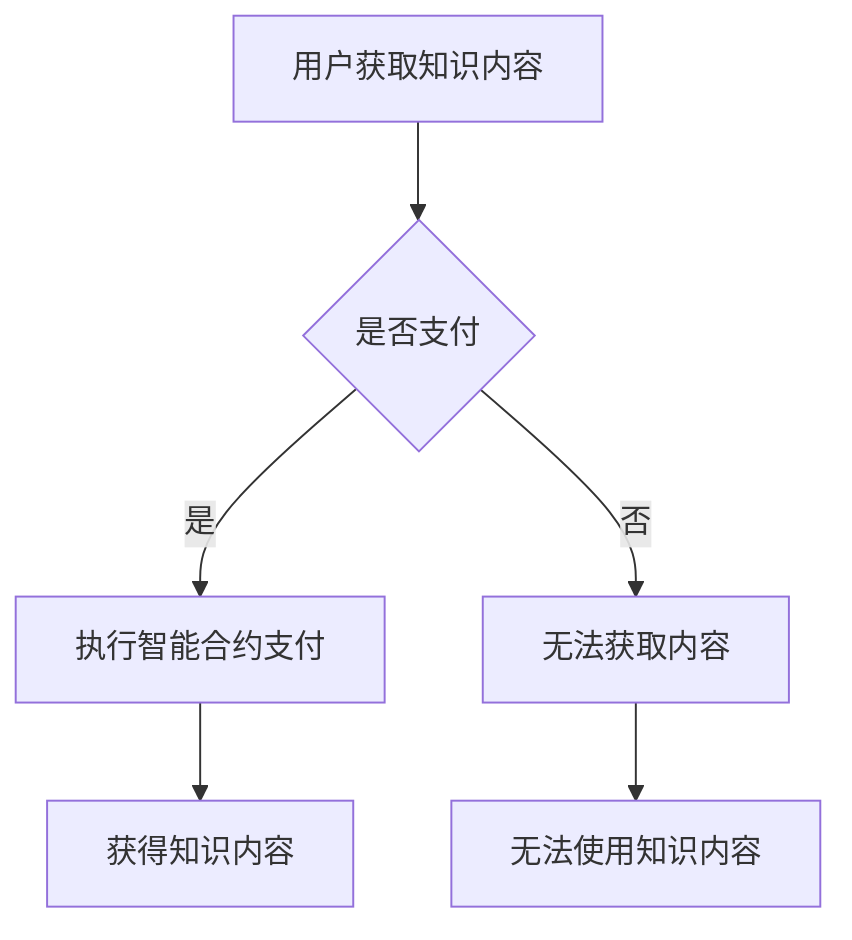

                 

 关键词：区块链、知识付费、去中心化、智能合约、透明性、安全性、创新应用

> 摘要：本文深入探讨了区块链技术在知识付费领域的创新应用。通过分析去中心化特点、智能合约机制以及区块链对知识付费业务模式的影响，阐述了区块链技术在知识付费中的独特优势。同时，本文还探讨了区块链技术在知识付费领域的实际应用案例，以及未来发展的趋势和面临的挑战。

## 1. 背景介绍

### 1.1 知识付费的兴起

知识付费作为一种商业模式，起源于人们对专业知识的渴求和互联网的普及。随着移动互联网的发展和用户消费习惯的改变，知识付费市场迅速崛起。用户通过付费获取优质的内容和服务，从而提升自身的能力和价值。

### 1.2 区块链技术的发展

区块链技术作为一种新兴的去中心化技术，其核心理念是分布式账本和共识机制。自2008年比特币问世以来，区块链技术逐渐应用于金融、物流、医疗等多个领域。区块链技术的去中心化、安全性和透明性等特点，为知识付费领域带来了新的发展机遇。

## 2. 核心概念与联系

### 2.1 去中心化

去中心化是区块链技术的重要特点，它使得信息无需通过中心服务器进行传输和验证，从而降低了交易成本，提高了系统的可靠性和透明性。

### 2.2 智能合约

智能合约是一种自动执行的合同，其条款以代码形式存储在区块链上，并在满足特定条件时自动执行。智能合约在知识付费中可以实现自动化支付、版权保护等功能，提高业务效率和用户体验。

### 2.3 区块链与知识付费的联系

区块链技术可以为知识付费提供去中心化的交易平台、透明的交易记录和不可篡改的版权证明。这些特点有助于解决知识付费领域的信任、安全性和透明性问题，为知识付费的发展提供了新的动力。

### 2.4 Mermaid 流程图



## 3. 核心算法原理 & 具体操作步骤

### 3.1 算法原理概述

区块链技术中的核心算法包括哈希算法、共识算法和智能合约执行算法。哈希算法用于生成唯一标识，共识算法用于网络中的节点达成一致，智能合约执行算法则用于自动执行合约条款。

### 3.2 算法步骤详解

1. 用户在知识平台上浏览内容，并决定是否支付。
2. 用户支付费用后，智能合约自动执行，生成交易记录并存储在区块链上。
3. 交易记录经过共识算法验证后，被永久存储在区块链上。
4. 用户获得知识内容的使用权限。

### 3.3 算法优缺点

#### 优点：

- 去中心化：降低了平台运营成本，提高了系统可靠性。
- 透明性：交易记录公开透明，用户可随时查询。
- 安全性：区块链技术保障了数据的不可篡改性。

#### 缺点：

- 性能限制：目前区块链技术处理速度有限，难以满足大规模交易的实时需求。
- 技术门槛：智能合约开发需要专业知识和技能。

### 3.4 算法应用领域

区块链技术在知识付费领域的应用主要包括：

- 付费内容交易：用户通过区块链平台购买和交换知识内容。
- 版权保护：区块链技术可以提供不可篡改的版权证明，保护内容创作者的权益。
- 智能合约支付：实现自动支付和结算，提高业务效率。

## 4. 数学模型和公式 & 详细讲解 & 举例说明

### 4.1 数学模型构建

区块链技术中的数学模型主要包括哈希函数、椭圆曲线加密和共识算法。其中，哈希函数用于生成唯一标识，椭圆曲线加密用于保障数据安全性，共识算法用于网络中的节点达成一致。

### 4.2 公式推导过程

哈希函数的公式为：\(H(x) = \text{Hash}(x)\)

椭圆曲线加密的公式为：\(E(k, P) = [k]P\)

### 4.3 案例分析与讲解

假设一个知识内容创作者发布了一篇价值100元的文章，用户支付100元后，智能合约自动执行，生成交易记录并存储在区块链上。

### 4.4 数学模型的应用

在区块链技术中，数学模型的应用主要体现在以下几个方面：

- 唯一标识生成：哈希函数用于生成交易记录的唯一标识。
- 数据加密：椭圆曲线加密用于保障交易数据的安全性。
- 共识算法：网络中的节点通过共识算法达成一致，确保交易记录的准确性。

## 5. 项目实践：代码实例和详细解释说明

### 5.1 开发环境搭建

本文使用Solidity语言编写智能合约，并使用Truffle框架进行测试和部署。开发环境搭建步骤如下：

1. 安装Node.js和npm。
2. 安装Truffle框架：npm install -g truffle。
3. 创建一个新的Truffle项目：truffle init。
4. 编写智能合约代码。

### 5.2 源代码详细实现

以下是智能合约的源代码实现：

```solidity
pragma solidity ^0.8.0;

contract KnowledgePay {
    mapping(address => bool) public purchased;

    function purchase() public payable {
        require(!purchased[msg.sender], "已经购买");
        require(msg.value >= 100, "支付金额不足");

        purchased[msg.sender] = true;
        emit Purchase(msg.sender, msg.value);
    }

    event Purchase(address buyer, uint256 amount);
}
```

### 5.3 代码解读与分析

1. 合约名称：KnowledgePay，表示知识付费智能合约。
2. mapping类型：用于存储用户是否已购买的状态。
3. purchase()函数：实现购买功能，检查用户是否已购买和支付金额是否足够。
4. emit事件：触发购买事件，记录购买信息。

### 5.4 运行结果展示

用户可以通过以太坊钱包调用purchase()函数进行支付。支付成功后，区块链上会生成相应的交易记录，用户可以查看并验证购买状态。

## 6. 实际应用场景

### 6.1 知识付费平台

知识付费平台可以利用区块链技术实现去中心化的内容交易和版权保护，提高用户体验和平台信任度。

### 6.2 教育行业

教育行业可以利用区块链技术记录学生的学习历程和成绩，实现透明、公正的教育评价体系。

### 6.3 知识共享社区

知识共享社区可以利用区块链技术保障内容创作者的权益，激励用户创作优质内容，构建可持续的知识共享生态。

## 7. 未来应用展望

### 7.1 智能合约的普及

随着智能合约技术的不断成熟，未来将有更多知识付费场景应用智能合约，实现自动化交易和支付。

### 7.2 区块链与其他技术的融合

区块链技术将与其他新兴技术（如大数据、人工智能等）相结合，为知识付费领域带来更多创新应用。

### 7.3 法律法规的完善

随着区块链技术在知识付费领域的应用，相关法律法规将逐步完善，为区块链技术的发展提供保障。

## 8. 工具和资源推荐

### 8.1 学习资源推荐

1. 《区块链：从数字货币到智能合约》
2. 《智能合约开发实战》
3. Ethereum开发文档

### 8.2 开发工具推荐

1. Truffle框架：用于智能合约开发、测试和部署。
2. Remix在线IDE：用于编写和调试Solidity智能合约。

### 8.3 相关论文推荐

1. "Blockchain Technology: A Comprehensive Review"
2. "Smart Contracts: A Foundational Review from Legal and Computer Science Perspectives"
3. "Knowledge as a Service: An Introduction to the Knowledge as a Service Paradigm and Its Role in Contemporary Societies"

## 9. 总结：未来发展趋势与挑战

### 9.1 研究成果总结

本文从知识付费和区块链技术的角度，探讨了区块链技术在知识付费领域的创新应用，分析了其优势和应用场景，并给出了相关代码实例。

### 9.2 未来发展趋势

未来，区块链技术在知识付费领域将实现更广泛的应用，智能合约和去中心化交易平台将成为主流。同时，区块链与其他技术的融合也将为知识付费带来更多创新。

### 9.3 面临的挑战

1. 技术成熟度：智能合约和区块链技术的成熟度仍需提高，以应对大规模应用的挑战。
2. 法律法规：相关法律法规的完善需要时间，以保障区块链技术的健康发展。

### 9.4 研究展望

未来，研究者应重点关注区块链技术在知识付费领域的应用场景，探索智能合约的安全性和性能优化，以及与其他技术的融合应用。

## 10. 附录：常见问题与解答

### 10.1 区块链技术有哪些优点？

区块链技术具有去中心化、安全性和透明性等优点。去中心化降低了系统的依赖性，提高了系统的可靠性；安全性保证了数据的不可篡改性；透明性使得交易记录公开可查，增强了信任度。

### 10.2 智能合约是什么？

智能合约是一种自动执行的合同，其条款以代码形式存储在区块链上。当满足特定条件时，智能合约会自动执行，从而实现自动化交易和支付。

### 10.3 区块链技术在知识付费领域的应用有哪些？

区块链技术在知识付费领域可以实现去中心化的内容交易、版权保护和智能合约支付等应用。通过区块链技术，知识付费平台可以提高用户体验和信任度，实现更高效的内容分发和版权保护。

### 10.4 如何确保区块链技术的安全性？

区块链技术的安全性主要体现在以下几个方面：

- 数据加密：区块链上的数据通过加密算法进行加密，确保数据的安全性。
- 共识机制：区块链网络中的节点通过共识机制达成一致，确保交易记录的准确性。
- 激励机制：区块链技术采用激励机制，鼓励节点参与网络维护和数据验证。

### 10.5 区块链技术的性能如何？

区块链技术的性能取决于网络规模和交易量。随着区块链技术的不断成熟和优化，其性能将逐渐提高，以满足大规模应用的需求。

### 10.6 区块链技术是否会替代传统数据库？

区块链技术与传统数据库并非替代关系，而是互补关系。区块链技术适用于去中心化、安全性和透明性要求较高的场景，而传统数据库则适用于数据存储和查询频繁的场景。

### 10.7 区块链技术是否适用于所有行业？

区块链技术适用于对去中心化、安全性和透明性有较高要求的行业，如金融、物流、医疗等。但对于数据存储和查询频繁的行业，如电商、社交媒体等，传统数据库可能更具优势。

### 10.8 如何学习区块链技术？

学习区块链技术可以从以下几个方面入手：

- 学习基础：了解区块链的基本原理、技术和应用场景。
- 学习编程：学习智能合约开发语言（如Solidity）和开发工具（如Truffle）。
- 实践项目：通过实践项目，了解区块链技术在实际应用中的问题和挑战。
- 深入研究：阅读相关论文和技术文档，深入了解区块链技术的原理和实现。

---

本文从多个角度探讨了区块链技术在知识付费领域的创新应用，分析了其优势和应用场景，并给出了相关代码实例。希望本文能为读者在区块链技术和知识付费领域的研究和应用提供有益的参考。

作者：禅与计算机程序设计艺术 / Zen and the Art of Computer Programming
----------------------------------------------------------------

