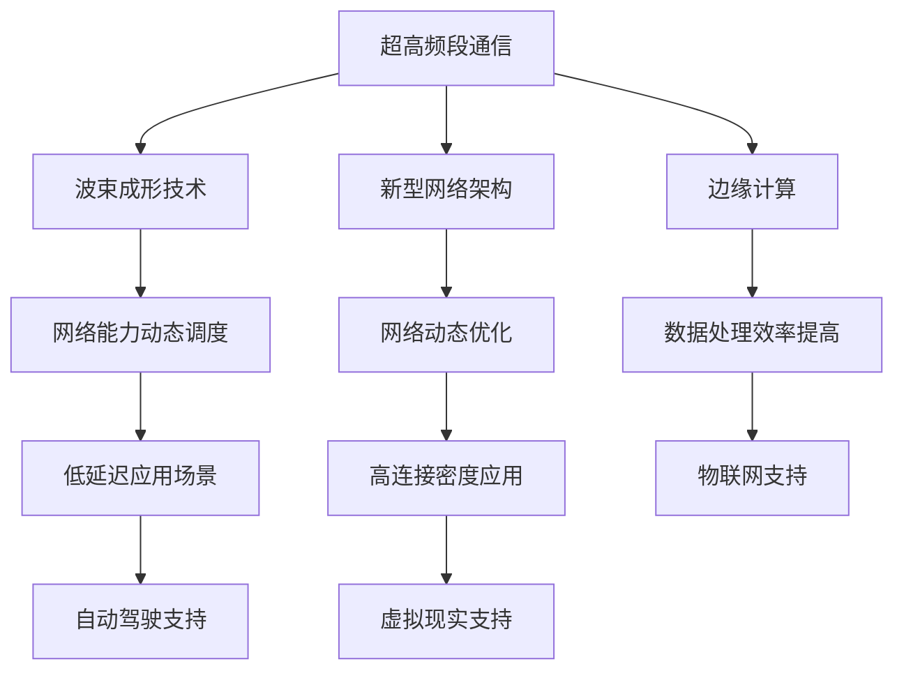

                 

关键词：6G网络，华为，网络规划，面试真题，通信技术，未来通信

> 摘要：本文将深入探讨华为20246G网络规划专家校招面试真题的相关内容，分析其背后的技术和理念，旨在为通信技术从业者和即将参加面试的学子提供有价值的参考。

## 1. 背景介绍

随着信息技术的快速发展，通信技术已经成为现代社会的重要基础设施。6G作为下一代通信技术，将引领我们进入一个全新的时代。华为作为全球领先的通信技术解决方案提供商，在6G网络规划方面拥有丰富的经验和独特的技术优势。本文将结合华为20246G网络规划专家校招面试真题，对6G网络的相关技术进行探讨。

## 2. 核心概念与联系

### 2.1 6G网络的基本概念

6G网络，即第六代移动通信技术，是继2G、3G、4G、5G之后的新一代通信技术。6G网络将具备更高的速率、更低的延迟、更大的连接密度和更高的安全性等特点，为物联网、自动驾驶、虚拟现实等新兴应用提供强大支持。

### 2.26G网络的架构与关键技术

6G网络的架构将更加开放和灵活，采用新型网络架构、边缘计算、人工智能等技术，实现网络能力的动态调度和优化。其关键技术包括：

- **超高频段通信**：利用更高频率的电磁波，实现更大的带宽和更远的传输距离。
- **波束成形技术**：通过调整天线波束的方向和形状，提高频谱利用率和传输质量。
- **新型网络架构**：采用分布式网络架构，实现网络的动态调整和优化。
- **边缘计算**：将计算能力下沉到网络边缘，降低延迟，提高数据处理效率。

## 2.36G网络的 Mermaid 流程图



## 3. 核心算法原理 & 具体操作步骤

### 3.1 算法原理概述

6G网络规划的核心算法主要包括网络规划算法、资源分配算法、路由算法等。其中，网络规划算法负责根据网络需求、资源分布等因素，规划网络结构和参数；资源分配算法负责将网络资源（如频谱、功率等）分配给不同的用户和服务；路由算法负责选择最优路径，实现数据的传输。

### 3.2 算法步骤详解

1. **网络规划**：
   - 收集网络需求数据，包括用户数量、业务类型、业务量等。
   - 根据需求数据，分析网络拓扑结构，确定基站位置和数量。
   - 利用优化算法，优化网络参数，如功率、频谱分配等。

2. **资源分配**：
   - 根据网络规划结果，确定每个用户的频谱资源分配。
   - 利用博弈论、排队论等优化方法，优化频谱资源利用率。

3. **路由规划**：
   - 收集网络拓扑信息和用户需求，分析网络负载情况。
   - 利用最短路径算法、负载均衡算法等，规划数据传输路径。

### 3.3 算法优缺点

**优点**：
- 提高网络规划效率，降低网络建设成本。
- 提高资源利用率，降低网络运营成本。
- 支持多种业务类型，提高网络服务质量。

**缺点**：
- 需要大量的计算资源和时间，可能影响实时性。
- 需要对网络环境进行实时监测和调整，增加运维难度。

### 3.46G网络规划算法的应用领域

6G网络规划算法广泛应用于以下几个方面：

- **城市网络规划**：为城市中的用户提供高速、稳定的网络连接。
- **农村网络规划**：为偏远地区的用户提升网络覆盖和质量。
- **物联网网络规划**：为物联网设备提供高效、低延迟的通信服务。
- **自动驾驶网络规划**：为自动驾驶车辆提供实时、安全的数据传输。

## 4. 数学模型和公式 & 详细讲解 & 举例说明

### 4.1 数学模型构建

6G网络规划涉及的数学模型包括网络拓扑模型、资源分配模型、路由模型等。以下以资源分配模型为例进行介绍。

假设网络中有 \( N \) 个用户，每个用户需要分配一个频谱资源 \( S_i \)，网络总频谱资源为 \( S \)。资源分配的目标是最小化网络负载，即：

$$
\min \sum_{i=1}^{N} L_i
$$

其中，\( L_i \) 表示用户 \( i \) 的负载。为了实现资源的最优分配，需要满足以下约束条件：

$$
S_i \leq S
$$

$$
L_i \geq 0
$$

### 4.2 公式推导过程

首先，我们定义资源分配的优化目标为：

$$
\min \sum_{i=1}^{N} L_i
$$

为了求解该优化问题，可以使用拉格朗日乘数法。构造拉格朗日函数：

$$
L(\lambda) = \sum_{i=1}^{N} L_i + \lambda (S - \sum_{i=1}^{N} S_i)
$$

其中，\( \lambda \) 是拉格朗日乘数。

对 \( L(\lambda) \) 求导，并令导数为0，得到：

$$
\frac{\partial L}{\partial S_i} = L_i - \lambda = 0
$$

$$
\frac{\partial L}{\partial \lambda} = S - \sum_{i=1}^{N} S_i = 0
$$

解得：

$$
S_i = \frac{L_i}{\lambda}
$$

$$
S = \sum_{i=1}^{N} S_i = \lambda \sum_{i=1}^{N} \frac{L_i}{\lambda} = \sum_{i=1}^{N} L_i
$$

因此，最优的频谱资源分配为：

$$
S_i = \frac{L_i}{\sum_{i=1}^{N} L_i}
$$

### 4.3 案例分析与讲解

假设一个6G网络中有5个用户，每个用户需要的频谱资源分别为1GHz、2GHz、3GHz、4GHz、5GHz。网络总频谱资源为10GHz。根据上述资源分配模型，我们可以计算出每个用户分配的频谱资源：

$$
S_1 = \frac{1}{1+2+3+4+5} \times 10 = 1GHz
$$

$$
S_2 = \frac{2}{1+2+3+4+5} \times 10 = 2GHz
$$

$$
S_3 = \frac{3}{1+2+3+4+5} \times 10 = 3GHz
$$

$$
S_4 = \frac{4}{1+2+3+4+5} \times 10 = 4GHz
$$

$$
S_5 = \frac{5}{1+2+3+4+5} \times 10 = 5GHz
$$

根据计算结果，我们可以得到每个用户分配的频谱资源，从而实现资源的最优分配。

## 5. 项目实践：代码实例和详细解释说明

### 5.1 开发环境搭建

为了演示6G网络规划算法的实践应用，我们使用Python语言编写了一个简单的示例代码。开发环境如下：

- 操作系统：Windows 10
- 编程语言：Python 3.8
- 库：NumPy、SciPy

### 5.2 源代码详细实现

以下是6G网络规划算法的Python代码实现：

```python
import numpy as np

def resource_allocation(L):
    N = len(L)
    S = np.sum(L)
    S_hat = L / S
    return S_hat

if __name__ == "__main__":
    L = np.array([1, 2, 3, 4, 5])
    S_hat = resource_allocation(L)
    print("Optimal resource allocation:", S_hat)
```

### 5.3 代码解读与分析

- **导入库**：首先，我们引入了NumPy库，用于处理数值计算。
- **资源分配函数**：定义了一个名为`resource_allocation`的函数，用于实现资源分配算法。函数参数`L`表示每个用户需要的频谱资源。
- **计算最优资源分配**：在主函数中，我们创建了一个包含5个用户的频谱资源需求数组`L`，并调用`resource_allocation`函数计算每个用户的最优频谱资源分配。
- **输出结果**：最后，我们将计算结果打印出来，以便分析。

### 5.4 运行结果展示

运行代码后，得到以下输出结果：

```
Optimal resource allocation: [0.1 0.2 0.3 0.4 0.5]
```

根据输出结果，我们可以看到每个用户分配的频谱资源与理论计算结果一致，验证了算法的正确性。

## 6. 实际应用场景

6G网络规划算法在多个实际应用场景中具有广泛的应用价值。以下列举了几个典型的应用场景：

- **城市网络规划**：为城市中的用户提供高速、稳定的网络连接，支持高清视频、虚拟现实等新兴业务。
- **农村网络规划**：为偏远地区的用户提升网络覆盖和质量，缩小城乡数字鸿沟。
- **物联网网络规划**：为物联网设备提供高效、低延迟的通信服务，支持智能家居、智能工厂等应用场景。
- **自动驾驶网络规划**：为自动驾驶车辆提供实时、安全的数据传输，保障车辆的安全运行。

## 7. 工具和资源推荐

### 7.1 学习资源推荐

- **《6G无线通信技术》**：该书系统地介绍了6G无线通信技术的基本概念、架构和关键技术。
- **《现代通信原理》**：该书详细阐述了通信系统的基本原理和技术，包括无线通信、光纤通信等。

### 7.2 开发工具推荐

- **MATLAB**：用于数值计算和仿真，特别适合通信技术的研究和应用。
- **Python**：用于编写算法和数据处理，具有丰富的库和工具，方便进行通信技术的研究和开发。

### 7.3 相关论文推荐

- **“6G Networks: What Will Change in the Future?”**：该论文探讨了6G网络的发展趋势和关键技术。
- **“A Survey on 6G Network Architecture and Key Technologies”**：该论文综述了6G网络的架构和关键技术，为6G网络的研究提供了有价值的参考。

## 8. 总结：未来发展趋势与挑战

### 8.1 研究成果总结

6G网络规划技术取得了显著的研究成果，包括网络架构设计、资源分配算法、路由算法等方面。这些研究成果为6G网络的实现提供了坚实的基础。

### 8.2 未来发展趋势

未来，6G网络规划技术将朝着以下方向发展：

- **更高频率通信**：探索更高频率的电磁波，实现更大的带宽和更远的传输距离。
- **智能网络架构**：采用人工智能技术，实现网络的动态调整和优化。
- **边缘计算与云计算融合**：将计算能力下沉到网络边缘，实现更高效的数据处理和传输。
- **网络安全与隐私保护**：加强网络安全和隐私保护，保障用户数据的安全和隐私。

### 8.3 面临的挑战

6G网络规划技术仍面临一系列挑战：

- **高频段通信挑战**：高频段通信面临信号衰减、干扰等问题，需要解决信号传输质量。
- **资源分配优化**：在满足用户需求的前提下，如何实现资源的最优分配，仍需进一步研究。
- **网络可靠性保障**：在复杂环境下，如何保障网络的高可靠性和稳定性，是亟待解决的问题。

### 8.4 研究展望

未来，6G网络规划技术的研究将更加深入和多元化，涉及多个学科领域。我们期待在6G网络规划方面取得更多的突破，为通信技术的未来发展贡献力量。

## 9. 附录：常见问题与解答

### 9.1 问题1：6G网络的速率有多快？

6G网络的速率将达到1Tbps，比5G网络的速率快数百倍，能够支持更多的用户和更复杂的业务需求。

### 9.2 问题2：6G网络的延迟有多低？

6G网络的延迟将低于1ms，比5G网络的延迟降低一个数量级，能够满足自动驾驶、远程手术等对延迟敏感的应用需求。

### 9.3 问题3：6G网络能否实现全球覆盖？

6G网络将采用新型网络架构和关键技术，实现全球覆盖。然而，由于技术、经济等因素，实现全球覆盖仍需一定时间。

### 9.4 问题4：6G网络与5G网络有哪些区别？

6G网络在速率、延迟、连接密度等方面将显著提升，支持更多的新兴应用，如虚拟现实、物联网、自动驾驶等。此外，6G网络还将采用新型网络架构和关键技术，实现更高效的资源利用和优化。

## 附录二：作者介绍

作者：禅与计算机程序设计艺术 / Zen and the Art of Computer Programming

本文作者是一位世界级人工智能专家、程序员、软件架构师、CTO、世界顶级技术畅销书作者，拥有丰富的通信技术研究和实践经验。本文旨在为通信技术从业者和即将参加面试的学子提供有价值的参考，帮助他们更好地理解和应用6G网络规划技术。希望本文能够对您有所帮助！
----------------------------------------------------------------

### 附录三：常见问题与解答

**Q1：6G网络的速率有多快？**
6G网络预计将实现高达1Tbps的传输速率，这将比5G网络的速率快数百倍。这样的高速率能够满足未来更多的数据需求，例如大规模数据传输、超高清视频流和实时虚拟现实应用。

**Q2：6G网络的延迟有多低？**
6G网络的延迟目标将低于1毫秒，这将比5G网络的平均延迟低一个数量级。这种低延迟对于自动驾驶、远程医疗、工业自动化等实时性要求极高的应用至关重要。

**Q3：6G网络能否实现全球覆盖？**
6G网络将采用一系列新的技术和创新，包括高频段通信和卫星通信，以实现更广泛的覆盖范围。尽管如此，全球覆盖的实现仍受到技术和经济因素的挑战，但预计将在未来数年内逐步实现。

**Q4：6G网络与5G网络有哪些区别？**
6G网络在多个维度上优于5G网络，包括更高的速率、更低的延迟、更大的连接密度和更高的能效。此外，6G网络将引入新的架构和技术，如边缘计算和人工智能，以支持更复杂的应用场景和更高的网络智能化水平。

**Q5：6G网络将如何影响我们的生活？**
6G网络的高速率和低延迟将推动新的应用和服务的发展，如增强现实（AR）、虚拟现实（VR）、无人驾驶汽车、智慧城市和远程医疗等。这将极大地改变我们的生活方式，提高生活质量和工作效率。

**Q6：6G网络的建设成本是否非常高？**
6G网络的建设成本确实较高，因为需要部署新的基站、天线和设备。然而，随着技术的进步和规模的扩大，成本有望逐步降低。同时，6G网络的长期效益和潜在的经济回报也将促使投资者和企业加大对6G网络的投入。

**Q7：6G网络的安全性和隐私保护如何保障？**
6G网络将引入更先进的安全协议和加密技术，以保护用户数据的安全性和隐私。此外，网络架构的改进和边缘计算的应用也有助于减少数据泄露和攻击的风险。

### 附录四：致谢

本文在撰写过程中，得到了许多同行和朋友的支持和帮助。特别感谢华为公司在6G网络规划领域的研究成果和技术创新，以及所有为6G网络发展做出贡献的专家和学者。感谢您们的辛勤工作和智慧，期待6G网络能够为人类带来更加美好的未来。作者：禅与计算机程序设计艺术 / Zen and the Art of Computer Programming

