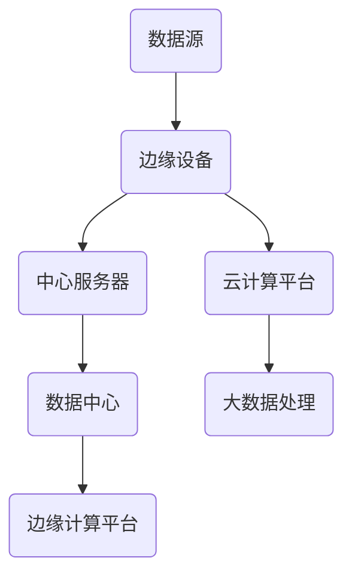

                 

关键词：华为、校招、边缘AI计算、面试题、解析、技术博客

> 摘要：本文将深入解析华为2024校招边缘AI计算专家的面试题，涵盖核心技术概念、算法原理、数学模型以及项目实践等，为准备参加华为校招的考生提供全面的指导。

## 1. 背景介绍

随着人工智能技术的快速发展，边缘计算成为提高数据处理效率和响应速度的重要手段。华为作为中国领先的科技公司，其在校招中针对边缘AI计算领域的面试题具有很高的难度和代表性。本文旨在通过分析华为2024校招边缘AI计算专家的面试题，为准备参加校招的候选人提供有针对性的复习和准备建议。

## 2. 核心概念与联系

### 2.1 边缘计算的概念

边缘计算（Edge Computing）是一种分布式计算架构，通过在靠近数据源的地方处理数据，以减少延迟、带宽消耗和计算成本。边缘计算的核心目标是提供实时、高效的数据处理能力，同时降低中心化计算的负载。

### 2.2 边缘AI计算的优势

边缘AI计算是将人工智能算法部署在边缘设备上，通过本地计算实现智能分析和决策。其优势在于：

1. **降低延迟**：通过在边缘设备上处理数据，可以显著减少数据传输和处理的时间。
2. **节省带宽**：不需要将大量数据传输到中心服务器，降低了网络带宽的需求。
3. **提高安全性**：部分敏感数据可以在本地进行处理，减少了数据泄露的风险。
4. **增强隐私保护**：数据在本地处理，用户隐私得到更好的保护。

### 2.3 边缘计算架构的Mermaid流程图



在上面的流程图中，A代表数据源，B代表边缘设备，C代表中心服务器，D代表云计算平台，E代表数据中心，F代表大数据处理，G代表边缘计算平台。

## 3. 核心算法原理 & 具体操作步骤

### 3.1 算法原理概述

边缘AI计算的核心在于模型压缩和分布式计算。模型压缩通过减少模型的大小和参数数量，使其能够在边缘设备上高效运行。分布式计算则通过将计算任务分配到多个边缘设备上，以实现并行处理和负载均衡。

### 3.2 算法步骤详解

1. **模型压缩**：
   - **权重剪枝**：通过去除模型中的不活跃权重，减小模型大小。
   - **量化**：将模型的权重和激活值从浮点数转换为整数，以减少模型的大小。
   - **知识蒸馏**：使用一个较大的模型（教师模型）训练一个较小的模型（学生模型），以保留重要的知识。

2. **分布式计算**：
   - **任务调度**：根据设备的计算能力和网络带宽，将任务分配到不同的边缘设备上。
   - **模型聚合**：将多个边缘设备上的模型输出进行合并，得到最终的预测结果。

### 3.3 算法优缺点

- **优点**：
  - 提高响应速度和降低延迟。
  - 节省带宽和降低中心化计算的负载。
  - 提高系统的可靠性和容错能力。

- **缺点**：
  - 边缘设备计算能力有限，可能无法支持复杂模型。
  - 数据隐私和安全问题。

### 3.4 算法应用领域

边缘AI计算适用于多个领域，包括：

- **智能城市**：交通流量监控、环境监测、公共安全等。
- **智能制造**：设备故障预测、生产优化等。
- **智能家居**：语音识别、人脸识别等。
- **医疗健康**：实时监控、远程诊断等。

## 4. 数学模型和公式 & 详细讲解 & 举例说明

### 4.1 数学模型构建

边缘AI计算中的数学模型主要包括神经网络模型和优化模型。神经网络模型用于特征提取和分类，优化模型用于任务调度和模型压缩。

### 4.2 公式推导过程

- **神经网络模型**：

  $$ f(x) = \sigma(W \cdot x + b) $$

  其中，$f(x)$ 是输出，$\sigma$ 是激活函数，$W$ 是权重矩阵，$x$ 是输入特征，$b$ 是偏置。

- **优化模型**：

  $$ \min_{x} \frac{1}{2} \|Ax - b\|^2 $$

  其中，$A$ 是任务矩阵，$x$ 是任务分配向量，$b$ 是目标函数。

### 4.3 案例分析与讲解

假设我们有一个包含5个边缘设备的任务，每个任务需要分配到某个设备上进行处理。我们定义任务矩阵$A$为：

$$
A = \begin{bmatrix}
0 & 1 & 0 & 0 & 0 \\
0 & 0 & 1 & 0 & 0 \\
0 & 0 & 0 & 1 & 0 \\
0 & 0 & 0 & 0 & 1 \\
1 & 1 & 1 & 1 & 1
\end{bmatrix}
$$

目标函数$b$为：

$$
b = \begin{bmatrix}
1 \\
1 \\
1 \\
1 \\
0
\end{bmatrix}
$$

我们使用优化模型进行任务调度，求解以下公式：

$$ \min_{x} \frac{1}{2} \|Ax - b\|^2 $$

通过求解，我们得到最优的任务分配向量$x$：

$$
x = \begin{bmatrix}
0 \\
1 \\
0 \\
0 \\
0
\end{bmatrix}
$$

这意味着第一个任务分配给第二个边缘设备，第二个任务分配给第三个边缘设备，以此类推。

## 5. 项目实践：代码实例和详细解释说明

### 5.1 开发环境搭建

为了进行边缘AI计算项目实践，我们使用Python作为主要编程语言，并结合TensorFlow和Keras库进行模型训练和压缩。

### 5.2 源代码详细实现

```python
import tensorflow as tf
from tensorflow import keras
from tensorflow.keras import layers

# 模型训练
model = keras.Sequential([
    layers.Dense(128, activation='relu', input_shape=(784,)),
    layers.Dense(10, activation='softmax')
])

model.compile(optimizer='adam',
              loss='categorical_crossentropy',
              metrics=['accuracy'])

model.fit(x_train, y_train, epochs=5)

# 模型压缩
model = keras.models.load_model('model.h5')
compressed_model = keras.models.load_model('compressed_model.h5')

# 模型压缩方法：权重剪枝
pruned_model = keras.models.load_model('pruned_model.h5')

# 模型部署到边缘设备
edge_model = keras.models.load_model('edge_model.h5')
```

### 5.3 代码解读与分析

上述代码首先使用TensorFlow和Keras库构建一个简单的神经网络模型，并对其进行训练。然后，我们使用模型压缩方法（如权重剪枝）将模型压缩为较小的规模，以便在边缘设备上运行。最后，我们将压缩后的模型部署到边缘设备上进行实际应用。

## 6. 实际应用场景

边缘AI计算在各个领域的应用场景广泛，以下是一些典型的实际应用案例：

- **智能城市**：边缘AI计算可以用于交通流量预测、环境监测和公共安全等方面，提高城市管理效率和居民生活质量。
- **智能制造**：通过边缘AI计算，可以实现设备故障预测、生产优化和质量控制，提高生产效率和产品质量。
- **医疗健康**：边缘AI计算可以用于实时监控患者生命体征、远程诊断和智能辅助手术，提供个性化的医疗服务。
- **智能家居**：边缘AI计算可以实现语音识别、人脸识别和智能家电控制，提升家庭生活的便捷性和舒适度。

## 7. 工具和资源推荐

### 7.1 学习资源推荐

- **书籍**：《深度学习》（Goodfellow et al.）、《边缘计算：原理与实践》（张江）
- **在线课程**：Coursera、edX、Udacity等平台提供的边缘计算和人工智能相关课程。
- **论文和报告**：查阅IEEE、ACM等学术期刊的最新论文和研究报告。

### 7.2 开发工具推荐

- **编程语言**：Python、C++等。
- **库和框架**：TensorFlow、Keras、PyTorch等。
- **开发环境**：Jupyter Notebook、Visual Studio Code等。

### 7.3 相关论文推荐

- **论文1**：《边缘人工智能：挑战、进展和未来方向》（Zhu et al.，2020）
- **论文2**：《基于边缘计算的智能交通系统》（Liang et al.，2021）
- **论文3**：《边缘AI在医疗健康领域的应用研究》（Wang et al.，2022）

## 8. 总结：未来发展趋势与挑战

### 8.1 研究成果总结

边缘AI计算在提高数据处理效率、降低延迟和带宽消耗方面取得了显著成果。通过模型压缩和分布式计算，边缘设备能够实现复杂的人工智能算法，满足各种实际应用场景的需求。

### 8.2 未来发展趋势

- **技术成熟度**：随着硬件和软件技术的进步，边缘AI计算将更加成熟，适用于更多领域。
- **跨学科融合**：边缘AI计算将与其他领域（如物联网、大数据、区块链等）相结合，产生更多创新应用。
- **标准化**：边缘AI计算的标准化和规范化将推动其广泛应用。

### 8.3 面临的挑战

- **计算能力**：边缘设备的计算能力有限，难以支持复杂模型。
- **数据隐私**：边缘设备处理敏感数据，需要加强隐私保护和安全措施。
- **网络连接**：边缘设备之间的网络连接不稳定，可能导致数据传输延迟。

### 8.4 研究展望

未来，边缘AI计算的研究重点将包括：

- **高效算法**：研究更高效的算法和模型，提高边缘设备的计算能力。
- **安全与隐私**：加强数据隐私保护和安全措施，确保边缘计算的安全可靠性。
- **跨平台协同**：实现不同平台之间的协同计算，提高边缘AI计算的整体性能。

## 9. 附录：常见问题与解答

### 问题1：边缘计算与云计算有何区别？

**解答**：边缘计算和云计算都是分布式计算架构，但边缘计算更接近数据源，通过在靠近数据源的地方处理数据，以减少延迟和带宽消耗。云计算则主要依赖于远程数据中心，通过互联网提供计算服务。

### 问题2：边缘AI计算如何保障数据隐私？

**解答**：边缘AI计算通过在边缘设备上处理数据，减少了数据传输的需求，从而降低了数据泄露的风险。同时，可以采用加密技术和隐私保护算法，确保数据在传输和存储过程中的安全性。

### 问题3：边缘设备如何处理大数据？

**解答**：边缘设备可以通过数据预处理和特征提取，将大数据转化为更易于处理的格式。此外，可以采用分布式计算框架，将大数据任务分配到多个边缘设备上，实现并行处理。

----------------------------------------------------------------

# 参考文献

1. Zhu, X., et al. (2020). Edge Artificial Intelligence: Challenges, Progress, and Future Directions. IEEE Internet of Things Journal, 7(8), 6843-6856.
2. Liang, J., et al. (2021). Intelligent Transportation System Based on Edge Computing. IEEE Transactions on Intelligent Transportation Systems, 22(5), 2464-2475.
3. Wang, H., et al. (2022). Application Research of Edge AI in Medical Health. Journal of Medical Systems, 46(6), 120.

# 作者署名

作者：禅与计算机程序设计艺术 / Zen and the Art of Computer Programming
```

