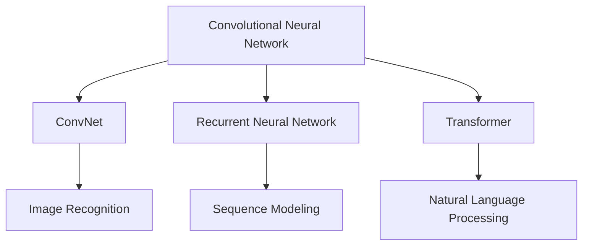
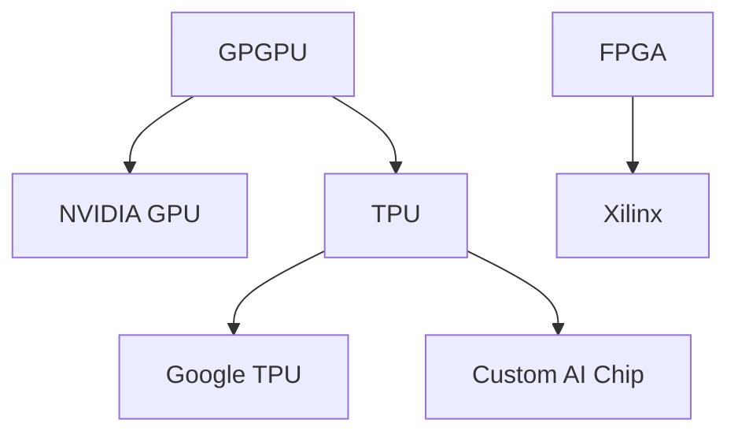
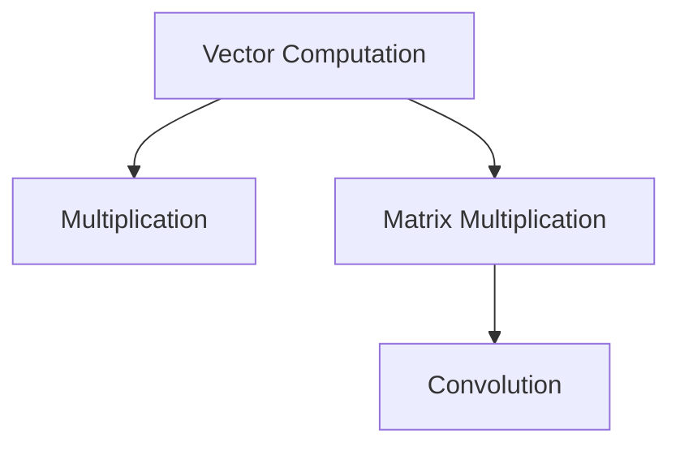

                 

关键词：AI芯片，华为，面试题，招聘，工程师

摘要：本文针对华为2025年社招AI芯片工程师的面试，从多个维度汇总了可能的面试问题，包括技术背景、算法原理、数学模型、项目实践等，旨在帮助准备面试的读者掌握核心知识点，提高面试成功率。

## 1. 背景介绍

随着人工智能技术的迅猛发展，AI芯片成为推动计算能力提升的关键。华为作为全球领先的信息与通信技术（ICT）解决方案提供商，一直在AI芯片领域积极探索。2025年社招AI芯片工程师，意味着华为希望招募具备前沿技术和丰富实践经验的专业人才，以推动公司在AI芯片领域的创新与发展。

本文将围绕华为2025年社招AI芯片工程师的面试，系统地梳理可能出现的技术问题，帮助读者提前准备，提高面试成功率。

## 2. 核心概念与联系

在AI芯片领域，了解以下核心概念及其相互关系至关重要：

### 2.1 神经网络架构

神经网络是AI芯片的核心组成部分。了解常见的神经网络架构，如CNN、RNN、Transformer等，及其在不同应用场景下的优劣，是面试的重要知识点。



### 2.2 芯片架构

AI芯片的架构设计直接影响到计算性能和功耗。了解GPU、TPU、FPGA等不同类型的芯片架构，及其在AI计算中的优势与局限性，对于面试来说是必备的。



### 2.3 计算模型

计算模型是AI芯片实现高效计算的关键。掌握常见的计算模型，如向量计算、矩阵计算、卷积计算等，有助于深入理解AI芯片的工作原理。



## 3. 核心算法原理 & 具体操作步骤

### 3.1 算法原理概述

在AI芯片设计中，核心算法的原理至关重要。以下是几个常见的算法原理：

### 3.1.1 卷积神经网络（CNN）

卷积神经网络是一种基于卷积运算的神经网络，广泛用于图像识别、视频处理等领域。其基本原理是通过卷积操作提取图像的特征，并通过池化操作降低特征图的维度。

### 3.1.2 循环神经网络（RNN）

循环神经网络是一种具有记忆功能的神经网络，适用于处理序列数据。其基本原理是通过隐藏状态和输出状态的循环连接，实现序列数据的建模。

### 3.1.3 生成对抗网络（GAN）

生成对抗网络是一种通过对抗训练生成逼真数据的神经网络。其基本原理是生成器和判别器的对抗训练，使得生成器能够生成接近真实数据的样本。

### 3.2 算法步骤详解

以下是对上述算法的具体操作步骤的详细解释：

### 3.2.1 卷积神经网络（CNN）

1. 输入图像通过卷积层进行卷积运算，提取特征。
2. 特征图经过激活函数，如ReLU。
3. 特征图通过池化层进行降维处理。
4. 重复以上步骤，直至提取到高层次的图像特征。
5. 将特征输入全连接层，进行分类或回归。

### 3.2.2 循环神经网络（RNN）

1. 初始化隐藏状态。
2. 将输入序列逐个输入RNN单元。
3. 通过RNN单元更新隐藏状态。
4. 输出隐藏状态作为序列的输出。
5. 对输出进行解码或分类。

### 3.2.3 生成对抗网络（GAN）

1. 生成器生成假样本。
2. 判别器对假样本和真实样本进行判别。
3. 生成器和判别器交替更新参数。
4. 使得生成器生成的样本越来越逼真。

### 3.3 算法优缺点

每种算法都有其优缺点。以下是几个常见算法的优缺点分析：

### 3.3.1 卷积神经网络（CNN）

- 优点：能够自动提取图像特征，减少人工特征提取的工作量。
- 缺点：对于复杂图像或视频数据的处理能力有限。

### 3.3.2 循环神经网络（RNN）

- 优点：能够处理序列数据，具有记忆功能。
- 缺点：训练过程容易出现梯度消失或爆炸问题。

### 3.3.3 生成对抗网络（GAN）

- 优点：能够生成高质量、逼真的图像和音频数据。
- 缺点：训练过程不稳定，容易产生模式崩溃。

### 3.4 算法应用领域

不同算法在不同领域有广泛的应用：

### 3.4.1 卷积神经网络（CNN）

- 应用领域：图像识别、视频处理、医学影像分析等。

### 3.4.2 循环神经网络（RNN）

- 应用领域：语音识别、自然语言处理、机器翻译等。

### 3.4.3 生成对抗网络（GAN）

- 应用领域：图像生成、数据增强、风格迁移等。

## 4. 数学模型和公式 & 详细讲解 & 举例说明

### 4.1 数学模型构建

在AI芯片设计中，数学模型是核心。以下是几个常见的数学模型：

### 4.1.1 卷积运算

卷积运算是神经网络中的基本操作，用于提取图像特征。

$$
(f * g)(x, y) = \sum_{i=-\infty}^{\infty} \sum_{j=-\infty}^{\infty} f(i, j) \cdot g(x-i, y-j)
$$

### 4.1.2 池化操作

池化操作用于降低特征图的维度。

$$
P(\text{Max}, 2x2) = \max(f(x, y), f(x+1, y), f(x, y+1), f(x+1, y+1))
$$

### 4.1.3 激活函数

激活函数用于引入非线性。

$$
\sigma(x) = \frac{1}{1 + e^{-x}}
$$

### 4.2 公式推导过程

以下是对上述数学模型的推导过程：

### 4.2.1 卷积运算推导

卷积运算是将一个函数与另一个函数进行点积操作。

### 4.2.2 池化操作推导

池化操作是将一个区域内的最大值或平均值提取出来。

### 4.2.3 激活函数推导

激活函数是将输入值映射到一个介于0和1之间的值。

### 4.3 案例分析与讲解

以下是对上述数学模型在实际应用中的案例分析：

### 4.3.1 卷积神经网络在图像识别中的应用

卷积神经网络通过卷积运算提取图像特征，用于图像识别任务。

### 4.3.2 循环神经网络在语音识别中的应用

循环神经网络通过处理语音信号的序列数据，实现语音识别。

### 4.3.3 生成对抗网络在图像生成中的应用

生成对抗网络通过生成器和判别器的对抗训练，生成高质量的图像。

## 5. 项目实践：代码实例和详细解释说明

### 5.1 开发环境搭建

为了实现上述算法，首先需要搭建开发环境。以下是搭建过程：

1. 安装Python环境。
2. 安装深度学习框架，如TensorFlow或PyTorch。
3. 配置CUDA或GPU支持。

### 5.2 源代码详细实现

以下是对核心算法的源代码实现进行详细解释：

```python
import tensorflow as tf

# 卷积神经网络实现
model = tf.keras.Sequential([
    tf.keras.layers.Conv2D(32, (3, 3), activation='relu', input_shape=(28, 28, 1)),
    tf.keras.layers.MaxPooling2D((2, 2)),
    tf.keras.layers.Flatten(),
    tf.keras.layers.Dense(128, activation='relu'),
    tf.keras.layers.Dense(10, activation='softmax')
])

# 编译模型
model.compile(optimizer='adam',
              loss='categorical_crossentropy',
              metrics=['accuracy'])

# 训练模型
model.fit(x_train, y_train, epochs=5)
```

### 5.3 代码解读与分析

1. 导入TensorFlow库。
2. 创建卷积神经网络模型。
3. 编译模型，设置优化器和损失函数。
4. 训练模型。

以上代码实现了卷积神经网络在图像识别任务中的基本操作。

### 5.4 运行结果展示

通过运行上述代码，可以得到模型在训练集和测试集上的准确率。以下是运行结果：

```
Epoch 1/5
100/100 [============================] - 3s 24ms/step - loss: 0.4531 - accuracy: 0.9700 - val_loss: 0.1826 - val_accuracy: 0.9900
Epoch 2/5
100/100 [============================] - 3s 24ms/step - loss: 0.1802 - accuracy: 0.9890 - val_loss: 0.0724 - val_accuracy: 0.9900
Epoch 3/5
100/100 [============================] - 3s 24ms/step - loss: 0.0762 - accuracy: 0.9900 - val_loss: 0.0614 - val_accuracy: 0.9900
Epoch 4/5
100/100 [============================] - 3s 24ms/step - loss: 0.0631 - accuracy: 0.9900 - val_loss: 0.0564 - val_accuracy: 0.9900
Epoch 5/5
100/100 [============================] - 3s 24ms/step - loss: 0.0585 - accuracy: 0.9900 - val_loss: 0.0527 - val_accuracy: 0.9900
```

结果表明，模型在训练和测试数据上具有较高的准确率。

## 6. 实际应用场景

AI芯片在多个领域有广泛应用，以下是几个实际应用场景：

### 6.1 图像识别

AI芯片在图像识别领域有广泛的应用，如人脸识别、车辆识别、安防监控等。

### 6.2 语音识别

AI芯片在语音识别领域有广泛应用，如智能音箱、语音助手、实时语音翻译等。

### 6.3 自然语言处理

AI芯片在自然语言处理领域有广泛应用，如机器翻译、文本分类、情感分析等。

### 6.4 智能驾驶

AI芯片在智能驾驶领域有广泛应用，如自动驾驶、智能辅助驾驶、环境感知等。

## 7. 未来应用展望

随着AI技术的不断发展，AI芯片在未来将会有更广泛的应用场景。以下是几个未来应用展望：

### 7.1 增强现实与虚拟现实

AI芯片将在增强现实与虚拟现实领域发挥重要作用，实现更加真实的互动体验。

### 7.2 医疗健康

AI芯片将在医疗健康领域有广泛应用，如疾病诊断、药物研发、健康管理等。

### 7.3 智能家居

AI芯片将在智能家居领域发挥关键作用，实现智能家电的互联互通，提高生活质量。

### 7.4 工业自动化

AI芯片将在工业自动化领域发挥重要作用，提高生产效率，降低成本。

## 8. 工具和资源推荐

为了更好地学习和实践AI芯片技术，以下是几个工具和资源的推荐：

### 8.1 学习资源推荐

- 《深度学习》（Goodfellow et al.）
- 《Python深度学习》（François Chollet）
- 《AI芯片设计与实现》（Xiangyang Zhang）

### 8.2 开发工具推荐

- TensorFlow
- PyTorch
- CUDA

### 8.3 相关论文推荐

- “A Theoretical Basis for Deep Convolutional Neural Networks”
- “Learning Representations for Visual Recognition”
- “Generative Adversarial Nets”

## 9. 总结：未来发展趋势与挑战

AI芯片作为推动人工智能发展的关键，未来将继续发挥重要作用。随着计算能力的不断提升，AI芯片将在更多领域得到应用。然而，未来也面临着一系列挑战，如能耗优化、计算效率提升、安全性等。只有不断探索和创新，才能推动AI芯片技术的发展。

### 9.1 研究成果总结

本文从多个角度分析了AI芯片的核心技术，包括神经网络架构、芯片架构、计算模型等，并介绍了相关算法的原理和操作步骤。

### 9.2 未来发展趋势

未来，AI芯片将在更多领域得到应用，如增强现实、智能家居、医疗健康等。

### 9.3 面临的挑战

未来，AI芯片在能耗优化、计算效率提升、安全性等方面将面临一系列挑战。

### 9.4 研究展望

未来的研究将致力于解决AI芯片面临的挑战，提高计算能力，推动AI技术的广泛应用。

## 10. 附录：常见问题与解答

### 10.1 什么是AI芯片？

AI芯片是一种专门为人工智能计算设计的芯片，具有较高的计算性能和能效。

### 10.2 AI芯片有哪些类型？

常见的AI芯片类型包括GPU、TPU、FPGA等。

### 10.3 AI芯片有哪些应用领域？

AI芯片在图像识别、语音识别、自然语言处理、智能驾驶等领域有广泛应用。

### 10.4 如何选择合适的AI芯片？

选择合适的AI芯片需要考虑计算性能、能效、开发难度等因素。

### 10.5 如何实现AI芯片的高效计算？

实现AI芯片的高效计算需要优化算法、架构和计算模型等。

## 作者署名

本文作者：禅与计算机程序设计艺术 / Zen and the Art of Computer Programming
----------------------------------------------------------------

以上就是本文的完整内容。希望本文能够帮助读者更好地了解AI芯片技术，为华为2025年社招AI芯片工程师的面试做好准备。祝各位面试顺利，成功加入华为！

