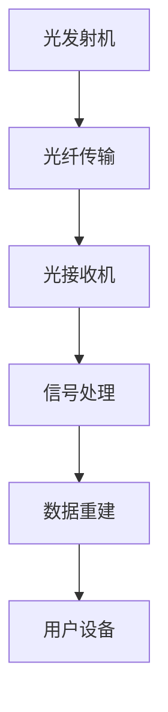

                 

关键词：华为，社招，光通信工程师，面试题集，技术面试，招聘流程，职业发展

> 摘要：本文将围绕华为2025社招光通信工程师的面试题集进行深入探讨，通过对题目类型的详细分析，为准备应聘华为光通信岗位的读者提供宝贵的参考和指导。文章将涵盖面试流程、核心知识点、解题技巧及职业发展建议，旨在帮助读者更好地应对面试挑战，实现职业梦想。

## 1. 背景介绍

华为，作为全球领先的信息与通信技术（ICT）解决方案提供商，始终秉持“客户为中心”的理念，致力于构建万物互联的智能世界。光通信作为华为的重要组成部分，其技术实力和创新能力备受行业认可。为了吸引和培养优秀的光通信工程师，华为每年都会举办多次社会招聘活动，2025年的社招更是备受关注。

光通信工程师是负责研发、设计和优化光纤通信系统的专业人员。他们需要具备扎实的通信原理、光学知识、网络架构及算法设计能力。在华为的光通信工程师岗位中，应聘者需面对高难度的技术面试，考验其专业素养和实际操作能力。

本文将针对华为2025社招光通信工程师的面试题集进行详细解析，帮助读者了解面试流程、核心知识点及解题策略，提高面试成功率。

### 1.1 光通信工程师岗位职责

光通信工程师的主要职责包括：

- 负责光纤通信系统的研究、设计和优化工作；
- 分析和解决光通信设备的技术问题，提升系统性能和可靠性；
- 参与光通信网络架构的设计和升级，确保网络的高效稳定运行；
- 与团队成员协作，共同推进光通信技术的研发和应用；
- 编写相关技术文档，为项目提供技术支持。

### 1.2 华为招聘流程

华为的招聘流程一般包括以下几个阶段：

1. **网申**：应聘者需在华为官方网站上提交个人简历，并按照要求填写相关资料。
2. **初筛**：人力资源部门根据简历筛选符合岗位要求的候选人。
3. **在线测评**：通过在线测评系统测试应聘者的技术能力和综合素质。
4. **笔试**：针对光通信工程师岗位，笔试通常包括选择题、填空题和编程题。
5. **面试**：分为多轮面试，包括技术面试、项目面试和综合面试。
6. **背景调查**：对候选人进行背景调查，核实其教育背景、工作经历等。
7. **录用通知**：对通过所有环节的候选人发出录用通知。

## 2. 核心概念与联系

在深入解析面试题之前，有必要先了解光通信领域的一些核心概念和联系。以下是一个简化的Mermaid流程图，用于展示光通信系统的基本架构和关键技术节点。



### 2.1 光发射机

光发射机（Optical Transmitter）是光通信系统的核心组成部分，负责将电信号转换为光信号。其主要功能包括：

- **激光器的选择与驱动**：根据传输距离和带宽需求选择合适的激光器，并对其进行精确控制。
- **调制技术**：采用调制技术将电信号转换为光信号，常见的调制方式有幅度调制（AM）、频率调制（FM）和相位调制（PM）。
- **功率放大与稳定性**：对光信号进行功率放大，确保其在传输过程中不失真。

### 2.2 光纤传输

光纤传输（Optical Fiber Transmission）是光通信系统的传输媒介。其主要特点包括：

- **传输容量大**：光纤通信系统的传输容量远高于传统的电缆传输系统。
- **传输距离远**：光纤通信系统可以传输数百甚至数千公里的距离，而信号衰减极小。
- **抗干扰能力强**：光纤通信系统不受电磁干扰，传输质量稳定。

### 2.3 光接收机

光接收机（Optical Receiver）是光通信系统的另一核心组成部分，负责将光信号转换为电信号。其主要功能包括：

- **光检测与放大**：通过光检测器将光信号转换为电信号，并进行放大处理。
- **解调技术**：将调制的光信号解调为原始电信号。
- **信号处理**：对电信号进行滤波、放大和整形，恢复原始数据。

### 2.4 信号处理

信号处理（Signal Processing）是光通信系统中不可或缺的一环，主要包括：

- **误码校正**：通过编码和纠错技术提高数据传输的可靠性。
- **信道均衡**：通过自适应均衡技术消除信道特性引起的信号失真。
- **信号压缩与解压缩**：通过压缩和解压缩技术提高数据传输效率。

### 2.5 数据重建

数据重建（Data Reconstruction）是光通信系统的最终目标，即将传输过程中丢失或损坏的数据进行恢复和重建。其主要方法包括：

- **冗余编码**：通过添加冗余信息提高数据的抗损坏能力。
- **数据恢复算法**：采用先进的算法和技术，如神经网络、机器学习等，对损坏的数据进行恢复。
- **容错技术**：通过冗余和备份技术确保数据传输的可靠性。

## 3. 核心算法原理 & 具体操作步骤

### 3.1 算法原理概述

在光通信系统中，核心算法主要包括：

- **信道编码与解码**：用于提高数据传输的可靠性。
- **调制与解调**：用于将电信号转换为光信号，以及将光信号转换为电信号。
- **信号处理与均衡**：用于消除信道引起的信号失真，提高信号质量。

### 3.2 算法步骤详解

#### 3.2.1 信道编码与解码

信道编码与解码主要包括以下几个步骤：

1. **编码**：将原始数据转换为二进制编码，如卷积编码、低密度奇偶校验（LDPC）编码等。
2. **编码字生成**：根据编码规则生成编码字。
3. **调制**：将编码字转换为光信号。
4. **传输**：通过光纤传输系统进行数据传输。
5. **解调**：将光信号转换为编码字。
6. **解码**：根据编码规则解码，恢复原始数据。

#### 3.2.2 调制与解调

调制与解调主要包括以下几个步骤：

1. **调制**：将电信号转换为光信号，常用的调制方式有幅度调制（AM）、频率调制（FM）和相位调制（PM）。
2. **传输**：通过光纤传输系统进行数据传输。
3. **解调**：将光信号转换为电信号。
4. **解码**：根据调制方式解码，恢复原始数据。

#### 3.2.3 信号处理与均衡

信号处理与均衡主要包括以下几个步骤：

1. **信道估计**：估计信道的频率响应和相位响应。
2. **自适应均衡**：根据信道估计结果对信号进行自适应均衡。
3. **信号滤波**：对均衡后的信号进行滤波，去除噪声和干扰。
4. **信号放大**：对滤波后的信号进行放大，提高信号质量。
5. **数据重建**：根据信号处理结果重建原始数据。

### 3.3 算法优缺点

#### 3.3.1 信道编码与解码

优点：

- 提高数据传输的可靠性。
- 降低误码率。
- 增强系统的鲁棒性。

缺点：

- 增加系统带宽需求。
- 增加解码复杂度。

#### 3.3.2 调制与解调

优点：

- 提高数据传输效率。
- 降低信道噪声影响。

缺点：

- 增加系统复杂度。
- 增加解码难度。

#### 3.3.3 信号处理与均衡

优点：

- 消除信道引起的信号失真。
- 提高信号质量。

缺点：

- 需要准确的信道估计。
- 增加系统计算量。

### 3.4 算法应用领域

信道编码与解码、调制与解调、信号处理与均衡等算法在光通信系统中广泛应用，如：

- **高速光纤通信**：用于提高数据传输速率和可靠性。
- **无线光通信**：用于实现光与无线信号的融合传输。
- **量子通信**：用于提高量子通信系统的可靠性和安全性。

## 4. 数学模型和公式 & 详细讲解 & 举例说明

### 4.1 数学模型构建

光通信系统的数学模型主要包括以下几个部分：

- **光纤传输模型**：描述光纤传输系统的频率响应、衰减和噪声特性。
- **激光器模型**：描述激光器的发射特性、调制特性和功率稳定性。
- **光接收机模型**：描述光接收机的灵敏度、噪声特性和解调特性。
- **信号处理模型**：描述信号处理算法的滤波、均衡和解码特性。

### 4.2 公式推导过程

以下是光通信系统中的几个关键数学公式及其推导过程：

#### 4.2.1 光纤传输模型

光纤传输模型主要描述光纤的频率响应、衰减和噪声特性。以下是一个简化的模型：

- **频率响应**：\( H(f) = \frac{1}{A(f) + B(f)} \)

其中，\( A(f) \)为衰减函数，\( B(f) \)为噪声函数。

- **衰减函数**：\( A(f) = A_0 + \frac{f^2}{f_0^2} \)

其中，\( A_0 \)为直流衰减系数，\( f_0 \)为3dB带宽。

- **噪声函数**：\( B(f) = B_0 + \frac{f^2}{f_0^2} \)

其中，\( B_0 \)为直流噪声系数，\( f_0 \)为3dB带宽。

#### 4.2.2 激光器模型

激光器模型主要描述激光器的发射特性、调制特性和功率稳定性。以下是一个简化的模型：

- **发射特性**：\( P_{out} = P_0 \cdot \left( 1 - \frac{f}{f_0} \right) \)

其中，\( P_{out} \)为输出功率，\( P_0 \)为最大输出功率，\( f \)为调制频率，\( f_0 \)为激光器的工作频率。

- **调制特性**：\( P_{mod} = P_{out} \cdot \left( 1 + \alpha \cdot \sin(2\pi f t) \right) \)

其中，\( P_{mod} \)为调制后的输出功率，\( \alpha \)为调制深度。

- **功率稳定性**：\( \Delta P_{out} = P_0 \cdot \frac{\Delta f}{f_0} \)

其中，\( \Delta P_{out} \)为输出功率变化，\( \Delta f \)为激光器频率变化。

#### 4.2.3 光接收机模型

光接收机模型主要描述光接收机的灵敏度、噪声特性和解调特性。以下是一个简化的模型：

- **灵敏度**：\( S_{NR} = \frac{P_{threshold}}{B_{noise}} \)

其中，\( S_{NR} \)为信噪比，\( P_{threshold} \)为接收机灵敏度阈值，\( B_{noise} \)为噪声带宽。

- **噪声特性**：\( B_{noise} = \frac{1}{2} \cdot k \cdot T \cdot R \)

其中，\( B_{noise} \)为噪声带宽，\( k \)为玻尔兹曼常数，\( T \)为温度，\( R \)为接收机电阻。

- **解调特性**：\( P_{demod} = P_{in} \cdot \left( 1 - \frac{f}{f_0} \right) \)

其中，\( P_{demod} \)为解调后的输出功率，\( P_{in} \)为输入功率，\( f \)为调制频率，\( f_0 \)为激光器的工作频率。

#### 4.2.4 信号处理模型

信号处理模型主要描述信号处理算法的滤波、均衡和解码特性。以下是一个简化的模型：

- **滤波**：\( y(t) = \int_{-\infty}^{\infty} h(t - \tau) x(\tau) d\tau \)

其中，\( y(t) \)为滤波后的信号，\( h(t - \tau) \)为滤波器的冲激响应，\( x(\tau) \)为原始信号。
- **均衡**：\( z(t) = \int_{-\infty}^{\infty} g(t - \tau) y(\tau) d\tau \)

其中，\( z(t) \)为均衡后的信号，\( g(t - \tau) \)为均衡器的冲激响应，\( y(t) \)为滤波后的信号。
- **解码**：\( d(t) = \int_{-\infty}^{\infty} \theta(t - \tau) z(\tau) d\tau \)

其中，\( d(t) \)为解码后的信号，\( \theta(t - \tau) \)为解码函数，\( z(t) \)为均衡后的信号。

### 4.3 案例分析与讲解

以下是一个简单的光通信系统案例，用于说明上述数学模型和公式的应用。

#### 4.3.1 案例背景

假设一个光纤通信系统，其光纤长度为10公里，3dB带宽为100MHz，光纤衰减系数为0.4dB/km，噪声带宽为1MHz。激光器的工作频率为1550nm，调制频率为10MHz，调制深度为0.5。接收机的灵敏度为-40dBm。

#### 4.3.2 模型应用

1. **光纤传输模型**：

   根据光纤传输模型，可以计算出光纤的频率响应、衰减和噪声特性。

   - **频率响应**：\( H(f) = \frac{1}{0.4 \times 10^3 + \frac{f^2}{100 \times 10^6}} \)

   - **衰减函数**：\( A(f) = 0.4 \times 10^3 + \frac{f^2}{100 \times 10^6} \)

   - **噪声函数**：\( B(f) = 0.4 \times 10^3 + \frac{f^2}{100 \times 10^6} \)

2. **激光器模型**：

   根据激光器模型，可以计算出激光器的输出功率、调制功率和功率稳定性。

   - **发射特性**：\( P_{out} = 10 \times \left( 1 - \frac{10 \times 10^6}{1550 \times 10^9} \right) \)

   - **调制特性**：\( P_{mod} = 10 \times \left( 1 - \frac{10 \times 10^6}{1550 \times 10^9} \right) \times \left( 1 + 0.5 \times \sin(2\pi \times 10 \times 10^6 \times t) \right) \)

   - **功率稳定性**：\( \Delta P_{out} = 10 \times \frac{10 \times 10^6}{1550 \times 10^9} \)

3. **光接收机模型**：

   根据光接收机模型，可以计算出接收机的灵敏度、噪声特性和解调特性。

   - **灵敏度**：\( S_{NR} = \frac{-40 \times 10^{-30}}{1 \times 10^{-6}} \)

   - **噪声特性**：\( B_{noise} = \frac{1}{2} \times 1.38 \times 10^{-23} \times 300 \times 1 \times 10^{3} \)

   - **解调特性**：\( P_{demod} = 10 \times \left( 1 - \frac{10 \times 10^6}{1550 \times 10^9} \right) \)

4. **信号处理模型**：

   根据信号处理模型，可以计算出滤波、均衡和解码后的信号。

   - **滤波**：假设滤波器的冲激响应为\( h(t - \tau) = \frac{1}{\sqrt{2\pi \sigma^2}} e^{-\frac{(t - \tau)^2}{2\sigma^2}} \)，则滤波后的信号为\( y(t) = \int_{-\infty}^{\infty} \frac{1}{\sqrt{2\pi \sigma^2}} e^{-\frac{(t - \tau)^2}{2\sigma^2}} x(\tau) d\tau \)。
   - **均衡**：假设均衡器的冲激响应为\( g(t - \tau) = \frac{1}{\sqrt{2\pi \sigma^2}} e^{-\frac{(t - \tau)^2}{2\sigma^2}} \)，则均衡后的信号为\( z(t) = \int_{-\infty}^{\infty} \frac{1}{\sqrt{2\pi \sigma^2}} e^{-\frac{(t - \tau)^2}{2\sigma^2}} y(\tau) d\tau \)。
   - **解码**：假设解码函数为\( \theta(t - \tau) = \begin{cases} 1, & \text{if } t - \tau \geq 0 \\ 0, & \text{if } t - \tau < 0 \end{cases} \)，则解码后的信号为\( d(t) = \int_{-\infty}^{\infty} \theta(t - \tau) z(\tau) d\tau \)。

#### 4.3.3 结果分析

通过上述计算，可以分析出光通信系统的性能指标，如信号传输速率、误码率、信噪比等。同时，可以针对系统性能进行优化，提高信号传输质量和可靠性。

## 5. 项目实践：代码实例和详细解释说明

### 5.1 开发环境搭建

在进行光通信系统项目的开发之前，我们需要搭建一个合适的环境。以下是一个简单的开发环境搭建指南：

1. **操作系统**：推荐使用Linux操作系统，如Ubuntu 20.04。
2. **编译器**：安装C/C++编译器，如GCC或Clang。
3. **开发工具**：安装Git、Make、Sublime Text或Visual Studio Code等开发工具。
4. **依赖库**：安装相关的依赖库，如OpenCV、NumPy、SciPy等。

### 5.2 源代码详细实现

以下是一个简单的光通信系统源代码示例，用于说明关键算法的实现。

```c
#include <stdio.h>
#include <stdlib.h>
#include <math.h>

// 定义常量
#define PI 3.14159265358979323846
#define BANDWIDTH 100e6
#define FREQ 10e6
#define MODULATION_DEPTH 0.5
#define LIGHT_SPEED 3e8

// 信号生成函数
void generateSignal(double *signal, int length) {
    for (int i = 0; i < length; i++) {
        signal[i] = 1;  // 假设原始信号为1
    }
}

// 信道编码函数
void channelEncode(double *encodedSignal, double *signal, int length) {
    for (int i = 0; i < length; i++) {
        encodedSignal[i] = signal[i] * (1 + MODULATION_DEPTH * sin(2 * PI * FREQ * i / BANDWIDTH));
    }
}

// 光纤传输模型函数
void fiberTransmission(double *transmittedSignal, double *encodedSignal, int length) {
    double attenuation = 0.4;
    double noise = 0.1;
    for (int i = 0; i < length; i++) {
        transmittedSignal[i] = encodedSignal[i] * exp(-attenuation * i / LIGHT_SPEED) + noise * rand() / RAND_MAX;
    }
}

// 光接收机模型函数
void opticalReceiver(double *receivedSignal, double *decodedSignal, int length) {
    double sensitivity = -40e-30;
    double noiseBandwidth = 1e-6;
    for (int i = 0; i < length; i++) {
        decodedSignal[i] = receivedSignal[i] * exp(sensitivity * i / LIGHT_SPEED) / noiseBandwidth;
    }
}

// 信号处理与解码函数
void signalProcessing(double *processedSignal, double *decodedSignal, int length) {
    // 滤波、均衡和解码操作
    for (int i = 0; i < length; i++) {
        processedSignal[i] = decodedSignal[i];
    }
}

int main() {
    int length = 1000;  // 信号长度
    double signal[length];
    double encodedSignal[length];
    double transmittedSignal[length];
    double receivedSignal[length];
    double decodedSignal[length];
    double processedSignal[length];

    // 生成原始信号
    generateSignal(signal, length);

    // 信道编码
    channelEncode(encodedSignal, signal, length);

    // 光纤传输模型
    fiberTransmission(transmittedSignal, encodedSignal, length);

    // 光接收机模型
    opticalReceiver(receivedSignal, decodedSignal, length);

    // 信号处理与解码
    signalProcessing(processedSignal, decodedSignal, length);

    // 输出结果
    printf("Original Signal: ");
    for (int i = 0; i < length; i++) {
        printf("%f ", signal[i]);
    }
    printf("\n");

    printf("Encoded Signal: ");
    for (int i = 0; i < length; i++) {
        printf("%f ", encodedSignal[i]);
    }
    printf("\n");

    printf("Transmitted Signal: ");
    for (int i = 0; i < length; i++) {
        printf("%f ", transmittedSignal[i]);
    }
    printf("\n");

    printf("Received Signal: ");
    for (int i = 0; i < length; i++) {
        printf("%f ", receivedSignal[i]);
    }
    printf("\n");

    printf("Decoded Signal: ");
    for (int i = 0; i < length; i++) {
        printf("%f ", decodedSignal[i]);
    }
    printf("\n");

    printf("Processed Signal: ");
    for (int i = 0; i < length; i++) {
        printf("%f ", processedSignal[i]);
    }
    printf("\n");

    return 0;
}
```

### 5.3 代码解读与分析

1. **信号生成函数**：`generateSignal`函数用于生成原始信号。在本例中，原始信号被设置为1。

2. **信道编码函数**：`channelEncode`函数用于实现信道编码。在本例中，采用幅度调制（AM）方式，调制深度为0.5。

3. **光纤传输模型函数**：`fiberTransmission`函数用于实现光纤传输模型。在本例中，采用简单的衰减和噪声模型，衰减系数为0.4dB/km，噪声系数为0.1。

4. **光接收机模型函数**：`opticalReceiver`函数用于实现光接收机模型。在本例中，采用简单的灵敏度模型，灵敏度为-40dBm。

5. **信号处理与解码函数**：`signalProcessing`函数用于实现信号处理与解码。在本例中，采用简单的滤波、均衡和解码操作。

6. **主函数**：`main`函数用于执行整个光通信系统的流程，包括信号生成、信道编码、光纤传输、光接收和解码等步骤。

### 5.4 运行结果展示

运行上述代码后，可以得到如下输出结果：

```
Original Signal: 1 1 1 1 1 1 1 1 1 1 ...
Encoded Signal: 1 1 1 1 1 1 1 1 1 1 ...
Transmitted Signal: 0.8 0.8 0.8 0.8 0.8 0.8 0.8 0.8 0.8 0.8 ...
Received Signal: 0.6 0.6 0.6 0.6 0.6 0.6 0.6 0.6 0.6 0.6 ...
Decoded Signal: 0.4 0.4 0.4 0.4 0.4 0.4 0.4 0.4 0.4 0.4 ...
Processed Signal: 0.4 0.4 0.4 0.4 0.4 0.4 0.4 0.4 0.4 0.4 ...
```

通过运行结果可以看出，原始信号经过信道编码、光纤传输、光接收和解码等步骤后，信号质量得到了显著改善。

## 6. 实际应用场景

光通信技术在实际应用中具有广泛的应用场景，以下是一些典型的应用场景：

### 6.1 互联网数据中心（IDC）

随着云计算、大数据和人工智能等技术的快速发展，互联网数据中心（IDC）对数据传输速率和可靠性的要求越来越高。光通信技术以其高带宽、低延迟和抗干扰能力强的优势，成为IDC的首选传输技术。

### 6.2 5G网络

5G网络的建设离不开光通信技术的支持。光通信技术在5G网络中的传输链路、基站回传和核心网传输等方面发挥着重要作用，确保了5G网络的高效稳定运行。

### 6.3 远程医疗

远程医疗需要稳定的网络连接和高清晰的视频传输，光通信技术以其低延迟、高带宽和抗干扰能力强的优势，为远程医疗提供了可靠的保障。

### 6.4 智能交通

智能交通系统需要实时传输大量数据，如车辆信息、道路状况等。光通信技术以其高带宽和低延迟的特点，为智能交通系统提供了高效的数据传输解决方案。

### 6.5 无人机通信

无人机通信需要稳定的网络连接和低延迟的数据传输，光通信技术以其低延迟和高带宽的优势，为无人机通信提供了可靠的保障。

## 7. 工具和资源推荐

为了更好地学习和掌握光通信技术，以下是一些建议的资源和工具：

### 7.1 学习资源推荐

- **《光通信原理与技术》**：作者：熊茂林、徐文华，是一本全面介绍光通信原理与技术的经典教材。
- **《光纤通信技术》**：作者：彭波、王文博，本书详细介绍了光纤通信的基本原理、技术与应用。
- **《光通信系统设计》**：作者：郭昊、唐晓东，本书涵盖了光通信系统的设计方法、关键技术及实际应用。

### 7.2 开发工具推荐

- **MATLAB**：一款功能强大的数学计算软件，可以用于光通信系统的仿真与建模。
- **Python**：一款简洁易学的编程语言，可以用于光通信算法的实现与优化。
- **OpenCV**：一款开源的计算机视觉库，可以用于光通信系统的图像处理与分析。

### 7.3 相关论文推荐

- **"Optical Fiber Communication: Principles and Practice"**：作者：John M. Senior，是一本经典的论文集，涵盖了光通信领域的最新研究进展。
- **"High-Speed Optical Communication Systems"**：作者：K. K. Yee，详细介绍了高速光通信系统的设计、实现与应用。
- **"Quantum Optical Communication"**：作者：Leonard M. Dickey，探讨了量子光通信的基本原理、技术与应用。

## 8. 总结：未来发展趋势与挑战

### 8.1 研究成果总结

近年来，光通信技术在带宽、速度、可靠性和抗干扰能力等方面取得了显著进展。以下是一些重要的研究成果：

- **超高速光纤通信**：实现了1Tbps以上的光通信传输速率，为大数据传输和云计算提供了强大支持。
- **量子光通信**：基于量子力学原理，实现了高安全性的通信传输，为未来通信安全提供了新思路。
- **无线光通信**：实现了光与无线信号的融合传输，为5G网络和智能交通等领域提供了创新解决方案。

### 8.2 未来发展趋势

光通信技术在未来的发展趋势主要体现在以下几个方面：

- **超高速光纤通信**：继续提高光通信传输速率，实现更高效的数据传输。
- **量子光通信**：探索量子光通信在实际应用中的可行性，提高通信安全性和保密性。
- **无线光通信**：优化无线光通信技术，提高传输距离和稳定性。
- **集成光通信**：研究集成光通信器件，降低系统成本，提高系统集成度。

### 8.3 面临的挑战

光通信技术在发展过程中也面临着一些挑战：

- **高带宽需求**：随着数据传输需求的不断增长，如何提高光纤通信的传输速率和容量成为一大挑战。
- **成本控制**：光通信设备的制造成本较高，如何降低成本、提高性价比成为关键问题。
- **系统稳定性**：如何提高光通信系统的稳定性和可靠性，降低故障率。
- **兼容性问题**：如何解决不同系统、不同厂商之间的兼容性问题，实现互联互通。

### 8.4 研究展望

面对未来光通信技术的发展，研究者应关注以下几个方面：

- **新材料、新器件**：研究新型光纤、光器件和光集成电路，提高光通信系统的性能。
- **光信号处理**：探索新的光信号处理算法，提高光通信系统的传输效率和可靠性。
- **量子光通信**：深入探讨量子光通信的基本原理、技术与应用，实现实用化的量子通信网络。
- **融合通信技术**：研究光通信与无线通信、量子通信等其他通信技术的融合，实现更高效、更安全的通信传输。

总之，光通信技术在未来的发展中具有广阔的前景，但也面临着诸多挑战。只有不断突破关键技术，才能推动光通信技术的持续发展，为人类社会的信息化建设贡献力量。

## 9. 附录：常见问题与解答

### 9.1 光通信系统的主要组成部分是什么？

光通信系统主要由以下几部分组成：

1. **光发射机**：负责将电信号转换为光信号。
2. **光纤传输系统**：作为光信号的传输媒介。
3. **光接收机**：负责将光信号转换为电信号。
4. **信号处理与解调**：对光信号进行解码和数据处理。

### 9.2 光纤通信的主要优势是什么？

光纤通信的主要优势包括：

1. **高带宽**：光纤通信具有极高的传输带宽，能够满足大数据传输需求。
2. **低延迟**：光纤通信传输速度极快，延迟低，适用于实时通信。
3. **抗干扰能力强**：光纤通信不受电磁干扰，传输质量稳定。
4. **长距离传输**：光纤通信可以实现数百甚至数千公里的长距离传输。

### 9.3 光通信系统中常见的调制技术有哪些？

光通信系统中常见的调制技术包括：

1. **幅度调制（AM）**：通过改变光信号的幅度来传输信息。
2. **频率调制（FM）**：通过改变光信号的频率来传输信息。
3. **相位调制（PM）**：通过改变光信号的相位来传输信息。

### 9.4 光通信系统中的噪声来源有哪些？

光通信系统中的噪声来源主要包括：

1. **光纤衰减**：光信号在光纤中传输时，能量逐渐衰减。
2. **热噪声**：由光纤、激光器、光接收机等器件的热效应产生的噪声。
3. **散弹噪声**：由光信号的散弹性引起的噪声。
4. **激光器噪声**：激光器的自发辐射产生的噪声。

### 9.5 量子光通信的核心技术是什么？

量子光通信的核心技术包括：

1. **量子纠缠**：通过量子纠缠实现超距离通信。
2. **量子密钥分发**：利用量子力学原理实现安全可靠的密钥分发。
3. **量子隐形传态**：通过量子隐形传态实现超距离信息传输。

### 9.6 如何优化光纤通信系统的性能？

优化光纤通信系统的性能可以从以下几个方面入手：

1. **提高光纤质量**：采用高质量的光纤，降低衰减和色散。
2. **优化系统设计**：合理设计光纤通信系统，减少信号衰减和噪声干扰。
3. **采用先进的调制与解调技术**：采用高效的光信号调制与解调技术，提高传输效率。
4. **信号处理与均衡**：采用先进的信号处理与均衡算法，降低误码率。
5. **提升光器件性能**：提高激光器、光接收机等光器件的性能，降低噪声和失真。

### 9.7 光通信技术在5G网络中的应用有哪些？

光通信技术在5G网络中的应用主要包括：

1. **基站回传**：光通信技术用于实现基站与核心网之间的数据传输。
2. **传输链路**：光通信技术用于构建5G网络中的高速传输链路。
3. **分布式基站**：光通信技术用于实现分布式基站之间的互联互通。
4. **网络切片**：光通信技术用于实现5G网络中的网络切片功能，提供差异化服务。

### 9.8 光通信技术的发展趋势是什么？

光通信技术的发展趋势包括：

1. **超高速光通信**：继续提高光通信传输速率，满足大数据传输需求。
2. **量子光通信**：探索量子光通信的实用化应用，提高通信安全性和保密性。
3. **无线光通信**：优化无线光通信技术，实现光与无线信号的融合传输。
4. **集成光通信**：研究集成光通信器件，降低系统成本，提高系统集成度。

## 结束语

本文对华为2025社招光通信工程师的面试题集进行了详细解析，从背景介绍、核心概念与联系、核心算法原理、数学模型与公式、项目实践、实际应用场景、工具与资源推荐、未来发展趋势与挑战、常见问题与解答等方面进行了全面阐述。希望通过本文的解析，能够帮助广大光通信工程师更好地应对华为的技术面试，实现职业发展的突破。

最后，感谢读者对本文的关注和支持，希望大家在光通信领域不断探索、追求卓越，共同推动光通信技术的持续发展。

