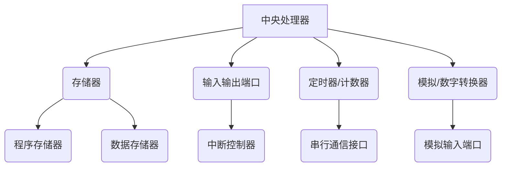

                 

关键词：单片机、嵌入式系统、编程、硬件、软件开发、微控制器、实时系统、物联网、微处理器

摘要：本文将深入探讨单片机编程的基础知识、核心概念、算法原理、数学模型、实践案例及未来应用前景。通过详细的讲解和实际代码实例，帮助读者全面掌握单片机编程技能，为嵌入式系统开发奠定坚实基础。

## 1. 背景介绍

单片机（Microcontroller Unit，简称MCU）是一种集成了处理器、内存、输入输出端口等功能的微型计算机系统。自20世纪70年代以来，单片机在嵌入式系统领域得到了广泛应用，其重要性不言而喻。嵌入式系统是一种专为实现特定功能而设计的计算机系统，广泛应用于工业自动化、智能家居、医疗设备、汽车电子等多个领域。

随着物联网（Internet of Things，IoT）的迅速发展，单片机编程在智能硬件、智能穿戴、智能交通等领域的重要性日益凸显。本文旨在介绍单片机编程的核心概念、算法原理和实践应用，为嵌入式系统开发者提供宝贵的参考。

## 2. 核心概念与联系

### 2.1 单片机的组成结构

单片机的组成结构如图所示：



### 2.2 单片机的运行原理

单片机的工作原理可以概括为以下几个步骤：

1. **加电启动**：单片机接收到电源信号后，从ROM中读取启动代码，初始化硬件资源。
2. **执行程序**：单片机根据程序存储器中的指令，逐条执行，完成各种操作。
3. **输入输出**：单片机通过输入输出端口与其他硬件设备进行通信。
4. **中断处理**：当单片机接收到外部中断信号时，暂停当前程序执行，转而处理中断请求。
5. **循环执行**：单片机在完成当前任务后，重新回到程序存储器，执行下一个任务。

## 3. 核心算法原理 & 具体操作步骤

### 3.1 算法原理概述

单片机编程的核心算法包括定时器、计数器、中断处理、串行通信等。以下是这些算法的基本原理：

1. **定时器**：定时器用于实现定时功能，如延时、计时等。单片机中的定时器通常由硬件实现，具有较高的定时精度。
2. **计数器**：计数器用于统计输入信号的脉冲个数，常用于频率测量、脉冲计数等应用。
3. **中断处理**：中断处理是单片机响应外部事件的重要机制，通过中断处理可以实现实时响应。
4. **串行通信**：串行通信是单片机与其他设备进行数据传输的重要手段，常用的串行通信协议包括UART、SPI、I2C等。

### 3.2 算法步骤详解

1. **定时器初始化**：

```c
// 假设使用定时器0，定时周期为1ms
T0MOD |= 0x01;  // 设置定时器0为定时模式
TMOD |= 0x01;  // 设置定时器0工作模式为模式1
TH0 = (65536 - 1000) / 1000;  // 定时周期1000us
TL0 = (65536 - 1000) % 1000;
ET0 = 1;  // 开启定时器0中断
EA = 1;  // 开总中断
TR0 = 1;  // 启动定时器0
```

2. **计数器初始化**：

```c
// 假设使用计数器0，计数脉冲个数
CT0 = 0;  // 清计数器0
TR0 = 1;  // 启计数器0
ET0 = 1;  // 开计数器0中断
```

3. **中断处理**：

```c
void Timer0_ISR(void) interrupt 1 {
    TH0 = (65536 - 1000) / 1000;  // 重装载定时器0的值
    TL0 = (65536 - 1000) % 1000;
    // 执行定时器中断任务
}

void Counter0_ISR(void) interrupt 3 {
    CT0 = 0;  // 清计数器0
    // 执行计数器中断任务
}
```

4. **串行通信**：

```c
// 假设使用UART通信
SCON = 0x50;  // 设置为8位数据位、1个停止位、可变波特率
TH1 = 0xFD;  // 设置高8位
TL1 = 0xFD;  // 设置低8位
TR1 = 1;  // 启动发送
```

### 3.3 算法优缺点

1. **定时器**：优点是定时精度高，缺点是定时范围有限。
2. **计数器**：优点是计数范围大，缺点是计数精度较低。
3. **中断处理**：优点是实现实时响应，缺点是中断响应时间可能较长。
4. **串行通信**：优点是数据传输速度快，缺点是通信协议复杂。

### 3.4 算法应用领域

1. **定时器**：常用于系统定时、时钟控制、定时触发等。
2. **计数器**：常用于频率测量、脉冲计数、周期测量等。
3. **中断处理**：常用于实时系统、事件响应等。
4. **串行通信**：常用于数据传输、设备控制等。

## 4. 数学模型和公式 & 详细讲解 & 举例说明

### 4.1 数学模型构建

单片机的数学模型主要包括定时器、计数器、中断处理和串行通信等模块。以下是这些模块的数学模型：

1. **定时器**：

$$
T = \frac{65536 - TH \times 256 - TL}{\text{时钟频率}}
$$

其中，$T$为定时周期，$TH$和$TL$分别为定时器的值，$时钟频率$为单片机的时钟频率。

2. **计数器**：

$$
N = CT \times 256 + CN
$$

其中，$N$为计数值，$CT$和$CN$分别为计数器的值。

3. **中断处理**：

$$
t_{\text{响应}} = \frac{\text{中断处理时间}}{\text{时钟频率}}
$$

其中，$t_{\text{响应}}$为中断响应时间。

4. **串行通信**：

$$
\text{波特率} = \frac{\text{时钟频率}}{16 \times (256 - \text{高8位}) \times (256 - \text{低8位})}
$$

其中，$\text{波特率}$为串行通信的波特率。

### 4.2 公式推导过程

1. **定时器**：

定时器的工作原理是定时器的计数值递减到0时，产生中断，重新加载定时器的值。因此，定时器的定时周期可以通过以下公式计算：

$$
T = \frac{65536 - TH \times 256 - TL}{\text{时钟频率}}
$$

其中，$65536$为定时器的最大计数值，$TH \times 256 + TL$为当前计数值。

2. **计数器**：

计数器的工作原理是计数器的计数值递增到$256$时，产生中断，重新清零。因此，计数器的计数值可以通过以下公式计算：

$$
N = CT \times 256 + CN
$$

其中，$CT$和$CN$分别为计数器的当前值。

3. **中断处理**：

中断处理的时间包括中断响应时间和中断处理时间。中断响应时间取决于中断控制器和中断处理程序的速度。中断处理时间取决于中断处理程序的任务复杂度和单片机的处理能力。因此，中断处理时间可以通过以下公式计算：

$$
t_{\text{响应}} = \frac{\text{中断处理时间}}{\text{时钟频率}}
$$

4. **串行通信**：

串行通信的波特率取决于单片机的时钟频率和串行通信的参数。根据串行通信的波特率公式，可以推导出以下关系：

$$
\text{波特率} = \frac{\text{时钟频率}}{16 \times (256 - \text{高8位}) \times (256 - \text{低8位})}
$$

### 4.3 案例分析与讲解

假设单片机的时钟频率为12MHz，我们需要计算定时器、计数器、中断处理和串行通信的参数。

1. **定时器**：

假设定时器设置为1ms，代入公式：

$$
T = \frac{65536 - TH \times 256 - TL}{\text{时钟频率}} = \frac{65536 - 0 \times 256 - 0}{12 \times 10^6} = 1 \text{ms}
$$

因此，定时器的高8位和低8位都设置为0。

2. **计数器**：

假设计数器设置为1000，代入公式：

$$
N = CT \times 256 + CN = 0 \times 256 + 1000 = 1000
$$

因此，计数器的高8位（$CT$）设置为0，低8位（$CN$）设置为1000。

3. **中断处理**：

假设中断处理程序执行时间为5ms，代入公式：

$$
t_{\text{响应}} = \frac{\text{中断处理时间}}{\text{时钟频率}} = \frac{5 \times 10^3}{12 \times 10^6} = 0.4167 \text{ms}
$$

因此，中断响应时间约为0.417ms。

4. **串行通信**：

假设串行通信的波特率为9600，代入公式：

$$
\text{波特率} = \frac{\text{时钟频率}}{16 \times (256 - \text{高8位}) \times (256 - \text{低8位})}
$$

解方程得：

$$
\text{高8位} = 0, \text{低8位} = 0xFD
$$

## 5. 项目实践：代码实例和详细解释说明

### 5.1 开发环境搭建

为了进行单片机编程，我们需要搭建一个开发环境。以下是常见的开发环境搭建步骤：

1. **硬件准备**：

选择一款适合的单片机开发板，如STM32、Arduino等。开发板应包含电源、单片机芯片、时钟电路、输入输出端口等基本硬件。

2. **软件准备**：

选择一款适合的集成开发环境（IDE），如Keil、Arduino IDE等。这些IDE提供了调试、编译、烧录等工具，方便开发者进行开发。

3. **驱动程序安装**：

根据开发板和IDE的要求，安装相应的驱动程序，以便IDE能够识别并调试开发板。

### 5.2 源代码详细实现

以下是一个简单的单片机程序实例，实现了一个定时器中断和计数器中断的功能。

```c
#include <reg52.h>

// 定时器0初始化
void Timer0_Init() {
    TMOD |= 0x01;  // 定时器0模式1
    TH0 = (65536 - 1000) / 1000;  // 定时器0高8位
    TL0 = (65536 - 1000) % 1000;  // 定时器0低8位
    ET0 = 1;  // 定时器0中断使能
    EA = 1;  // 总中断使能
    TR0 = 1;  // 定时器0启动
}

// 计数器0初始化
void Counter0_Init() {
    CT0 = 0;  // 计数器0清零
    TR0 = 1;  // 计数器0启动
    ET0 = 1;  // 计数器0中断使能
}

// 定时器0中断服务程序
void Timer0_ISR(void) interrupt 1 {
    TH0 = (65536 - 1000) / 1000;  // 定时器0高8位重装载
    TL0 = (65536 - 1000) % 1000;  // 定时器0低8位重装载
    // 定时器中断任务
}

// 计数器0中断服务程序
void Counter0_ISR(void) interrupt 3 {
    CT0 = 0;  // 计数器0清零
    // 计数器中断任务
}

void main() {
    Timer0_Init();
    Counter0_Init();
    while (1) {
        // 主循环任务
    }
}
```

### 5.3 代码解读与分析

1. **头文件引入**：

```c
#include <reg52.h>
```

该行代码引入了51单片机的寄存器定义头文件，方便使用单片机的寄存器。

2. **定时器0初始化**：

```c
void Timer0_Init() {
    TMOD |= 0x01;  // 定时器0模式1
    TH0 = (65536 - 1000) / 1000;  // 定时器0高8位
    TL0 = (65536 - 1000) % 1000;  // 定时器0低8位
    ET0 = 1;  // 定时器0中断使能
    EA = 1;  // 总中断使能
    TR0 = 1;  // 定时器0启动
}
```

该函数用于初始化定时器0。首先设置定时器0的工作模式为模式1，然后根据时钟频率和定时周期计算定时器的初值，最后使能定时器0中断、总中断和启动定时器0。

3. **计数器0初始化**：

```c
void Counter0_Init() {
    CT0 = 0;  // 计数器0清零
    TR0 = 1;  // 计数器0启动
    ET0 = 1;  // 计数器0中断使能
}
```

该函数用于初始化计数器0。首先将计数器0的计数值清零，然后启动计数器0中断和计数器0。

4. **定时器0中断服务程序**：

```c
void Timer0_ISR(void) interrupt 1 {
    TH0 = (65536 - 1000) / 1000;  // 定时器0高8位重装载
    TL0 = (65536 - 1000) % 1000;  // 定时器0低8位重装载
    // 定时器中断任务
}
```

该函数是定时器0的中断服务程序。每次定时器0计时到0时，将触发中断，执行该函数。函数中重装载定时器的值，以便继续计时。

5. **计数器0中断服务程序**：

```c
void Counter0_ISR(void) interrupt 3 {
    CT0 = 0;  // 计数器0清零
    // 计数器中断任务
}
```

该函数是计数器0的中断服务程序。每次计数器0计数值达到$256$时，将触发中断，执行该函数。函数中清零计数器0，以便继续计数。

6. **主函数**：

```c
void main() {
    Timer0_Init();
    Counter0_Init();
    while (1) {
        // 主循环任务
    }
}
```

主函数中首先调用定时器0和计数器0的初始化函数，然后进入无限循环，等待中断的发生。

### 5.4 运行结果展示

在开发环境中编译并烧录程序到单片机后，单片机会按照设定的定时器和计数器参数进行工作。通过观察定时器和计数器的计数值变化，可以验证程序的正确性。

## 6. 实际应用场景

单片机编程在嵌入式系统开发中具有广泛的应用。以下是一些典型的应用场景：

1. **智能家居**：单片机可以用于实现智能家居的各类功能，如智能灯控、窗帘控制、安防监控等。
2. **工业自动化**：单片机在工业自动化系统中用于控制各类设备，如机器人、生产线、传感器等。
3. **医疗设备**：单片机可以用于医疗设备的控制和数据处理，如心电图机、血糖仪、血压计等。
4. **汽车电子**：单片机在汽车电子领域用于控制发动机、安全系统、娱乐系统等。
5. **物联网**：单片机是物联网设备的核心控制单元，用于实现设备的互联互通和数据采集。

## 7. 工具和资源推荐

1. **学习资源推荐**：

   - 《单片机原理与接口技术》
   - 《嵌入式系统设计与开发》
   - 《物联网技术与应用》

2. **开发工具推荐**：

   - Keil：一款功能强大的单片机开发工具，支持多种单片机。
   - Arduino IDE：一款开源的单片机开发环境，适用于初学者。
   - PlatformIO：一款跨平台的嵌入式开发平台，支持多种单片机。

3. **相关论文推荐**：

   - "An Overview of Microcontroller-Based Embedded Systems"
   - "Design and Implementation of a Smart Home Automation System Using Microcontrollers"
   - "Application of Microcontrollers in the Internet of Things"

## 8. 总结：未来发展趋势与挑战

### 8.1 研究成果总结

单片机编程在嵌入式系统领域取得了显著成果，推动了智能家居、工业自动化、医疗设备、汽车电子等领域的发展。随着物联网的兴起，单片机编程将发挥更大的作用。

### 8.2 未来发展趋势

1. **高性能单片机的普及**：随着半导体技术的发展，高性能、低功耗的单片机将逐渐取代传统单片机，满足更多应用场景的需求。
2. **物联网技术的融合**：单片机编程将更加紧密地融合物联网技术，实现设备间的互联互通和数据共享。
3. **人工智能的融入**：单片机编程将逐渐引入人工智能算法，实现更智能的嵌入式系统。

### 8.3 面临的挑战

1. **复杂性增加**：随着单片机功能的增强，编程复杂性也随之增加，对开发者的技能要求更高。
2. **功耗问题**：在物联网等应用场景中，功耗控制仍然是一个重要挑战。
3. **安全性问题**：嵌入式系统面临的安全问题日益严重，需要加强安全防护措施。

### 8.4 研究展望

单片机编程领域将继续发展，为嵌入式系统带来更多创新和变革。未来研究应重点关注高性能单片机的开发、物联网技术的应用、人工智能算法的融入以及安全性问题。

## 9. 附录：常见问题与解答

1. **问题1**：如何选择适合的单片机？

   **解答**：根据应用需求选择合适的单片机，如高性能单片机适用于复杂应用，低功耗单片机适用于物联网设备。

2. **问题2**：如何进行单片机编程？

   **解答**：学习单片机原理和编程基础，掌握常用的开发工具和编程语言，如C语言和汇编语言。

3. **问题3**：如何调试单片机程序？

   **解答**：使用集成开发环境（IDE）提供的调试工具，如断点设置、单步执行、变量观察等。

## 作者署名

作者：禅与计算机程序设计艺术 / Zen and the Art of Computer Programming

---

以上是关于单片机编程的详细讲解和案例分析，希望对您在嵌入式系统开发中有所帮助。在未来的研究和实践中，不断探索和创新，为单片机编程领域的发展贡献力量。

