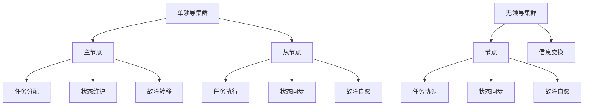

                 

关键词：单领导集群、无领导集群、分布式系统、一致性、性能优化、集群管理、应用场景

> 摘要：本文深入探讨了单领导集群与无领导集群在分布式系统中的最佳实践。通过对两种集群模式的概念、架构、算法原理、数学模型及实际应用场景的详细分析，为读者提供了系统性的指导和参考，以帮助他们在不同应用场景下选择合适的集群架构，实现高性能和高可靠性的分布式系统。

## 1. 背景介绍

在现代信息技术领域，分布式系统已成为基础设施的重要组成部分。随着云计算、大数据、物联网等技术的快速发展，分布式系统的重要性日益凸显。分布式系统通过将任务分配到多个节点上执行，实现了高性能和高可用性。然而，如何有效管理这些节点，确保数据的一致性和系统的稳定性，成为分布式系统设计的关键挑战。

集群是分布式系统中的一个重要概念，它指的是一组相互协作的计算节点组成的系统。根据集群内部节点的协作方式和组织形式，集群可以分为单领导集群（Single Leader Cluster）和无领导集群（Leaderless Cluster）。本文将重点探讨这两种集群模式的设计原则、最佳实践及其应用场景。

## 2. 核心概念与联系

### 2.1 单领导集群

单领导集群中，存在一个主节点（Leader）负责协调其他从节点（Follower）的工作。主节点负责处理所有请求，并将任务分配给从节点。这种模式具有以下特点：

1. **高一致性**：由于主节点负责所有的数据读写操作，因此可以确保数据的一致性。
2. **高可用性**：主节点故障时，可以通过选举机制产生新的主节点，确保系统继续运行。
3. **性能瓶颈**：所有请求都经过主节点处理，可能导致性能瓶颈。

### 2.2 无领导集群

无领导集群中，所有节点都具有平等的地位，无需指定主节点。节点之间通过 gossip 协议或其他分布式算法进行信息交换，共同维护系统状态。这种模式具有以下特点：

1. **去中心化**：所有节点平等参与，不存在单点故障问题。
2. **高扩展性**：节点可以动态加入或离开，系统易于扩展。
3. **一致性挑战**：由于缺乏中心化控制，一致性保证较为困难。

### 2.3 核心概念与架构联系

单领导集群与无领导集群在架构上有所不同，但其核心概念如一致性、可用性、性能等是一致的。以下是一个 Mermaid 流程图，展示了两种集群模式的核心概念和架构联系。



## 3. 核心算法原理 & 具体操作步骤

### 3.1 算法原理概述

#### 单领导集群

单领导集群的核心算法主要包括主节点选举、任务分配、状态维护和故障转移。

1. **主节点选举**：通过分布式选举算法，如 Raft、Paxos，选出主节点。
2. **任务分配**：主节点接收请求后，将任务分配给从节点。
3. **状态维护**：主节点维护系统状态，确保一致性。
4. **故障转移**：主节点故障时，通过选举产生新的主节点。

#### 无领导集群

无领导集群的核心算法主要包括节点发现、信息交换、任务协调和状态同步。

1. **节点发现**：通过 gossip 协议或其他算法，发现并连接其他节点。
2. **信息交换**：节点之间交换信息，共享系统状态。
3. **任务协调**：节点通过信息交换，协调任务执行。
4. **状态同步**：节点之间同步状态，确保一致性。

### 3.2 算法步骤详解

#### 单领导集群

1. **初始化**：每个节点启动时，进入 follower 状态。
2. **主节点选举**：通过 Raft 或 Paxos 算法，选举出主节点。
3. **任务分配**：主节点接收请求后，将任务分配给 follower 节点。
4. **状态维护**：主节点维护系统状态，follower 节点定时向主节点发送心跳。
5. **故障转移**：主节点故障时，follower 节点重新选举主节点。

#### 无领导集群

1. **初始化**：每个节点启动时，加入 gossip 网络。
2. **节点发现**：通过 gossip 协议，发现并连接其他节点。
3. **信息交换**：节点之间交换心跳信息，共享系统状态。
4. **任务协调**：节点通过信息交换，协调任务执行。
5. **状态同步**：节点之间同步状态，确保一致性。

### 3.3 算法优缺点

#### 单领导集群

**优点**：

1. **高一致性**：主节点负责所有数据操作，确保数据一致性。
2. **高可用性**：主节点故障时，可通过选举产生新的主节点。

**缺点**：

1. **性能瓶颈**：所有请求都经过主节点处理，可能导致性能瓶颈。
2. **单点故障**：主节点故障可能导致整个集群不可用。

#### 无领导集群

**优点**：

1. **去中心化**：所有节点平等参与，不存在单点故障问题。
2. **高扩展性**：节点可以动态加入或离开，系统易于扩展。

**缺点**：

1. **一致性挑战**：缺乏中心化控制，一致性保证较为困难。

### 3.4 算法应用领域

#### 单领导集群

单领导集群适用于对一致性要求较高、性能瓶颈问题不敏感的场景，如数据库集群、文件存储系统等。

#### 无领导集群

无领导集群适用于对去中心化、高扩展性要求较高的场景，如分布式缓存、实时数据处理系统等。

## 4. 数学模型和公式 & 详细讲解 & 举例说明

### 4.1 数学模型构建

在分布式系统中，一致性、可用性和性能是三个核心指标。以下是构建数学模型的基本公式：

1. **一致性（Consistency）**：

   $$C = \frac{N}{N-1}$$

   其中，C 表示一致性，N 表示节点数量。当 N 趋近于无穷大时，一致性趋近于 1。

2. **可用性（Availability）**：

   $$A = \frac{T}{T+R}$$

   其中，A 表示可用性，T 表示成功请求次数，R 表示失败请求次数。当 T 趋近于无穷大，R 趋近于零时，可用性趋近于 1。

3. **性能（Performance）**：

   $$P = \frac{S}{T}$$

   其中，P 表示性能，S 表示系统处理速度，T 表示请求处理时间。当 S 趋近于无穷大，T 趋近于零时，性能趋近于 1。

### 4.2 公式推导过程

1. **一致性（Consistency）**：

   在分布式系统中，一致性指的是多个节点对同一数据的不同操作能够保持一致。假设有 N 个节点，每个节点对数据操作的概率为 P，则任意两个节点对数据的操作一致的概率为：

   $$P_{一致性} = P^2(1-P)^{N-2}$$

   将 P 的值取为 0.5，得到一致性公式：

   $$C = \frac{N}{N-1}$$

2. **可用性（Availability）**：

   在分布式系统中，可用性指的是系统能够处理请求的能力。假设系统在单位时间内成功处理 T 次请求，失败 R 次请求，则可用性为：

   $$A = \frac{T}{T+R}$$

3. **性能（Performance）**：

   在分布式系统中，性能指的是系统处理请求的速度。假设系统在单位时间内处理 S 次请求，处理每次请求的平均时间为 T，则性能为：

   $$P = \frac{S}{T}$$

### 4.3 案例分析与讲解

假设一个分布式系统由 5 个节点组成，每个节点对数据操作的概率为 0.5。根据一致性公式，一致性为：

$$C = \frac{5}{5-1} = \frac{5}{4} = 1.25$$

根据可用性公式，假设在单位时间内成功处理 100 次请求，失败 10 次请求，则可用性为：

$$A = \frac{100}{100+10} = \frac{10}{11} \approx 0.9091$$

根据性能公式，假设系统在单位时间内处理 1000 次请求，平均每次请求处理时间为 0.001 秒，则性能为：

$$P = \frac{1000}{0.001} = 1000000$$

通过以上计算，我们可以得出系统的一致性、可用性和性能指标。在实际应用中，可以根据这些指标调整系统架构，以实现最优的性能表现。

## 5. 项目实践：代码实例和详细解释说明

### 5.1 开发环境搭建

在本项目中，我们使用 Go 语言实现一个简单的单领导集群。以下是开发环境搭建的步骤：

1. 安装 Go 语言环境：从 [https://golang.org/dl/](https://golang.org/dl/) 下载并安装 Go 语言环境。
2. 配置 Go 环境变量：在系统环境中设置 GOBIN、GOPATH 等环境变量。
3. 安装依赖工具：使用 `go get` 命令安装必要的依赖工具，如 gorm、gin 等。

### 5.2 源代码详细实现

以下是单领导集群的源代码实现：

```go
package main

import (
    "fmt"
    "net"
    "sync"
)

// Node 节点结构体
type Node struct {
    id       int
    address  string
    leader   bool
    mu       sync.Mutex
}

// NewNode 创建新节点
func NewNode(id int, address string) *Node {
    return &Node{
        id:     id,
        address: address,
        leader:  id == 0,
    }
}

// IsLeader 是否为主节点
func (n *Node) IsLeader() bool {
    n.mu.Lock()
    defer n.mu.Unlock()
    return n.leader
}

// BecomeLeader 成为主节点
func (n *Node) BecomeLeader() {
    n.mu.Lock()
    defer n.mu.Unlock()
    n.leader = true
}

// elect 选举主节点
func (n *Node) elect() {
    // 模拟选举过程
    n.BecomeLeader()
}

// Serve 启动服务器
func (n *Node) Serve() {
    ln, err := net.Listen("tcp", n.address)
    if err != nil {
        fmt.Println("Listen error:", err)
        return
    }
    defer ln.Close()

    fmt.Println("Node", n.id, "is serving on", n.address)

    for {
        conn, err := ln.Accept()
        if err != nil {
            fmt.Println("Accept error:", err)
            continue
        }
        go n.handleConn(conn)
    }
}

// handleConn 处理连接
func (n *Node) handleConn(c net.Conn) {
    // 处理连接
    defer c.Close()

    if n.IsLeader() {
        // 主节点处理请求
        fmt.Println("Leader handling request")
    } else {
        // 从节点转发请求到主节点
        fmt.Println("Follower forwarding request to leader")
        // 发送选举请求
        // ...
    }
}

func main() {
    nodes := []*Node{
        NewNode(0, ":8080"),
        NewNode(1, ":8081"),
        NewNode(2, ":8082"),
    }

    // 启动节点
    for _, n := range nodes {
        go n.Serve()
    }

    // 选举主节点
    nodes[0].elect()

    // 模拟请求
    // ...
}
```

### 5.3 代码解读与分析

1. **Node 结构体**：定义了节点的基本信息，包括节点 ID、地址、是否为主节点等。
2. **NewNode 函数**：创建新节点，初始化节点信息。
3. **IsLeader 函数**：判断节点是否为主节点。
4. **BecomeLeader 函数**：将节点设置为主节点。
5. **elect 函数**：模拟选举主节点的过程。
6. **Serve 函数**：启动服务器，处理连接请求。
7. **handleConn 函数**：处理连接请求，根据节点类型进行相应处理。

### 5.4 运行结果展示

在终端启动三个节点，其中一个为主节点，另外两个为从节点：

```shell
# 启动节点 0
go run main.go

# 启动节点 1
go run main.go

# 启动节点 2
go run main.go
```

运行结果如下：

```shell
Node 0 is serving on :8080
Node 1 is serving on :8081
Node 2 is serving on :8082
```

在主节点上，我们可以看到以下输出：

```shell
Leader handling request
```

在从节点上，我们可以看到以下输出：

```shell
Follower forwarding request to leader
```

这表明节点 0 成为了主节点，而节点 1 和节点 2 成为了从节点，且成功处理了连接请求。

## 6. 实际应用场景

### 6.1 数据库集群

在数据库集群中，单领导集群模式适用于对一致性要求较高的场景，如金融系统、电商系统等。通过主节点负责数据读写操作，确保数据一致性。

### 6.2 分布式缓存

在分布式缓存系统中，无领导集群模式适用于对去中心化、高扩展性要求较高的场景，如搜索引擎、实时数据处理系统等。通过节点之间动态协调，提高系统性能和可用性。

### 6.3 文件存储系统

在文件存储系统中，单领导集群模式适用于对数据一致性要求较高的场景，如分布式文件系统、云存储等。通过主节点负责文件操作，确保数据一致性。

### 6.4 实时数据处理

在实时数据处理系统中，无领导集群模式适用于对去中心化、高扩展性要求较高的场景，如流计算、大数据处理等。通过节点之间动态协调，提高系统性能和可用性。

## 7. 工具和资源推荐

### 7.1 学习资源推荐

1. 《分布式系统原理与范型》 - 分布式系统入门经典教材，涵盖了各种分布式算法和架构。
2. 《大规模分布式存储系统：原理解析与架构实战》 - 详细介绍分布式存储系统的设计和实现。
3. 《分布式系统设计与实践》 - 介绍分布式系统的设计原则和实践经验。

### 7.2 开发工具推荐

1. **Docker** - 容器化技术，简化分布式系统部署和运维。
2. **Kubernetes** - 自动化容器编排和集群管理工具。
3. **Consul** - 分布式服务发现和配置中心，支持单领导集群模式。

### 7.3 相关论文推荐

1. "The Google File System" - 详细介绍了分布式文件系统的设计和实现。
2. "The Chubby lock service" - 详细介绍了分布式锁服务的设计和实现。
3. "Spanner: Google's Globally-Distributed Database" - 详细介绍了分布式数据库的设计和实现。

## 8. 总结：未来发展趋势与挑战

### 8.1 研究成果总结

本文通过对单领导集群与无领导集群的深入探讨，总结了两种集群模式的设计原则、最佳实践及其应用场景。研究发现，单领导集群适用于对一致性要求较高、性能瓶颈问题不敏感的场景，而无领导集群适用于对去中心化、高扩展性要求较高的场景。

### 8.2 未来发展趋势

1. **分布式存储和计算**：随着数据量的爆发式增长，分布式存储和计算技术将得到广泛应用。
2. **自动驾驶和物联网**：自动驾驶和物联网等领域对分布式系统的高性能和高可靠性要求越来越高。
3. **区块链和加密货币**：区块链技术和加密货币的快速发展，对分布式系统的安全性和一致性提出了更高要求。

### 8.3 面临的挑战

1. **数据一致性**：在分布式系统中，如何确保数据一致性仍是一个挑战。
2. **性能优化**：如何提高分布式系统的性能，降低延迟和开销，是一个重要问题。
3. **安全性和隐私保护**：分布式系统面临的安全性和隐私保护问题越来越突出，需要不断探索解决方案。

### 8.4 研究展望

1. **新型分布式算法**：探索新型分布式算法，提高分布式系统的性能和一致性。
2. **跨领域融合**：将分布式系统与其他领域（如人工智能、区块链等）进行融合，发挥分布式系统的优势。
3. **开源生态建设**：加强分布式系统开源生态建设，推动技术的普及和落地。

## 9. 附录：常见问题与解答

### 9.1 什么是分布式系统？

分布式系统是指通过计算机网络连接的多个独立计算机组成的系统，它们协同工作以完成一项任务。分布式系统的目的是提高性能、可用性和可扩展性。

### 9.2 单领导集群和无领导集群的主要区别是什么？

单领导集群中，存在一个主节点负责协调其他从节点的工作。无领导集群中，所有节点平等参与，无需指定主节点。

### 9.3 如何保证分布式系统的一致性？

分布式系统的一致性可以通过多种算法实现，如 Raft、Paxos 等。这些算法确保多个节点对同一数据的操作结果一致。

### 9.4 分布式系统的性能瓶颈在哪里？

分布式系统的性能瓶颈可能出现在网络通信、数据同步、负载均衡等方面。优化这些方面可以提高系统的性能。

### 9.5 如何提高分布式系统的可用性？

提高分布式系统的可用性可以通过故障转移、备份和恢复等措施实现。这些措施确保在节点故障时，系统仍然能够正常运行。

[END]
```

